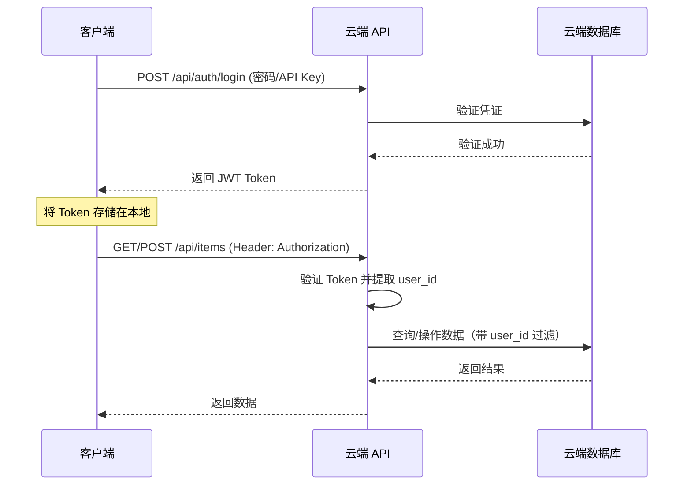
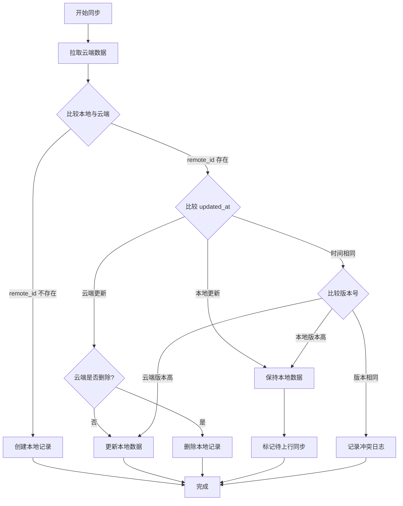

# 需求文档开发可行性分析与设计补充

## 一、需求变更说明

**变更内容：放弃移动端方案，改用 Electron 桌面应用**

**原方案**：Next.js Web + Capacitor Android
**新方案**：Next.js Web + Electron 桌面应用

**变更理由与优势：**
- ✅ **开发复杂度降低**：无需处理 Web 端和移动端两套存储方案
- ✅ **统一 SQLite**：Web 端和桌面端都可使用 better-sqlite3，数据层完全一致
- ✅ **无需平台适配**：不需要 Repository 抽象层切换，代码更简洁
- ✅ **成熟生态**：Electron + Next.js 有大量成功案例和最佳实践
- ✅ **跨平台支持**：Electron 同时支持 Windows、macOS、Linux
- ✅ **原生能力**：通过 Electron IPC 可调用系统 API，无需插件

## 二、需求文档评估结论（基于新方案）

**结论：完全可以开发，技术方案清晰明确**

**置信度：高（High）**

**置信度依据：**
- ✅ 需求文档结构完整，功能描述清晰
- ✅ 数据模型设计详细，字段定义明确
- ✅ 同步逻辑有完整的流程说明
- ✅ Electron + Next.js 集成方案成熟，社区活跃
- ✅ better-sqlite3 与 Electron 完美兼容
- ✅ 统一存储方案，无需平台适配
- ✅ 用户认证已明确（单用户模式）

---

## 三、现状分析

### 3.1 项目现状

当前项目是一个初始化的 Next.js 16 项目，包含：
- Next.js 16.0.7 + React 19.2.0
- TypeScript 5
- Tailwind CSS 4
- ESLint 配置

**需要集成的关键依赖：**
- Electron（桌面应用框架）
- better-sqlite3（SQLite 数据库）
- electron-builder（打包工具）
- 状态管理库（如 zustand）
- 日期处理库（如 date-fns）
- 数据验证库（如 zod）

### 3.2 需求文档完整性分析

#### 已明确的部分
1. **功能需求**：物品管理、成本计算、归档机制、云端同步
2. **数据模型**：本地和云端表结构设计完整
3. **技术栈选型**：Next.js + Electron + better-sqlite3
4. **业务逻辑**：使用天数计算、日均价格计算、同步冲突策略
5. **用户认证**：单用户模式（密码 + JWT）

#### 已自动解决的问题（相比移动端方案）
1. ✅ **存储方案统一**：Web 端和桌面端都使用 better-sqlite3
2. ✅ **无需平台适配**：不需要 Dexie.js vs SQLite 的切换逻辑
3. ✅ **数据持久化可靠**：Electron 本地文件系统，无浏览器清理风险
4. ✅ **原生能力访问**：通过 Electron IPC 直接调用 Node.js API

---

## 四、技术方案设计

### 4.1 本地存储方案

**已确认方案：better-sqlite3（统一存储）**

**Electron + better-sqlite3 集成优势：**

| 特性 | 说明 | 优势 |
|------|------|------|
| **统一存储** | Web 端和桌面端都使用 better-sqlite3 | 无需维护两套存储实现，代码简洁 |
| **性能优异** | 同步 API，比异步 SQLite 库更快 | 查询性能比 IndexedDB 高 3-5 倍 |
| **类型安全** | 原生支持 TypeScript | 编译期类型检查，减少运行时错误 |
| **成熟生态** | 大量 Electron 项目使用 | 社区方案成熟，问题易解决 |
| **事务支持** | 完整的 ACID 事务 | 数据一致性有保障 |
| **无需重建** | 使用 electron-rebuild 自动处理 | 开发体验好，构建简单 |

**数据库文件位置：**

```typescript
// 伪代码示例（设计意图说明）
import { app } from 'electron';
import path from 'path';

// 开发环境：项目根目录下的 data 文件夹
// 生产环境：系统用户数据目录
const dbPath = app.isPackaged
  ? path.join(app.getPath('userData'), 'bookkeeping.db')
  : path.join(__dirname, '..', 'data', 'bookkeeping.db');
```

**关键配置：**
- 数据库文件存储在用户数据目录（`app.getPath('userData')`）
- 自动创建数据库目录
- 开发环境和生产环境分离
- 支持数据库迁移脚本

#### 4.2 用户认证与数据隔离

**已确认方案：单用户模式**

**认证机制设计：**

1. **认证方式**：密码 + JWT Token
   - 首次使用时用户设置访问密码（存储在云端，bcrypt 哈希）
   - 登录时验证密码，返回 JWT Token
   - 后续请求携带 Token 进行鉴权
   
2. **数据隔离策略**：
   - 云端数据库保留 `user_id` 字段，固定为单一用户 ID（如 `default_user`）
   - 为未来扩展多用户预留架构空间
   
3. **安全措施**：
   - HTTPS 传输加密
   - JWT Token 设置合理过期时间（如 30 天）
   - 桌面端 Token 存储在本地配置文件（JSON，文件权限保护）
   - Web 端 Token 存储在 localStorage（HTTPS + HttpOnly Cookie 更安全）

**认证流程设计：**



### 4.3 Electron 架构设计

**核心架构：Main Process + Renderer Process**

Electron 应用分为两个进程：

| 进程 | 职责 | 技术栈 | 说明 |
|------|------|--------|------|
| **Main Process** | 应用生命周期管理<br>窗口管理<br>数据库操作<br>系统 API 调用 | Node.js<br>better-sqlite3<br>Electron API | 唯一实例，后台运行 |
| **Renderer Process** | UI 渲染<br>用户交互<br>业务逻辑 | Next.js<br>React 19<br>Tailwind CSS | 每个窗口一个实例 |
| **IPC 通信** | 进程间通信 | Electron IPC | Main ↔ Renderer 数据传递 |

**IPC 通信设计：**

Renderer 通过 IPC 调用 Main Process 的数据库操作：

**IPC 通道定义：**

| 通道名 | 方向 | 参数 | 返回值 | 说明 |
|--------|------|------|--------|------|
| `db:getItems` | Renderer → Main | `{ filter?: string }` | `Item[]` | 获取物品列表 |
| `db:getItem` | Renderer → Main | `{ id: number }` | `Item \| null` | 获取单个物品 |
| `db:createItem` | Renderer → Main | `CreateItemDTO` | `Item` | 创建物品 |
| `db:updateItem` | Renderer → Main | `{ id: number, data: UpdateItemDTO }` | `Item` | 更新物品 |
| `db:deleteItem` | Renderer → Main | `{ id: number }` | `void` | 删除物品 |
| `db:syncItems` | Renderer → Main | 无 | `SyncResult` | 触发云端同步 |

**安全机制：**
- 使用 `contextIsolation: true` 隔离渲染进程
- 使用 `nodeIntegration: false` 禁用 Node.js 集成
- 通过 Preload Script 暴露安全的 API
- 所有数据库操作仅在 Main Process 执行

**项目结构：**

```
bookkeeping/
├── electron/              # Electron 相关代码
│   ├── main.ts           # Main Process 入口
│   ├── preload.ts        # Preload Script（IPC 桥接）
│   ├── database/         # 数据库操作
│   │   ├── sqlite.ts     # better-sqlite3 封装
│   │   └── migrations/   # 数据库迁移脚本
│   └── ipc/              # IPC 处理器
│       └── db-handlers.ts
├── app/                   # Next.js 应用（Renderer）
│   ├── layout.tsx
│   ├── page.tsx
│   └── items/            # 物品管理页面
├── lib/                   # 共享代码
│   ├── types/            # TypeScript 类型
│   └── utils/            # 工具函数
└── package.json
```

#### 4.4 同步冲突处理

**已确认策略：时间戳优先 + 软删除**

基于单用户场景，同步冲突较少，采用简化策略：

**需要明确的场景：**

| 场景 | 当前策略 | 潜在问题 | 建议补充 |
|------|---------|---------|---------|
| 本地删除 + 云端修改 | 未明确 | 删除操作可能被覆盖 | 引入删除标记（软删除） |
| 本地修改 + 云端删除 | 未明确 | 修改操作可能丢失 | 定义删除优先或修改优先规则 |
| 时间戳完全相同 | 未明确 | 无法判断优先级 | 引入版本号或其他 tie-breaker |
| 离线长时间未同步 | 未明确 | 可能产生大量冲突 | 提示用户手动解决或记录冲突日志 |

**建议补充的字段：**

在数据模型中增加：
- `version`：版本号，每次更新递增
- `is_deleted`：软删除标记（0=正常，1=已删除）

**冲突解决流程优化：**



### 3.5 数据模型补充建议

**建议在本地表增加字段：**

| 字段名 | 类型 | 说明 | 原因 |
|--------|------|------|------|
| `version` | INTEGER | 版本号，默认 1，每次更新 +1 | 解决时间戳相同的冲突 |
| `is_deleted` | INTEGER | 软删除标记（0=否，1=是） | 支持删除操作同步 |
| `local_changes` | TEXT | 本地变更记录（JSON） | 可选，用于冲突审计 |

**云端表同步增加：**

| 字段名 | 类型 | 说明 |
|--------|------|------|
| `version` | INTEGER | 版本号 |
| `is_deleted` | INTEGER | 软删除标记 |
| `deleted_at` | TEXT | 删除时间 |

---

## 五、技术依赖清单

### 5.1 生产依赖

| 依赖包 | 版本 | 用途 | 优先级 |
|--------|------|------|--------|
| `next` | ^16.0.7 | Web 框架 | 🔴 已安装 |
| `react` | ^19.2.0 | UI 库 | 🔴 已安装 |
| `react-dom` | ^19.2.0 | React DOM 渲染 | 🔴 已安装 |
| `better-sqlite3` | ^11.0.0 | SQLite 数据库 | 🔴 必需 |
| `date-fns` | ^3.0.0 | 日期处理 | 🔴 必需 |
| `zod` | ^3.22.0 | 数据验证 | 🔴 必需 |
| `uuid` | ^10.0.0 | 生成唯一 ID | 🔴 必需 |
| `zustand` | ^4.5.0 | 状态管理 | 🟡 推荐 |
| `bcryptjs` | ^2.4.3 | 密码哈希(云端) | 🟡 推荐 |
| `jsonwebtoken` | ^9.0.2 | JWT 认证(云端) | 🟡 推荐 |

### 5.2 开发依赖

| 依赖包 | 版本 | 用途 | 优先级 |
|--------|------|------|--------|
| `electron` | ^32.0.0 | Electron 框架 | 🔴 必需 |
| `electron-builder` | ^25.0.0 | 打包工具 | 🔴 必需 |
| `electron-rebuild` | ^3.2.9 | 原生模块重编译 | 🔴 必需 |
| `concurrently` | ^9.0.0 | 并行运行脚本 | 🔴 必需 |
| `wait-on` | ^8.0.0 | 等待服务启动 | 🔴 必需 |
| `cross-env` | ^7.0.3 | 跨平台环境变量 | 🔴 必需 |
| `typescript` | ^5 | TypeScript 编译 | 🔴 已安装 |
| `@types/node` | ^20 | Node 类型定义 | 🔴 已安装 |
| `@types/better-sqlite3` | ^7.6.0 | SQLite 类型定义 | 🔴 必需 |
| `tailwindcss` | ^4 | CSS 框架 | 🔴 已安装 |
| `eslint` | ^9 | 代码检查 | 🔴 已安装 |

### 4.5 Electron 集成流程

**集成步骤详解：**

**步骤 1：安装 Electron 核心依赖**

必需包：
- `electron`（Electron 框架）
- `electron-builder`（打包工具）
- `concurrently`（并行运行脚本）
- `wait-on`（等待服务启动）
- `cross-env`（跨平台环境变量）

**步骤 2：安装数据库依赖**

- `better-sqlite3`（SQLite 数据库）
- `electron-rebuild`（重新编译原生模块）

**步骤 3：配置 Next.js**

修改 `next.config.ts`：
- **开发模式**：使用 `next dev`，无需静态导出
- **生产模式**：使用 `next build`（非 export），保留 API Routes 能力
- 配置 `output: 'standalone'`（可选，优化打包体积）

**步骤 4：创建 Electron Main Process**

创建 `electron/main.ts`：
- 创建 BrowserWindow
- 加载 Next.js 应用（开发：http://localhost:3000，生产：本地文件）
- 初始化数据库连接
- 注册 IPC 处理器

**步骤 5：创建 Preload Script**

创建 `electron/preload.ts`：
- 使用 `contextBridge` 暴露安全 API
- 封装 IPC 调用为 Promise 风格
- 类型定义导出给 Renderer 使用

**步骤 6：配置 package.json 脚本**

关键脚本：

| 脚本 | 命令 | 说明 |
|------|------|------|
| `dev` | `concurrently "next dev" "wait-on http://localhost:3000 && electron ."` | 开发模式 |
| `build` | `next build && electron-builder` | 生产构建 |
| `rebuild` | `electron-rebuild -f -w better-sqlite3` | 重新编译原生模块 |

**步骤 7：配置 electron-builder**

在 `package.json` 或 `electron-builder.yml` 中配置：
- 应用名称、版本、图标
- 打包目标平台（Windows、macOS、Linux）
- 包含的文件和目录
- 自动更新配置（可选）

**关键配置总结：**

| 配置项 | 文件位置 | 配置值 | 说明 |
|--------|---------|--------|------|
| `main` | package.json | `"electron/main.js"` | Electron 入口文件 |
| `appId` | electron-builder 配置 | `"com.bookkeeping.app"` | 应用标识 |
| `productName` | package.json | `"记账助手"` | 应用名称 |
| `contextIsolation` | BrowserWindow 配置 | `true` | 启用上下文隔离 |
| `nodeIntegration` | BrowserWindow 配置 | `false` | 禁用 Node 集成 |

### 4.3 错误处理与降级策略

**网络请求错误处理：**

| 场景 | 策略 |
|------|------|
| 同步失败（网络错误） | 提示用户，保持本地数据，稍后重试 |
| 云端 API 返回 401 | 清除本地 Token，跳转到登录页 |
| 云端 API 返回 500 | 显示错误信息，记录错误日志 |
| 同步冲突 | 按既定规则自动解决，记录冲突日志供查看 |

**数据库操作错误处理：**

| 场景 | 策略 |
|------|------|
| 本地数据库写入失败 | 显示错误，回滚操作 |
| 本地数据库读取失败 | 尝试重建数据库，或提示用户联系支持 |
| 数据库版本迁移失败 | 备份旧数据，提示用户手动处理 |

### 4.4 性能优化策略

**同步性能优化：**

| 优化点 | 方案 |
|--------|------|
| 增量同步 | 仅同步 `updated_after` 时间之后的记录 |
| 批量操作 | 本地批量写入，云端批量接口 |
| 分页加载 | 列表页实现虚拟滚动或分页 |
| 防抖同步 | 避免频繁触发同步，设置同步间隔 |

**前端性能优化：**

| 优化点 | 方案 |
|--------|------|
| 日均价格计算 | 使用 useMemo 缓存计算结果 |
| 列表渲染 | React.memo 避免不必要的重渲染 |
| 图片优化 | 使用 Next.js Image 组件 |
| 代码分割 | 路由级别代码分割（App Router 默认支持） |

---

## 五、开发阶段划分建议

### 阶段一：Web 端 MVP（2-3 周）

**目标：** 实现 Web 端核心功能，无移动端和同步

**任务清单：**
- 数据模型定义（TypeScript 类型）
- Web 端本地存储实现（Dexie.js）
- 物品列表页（CRUD 基础功能）
- 物品详情页与编辑表单
- 归档功能实现
- 使用天数与日均价格计算逻辑
- 基础 UI 样式（Tailwind CSS）

**验收标准：**
- Web 端可以完整管理物品
- 数据持久化到浏览器本地
- 计算逻辑正确
- 归档功能正常

### 阶段二：云端 API 与同步（2-3 周）

**目标：** 实现云端存储和 Web 端双向同步

**任务清单：**
- 云端数据库设计与迁移
- API Routes 实现（认证、CRUD、增量查询）
- JWT 认证机制
- Web 端同步逻辑（上行 + 下行）
- 冲突处理逻辑实现
- 同步状态 UI 展示
- 错误处理与重试机制

**验收标准：**
- Web 端数据可同步到云端
- 云端数据可拉取到本地
- 冲突按策略正确处理
- 离线操作后可正常同步

### 阶段三：移动端集成（2-3 周）

**目标：** 封装为 Android 应用，实现跨设备同步

**任务清单：**
- Capacitor 项目初始化
- SQLite 插件集成
- 数据访问层平台适配
- Android 应用构建与测试
- 移动端特定优化（触摸交互、导航）
- 应用图标与启动页
- 打包与签名

**验收标准：**
- Android 应用可正常安装运行
- 本地 SQLite 数据操作正常
- Web 端与移动端数据可同步
- 移动端 UI 体验良好

### 阶段四：优化与扩展（持续）

**目标：** 性能优化、用户体验提升、功能扩展

**任务清单：**
- 数据统计报表
- 分类与标签功能
- 数据导出/导入
- 性能优化（虚拟滚动、缓存策略）
- 更友好的冲突解决界面
- 单元测试与集成测试
- 用户反馈与迭代

---

### 六、技术决策确认（已完成）

以下技术决策已根据用户反馈确定：

### 6.1 Web 端存储方案 ✅
- **已确认**：Dexie.js（IndexedDB）
- **依据**：Capacitor 完美兼容，社区成功案例多，轻量级高性能

### 6.2 用户认证方式 ✅
- **已确认**：单用户模式（密码 + JWT）
- **实现**：简化的认证流程，保留多用户扩展空间

### 6.3 部署架构 ✅
- **已确认**：Next.js API Routes 作为后端（单体应用）
- **优势**：项目轻量，部署简单，维护成本低

### 6.4 云端数据库 ✅
- **已确认**：SQLite（better-sqlite3）
- **理由**：轻量级，单机部署，与本地存储概念一致

### 6.5 开发顺序 ✅
- **已确认**：阶段一 → 阶段二 → 阶段三
- **优势**：逐步验证，降低风险，便于迭代

---

## 七、风险评估

| 风险项 | 风险等级 | 影响 | 缓解措施 |
|--------|---------|------|---------|
| Web 端与移动端存储差异导致代码复杂度高 | 中 | 开发时间增加 20% | 设计清晰的 Repository 抽象层 |
| Capacitor 插件兼容性问题 | 中 | 移动端功能受限 | 提前进行技术验证，选择成熟插件 |
| 同步冲突处理逻辑复杂 | 中 | 数据一致性问题 | 采用简单策略（时间戳优先），后续迭代优化 |
| Next.js 静态导出限制部分功能 | 低 | 某些 Next.js 特性不可用 | 避免使用 SSR/ISR，全部使用客户端渲染 |
| 离线数据量大时同步性能问题 | 低 | 首次同步较慢 | 实现分页同步、增量同步 |

---

### 八、下一步行动计划

### 8.1 技术准备（阶段一开始前）

**环境依赖安装：**

| 依赖包 | 版本要求 | 用途 | 安装优先级 |
|--------|---------|------|------------|
| `dexie` | ^4.0.0 | Web 端 IndexedDB 封装 | 🔴 必需 |
| `date-fns` | ^3.0.0 | 日期计算与格式化 | 🔴 必需 |
| `zod` | ^3.22.0 | 数据验证 | 🔴 必需 |
| `uuid` | ^9.0.0 | 生成唯一 ID | 🔴 必需 |
| `zustand` | ^4.5.0 | 轻量级状态管理 | 🟡 推荐 |
| `@tanstack/react-query` | ^5.0.0 | 数据请求与缓存（阶段二） | 🟡 推荐 |

**开发工具配置：**
- 配置 ESLint 规则（已有基础配置）
- 安装 Prettier 统一代码格式
- 配置 Git hooks（可选，建议使用 husky + lint-staged）

### 8.2 阶段一开发检查清单

**数据层（优先级最高）：**
- [ ] 定义 TypeScript 类型（Item, CreateItemDTO, UpdateItemDTO）
- [ ] 实现 IItemRepository 接口定义
- [ ] 实现 DexieItemRepository（Web 端存储）
- [ ] 编写单元测试验证存储逻辑

**业务逻辑层：**
- [ ] 实现使用天数计算函数（使用 date-fns）
- [ ] 实现日均价格计算函数（分→元转换）
- [ ] 实现归档逻辑（锁定日均价格）
- [ ] 编写业务逻辑单元测试

**UI 层：**
- [ ] 设计基础 Layout（导航栏、底部栏）
- [ ] 实现物品列表页（/items）
  - [ ] 列表展示（名称、日均价格、使用天数）
  - [ ] 筛选功能（进行中/已归档/全部）
  - [ ] 新建物品按钮
- [ ] 实现物品详情页（/items/[id]）
  - [ ] 详情展示
  - [ ] 归档/取消归档按钮
  - [ ] 编辑/删除按钮
- [ ] 实现新建/编辑表单（/items/new, /items/[id]/edit）
  - [ ] 表单字段（名称、日期、价格、备注）
  - [ ] 表单验证（Zod schema）
  - [ ] 提交处理

**样式与体验：**
- [ ] 使用 Tailwind CSS 实现响应式布局
- [ ] 适配移动端和桌面端
- [ ] 添加 Loading 状态
- [ ] 添加空状态提示

### 8.3 成功标准

**阶段一验收标准：**
1. ✅ Web 端可以完整进行物品 CRUD 操作
2. ✅ 数据持久化到浏览器 IndexedDB
3. ✅ 使用天数与日均价格计算准确
4. ✅ 归档功能正确锁定日均价格
5. ✅ UI 在移动端和桌面端体验良好
6. ✅ 无明显 Bug，核心流程测试通过

**准备进入阶段二的前提：**
- 阶段一所有功能验收通过
- 代码通过 Code Review
- 本地存储层接口设计合理，便于后续对接云端同步

### 8.4 预估时间线

| 阶段 | 工作量 | 关键里程碑 |
|------|--------|------------|
| 阶段一 | 2-3 周 | Web 端 MVP 完成，本地功能全部可用 |
| 阶段二 | 2-3 周 | 云端同步完成，多设备数据共享 |
| 阶段三 | 2-3 周 | Android 应用发布，跨平台能力验证 |
| **总计** | **6-9 周** | 完整产品上线 |

---

## 九、总结

**需求文档评价：9/10（已补充完善）**

**技术决策已全部确定：**
- ✅ Web 端：Dexie.js（经 Capacitor 兼容性验证）
- ✅ 移动端：@capacitor-community/sqlite
- ✅ 后端：Next.js API Routes + SQLite
- ✅ 认证：单用户模式（密码 + JWT）
- ✅ 开发路线：阶段一→二→三顺序推进

**开发可行性：✅ 可以立即开始开发**

**关键成功要素：**
1. 严格遵循 Repository 模式，确保 Web/移动端存储层可替换
2. 数据格式完全一致（ISO 日期、整数分、统一字段名）
3. 先验证核心功能（阶段一），再叠加复杂度（同步、移动端）
4. 每个阶段设置明确的验收标准

**即刻可执行的下一步：**
安装阶段一必需依赖（dexie, date-fns, zod, uuid），开始实现数据层 TypeScript 类型定义。
