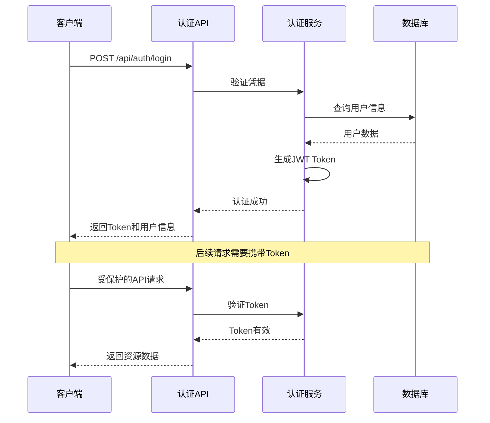

# API接口参考

<cite>
**本文档中引用的文件**
- [app/api/auth/login/route.ts](file://app/api/auth/login/route.ts)
- [app/api/items/route.ts](file://app/api/items/route.ts)
- [app/api/items/[id]/route.ts](file://app/api/items/[id]/route.ts)
- [app/api/tags/route.ts](file://app/api/tags/route.ts)
- [lib/auth/jwt.ts](file://lib/auth/jwt.ts)
- [lib/auth/middleware.ts](file://lib/auth/middleware.ts)
- [lib/db/repository.ts](file://lib/db/repository.ts)
- [lib/types/item.ts](file://lib/types/item.ts)
- [lib/types/tag.ts](file://lib/types/tag.ts)
- [lib/api/client.ts](file://lib/api/client.ts)
- [README.md](file://README.md)
</cite>

## 目录
1. [简介](#简介)
2. [认证机制](#认证机制)
3. [API端点概览](#api端点概览)
4. [认证API](#认证api)
5. [物品管理API](#物品管理api)
6. [标签管理API](#标签管理api)
7. [错误处理](#错误处理)
8. [常见问题](#常见问题)

## 简介

本系统提供RESTful API接口，支持个人物品成本管理功能。API采用JWT认证机制，支持物品的完整CRUD操作，并提供归档状态管理功能。

### 基础信息
- **基础URL**: `https://your-domain.com/api`
- **内容类型**: `application/json`
- **编码格式**: UTF-8

## 认证机制

系统使用JWT（JSON Web Token）进行用户认证，所有受保护的API都需要在请求头中包含有效的认证令牌。

### 认证流程



**图表来源**
- [app/api/auth/login/route.ts](file://app/api/auth/login/route.ts#L4-L47)
- [lib/auth/jwt.ts](file://lib/auth/jwt.ts#L16-L30)
- [lib/auth/middleware.ts](file://lib/auth/middleware.ts#L8-L33)

### JWT配置

| 参数 | 值 | 说明 |
|------|-----|------|
| 密钥 | `process.env.JWT_SECRET` | JWT签名密钥（生产环境必需设置） |
| 过期时间 | 7天 | Token有效期 |
| 签名算法 | HS256 | HMAC SHA-256算法 |

**章节来源**
- [lib/auth/jwt.ts](file://lib/auth/jwt.ts#L1-L57)
- [lib/auth/middleware.ts](file://lib/auth/middleware.ts#L1-L34)

## API端点概览

| HTTP方法 | URL路径 | 描述 | 认证要求 |
|----------|---------|------|----------|
| POST | `/api/auth/login` | 用户登录认证 | 否 |
| GET | `/api/items` | 获取物品列表 | 是 |
| POST | `/api/items` | 创建新物品 | 是 |
| GET | `/api/items/:id` | 获取单个物品 | 是 |
| PUT | `/api/items/:id` | 更新物品信息 | 是 |
| DELETE | `/api/items/:id` | 删除物品 | 是 |
| GET | `/api/tags` | 获取标签列表 | 是 |
| POST | `/api/tags` | 创建新标签 | 是 |
| GET | `/api/tags/:id` | 获取单个标签 | 是 |
| PUT | `/api/tags/:id` | 更新标签信息 | 是 |
| DELETE | `/api/tags/:id` | 删除标签 | 是 |
| GET | `/api/items/:id/tags` | 获取物品标签 | 是 |
| PUT | `/api/items/:id/tags` | 设置物品标签 | 是 |

## 认证API

### POST /api/auth/login

用户登录接口，验证凭据并返回JWT令牌。

#### 请求格式

**请求头**
```http
Content-Type: application/json
```

**请求体**（JSON Schema）
```json
{
  "type": "object",
  "properties": {
    "username": {
      "type": "string",
      "minLength": 1,
      "description": "用户名"
    },
    "password": {
      "type": "string",
      "minLength": 1,
      "description": "密码"
    }
  },
  "required": ["username", "password"]
}
```

#### 成功响应

**状态码**: `200 OK`

```json
{
  "success": true,
  "data": {
    "token": "eyJhbGciOiJIUzI1NiIsInR5cCI6IkpXVCJ9...",
    "user": {
      "id": "user123",
      "username": "admin"
    }
  }
}
```

#### 错误响应

| 错误代码 | 错误信息 | 说明 |
|----------|----------|------|
| 400 | "用户名和密码不能为空" | 缺少必要参数 |
| 401 | "用户名或密码错误" | 凭据验证失败 |
| 500 | "登录失败，请稍后重试" | 服务器内部错误 |

#### curl示例

```bash
curl -X POST https://your-domain.com/api/auth/login \
  -H "Content-Type: application/json" \
  -d '{
    "username": "admin",
    "password": "admin123"
  }'
```

**章节来源**
- [app/api/auth/login/route.ts](file://app/api/auth/login/route.ts#L4-L47)

## 物品管理API

### GET /api/items

获取物品列表，支持按归档状态筛选。

#### 查询参数

| 参数名 | 类型 | 必需 | 说明 |
|--------|------|------|------|
| `archived` | number | 否 | 归档状态筛选：0=未归档，1=已归档 |

#### 请求示例

```bash
# 获取所有物品
curl -X GET https://your-domain.com/api/items \
  -H "Authorization: Bearer YOUR_JWT_TOKEN"

# 获取已归档物品
curl -X GET https://your-domain.com/api/items?archived=1 \
  -H "Authorization: Bearer YOUR_JWT_TOKEN"
```

#### 响应格式

**成功响应**（状态码：200 OK）
```json
{
  "success": true,
  "data": [
    {
      "id": 1,
      "name": "笔记本电脑",
      "purchased_at": "2024-01-15",
      "price_cents": 89999,
      "remark": "工作用",
      "archived": 0,
      "created_at": "2024-01-15T10:30:00Z",
      "updated_at": "2024-01-15T10:30:00Z"
    }
  ]
}
```

### POST /api/items

创建新的物品记录。

#### 请求格式

**请求头**
```http
Content-Type: application/json
```

**请求体**（JSON Schema）
```json
{
  "type": "object",
  "properties": {
    "name": {
      "type": "string",
      "minLength": 1,
      "description": "物品名称"
    },
    "purchased_at": {
      "type": "string",
      "format": "date",
      "description": "购买日期（YYYY-MM-DD）"
    },
    "price_cents": {
      "type": "number",
      "minimum": 0,
      "description": "购买价格（分）"
    },
    "remark": {
      "type": "string",
      "description": "备注信息"
    }
  },
  "required": ["name", "purchased_at", "price_cents"]
}
```

#### 成功响应

**状态码**: `201 Created`

```json
{
  "success": true,
  "data": {
    "id": 2,
    "name": "无线鼠标",
    "purchased_at": "2024-02-01",
    "price_cents": 2999,
    "remark": "",
    "archived": 0,
    "created_at": "2024-02-01T14:20:00Z",
    "updated_at": "2024-02-01T14:20:00Z"
  }
}
```

#### 错误响应

| 错误代码 | 错误信息 | 说明 |
|----------|----------|------|
| 400 | "缺少必填字段：name, purchased_at, price_cents" | 缺少必要参数 |
| 400 | "价格必须为非负数" | 价格参数无效 |
| 500 | "创建物品失败" | 服务器内部错误 |

### GET /api/items/:id

获取指定ID的物品详细信息。

#### 路径参数

| 参数名 | 类型 | 必需 | 说明 |
|--------|------|------|------|
| `id` | number | 是 | 物品唯一标识符 |

#### curl示例

```bash
curl -X GET https://your-domain.com/api/items/1 \
  -H "Authorization: Bearer YOUR_JWT_TOKEN"
```

#### 响应格式

**成功响应**（状态码：200 OK）
```json
{
  "success": true,
  "data": {
    "id": 1,
    "name": "笔记本电脑",
    "purchased_at": "2024-01-15",
    "price_cents": 89999,
    "remark": "工作用",
    "archived": 0,
    "archived_at": null,
    "archived_daily_price_cents": null,
    "created_at": "2024-01-15T10:30:00Z",
    "updated_at": "2024-01-15T10:30:00Z"
  }
}
```

### PUT /api/items/:id

更新指定ID的物品信息。

#### 请求格式

**请求头**
```http
Content-Type: application/json
```

**请求体**（部分字段可选）
```json
{
  "type": "object",
  "properties": {
    "name": {
      "type": "string",
      "description": "物品名称"
    },
    "purchased_at": {
      "type": "string",
      "format": "date",
      "description": "购买日期"
    },
    "price_cents": {
      "type": "number",
      "minimum": 0,
      "description": "购买价格（分）"
    },
    "remark": {
      "type": "string",
      "description": "备注"
    },
    "archived": {
      "type": "number",
      "enum": [0, 1],
      "description": "归档状态"
    },
    "archived_at": {
      "type": ["string", "null"],
      "format": "date-time",
      "description": "归档时间"
    },
    "archived_daily_price_cents": {
      "type": ["number", "null"],
      "minimum": 0,
      "description": "归档日均价格（分）"
    }
  }
}
```

#### 归档状态说明

物品支持两种状态：
- **未归档（archived: 0）**: 正常使用的物品，会自动计算日均成本
- **已归档（archived: 1）**: 退役或不再使用的物品，锁定最终成本

#### curl示例

```bash
# 更新物品基本信息
curl -X PUT https://your-domain.com/api/items/1 \
  -H "Authorization: Bearer YOUR_JWT_TOKEN" \
  -H "Content-Type: application/json" \
  -d '{
    "name": "升级版笔记本电脑",
    "price_cents": 99999
  }'

# 归档物品
curl -X PUT https://your-domain.com/api/items/1 \
  -H "Authorization: Bearer YOUR_JWT_TOKEN" \
  -H "Content-Type: application/json" \
  -d '{
    "archived": 1,
    "archived_at": "2024-12-31T00:00:00Z",
    "archived_daily_price_cents": 100
  }'
```

### DELETE /api/items/:id

删除指定ID的物品。

#### curl示例

```bash
curl -X DELETE https://your-domain.com/api/items/1 \
  -H "Authorization: Bearer YOUR_JWT_TOKEN"
```

#### 响应格式

**成功响应**（状态码：200 OK）
```json
{
  "success": true,
  "message": "删除成功"
}
```

**章节来源**
- [app/api/items/route.ts](file://app/api/items/route.ts#L1-L75)
- [app/api/items/[id]/route.ts](file://app/api/items/[id]/route.ts#L1-L134)
- [lib/db/repository.ts](file://lib/db/repository.ts#L1-L156)

## 标签管理API

### GET /api/tags

获取所有标签列表。

#### curl示例

```bash
curl -X GET https://your-domain.com/api/tags \
  -H "Authorization: Bearer YOUR_JWT_TOKEN"
```

#### 响应格式

```json
{
  "success": true,
  "data": [
    {
      "id": 1,
      "name": "电子产品",
      "color": "#FF5733",
      "created_at": "2024-01-15T10:00:00Z"
    }
  ]
}
```

### POST /api/tags

创建新标签。

#### 请求体

```json
{
  "type": "object",
  "properties": {
    "name": {
      "type": "string",
      "minLength": 1,
      "maxLength": 50,
      "description": "标签名称"
    },
    "color": {
      "type": "string",
      "pattern": "^#[0-9A-Fa-f]{6}$",
      "description": "十六进制颜色值（可选）"
    }
  },
  "required": ["name"]
}
```

#### curl示例

```bash
curl -X POST https://your-domain.com/api/tags \
  -H "Authorization: Bearer YOUR_JWT_TOKEN" \
  -H "Content-Type: application/json" \
  -d '{
    "name": "办公用品",
    "color": "#33FF57"
  }'
```

### GET /api/items/:id/tags

获取物品关联的标签列表。

#### curl示例

```bash
curl -X GET https://your-domain.com/api/items/1/tags \
  -H "Authorization: Bearer YOUR_JWT_TOKEN"
```

### PUT /api/items/:id/tags

设置物品的标签关联。

#### 请求体

```json
{
  "type": "object",
  "properties": {
    "tag_ids": {
      "type": "array",
      "items": {
        "type": "number"
      },
      "description": "标签ID数组"
    }
  },
  "required": ["tag_ids"]
}
```

#### curl示例

```bash
curl -X PUT https://your-domain.com/api/items/1/tags \
  -H "Authorization: Bearer YOUR_JWT_TOKEN" \
  -H "Content-Type: application/json" \
  -d '{
    "tag_ids": [1, 2, 3]
  }'
```

**章节来源**
- [app/api/tags/route.ts](file://app/api/tags/route.ts#L1-L73)
- [lib/types/tag.ts](file://lib/types/tag.ts#L1-L59)

## 错误处理

### HTTP状态码

| 状态码 | 含义 | 使用场景 |
|--------|------|----------|
| 200 | 成功 | 请求成功执行 |
| 201 | 创建成功 | POST请求创建资源成功 |
| 400 | 请求错误 | 参数格式错误或缺失 |
| 401 | 未授权 | 缺少认证或认证失败 |
| 404 | 资源不存在 | 请求的资源不存在 |
| 409 | 冲突 | 资源冲突（如标签名称重复） |
| 500 | 服务器错误 | 服务器内部错误 |

### 错误响应格式

所有错误响应都遵循统一格式：

```json
{
  "error": "错误描述信息",
  "success": false
}
```

### 常见错误场景

#### 认证相关错误

```json
{
  "error": "未提供认证令牌",
  "success": false
}
```

```json
{
  "error": "认证令牌无效或已过期",
  "success": false
}
```

#### 数据验证错误

```json
{
  "error": "缺少必填字段：name, purchased_at, price_cents",
  "success": false
}
```

```json
{
  "error": "标签名称已存在",
  "success": false
}
```

#### 资源操作错误

```json
{
  "error": "物品不存在",
  "success": false
}
```

```json
{
  "error": "创建物品失败",
  "success": false
}
```

**章节来源**
- [lib/api/client.ts](file://lib/api/client.ts#L50-L62)

## 常见问题

### Q: 如何获取和使用JWT令牌？

**A:** 
1. 使用POST `/api/auth/login`接口进行登录
2. 登录成功后保存返回的`token`字段
3. 在后续请求中，在`Authorization`头中添加：`Bearer YOUR_TOKEN`

### Q: 物品归档有什么作用？

**A:** 归档功能用于标记不再使用的物品，系统会：
- 锁定最终成本（日均价格）
- 停止自动计算日均成本
- 保留历史记录用于统计分析

### Q: 如何判断物品是否已归档？

**A:** 检查`archived`字段：
- `0`: 未归档，正常使用中
- `1`: 已归档，已退役

### Q: API调用失败怎么办？

**A:** 常见排查步骤：
1. 检查网络连接
2. 验证JWT令牌有效性
3. 确认请求格式和参数正确性
4. 查看错误响应的具体信息

### Q: 如何测试API？

**A:** 推荐使用curl命令或Postman等工具：
```bash
# 测试登录
curl -X POST https://your-domain.com/api/auth/login \
  -H "Content-Type: application/json" \
  -d '{"username":"admin","password":"admin123"}'

# 测试获取物品列表
curl -X GET https://your-domain.com/api/items \
  -H "Authorization: Bearer YOUR_TOKEN"
```

### Q: 生产环境部署注意事项

**A:** 
1. 设置环境变量`JWT_SECRET`
2. 使用HTTPS确保传输安全
3. 实施适当的速率限制
4. 监控API使用情况

**章节来源**
- [lib/api/client.ts](file://lib/api/client.ts#L1-L187)
- [README.md](file://README.md#L48-L51)