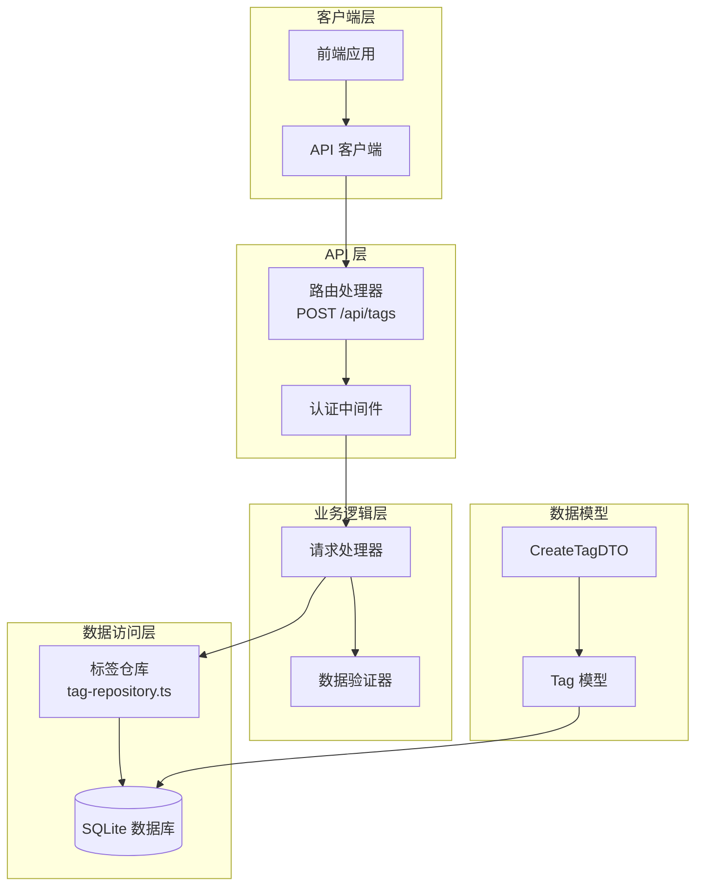
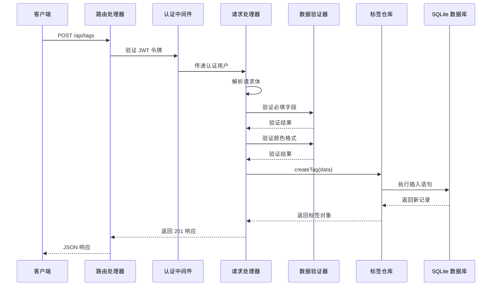
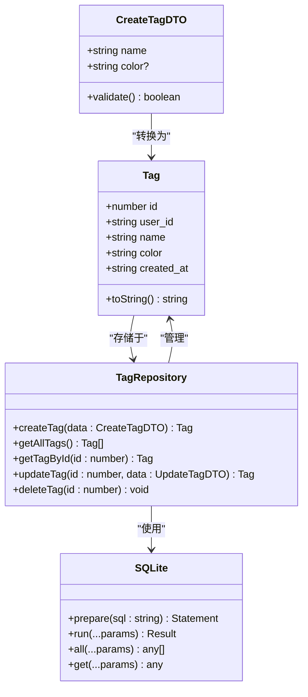

# 创建标签

<cite>
**本文档中引用的文件**
- [app/api/tags/route.ts](file://app/api/tags/route.ts)
- [lib/types/tag.ts](file://lib/types/tag.ts)
- [lib/db/tag-repository.ts](file://lib/db/tag-repository.ts)
- [lib/db/sqlite.ts](file://lib/db/sqlite.ts)
- [lib/auth/middleware.ts](file://lib/auth/middleware.ts)
- [test-tags-api.sh](file://test-tags-api.sh)
- [app/api/tags/[id]/route.ts](file://app/api/tags/[id]/route.ts)
</cite>

## 目录
1. [简介](#简介)
2. [接口概述](#接口概述)
3. [请求格式](#请求格式)
4. [响应格式](#响应格式)
5. [数据验证规则](#数据验证规则)
6. [错误处理](#错误处理)
7. [使用示例](#使用示例)
8. [架构设计](#架构设计)
9. [最佳实践](#最佳实践)
10. [故障排除](#故障排除)

## 简介

POST /api/tags 接口用于创建新的标签。该接口提供了完整的标签管理功能，支持标签名称和颜色属性的创建，并实现了严格的数据验证机制以确保数据完整性。

## 接口概述

### 基本信息
- **URL**: `/api/tags`
- **HTTP 方法**: `POST`
- **认证要求**: 需要有效的 JWT 认证令牌
- **内容类型**: `application/json`

### 功能特性
- 创建新标签记录
- 支持标签名称和颜色属性
- 自动处理颜色默认值
- 实现唯一性约束检查
- 提供详细的错误反馈

## 请求格式

### 请求头
```http
Content-Type: application/json
Authorization: Bearer <your-jwt-token>
```

### 请求体结构

| 字段名 | 类型 | 必填 | 描述 |
|--------|------|------|------|
| name | string | 是 | 标签名称，不能为空字符串 |
| color | string | 否 | 颜色值，必须符合 #RRGGBB 格式 |

### 请求体示例

#### 基础创建（仅名称）
```json
{
  "name": "电子产品"
}
```

#### 包含颜色的创建
```json
{
  "name": "电子产品",
  "color": "#FF0000"
}
```

**节来源**
- [app/api/tags/route.ts](file://app/api/tags/route.ts#L25-L72)
- [lib/types/tag.ts](file://lib/types/tag.ts#L19-L22)

## 响应格式

### 成功响应（201 Created）

当标签创建成功时，返回以下格式的 JSON 响应：

```json
{
  "success": true,
  "data": {
    "id": 1,
    "user_id": "default_user",
    "name": "电子产品",
    "color": "#FF0000",
    "created_at": "2024-01-15T10:30:00.000Z"
  }
}
```

### 响应字段说明

| 字段名 | 类型 | 描述 |
|--------|------|------|
| success | boolean | 操作是否成功的标志 |
| data | object | 新创建的标签对象 |
| data.id | number | 标签的唯一标识符 |
| data.user_id | string | 用户标识符 |
| data.name | string | 标签名称 |
| data.color | string | 标签颜色（十六进制格式） |
| data.created_at | string | 创建时间（ISO 8601 格式） |

**节来源**
- [app/api/tags/route.ts](file://app/api/tags/route.ts#L52-L55)

## 数据验证规则

### 标签名称验证

1. **必填性检查**
   - `name` 字段为必填项
   - 不能为 `null` 或 `undefined`
   - 不能为空字符串

2. **格式验证**
   - 必须是字符串类型
   - 不能只包含空白字符
   - 最大长度限制由数据库约束决定

### 颜色值验证

1. **格式要求**
   - 可选字段，但一旦提供就必须符合格式
   - 必须以 `#` 开头
   - 后面跟随 6 位十六进制数字（0-9, A-F, a-f）
   - 完整格式：`#RRGGBB`

2. **默认值处理**
   - 如果未提供颜色值，默认使用 `#3B82F6`
   - 默认颜色为蓝色调

### 唯一性约束

1. **标签名称唯一性**
   - 同一用户下标签名称必须唯一
   - 不区分大小写（数据库层面处理）
   - 违反唯一性约束时返回冲突状态码

**节来源**
- [app/api/tags/route.ts](file://app/api/tags/route.ts#L30-L44)
- [lib/db/sqlite.ts](file://lib/db/sqlite.ts#L46-L54)

## 错误处理

### HTTP 状态码说明

| 状态码 | 错误类型 | 描述 |
|--------|----------|------|
| 400 | Bad Request | 请求格式错误或必填字段缺失 |
| 401 | Unauthorized | 缺少认证令牌或令牌无效 |
| 409 | Conflict | 标签名称已存在 |
| 500 | Internal Server Error | 服务器内部错误 |

### 错误响应格式

```json
{
  "error": "错误描述信息"
}
```

### 具体错误情况

#### 1. 必填字段缺失
```json
{
  "error": "标签名称不能为空"
}
```

#### 2. 颜色格式错误
```json
{
  "error": "颜色格式不正确，应为 #RRGGBB 格式"
}
```

#### 3. 标签名称冲突
```json
{
  "error": "标签名称已存在"
}
```

#### 4. 认证失败
```json
{
  "error": "未提供认证令牌"
}
```

**节来源**
- [app/api/tags/route.ts](file://app/api/tags/route.ts#L31-L44)
- [app/api/tags/route.ts](file://app/api/tags/route.ts#L59-L65)
- [lib/auth/middleware.ts](file://lib/auth/middleware.ts#L15-L30)

## 使用示例

### 创建基础标签

#### 请求
```bash
curl -X POST "http://localhost:3000/api/tags" \
  -H "Content-Type: application/json" \
  -H "Authorization: Bearer your-jwt-token" \
  -d '{
    "name": "电子产品"
  }'
```

#### 响应
```json
{
  "success": true,
  "data": {
    "id": 1,
    "user_id": "default_user",
    "name": "电子产品",
    "color": "#3B82F6",
    "created_at": "2024-01-15T10:30:00.000Z"
  }
}
```

### 创建带颜色的标签

#### 请求
```bash
curl -X POST "http://localhost:3000/api/tags" \
  -H "Content-Type: application/json" \
  -H "Authorization: Bearer your-jwt-token" \
  -d '{
    "name": "电子产品",
    "color": "#FF0000"
  }'
```

#### 响应
```json
{
  "success": true,
  "data": {
    "id": 2,
    "user_id": "default_user",
    "name": "电子产品",
    "color": "#FF0000",
    "created_at": "2024-01-15T10:35:00.000Z"
  }
}
```

### 错误示例：标签名称冲突

#### 请求
```bash
curl -X POST "http://localhost:3000/api/tags" \
  -H "Content-Type: application/json" \
  -H "Authorization: Bearer your-jwt-token" \
  -d '{
    "name": "电子产品",
    "color": "#00FF00"
  }'
```

#### 响应
```json
{
  "error": "标签名称已存在",
  "status": 409
}
```

### 错误示例：无效的颜色格式

#### 请求
```bash
curl -X POST "http://localhost:3000/api/tags" \
  -H "Content-Type: application/json" \
  -H "Authorization: Bearer your-jwt-token" \
  -d '{
    "name": "测试标签",
    "color": "invalid"
  }'
```

#### 响应
```json
{
  "error": "颜色格式不正确，应为 #RRGGBB 格式",
  "status": 400
}
```

**节来源**
- [test-tags-api.sh](file://test-tags-api.sh#L38-L150)

## 架构设计

### 系统架构图



**图表来源**
- [app/api/tags/route.ts](file://app/api/tags/route.ts#L1-L73)
- [lib/db/tag-repository.ts](file://lib/db/tag-repository.ts#L1-L191)

### 组件交互流程



**图表来源**
- [app/api/tags/route.ts](file://app/api/tags/route.ts#L25-L72)
- [lib/auth/middleware.ts](file://lib/auth/middleware.ts#L8-L33)

### 数据模型设计



**图表来源**
- [lib/types/tag.ts](file://lib/types/tag.ts#L5-L30)
- [lib/db/tag-repository.ts](file://lib/db/tag-repository.ts#L30-L54)

**节来源**
- [lib/types/tag.ts](file://lib/types/tag.ts#L1-L59)
- [lib/db/tag-repository.ts](file://lib/db/tag-repository.ts#L1-L191)

## 最佳实践

### 1. 请求优化建议

- **批量创建**：对于大量标签创建需求，考虑实现批量创建接口
- **缓存策略**：对频繁使用的标签进行客户端缓存
- **输入验证**：在发送请求前进行客户端验证

### 2. 错误处理最佳实践

- **用户友好的错误消息**：向用户提供清晰的错误指导
- **重试机制**：对于临时性错误实现指数退避重试
- **日志记录**：记录详细的错误日志便于问题排查

### 3. 性能优化

- **索引优化**：确保 `user_id` 和 `name` 字段有适当的索引
- **连接池**：使用数据库连接池提高并发性能
- **分页查询**：对于大量标签的查询实现分页机制

### 4. 安全考虑

- **输入过滤**：防止恶意输入导致的安全问题
- **权限控制**：确保用户只能操作自己的标签
- **审计日志**：记录标签创建、修改和删除操作

## 故障排除

### 常见问题及解决方案

#### 1. 认证失败
**问题**：收到 401 错误
**原因**：缺少认证令牌或令牌无效
**解决方案**：
- 确保请求头中包含有效的 JWT 令牌
- 检查令牌是否已过期
- 验证令牌格式是否正确

#### 2. 标签名称冲突
**问题**：收到 409 错误
**原因**：标签名称已存在
**解决方案**：
- 检查是否存在同名标签
- 使用不同的标签名称
- 实现去重逻辑

#### 3. 颜色格式错误
**问题**：收到 400 错误，提示颜色格式不正确
**原因**：颜色值不符合 #RRGGBB 格式
**解决方案**：
- 确保颜色值以 # 开头
- 使用 6 位十六进制数字
- 示例：#FF0000（红色）、#00FF00（绿色）

#### 4. 数据库连接问题
**问题**：收到 500 错误
**原因**：数据库连接或查询失败
**解决方案**：
- 检查数据库服务是否正常运行
- 验证数据库文件权限
- 查看服务器日志获取详细错误信息

### 调试技巧

1. **启用详细日志**：在开发环境中启用详细的错误日志
2. **使用 Postman 或 cURL**：手动测试接口行为
3. **检查网络请求**：使用浏览器开发者工具检查请求和响应
4. **验证数据格式**：确保请求体符合预期格式

**节来源**
- [app/api/tags/route.ts](file://app/api/tags/route.ts#L56-L72)
- [lib/db/tag-repository.ts](file://lib/db/tag-repository.ts#L32-L54)

## 结论

POST /api/tags 接口提供了完整而可靠的标签创建功能。通过严格的验证机制、完善的错误处理和良好的架构设计，确保了系统的稳定性和用户体验。开发者在使用该接口时应遵循最佳实践，注意数据验证和错误处理，以获得最佳的开发体验。