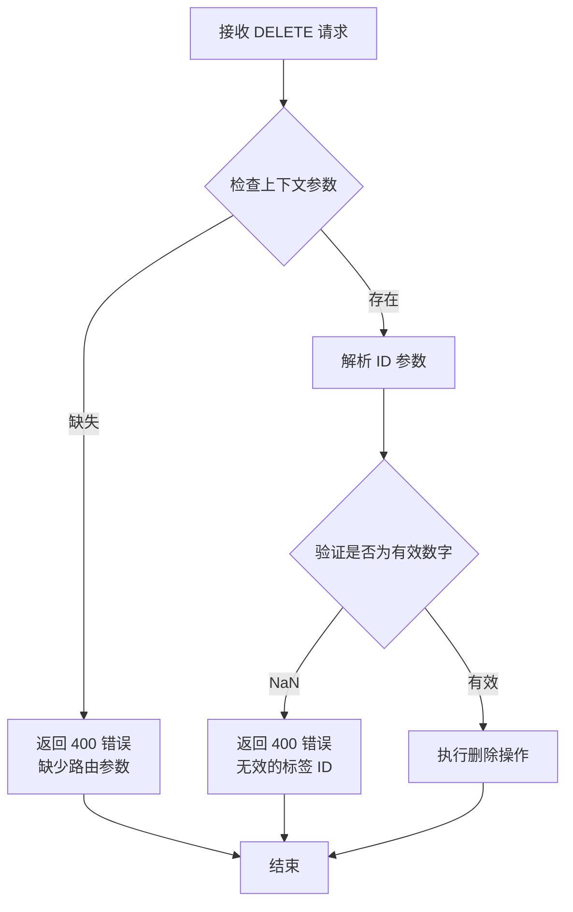
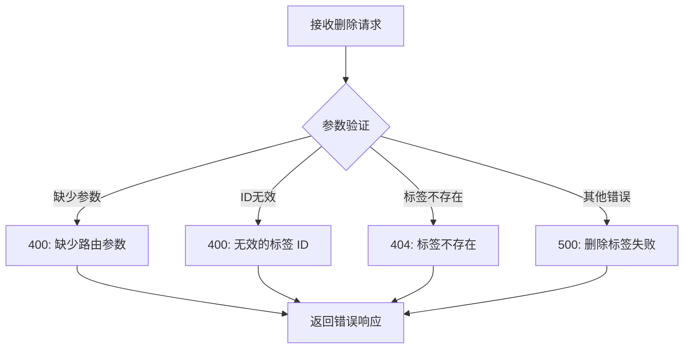
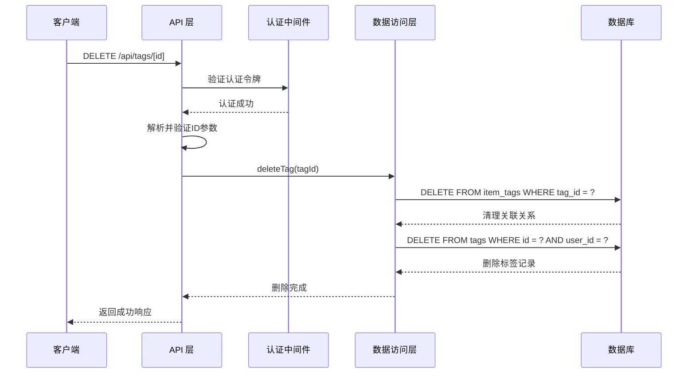

# 删除标签

<cite>
**本文档中引用的文件**
- [app/api/tags/[id]/route.ts](file://app/api/tags/[id]/route.ts)
- [lib/db/tag-repository.ts](file://lib/db/tag-repository.ts)
- [lib/types/tag.ts](file://lib/types/tag.ts)
- [lib/db/sqlite.ts](file://lib/db/sqlite.ts)
- [lib/hooks/use-tags.ts](file://lib/hooks/use-tags.ts)
- [lib/api/client.ts](file://lib/api/client.ts)
- [test-tags-api.sh](file://test-tags-api.sh)
</cite>

## 目录
1. [概述](#概述)
2. [接口规范](#接口规范)
3. [请求参数](#请求参数)
4. [响应格式](#响应格式)
5. [错误处理](#错误处理)
6. [数据库架构](#数据库架构)
7. [实现细节](#实现细节)
8. [使用示例](#使用示例)
9. [注意事项](#注意事项)
10. [测试验证](#测试验证)

## 概述

DELETE /api/tags/[id] 接口用于删除指定ID的标签。该接口提供了安全可靠的标签删除功能，支持对标签进行不可逆的删除操作，同时维护数据完整性。

### 主要特性

- **身份验证保护**：需要有效的认证令牌才能执行删除操作
- **参数验证**：严格验证ID参数的有效性
- **级联删除**：自动清理与标签相关的所有关联关系
- **数据完整性**：确保删除操作不会破坏系统数据结构
- **不可逆性**：删除操作一旦执行无法恢复

## 接口规范

### HTTP 方法
- **方法**：DELETE
- **URL**：`/api/tags/[id]`
- **认证**：必需 Bearer Token

### 路径参数

| 参数名 | 类型 | 必需 | 描述 |
|--------|------|------|------|
| id | number | 是 | 要删除的标签ID |

### 请求头
- `Authorization: Bearer <token>` - 包含有效认证令牌的授权头
- `Content-Type: application/json` - 请求内容类型

## 请求参数

### 路径参数验证

系统会对路径参数进行严格的验证：



**图表来源**
- [app/api/tags/[id]/route.ts](file://app/api/tags/[id]/route.ts#L127-L147)

## 响应格式

### 成功响应

当标签成功删除时，返回以下格式的JSON响应：

```json
{
  "success": true,
  "message": "标签已删除"
}
```

### 响应字段说明

| 字段 | 类型 | 描述 |
|------|------|------|
| success | boolean | 操作成功标志，始终为 true |
| message | string | 操作结果消息 |

### HTTP 状态码

- **200 OK**：标签删除成功
- **400 Bad Request**：请求参数无效或缺失
- **404 Not Found**：指定的标签不存在
- **500 Internal Server Error**：服务器内部错误

## 错误处理

### 常见错误情况



**图表来源**
- [app/api/tags/[id]/route.ts](file://app/api/tags/[id]/route.ts#L127-L154)

### 错误响应格式

```json
{
  "error": "错误描述信息"
}
```

## 数据库架构

### 标签表结构

标签数据存储在 `tags` 表中，包含以下字段：

| 字段名 | 类型 | 约束 | 描述 |
|--------|------|------|------|
| id | INTEGER | PRIMARY KEY, AUTOINCREMENT | 标签唯一标识符 |
| user_id | TEXT | NOT NULL, DEFAULT 'default_user' | 用户标识符 |
| name | TEXT | NOT NULL, UNIQUE(user_id, name) | 标签名称（唯一） |
| color | TEXT | NOT NULL, DEFAULT '#3B82F6' | 标签颜色（十六进制） |
| created_at | TEXT | NOT NULL | 创建时间戳 |

### 关联表结构

标签与物品通过 `item_tags` 表建立多对多关系：

| 字段名 | 类型 | 约束 | 描述 |
|--------|------|------|------|
| id | INTEGER | PRIMARY KEY, AUTOINCREMENT | 关联记录唯一标识符 |
| item_id | INTEGER | NOT NULL, FOREIGN KEY | 物品ID |
| tag_id | INTEGER | NOT NULL, FOREIGN KEY | 标签ID |
| created_at | TEXT | NOT NULL | 关联创建时间戳 |

**图表来源**
- [lib/db/sqlite.ts](file://lib/db/sqlite.ts#L45-L67)

## 实现细节

### 删除流程



**图表来源**
- [app/api/tags/[id]/route.ts](file://app/api/tags/[id]/route.ts#L127-L147)
- [lib/db/tag-repository.ts](file://lib/db/tag-repository.ts#L103-L111)

### 数据库删除策略

系统采用级联删除策略确保数据一致性：

1. **先删除关联关系**：从 `item_tags` 表中移除所有与目标标签相关的记录
2. **再删除标签本身**：从 `tags` 表中删除对应的标签记录
3. **事务保证**：虽然当前实现没有显式事务，但数据库的外键约束确保了数据完整性

**节来源**
- [lib/db/tag-repository.ts](file://lib/db/tag-repository.ts#L103-L111)

## 使用示例

### 基本删除操作

```bash
# 删除标签ID为1的标签
curl -X DELETE "http://localhost:3000/api/tags/1" \
  -H "Authorization: Bearer YOUR_TOKEN_HERE" \
  -H "Content-Type: application/json"
```

### 前端调用示例

```typescript
// 使用 React Hook
import { useTags } from '@/lib/hooks/use-tags';

const TagManagement = () => {
  const { deleteTag } = useTags();
  
  const handleDeleteTag = async (tagId: number) => {
    try {
      await deleteTag(tagId);
      console.log('标签删除成功');
      // 刷新标签列表或其他UI更新逻辑
    } catch (error) {
      console.error('删除标签失败:', error);
      // 显示错误提示
    }
  };
  
  return (
    <button onClick={() => handleDeleteTag(1)}>
      删除标签
    </button>
  );
};
```

**节来源**
- [lib/hooks/use-tags.ts](file://lib/hooks/use-tags.ts#L59-L65)
- [lib/api/client.ts](file://lib/api/client.ts#L169-L172)

## 注意事项

### 删除操作的不可逆性

- **数据丢失**：删除操作是永久性的，无法通过系统功能恢复
- **关联数据保留**：已关联的物品将继续保留历史标签记录
- **前端提示**：建议前端在删除前提示用户确认操作

### 系统行为特点

- **不影响物品数据**：删除标签不会影响物品本身的其他属性
- **保留历史记录**：物品仍然可以查看其历史标签信息
- **无权限检查**：系统不检查标签是否正在被使用，完全依赖前端控制

### 最佳实践

1. **删除前确认**：在前端实现删除确认对话框
2. **批量操作**：考虑提供批量删除功能
3. **日志记录**：建议在应用层面记录删除操作日志
4. **备份策略**：对于重要标签，建议定期备份标签数据

## 测试验证

### 自动化测试脚本

项目包含完整的API测试脚本，验证DELETE操作的各项功能：

```bash
# 运行标签API测试
bash test-tags-api.sh
```

### 测试覆盖范围

测试脚本验证以下场景：

1. **正常删除**：成功删除存在的标签
2. **重复删除**：尝试删除不存在的标签
3. **无效ID**：使用非数字ID参数
4. **权限验证**：未认证情况下的访问控制
5. **关联数据处理**：验证删除后关联数据的状态

**节来源**
- [test-tags-api.sh](file://test-tags-api.sh#L124-L128)

### 手动测试步骤

1. **准备测试环境**：确保有可用的认证令牌
2. **创建测试标签**：先创建几个测试标签
3. **验证删除功能**：使用有效ID进行删除测试
4. **验证错误处理**：测试无效ID和不存在的ID
5. **检查数据完整性**：确认关联数据不受影响