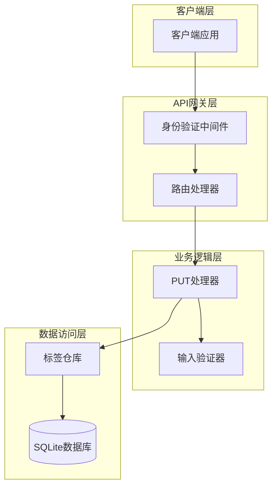
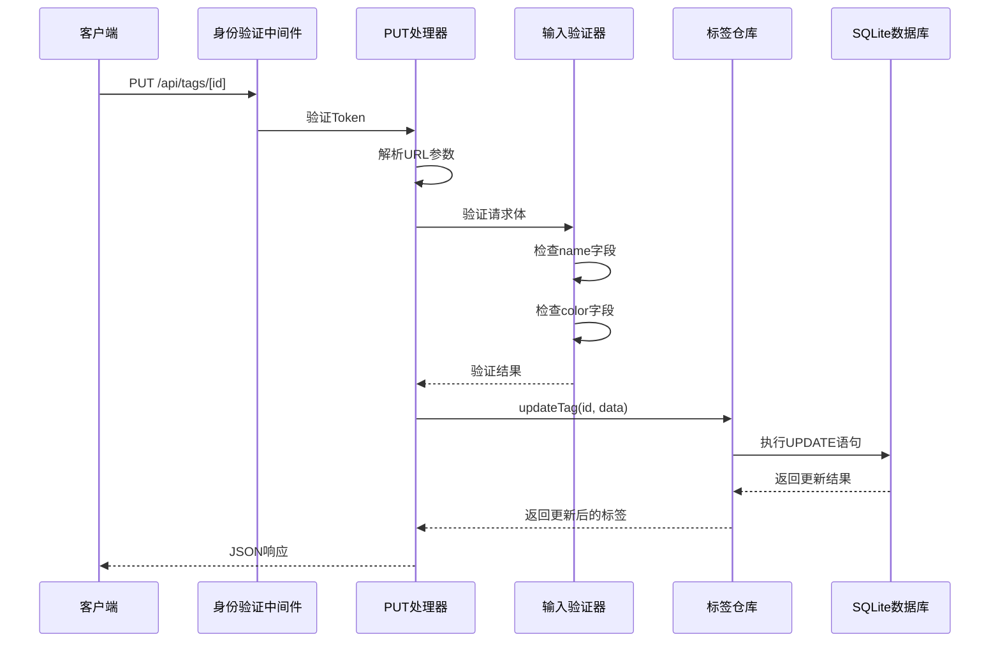
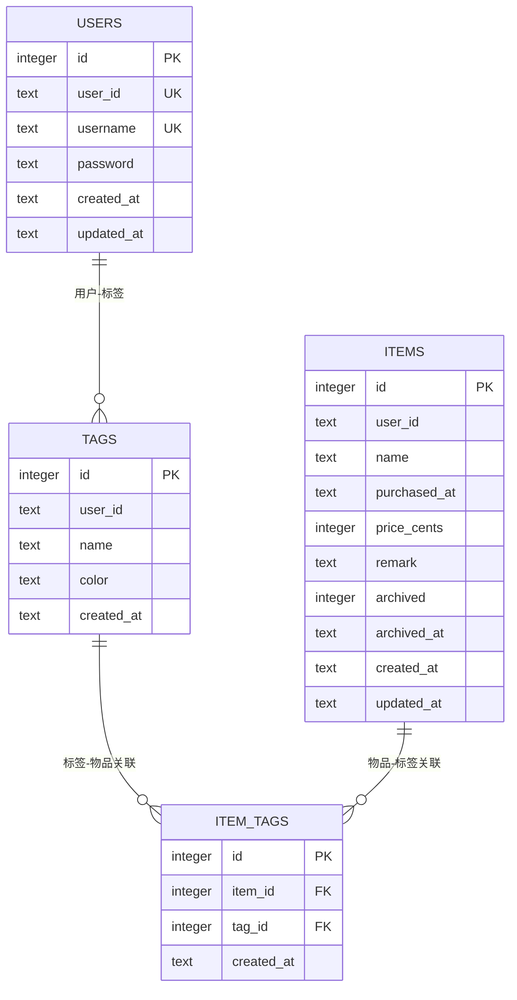

# 更新标签

<cite>
**本文档中引用的文件**
- [app/api/tags/[id]/route.ts](file://app/api/tags/[id]/route.ts)
- [lib/types/tag.ts](file://lib/types/tag.ts)
- [lib/db/tag-repository.ts](file://lib/db/tag-repository.ts)
- [lib/db/sqlite.ts](file://lib/db/sqlite.ts)
- [test-tags-api.sh](file://test-tags-api.sh)
</cite>

## 目录
1. [简介](#简介)
2. [接口规范](#接口规范)
3. [请求参数](#请求参数)
4. [响应格式](#响应格式)
5. [错误处理](#错误处理)
6. [使用示例](#使用示例)
7. [架构设计](#架构设计)
8. [数据库设计](#数据库设计)
9. [最佳实践](#最佳实践)

## 简介

PUT /api/tags/[id] 接口用于更新指定ID的标签信息。该接口支持部分更新，允许用户只更新需要修改的字段，而保持其他字段不变。接口提供了严格的验证机制，确保数据的完整性和一致性。

## 接口规范

### HTTP方法
- **方法**: PUT
- **路径**: `/api/tags/[id]`
- **认证**: 需要有效的Bearer Token
- **内容类型**: `application/json`

### URL参数
| 参数名 | 类型 | 必需 | 描述 |
|--------|------|------|------|
| id | number | 是 | 要更新的标签ID |

## 请求参数

### 请求体结构

```typescript
interface UpdateTagRequest {
  name?: string;    // 标签名称（可选）
  color?: string;   // 十六进制颜色值（可选）
}
```

### 字段说明

| 字段名 | 类型 | 必需 | 验证规则 | 描述 |
|--------|------|------|----------|------|
| name | string | 否 | 非空字符串 | 标签的新名称 |
| color | string | 否 | #RRGGBB格式 | 标签的新颜色值 |

### 验证规则

#### name字段验证
- **非必需**: 可以省略
- **类型检查**: 必须是字符串类型
- **内容检查**: 不能为空字符串或仅包含空白字符
- **长度限制**: 无明确限制，但建议合理长度

#### color字段验证
- **非必需**: 可以省略
- **格式要求**: 必须符合十六进制颜色格式（#RRGGBB）
- **大小写**: 支持大写和小写字母
- **前缀**: 必须以#开头

## 响应格式

### 成功响应

当更新成功时，返回HTTP 200状态码和包含更新后标签对象的JSON响应：

```json
{
  "success": true,
  "data": {
    "id": 1,
    "user_id": "default_user",
    "name": "更新后的标签名称",
    "color": "#FF0000",
    "created_at": "2024-01-01T00:00:00.000Z"
  }
}
```

### 响应字段说明

| 字段名 | 类型 | 描述 |
|--------|------|------|
| success | boolean | 操作成功标志 |
| data | Tag | 更新后的完整标签对象 |

## 错误处理

### HTTP状态码

| 状态码 | 错误类型 | 描述 | 触发条件 |
|--------|----------|------|----------|
| 400 | Bad Request | 请求参数无效 | ID格式错误、字段验证失败 |
| 404 | Not Found | 标签不存在 | 指定ID的标签不存在 |
| 409 | Conflict | 资源冲突 | 标签名称已存在 |
| 500 | Internal Server Error | 服务器内部错误 | 系统异常或数据库错误 |

### 错误响应格式

```json
{
  "error": "错误描述信息"
}
```

### 具体错误情况

#### 无效的标签ID
```json
{
  "error": "无效的标签 ID"
}
```

#### 标签不存在
```json
{
  "error": "标签不存在"
}
```

#### 名称为空
```json
{
  "error": "标签名称不能为空"
}
```

#### 颜色格式错误
```json
{
  "error": "颜色格式不正确，应为 #RRGGBB 格式"
}
```

#### 名称重复
```json
{
  "error": "标签名称已存在"
}
```

#### 系统错误
```json
{
  "error": "更新标签失败"
}
```

## 使用示例

### 示例1：仅更新标签颜色

```bash
curl -X PUT "http://localhost:3000/api/tags/1" \
  -H "Authorization: Bearer YOUR_TOKEN" \
  -H "Content-Type: application/json" \
  -d '{
    "color": "#EF4444"
  }'
```

**响应**:
```json
{
  "success": true,
  "data": {
    "id": 1,
    "user_id": "default_user",
    "name": "电子产品",
    "color": "#EF4444",
    "created_at": "2024-01-01T10:00:00.000Z"
  }
}
```

### 示例2：仅更新标签名称

```bash
curl -X PUT "http://localhost:3000/api/tags/2" \
  -H "Authorization: Bearer YOUR_TOKEN" \
  -H "Content-Type: application/json" \
  -d '{
    "name": "电子设备"
  }'
```

**响应**:
```json
{
  "success": true,
  "data": {
    "id": 2,
    "user_id": "default_user",
    "name": "电子设备",
    "color": "#10B981",
    "created_at": "2024-01-01T10:05:00.000Z"
  }
}
```

### 示例3：同时更新名称和颜色

```bash
curl -X PUT "http://localhost:3000/api/tags/3" \
  -H "Authorization: Bearer YOUR_TOKEN" \
  -H "Content-Type: application/json" \
  -d '{
    "name": "办公学习",
    "color": "#8B5CF6"
  }'
```

**响应**:
```json
{
  "success": true,
  "data": {
    "id": 3,
    "user_id": "default_user",
    "name": "办公学习",
    "color": "#8B5CF6",
    "created_at": "2024-01-01T10:10:00.000Z"
  }
}
```

### 示例4：无效的ID格式

```bash
curl -X PUT "http://localhost:3000/api/tags/invalid" \
  -H "Authorization: Bearer YOUR_TOKEN" \
  -H "Content-Type: application/json"
```

**响应**:
```json
{
  "error": "无效的标签 ID",
  "status": 400
}
```

### 示例5：标签不存在

```bash
curl -X PUT "http://localhost:3000/api/tags/999" \
  -H "Authorization: Bearer YOUR_TOKEN" \
  -H "Content-Type: application/json"
```

**响应**:
```json
{
  "error": "标签不存在",
  "status": 404
}
```

## 架构设计

### 接口层架构



**图表来源**
- [app/api/tags/[id]/route.ts](file://app/api/tags/[id]/route.ts#L53-L121)
- [lib/db/tag-repository.ts](file://lib/db/tag-repository.ts#L59-L98)

### 数据流图



**图表来源**
- [app/api/tags/[id]/route.ts](file://app/api/tags/[id]/route.ts#L53-L121)
- [lib/db/tag-repository.ts](file://lib/db/tag-repository.ts#L59-L98)

## 数据库设计

### 表结构



**图表来源**
- [lib/db/sqlite.ts](file://lib/db/sqlite.ts#L45-L68)

### 约束说明

| 约束类型 | 字段组合 | 描述 |
|----------|----------|------|
| PRIMARY KEY | id | 主键自增 |
| UNIQUE | user_id, name | 用户下标签名称唯一 |
| FOREIGN KEY | item_id | 引用items表 |
| FOREIGN KEY | tag_id | 引用tags表 |
| CHECK | color | 颜色格式验证 |

## 最佳实践

### 请求优化建议

1. **部分更新策略**
   - 只传递需要更新的字段
   - 避免不必要的字段传输
   - 减少网络带宽消耗

2. **错误处理**
   - 实现客户端重试机制
   - 提供友好的错误提示
   - 记录详细的错误日志

3. **性能考虑**
   - 使用适当的缓存策略
   - 避免频繁的标签更新操作
   - 监控数据库查询性能

### 安全注意事项

1. **输入验证**
   - 严格验证所有输入参数
   - 防止SQL注入攻击
   - 限制请求频率

2. **权限控制**
   - 确保用户只能操作自己的标签
   - 实施适当的访问控制
   - 记录敏感操作日志

### 开发建议

1. **类型安全**
   - 使用TypeScript确保类型安全
   - 定义清晰的接口契约
   - 实施严格的编译时检查

2. **测试覆盖**
   - 编写单元测试验证功能
   - 进行集成测试确保系统完整性
   - 执行压力测试评估性能

**节来源**
- [app/api/tags/[id]/route.ts](file://app/api/tags/[id]/route.ts#L53-L121)
- [lib/types/tag.ts](file://lib/types/tag.ts#L27-L29)
- [lib/db/tag-repository.ts](file://lib/db/tag-repository.ts#L59-L98)
- [lib/db/sqlite.ts](file://lib/db/sqlite.ts#L45-L68)