# 标签数据模型

<cite>
**本文档中引用的文件**
- [lib/types/tag.ts](file://lib/types/tag.ts)
- [lib/db/tag-repository.ts](file://lib/db/tag-repository.ts)
- [lib/db/sqlite.ts](file://lib/db/sqlite.ts)
- [app/api/tags/route.ts](file://app/api/tags/route.ts)
- [app/api/items/[id]/tags/route.ts](file://app/api/items/[id]/tags/route.ts)
- [components/tag-selector.tsx](file://components/tag-selector.tsx)
- [test-tags-api.sh](file://test-tags-api.sh)
</cite>

## 目录
1. [简介](#简介)
2. [核心数据模型](#核心数据模型)
3. [数据传输对象(DTO)](#数据传输对象dto)
4. [数据库架构](#数据库架构)
5. [关联关系](#关联关系)
6. [API接口设计](#api接口设计)
7. [业务逻辑分析](#业务逻辑分析)
8. [约束和验证](#约束和验证)
9. [使用示例](#使用示例)
10. [最佳实践](#最佳实践)

## 简介

标签系统是物品管理系统的核心功能之一，它允许用户为物品添加分类标记，实现灵活的数据组织和检索。本文档详细说明了标签数据模型的设计、实现和使用方式。

标签系统采用SQLite作为底层数据库，支持多对多关系，通过关联表`item_tags`实现物品与标签之间的双向关联。系统提供了完整的CRUD操作，并具备完善的错误处理机制。

## 核心数据模型

### Tag接口定义

Tag接口是标签数据的核心模型，包含以下字段：

| 字段名 | 类型 | 描述 | 约束 |
|--------|------|------|------|
| id | number | 标签唯一标识符 | 主键，自增 |
| user_id | string | 用户标识符 | 外键，关联用户 |
| name | string | 标签名称 | 必填，唯一约束 |
| color | string | 标签颜色 | 十六进制颜色码，默认#3B82F6 |
| created_at | string | 创建时间 | ISO 8601格式 |

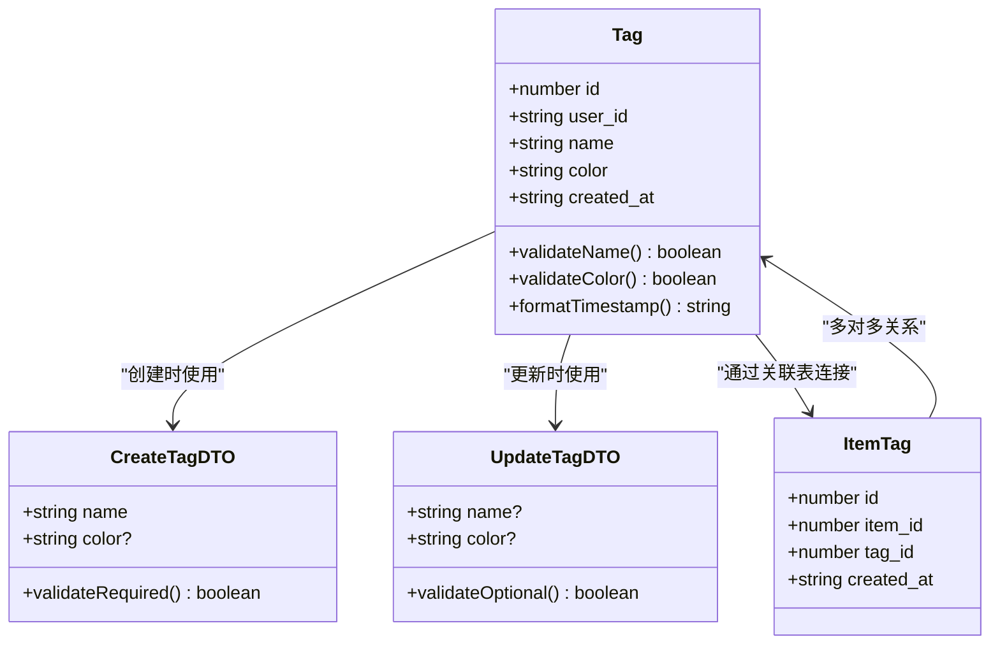

**图表来源**
- [lib/types/tag.ts](file://lib/types/tag.ts#L8-L14)
- [lib/types/tag.ts](file://lib/types/tag.ts#L19-L30)

**节来源**
- [lib/types/tag.ts](file://lib/types/tag.ts#L8-L59)

### 字段详细说明

#### id字段
- **类型**: `number`
- **描述**: 标签的唯一标识符，由数据库自动递增生成
- **用途**: 作为标签的主键，在系统内部进行快速查找和引用

#### user_id字段
- **类型**: `string`
- **描述**: 用户标识符，用于实现多租户隔离
- **默认值**: `'default_user'`
- **用途**: 确保不同用户的标签数据相互独立

#### name字段
- **类型**: `string`
- **描述**: 标签的显示名称
- **长度限制**: 最大20个字符
- **唯一性**: 在同一用户下必须唯一
- **验证**: 必须是非空字符串，且不能重复

#### color字段
- **类型**: `string`
- **描述**: 标签的颜色表示，采用十六进制格式
- **格式要求**: `#RRGGBB` 格式（如`#3B82F6`）
- **默认值**: `'#3B82F6'`（蓝色）
- **用途**: 为标签提供视觉区分

#### created_at字段
- **类型**: `string`
- **描述**: 标签的创建时间戳
- **格式**: ISO 8601日期时间格式
- **用途**: 记录标签的创建时间，支持按时间排序

**节来源**
- [lib/types/tag.ts](file://lib/types/tag.ts#L8-L14)

## 数据传输对象(DTO)

### CreateTagDTO

CreateTagDTO用于创建新标签时的数据传输，其特点是name字段为必填项：

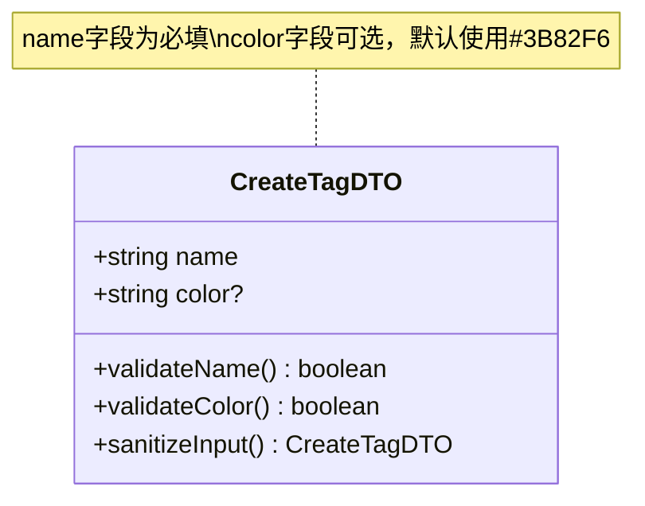

**图表来源**
- [lib/types/tag.ts](file://lib/types/tag.ts#L19-L22)

#### 字段特性
- **name**: 必填字段，标签的唯一标识名称
- **color**: 可选字段，十六进制颜色码，默认值为`#3B82F6`

### UpdateTagDTO

UpdateTagDTO用于更新现有标签时的数据传输，所有字段均为可选项：

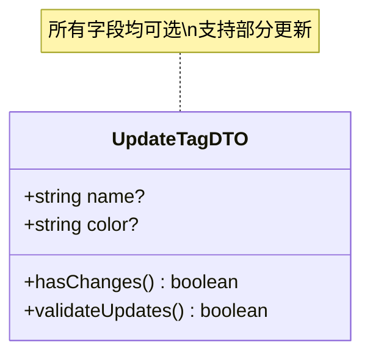

**图表来源**
- [lib/types/tag.ts](file://lib/types/tag.ts#L27-L30)

#### 字段特性
- **name**: 可选字段，更新标签名称
- **color**: 可选字段，更新标签颜色

### DTO对比分析

| 特性 | CreateTagDTO | UpdateTagDTO |
|------|-------------|-------------|
| name字段 | 必填 | 可选 |
| color字段 | 可选 | 可选 |
| 验证策略 | 强制验证 | 条件验证 |
| 使用场景 | 创建新标签 | 更新现有标签 |
| 默认值处理 | 自动应用默认颜色 | 保持原值不变 |

**节来源**
- [lib/types/tag.ts](file://lib/types/tag.ts#L19-L30)

## 数据库架构

### 表结构设计

系统采用三层表结构：用户表、标签表和关联表，实现完整的多对多关系管理。

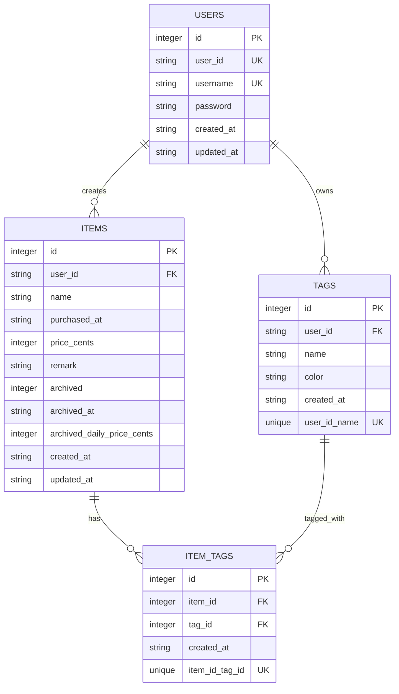

**图表来源**
- [lib/db/sqlite.ts](file://lib/db/sqlite.ts#L29-L99)

### 标签表(Tags)详细结构

标签表包含以下字段和约束：

| 字段 | 类型 | 约束 | 默认值 | 描述 |
|------|------|------|--------|------|
| id | INTEGER | PRIMARY KEY, AUTOINCREMENT | - | 主键标识符 |
| user_id | TEXT | NOT NULL, DEFAULT 'default_user' | 'default_user' | 用户外键 |
| name | TEXT | NOT NULL | - | 标签名称 |
| color | TEXT | NOT NULL, DEFAULT '#3B82F6' | '#3B82F6' | 颜色代码 |
| created_at | TEXT | NOT NULL | - | 创建时间戳 |
| UNIQUE(user_id, name) | - | - | - | 用户内名称唯一 |

### 关联表(Item_Tags)结构

关联表维护物品与标签之间的多对多关系：

| 字段 | 类型 | 约束 | 描述 |
|------|------|------|------|
| id | INTEGER | PRIMARY KEY, AUTOINCREMENT | 关联记录主键 |
| item_id | INTEGER | NOT NULL, FOREIGN KEY | 物品ID |
| tag_id | INTEGER | NOT NULL, FOREIGN KEY | 标签ID |
| created_at | TEXT | NOT NULL | 关联创建时间 |
| UNIQUE(item_id, tag_id) | - | - | 防止重复关联 |

**节来源**
- [lib/db/sqlite.ts](file://lib/db/sqlite.ts#L45-L67)

## 关联关系

### 多对多关系模型

标签系统通过`item_tags`关联表实现物品与标签之间的多对多关系：

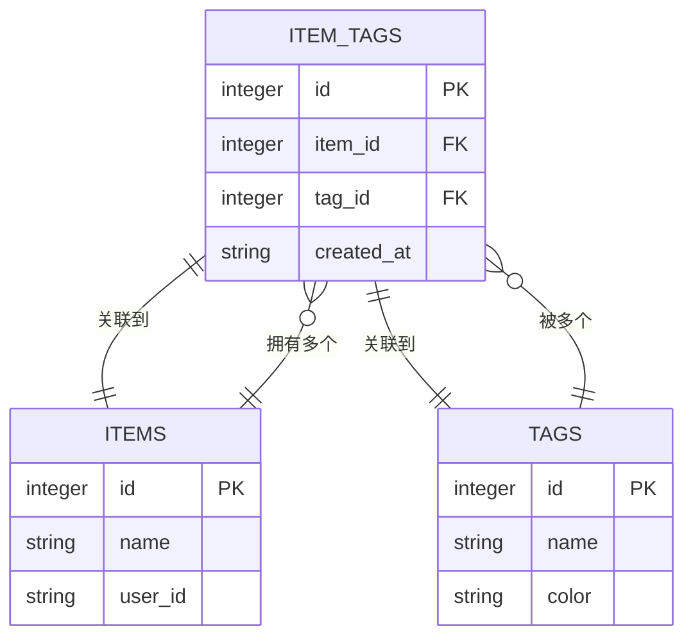

**图表来源**
- [lib/db/sqlite.ts](file://lib/db/sqlite.ts#L58-L67)

### 关联操作详解

#### 添加标签到物品
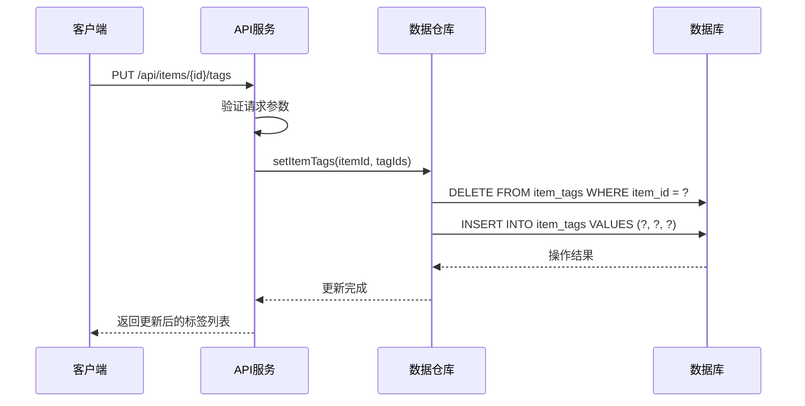

**图表来源**
- [app/api/items/[id]/tags/route.ts](file://app/api/items/[id]/tags/route.ts#L45-L103)
- [lib/db/tag-repository.ts](file://lib/db/tag-repository.ts#L161-L179)

#### 查询物品标签
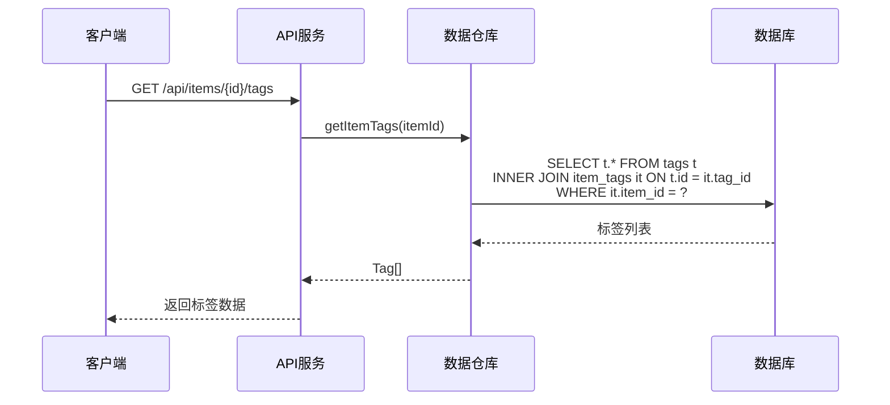

**图表来源**
- [app/api/items/[id]/tags/route.ts](file://app/api/items/[id]/tags/route.ts#L12-L40)
- [lib/db/tag-repository.ts](file://lib/db/tag-repository.ts#L147-L156)

**节来源**
- [lib/db/tag-repository.ts](file://lib/db/tag-repository.ts#L115-L190)

## API接口设计

### 标签管理API

#### GET /api/tags
获取当前用户的所有标签

**请求参数**: 无
**响应格式**:
```json
{
  "success": true,
  "data": [
    {
      "id": 1,
      "user_id": "default_user",
      "name": "电子产品",
      "color": "#3B82F6",
      "created_at": "2024-01-01T00:00:00.000Z"
    }
  ]
}
```

#### POST /api/tags
创建新标签

**请求体**:
```json
{
  "name": "新标签名称",
  "color": "#3B82F6"
}
```

**响应状态**:
- `201 Created`: 创建成功
- `400 Bad Request`: 请求参数错误
- `409 Conflict`: 标签名称已存在
- `500 Internal Server Error`: 服务器错误

#### PUT /api/tags/{id}
更新指定标签

**请求体**:
```json
{
  "name": "更新后的名称",
  "color": "#EF4444"
}
```

**响应状态**:
- `200 OK`: 更新成功
- `400 Bad Request`: 请求参数错误
- `404 Not Found`: 标签不存在
- `409 Conflict`: 标签名称冲突
- `500 Internal Server Error`: 服务器错误

#### DELETE /api/tags/{id}
删除指定标签

**响应状态**:
- `200 OK`: 删除成功
- `404 Not Found`: 标签不存在
- `500 Internal Server Error`: 服务器错误

### 物品标签关联API

#### GET /api/items/{id}/tags
获取物品的所有标签

**响应格式**:
```json
{
  "success": true,
  "data": [
    {
      "id": 1,
      "user_id": "default_user",
      "name": "电子产品",
      "color": "#3B82F6",
      "created_at": "2024-01-01T00:00:00.000Z"
    }
  ]
}
```

#### PUT /api/items/{id}/tags
设置物品的标签（替换现有标签）

**请求体**:
```json
{
  "tag_ids": [1, 2, 3]
}
```

**响应状态**:
- `200 OK`: 设置成功
- `400 Bad Request`: 请求参数错误
- `404 Not Found`: 物品不存在
- `500 Internal Server Error`: 服务器错误

**节来源**
- [app/api/tags/route.ts](file://app/api/tags/route.ts#L1-L73)
- [app/api/items/[id]/tags/route.ts](file://app/api/items/[id]/tags/route.ts#L1-L103)

## 业务逻辑分析

### 标签创建流程

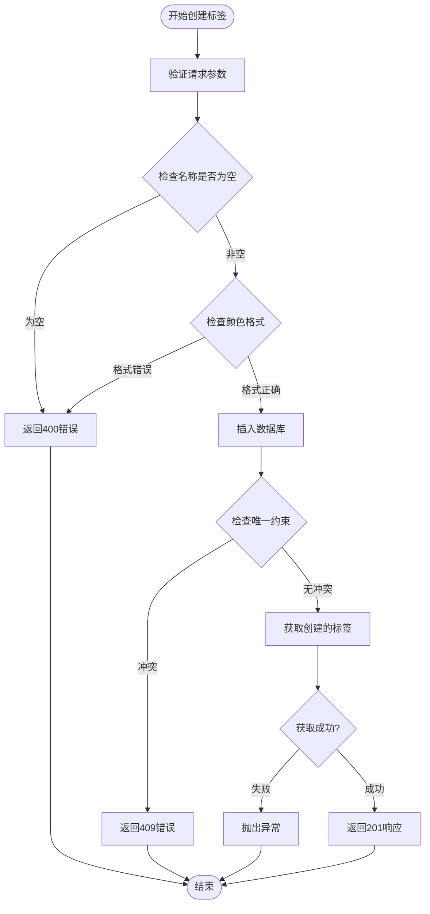

**图表来源**
- [app/api/tags/route.ts](file://app/api/tags/route.ts#L25-L72)
- [lib/db/tag-repository.ts](file://lib/db/tag-repository.ts#L32-L54)

### 标签更新流程

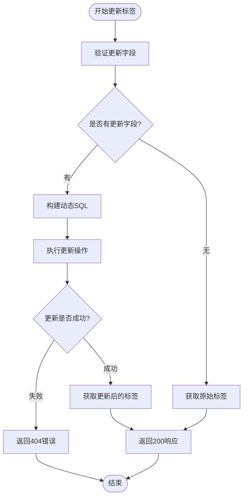

**图表来源**
- [app/api/tags/[id]/route.ts](file://app/api/tags/[id]/route.ts#L98-L121)
- [lib/db/tag-repository.ts](file://lib/db/tag-repository.ts#L59-L98)

### 物品标签管理流程

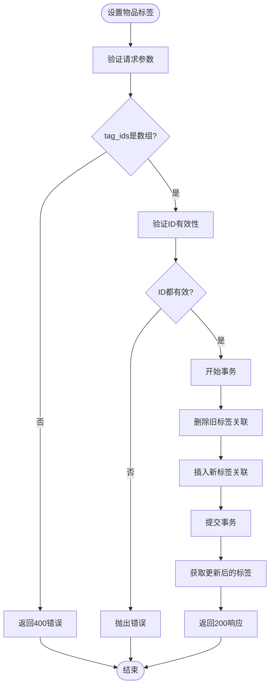

**图表来源**
- [app/api/items/[id]/tags/route.ts](file://app/api/items/[id]/tags/route.ts#L45-L103)
- [lib/db/tag-repository.ts](file://lib/db/tag-repository.ts#L161-L179)

**节来源**
- [lib/db/tag-repository.ts](file://lib/db/tag-repository.ts#L32-L191)

## 约束和验证

### 数据库约束

#### 唯一性约束
- **标签名称唯一性**: 同一用户下的标签名称必须唯一
- **关联关系唯一性**: 物品与标签的组合关系必须唯一

#### 外键约束
- **级联删除**: 当标签或物品被删除时，自动删除相关联的关联记录
- **完整性保证**: 确保引用的有效性

### 前端验证

#### 标签创建验证
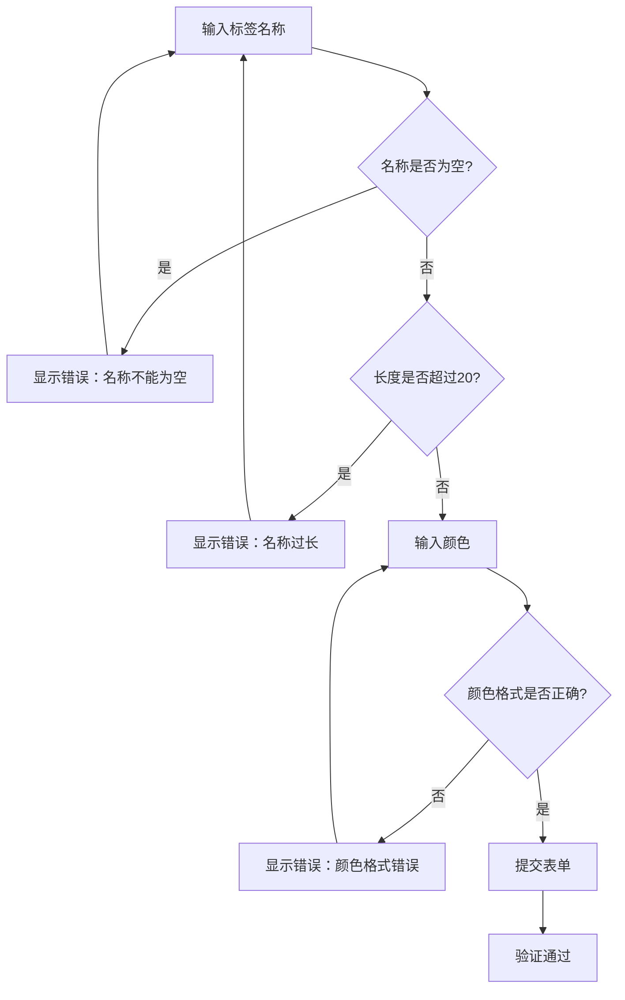

**图表来源**
- [components/tag-selector.tsx](file://components/tag-selector.tsx#L51-L67)

### 错误处理机制

#### HTTP状态码映射

| 错误类型 | HTTP状态码 | 错误消息 | 处理方式 |
|----------|------------|----------|----------|
| 名称为空 | 400 | "标签名称不能为空" | 前端提示用户输入 |
| 名称重复 | 409 | "标签名称已存在" | 提示用户修改名称 |
| 颜色格式错误 | 400 | "颜色格式不正确" | 提示用户使用#RRGGBB格式 |
| 标签不存在 | 404 | "标签不存在" | 刷新页面或重新选择 |
| 服务器错误 | 500 | "操作失败" | 显示错误页面 |

#### 数据库错误处理

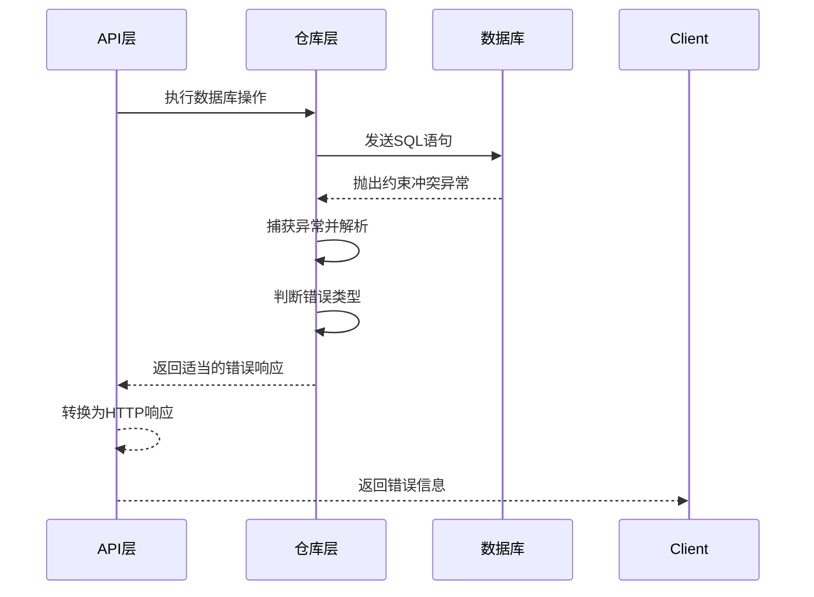

**图表来源**
- [app/api/tags/route.ts](file://app/api/tags/route.ts#L59-L71)
- [lib/db/tag-repository.ts](file://lib/db/tag-repository.ts#L121-L132)

**节来源**
- [lib/db/sqlite.ts](file://lib/db/sqlite.ts#L52-L67)
- [app/api/tags/route.ts](file://app/api/tags/route.ts#L30-L44)

## 使用示例

### 基本操作示例

#### 创建标签
```typescript
// 创建电子产品标签
const electronicsTag = await createTag({
  name: "电子产品",
  color: "#3B82F6"
});

// 创建家居用品标签（使用默认颜色）
const homeTag = await createTag({
  name: "家居用品"
});
```

#### 更新标签
```typescript
// 更新标签名称和颜色
const updatedTag = await updateTag(1, {
  name: "电子设备",
  color: "#EF4444"
});

// 只更新颜色
const colorOnly = await updateTag(1, {
  color: "#10B981"
});
```

#### 物品标签管理
```typescript
// 获取物品的所有标签
const tags = await getItemTags(123);

// 为物品设置新的标签组合
await setItemTags(123, [1, 2, 3]);

// 为物品添加单个标签
await addTagToItem(123, 4);

// 从物品移除标签
await removeTagFromItem(123, 4);
```

### 组件使用示例

#### 标签选择器组件
```typescript
// 在物品表单中使用标签选择器
<TagSelector
  selectedTagIds={selectedTagIds}
  onChange={(tagIds) => setSelectedTagIds(tagIds)}
/>
```

#### 标签展示组件
```typescript
// 展示物品的标签
<ItemTags tags={item.tags} />
```

**节来源**
- [components/tag-selector.tsx](file://components/tag-selector.tsx#L18-L177)
- [lib/db/tag-repository.ts](file://lib/db/tag-repository.ts#L32-L191)

## 最佳实践

### 性能优化建议

#### 索引策略
- **标签查询**: 对`tags.user_id`和`tags.name`建立复合索引
- **关联查询**: 对`item_tags.item_id`和`item_tags.tag_id`建立索引
- **时间排序**: 对`created_at`字段建立索引以支持高效排序

#### 缓存策略
- **标签列表缓存**: 缓存用户的标签列表，减少数据库查询
- **物品标签缓存**: 缓存物品的标签信息，提高页面加载速度

### 安全考虑

#### 输入验证
- **名称长度限制**: 限制标签名称最大长度为20字符
- **颜色格式验证**: 确保颜色值符合#RRGGBB格式
- **特殊字符过滤**: 过滤可能引起安全问题的特殊字符

#### 权限控制
- **用户隔离**: 确保每个用户只能访问自己的标签数据
- **操作权限**: 验证用户对物品的操作权限

### 数据一致性

#### 事务处理
- **批量操作**: 使用数据库事务确保批量标签操作的一致性
- **级联删除**: 利用数据库级联约束保证数据完整性

#### 错误恢复
- **回滚机制**: 在发生错误时自动回滚未完成的事务
- **重试策略**: 对于临时性错误实施指数退避重试

### 扩展性设计

#### 多租户支持
- **用户隔离**: 通过`user_id`字段实现多租户数据隔离
- **权限边界**: 确保跨租户数据访问的安全性

#### 功能扩展
- **标签分组**: 支持标签的层次化组织
- **标签搜索**: 实现基于标签名称的模糊搜索
- **标签统计**: 提供标签使用情况的统计分析

**节来源**
- [lib/db/sqlite.ts](file://lib/db/sqlite.ts#L93-L99)
- [lib/db/tag-repository.ts](file://lib/db/tag-repository.ts#L103-L112)