# 标签管理API

<cite>
**本文档中引用的文件**
- [app/api/tags/route.ts](file://app/api/tags/route.ts)
- [app/api/tags/[id]/route.ts](file://app/api/tags/[id]/route.ts)
- [app/api/items/[id]/tags/route.ts](file://app/api/items/[id]/tags/route.ts)
- [lib/db/tag-repository.ts](file://lib/db/tag-repository.ts)
- [lib/db/sqlite.ts](file://lib/db/sqlite.ts)
- [lib/types/tag.ts](file://lib/types/tag.ts)
- [lib/hooks/use-tags.ts](file://lib/hooks/use-tags.ts)
- [components/tag-selector.tsx](file://components/tag-selector.tsx)
- [components/tag-badge.tsx](file://components/tag-badge.tsx)
- [test-tags-api.sh](file://test-tags-api.sh)
</cite>

## 目录
1. [简介](#简介)
2. [项目结构](#项目结构)
3. [核心组件](#核心组件)
4. [架构概览](#架构概览)
5. [详细组件分析](#详细组件分析)
6. [数据验证规则](#数据验证规则)
7. [错误处理机制](#错误处理机制)
8. [标签与物品关联](#标签与物品关联)
9. [使用示例](#使用示例)
10. [故障排除指南](#故障排除指南)
11. [结论](#结论)

## 简介

标签管理API是记账应用中的核心功能模块，提供了完整的标签生命周期管理能力。该系统支持标签的创建、读取、更新、删除操作，同时具备强大的数据验证机制和错误处理能力。标签系统采用SQLite数据库存储，支持颜色自定义，并与物品系统紧密集成，实现灵活的分类管理功能。

## 项目结构

标签管理功能分布在多个层次中，形成了清晰的分层架构：

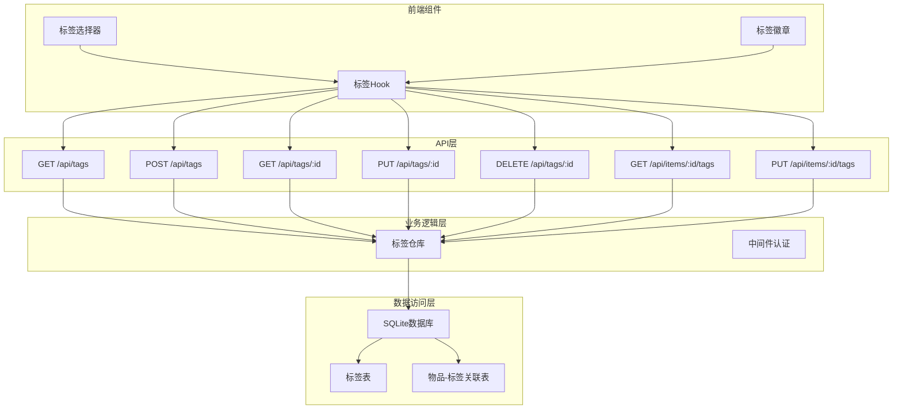

**图表来源**
- [app/api/tags/route.ts](file://app/api/tags/route.ts#L1-L73)
- [app/api/tags/[id]/route.ts](file://app/api/tags/[id]/route.ts#L1-L156)
- [lib/db/tag-repository.ts](file://lib/db/tag-repository.ts#L1-L191)

**章节来源**
- [app/api/tags/route.ts](file://app/api/tags/route.ts#L1-L73)
- [app/api/tags/[id]/route.ts](file://app/api/tags/[id]/route.ts#L1-L156)
- [lib/db/tag-repository.ts](file://lib/db/tag-repository.ts#L1-L191)

## 核心组件

### 标签数据模型

标签系统的核心数据结构定义了标签的基本属性和行为：

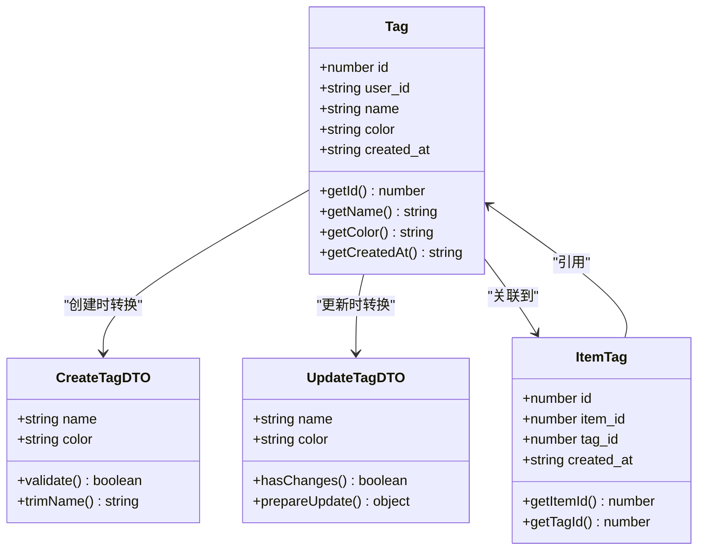

**图表来源**
- [lib/types/tag.ts](file://lib/types/tag.ts#L8-L59)

### API端点架构

标签管理API提供了RESTful风格的端点设计，支持完整的CRUD操作：

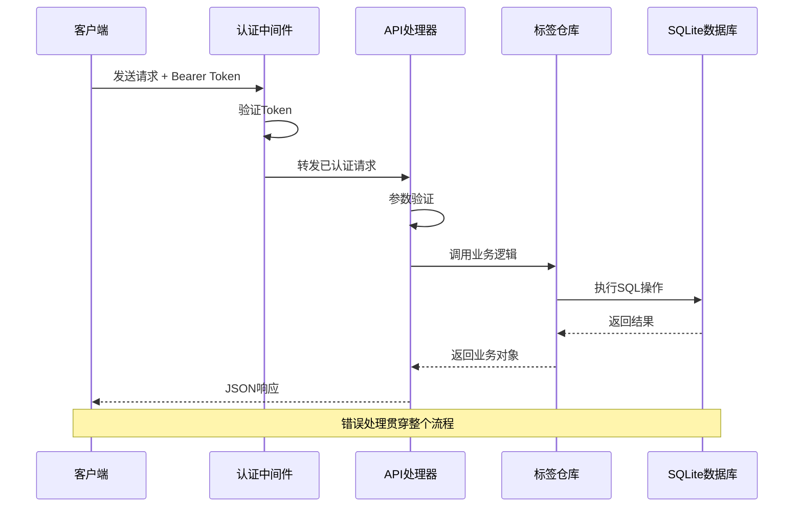

**图表来源**
- [app/api/tags/route.ts](file://app/api/tags/route.ts#L9-L73)
- [app/api/tags/[id]/route.ts](file://app/api/tags/[id]/route.ts#L13-L156)

**章节来源**
- [lib/types/tag.ts](file://lib/types/tag.ts#L1-L59)
- [app/api/tags/route.ts](file://app/api/tags/route.ts#L1-L73)
- [app/api/tags/[id]/route.ts](file://app/api/tags/[id]/route.ts#L1-L156)

## 架构概览

标签管理系统采用分层架构设计，确保了代码的可维护性和扩展性：

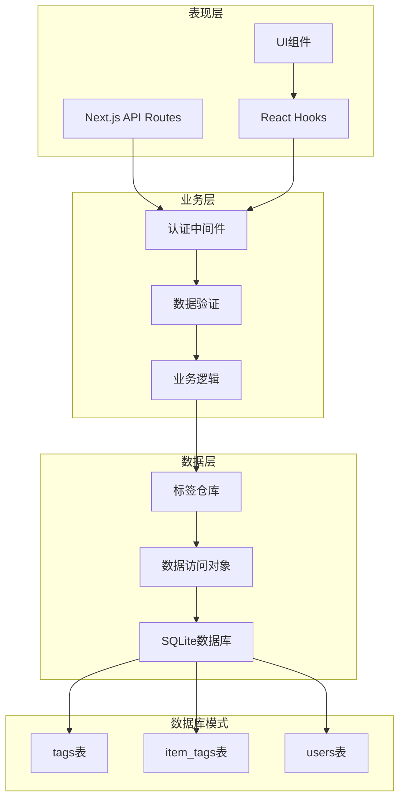

**图表来源**
- [lib/db/sqlite.ts](file://lib/db/sqlite.ts#L27-L109)
- [lib/db/tag-repository.ts](file://lib/db/tag-repository.ts#L1-L191)

## 详细组件分析

### GET /api/tags - 获取所有标签

此端点提供获取系统中所有标签的功能，支持按创建时间倒序排列：

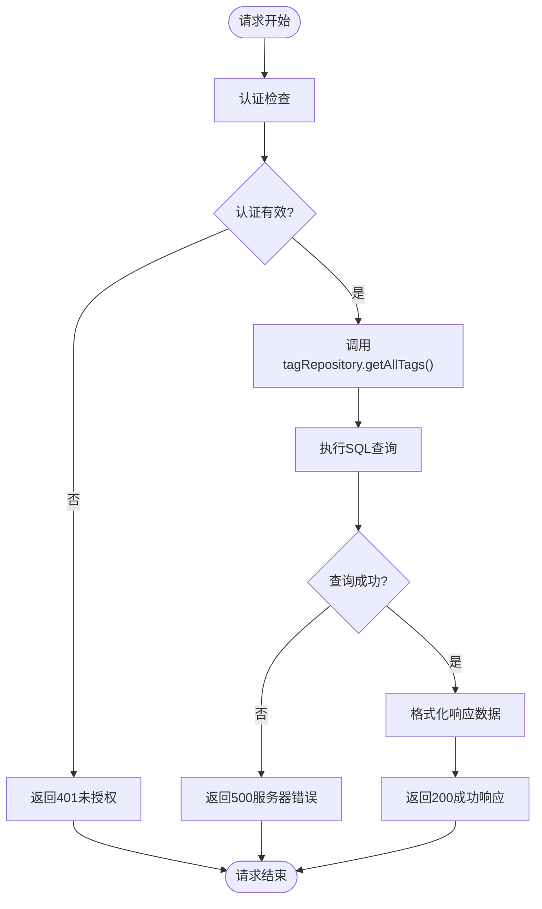

**图表来源**
- [app/api/tags/route.ts](file://app/api/tags/route.ts#L9-L20)

### POST /api/tags - 创建新标签

创建标签功能包含完整的数据验证和错误处理机制：

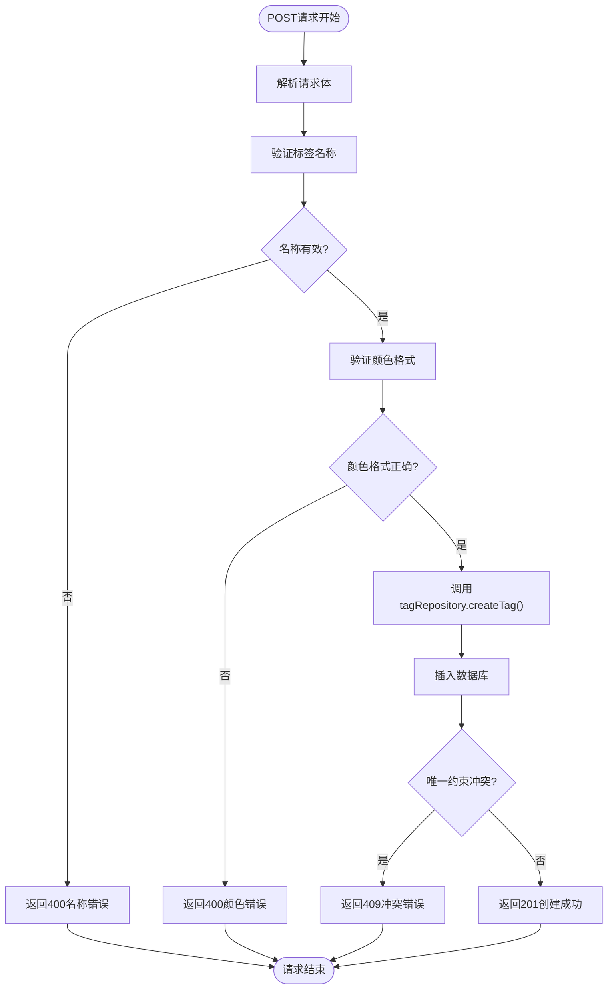

**图表来源**
- [app/api/tags/route.ts](file://app/api/tags/route.ts#L25-L72)

### GET/PUT/DELETE /api/tags/:id - 单个标签操作

这些端点处理特定标签的详细操作，包含严格的参数验证：

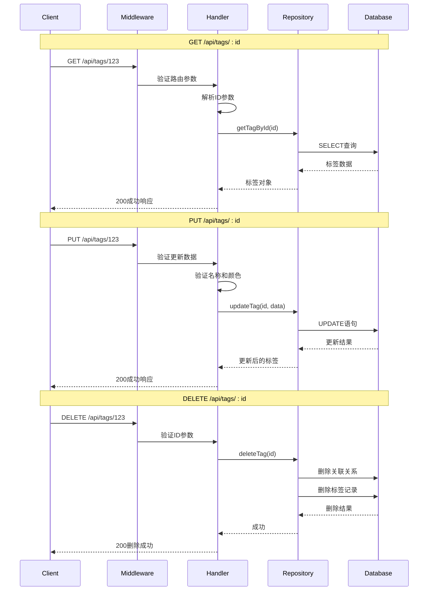

**图表来源**
- [app/api/tags/[id]/route.ts](file://app/api/tags/[id]/route.ts#L13-L156)

**章节来源**
- [app/api/tags/route.ts](file://app/api/tags/route.ts#L1-L73)
- [app/api/tags/[id]/route.ts](file://app/api/tags/[id]/route.ts#L1-L156)

## 数据验证规则

标签系统实现了严格的数据验证机制，确保数据完整性和一致性：

### 标签名称验证

| 验证规则 | 描述 | 错误响应 |
|---------|------|----------|
| 必填检查 | 标签名称不能为空 | `标签名称不能为空` |
| 类型检查 | 必须是字符串类型 | `标签名称不能为空` |
| 空白字符处理 | 自动去除首尾空白 | 自动处理 |
| 长度限制 | 支持最大20字符 | 默认由数据库约束 |

### 颜色格式验证

| 验证规则 | 描述 | 错误响应 |
|---------|------|----------|
| 格式要求 | 必须符合#RRGGBB格式 | `颜色格式不正确，应为 #RRGGBB 格式` |
| 字符集 | 仅允许十六进制字符 | 格式验证 |
| 长度检查 | 必须精确6位十六进制数 | 长度验证 |

### 唯一性约束

| 约束类型 | 约束条件 | 违规响应 |
|---------|----------|----------|
| 用户级别唯一 | 同一用户的标签名称必须唯一 | `标签名称已存在` |
| 数据库约束 | SQLite UNIQUE约束 | `标签名称已存在` |

**章节来源**
- [app/api/tags/route.ts](file://app/api/tags/route.ts#L30-L44)
- [app/api/tags/[id]/route.ts](file://app/api/tags/[id]/route.ts#L75-L88)

## 错误处理机制

标签系统实现了完善的错误处理策略，涵盖各种异常情况：

### HTTP状态码映射

| 错误类型 | HTTP状态码 | 错误消息 | 处理方式 |
|---------|-----------|----------|----------|
| 认证失败 | 401 | 未授权访问 | 中间件拦截 |
| 权限不足 | 403 | 禁止访问 | 中间件拦截 |
| 参数错误 | 400 | 请求参数无效 | 输入验证 |
| 资源不存在 | 404 | 标签不存在 | 查询验证 |
| 冲突错误 | 409 | 标签名称已存在 | 唯一性检查 |
| 服务器错误 | 500 | 内部服务器错误 | 异常捕获 |

### 错误处理流程

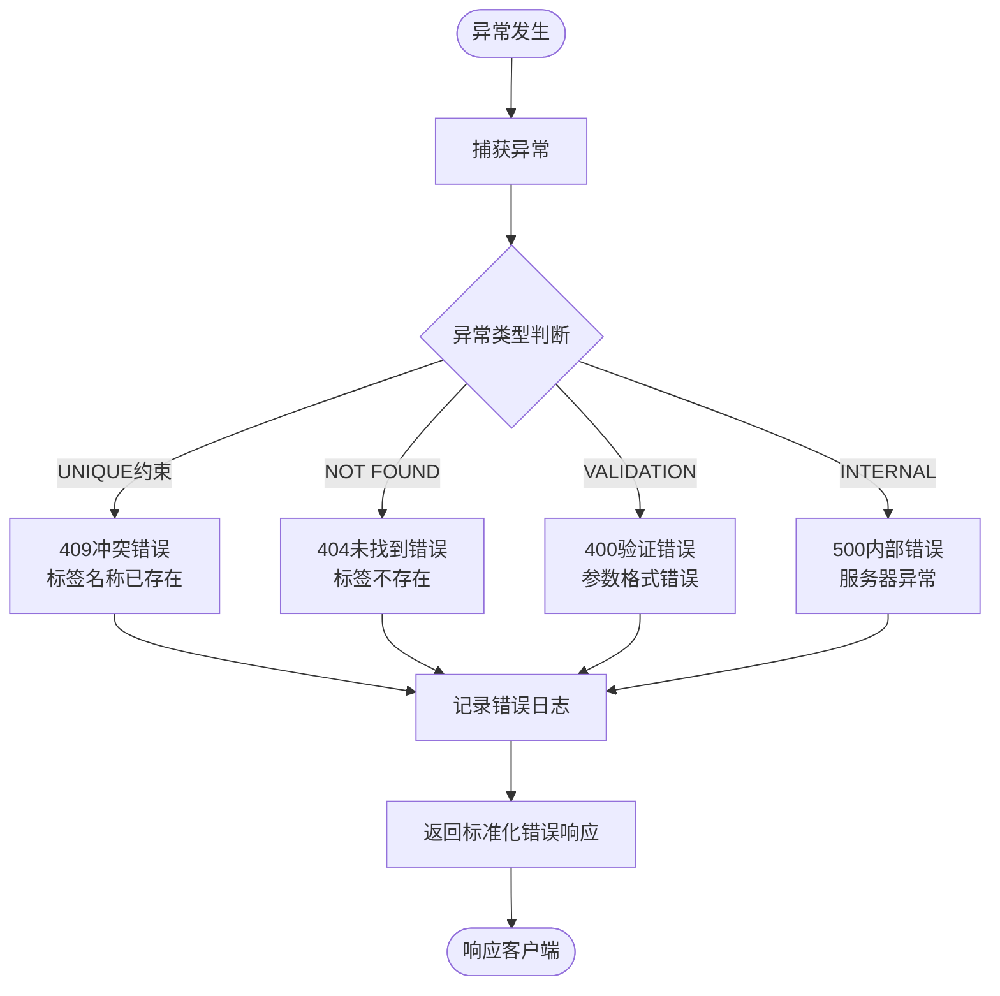

**图表来源**
- [app/api/tags/route.ts](file://app/api/tags/route.ts#L59-L70)
- [app/api/tags/[id]/route.ts](file://app/api/tags/[id]/route.ts#L103-L115)

**章节来源**
- [app/api/tags/route.ts](file://app/api/tags/route.ts#L59-L70)
- [app/api/tags/[id]/route.ts](file://app/api/tags/[id]/route.ts#L103-L115)

## 标签与物品关联

标签系统与物品系统紧密集成，通过专门的关联机制实现灵活的分类管理：

### 关联关系模型

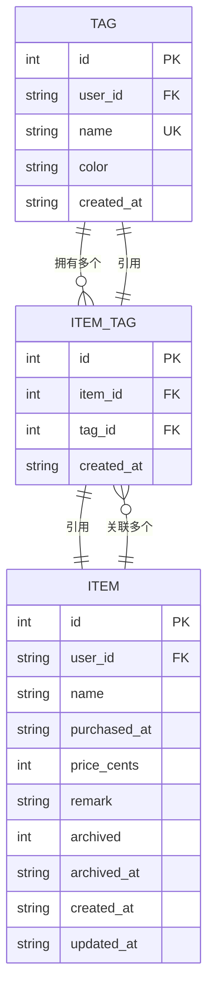

**图表来源**
- [lib/db/sqlite.ts](file://lib/db/sqlite.ts#L45-L67)
- [lib/db/tag-repository.ts](file://lib/db/tag-repository.ts#L115-L191)

### 标签操作流程

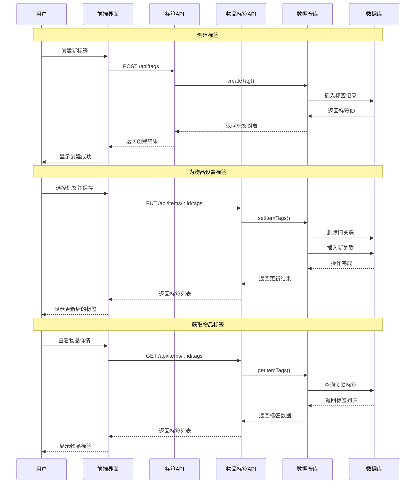

**图表来源**
- [app/api/items/[id]/tags/route.ts](file://app/api/items/[id]/tags/route.ts#L45-L103)
- [lib/db/tag-repository.ts](file://lib/db/tag-repository.ts#L161-L180)

### 前端组件集成

标签系统通过React组件提供直观的用户交互体验：

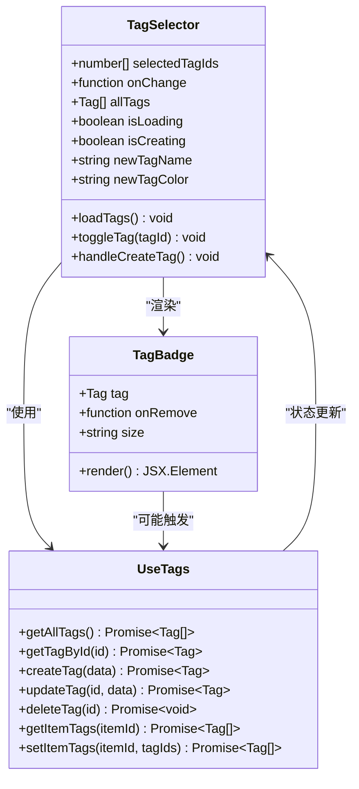

**图表来源**
- [components/tag-selector.tsx](file://components/tag-selector.tsx#L18-L177)
- [components/tag-badge.tsx](file://components/tag-badge.tsx#L16-L60)
- [lib/hooks/use-tags.ts](file://lib/hooks/use-tags.ts#L12-L98)

**章节来源**
- [app/api/items/[id]/tags/route.ts](file://app/api/items/[id]/tags/route.ts#L1-L103)
- [lib/db/tag-repository.ts](file://lib/db/tag-repository.ts#L115-L191)
- [components/tag-selector.tsx](file://components/tag-selector.tsx#L1-L177)
- [components/tag-badge.tsx](file://components/tag-badge.tsx#L1-L60)

## 使用示例

### 创建带颜色的标签

以下示例展示了如何创建带有自定义颜色的标签：

**请求示例：**
```bash
curl -X POST "http://localhost:3000/api/tags" \
  -H "Authorization: Bearer YOUR_TOKEN" \
  -H "Content-Type: application/json" \
  -d '{
    "name": "电子产品",
    "color": "#3B82F6"
  }'
```

**响应示例：**
```json
{
  "success": true,
  "data": {
    "id": 1,
    "user_id": "default_user",
    "name": "电子产品",
    "color": "#3B82F6",
    "created_at": "2024-01-15T10:30:00.000Z"
  }
}
```

### 获取所有标签

**请求示例：**
```bash
curl -X GET "http://localhost:3000/api/tags" \
  -H "Authorization: Bearer YOUR_TOKEN"
```

**响应示例：**
```json
{
  "success": true,
  "data": [
    {
      "id": 1,
      "user_id": "default_user",
      "name": "电子产品",
      "color": "#3B82F6",
      "created_at": "2024-01-15T10:30:00.000Z"
    },
    {
      "id": 2,
      "user_id": "default_user",
      "name": "家居用品",
      "color": "#10B981",
      "created_at": "2024-01-15T10:35:00.000Z"
    }
  ]
}
```

### 更新标签颜色

**请求示例：**
```bash
curl -X PUT "http://localhost:3000/api/tags/1" \
  -H "Authorization: Bearer YOUR_TOKEN" \
  -H "Content-Type: application/json" \
  -d '{
    "color": "#EF4444"
  }'
```

### 标签与物品关联

**设置物品标签：**
```bash
curl -X PUT "http://localhost:3000/api/items/123/tags" \
  -H "Authorization: Bearer YOUR_TOKEN" \
  -H "Content-Type: application/json" \
  -d '{
    "tag_ids": [1, 3, 5]
  }'
```

**获取物品标签：**
```bash
curl -X GET "http://localhost:3000/api/items/123/tags" \
  -H "Authorization: Bearer YOUR_TOKEN"
```

**章节来源**
- [test-tags-api.sh](file://test-tags-api.sh#L38-L155)

## 故障排除指南

### 常见问题及解决方案

| 问题类型 | 症状 | 可能原因 | 解决方案 |
|---------|------|----------|----------|
| 创建失败 | 409冲突错误 | 标签名称重复 | 使用不同的标签名称 |
| 颜色错误 | 400验证错误 | 颜色格式不正确 | 使用正确的#RRGGBB格式 |
| 权限错误 | 401未授权 | Token无效或过期 | 重新登录获取Token |
| 资源不存在 | 404未找到 | 标签ID不存在 | 检查标签ID的有效性 |
| 数据库错误 | 500服务器错误 | 数据库连接问题 | 检查数据库服务状态 |

### 调试技巧

1. **启用详细日志**：在开发环境中查看控制台输出的错误信息
2. **验证Token有效性**：确保Bearer Token格式正确且未过期
3. **检查网络连接**：确认API服务器正常运行
4. **验证请求格式**：确保JSON格式正确，字段命名准确

### 性能优化建议

1. **批量操作**：对于大量标签操作，考虑使用批量API
2. **缓存策略**：前端可以缓存标签列表以减少API调用
3. **索引优化**：数据库索引确保查询性能
4. **连接池管理**：合理配置数据库连接池大小

**章节来源**
- [app/api/tags/route.ts](file://app/api/tags/route.ts#L59-L70)
- [app/api/tags/[id]/route.ts](file://app/api/tags/[id]/route.ts#L103-L115)

## 结论

标签管理API提供了完整而强大的标签系统功能，具有以下特点：

### 主要优势

1. **完整的CRUD支持**：提供标签的创建、读取、更新、删除功能
2. **严格的数据验证**：确保数据质量和一致性
3. **完善的错误处理**：提供清晰的错误信息和适当的HTTP状态码
4. **灵活的关联机制**：与物品系统无缝集成
5. **直观的用户界面**：提供良好的用户体验

### 技术特色

- **分层架构设计**：清晰的职责分离和可维护性
- **类型安全**：完整的TypeScript类型定义
- **数据库约束**：利用SQLite的唯一性约束保证数据完整性
- **异步处理**：支持高并发访问

### 扩展建议

1. **标签搜索功能**：添加基于名称的标签搜索
2. **标签统计**：提供标签使用频率统计
3. **批量操作**：支持批量创建、更新、删除标签
4. **标签模板**：预设常用标签组合

该标签管理系统为记账应用提供了坚实的分类基础，支持用户高效地组织和管理财务数据。