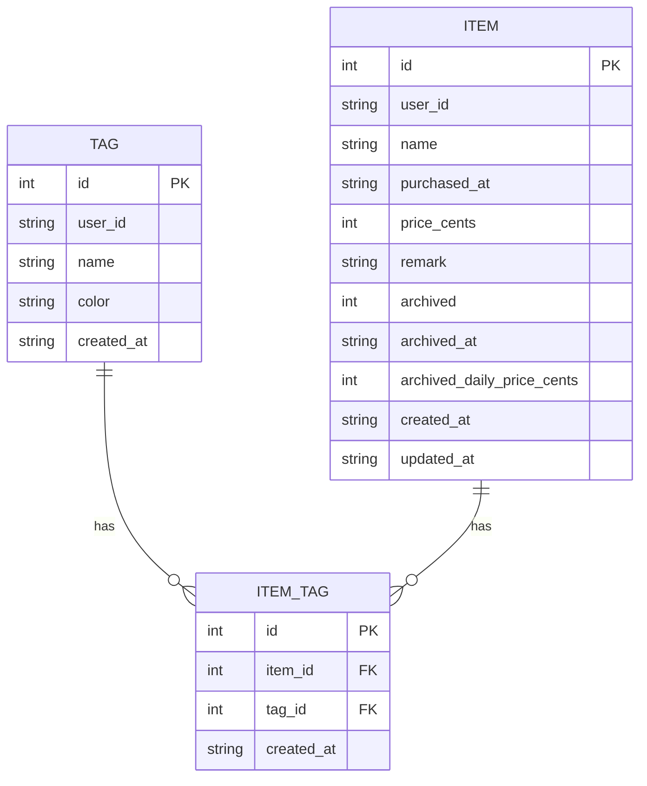
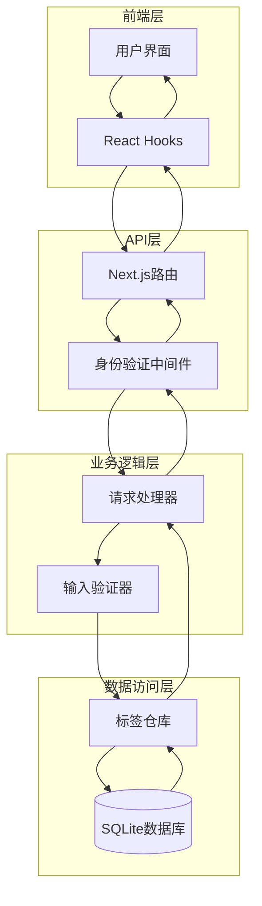
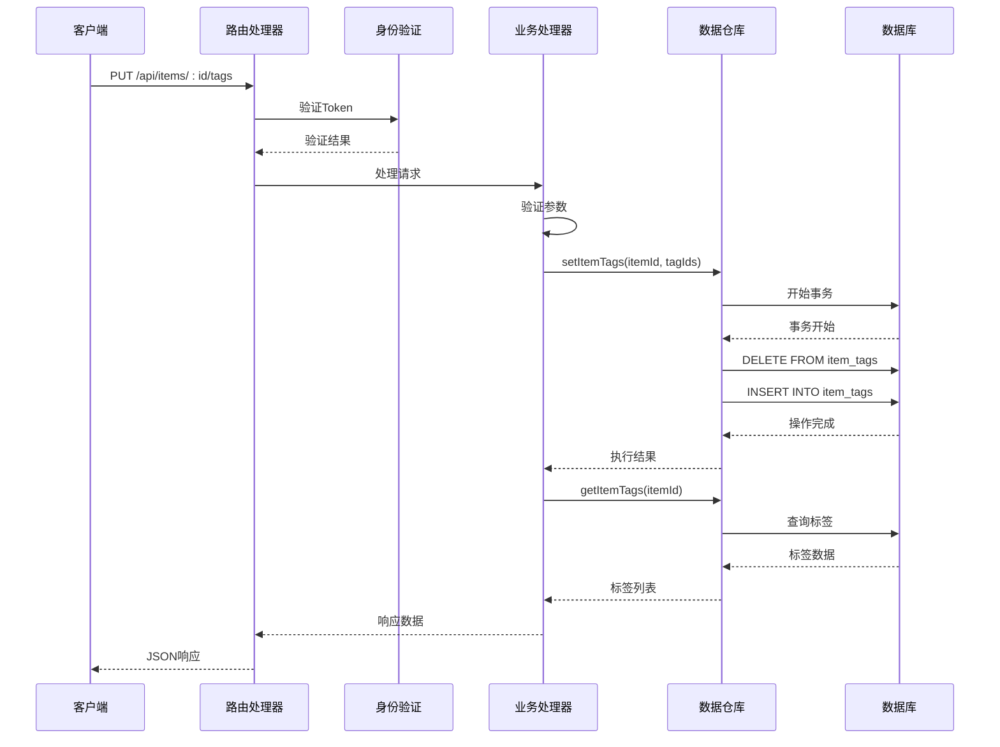
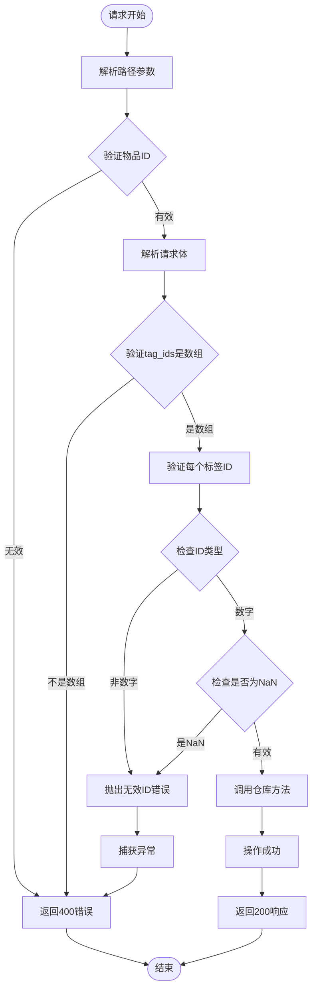
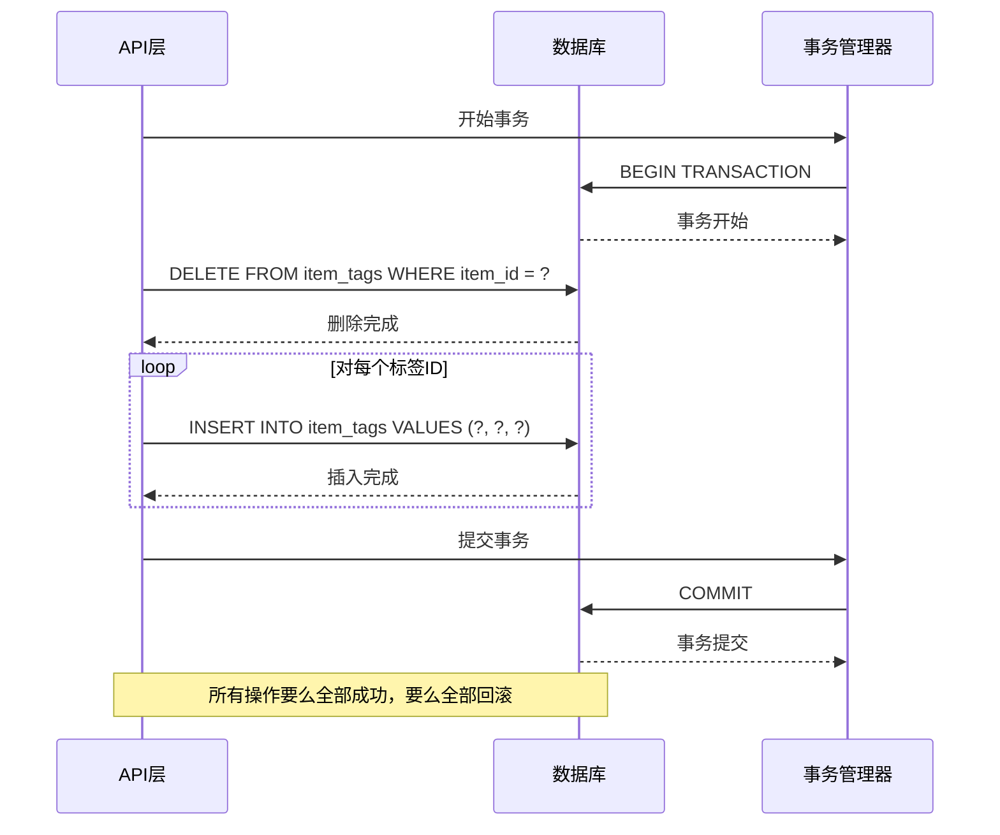
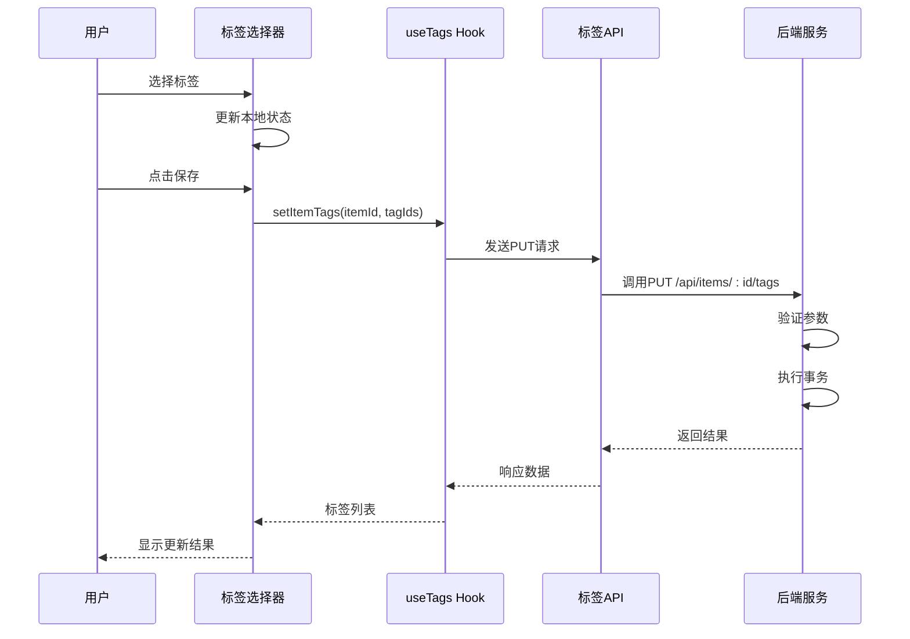
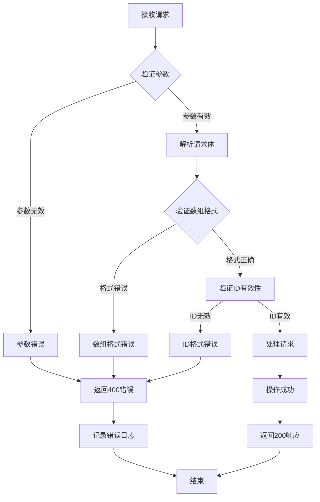
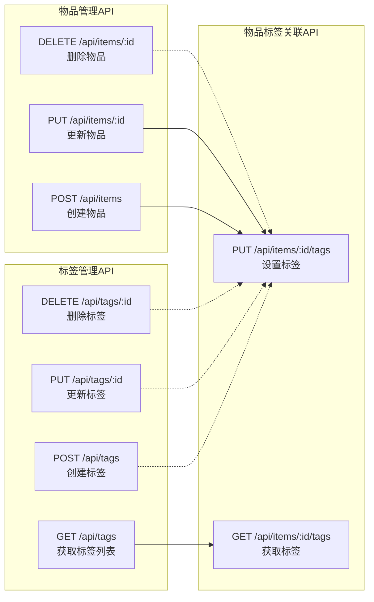

# 物品标签关联API

<cite>
**本文档中引用的文件**
- [app/api/items/[id]/tags/route.ts](file://app/api/items/[id]/tags/route.ts)
- [lib/db/tag-repository.ts](file://lib/db/tag-repository.ts)
- [lib/types/tag.ts](file://lib/types/tag.ts)
- [lib/types/item.ts](file://lib/types/item.ts)
- [lib/db/sqlite.ts](file://lib/db/sqlite.ts)
- [test-tags-api.sh](file://test-tags-api.sh)
- [components/tag-selector.tsx](file://components/tag-selector.tsx)
- [lib/hooks/use-items.ts](file://lib/hooks/use-items.ts)
</cite>

## 目录
1. [简介](#简介)
2. [API接口概述](#api接口概述)
3. [接口规范](#接口规范)
4. [数据模型](#数据模型)
5. [实现架构](#实现架构)
6. [详细功能分析](#详细功能分析)
7. [使用示例](#使用示例)
8. [错误处理](#错误处理)
9. [最佳实践](#最佳实践)
10. [与其他API的关系](#与其他api的关系)

## 简介

物品标签关联API提供了为指定物品设置标签集合的核心功能。该API通过PUT `/api/items/:id/tags` 接口实现了物品与标签之间的多对多关联关系，支持批量设置标签并具有完全的幂等性特征。

### 核心特性

- **幂等性操作**：每次调用都会完全替换物品的现有标签集合
- **批量标签管理**：支持同时为物品分配多个标签
- **实时同步**：标签变更立即生效并返回最新状态
- **事务保证**：使用数据库事务确保操作的原子性
- **级联删除**：标签删除时自动清理关联关系

## API接口概述

### 接口地址
```
PUT /api/items/:id/tags
```

### 请求方法
- **HTTP Method**: PUT
- **认证要求**: 需要有效的Bearer Token
- **内容类型**: `application/json`

### 功能描述
该接口用于为指定物品设置标签集合，会完全替换物品现有的所有标签，实现精确的标签管理控制。

## 接口规范

### 请求参数

#### 路径参数
| 参数名 | 类型 | 必需 | 描述 |
|--------|------|------|------|
| id | string | 是 | 物品的唯一标识符（数字字符串） |

#### 请求体
```typescript
interface SetItemTagsRequest {
  tag_ids: number[];  // 标签ID数组
}
```

#### 请求体字段说明
| 字段名 | 类型 | 必需 | 描述 | 验证规则 |
|--------|------|------|------|----------|
| tag_ids | number[] | 是 | 标签ID数组 | 必须是非空数组，所有元素必须是有效的数字 |

### 响应格式

#### 成功响应
```typescript
interface ApiResponse {
  success: boolean;
  data: Tag[];
}

interface Tag {
  id: number;
  user_id: string;
  name: string;
  color: string;
  created_at: string;
}
```

#### 响应字段说明
| 字段名 | 类型 | 描述 |
|--------|------|------|
| success | boolean | 操作是否成功 |
| data | Tag[] | 物品当前拥有的标签列表 |

### HTTP状态码

| 状态码 | 描述 | 场景 |
|--------|------|------|
| 200 | OK | 操作成功完成 |
| 400 | Bad Request | 请求参数无效 |
| 401 | Unauthorized | 未授权访问 |
| 500 | Internal Server Error | 服务器内部错误 |

## 数据模型

### 标签数据模型



**图表来源**
- [lib/types/tag.ts](file://lib/types/tag.ts#L8-L14)
- [lib/types/item.ts](file://lib/types/item.ts#L9-L25)
- [lib/db/sqlite.ts](file://lib/db/sqlite.ts#L58-L67)

### 数据库表结构

#### tags表
| 列名 | 类型 | 约束 | 描述 |
|------|------|------|------|
| id | INTEGER | PRIMARY KEY AUTOINCREMENT | 标签唯一标识符 |
| user_id | TEXT | NOT NULL DEFAULT 'default_user' | 用户标识符 |
| name | TEXT | NOT NULL | 标签名称 |
| color | TEXT | NOT NULL DEFAULT '#3B82F6' | 标签颜色 |
| created_at | TEXT | NOT NULL | 创建时间 |

#### item_tags表
| 列名 | 类型 | 约束 | 描述 |
|------|------|------|------|
| id | INTEGER | PRIMARY KEY AUTOINCREMENT | 关联记录唯一标识符 |
| item_id | INTEGER | NOT NULL, FOREIGN KEY | 物品ID |
| tag_id | INTEGER | NOT NULL, FOREIGN KEY | 标签ID |
| created_at | TEXT | NOT NULL | 关联创建时间 |

**节来源**
- [lib/db/sqlite.ts](file://lib/db/sqlite.ts#L45-L67)

## 实现架构

### 系统架构图



**图表来源**
- [app/api/items/[id]/tags/route.ts](file://app/api/items/[id]/tags/route.ts#L1-L103)
- [lib/db/tag-repository.ts](file://lib/db/tag-repository.ts#L1-L191)

### 核心组件分析

#### 路由处理器
路由处理器负责接收HTTP请求、参数验证和错误处理。



**图表来源**
- [app/api/items/[id]/tags/route.ts](file://app/api/items/[id]/tags/route.ts#L45-L102)
- [lib/db/tag-repository.ts](file://lib/db/tag-repository.ts#L161-L179)

**节来源**
- [app/api/items/[id]/tags/route.ts](file://app/api/items/[id]/tags/route.ts#L45-L102)
- [lib/db/tag-repository.ts](file://lib/db/tag-repository.ts#L161-L179)

## 详细功能分析

### 幂等性特征

该API的核心特性是幂等性，这意味着：

1. **完全替换行为**：每次调用都会清除物品原有的所有标签
2. **重复调用安全**：相同的请求参数多次执行不会产生副作用
3. **状态一致性**：无论调用多少次，最终状态都是一致的

### 输入验证机制

系统实现了多层次的输入验证：



**图表来源**
- [app/api/items/[id]/tags/route.ts](file://app/api/items/[id]/tags/route.ts#L46-L82)

### 事务处理机制

为了确保数据一致性，系统使用数据库事务：



**图表来源**
- [lib/db/tag-repository.ts](file://lib/db/tag-repository.ts#L164-L179)

**节来源**
- [lib/db/tag-repository.ts](file://lib/db/tag-repository.ts#L161-L179)

## 使用示例

### 基本使用场景

#### 示例1：为物品设置多个标签

假设有一个物品ID为123的笔记本电脑，需要为其设置"电子产品"和"高价值"两个标签：

**请求：**
```bash
curl -X PUT "http://localhost:3000/api/items/123/tags" \
  -H "Authorization: Bearer YOUR_TOKEN" \
  -H "Content-Type: application/json" \
  -d '{
    "tag_ids": [1, 3]
  }'
```

**响应：**
```json
{
  "success": true,
  "data": [
    {
      "id": 1,
      "user_id": "default_user",
      "name": "电子产品",
      "color": "#3B82F6",
      "created_at": "2024-01-15T10:00:00.000Z"
    },
    {
      "id": 3,
      "user_id": "default_user",
      "name": "高价值",
      "color": "#EF4444",
      "created_at": "2024-01-15T10:05:00.000Z"
    }
  ]
}
```

#### 示例2：清空物品标签

要移除物品的所有标签，只需发送空数组：

**请求：**
```bash
curl -X PUT "http://localhost:3000/api/items/123/tags" \
  -H "Authorization: Bearer YOUR_TOKEN" \
  -H "Content-Type: application/json" \
  -d '{
    "tag_ids": []
  }'
```

**响应：**
```json
{
  "success": true,
  "data": []
}
```

### 前端集成示例

#### React Hook使用方式

```typescript
// 在物品编辑组件中使用
const ItemForm = ({ itemId }) => {
  const { setItemTags } = useTags();
  const [selectedTags, setSelectedTags] = useState<number[]>([]);
  
  const handleSaveTags = async () => {
    try {
      const updatedTags = await setItemTags(itemId, selectedTags);
      console.log('标签更新成功:', updatedTags);
    } catch (error) {
      console.error('更新标签失败:', error);
    }
  };
  
  return (
    <div>
      <TagSelector
        selectedTagIds={selectedTags}
        onChange={setSelectedTags}
      />
      <button onClick={handleSaveTags}>保存标签</button>
    </div>
  );
};
```

#### 组件交互流程



**图表来源**
- [components/tag-selector.tsx](file://components/tag-selector.tsx#L41-L48)
- [lib/hooks/use-items.ts](file://lib/hooks/use-items.ts#L78-L86)

**节来源**
- [test-tags-api.sh](file://test-tags-api.sh#L110-L116)
- [components/tag-selector.tsx](file://components/tag-selector.tsx#L41-L48)

## 错误处理

### 常见错误场景

#### 1. 无效的物品ID

**错误信息：**
```json
{
  "error": "无效的物品 ID"
}
```

**触发条件：**
- 路径参数中的ID无法转换为数字
- ID为负数或非整数值

**解决方案：**
确保传递正确的物品ID，且为正整数。

#### 2. 缺少路由参数

**错误信息：**
```json
{
  "error": "缺少路由参数"
}
```

**触发条件：**
- URL中缺少`:id`参数
- 参数格式不正确

**解决方案：**
检查URL格式，确保包含完整的物品ID参数。

#### 3. tag_ids格式错误

**错误信息：**
```json
{
  "error": "tag_ids 必须是数组"
}
```

**触发条件：**
- 请求体中缺少`tag_ids`字段
- `tag_ids`不是数组类型

**解决方案：**
确保请求体包含`tag_ids`字段，且其值为数组。

#### 4. 无效的标签ID

**错误信息：**
```json
{
  "error": "tag_ids 包含无效的 ID"
}
```

**触发条件：**
- 数组中包含非数字类型的元素
- 数组中包含NaN值

**解决方案：**
检查标签ID数组，确保所有元素都是有效的数字。

### 错误处理流程



**图表来源**
- [app/api/items/[id]/tags/route.ts](file://app/api/items/[id]/tags/route.ts#L46-L101)

**节来源**
- [app/api/items/[id]/tags/route.ts](file://app/api/items/[id]/tags/route.ts#L46-L101)

## 最佳实践

### 性能优化建议

1. **批量操作**：尽量减少API调用次数，一次性设置多个标签
2. **缓存策略**：前端可以缓存标签列表，避免重复获取
3. **错误重试**：对于网络错误，实现指数退避重试机制

### 安全考虑

1. **输入验证**：严格验证所有输入参数，防止SQL注入
2. **权限控制**：确保用户只能操作自己的物品和标签
3. **事务保证**：使用数据库事务确保操作的原子性

### 开发建议

1. **类型安全**：使用TypeScript确保类型安全
2. **错误处理**：实现完善的错误处理和用户反馈
3. **日志记录**：记录关键操作以便问题排查

## 与其他API的关系

### 标签管理API关联

该接口与标签管理API形成了完整的标签管理体系：



**图表来源**
- [app/api/items/[id]/tags/route.ts](file://app/api/items/[id]/tags/route.ts#L1-L103)
- [lib/db/tag-repository.ts](file://lib/db/tag-repository.ts#L1-L191)

### 数据流关系

标签关联API在整体数据流中扮演着关键角色：

1. **创建阶段**：物品创建后可立即设置标签
2. **更新阶段**：物品信息修改时可同步更新标签
3. **查询阶段**：支持按标签筛选和过滤物品
4. **删除阶段**：标签删除时自动清理关联关系

**节来源**
- [lib/db/tag-repository.ts](file://lib/db/tag-repository.ts#L100-L112)
- [app/api/items/[id]/tags/route.ts](file://app/api/items/[id]/tags/route.ts#L1-L103)