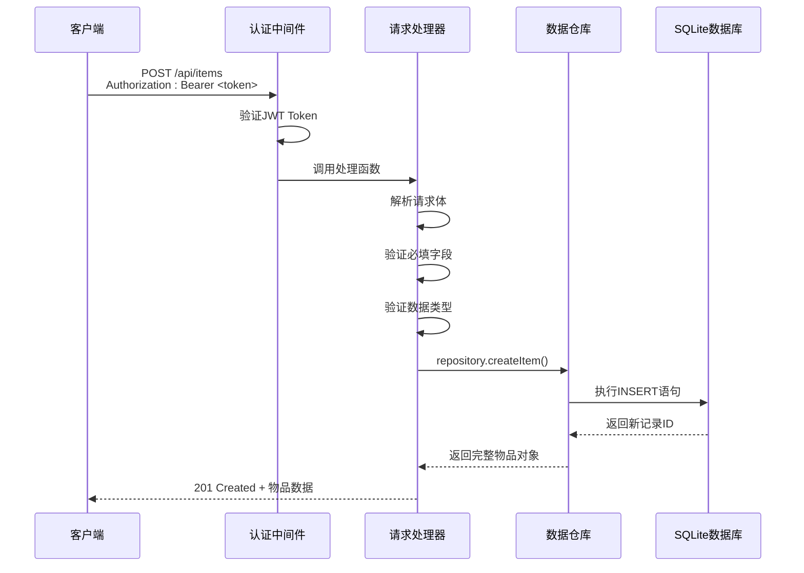
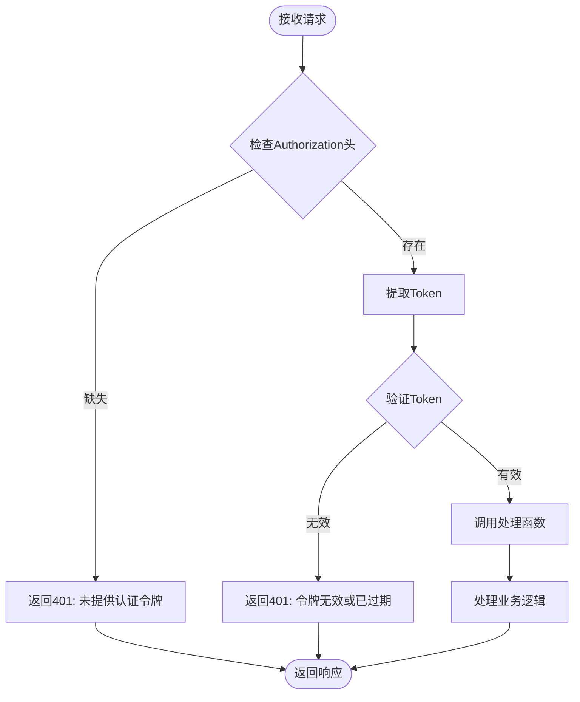
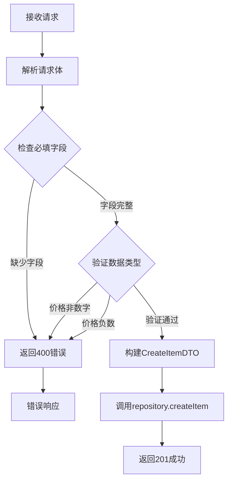
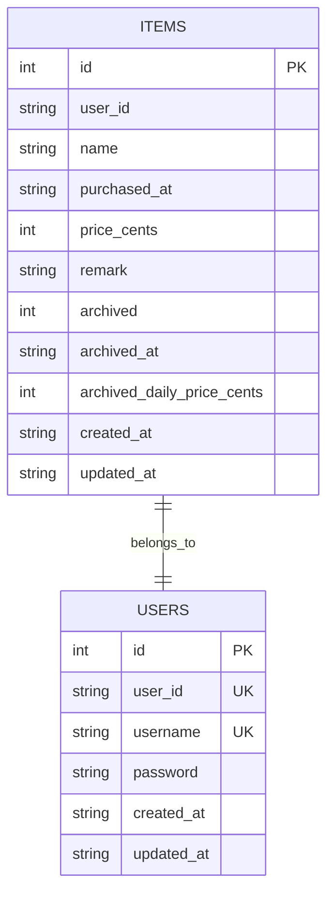

# 创建物品API详细文档

<cite>
**本文档引用的文件**
- [app/api/items/route.ts](file://app/api/items/route.ts)
- [lib/types/item.ts](file://lib/types/item.ts)
- [lib/db/repository.ts](file://lib/db/repository.ts)
- [lib/auth/middleware.ts](file://lib/auth/middleware.ts)
- [lib/auth/jwt.ts](file://lib/auth/jwt.ts)
- [lib/db/sqlite.ts](file://lib/db/sqlite.ts)
- [lib/api/client.ts](file://lib/api/client.ts)
- [test-tags-api.sh](file://test-tags-api.sh)
- [test-tags-api-simple.sh](file://test-tags-api-simple.sh)
</cite>

## 目录
1. [简介](#简介)
2. [API端点概述](#api端点概述)
3. [请求详情](#请求详情)
4. [请求体结构](#请求体结构)
5. [认证机制](#认证机制)
6. [验证逻辑](#验证逻辑)
7. [响应格式](#响应格式)
8. [错误处理](#错误处理)
9. [数据库操作](#数据库操作)
10. [完整示例](#完整示例)
11. [最佳实践](#最佳实践)

## 简介

本文档详细说明了记账应用中创建物品的API接口，包括POST /api/items端点的所有技术细节。该API允许用户创建新的消费记录，支持完整的数据验证、认证机制和错误处理。

## API端点概述

### 端点信息
- **HTTP方法**: POST
- **URL路径**: `/api/items`
- **功能**: 创建新的物品记录
- **认证要求**: 需要JWT Bearer Token



**图表来源**
- [app/api/items/route.ts](file://app/api/items/route.ts#L34-L74)
- [lib/auth/middleware.ts](file://lib/auth/middleware.ts#L8-L33)

## 请求详情

### HTTP方法和URL
- **方法**: `POST`
- **路径**: `/api/items`
- **内容类型**: `application/json`

### 请求头要求
- `Content-Type: application/json`
- `Authorization: Bearer <JWT_TOKEN>`

**节来源**
- [app/api/items/route.ts](file://app/api/items/route.ts#L34-L36)

## 请求体结构

### CreateItemDTO接口定义

| 字段名 | 类型 | 必填 | 描述 |
|--------|------|------|------|
| `name` | `string` | ✅ | 物品名称，不能为空 |
| `purchased_at` | `string` | ✅ | 购买日期，格式：YYYY-MM-DD |
| `price_cents` | `number` | ✅ | 购买价格，单位为分，必须为非负数 |
| `remark` | `string` | ❌ | 备注信息（可选） |

### 字段详细说明

#### name字段
- **类型**: `string`
- **验证**: 必填，不能为空字符串
- **长度限制**: 无硬性限制，但建议不超过255字符

#### purchased_at字段
- **类型**: `string`
- **格式**: ISO 8601日期格式（YYYY-MM-DD）
- **验证**: 必填，格式正确的日期字符串
- **示例**: `"2024-01-15"`

#### price_cents字段
- **类型**: `number`
- **验证**: 必填，必须为数字且大于等于0
- **单位**: 分（1元 = 100分）
- **范围**: `[0, +∞)`
- **示例**: `120000` 表示1200元

#### remark字段
- **类型**: `string`
- **验证**: 可选，默认为空字符串
- **用途**: 用于添加额外的备注信息

**节来源**
- [lib/types/item.ts](file://lib/types/item.ts#L30-L34)

## 认证机制

### JWT Bearer Token认证

系统采用JWT（JSON Web Token）进行身份认证，所有需要访问用户数据的API都需要提供有效的认证令牌。



**图表来源**
- [lib/auth/middleware.ts](file://lib/auth/middleware.ts#L11-L32)
- [lib/auth/jwt.ts](file://lib/auth/jwt.ts#L22-L29)

### 认证流程详解

1. **Token提取**: 从请求头的`Authorization`字段中提取Bearer Token
2. **Token验证**: 使用密钥验证JWT的有效性和签名
3. **用户信息**: 验证通过后获取用户身份信息
4. **权限检查**: 确认用户具有访问权限

### 默认认证凭据

- **用户名**: `admin`
- **密码**: `admin123`
- **Token有效期**: 7天

**节来源**
- [lib/auth/jwt.ts](file://lib/auth/jwt.ts#L35-L46)

## 验证逻辑

### 服务器端验证规则

系统在服务器端实现了严格的验证逻辑，确保数据的完整性和一致性。



**图表来源**
- [app/api/items/route.ts](file://app/api/items/route.ts#L39-L60)

### 具体验证规则

#### 1. 必填字段验证
- **name字段**: 不能为空字符串
- **purchased_at字段**: 必须提供，格式正确
- **price_cents字段**: 必须提供，不能为undefined

#### 2. 数据类型验证
- **price_cents**: 必须为数字类型
- **价格范围**: 必须大于等于0（非负数）

#### 3. 错误响应格式
当验证失败时，API返回以下格式的错误响应：

```json
{
  "error": "错误描述信息",
  "status": 400
}
```

**节来源**
- [app/api/items/route.ts](file://app/api/items/route.ts#L40-L52)

## 响应格式

### 成功响应

当物品创建成功时，API返回HTTP 201状态码和包含完整物品对象的响应。

#### 响应结构
```json
{
  "success": true,
  "data": {
    "id": 1,
    "remote_id": null,
    "name": "MacBook Pro",
    "purchased_at": "2024-01-01",
    "price_cents": 120000,
    "remark": "工作用电脑",
    "archived": 0,
    "archived_at": null,
    "archived_daily_price_cents": null,
    "sync_status": 0,
    "last_synced_at": null,
    "created_at": "2024-01-01T10:00:00.000Z",
    "updated_at": "2024-01-01T10:00:00.000Z",
    "version": 1,
    "is_deleted": 0
  }
}
```

### 响应字段说明

| 字段名 | 类型 | 描述 |
|--------|------|------|
| `id` | `number` | 本地主键，自增生成 |
| `remote_id` | `string \| null` | 云端记录ID（UUID，可选） |
| `name` | `string` | 物品名称 |
| `purchased_at` | `string` | 购买日期（ISO格式） |
| `price_cents` | `number` | 购买价格（分） |
| `remark` | `string` | 备注信息 |
| `archived` | `number` | 归档状态（0=否，1=是） |
| `archived_at` | `string \| null` | 归档时间（ISO格式） |
| `archived_daily_price_cents` | `number \| null` | 归档时锁定的日均价格 |
| `sync_status` | `number` | 同步状态（0=未同步，1=已同步等） |
| `last_synced_at` | `string \| null` | 最近同步时间 |
| `created_at` | `string` | 记录创建时间 |
| `updated_at` | `string` | 最近更新时间 |
| `version` | `number` | 版本号 |
| `is_deleted` | `number` | 软删除标记 |

**节来源**
- [lib/types/item.ts](file://lib/types/item.ts#L9-L25)

## 错误处理

### 常见错误情况

#### 1. 认证相关错误
- **401 Unauthorized**: 未提供认证令牌
- **401 Unauthorized**: 令牌无效或已过期

#### 2. 请求数据错误
- **400 Bad Request**: 缺少必填字段
- **400 Bad Request**: 价格必须为非负数
- **400 Bad Request**: 请求体格式错误

#### 3. 服务器内部错误
- **500 Internal Server Error**: 服务器处理过程中发生错误

### 错误响应示例

```json
{
  "error": "缺少必填字段：name, purchased_at, price_cents",
  "status": 400
}
```

```json
{
  "error": "价格必须为非负数",
  "status": 400
}
```

```json
{
  "error": "创建物品失败",
  "status": 500
}
```

**节来源**
- [app/api/items/route.ts](file://app/api/items/route.ts#L41-L72)

## 数据库操作

### 数据库架构

系统使用SQLite作为数据存储，采用单用户模式，所有数据都属于固定用户ID。



**图表来源**
- [lib/db/sqlite.ts](file://lib/db/sqlite.ts#L28-L42)

### 创建物品的数据库流程

1. **数据准备**: 构建INSERT语句所需的参数
2. **SQL执行**: 执行INSERT语句插入新记录
3. **ID获取**: 通过lastInsertRowid获取新记录的ID
4. **记录查询**: 查询刚插入的完整记录
5. **结果返回**: 返回完整的物品对象

### 默认值设置

创建物品时，系统自动设置以下默认值：
- `archived`: 0（未归档）
- `archived_at`: null
- `archived_daily_price_cents`: null
- `sync_status`: 0（未同步）
- `created_at`: 当前时间
- `updated_at`: 当前时间

**节来源**
- [lib/db/repository.ts](file://lib/db/repository.ts#L37-L63)

## 完整示例

### curl命令示例

以下是使用curl命令创建物品的完整示例：

#### 1. 获取认证Token（首次使用）
```bash
curl -X POST "http://localhost:3000/api/auth/login" \
  -H "Content-Type: application/json" \
  -d '{"username":"admin","password":"admin123"}'
```

#### 2. 使用Token创建物品
```bash
curl -X POST "http://localhost:3000/api/items" \
  -H "Authorization: Bearer YOUR_JWT_TOKEN" \
  -H "Content-Type: application/json" \
  -d '{
    "name": "MacBook Pro",
    "purchased_at": "2024-01-01",
    "price_cents": 120000,
    "remark": "工作用电脑"
  }'
```

#### 3. 简化版创建物品（使用测试脚本）
根据测试脚本中的示例：
```bash
curl -X POST "http://localhost:3000/api/items" \
  -H "Authorization: Bearer ${TOKEN}" \
  -H "Content-Type: application/json" \
  -d '{
    "name":"测试笔记本电脑",
    "purchased_at":"2024-01-01",
    "price_cents":500000,
    "remark":"用于测试标签功能"
  }'
```

### JavaScript客户端示例

```javascript
// 使用API客户端创建物品
const newItem = await api.items.create({
  name: "iPhone 15 Pro",
  purchased_at: "2024-01-15",
  price_cents: 89900,
  remark: "最新款手机"
});

console.log("创建的物品:", newItem);
```

### 响应示例

成功创建后的响应：
```json
{
  "success": true,
  "data": {
    "id": 1,
    "remote_id": null,
    "name": "MacBook Pro",
    "purchased_at": "2024-01-01",
    "price_cents": 120000,
    "remark": "工作用电脑",
    "archived": 0,
    "archived_at": null,
    "archived_daily_price_cents": null,
    "sync_status": 0,
    "last_synced_at": null,
    "created_at": "2024-01-01T10:00:00.000Z",
    "updated_at": "2024-01-01T10:00:00.000Z",
    "version": 1,
    "is_deleted": 0
  }
}
```

**节来源**
- [test-tags-api.sh](file://test-tags-api.sh#L95-L103)
- [lib/api/client.ts](file://lib/api/client.ts#L111-L120)

## 最佳实践

### 1. 数据验证建议
- 在客户端进行初步验证，减少无效请求
- 使用统一的日期格式处理
- 对价格进行精度控制（避免浮点数误差）

### 2. 错误处理策略
- 实现重试机制处理临时性错误
- 记录详细的错误日志便于调试
- 提供友好的错误提示信息

### 3. 性能优化
- 使用批量操作减少网络请求
- 实现本地缓存机制
- 合理使用索引提高查询性能

### 4. 安全考虑
- 严格验证所有输入数据
- 实施适当的速率限制
- 定期轮换认证密钥

### 5. 开发建议
- 使用TypeScript获得更好的类型安全
- 实现单元测试覆盖核心业务逻辑
- 编写清晰的API文档

**节来源**
- [app/api/items/route.ts](file://app/api/items/route.ts#L34-L74)
- [lib/db/repository.ts](file://lib/db/repository.ts#L37-L63)