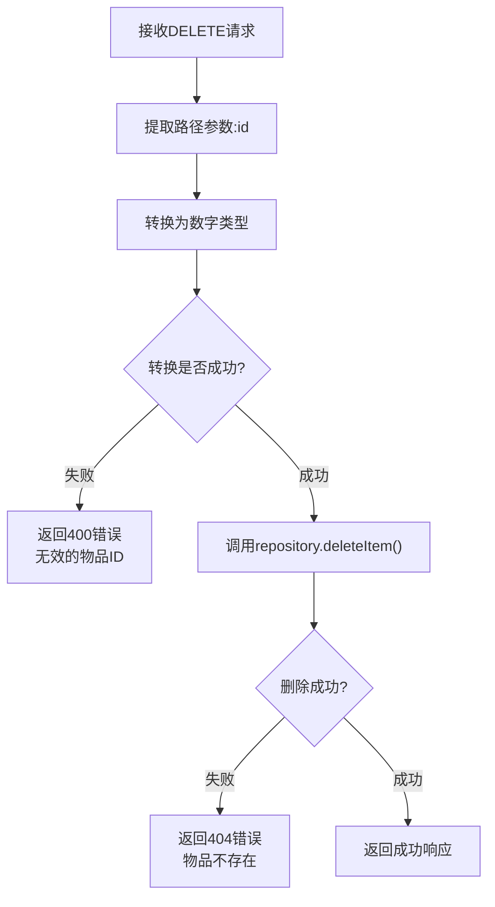
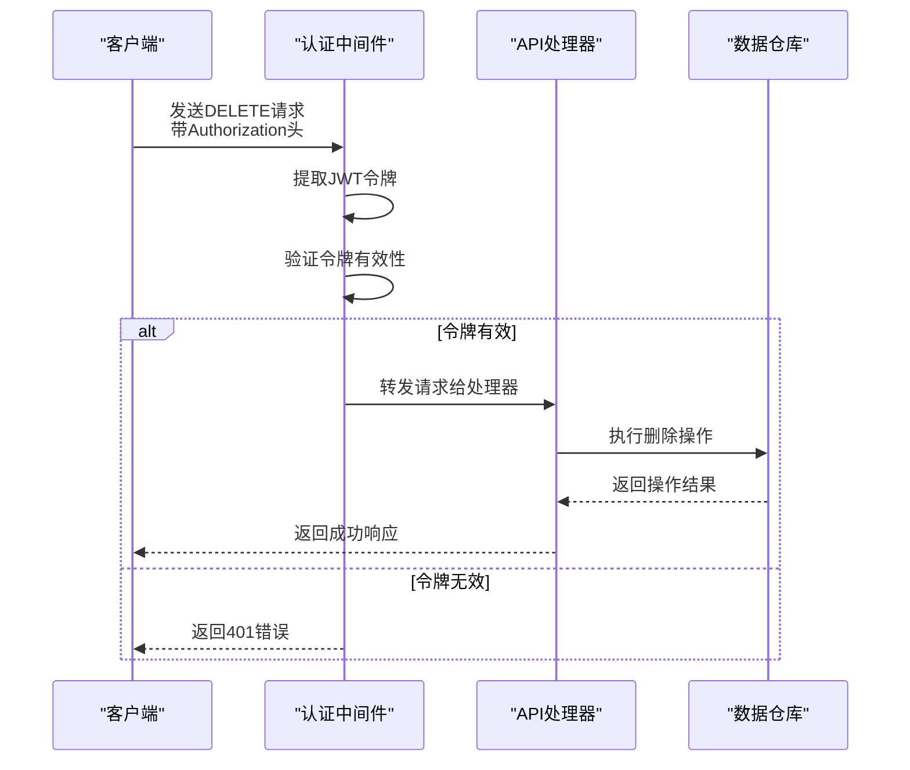
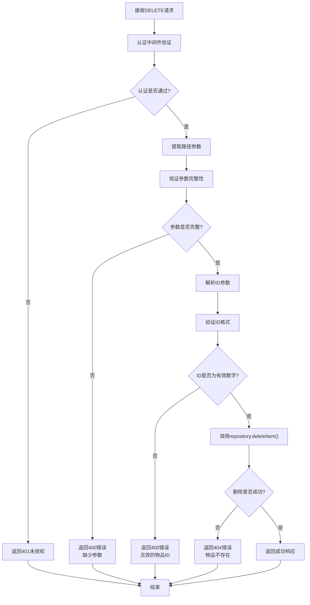
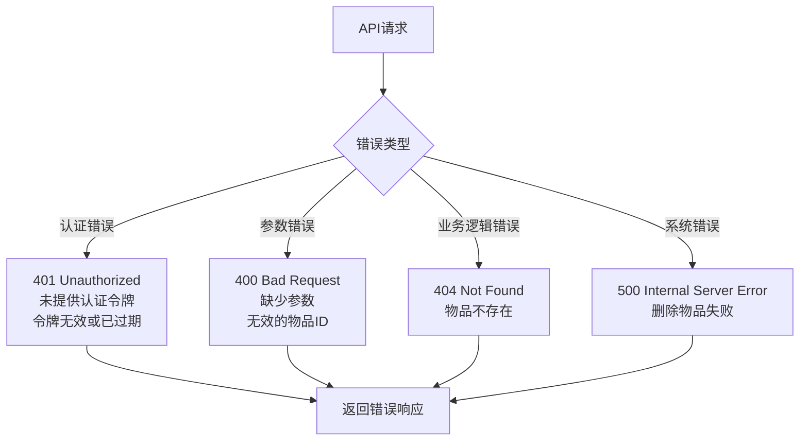

# 删除物品API详细文档

<cite>
**本文档中引用的文件**
- [app/api/items/[id]/route.ts](file://app/api/items/[id]/route.ts)
- [lib/db/repository.ts](file://lib/db/repository.ts)
- [lib/types/item.ts](file://lib/types/item.ts)
- [lib/auth/middleware.ts](file://lib/auth/middleware.ts)
- [lib/api/client.ts](file://lib/api/client.ts)
- [lib/db/sqlite.ts](file://lib/db/sqlite.ts)
- [README.md](file://README.md)
</cite>

## 目录
1. [简介](#简介)
2. [API端点概述](#api端点概述)
3. [路径参数详解](#路径参数详解)
4. [认证机制](#认证机制)
5. [请求处理流程](#请求处理流程)
6. [响应格式](#响应格式)
7. [错误处理](#错误处理)
8. [删除操作类型](#删除操作类型)
9. [使用示例](#使用示例)
10. [最佳实践](#最佳实践)

## 简介

DELETE /api/items/:id 是个人物品成本管理系统中的核心API端点，用于删除指定ID的物品记录。该API实现了严格的参数验证、认证检查和错误处理机制，确保数据安全性和操作的不可逆性。

## API端点概述

### 端点信息
- **URL**: `DELETE /api/items/:id`
- **认证**: 需要有效的JWT令牌
- **内容类型**: `application/json`
- **响应格式**: JSON

### 功能描述
该API端点负责删除系统中指定ID的物品记录。删除操作具有以下特点：
- **不可逆性**: 删除后无法恢复
- **原子性**: 操作要么完全成功，要么完全失败
- **安全性**: 需要有效认证且只能删除属于当前用户的物品

## 路径参数详解

### :id 参数
- **类型**: 字符串
- **位置**: URL路径
- **用途**: 指定要删除的物品唯一标识符
- **格式要求**: 必须是有效的整数字符串



**图表来源**
- [app/api/items/[id]/route.ts](file://app/api/items/[id]/route.ts#L101-L133)

**节来源**
- [app/api/items/[id]/route.ts](file://app/api/items/[id]/route.ts#L101-L133)

## 认证机制

### JWT认证流程

系统采用基于JWT的认证机制，所有API请求都需要携带有效的认证令牌。



**图表来源**
- [lib/auth/middleware.ts](file://lib/auth/middleware.ts#L8-L33)
- [app/api/items/[id]/route.ts](file://app/api/items/[id]/route.ts#L101-L133)

### 认证要求
- **必需**: Authorization头包含Bearer令牌
- **格式**: `Authorization: Bearer <token>`
- **有效期**: 令牌必须在有效期内
- **权限**: 令牌对应的用户必须有权限访问目标物品

**节来源**
- [lib/auth/middleware.ts](file://lib/auth/middleware.ts#L1-L34)

## 请求处理流程

### 完整处理流程



**图表来源**
- [app/api/items/[id]/route.ts](file://app/api/items/[id]/route.ts#L101-L133)

### 参数验证步骤

1. **上下文验证**: 检查是否存在路由参数
2. **ID解析**: 将字符串ID转换为数字
3. **格式验证**: 确认ID是有效的整数
4. **存在性检查**: 验证物品是否存在于数据库中

**节来源**
- [app/api/items/[id]/route.ts](file://app/api/items/[id]/route.ts#L101-L133)

## 响应格式

### 成功响应

当物品成功删除时，API返回以下JSON格式的响应：

```json
{
  "success": true,
  "message": "删除成功"
}
```

### 响应字段说明

| 字段 | 类型 | 说明 |
|------|------|------|
| success | boolean | 操作成功标志，始终为true |
| message | string | 操作结果消息 |

### HTTP状态码

- **200 OK**: 物品删除成功
- **400 Bad Request**: 请求参数无效
- **401 Unauthorized**: 认证失败
- **404 Not Found**: 物品不存在
- **500 Internal Server Error**: 服务器内部错误

**节来源**
- [app/api/items/[id]/route.ts](file://app/api/items/[id]/route.ts#L125-L126)

## 错误处理

### 错误类型及处理



**图表来源**
- [app/api/items/[id]/route.ts](file://app/api/items/[id]/route.ts#L101-L133)

### 错误响应格式

```json
{
  "error": "错误描述信息"
}
```

### 错误场景详解

1. **缺少参数 (400)**:
   - 上下文参数缺失
   - 路由参数无法解析

2. **无效ID (400)**:
   - ID不是数字格式
   - ID为空或null

3. **物品不存在 (404)**:
   - 指定ID的物品不存在
   - 物品已被删除或从未存在

4. **认证失败 (401)**:
   - 缺少Authorization头
   - JWT令牌无效或过期

5. **服务器错误 (500)**:
   - 数据库连接问题
   - SQL执行异常
   - 未知系统错误

**节来源**
- [app/api/items/[id]/route.ts](file://app/api/items/[id]/route.ts#L101-L133)

## 删除操作类型

### 硬删除实现

根据repository.deleteItem()的实现，该API执行的是**硬删除**操作：

```typescript
// repository.ts 中的删除实现
export function deleteItem(id: number): boolean {
  const db = getDatabase();
  const stmt = db.prepare('DELETE FROM items WHERE id = ? AND user_id = ?');
  const result = stmt.run(id, USER_ID);
  return result.changes > 0;
}
```

### 硬删除特点

- **永久性**: 数据从数据库中物理删除
- **不可恢复**: 删除后无法通过常规查询找回
- **性能**: 相比软删除有更好的性能表现
- **存储**: 释放数据库存储空间

### 与软删除的区别

| 特性 | 硬删除 | 软删除 |
|------|--------|--------|
| 数据可见性 | 不可见 | 可见（标记为已删除） |
| 存储占用 | 释放空间 | 继续占用空间 |
| 查询性能 | 更好 | 较差（需要过滤删除标记） |
| 恢复难度 | 困难 | 相对容易 |
| 数据完整性 | 完全移除 | 保留历史记录 |

**节来源**
- [lib/db/repository.ts](file://lib/db/repository.ts#L124-L132)

## 使用示例

### curl命令示例

#### 成功删除物品
```bash
curl -X DELETE \
  -H "Authorization: Bearer YOUR_JWT_TOKEN" \
  -H "Content-Type: application/json" \
  https://your-domain.com/api/items/123
```

#### 响应示例
```json
{
  "success": true,
  "message": "删除成功"
}
```

#### 删除不存在的物品
```bash
curl -X DELETE \
  -H "Authorization: Bearer YOUR_JWT_TOKEN" \
  -H "Content-Type: application/json" \
  https://your-domain.com/api/items/999
```

#### 响应示例
```json
{
  "error": "物品不存在"
}
```

#### 使用JavaScript Fetch API
```javascript
try {
  const response = await fetch('/api/items/123', {
    method: 'DELETE',
    headers: {
      'Authorization': `Bearer ${token}`,
      'Content-Type': 'application/json'
    }
  });
  
  if (!response.ok) {
    const error = await response.json();
    throw new Error(error.error || '删除失败');
  }
  
  const result = await response.json();
  console.log('删除成功:', result.message);
} catch (error) {
  console.error('删除物品失败:', error.message);
}
```

#### 使用API客户端
```javascript
import { api } from '@/lib/api/client';

try {
  await api.items.delete(123);
  console.log('物品删除成功');
} catch (error) {
  console.error('删除失败:', error.message);
}
```

**节来源**
- [lib/api/client.ts](file://lib/api/client.ts#L138-L142)

## 最佳实践

### 安全建议

1. **令牌管理**:
   - 妥善保管JWT令牌
   - 及时清除过期令牌
   - 使用HTTPS传输令牌

2. **输入验证**:
   - 始终验证ID格式
   - 检查用户权限
   - 防止SQL注入攻击

3. **错误处理**:
   - 捕获并处理所有可能的异常
   - 提供有意义的错误信息
   - 记录详细的错误日志

### 性能优化

1. **数据库索引**:
   - 确保items表有适当的索引
   - 优化查询性能

2. **连接管理**:
   - 复用数据库连接
   - 及时关闭不需要的连接

### 开发建议

1. **单元测试**:
   ```javascript
   // 测试删除操作
   test('should delete item successfully', async () => {
     const result = await api.items.delete(123);
     expect(result.success).toBe(true);
     expect(result.message).toBe('删除成功');
   });
   
   test('should handle non-existent item', async () => {
     const result = await api.items.delete(999);
     expect(result.error).toBe('物品不存在');
   });
   ```

2. **集成测试**:
   - 测试完整的删除流程
   - 验证数据库状态变化
   - 检查权限控制

3. **监控和日志**:
   - 记录删除操作
   - 监控API性能
   - 跟踪错误率

### 用户体验

1. **确认提示**:
   - 在前端添加删除确认对话框
   - 显示删除影响范围
   - 提供撤销选项（如果可能）

2. **批量操作**:
   - 考虑实现批量删除功能
   - 提供进度反馈
   - 处理部分成功的情况

3. **数据备份**:
   - 建议定期备份数据
   - 实现软删除作为硬删除的替代方案
   - 提供数据恢复机制

**节来源**
- [app/api/items/[id]/route.ts](file://app/api/items/[id]/route.ts#L101-L133)
- [lib/db/repository.ts](file://lib/db/repository.ts#L124-L132)