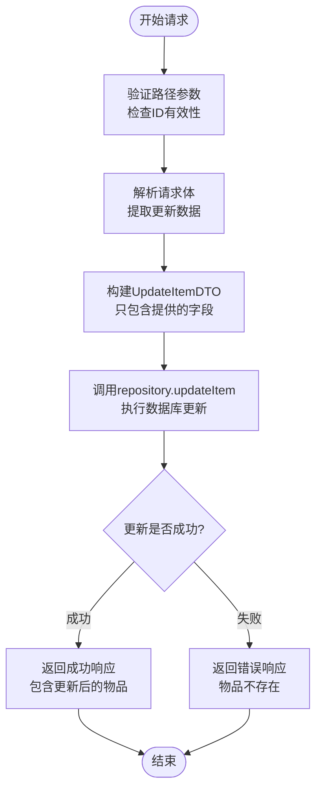
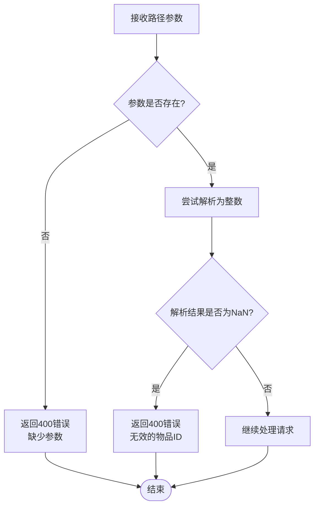
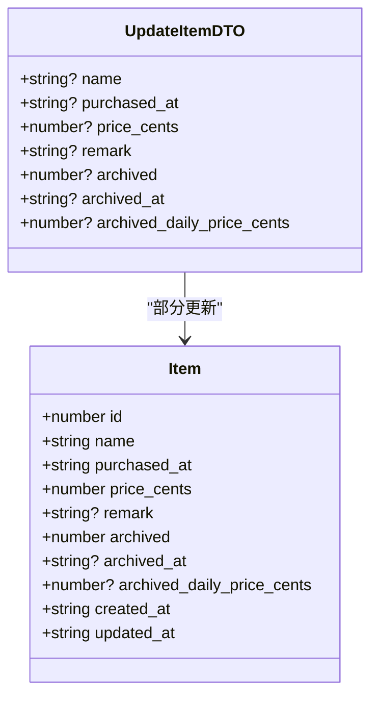
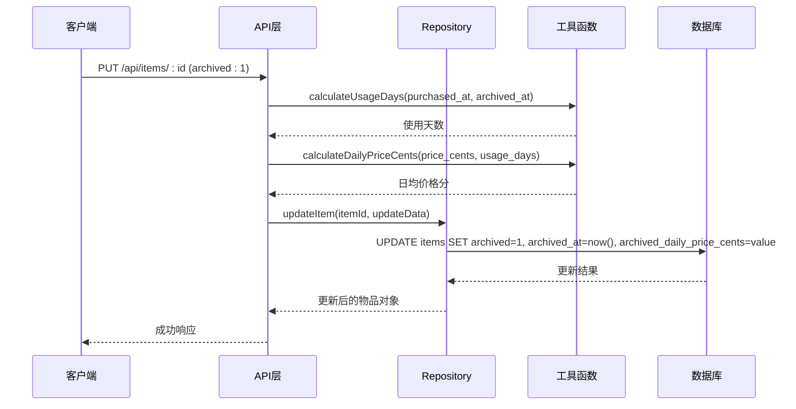
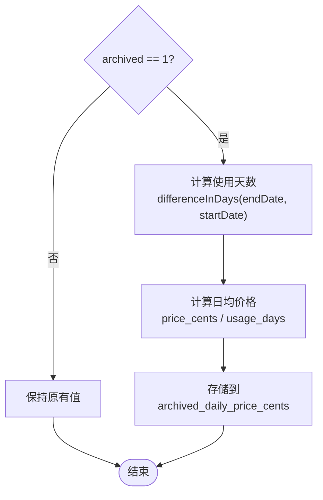
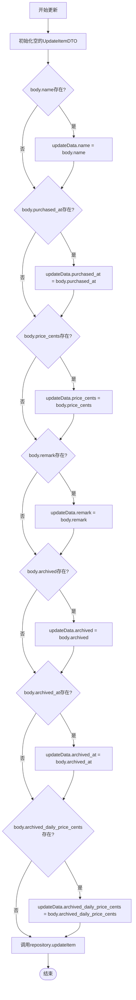
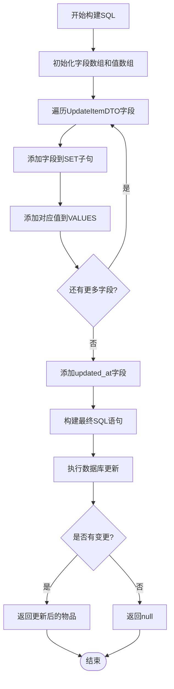
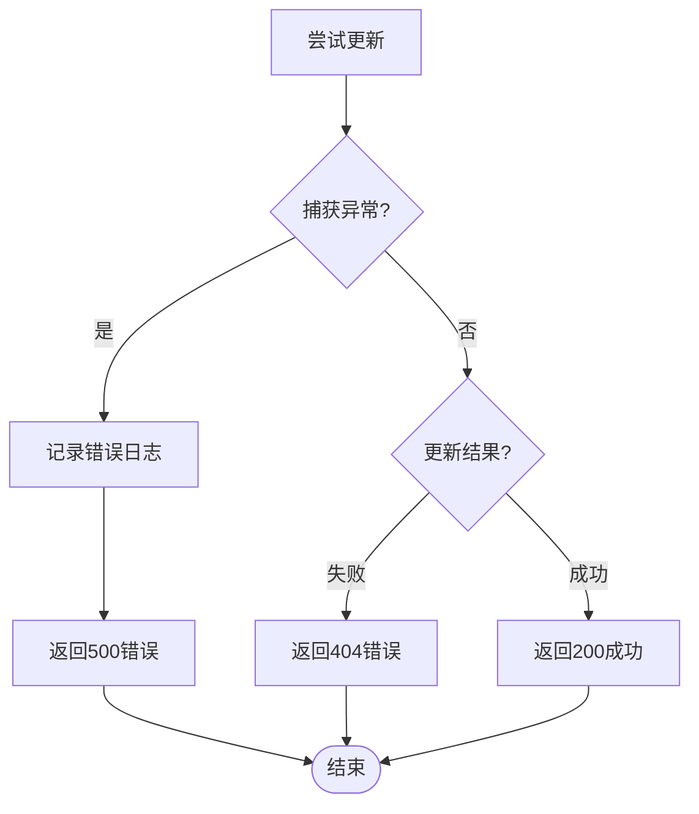
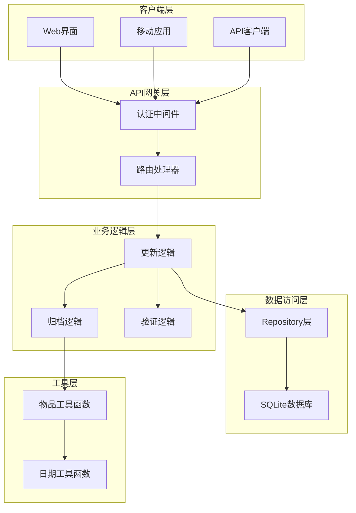
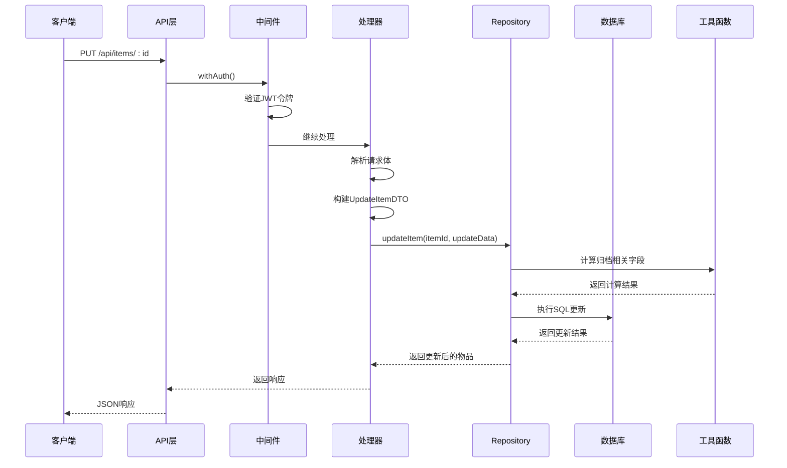

# 更新物品API详细文档

<cite>
**本文档引用的文件**
- [app/api/items/[id]/route.ts](file://app/api/items/[id]/route.ts)
- [lib/types/item.ts](file://lib/types/item.ts)
- [lib/db/repository.ts](file://lib/db/repository.ts)
- [lib/utils/item-utils.ts](file://lib/utils/item-utils.ts)
- [lib/api/client.ts](file://lib/api/client.ts)
- [lib/hooks/use-items.ts](file://lib/hooks/use-items.ts)
- [需求说明.md](file://需求说明.md)
</cite>

## 目录
1. [简介](#简介)
2. [API端点概述](#api端点概述)
3. [路径参数详解](#路径参数详解)
4. [请求体结构](#请求体结构)
5. [归档状态业务逻辑](#归档状态业务逻辑)
6. [部分更新机制](#部分更新机制)
7. [成功响应格式](#成功响应格式)
8. [错误处理](#错误处理)
9. [curl示例](#curl示例)
10. [架构分析](#架构分析)
11. [最佳实践](#最佳实践)

## 简介

本文档详细说明了Bookkeeping应用中更新物品的API接口，重点关注`PUT /api/items/:id`端点的功能特性、业务逻辑和使用方法。该API支持对物品信息的部分更新，并实现了复杂的归档状态管理机制。

## API端点概述

### 端点信息
- **URL**: `PUT /api/items/:id`
- **认证**: 需要有效的JWT令牌
- **功能**: 更新指定ID的物品信息
- **响应状态码**: 成功返回200，错误返回相应状态码

### 请求方法流程图



**图表来源**
- [app/api/items/[id]/route.ts](file://app/api/items/[id]/route.ts#L50-L96)

## 路径参数详解

### 参数说明

| 参数名 | 类型 | 必需 | 说明 |
|--------|------|------|------|
| id | string | 是 | 物品的唯一标识符，必须能转换为有效的整数 |

### 参数验证逻辑



**图表来源**
- [app/api/items/[id]/route.ts](file://app/api/items/[id]/route.ts#L52-L64)

**章节来源**
- [app/api/items/[id]/route.ts](file://app/api/items/[id]/route.ts#L52-L64)

## 请求体结构

### UpdateItemDTO接口定义

UpdateItemDTO是一个可选字段的对象，允许对物品信息进行部分更新：

| 字段名 | 类型 | 可选 | 说明 |
|--------|------|------|------|
| name | string | ✓ | 物品名称 |
| purchased_at | string | ✓ | 购买日期（ISO 日期字符串 YYYY-MM-DD） |
| price_cents | number | ✓ | 购买价格（以"分"为单位） |
| remark | string | ✓ | 备注信息 |
| archived | number | ✓ | 归档状态（0=否，1=是） |
| archived_at | string \| null | ✓ | 归档时间（ISO 字符串，未归档则为 null） |
| archived_daily_price_cents | number \| null | ✓ | 归档日均价格（分） |

### 字段映射关系



**图表来源**
- [lib/types/item.ts](file://lib/types/item.ts#L40-L48)

**章节来源**
- [lib/types/item.ts](file://lib/types/item.ts#L40-L48)
- [app/api/items/[id]/route.ts](file://app/api/items/[id]/route.ts#L66-L78)

## 归档状态业务逻辑

### 归档状态变更规则

归档状态的变更涉及复杂的业务逻辑，主要体现在以下方面：

#### 1. 归档状态从0到1的处理

当`archived`字段从0更新为1时，系统会自动执行以下操作：



**图表来源**
- [lib/hooks/use-items.ts](file://lib/hooks/use-items.ts#L69-L85)
- [lib/utils/item-utils.ts](file://lib/utils/item-utils.ts#L12-L32)

#### 2. 归档状态从1到0的处理

当`archived`字段从1更新为0时，系统会自动清空归档相关字段：

| 字段 | 归档状态为0时的值 |
|------|-------------------|
| archived | 0 |
| archived_at | null |
| archived_daily_price_cents | null |

#### 3. 归档状态不变的处理

如果`archived`字段保持不变，系统不会修改归档相关字段，确保数据一致性。

### 归档计算逻辑



**图表来源**
- [lib/utils/item-utils.ts](file://lib/utils/item-utils.ts#L12-L32)

**章节来源**
- [lib/hooks/use-items.ts](file://lib/hooks/use-items.ts#L69-L94)
- [lib/db/repository.ts](file://lib/db/repository.ts#L137-L155)
- [lib/utils/item-utils.ts](file://lib/utils/item-utils.ts#L12-L32)

## 部分更新机制

### 更新策略

API采用"部分更新"策略，即只更新请求体中提供的字段，未提供的字段保持原值不变。

### 实现机制



**图表来源**
- [app/api/items/[id]/route.ts](file://app/api/items/[id]/route.ts#L67-L78)

### SQL更新语句生成

Repository层会根据提供的字段动态生成SQL更新语句：



**图表来源**
- [lib/db/repository.ts](file://lib/db/repository.ts#L73-L119)

**章节来源**
- [app/api/items/[id]/route.ts](file://app/api/items/[id]/route.ts#L67-L78)
- [lib/db/repository.ts](file://lib/db/repository.ts#L73-L119)

## 成功响应格式

### 响应结构

成功更新物品后，API返回标准的JSON响应格式：

```typescript
{
  "success": true,
  "data": {
    // 更新后的物品对象
  }
}
```

### 响应示例

```json
{
  "success": true,
  "data": {
    "id": 123,
    "name": "升级版笔记本电脑",
    "purchased_at": "2024-01-15",
    "price_cents": 89999,
    "remark": "工作专用",
    "archived": 1,
    "archived_at": "2024-12-01T10:30:00Z",
    "archived_daily_price_cents": 246,
    "sync_status": 1,
    "last_synced_at": "2024-12-01T10:30:00Z",
    "created_at": "2024-01-15T09:00:00Z",
    "updated_at": "2024-12-01T10:30:00Z"
  }
}
```

**章节来源**
- [app/api/items/[id]/route.ts](file://app/api/items/[id]/route.ts#L87-L89)

## 错误处理

### 错误响应格式

API在遇到错误时返回统一的错误响应格式：

```typescript
{
  "error": "错误描述信息"
}
```

### 错误类型及状态码

| 错误情况 | HTTP状态码 | 错误信息 | 处理方式 |
|----------|------------|----------|----------|
| 缺少路径参数 | 400 | "缺少参数" | 客户端需要提供正确的路径参数 |
| 无效的物品ID | 400 | "无效的物品 ID" | 检查ID是否能正确转换为整数 |
| 物品不存在 | 404 | "物品不存在" | 确认物品ID的有效性 |
| 更新失败 | 500 | "更新物品失败" | 服务器内部错误，可能需要重试 |

### 错误处理流程



**图表来源**
- [app/api/items/[id]/route.ts](file://app/api/items/[id]/route.ts#L80-L86)

**章节来源**
- [app/api/items/[id]/route.ts](file://app/api/items/[id]/route.ts#L80-L96)

## curl示例

### 示例1：更新物品名称

```bash
curl -X PUT \
  https://your-bookkeeping-api.com/api/items/123 \
  -H 'Content-Type: application/json' \
  -H 'Authorization: Bearer YOUR_JWT_TOKEN' \
  -d '{
    "name": "升级版笔记本电脑"
  }'
```

### 示例2：将物品归档

```bash
curl -X PUT \
  https://your-bookkeeping-api.com/api/items/123 \
  -H 'Content-Type: application/json' \
  -H 'Authorization: Bearer YOUR_JWT_TOKEN' \
  -d '{
    "archived": 1,
    "archived_at": "2024-12-01T10:30:00Z",
    "archived_daily_price_cents": 246
  }'
```

### 示例3：同时更新名称和备注

```bash
curl -X PUT \
  https://your-bookkeeping-api.com/api/items/123 \
  -H 'Content-Type: application/json' \
  -H 'Authorization: Bearer YOUR_JWT_TOKEN' \
  -d '{
    "name": "升级版笔记本电脑",
    "remark": "工作专用，性能更佳"
  }'
```

### 示例4：取消归档

```bash
curl -X PUT \
  https://your-bookkeeping-api.com/api/items/123 \
  -H 'Content-Type: application/json' \
  -H 'Authorization: Bearer YOUR_JWT_TOKEN' \
  -d '{
    "archived": 0,
    "archived_at": null,
    "archived_daily_price_cents": null
  }'
```

## 架构分析

### 整体架构图



**图表来源**
- [app/api/items/[id]/route.ts](file://app/api/items/[id]/route.ts#L1-L96)
- [lib/db/repository.ts](file://lib/db/repository.ts#L1-L156)

### 数据流分析



**图表来源**
- [app/api/items/[id]/route.ts](file://app/api/items/[id]/route.ts#L50-L96)
- [lib/db/repository.ts](file://lib/db/repository.ts#L69-L121)

**章节来源**
- [app/api/items/[id]/route.ts](file://app/api/items/[id]/route.ts#L1-L96)
- [lib/db/repository.ts](file://lib/db/repository.ts#L1-L156)

## 最佳实践

### 1. 部分更新的最佳实践

- **只传递需要更新的字段**：避免不必要的字段传输，提高性能
- **保持数据一致性**：归档状态变更时，确保相关字段同步更新
- **使用适当的字段类型**：price_cents使用整数，避免浮点数精度问题

### 2. 归档状态管理

- **归档前确认**：在归档前向用户确认操作
- **自动计算**：让系统自动计算使用天数和日均价格
- **状态回滚**：提供取消归档的功能，允许恢复物品状态

### 3. 错误处理建议

- **客户端重试**：对于500错误，实现指数退避重试机制
- **状态码区分**：根据不同的HTTP状态码采取相应的处理策略
- **用户友好提示**：向用户提供清晰的错误信息和解决建议

### 4. 性能优化

- **批量更新**：对于大量物品的更新，考虑批量操作
- **缓存策略**：对频繁查询的物品信息实施适当的缓存
- **索引优化**：确保数据库查询使用了适当的索引

**章节来源**
- [lib/utils/item-utils.ts](file://lib/utils/item-utils.ts#L1-L74)
- [lib/hooks/use-items.ts](file://lib/hooks/use-items.ts#L47-L105)