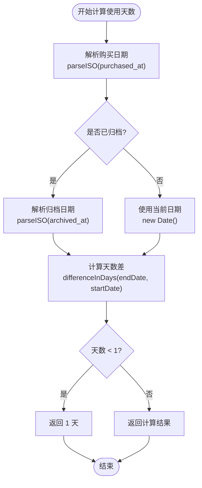
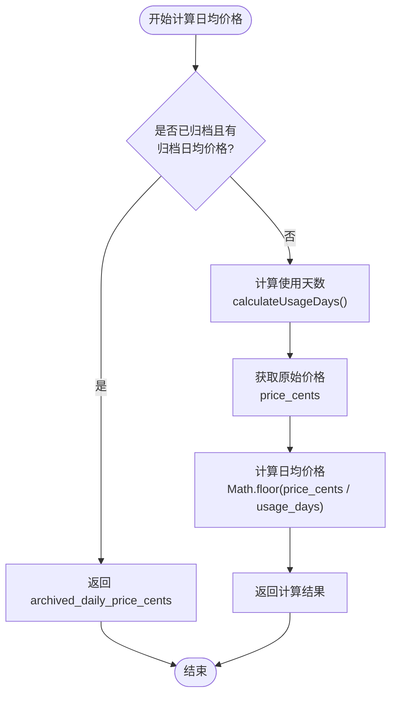
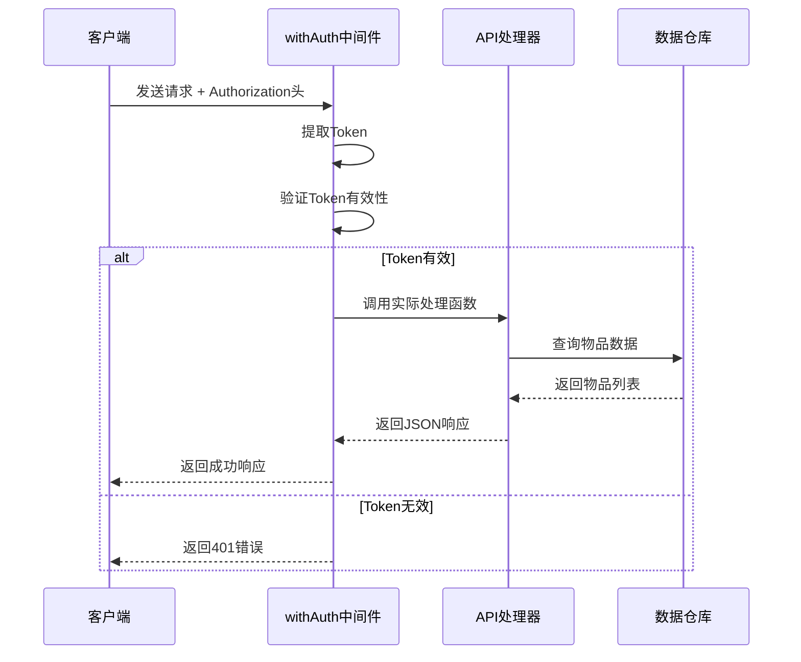
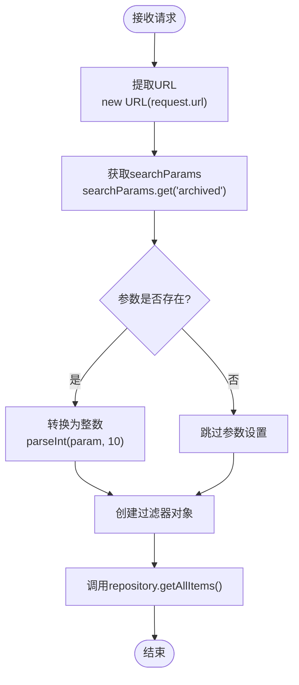
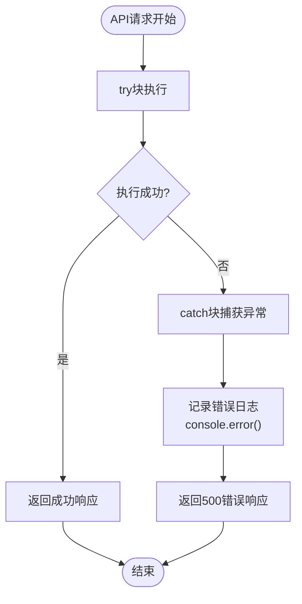

# 查询物品列表API详细文档

<cite>
**本文档中引用的文件**
- [app/api/items/route.ts](file://app/api/items/route.ts)
- [lib/types/item.ts](file://lib/types/item.ts)
- [lib/db/repository.ts](file://lib/db/repository.ts)
- [lib/auth/middleware.ts](file://lib/auth/middleware.ts)
- [lib/utils/item-utils.ts](file://lib/utils/item-utils.ts)
- [lib/db/sqlite.ts](file://lib/db/sqlite.ts)
- [components/item-list.tsx](file://components/item-list.tsx)
- [lib/store/item-store.ts](file://lib/store/item-store.ts)
- [README.md](file://README.md)
</cite>

## 目录
1. [简介](#简介)
2. [API端点概述](#api端点概述)
3. [请求参数详解](#请求参数详解)
4. [响应格式说明](#响应格式说明)
5. [ItemWithStats接口定义](#itemwithstats接口定义)
6. [计算逻辑详解](#计算逻辑详解)
7. [认证中间件流程](#认证中间件流程)
8. [参数解析过程](#参数解析过程)
9. [数据查询实现](#数据查询实现)
10. [错误处理机制](#错误处理机制)
11. [使用示例](#使用示例)
12. [最佳实践建议](#最佳实践建议)

## 简介

本文档详细介绍了个人物品成本管理系统中查询物品列表的API接口。该API提供了灵活的筛选和搜索功能，支持按归档状态筛选和关键词搜索，并返回包含详细统计信息的物品列表。

## API端点概述

### 端点信息
- **URL**: `/api/items`
- **HTTP方法**: `GET`
- **功能**: 获取所有物品列表，支持筛选和搜索

### 支持的查询参数

| 参数名 | 类型 | 必填 | 说明 | 示例值 |
|--------|------|------|------|--------|
| `archived` | number | 否 | 归档状态筛选：0=未归档，1=已归档 | `0` |
| `search` | string | 否 | 关键词搜索，匹配物品名称和备注 | `手机` |

**节来源**
- [app/api/items/route.ts](file://app/api/items/route.ts#L7-L8)

## 请求参数详解

### archived参数
- **作用**: 筛选物品的归档状态
- **取值范围**: `0` 或 `1`
  - `0`: 获取未归档的物品（进行中）
  - `1`: 获取已归档的物品
- **默认行为**: 不提供此参数时，返回所有物品

### search参数
- **作用**: 关键词搜索功能
- **匹配内容**: 物品名称和备注字段
- **匹配方式**: 模糊匹配（包含匹配）
- **大小写**: 不敏感

**节来源**
- [lib/types/item.ts](file://lib/types/item.ts#L82-L85)
- [components/item-list.tsx](file://components/item-list.tsx#L29-L31)

## 响应格式说明

### 成功响应格式

```json
{
  "success": true,
  "data": [
    {
      "id": 1,
      "name": "iPhone 14 Pro",
      "purchased_at": "2024-01-15",
      "price_cents": 89900,
      "remark": "256GB 黑色",
      "archived": 0,
      "usage_days": 30,
      "daily_price_cents": 2997
    }
  ]
}
```

### 响应字段说明

| 字段名 | 类型 | 说明 |
|--------|------|------|
| `success` | boolean | 请求是否成功的标志 |
| `data` | ItemWithStats[] | 物品列表数据 |

**节来源**
- [app/api/items/route.ts](file://app/api/items/route.ts#L20-L21)

## ItemWithStats接口定义

### 基础Item接口

ItemWithStats继承自基础Item接口，扩展了两个统计字段：

```typescript
interface ItemWithStats extends Item {
  usage_days: number;           // 使用天数
  daily_price_cents: number;    // 日均价格（分）
}
```

### 字段详细说明

| 字段名 | 类型 | 说明 |
|--------|------|------|
| `usage_days` | number | 物品的使用天数，计算逻辑见下文 |
| `daily_price_cents` | number | 日均价格，单位为分 |

**节来源**
- [lib/types/item.ts](file://lib/types/item.ts#L90-L93)

## 计算逻辑详解

### usage_days（使用天数）计算

使用天数的计算遵循以下规则：



**图表来源**
- [lib/utils/item-utils.ts](file://lib/utils/item-utils.ts#L12-L21)

### daily_price_cents（日均价格）计算

日均价格的计算逻辑如下：



**图表来源**
- [lib/utils/item-utils.ts](file://lib/utils/item-utils.ts#L59-L66)

### 计算函数实现

具体的计算函数位于 [`lib/utils/item-utils.ts`](file://lib/utils/item-utils.ts)，包含以下核心函数：

- `calculateUsageDays()`: 计算使用天数
- `calculateDailyPriceCents()`: 计算日均价格
- `getItemUsageDays()`: 获取物品使用天数
- `getItemDailyPrice()`: 获取物品日均价格

**节来源**
- [lib/utils/item-utils.ts](file://lib/utils/item-utils.ts#L12-L66)

## 认证中间件流程

### withAuth中间件调用流程



**图表来源**
- [lib/auth/middleware.ts](file://lib/auth/middleware.ts#L8-L32)

### 中间件执行步骤

1. **Token提取**: 从请求头中提取Authorization字段
2. **Token验证**: 验证JWT Token的有效性
3. **权限检查**: 确认用户身份和权限
4. **请求转发**: 将请求转发给实际的API处理器

**节来源**
- [lib/auth/middleware.ts](file://lib/auth/middleware.ts#L11-L31)

## 参数解析过程

### URL参数解析

参数解析过程采用以下步骤：



**图表来源**
- [app/api/items/route.ts](file://app/api/items/route.ts#L11-L19)

### 参数处理细节

- **searchParams.get()**: 从URL查询参数中提取指定参数
- **parseInt()**: 将字符串参数转换为数字，基数为10
- **null检查**: 确保只有在参数存在时才进行转换

**节来源**
- [app/api/items/route.ts](file://app/api/items/route.ts#L12-L18)

## 数据查询实现

### repository.getAllItems()实现

数据查询通过以下SQL语句实现：

```sql
SELECT * FROM items WHERE user_id = ? 
  [AND archived = ?] 
ORDER BY created_at DESC
```

### 查询参数绑定

查询支持动态参数绑定：

| 参数位置 | 值 | 说明 |
|----------|----|----- |
| 第1个参数 | USER_ID | 固定用户标识 |
| 第2个参数 | filter.archived | 可选的归档状态过滤 |

### 排序规则

- **排序字段**: `created_at`（创建时间）
- **排序顺序**: 降序排列（最新创建的物品在前）

**节来源**
- [lib/db/repository.ts](file://lib/db/repository.ts#L9-L22)

## 错误处理机制

### 错误处理流程



**图表来源**
- [app/api/items/route.ts](file://app/api/items/route.ts#L11-L28)

### 错误响应格式

当发生服务器内部错误时，返回以下格式的响应：

```json
{
  "error": "获取物品列表失败"
}
```

### 状态码说明

- **200 OK**: 请求成功，返回物品列表
- **500 Internal Server Error**: 服务器内部错误

**节来源**
- [app/api/items/route.ts](file://app/api/items/route.ts#L23-L27)

## 使用示例

### 获取所有未归档物品

```bash
curl -X GET "http://localhost:3000/api/items?archived=0" \
  -H "Authorization: Bearer YOUR_JWT_TOKEN"
```

### 获取已归档物品

```bash
curl -X GET "http://localhost:3000/api/items?archived=1" \
  -H "Authorization: Bearer YOUR_JWT_TOKEN"
```

### 搜索特定物品

```bash
curl -X GET "http://localhost:3000/api/items?search=手机" \
  -H "Authorization: Bearer YOUR_JWT_TOKEN"
```

### 组合筛选条件

```bash
curl -X GET "http://localhost:3000/api/items?archived=0&search=电子产品" \
  -H "Authorization: Bearer YOUR_JWT_TOKEN"
```

### 前端集成示例

```typescript
// 使用fetch API的示例
async function fetchItems(archived?: number, search?: string) {
  const params = new URLSearchParams();
  
  if (archived !== undefined) {
    params.append('archived', archived.toString());
  }
  
  if (search) {
    params.append('search', search);
  }
  
  const response = await fetch(`/api/items?${params}`, {
    headers: {
      'Authorization': `Bearer ${localStorage.getItem('token')}`
    }
  });
  
  if (!response.ok) {
    throw new Error('获取物品列表失败');
  }
  
  return response.json();
}
```

## 最佳实践建议

### 性能优化建议

1. **合理使用筛选参数**: 仅在必要时提供筛选参数，避免不必要的全量查询
2. **缓存策略**: 对于频繁查询的物品列表，考虑添加适当的缓存机制
3. **分页处理**: 当物品数量较多时，建议实现分页功能

### 安全注意事项

1. **Token验证**: 确保所有API请求都经过有效的JWT Token验证
2. **参数校验**: 对客户端传递的参数进行严格的类型和范围校验
3. **错误信息**: 避免在错误响应中暴露敏感的系统信息

### 开发建议

1. **类型安全**: 充分利用TypeScript的类型系统，确保参数和返回值的类型安全
2. **错误处理**: 在前端实现完善的错误处理机制，提供友好的用户提示
3. **日志记录**: 在生产环境中添加适当的日志记录，便于问题排查

### 扩展功能建议

1. **高级搜索**: 支持更复杂的搜索条件，如价格范围、购买日期范围等
2. **排序选项**: 提供多种排序方式，如按价格、使用天数等排序
3. **批量操作**: 支持批量归档、删除等操作

**节来源**
- [components/item-list.tsx](file://components/item-list.tsx#L24-L31)
- [lib/store/item-store.ts](file://lib/store/item-store.ts#L93-L112)