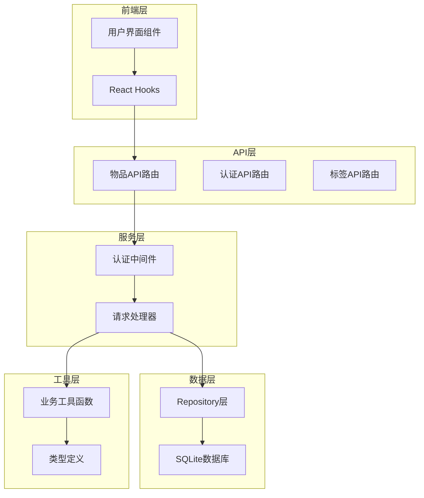
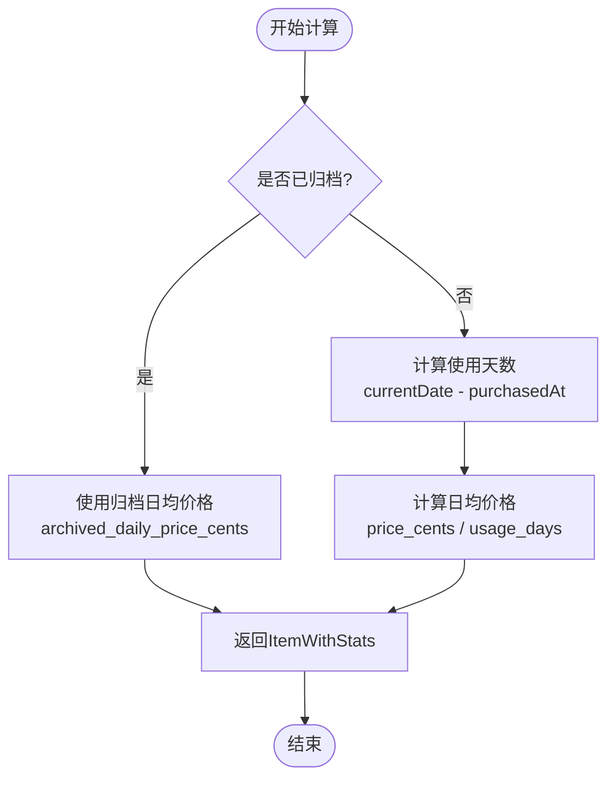
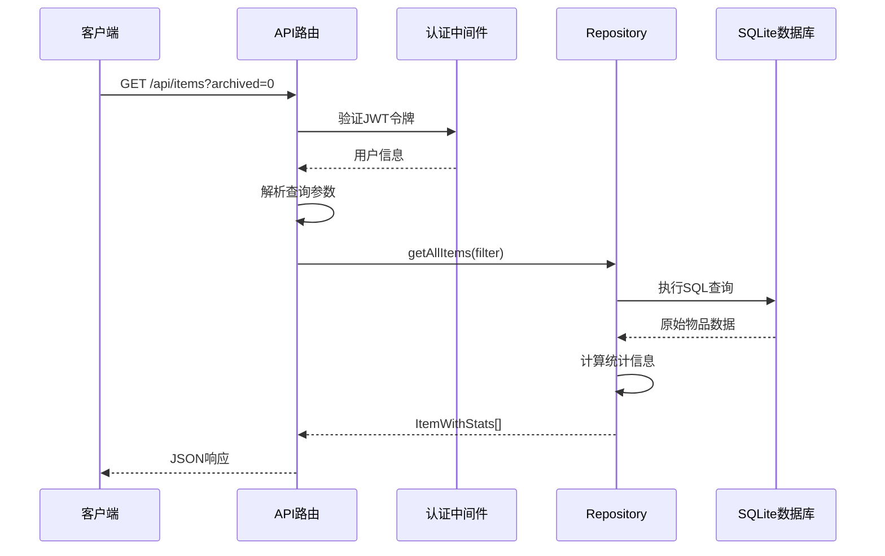
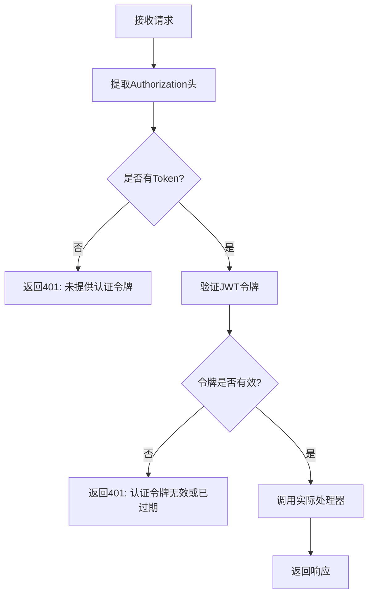
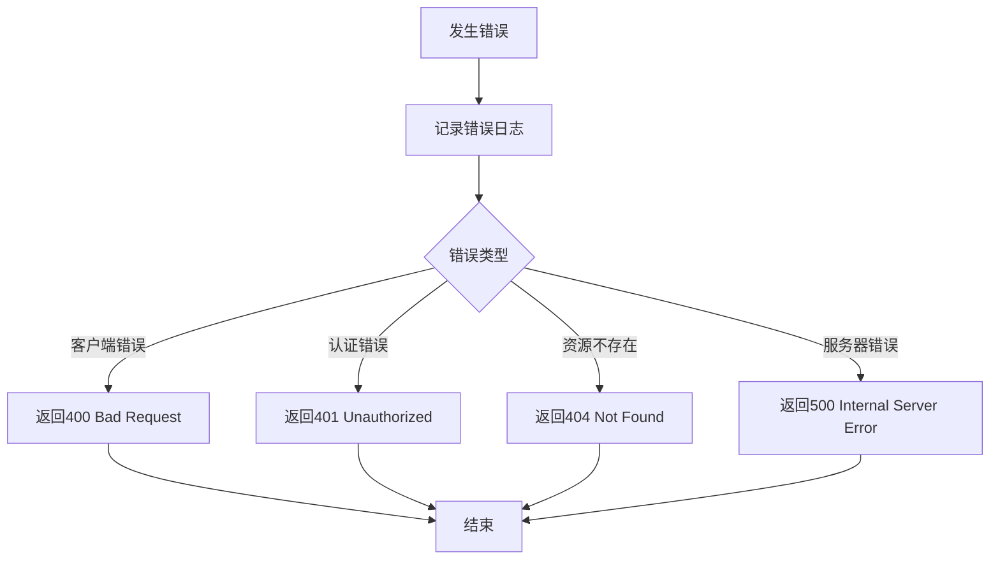
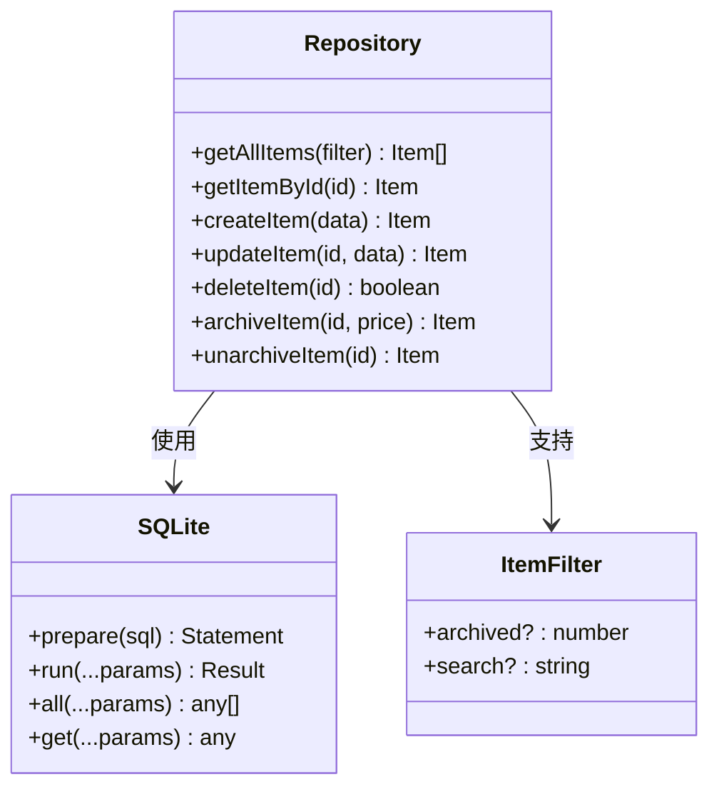

# 查询物品列表与详情API文档

<cite>
**本文档引用的文件**
- [app/api/items/route.ts](file://app/api/items/route.ts)
- [app/api/items/[id]/route.ts](file://app/api/items/[id]/route.ts)
- [lib/types/item.ts](file://lib/types/item.ts)
- [lib/db/repository.ts](file://lib/db/repository.ts)
- [lib/auth/middleware.ts](file://lib/auth/middleware.ts)
- [lib/utils/item-utils.ts](file://lib/utils/item-utils.ts)
- [lib/api/client.ts](file://lib/api/client.ts)
</cite>

## 目录
1. [简介](#简介)
2. [项目架构概览](#项目架构概览)
3. [物品数据模型](#物品数据模型)
4. [列表查询API](#列表查询api)
5. [详情查询API](#详情查询api)
6. [认证机制](#认证机制)
7. [错误处理](#错误处理)
8. [使用示例](#使用示例)
9. [技术实现细节](#技术实现细节)
10. [总结](#总结)

## 简介

本文档详细介绍了个人物品成本管理Web应用中的物品查询API，包括两个核心接口：获取物品列表的GET /api/items和获取单个物品详情的GET /api/items/:id。这些API提供了完整的物品信息查询功能，支持归档状态筛选，并包含了智能的成本计算逻辑。

## 项目架构概览

该应用采用现代化的Next.js架构，API路由基于文件系统自动路由机制构建：



**图表来源**
- [app/api/items/route.ts](file://app/api/items/route.ts#L1-L75)
- [lib/auth/middleware.ts](file://lib/auth/middleware.ts#L1-L34)
- [lib/db/repository.ts](file://lib/db/repository.ts#L1-L156)

## 物品数据模型

### Item接口

物品的核心数据结构定义了完整的物品信息：

| 字段名 | 类型 | 说明 | 必填 |
|--------|------|------|------|
| id | number | 本地主键，自增 | 是 |
| remote_id | string \| null | 云端记录ID（UUID） | 否 |
| name | string | 物品名称 | 是 |
| purchased_at | string | 购买日期（ISO日期字符串） | 是 |
| price_cents | number | 购买价格（以"分"为单位） | 是 |
| remark | string | 备注 | 否 |
| archived | number | 是否归档（0=否，1=是） | 是 |
| archived_at | string \| null | 归档时间（ISO字符串） | 否 |
| archived_daily_price_cents | number \| null | 归档时锁定的日均价格（分） | 否 |
| sync_status | number | 同步状态 | 是 |
| last_synced_at | string \| null | 最近同步时间 | 否 |
| created_at | string | 记录创建时间 | 是 |
| updated_at | string | 最近更新时间 | 是 |

### ItemWithStats接口

在列表展示时，物品会附加统计信息：

| 字段名 | 类型 | 说明 |
|--------|------|------|
| usage_days | number | 使用天数 |
| daily_price_cents | number | 日均价格（分） |

**节来源**
- [lib/types/item.ts](file://lib/types/item.ts#L9-L93)

## 列表查询API

### 接口规范

**GET /api/items**
- **功能**：获取所有物品列表
- **支持查询参数**：archived（0/1）
- **认证**：需要有效的JWT令牌

### 查询参数详解

| 参数名 | 类型 | 说明 | 示例 |
|--------|------|------|------|
| archived | number | 归档状态筛选 | `?archived=0`（未归档）<br/>`?archived=1`（已归档） |

### 响应格式

```typescript
{
  success: true,
  data: ItemWithStats[]
}
```

### 使用天数和日均价格计算逻辑

系统通过以下算法计算物品的统计信息：



**图表来源**
- [lib/utils/item-utils.ts](file://lib/utils/item-utils.ts#L59-L66)

### 实现细节

列表查询的处理流程：



**图表来源**
- [app/api/items/route.ts](file://app/api/items/route.ts#L10-L21)
- [lib/db/repository.ts](file://lib/db/repository.ts#L9-L22)

**节来源**
- [app/api/items/route.ts](file://app/api/items/route.ts#L1-L75)
- [lib/db/repository.ts](file://lib/db/repository.ts#L9-L22)

## 详情查询API

### 接口规范

**GET /api/items/:id**
- **功能**：获取单个物品的完整信息
- **路径参数**：id（物品ID）
- **认证**：需要有效的JWT令牌

### 路径参数

| 参数名 | 类型 | 说明 |
|--------|------|------|
| id | string | 物品的唯一标识符（数字字符串） |

### 响应格式

```typescript
{
  success: true,
  data: Item
}
```

### 错误处理

详情查询API会处理以下错误情况：

| 错误类型 | HTTP状态码 | 错误信息 |
|----------|------------|----------|
| 缺少参数 | 400 | "缺少参数" |
| 无效ID | 400 | "无效的物品 ID" |
| 物品不存在 | 404 | "物品不存在" |
| 服务器错误 | 500 | "获取物品失败" |

**节来源**
- [app/api/items/[id]/route.ts](file://app/api/items/[id]/route.ts#L13-L44)

## 认证机制

### withAuth中间件

系统使用JWT令牌进行API认证：



**图表来源**
- [lib/auth/middleware.ts](file://lib/auth/middleware.ts#L8-L32)

### 认证流程

1. **令牌提取**：从请求头的Authorization字段中提取Bearer令牌
2. **令牌验证**：验证JWT的有效性和过期时间
3. **用户信息传递**：将解码后的用户信息传递给处理函数
4. **权限控制**：确保请求与用户身份匹配

**节来源**
- [lib/auth/middleware.ts](file://lib/auth/middleware.ts#L1-L34)

## 错误处理

### 统一错误响应格式

所有API错误都遵循统一的响应格式：

```typescript
{
  error: string
}
```

### 错误分类

| 错误级别 | HTTP状态码 | 处理方式 | 示例场景 |
|----------|------------|----------|----------|
| 客户端错误 | 400 | 参数验证失败 | 无效ID格式 |
| 认证错误 | 401 | 令牌验证失败 | 无效或过期的JWT |
| 资源不存在 | 404 | 资源查找失败 | 物品ID不存在 |
| 服务器错误 | 500 | 内部处理异常 | 数据库连接失败 |

### 错误处理流程



**节来源**
- [app/api/items/route.ts](file://app/api/items/route.ts#L19-L28)
- [app/api/items/[id]/route.ts](file://app/api/items/[id]/route.ts#L15-L44)

## 使用示例

### 获取所有未归档物品

```bash
curl -X GET "https://your-domain.com/api/items?archived=0" \
  -H "Authorization: Bearer YOUR_JWT_TOKEN" \
  -H "Content-Type: application/json"
```

**响应示例**：
```json
{
  "success": true,
  "data": [
    {
      "id": 1,
      "name": "笔记本电脑",
      "purchased_at": "2024-01-15",
      "price_cents": 89999,
      "remark": "工作用",
      "archived": 0,
      "created_at": "2024-01-15T10:00:00Z",
      "updated_at": "2024-01-15T10:00:00Z",
      "usage_days": 123,
      "daily_price_cents": 732
    }
  ]
}
```

### 获取特定ID的物品详情

```bash
curl -X GET "https://your-domain.com/api/items/1" \
  -H "Authorization: Bearer YOUR_JWT_TOKEN" \
  -H "Content-Type: application/json"
```

**响应示例**：
```json
{
  "success": true,
  "data": {
    "id": 1,
    "name": "笔记本电脑",
    "purchased_at": "2024-01-15",
    "price_cents": 89999,
    "remark": "工作用",
    "archived": 0,
    "created_at": "2024-01-15T10:00:00Z",
    "updated_at": "2024-01-15T10:00:00Z"
  }
}
```

### API客户端使用

通过提供的API客户端库可以更方便地调用：

```typescript
// 获取所有未归档物品
const items = await api.items.getAll({ archived: 0 });

// 获取特定物品详情
const item = await api.items.getById(1);
```

**节来源**
- [lib/api/client.ts](file://lib/api/client.ts#L97-L109)

## 技术实现细节

### 数据查询优化

Repository层实现了高效的数据库查询：



**图表来源**
- [lib/db/repository.ts](file://lib/db/repository.ts#L1-L156)

### 成本计算算法

系统实现了智能的成本计算逻辑：

| 计算场景 | 算法 | 说明 |
|----------|------|------|
| 未归档物品 | `price_cents / max(usage_days, 1)` | 基于当前使用天数计算 |
| 已归档物品 | `archived_daily_price_cents` | 使用锁定的归档价格 |
| 最小天数 | `max(days, 1)` | 避免除以零的情况 |

### 性能考虑

1. **数据库索引**：在`user_id`和`created_at`字段上建立索引
2. **查询优化**：使用参数化查询防止SQL注入
3. **内存管理**：及时释放数据库连接
4. **缓存策略**：对于频繁访问的物品信息考虑缓存

**节来源**
- [lib/db/repository.ts](file://lib/db/repository.ts#L9-L22)
- [lib/utils/item-utils.ts](file://lib/utils/item-utils.ts#L12-L32)

## 总结

本文档详细介绍了个人物品成本管理应用中的物品查询API，涵盖了：

1. **完整的API接口**：包括列表查询和详情查询两个核心接口
2. **智能的成本计算**：自动计算使用天数和日均价格
3. **灵活的筛选机制**：支持按归档状态筛选物品
4. **完善的错误处理**：提供清晰的错误信息和状态码
5. **安全的认证机制**：基于JWT的API认证
6. **现代化的技术架构**：基于Next.js的文件系统路由

这些API设计充分考虑了用户体验和系统性能，为用户提供了一个功能强大且易于使用的物品管理解决方案。通过合理的数据模型设计和智能的成本计算算法，帮助用户更好地了解物品的实际使用成本，做出更明智的消费决策。