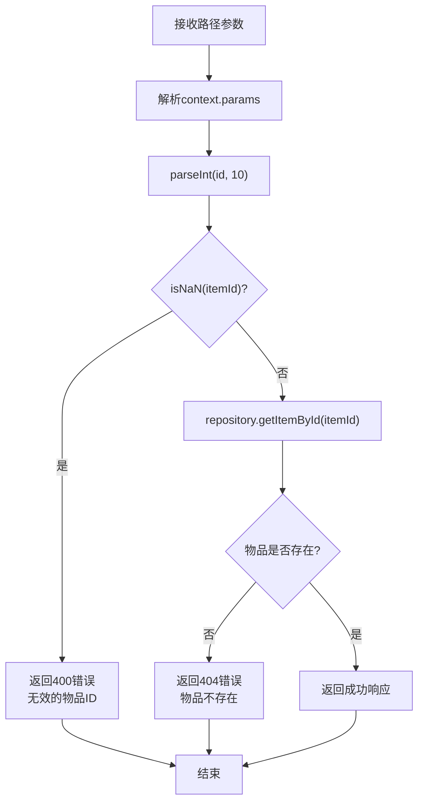
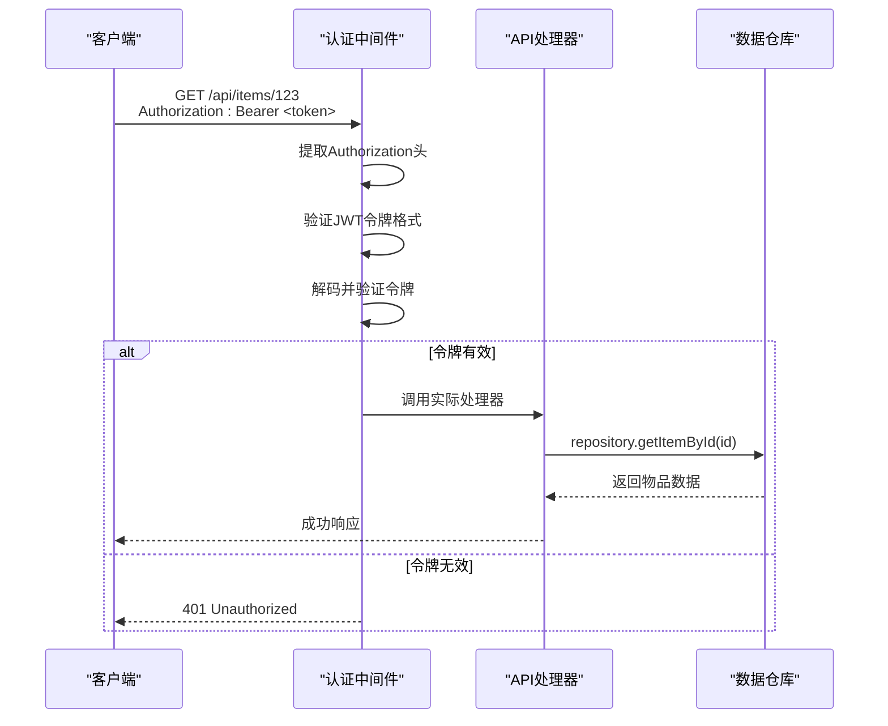
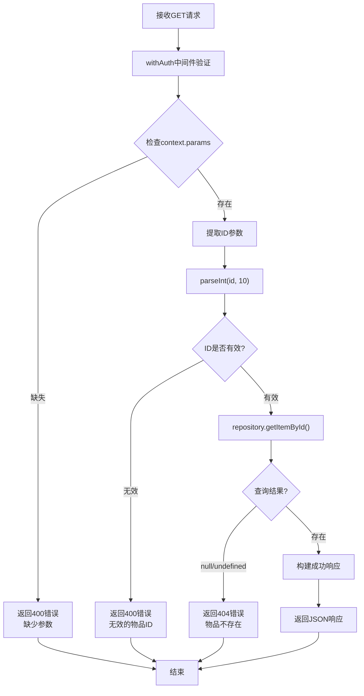
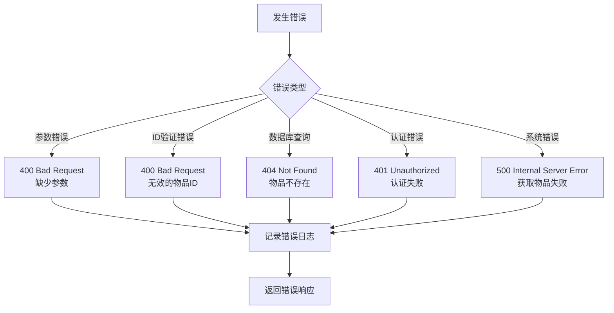
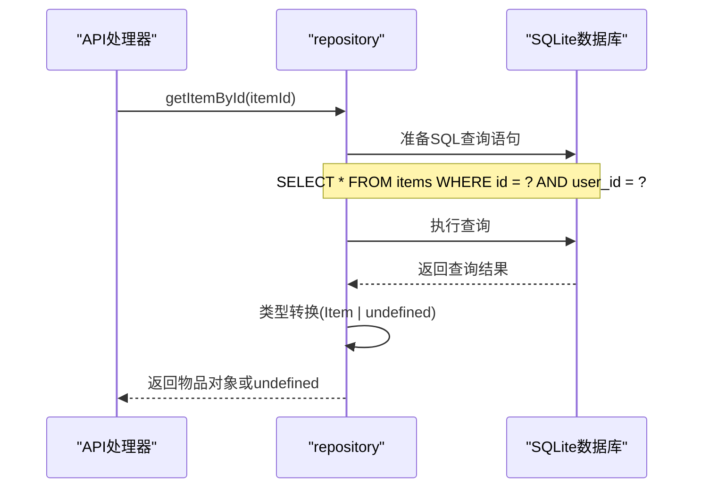

# 查询物品详情API详细文档

<cite>
**本文档引用的文件**
- [app/api/items/[id]/route.ts](file://app/api/items/[id]/route.ts)
- [lib/db/repository.ts](file://lib/db/repository.ts)
- [lib/types/item.ts](file://lib/types/item.ts)
- [lib/auth/middleware.ts](file://lib/auth/middleware.ts)
- [lib/auth/jwt.ts](file://lib/auth/jwt.ts)
- [lib/db/sqlite.ts](file://lib/db/sqlite.ts)
- [test-tags-api-simple.sh](file://test-tags-api-simple.sh)
</cite>

## 目录
1. [简介](#简介)
2. [API端点概述](#api端点概述)
3. [路径参数详解](#路径参数详解)
4. [认证机制](#认证机制)
5. [请求处理流程](#请求处理流程)
6. [响应格式规范](#响应格式规范)
7. [错误处理机制](#错误处理机制)
8. [数据库查询实现](#数据库查询实现)
9. [使用示例](#使用示例)
10. [最佳实践](#最佳实践)

## 简介

本文档详细介绍了Bookkeeping应用中查询单个物品详情的API接口。该API提供了安全、高效的物品信息检索功能，支持完整的物品数据返回，并具备完善的错误处理机制。

## API端点概述

### 端点信息
- **URL**: `/api/items/:id`
- **HTTP方法**: `GET`
- **功能**: 获取指定ID的单个物品详细信息

### 请求特性
- **认证要求**: 必须通过JWT令牌认证
- **内容类型**: 不需要特定的Content-Type头部
- **路径参数**: 必须提供有效的数字ID

## 路径参数详解

### 参数定义
- **`:id`** - 物品唯一标识符
  - **类型**: 数字字符串
  - **格式要求**: 必须为有效的正整数
  - **范围**: 1及以上
  - **验证规则**: 将自动转换为整数并验证有效性

### 参数验证流程



**图表来源**
- [app/api/items/[id]/route.ts](file://app/api/items/[id]/route.ts#L19-L35)

**节来源**
- [app/api/items/[id]/route.ts](file://app/api/items/[id]/route.ts#L19-L35)

## 认证机制

### withAuth中间件流程

系统采用JWT令牌进行身份认证，通过`withAuth`中间件实现请求验证：



**图表来源**
- [lib/auth/middleware.ts](file://lib/auth/middleware.ts#L8-L32)
- [lib/auth/jwt.ts](file://lib/auth/jwt.ts#L23-L29)

### 认证步骤详解

1. **令牌提取**: 从Authorization头中提取Bearer令牌
2. **格式验证**: 检查令牌是否以"Bearer "开头
3. **解码验证**: 使用密钥验证JWT签名和有效期
4. **用户信息传递**: 验证通过后将用户信息传递给处理器

**节来源**
- [lib/auth/middleware.ts](file://lib/auth/middleware.ts#L8-L32)
- [lib/auth/jwt.ts](file://lib/auth/jwt.ts#L23-L29)

## 请求处理流程

### 核心处理逻辑



**图表来源**
- [app/api/items/[id]/route.ts](file://app/api/items/[id]/route.ts#L13-L44)

### 错误处理层次

系统实现了多层错误处理机制：

1. **参数验证层**: 检查必需参数的存在性
2. **数据验证层**: 验证ID格式和有效性
3. **业务逻辑层**: 检查物品是否存在
4. **系统异常层**: 处理数据库访问等系统级错误

**节来源**
- [app/api/items/[id]/route.ts](file://app/api/items/[id]/route.ts#L13-L44)

## 响应格式规范

### 成功响应格式

当请求成功且物品存在时，API返回以下格式的JSON响应：

```typescript
interface SuccessResponse {
  success: true;
  data: Item;
}
```

### Item接口定义

根据数据模型，Item接口包含以下字段：

| 字段名 | 类型 | 描述 | 必填 |
|--------|------|------|------|
| `id` | number | 物品唯一标识符 | 是 |
| `remote_id` | string \| null | 云端记录ID（UUID） | 否 |
| `name` | string | 物品名称 | 是 |
| `purchased_at` | string | 购买日期（ISO格式） | 是 |
| `price_cents` | number | 购买价格（分） | 是 |
| `remark` | string | 备注信息 | 否 |
| `archived` | number | 归档状态（0=否，1=是） | 是 |
| `archived_at` | string \| null | 归档时间（ISO格式） | 否 |
| `archived_daily_price_cents` | number \| null | 归档日均价格（分） | 否 |
| `sync_status` | number | 同步状态 | 是 |
| `last_synced_at` | string \| null | 最后同步时间 | 否 |
| `created_at` | string | 记录创建时间 | 是 |
| `updated_at` | string | 最后更新时间 | 是 |
| `version` | number | 版本号 | 否 |
| `is_deleted` | number | 软删除标记 | 否 |

### 响应示例

```json
{
  "success": true,
  "data": {
    "id": 123,
    "name": "笔记本电脑",
    "purchased_at": "2024-01-15",
    "price_cents": 500000,
    "remark": "用于日常办公",
    "archived": 0,
    "created_at": "2024-01-15T10:30:00Z",
    "updated_at": "2024-01-15T10:30:00Z"
  }
}
```

**节来源**
- [lib/types/item.ts](file://lib/types/item.ts#L9-L25)
- [app/api/items/[id]/route.ts](file://app/api/items/[id]/route.ts#L37)

## 错误处理机制

### 错误响应格式

所有错误响应都遵循统一的格式：

```typescript
interface ErrorResponse {
  error: string;
}
```

### 错误状态码对照表

| 错误类型 | HTTP状态码 | 错误信息 | 触发条件 |
|----------|------------|----------|----------|
| 缺少参数 | 400 | "缺少参数" | context.params不存在 |
| 无效ID | 400 | "无效的物品 ID" | ID无法转换为有效数字 |
| 物品不存在 | 404 | "物品不存在" | 数据库查询无结果 |
| 认证失败 | 401 | "未提供认证令牌" 或 "认证令牌无效或已过期" | JWT验证失败 |
| 服务器错误 | 500 | "获取物品失败" | 系统内部异常 |

### 错误处理流程图



**图表来源**
- [app/api/items/[id]/route.ts](file://app/api/items/[id]/route.ts#L15-L44)

**节来源**
- [app/api/items/[id]/route.ts](file://app/api/items/[id]/route.ts#L15-L44)

## 数据库查询实现

### repository.getItemById() 方法

该方法负责从SQLite数据库中检索指定ID的物品信息：



**图表来源**
- [lib/db/repository.ts](file://lib/db/repository.ts#L28-L32)

### 数据库查询细节

1. **查询语句**: `SELECT * FROM items WHERE id = ? AND user_id = ?`
2. **参数绑定**: 自动绑定itemId和固定USER_ID
3. **结果处理**: 返回Item对象或undefined
4. **索引优化**: 利用id主键索引提高查询性能

### 数据库架构支持

系统使用SQLite作为数据存储，具有以下特点：

- **单用户模式**: 使用固定user_id简化权限控制
- **WAL模式**: 开启Write-Ahead Logging提高并发性能
- **索引优化**: 在user_id和archived字段上建立索引
- **外键约束**: 支持级联删除等完整性约束

**节来源**
- [lib/db/repository.ts](file://lib/db/repository.ts#L28-L32)
- [lib/db/sqlite.ts](file://lib/db/sqlite.ts#L17-L24)

## 使用示例

### curl命令示例

以下是获取ID为123的物品详情的完整curl命令：

```bash
# 1. 首先获取认证令牌（假设已登录）
TOKEN="eyJhbGciOiJIUzI1NiIsInR5cCI6IkpXVCJ9..."

# 2. 获取物品详情
curl -X GET "http://localhost:3000/api/items/123" \
  -H "Authorization: Bearer $TOKEN" \
  -H "Content-Type: application/json"
```

### JavaScript Fetch示例

```javascript
async function getItemDetails(itemId, token) {
  try {
    const response = await fetch(`/api/items/${itemId}`, {
      method: 'GET',
      headers: {
        'Authorization': `Bearer ${token}`,
        'Content-Type': 'application/json'
      }
    });
    
    if (!response.ok) {
      throw new Error(`HTTP error! status: ${response.status}`);
    }
    
    const data = await response.json();
    return data.data; // 返回物品数据
  } catch (error) {
    console.error('获取物品详情失败:', error);
    throw error;
  }
}

// 使用示例
const token = localStorage.getItem('authToken');
const item = await getItemDetails(123, token);
console.log('物品信息:', item);
```

### 错误处理示例

```javascript
try {
  const response = await fetch('/api/items/invalid-id', {
    headers: { 'Authorization': `Bearer ${token}` }
  });
  
  if (response.status === 400) {
    const errorData = await response.json();
    console.error('错误:', errorData.error);
    // 处理无效ID错误
  } else if (response.status === 404) {
    console.log('物品不存在');
  } else if (response.status === 401) {
    console.log('需要重新登录');
  }
} catch (error) {
  console.error('网络错误:', error);
}
```

**节来源**
- [test-tags-api-simple.sh](file://test-tags-api-simple.sh#L15-L18)

## 最佳实践

### 客户端实现建议

1. **参数验证**: 在发送请求前验证ID格式
2. **错误处理**: 实现全面的错误处理逻辑
3. **缓存策略**: 对频繁访问的物品信息实施缓存
4. **用户体验**: 提供友好的错误提示信息

### 安全考虑

1. **令牌管理**: 安全存储和传输JWT令牌
2. **输入验证**: 服务端仍需验证所有输入参数
3. **权限控制**: 确保用户只能访问自己的数据
4. **日志记录**: 记录所有API访问和错误信息

### 性能优化

1. **数据库索引**: 利用id和user_id索引提高查询效率
2. **连接池**: 使用SQLite的连接池机制
3. **WAL模式**: 开启Write-Ahead Logging提升并发性能
4. **查询优化**: 避免不必要的字段查询

### 监控和调试

1. **日志记录**: 记录详细的请求和响应信息
2. **错误监控**: 实施错误率和响应时间监控
3. **性能分析**: 定期分析API性能瓶颈
4. **版本兼容**: 维护向后兼容的API版本

通过遵循这些最佳实践，可以确保查询物品详情API的稳定性和可维护性，同时为用户提供优质的使用体验。