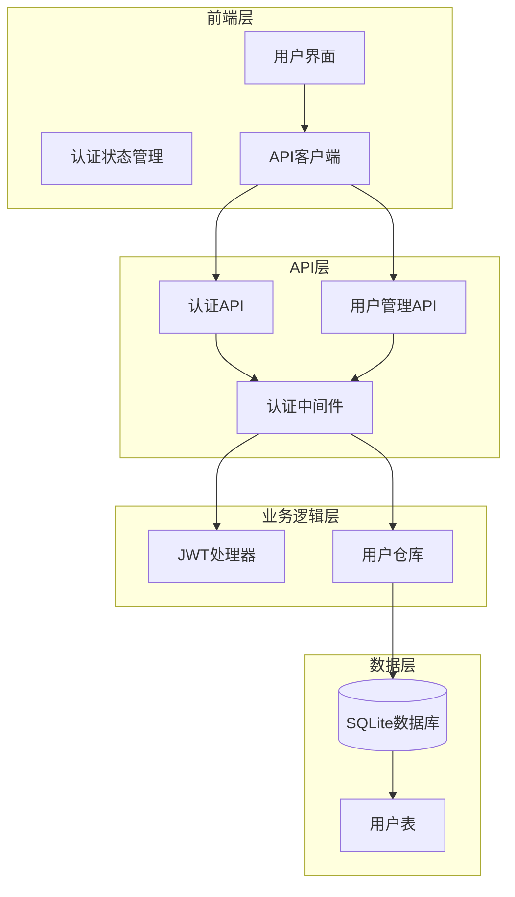
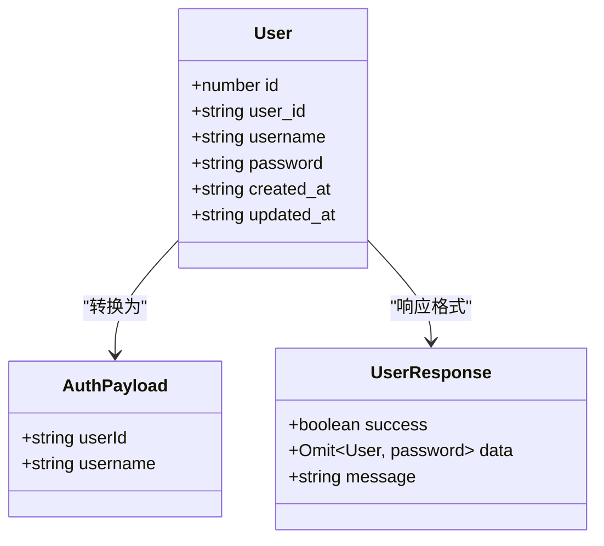
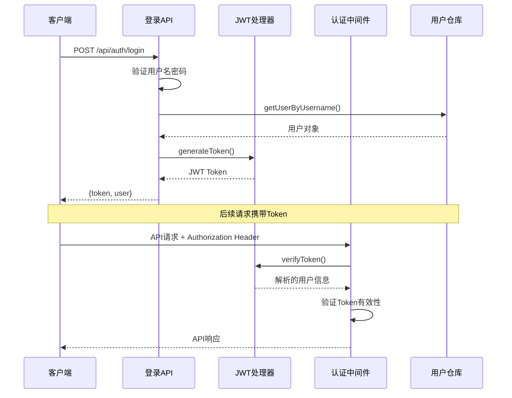
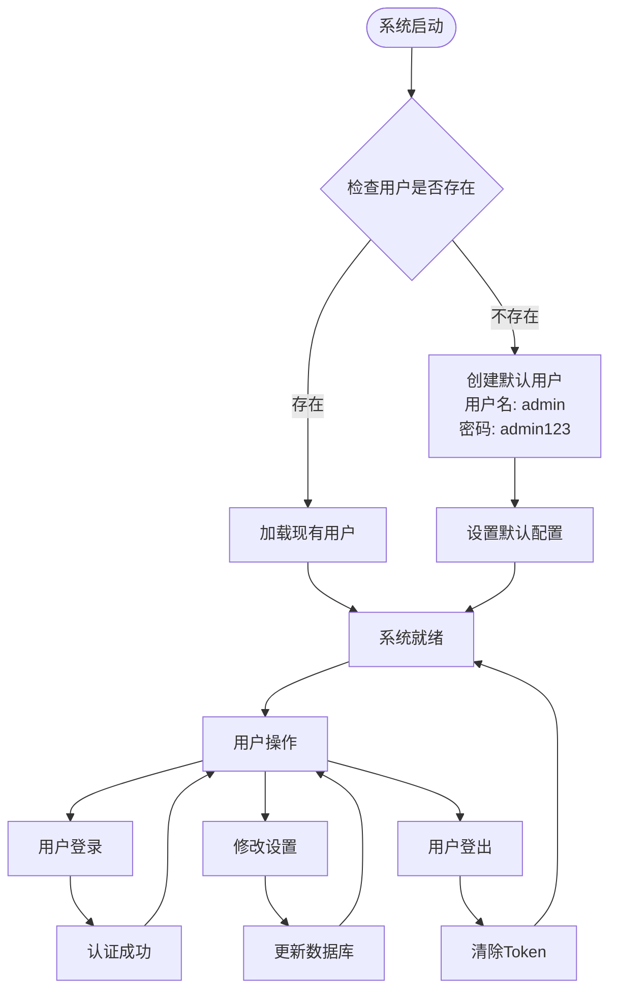
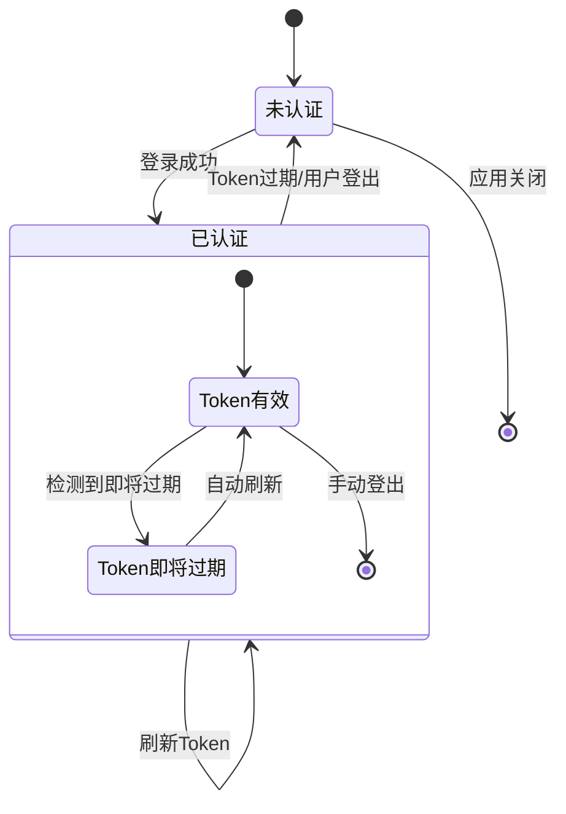
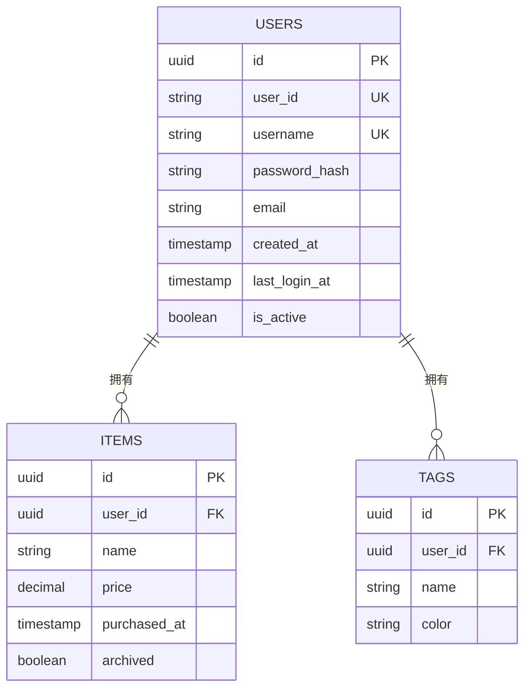

# 用户管理API文档

<cite>
**本文档中引用的文件**
- [app/api/user/route.ts](file://app/api/user/route.ts)
- [app/api/auth/login/route.ts](file://app/api/auth/login/route.ts)
- [lib/auth/jwt.ts](file://lib/auth/jwt.ts)
- [lib/auth/middleware.ts](file://lib/auth/middleware.ts)
- [lib/db/user-repository.ts](file://lib/db/user-repository.ts)
- [lib/db/sqlite.ts](file://lib/db/sqlite.ts)
- [lib/api/client.ts](file://lib/api/client.ts)
- [components/user-settings.tsx](file://components/user-settings.tsx)
- [components/login-modal.tsx](file://components/login-modal.tsx)
- [README.md](file://README.md)
</cite>

## 目录
1. [简介](#简介)
2. [系统架构概览](#系统架构概览)
3. [用户数据结构](#用户数据结构)
4. [认证机制](#认证机制)
5. [用户管理API接口](#用户管理api接口)
6. [用户状态管理](#用户状态管理)
7. [当前限制与未来扩展](#当前限制与未来扩展)
8. [故障排除指南](#故障排除指南)
9. [总结](#总结)

## 简介

本系统是一个单用户模式的个人物品成本管理系统，提供了完整的用户管理功能。尽管采用单用户架构，系统仍实现了标准的用户认证和授权机制，为未来的多用户扩展奠定了基础。

系统的核心特性包括：
- 基于JWT的用户认证机制
- 单用户模式下的用户信息管理
- 安全的密码修改功能
- 用户状态的持久化存储
- 完整的API接口支持

## 系统架构概览



**图表来源**
- [app/api/auth/login/route.ts](file://app/api/auth/login/route.ts#L1-L47)
- [app/api/user/route.ts](file://app/api/user/route.ts#L1-L103)
- [lib/auth/middleware.ts](file://lib/auth/middleware.ts#L1-L34)
- [lib/db/sqlite.ts](file://lib/db/sqlite.ts#L1-L109)

## 用户数据结构

系统中的用户数据结构经过精心设计，确保了数据的安全性和完整性。

### 核心用户接口



**图表来源**
- [lib/db/user-repository.ts](file://lib/db/user-repository.ts#L7-L14)
- [lib/auth/jwt.ts](file://lib/auth/jwt.ts#L8-L11)
- [app/api/user/route.ts](file://app/api/user/route.ts#L16-L18)

### 数据字段说明

| 字段名 | 类型 | 说明 | 约束 |
|--------|------|------|------|
| id | number | 主键，自动递增 | 数据库自动生成 |
| user_id | string | 用户唯一标识符 | 固定值：'default_user' |
| username | string | 用户名 | 唯一，长度≥3 |
| password | string | 密码（明文存储） | 长度无限制 |
| created_at | string | 创建时间戳 | ISO 8601格式 |
| updated_at | string | 最后更新时间戳 | ISO 8601格式 |

**节来源**
- [lib/db/user-repository.ts](file://lib/db/user-repository.ts#L7-L14)
- [lib/db/sqlite.ts](file://lib/db/sqlite.ts#L70-L80)

## 认证机制

系统采用JWT（JSON Web Token）作为认证机制，提供了安全可靠的用户身份验证。

### 认证流程图



**图表来源**
- [app/api/auth/login/route.ts](file://app/api/auth/login/route.ts#L4-L47)
- [lib/auth/jwt.ts](file://lib/auth/jwt.ts#L16-L29)
- [lib/auth/middleware.ts](file://lib/auth/middleware.ts#L8-L33)

### JWT配置参数

| 参数 | 值 | 说明 |
|------|-----|------|
| JWT_SECRET | 'your-secret-key-change-in-production' | JWT签名密钥（生产环境应使用环境变量） |
| TOKEN_EXPIRES_IN | '7d' | Token有效期 |
| 签名算法 | HS256 | 默认JWT算法 |

**节来源**
- [lib/auth/jwt.ts](file://lib/auth/jwt.ts#L5-L6)
- [app/api/auth/login/route.ts](file://app/api/auth/login/route.ts#L27)

## 用户管理API接口

### GET /api/user - 获取当前用户信息

此接口用于获取当前登录用户的详细信息。

#### 请求格式

```typescript
// 请求方法
GET /api/user

// 请求头
Authorization: Bearer <JWT_TOKEN>
```

#### 响应格式

```typescript
// 成功响应
{
  "success": true,
  "data": {
    "id": 1,
    "user_id": "default_user",
    "username": "admin",
    "created_at": "2024-01-01T00:00:00.000Z",
    "updated_at": "2024-01-01T00:00:00.000Z"
  }
}

// 错误响应 - 用户不存在
{
  "error": "用户不存在",
  "status": 404
}

// 错误响应 - 系统错误
{
  "error": "获取用户信息失败",
  "status": 500
}
```

#### 实现细节

- **认证要求**：需要有效的JWT Token
- **数据过滤**：自动移除密码字段
- **错误处理**：提供详细的错误信息
- **缓存策略**：直接从数据库读取最新数据

**节来源**
- [app/api/user/route.ts](file://app/api/user/route.ts#L8-L25)

### PUT /api/user - 更新用户信息

此接口支持同时更新用户名和密码。

#### 请求格式

```typescript
// 请求方法
PUT /api/user

// 请求头
Authorization: Bearer <JWT_TOKEN>
Content-Type: application/json

// 请求体示例 - 仅修改用户名
{
  "username": "new_username"
}

// 请求体示例 - 仅修改密码
{
  "oldPassword": "current_password",
  "newPassword": "new_secure_password"
}

// 请求体示例 - 同时修改用户名和密码
{
  "username": "new_username",
  "oldPassword": "current_password",
  "newPassword": "new_secure_password"
}
```

#### 响应格式

```typescript
// 成功响应
{
  "success": true,
  "data": {
    "id": 1,
    "user_id": "default_user",
    "username": "new_username",
    "created_at": "2024-01-01T00:00:00.000Z",
    "updated_at": "2024-01-01T00:00:00.000Z"
  },
  "message": "更新成功"
}

// 错误响应 - 密码验证失败
{
  "error": "当前密码不正确",
  "status": 401
}

// 错误响应 - 用户名已存在
{
  "error": "用户名已存在",
  "status": 409
}
```

#### 验证规则

| 字段 | 验证规则 | 错误信息 |
|------|----------|----------|
| username | 长度≥3且唯一 | "用户名长度至少为3个字符" |
| oldPassword | 存在且正确 | "请提供当前密码" |
| newPassword | 长度≥6 | "新密码长度至少为6个字符" |

**节来源**
- [app/api/user/route.ts](file://app/api/user/route.ts#L30-L102)

## 用户状态管理

### 单用户模式设计

系统采用单用户模式，具有以下特点：



**图表来源**
- [lib/db/sqlite.ts](file://lib/db/sqlite.ts#L82-L90)
- [components/login-modal.tsx](file://components/login-modal.tsx#L37-L38)

### 默认用户信息

| 属性 | 值 | 说明 |
|------|-----|------|
| user_id | default_user | 固定的用户标识符 |
| username | admin | 默认用户名 |
| password | admin123 | 默认密码 |
| 创建时间 | 系统初始化时 | ISO 8601格式 |

### 认证状态持久化



**节来源**
- [lib/api/client.ts](file://lib/api/client.ts#L10-L27)
- [components/login-modal.tsx](file://components/login-modal.tsx#L13-L14)

## 当前限制与未来扩展

### 当前系统限制

1. **单用户模式**
   - 系统设计为单用户使用
   - user_id固定为'default_user'
   - 不支持多用户注册和管理

2. **认证安全**
   - 密码以明文形式存储
   - JWT密钥硬编码在代码中
   - 缺少密码复杂度要求

3. **功能限制**
   - 无用户角色权限系统
   - 无用户活动日志
   - 无密码重置功能

### 未来扩展可能性

#### 多用户支持



#### 扩展功能规划

| 功能模块 | 当前状态 | 未来目标 |
|----------|----------|----------|
| 用户认证 | JWT单用户 | OAuth2多用户 |
| 密码安全 | 明文存储 | BCrypt加密 |
| 权限控制 | 无 | RBAC权限系统 |
| 用户管理 | 基础CRUD | 完整用户管理 |
| 数据隔离 | 单用户 | 多租户隔离 |

**节来源**
- [README.md](file://README.md#L14-L16)
- [lib/db/sqlite.ts](file://lib/db/sqlite.ts#L70-L80)

## 故障排除指南

### 常见问题及解决方案

#### 1. 登录失败

**问题症状**：输入正确的用户名和密码但无法登录

**可能原因**：
- 数据库中用户记录被删除或损坏
- JWT密钥配置错误
- 浏览器缓存问题

**解决步骤**：
```bash
# 检查数据库中是否存在默认用户
sqlite3 data/bookkeeping.db "SELECT * FROM users WHERE user_id='default_user'"

# 如果不存在，重新创建默认用户
sqlite3 data/bookkeeping.db "INSERT INTO users (user_id, username, password, created_at, updated_at) VALUES ('default_user', 'admin', 'admin123', datetime('now'), datetime('now'))"
```

#### 2. 用户信息获取失败

**问题症状**：GET /api/user返回404错误

**诊断步骤**：
1. 检查JWT Token是否有效
2. 验证数据库连接状态
3. 确认用户记录完整性

#### 3. 密码修改失败

**问题症状**：PUT /api/user密码修改不生效

**常见原因**：
- 旧密码验证失败
- 新密码不符合长度要求
- 并发修改冲突

**调试建议**：
- 检查网络请求的响应状态码
- 查看浏览器开发者工具的Network面板
- 检查服务器端日志输出

**节来源**
- [app/api/user/route.ts](file://app/api/user/route.ts#L9-L25)
- [lib/db/sqlite.ts](file://lib/db/sqlite.ts#L82-L90)

### 性能监控指标

| 指标类别 | 监控项目 | 正常范围 | 异常阈值 |
|----------|----------|----------|----------|
| 认证性能 | Token验证耗时 | < 50ms | > 100ms |
| 数据库性能 | 用户查询响应 | < 10ms | > 50ms |
| 接口性能 | 用户API响应 | < 100ms | > 300ms |
| 错误率 | 认证失败率 | < 1% | > 5% |

## 总结

本用户管理API系统为单用户模式的个人物品成本管理系统提供了完整的基础功能。系统采用了现代的JWT认证机制，确保了用户身份的安全验证。尽管目前处于单用户模式，但系统的架构设计已经为未来的多用户扩展做好了准备。

### 系统优势

1. **安全性**：基于JWT的标准认证机制
2. **可靠性**：完善的错误处理和状态管理
3. **可维护性**：清晰的分层架构和模块化设计
4. **扩展性**：预留了多用户扩展的接口

### 改进建议

1. **安全增强**：引入密码哈希机制
2. **功能完善**：添加密码重置和账户恢复功能
3. **监控改进**：集成完整的日志和监控系统
4. **测试覆盖**：增加自动化测试覆盖率

通过持续的优化和功能扩展，该系统将能够更好地满足用户的需求，并为未来的业务发展提供坚实的技术基础。