# 前端架构

<cite>
**本文档引用文件**  
- [app/page.tsx](file://app/page.tsx)
- [lib/store/item-store.ts](file://lib/store/item-store.ts)
- [lib/hooks/use-items.ts](file://lib/hooks/use-items.ts)
- [lib/hooks/use-tags.ts](file://lib/hooks/use-tags.ts)
- [lib/api/client.ts](file://lib/api/client.ts)
- [lib/types/item.ts](file://lib/types/item.ts)
- [components/item-list.tsx](file://components/item-list.tsx)
- [components/item-form.tsx](file://components/item-form.tsx)
- [components/item-detail.tsx](file://components/item-detail.tsx)
- [components/tag-selector.tsx](file://components/tag-selector.tsx)
- [components/ui/index.ts](file://components/ui/index.ts)
</cite>

## 目录
1. [项目结构](#项目结构)
2. [组件架构](#组件架构)
3. [状态管理机制](#状态管理机制)
4. [路由系统](#路由系统)
5. [数据流与通信](#数据流与通信)
6. [自定义Hook](#自定义hook)
7. [组件依赖关系](#组件依赖关系)
8. [状态流示意图](#状态流示意图)

## 项目结构

记账应用的前端项目采用Next.js框架构建，遵循清晰的分层架构。项目根目录包含应用入口、组件库、业务逻辑和类型定义等核心模块。

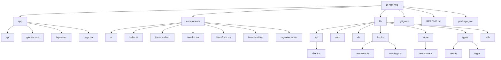

**图示来源**  
- [app/page.tsx](file://app/page.tsx#L1-L275)
- [components/index.ts](file://components/index.ts#L1-L11)
- [lib/store/item-store.ts](file://lib/store/item-store.ts#L1-L114)

## 组件架构

前端组件架构采用分层设计，分为基础UI组件和业务组件两大类，实现关注点分离和代码复用。

### 基础UI组件

基础UI组件位于`components/ui`目录，基于shadcn/ui设计系统构建，提供标准化的界面元素。这些组件不包含业务逻辑，仅负责视觉呈现和基本交互。

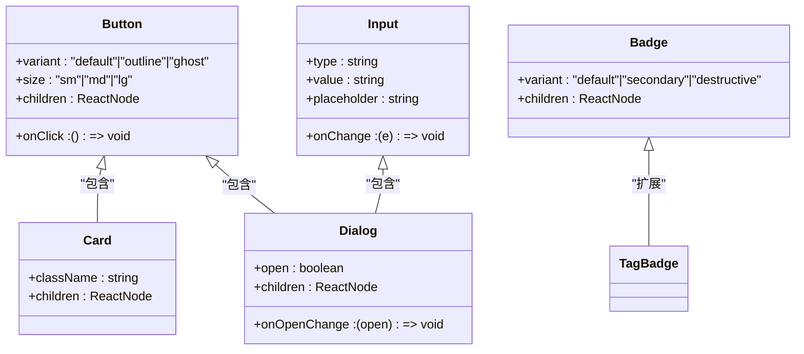

**图示来源**  
- [components/ui/index.ts](file://components/ui/index.ts#L1-L23)
- [components/tag-badge.tsx](file://components/tag-badge.tsx)

### 业务组件

业务组件位于`components`目录，封装特定功能的完整用户界面和交互逻辑。这些组件组合基础UI组件，实现具体业务场景。

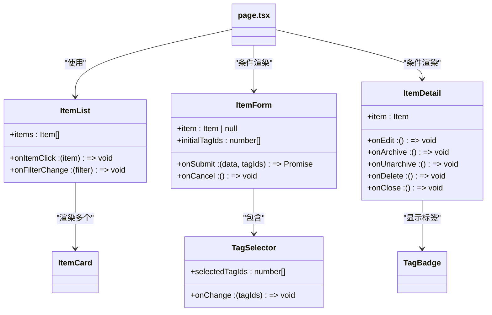

**图示来源**  
- [components/item-list.tsx](file://components/item-list.tsx#L1-L99)
- [components/item-form.tsx](file://components/item-form.tsx#L1-L216)
- [components/item-detail.tsx](file://components/item-detail.tsx#L1-L200)
- [components/tag-selector.tsx](file://components/tag-selector.tsx#L1-L177)

## 状态管理机制

前端采用Zustand作为状态管理解决方案，通过`item-store`集中管理物品数据和UI状态，实现全局状态的统一管理和高效更新。

### Zustand状态存储

`item-store`定义了物品管理所需的所有状态和操作方法，包括物品列表、筛选条件、表单状态和详情视图状态。

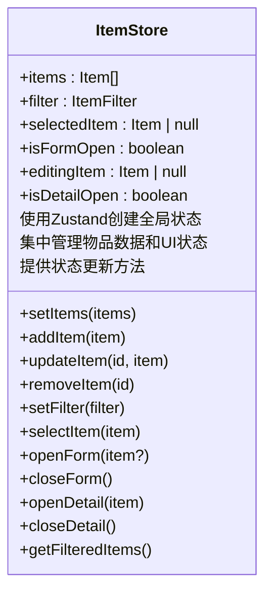

**图示来源**  
- [lib/store/item-store.ts](file://lib/store/item-store.ts#L1-L114)

### 状态结构设计

状态存储采用扁平化设计，将数据状态和UI状态分离但统一管理，确保状态的一致性和可预测性。

```mermaid
graph TD
A[ItemStore] --> B[数据状态]
A --> C[UI状态]
B --> B1[items: Item[]]
B --> B2[filter: ItemFilter]
C --> C1[isFormOpen: boolean]
C --> C2[editingItem: Item | null]
C --> C3[selectedItem: Item | null]
C --> C4[isDetailOpen: boolean]
D[操作方法] --> D1[setItems]
D --> D2[addItem]
D --> D3[updateItem]
D --> D4[removeItem]
D --> D5[openForm]
D --> D6[closeForm]
D --> D7[openDetail]
D --> D8[closeDetail]
D --> D9[setFilter]
A --> D
```

**图示来源**  
- [lib/store/item-store.ts](file://lib/store/item-store.ts#L9-L45)

## 路由系统

应用采用Next.js的App Router架构，通过文件系统定义路由，实现服务端渲染和客户端导航的无缝集成。

### 路由结构

路由系统主要由API路由和页面路由组成，API路由处理数据请求，页面路由管理用户界面。

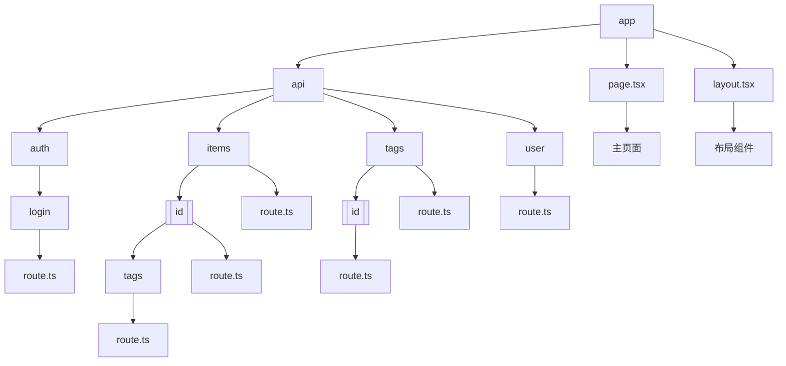

**图示来源**  
- [app/page.tsx](file://app/page.tsx#L1-L275)
- [app/api](file://app/api)

### 主页面路由

主页面`page.tsx`是应用的入口点，负责初始化状态、处理认证和渲染核心组件。

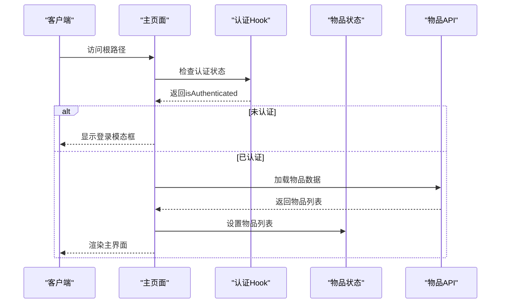

**图示来源**  
- [app/page.tsx](file://app/page.tsx#L6-L180)

## 数据流与通信

前端采用单向数据流模式，通过状态管理和自定义Hook实现组件间的高效通信和数据同步。

### 数据流模式

应用遵循"状态向下，事件向上"的设计原则，确保数据流动的可预测性和可维护性。

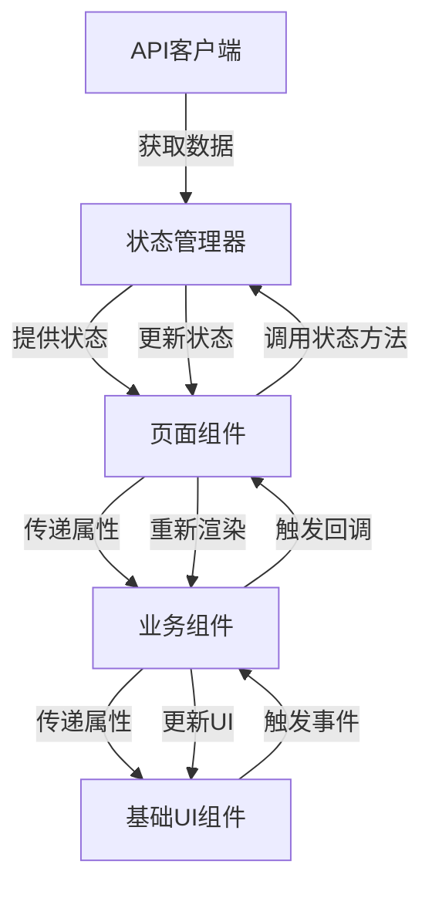

**图示来源**  
- [app/page.tsx](file://app/page.tsx#L20-L275)
- [lib/store/item-store.ts](file://lib/store/item-store.ts#L47-L114)

### 组件通信机制

组件间通过属性传递和回调函数实现通信，避免直接依赖，提高组件的可复用性。

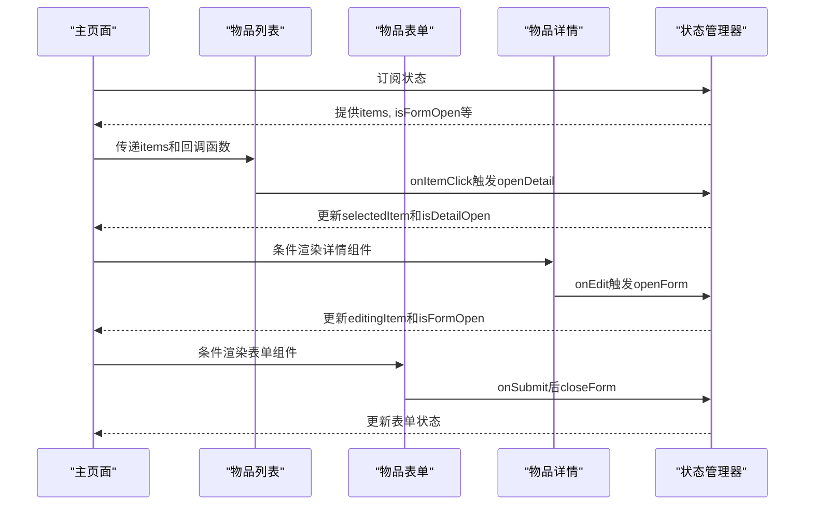

**图示来源**  
- [app/page.tsx](file://app/page.tsx#L24-L39)
- [components/item-list.tsx](file://components/item-list.tsx#L20-L99)
- [components/item-detail.tsx](file://components/item-detail.tsx#L24-L200)
- [components/item-form.tsx](file://components/item-form.tsx#L24-L216)

## 自定义Hook

应用通过自定义Hook封装数据获取和业务逻辑，实现逻辑复用和关注点分离。

### useItems Hook

`use-items` Hook封装了物品数据的所有CRUD操作，与后端API进行交互。

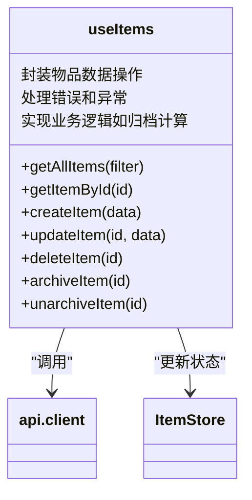

**图示来源**  
- [lib/hooks/use-items.ts](file://lib/hooks/use-items.ts#L1-L106)

### useTags Hook

`use-tags` Hook管理标签相关的数据操作，支持标签的创建、查询和关联。

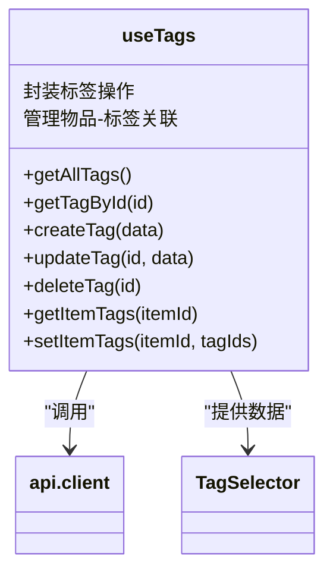

**图示来源**  
- [lib/hooks/use-tags.ts](file://lib/hooks/use-tags.ts#L1-L98)

## 组件依赖关系

组件间存在清晰的依赖关系，形成层次化的组件树结构，确保应用的可维护性和可扩展性。

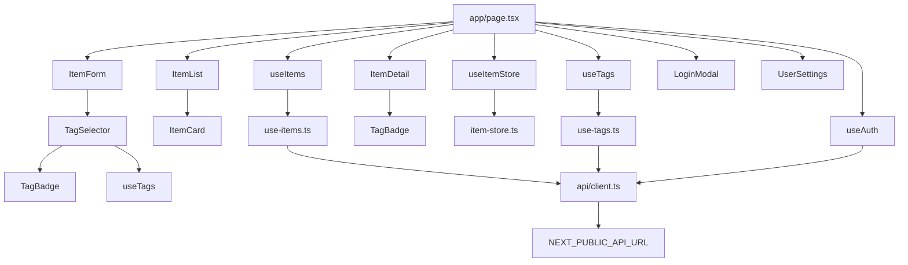

**图示来源**  
- [app/page.tsx](file://app/page.tsx#L9-L17)
- [lib/hooks/use-items.ts](file://lib/hooks/use-items.ts#L7)
- [lib/hooks/use-tags.ts](file://lib/hooks/use-tags.ts#L6)
- [lib/api/client.ts](file://lib/api/client.ts#L8)

## 状态流示意图

状态流示意图展示了前端数据流动的完整生命周期，从用户交互到状态更新再到UI渲染的全过程。

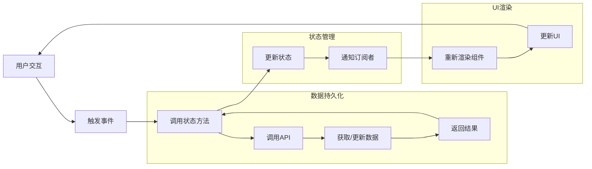

**图示来源**  
- [app/page.tsx](file://app/page.tsx#L76-L98)
- [lib/store/item-store.ts](file://lib/store/item-store.ts#L55-L89)
- [lib/hooks/use-items.ts](file://lib/hooks/use-items.ts#L34-L45)