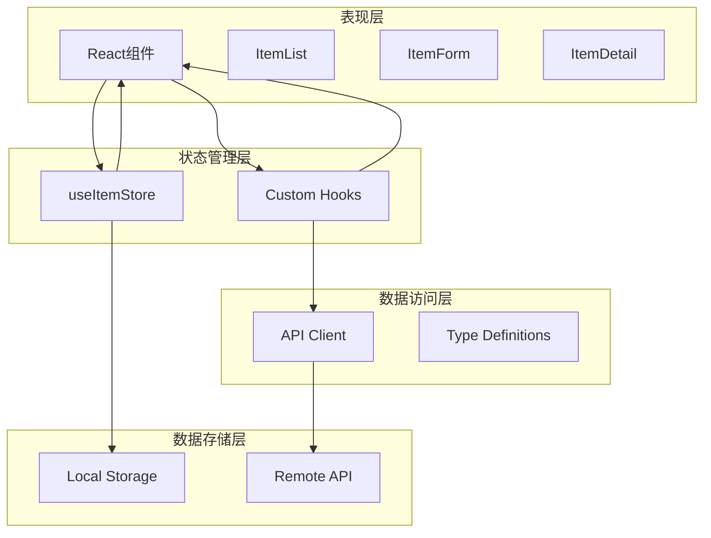
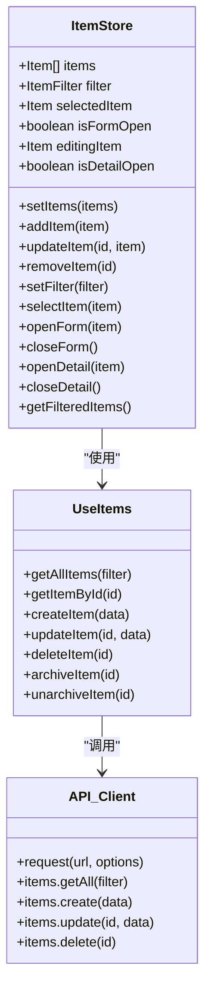
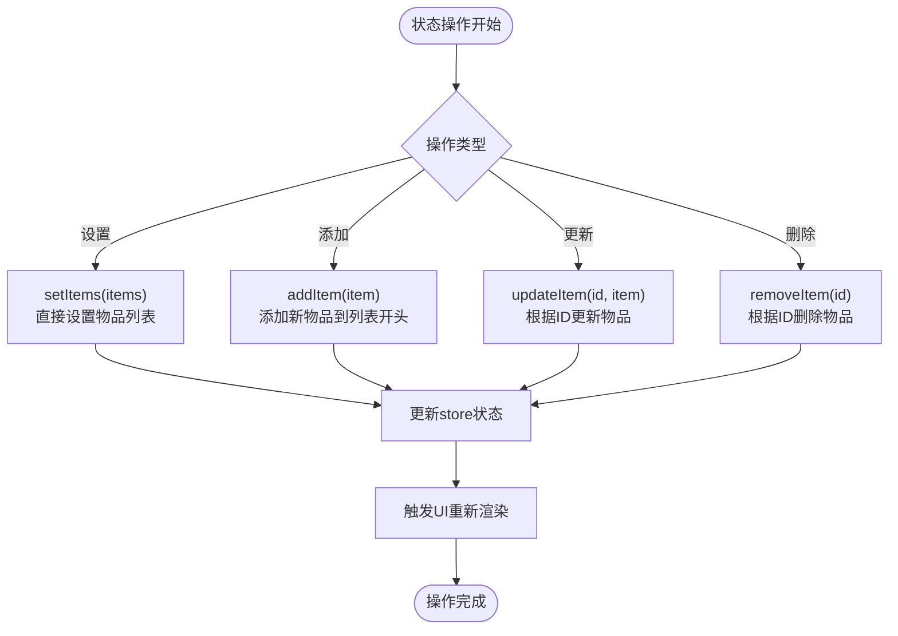
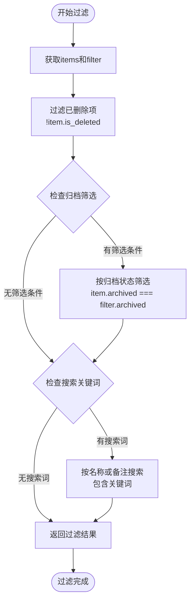
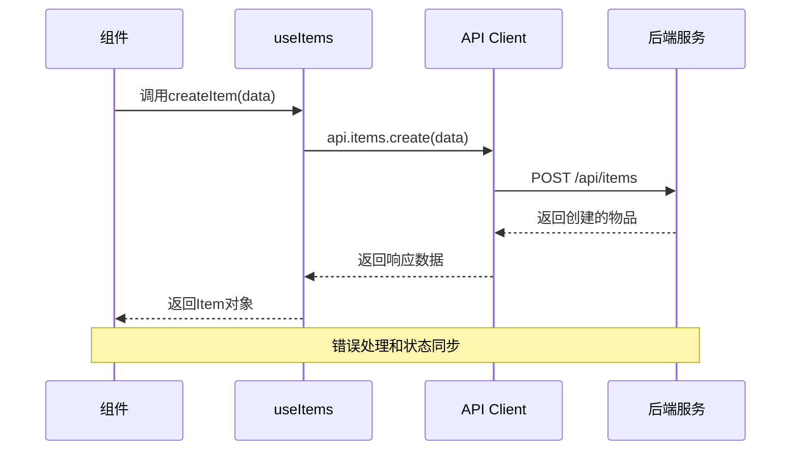
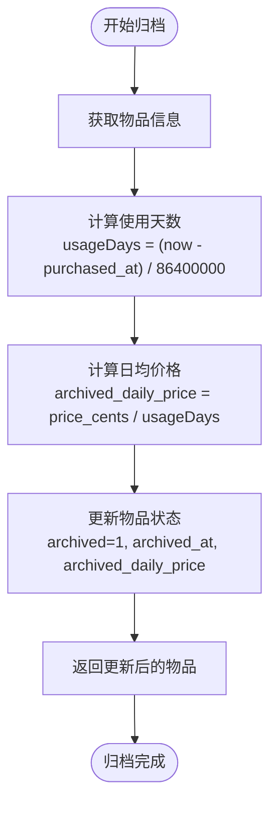
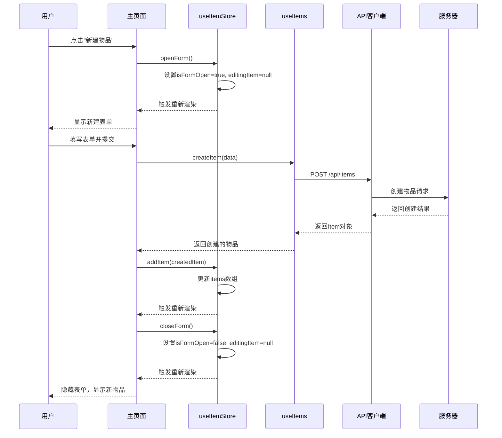
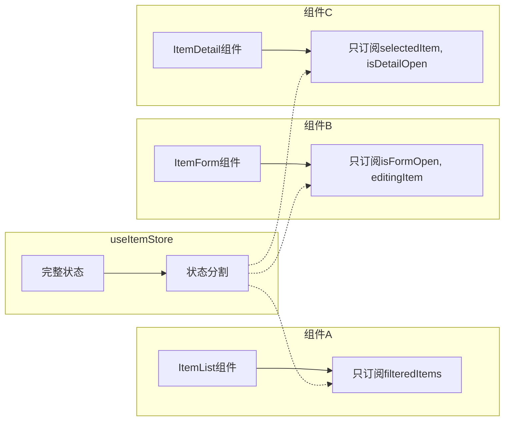
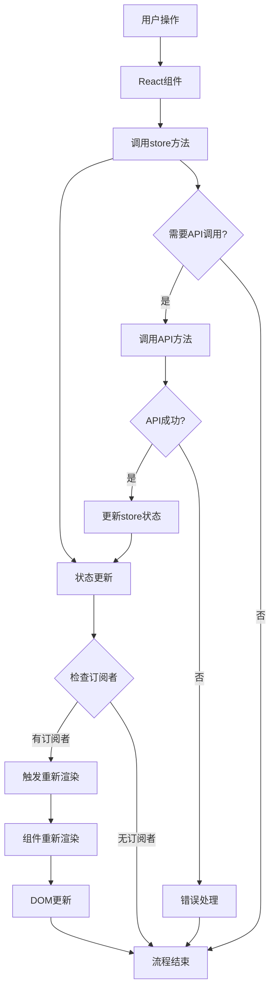

# 状态管理

<cite>
**本文档中引用的文件**
- [lib/store/item-store.ts](file://lib/store/item-store.ts)
- [lib/hooks/use-items.ts](file://lib/hooks/use-items.ts)
- [app/page.tsx](file://app/page.tsx)
- [components/item-list.tsx](file://components/item-list.tsx)
- [components/item-form.tsx](file://components/item-form.tsx)
- [components/item-detail.tsx](file://components/item-detail.tsx)
- [lib/api/client.ts](file://lib/api/client.ts.ts)
- [lib/types/item.ts](file://lib/types/item.ts)
- [lib/types/tag.ts](file://lib/types/tag.ts)
</cite>

## 目录
1. [简介](#简介)
2. [项目架构概览](#项目架构概览)
3. [核心状态管理组件](#核心状态管理组件)
4. [useItemStore详细分析](#useitemstore详细分析)
5. [自定义Hook useItems](#自定义hook-useitems)
6. [状态流与数据同步](#状态流与数据同步)
7. [性能优化策略](#性能优化策略)
8. [状态更新流程图](#状态更新流程图)
9. [最佳实践](#最佳实践)
10. [总结](#总结)

## 简介

本文档深入阐述了基于Zustand的状态管理机制，该系统采用现代化的React状态管理模式，实现了本地状态与云端数据的双向同步。系统通过useItemStore管理核心业务状态，结合useItems Hook处理API调用，形成了完整的状态管理解决方案。

## 项目架构概览

系统采用分层架构设计，清晰分离关注点：

**图表来源**
- [app/page.tsx](file://app/page.tsx#L1-L275)
- [lib/store/item-store.ts](file://lib/store/item-store.ts#L1-L114)
- [lib/hooks/use-items.ts](file://lib/hooks/use-items.ts#L1-L106)

## 核心状态管理组件

### 状态管理层次结构

系统采用多层状态管理策略：

**图表来源**
- [lib/store/item-store.ts](file://lib/store/item-store.ts#L9-L45)
- [lib/hooks/use-items.ts](file://lib/hooks/use-items.ts#L13-L105)
- [lib/api/client.ts](file://lib/api/client.ts#L74-L143)

**章节来源**
- [lib/store/item-store.ts](file://lib/store/item-store.ts#L1-L114)
- [lib/hooks/use-items.ts](file://lib/hooks/use-items.ts#L1-L106)

## useItemStore详细分析

### 核心状态结构

useItemStore管理以下核心状态：

| 状态属性 | 类型 | 描述 | 默认值 |
|---------|------|------|--------|
| items | Item[] | 物品列表数据 | [] |
| filter | ItemFilter | 筛选条件 | {} |
| selectedItem | Item \| null | 当前选中的物品 | null |
| isFormOpen | boolean | 表单是否打开 | false |
| editingItem | Item \| null | 正在编辑的物品 | null |
| isDetailOpen | boolean | 详情面板是否打开 | false |

### 状态操作方法

#### 数据操作方法

**图表来源**
- [lib/store/item-store.ts](file://lib/store/item-store.ts#L55-L67)

#### UI状态管理方法

| 方法名 | 参数 | 功能描述 | 实现方式 |
|--------|------|----------|----------|
| openForm | item?: Item | 打开表单，支持编辑模式 | 设置isFormOpen=true，设置editingItem |
| closeForm | 无 | 关闭表单 | 设置isFormOpen=false，清空editingItem |
| openDetail | item: Item | 打开详情面板 | 设置isDetailOpen=true，设置selectedItem |
| closeDetail | 无 | 关闭详情面板 | 设置isDetailOpen=false，清空selectedItem |
| selectItem | item: Item \| null | 选择物品 | 设置selectedItem |

#### 筛选功能实现

getFilteredItems方法实现了复杂的本地数据过滤逻辑：

**图表来源**
- [lib/store/item-store.ts](file://lib/store/item-store.ts#L93-L112)

**章节来源**
- [lib/store/item-store.ts](file://lib/store/item-store.ts#L47-L113)

## 自定义Hook useItems

### API调用封装

useItems Hook提供了完整的物品数据操作接口：

**图表来源**
- [lib/hooks/use-items.ts](file://lib/hooks/use-items.ts#L34-L45)
- [lib/api/client.ts](file://lib/api/client.ts#L111-L121)

### 主要API方法

| 方法名 | 参数 | 返回值 | 功能描述 |
|--------|------|--------|----------|
| getAllItems | filter?: ItemFilter | Promise<Item[]> | 获取符合条件的物品列表 |
| getItemById | id: number | Promise<Item \| null> | 根据ID获取物品详情 |
| createItem | data: CreateItemDTO | Promise<Item> | 创建新物品 |
| updateItem | id: number, data: UpdateItemDTO | Promise<Item> | 更新指定物品 |
| deleteItem | id: number | Promise<void> | 删除指定物品 |
| archiveItem | id: number | Promise<Item> | 归档物品（计算日均价格） |
| unarchiveItem | id: number | Promise<Item> | 取消归档物品 |

### 归档逻辑实现

归档功能展示了复杂的状态转换：

**图表来源**
- [lib/hooks/use-items.ts](file://lib/hooks/use-items.ts#L69-L85)

**章节来源**
- [lib/hooks/use-items.ts](file://lib/hooks/use-items.ts#L13-L105)

## 状态流与数据同步

### 完整状态流示例

以"新建物品"为例，展示完整的状态流转过程：

**图表来源**
- [app/page.tsx](file://app/page.tsx#L75-L98)
- [lib/store/item-store.ts](file://lib/store/item-store.ts#L73-L81)
- [lib/hooks/use-items.ts](file://lib/hooks/use-items.ts#L34-L45)

### 数据同步策略

系统采用以下数据同步策略：

1. **本地优先**：所有UI操作首先更新本地状态
2. **异步同步**：API调用在后台进行，不阻塞UI
3. **错误恢复**：API失败时保持本地状态，允许用户重试
4. **状态一致性**：确保本地状态与服务器状态最终一致

**章节来源**
- [app/page.tsx](file://app/page.tsx#L46-L73)
- [lib/api/client.ts](file://lib/api/client.ts#L32-L62)

## 性能优化策略

### 选择性订阅机制

系统通过选择性订阅优化性能：

**图表来源**
- [app/page.tsx](file://app/page.tsx#L24-L39)

### 优化技巧

1. **状态分割**：每个组件只订阅需要的状态片段
2. **回调函数缓存**：使用useCallback避免不必要的重渲染
3. **条件渲染**：根据状态动态控制组件渲染
4. **批量更新**：合理安排状态更新顺序

**章节来源**
- [app/page.tsx](file://app/page.tsx#L41-L44)

## 状态更新流程图

### 用户操作到状态更新的完整流程

**图表来源**
- [lib/store/item-store.ts](file://lib/store/item-store.ts#L47-L113)
- [lib/hooks/use-items.ts](file://lib/hooks/use-items.ts#L14-L105)

## 最佳实践

### 状态管理原则

1. **单一职责**：每个store专注于特定业务领域
2. **不可变更新**：使用函数式更新确保状态不可变
3. **类型安全**：充分利用TypeScript确保类型安全
4. **错误边界**：完善的错误处理机制
5. **性能考虑**：合理的选择性订阅和状态分割

### 代码组织建议

1. **模块化设计**：将不同功能的状态管理分离到独立模块
2. **类型定义**：提供完整的TypeScript类型定义
3. **文档化**：为每个store方法提供清晰的文档
4. **测试覆盖**：确保关键状态操作有足够的测试覆盖

### 常见问题解决

1. **状态不一致**：通过API调用和本地状态的双重确认
2. **性能问题**：使用选择性订阅和状态分割
3. **并发问题**：通过状态更新的原子性和事务性保证

## 总结

基于Zustand的状态管理系统展现了现代React应用的最佳实践。通过useItemStore的集中式状态管理，结合useItems的API封装，系统实现了：

- **清晰的状态结构**：明确的业务状态划分和操作方法
- **高效的性能表现**：选择性订阅和状态分割优化
- **可靠的错误处理**：完善的异常捕获和恢复机制
- **良好的开发体验**：TypeScript类型支持和直观的API设计

这种架构不仅满足了当前的功能需求，还为未来的扩展提供了坚实的基础。通过合理的抽象和封装，开发者可以专注于业务逻辑的实现，而不必担心状态管理的复杂性。