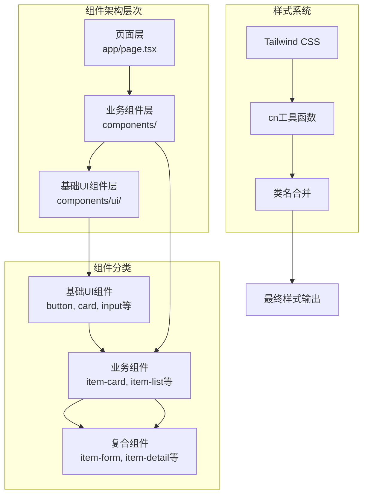
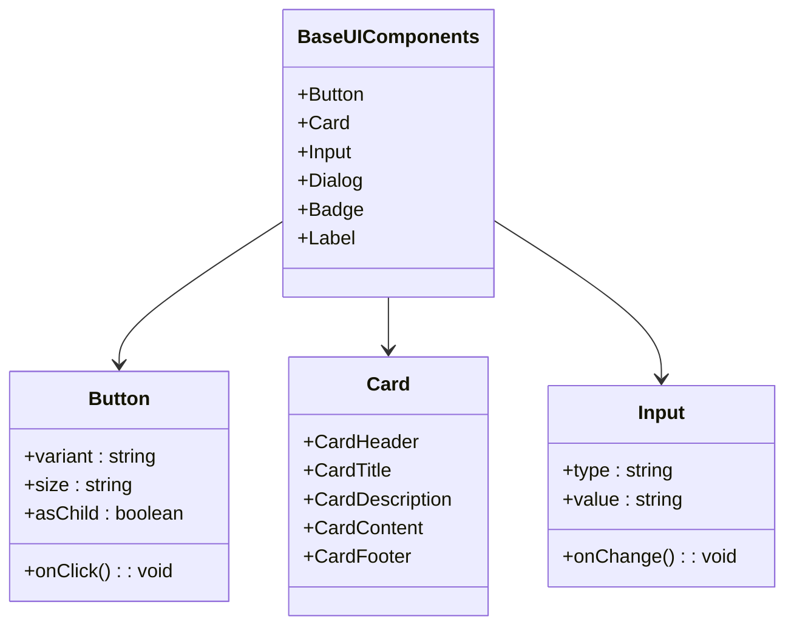
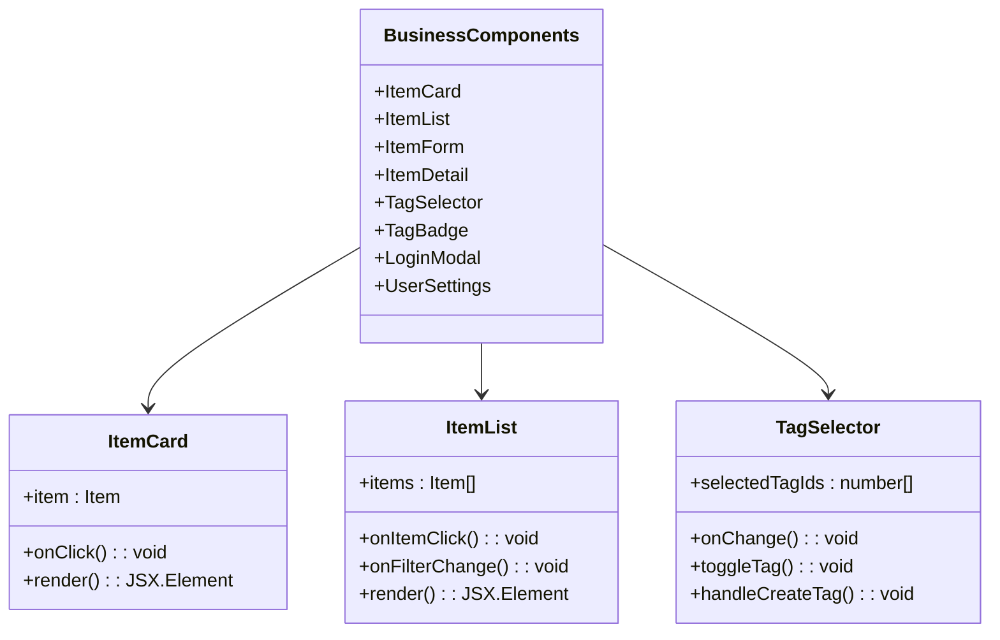
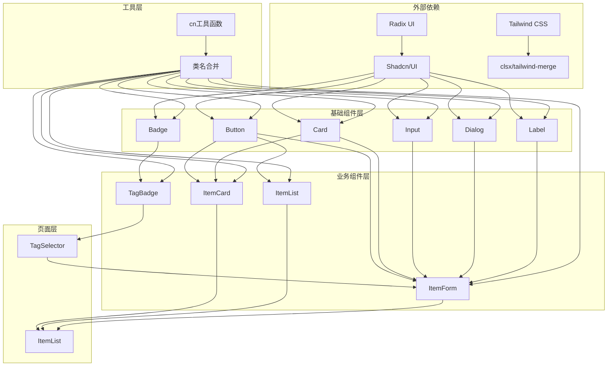
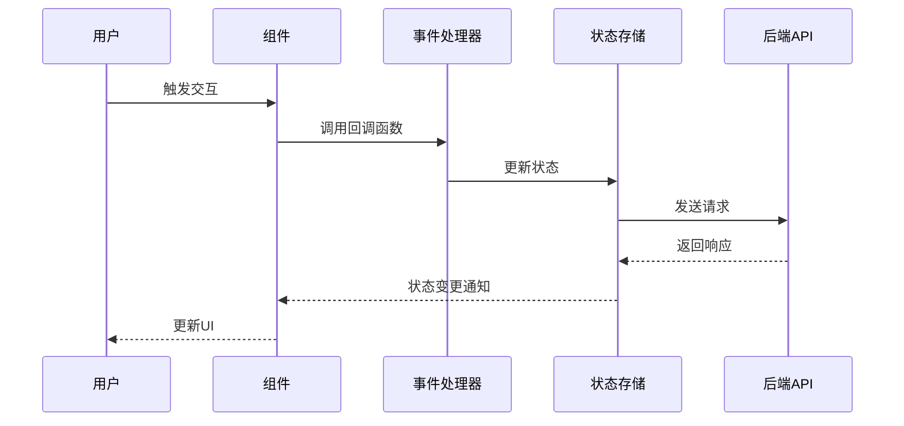
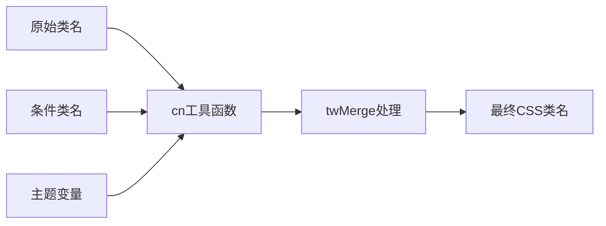
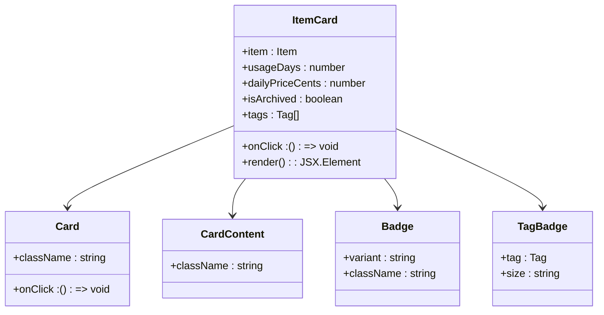
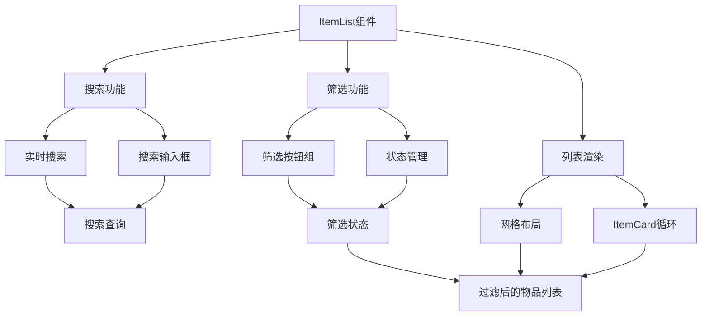
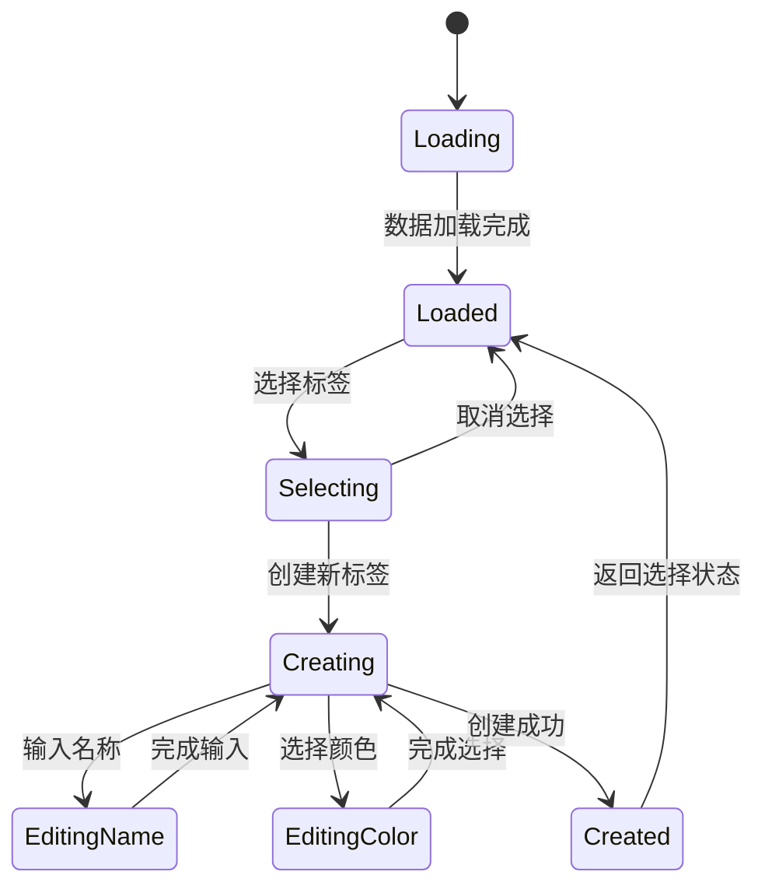

# 组件架构

<cite>
**本文档引用的文件**
- [components/ui/index.ts](file://components/ui/index.ts)
- [components/index.ts](file://components/index.ts)
- [components/item-card.tsx](file://components/item-card.tsx)
- [components/item-list.tsx](file://components/item-list.tsx)
- [components/tag-selector.tsx](file://components/tag-selector.tsx)
- [components/ui/button.tsx](file://components/ui/button.tsx)
- [components/ui/card.tsx](file://components/ui/card.tsx)
- [components/ui/input.tsx](file://components/ui/input.tsx)
- [components/tag-badge.tsx](file://components/tag-badge.tsx)
- [components/item-form.tsx](file://components/item-form.tsx)
- [components/item-detail.tsx](file://components/item-detail.tsx)
- [components/login-modal.tsx](file://components/login-modal.tsx)
- [components/user-settings.tsx](file://components/user-settings.tsx)
- [lib/utils/cn.ts](file://lib/utils/cn.ts)
- [app/page.tsx](file://app/page.tsx)
- [lib/types/item.ts](file://lib/types/item.ts)
- [lib/types/tag.ts](file://lib/types/tag.ts)
</cite>

## 目录
1. [简介](#简介)
2. [项目结构概览](#项目结构概览)
3. [基础UI组件层](#基础ui组件层)
4. [业务组件层](#业务组件层)
5. [组件依赖关系](#组件依赖关系)
6. [Props设计模式](#props设计模式)
7. [事件处理机制](#事件处理机制)
8. [样式定制方式](#样式定制方式)
9. [实际代码示例](#实际代码示例)
10. [总结](#总结)

## 简介

本文档详细阐述了记账应用的组件架构设计，该系统采用分层组件化架构，将UI组件分为基础UI组件层和业务组件层两个主要层次。系统基于Radix UI构建基础组件，使用Tailwind CSS进行样式定制，并通过cn工具函数实现类名合并，为开发者提供了可复用、可维护的组件体系。

## 项目结构概览

项目采用清晰的分层架构，将不同类型的组件分别组织在不同的目录中：



**图表来源**
- [app/page.tsx](file://app/page.tsx#L1-L275)
- [components/ui/index.ts](file://components/ui/index.ts#L1-L23)
- [components/index.ts](file://components/index.ts#L1-L11)

**章节来源**
- [app/page.tsx](file://app/page.tsx#L1-L275)
- [components/ui/index.ts](file://components/ui/index.ts#L1-L23)
- [components/index.ts](file://components/index.ts#L1-L11)

## 基础UI组件层

### 架构设计

基础UI组件层位于`components/ui/`目录下，基于Radix UI构建，提供无障碍和可复用的交互元素。这些组件遵循一致性原则，具有统一的API设计和样式规范。



**图表来源**
- [components/ui/button.tsx](file://components/ui/button.tsx#L1-L61)
- [components/ui/card.tsx](file://components/ui/card.tsx#L1-L80)
- [components/ui/input.tsx](file://components/ui/input.tsx#L1-L26)

### 核心组件特性

#### Button组件
Button组件支持多种变体和尺寸，通过class-variance-authority实现变体系统：

| 属性 | 类型 | 默认值 | 描述 |
|------|------|--------|------|
| variant | 'default' \| 'destructive' \| 'outline' \| 'secondary' \| 'ghost' \| 'link' | 'default' | 按钮外观变体 |
| size | 'default' \| 'sm' \| 'lg' \| 'icon' | 'default' | 按钮尺寸 |
| asChild | boolean | false | 是否作为子组件渲染 |

#### Card组件系列
Card组件提供卡片布局的完整解决方案，包括头部、内容区、底部等模块化部分。

#### Input组件
Input组件提供统一的输入框样式，支持各种输入类型和验证状态。

**章节来源**
- [components/ui/button.tsx](file://components/ui/button.tsx#L1-L61)
- [components/ui/card.tsx](file://components/ui/card.tsx#L1-L80)
- [components/ui/input.tsx](file://components/ui/input.tsx#L1-L26)

## 业务组件层

### 架构设计

业务组件层位于`components/`目录下，负责实现具体的业务功能。这些组件组合基础UI组件，提供完整的用户交互体验。



**图表来源**
- [components/item-card.tsx](file://components/item-card.tsx#L1-L102)
- [components/item-list.tsx](file://components/item-list.tsx#L1-L99)
- [components/tag-selector.tsx](file://components/tag-selector.tsx#L1-L177)

### 核心业务组件

#### ItemCard组件
ItemCard组件展示单个物品的摘要信息，包括名称、价格、使用天数、日均成本等关键数据。

**主要功能：**
- 显示物品基本信息
- 支持标签展示
- 提供点击交互
- 处理归档状态显示

#### ItemList组件
ItemList组件负责展示物品列表，提供搜索和筛选功能。

**核心特性：**
- 网格布局展示
- 实时搜索功能
- 归档状态筛选
- 响应式设计

#### TagSelector组件
TagSelector组件提供标签选择和创建功能，支持多选和动态创建。

**功能特点：**
- 标签选择和切换
- 新标签创建
- 实时加载标签
- 错误处理

**章节来源**
- [components/item-card.tsx](file://components/item-card.tsx#L1-L102)
- [components/item-list.tsx](file://components/item-list.tsx#L1-L99)
- [components/tag-selector.tsx](file://components/tag-selector.tsx#L1-L177)

## 组件依赖关系

### 整体依赖架构



**图表来源**
- [components/ui/index.ts](file://components/ui/index.ts#L1-L23)
- [components/index.ts](file://components/index.ts#L1-L11)
- [lib/utils/cn.ts](file://lib/utils/cn.ts#L1-L12)

### 组件间通信

组件间通过以下方式进行通信：

1. **Props传递**：父组件向子组件传递数据和回调函数
2. **事件冒泡**：子组件触发事件，父组件处理
3. **状态提升**：共享状态通过React状态管理
4. **Hook抽象**：业务逻辑封装在自定义Hook中

**章节来源**
- [components/item-card.tsx](file://components/item-card.tsx#L1-L102)
- [components/item-list.tsx](file://components/item-list.tsx#L1-L99)
- [components/item-form.tsx](file://components/item-form.tsx#L1-L216)

## Props设计模式

### 设计原则

组件Props设计遵循以下原则：

1. **单一职责**：每个Prop都有明确的用途
2. **类型安全**：使用TypeScript确保类型正确性
3. **可选性合理**：非必需属性设为可选
4. **默认值清晰**：提供合理的默认值

### 核心Props模式

#### 基础Props模式
```typescript
interface BaseComponentProps {
  className?: string;
  children?: React.ReactNode;
  style?: React.CSSProperties;
}
```

#### 业务Props模式
```typescript
interface ItemCardProps {
  item: Item;
  onClick: () => void;
}

interface ItemListProps {
  items: Item[];
  onItemClick: (item: Item) => void;
  onFilterChange: (filter: ItemFilter) => void;
}
```

#### 回调Props模式
```typescript
interface FormProps {
  onSubmit: (data: FormData) => void;
  onCancel: () => void;
  onChange?: (field: string, value: any) => void;
}
```

**章节来源**
- [components/item-card.tsx](file://components/item-card.tsx#L16-L19)
- [components/item-list.tsx](file://components/item-list.tsx#L14-L18)
- [components/item-form.tsx](file://components/item-form.tsx#L17-L22)

## 事件处理机制

### 事件处理流程



**图表来源**
- [components/item-form.tsx](file://components/item-form.tsx#L80-L105)
- [components/item-list.tsx](file://components/item-list.tsx#L24-L32)

### 事件处理最佳实践

1. **防抖处理**：对频繁触发的事件进行防抖
2. **错误处理**：完善的异常捕获和用户反馈
3. **状态管理**：合理使用React状态和全局状态
4. **性能优化**：避免不必要的重新渲染

**章节来源**
- [components/item-form.tsx](file://components/item-form.tsx#L80-L105)
- [components/item-list.tsx](file://components/item-list.tsx#L24-L32)

## 样式定制方式

### Tailwind CSS集成

系统采用Tailwind CSS作为主要样式解决方案，通过cn工具函数实现类名合并和条件样式。



**图表来源**
- [lib/utils/cn.ts](file://lib/utils/cn.ts#L1-L12)

### cn工具函数设计

cn工具函数结合了clsx和tailwind-merge，提供智能的类名合并：

```typescript
// 功能特性：
// 1. 条件类名支持
// 2. Tailwind CSS冲突解决
// 3. 类名去重
// 4. 空值过滤
```

### 主题适配

系统支持深色模式和浅色模式，通过CSS变量和Tailwind工具类实现：

| 主题 | 浅色模式 | 深色模式 |
|------|----------|----------|
| 背景 | #F7F6F3 | #191919 |
| 文字 | #37352F | #E6E6E6 |
| 边框 | #E9E9E7 | #3F3F3F |
| 主色调 | #2383E2 | #529CCA |

**章节来源**
- [lib/utils/cn.ts](file://lib/utils/cn.ts#L1-L12)
- [components/ui/button.tsx](file://components/ui/button.tsx#L10-L37)
- [components/ui/card.tsx](file://components/ui/card.tsx#L12-L18)

## 实际代码示例

### ItemCard组件实现

ItemCard组件展示了如何组合基础UI组件实现具体业务功能：



**图表来源**
- [components/item-card.tsx](file://components/item-card.tsx#L21-L101)

**核心实现要点：**
1. **数据处理**：使用工具函数计算使用天数和日均价格
2. **条件渲染**：根据物品状态决定是否显示归档标签
3. **事件绑定**：提供点击回调处理用户交互
4. **样式组合**：通过cn函数合并多个样式类

### ItemList组件实现

ItemList组件展示了复杂业务逻辑的组件设计：



**图表来源**
- [components/item-list.tsx](file://components/item-list.tsx#L20-L98)

**关键技术点：**
1. **状态管理**：使用useState管理搜索和筛选状态
2. **事件处理**：分离搜索和筛选的处理逻辑
3. **条件渲染**：根据物品数量决定显示空状态
4. **响应式设计**：使用Grid布局适应不同屏幕尺寸

### TagSelector组件实现

TagSelector组件展示了复杂交互逻辑的实现：



**图表来源**
- [components/tag-selector.tsx](file://components/tag-selector.tsx#L18-L177)

**核心功能实现：**
1. **异步数据加载**：使用useEffect加载标签数据
2. **状态切换**：管理创建新标签的状态
3. **表单验证**：验证新标签名称和颜色
4. **错误处理**：提供友好的错误提示

**章节来源**
- [components/item-card.tsx](file://components/item-card.tsx#L21-L101)
- [components/item-list.tsx](file://components/item-list.tsx#L20-L98)
- [components/tag-selector.tsx](file://components/tag-selector.tsx#L18-L177)

## 总结

该记账应用的组件架构体现了现代前端开发的最佳实践：

### 架构优势

1. **分层清晰**：基础UI组件和业务组件职责分明
2. **可复用性强**：组件设计遵循单一职责原则
3. **类型安全**：全面使用TypeScript确保类型安全
4. **样式灵活**：基于Tailwind CSS的样式系统
5. **用户体验**：注重无障碍设计和交互体验

### 技术特色

1. **基于Radix UI**：提供可靠的无障碍基础组件
2. **cn工具函数**：智能的类名合并解决方案
3. **响应式设计**：适应不同设备和屏幕尺寸
4. **状态管理**：合理的状态划分和管理策略
5. **错误处理**：完善的异常处理机制

### 扩展性考虑

该架构为未来的功能扩展提供了良好的基础：
- 新组件可以轻松集成到现有架构中
- 样式系统支持主题定制和品牌化
- 事件处理机制支持复杂的业务逻辑
- 类型系统确保代码质量和维护性

这种架构设计不仅满足了当前的功能需求，也为系统的长期发展奠定了坚实的基础。