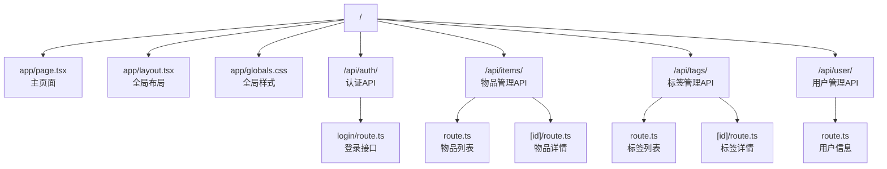
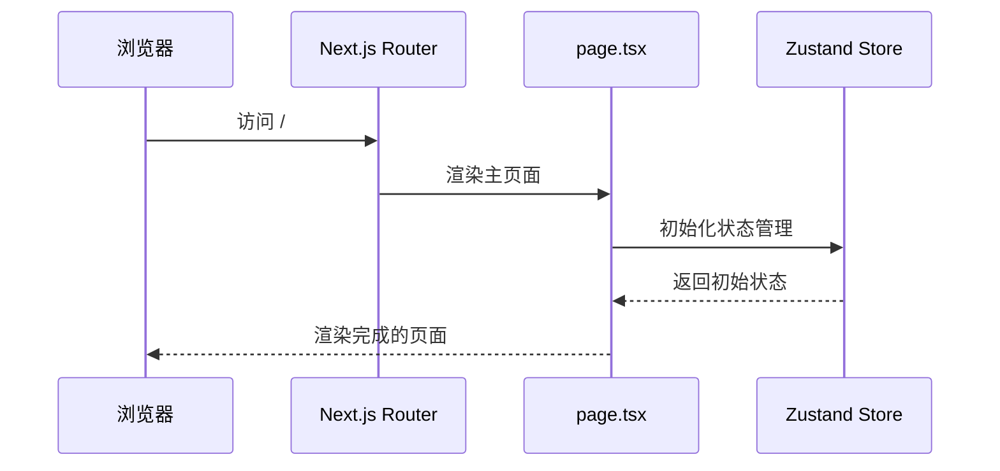
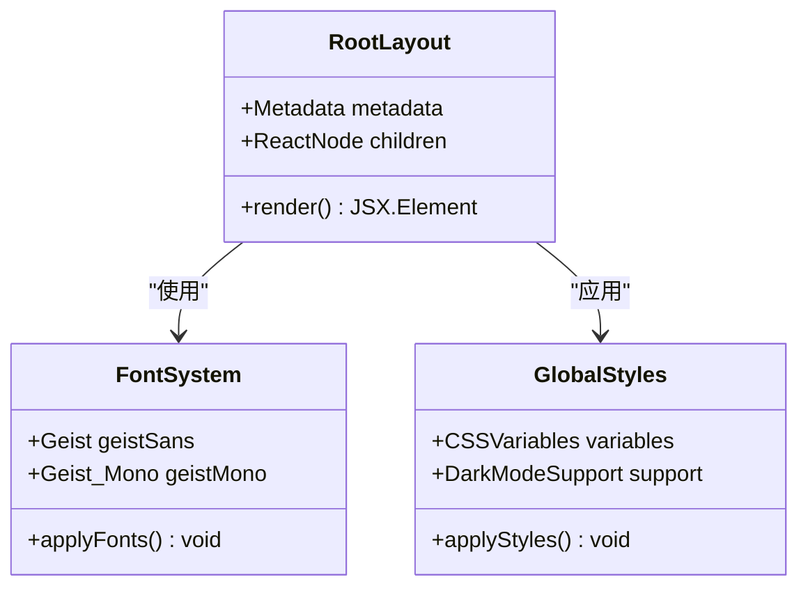
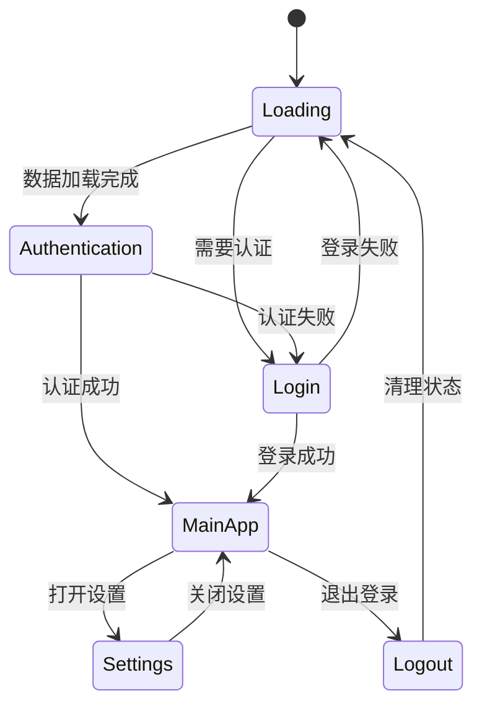
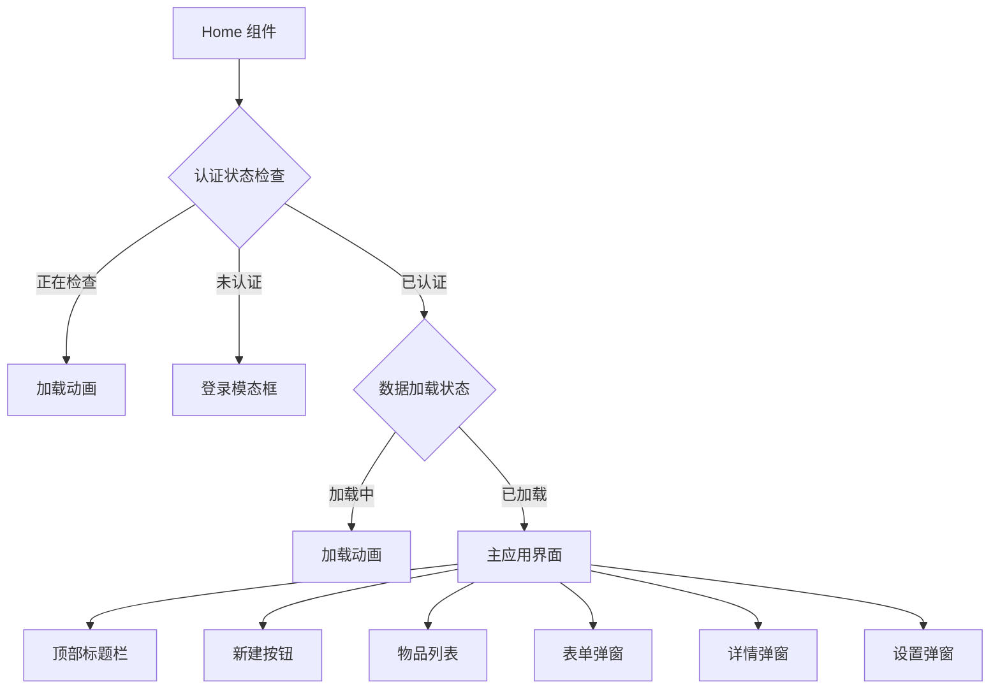
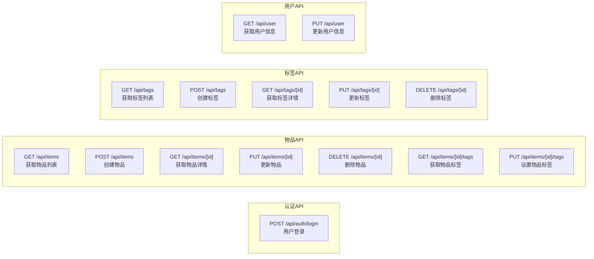
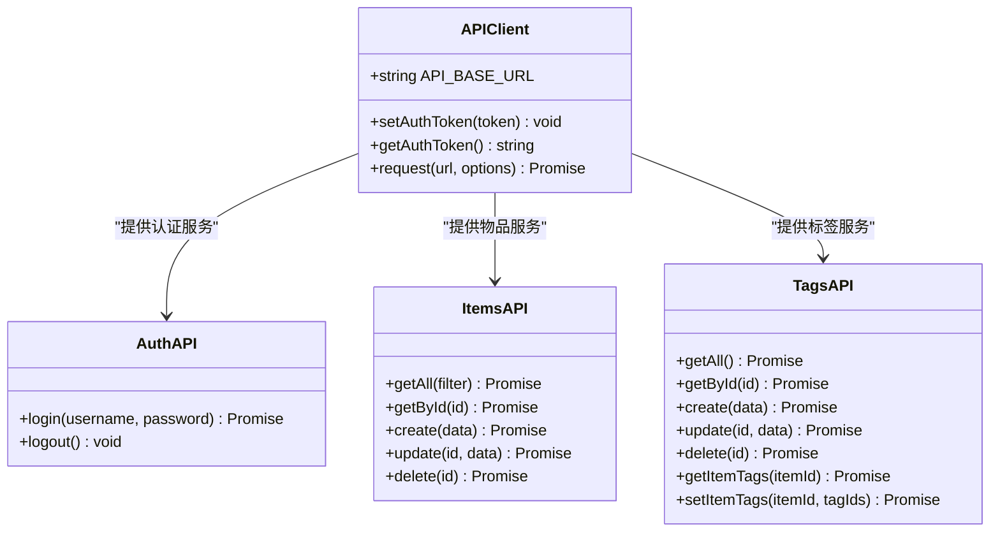
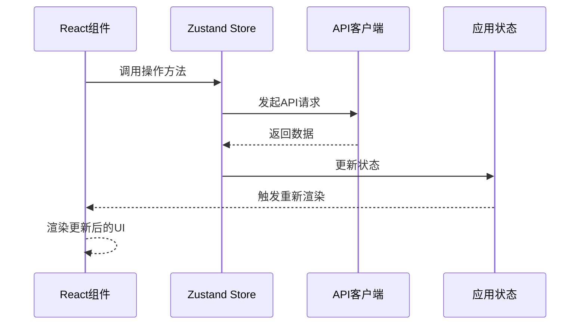
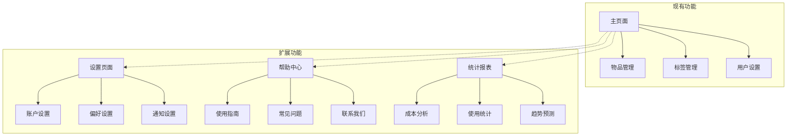

# 路由与导航

<cite>
**本文档中引用的文件**
- [app/layout.tsx](file://app/layout.tsx)
- [app/page.tsx](file://app/page.tsx)
- [app/globals.css](file://app/globals.css)
- [app/api/auth/login/route.ts](file://app/api/auth/login/route.ts)
- [app/api/items/route.ts](file://app/api/items/route.ts)
- [app/api/items/[id]/route.ts](file://app/api/items/[id]/route.ts)
- [app/api/tags/route.ts](file://app/api/tags/route.ts)
- [app/api/user/route.ts](file://app/api/user/route.ts)
- [lib/api/client.ts](file://lib/api/client.ts)
- [lib/hooks/use-items.ts](file://lib/hooks/use-items.ts)
- [lib/hooks/use-tags.ts](file://lib/hooks/use-tags.ts)
- [components/user-settings.tsx](file://components/user-settings.tsx)
- [components/login-modal.tsx](file://components/login-modal.tsx)
- [package.json](file://package.json)
- [next.config.ts](file://next.config.ts)
</cite>

## 目录
1. [简介](#简介)
2. [项目结构概览](#项目结构概览)
3. [App Router架构](#app-router架构)
4. [路由映射机制](#路由映射机制)
5. [全局布局系统](#全局布局系统)
6. [客户端导航机制](#客户端导航机制)
7. [API路由系统](#api路由系统)
8. [前后端数据交互](#前后端数据交互)
9. [状态管理与组件通信](#状态管理与组件通信)
10. [路由扩展性设计](#路由扩展性设计)
11. [总结](#总结)

## 简介

本项目采用Next.js 16的App Router架构，构建了一个现代化的单页面应用程序（SPA）。该系统通过精心设计的路由结构、全局布局管理和前后端分离的API架构，实现了流畅的用户体验和良好的可扩展性。项目不仅满足了当前的功能需求，还为未来的功能扩展预留了充分的空间。

## 项目结构概览

项目采用了Next.js App Router推荐的目录结构，核心文件组织如下：

```mermaid
graph TB
subgraph "App Router 结构"
A[app/] --> B[layout.tsx]
A --> C[page.tsx]
A --> D[globals.css]
A --> E[api/]
E --> F[auth/login/route.ts]
E --> G[items/]
E --> H[tags/]
E --> I[user/route.ts]
G --> J[route.ts]
G --> K[[id]/route.ts]
H --> L[route.ts]
H --> M[[id]/route.ts]
end
subgraph "组件层"
N[components/] --> O[item-list.tsx]
N --> P[item-detail.tsx]
N --> Q[item-form.tsx]
N --> R[user-settings.tsx]
end
subgraph "工具层"
S[lib/] --> T[api/client.ts]
S --> U[hooks/]
S --> V[store/]
S --> W[types/]
end
A --> N
N --> S
```

**图表来源**
- [app/layout.tsx](file://app/layout.tsx#L1-L35)
- [app/page.tsx](file://app/page.tsx#L1-L275)
- [app/api/auth/login/route.ts](file://app/api/auth/login/route.ts#L1-L47)

**章节来源**
- [app/layout.tsx](file://app/layout.tsx#L1-L35)
- [app/page.tsx](file://app/page.tsx#L1-L275)

## App Router架构

Next.js App Router采用了全新的文件系统路由机制，通过目录结构自动映射URL路径。这种设计提供了更好的性能和开发体验。

### 核心特性

1. **文件系统路由**：目录结构直接映射到URL路径
2. **TypeScript支持**：完整的类型安全
3. **流式渲染**：支持React 18的新特性
4. **并行数据获取**：优化的加载性能

### 路由层次结构



**图表来源**
- [app/page.tsx](file://app/page.tsx#L1-L275)
- [app/layout.tsx](file://app/layout.tsx#L1-L35)
- [app/api/auth/login/route.ts](file://app/api/auth/login/route.ts#L1-L47)

**章节来源**
- [app/page.tsx](file://app/page.tsx#L1-L275)
- [app/layout.tsx](file://app/layout.tsx#L1-L35)

## 路由映射机制

### 根路径映射

在Next.js App Router中，`app/page.tsx`是默认的根路径入口点，相当于传统路由中的首页。



**图表来源**
- [app/page.tsx](file://app/page.tsx#L20-L40)

### 动态路由支持

项目使用动态路由来处理具有ID的资源，如物品详情页面：

- `/api/items/[id]/route.ts`：处理特定物品的CRUD操作
- `/api/tags/[id]/route.ts`：处理特定标签的操作

这些动态路由允许通过URL参数传递资源标识符，实现灵活的资源访问。

**章节来源**
- [app/page.tsx](file://app/page.tsx#L1-L275)
- [app/api/items/[id]/route.ts](file://app/api/items/[id]/route.ts#L1-L134)

## 全局布局系统

### 布局组件架构

全局布局通过`layout.tsx`文件定义，为整个应用提供统一的基础结构和样式。



**图表来源**
- [app/layout.tsx](file://app/layout.tsx#L5-L35)
- [app/globals.css](file://app/globals.css#L1-L38)

### 字体系统

项目集成了Geist字体系统，提供现代感的设计风格：

- **Geist Sans**：用于正文文本，提供清晰易读的排版
- **Geist Mono**：用于代码和等宽文本显示

字体变量通过CSS自定义属性注入，支持主题切换和动态调整。

### 样式系统

全局样式采用Tailwind CSS和自定义CSS变量相结合的方式：

- **Notion风格配色**：提供专业的办公软件界面质感
- **深色模式支持**：完整的暗色主题适配
- **响应式设计**：移动端友好的界面布局

**章节来源**
- [app/layout.tsx](file://app/layout.tsx#L1-L35)
- [app/globals.css](file://app/globals.css#L1-L38)

## 客户端导航机制

### 单页应用体验

尽管项目采用SPA架构，但通过精心设计的客户端逻辑实现了类似多页面应用的导航体验。



**图表来源**
- [app/page.tsx](file://app/page.tsx#L155-L179)

### 状态管理与导航

应用使用Zustand进行状态管理，结合React Hooks实现组件间的状态共享：

- **认证状态管理**：控制用户登录状态和权限
- **物品数据管理**：维护物品列表和编辑状态
- **UI状态管理**：控制模态框和表单的显示状态

### 组件树结构

主页面组件采用分层设计，通过条件渲染实现不同的视图状态：



**图表来源**
- [app/page.tsx](file://app/page.tsx#L180-L275)

**章节来源**
- [app/page.tsx](file://app/page.tsx#L1-L275)

## API路由系统

### RESTful API设计

项目采用RESTful API设计原则，为前端提供完整的数据操作接口：



**图表来源**
- [app/api/auth/login/route.ts](file://app/api/auth/login/route.ts#L1-L47)
- [app/api/items/route.ts](file://app/api/items/route.ts#L1-L75)
- [app/api/items/[id]/route.ts](file://app/api/items/[id]/route.ts#L1-L134)
- [app/api/tags/route.ts](file://app/api/tags/route.ts#L1-L73)
- [app/api/user/route.ts](file://app/api/user/route.ts#L1-L103)

### 中间件认证

所有API路由都经过认证中间件保护，确保只有授权用户才能访问敏感数据：

- **JWT Token验证**：使用JSON Web Token进行身份验证
- **权限控制**：基于用户角色的访问控制
- **自动刷新**：支持Token过期后的自动刷新机制

### 错误处理机制

API路由实现了完善的错误处理机制：

- **状态码标准化**：使用标准HTTP状态码表示不同类型的错误
- **错误信息格式化**：统一的错误响应格式
- **异常捕获**：全面的try-catch错误处理

**章节来源**
- [app/api/auth/login/route.ts](file://app/api/auth/login/route.ts#L1-L47)
- [app/api/items/route.ts](file://app/api/items/route.ts#L1-L75)
- [app/api/items/[id]/route.ts](file://app/api/items/[id]/route.ts#L1-L134)
- [app/api/tags/route.ts](file://app/api/tags/route.ts#L1-L73)
- [app/api/user/route.ts](file://app/api/user/route.ts#L1-L103)

## 前后端数据交互

### API客户端架构

项目使用专门的API客户端模块处理所有后端通信：



**图表来源**
- [lib/api/client.ts](file://lib/api/client.ts#L1-L187)

### 数据流管理

应用采用分层的数据管理架构：

1. **Hook层**：`useItems`、`useTags`等自定义Hook封装API调用
2. **Store层**：Zustand状态管理器维护应用状态
3. **组件层**：React组件消费状态并触发更新

### 实时性保证

通过以下机制确保数据的实时性和一致性：

- **状态同步**：组件状态与API数据保持同步
- **错误恢复**：网络错误时的自动重试机制
- **缓存策略**：合理的数据缓存避免重复请求

**章节来源**
- [lib/api/client.ts](file://lib/api/client.ts#L1-L187)
- [lib/hooks/use-items.ts](file://lib/hooks/use-items.ts#L1-L45)
- [lib/hooks/use-tags.ts](file://lib/hooks/use-tags.ts#L1-L44)

## 状态管理与组件通信

### Zustand状态管理

应用使用Zustand进行全局状态管理，特别针对物品数据的复杂状态：



**图表来源**
- [lib/hooks/use-items.ts](file://lib/hooks/use-items.ts#L13-L45)

### 组件间通信模式

应用采用多种组件通信模式：

1. **Props传递**：父子组件间的基本数据传递
2. **回调函数**：子组件向父组件传递事件
3. **状态提升**：多个组件共享的状态管理
4. **Context API**：深层嵌套组件的状态共享

### 异步数据处理

组件通过异步钩子处理数据加载和更新：

- **数据初始化**：组件挂载时自动加载必要数据
- **错误处理**：网络错误时的用户友好提示
- **加载状态**：显示数据加载过程中的反馈信息

**章节来源**
- [lib/hooks/use-items.ts](file://lib/hooks/use-items.ts#L1-L45)
- [lib/hooks/use-tags.ts](file://lib/hooks/use-tags.ts#L1-L44)

## 路由扩展性设计

### 为未来预留的扩展点

虽然当前项目主要是一个单页面应用，但路由设计已经为未来的功能扩展做好准备：



### 模块化路由设计

- **命名空间隔离**：不同功能模块使用独立的路由前缀
- **权限控制**：基于角色的路由访问控制
- **动态加载**：支持按需加载大型功能模块

### 性能优化考虑

- **代码分割**：路由级别的代码分割减少初始包大小
- **预取策略**：智能预取用户可能访问的页面内容
- **缓存机制**：合理利用浏览器缓存和CDN加速

**章节来源**
- [app/page.tsx](file://app/page.tsx#L1-L275)
- [components/user-settings.tsx](file://components/user-settings.tsx#L1-L51)

## 总结

本项目通过Next.js App Router构建了一个功能完整、架构清晰的单页面应用。路由系统的设计既满足了当前的功能需求，又为未来的扩展预留了充足的空间。

### 核心优势

1. **现代化架构**：采用最新的Next.js App Router技术栈
2. **类型安全**：完整的TypeScript支持确保代码质量
3. **性能优化**：流式渲染和并行数据获取提升用户体验
4. **可扩展性**：模块化的路由设计支持功能扩展
5. **开发体验**：热重载和类型检查提高开发效率

### 技术特色

- **前后端一体化**：API路由与前端页面紧密集成
- **状态管理**：Zustand提供高效的状态管理方案
- **样式系统**：Tailwind CSS结合自定义变量的灵活样式方案
- **认证机制**：JWT Token为基础的安全认证体系

该路由系统为构建企业级Web应用提供了坚实的技术基础，能够适应不断变化的业务需求和技术发展。