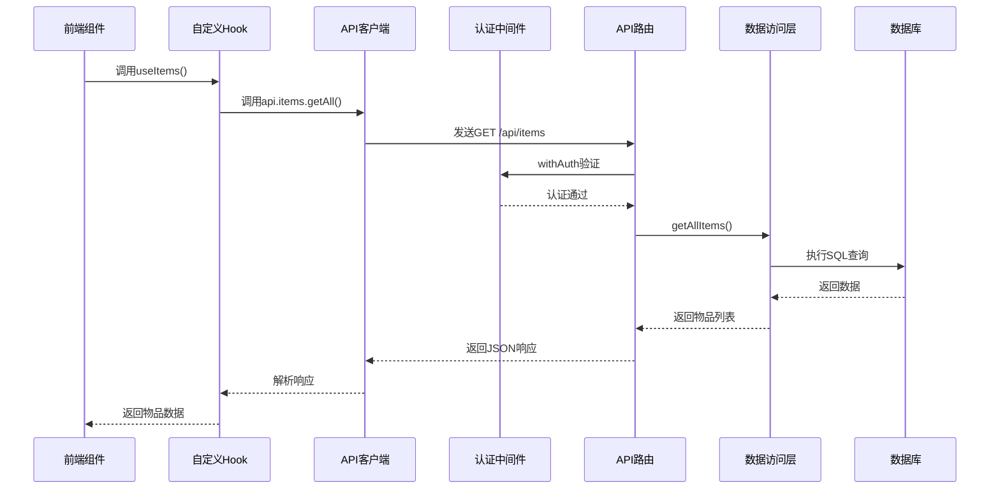
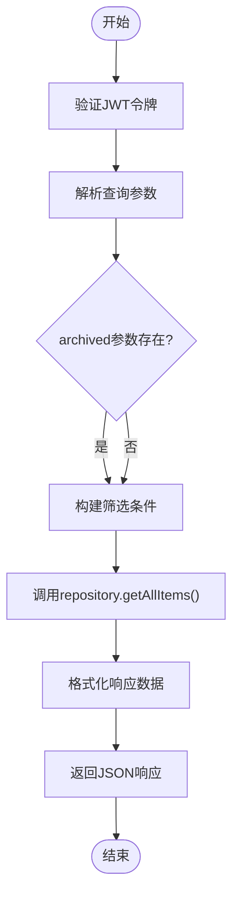
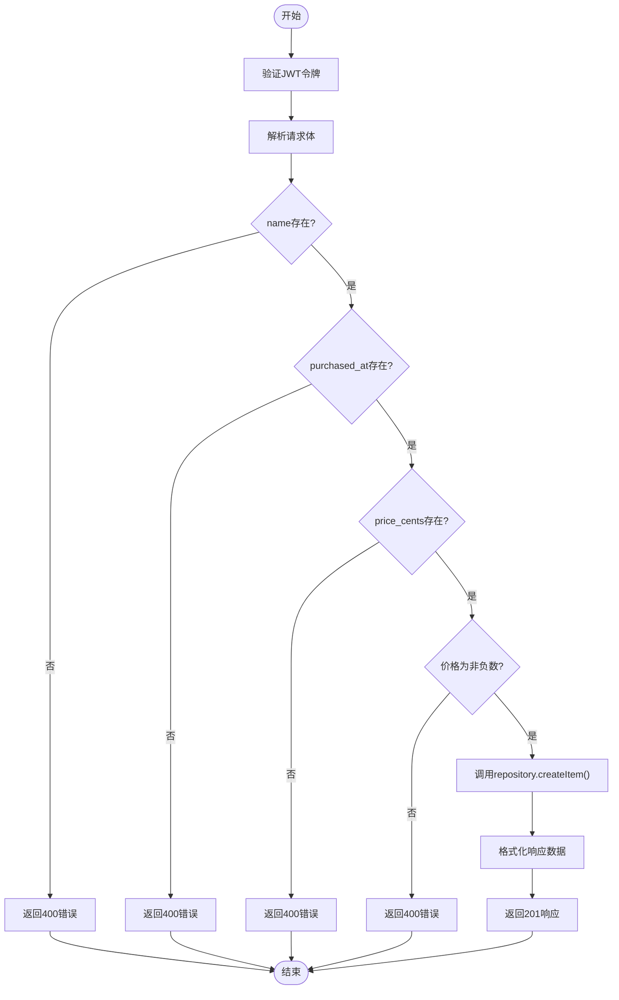
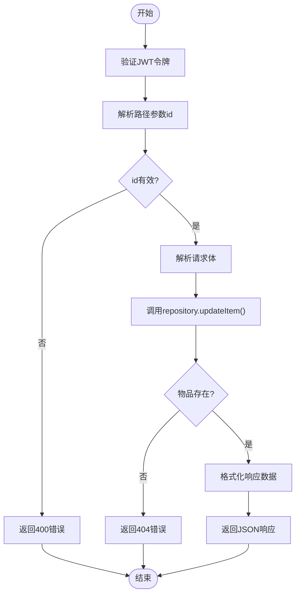
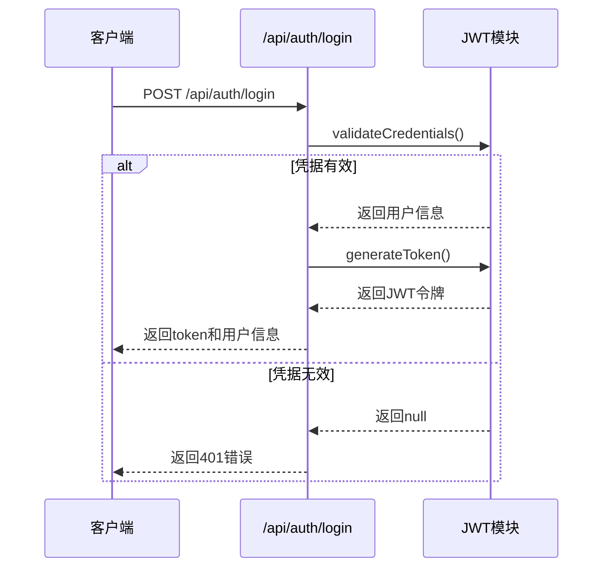
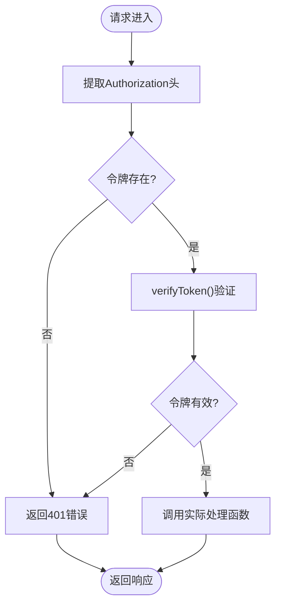

# API接口设计

<cite>
**本文档引用文件**  
- [app/api/items/route.ts](file://app/api/items/route.ts)
- [app/api/items/[id]/route.ts](file://app/api/items/[id]/route.ts)
- [app/api/tags/route.ts](file://app/api/tags/route.ts)
- [app/api/tags/[id]/route.ts](file://app/api/tags/[id]/route.ts)
- [app/api/auth/login/route.ts](file://app/api/auth/login/route.ts)
- [app/api/user/route.ts](file://app/api/user/route.ts)
- [lib/types/item.ts](file://lib/types/item.ts)
- [lib/types/tag.ts](file://lib/types/tag.ts)
- [lib/auth/middleware.ts](file://lib/auth/middleware.ts)
- [lib/db/repository.ts](file://lib/db/repository.ts)
- [lib/db/tag-repository.ts](file://lib/db/tag-repository.ts)
- [lib/db/user-repository.ts](file://lib/db/user-repository.ts)
- [lib/api/client.ts](file://lib/api/client.ts)
- [lib/hooks/use-items.ts](file://lib/hooks/use-items.ts)
- [lib/hooks/use-tags.ts](file://lib/hooks/use-tags.ts)
</cite>

## 目录
1. [简介](#简介)
2. [项目结构](#项目结构)
3. [核心组件](#核心组件)
4. [架构概述](#架构概述)
5. [详细组件分析](#详细组件分析)
6. [依赖分析](#依赖分析)
7. [性能考虑](#性能考虑)
8. [故障排除指南](#故障排除指南)
9. [结论](#结论)

## 简介
本文档详细说明基于Next.js App Router的RESTful API实现机制，重点介绍核心端点的HTTP方法、请求路径、参数格式、响应结构及错误处理策略。涵盖GET /api/items、POST /api/items、PUT /api/items/:id等接口的实现逻辑，解析API路由与前端组件的数据交互模式，包括分页处理、筛选条件传递和状态更新机制。阐述如何通过NextRequest和NextResponse进行请求解析与响应构造，并说明单用户模式下的权限控制逻辑。

## 项目结构

```mermaid
graph TB
subgraph "API路由"
A[/api/items]
B[/api/items/[id]]
C[/api/tags]
D[/api/tags/[id]]
E[/api/auth/login]
F[/api/user]
end
subgraph "数据访问层"
G[repository.ts]
H[tag-repository.ts]
I[user-repository.ts]
end
subgraph "类型定义"
J[item.ts]
K[tag.ts]
end
subgraph "认证"
L[middleware.ts]
M[jwt.ts]
end
subgraph "前端逻辑"
N[client.ts]
O[use-items.ts]
P[use-tags.ts]
end
A --> G
B --> G
C --> H
D --> H
E --> M
F --> I
J --> G
K --> H
L --> A
L --> B
L --> C
D --> L
F --> L
N --> A
N --> B
N --> C
N --> D
O --> N
P --> N
```

**图示来源**
- [app/api/items/route.ts](file://app/api/items/route.ts)
- [app/api/items/[id]/route.ts](file://app/api/items/[id]/route.ts)
- [app/api/tags/route.ts](file://app/api/tags/route.ts)
- [app/api/tags/[id]/route.ts](file://app/api/tags/[id]/route.ts)
- [lib/db/repository.ts](file://lib/db/repository.ts)
- [lib/db/tag-repository.ts](file://lib/db/tag-repository.ts)
- [lib/db/user-repository.ts](file://lib/db/user-repository.ts)
- [lib/types/item.ts](file://lib/types/item.ts)
- [lib/types/tag.ts](file://lib/types/tag.ts)
- [lib/auth/middleware.ts](file://lib/auth/middleware.ts)
- [lib/api/client.ts](file://lib/api/client.ts)
- [lib/hooks/use-items.ts](file://lib/hooks/use-items.ts)
- [lib/hooks/use-tags.ts](file://lib/hooks/use-tags.ts)

**本节来源**
- [app/api/items/route.ts](file://app/api/items/route.ts)
- [app/api/tags/route.ts](file://app/api/tags/route.ts)
- [lib/db/repository.ts](file://lib/db/repository.ts)

## 核心组件

本文档的核心组件包括基于Next.js App Router的API路由处理、JWT认证中间件、数据库访问层和前端API客户端。API路由采用NextRequest和NextResponse进行请求解析与响应构造，通过withAuth中间件实现统一的认证控制。数据访问层封装了对SQLite数据库的CRUD操作，而前端通过use-items和use-tags等自定义Hook与API进行交互。

**本节来源**
- [app/api/items/route.ts](file://app/api/items/route.ts)
- [lib/auth/middleware.ts](file://lib/auth/middleware.ts)
- [lib/db/repository.ts](file://lib/db/repository.ts)
- [lib/api/client.ts](file://lib/api/client.ts)
- [lib/hooks/use-items.ts](file://lib/hooks/use-items.ts)

## 架构概述



**图示来源**
- [lib/hooks/use-items.ts](file://lib/hooks/use-items.ts)
- [lib/api/client.ts](file://lib/api/client.ts)
- [app/api/items/route.ts](file://app/api/items/route.ts)
- [lib/auth/middleware.ts](file://lib/auth/middleware.ts)
- [lib/db/repository.ts](file://lib/db/repository.ts)

## 详细组件分析

### 物品管理API分析

#### GET /api/items - 获取物品列表
该端点用于获取所有物品，支持通过查询参数archived进行筛选（0=未归档，1=已归档）。实现逻辑包括：
- 使用withAuth中间件验证JWT令牌
- 解析URL查询参数
- 构建筛选条件并调用数据库访问层
- 返回标准化的JSON响应



**图示来源**
- [app/api/items/route.ts](file://app/api/items/route.ts#L10-L29)
- [lib/db/repository.ts](file://lib/db/repository.ts#L9-L23)

#### POST /api/items - 创建物品
该端点用于创建新物品，实现逻辑包括：
- 验证必填字段（name, purchased_at, price_cents）
- 验证数据类型和业务规则
- 调用数据库访问层创建记录
- 返回创建的物品信息



**图示来源**
- [app/api/items/route.ts](file://app/api/items/route.ts#L34-L74)
- [lib/db/repository.ts](file://lib/db/repository.ts#L37-L64)

#### PUT /api/items/:id - 更新物品
该端点用于更新指定ID的物品，实现逻辑包括：
- 验证路径参数id的有效性
- 解析请求体，只更新提供的字段
- 调用数据库访问层更新记录
- 处理物品不存在的情况



**图示来源**
- [app/api/items/[id]/route.ts](file://app/api/items/[id]/route.ts#L50-L89)
- [lib/db/repository.ts](file://lib/db/repository.ts#L69-L122)

### 认证机制分析

#### 登录认证流程


**图示来源**
- [app/api/auth/login/route.ts](file://app/api/auth/login/route.ts)
- [lib/auth/jwt.ts](file://lib/auth/jwt.ts)

#### 认证中间件流程


**图示来源**
- [lib/auth/middleware.ts](file://lib/auth/middleware.ts)

**本节来源**
- [app/api/items/route.ts](file://app/api/items/route.ts)
- [app/api/items/[id]/route.ts](file://app/api/items/[id]/route.ts)
- [app/api/auth/login/route.ts](file://app/api/auth/login/route.ts)
- [lib/auth/middleware.ts](file://lib/auth/middleware.ts)
- [lib/db/repository.ts](file://lib/db/repository.ts)

## 依赖分析

```mermaid
classDiagram
class NextRequest {
+headers : Headers
+json() : Promise~any~
+url : string
}
class NextResponse {
+json(data : any, options? : {status : number}) : NextResponse
+status : number
}
class withAuth {
+handler : Function
+request : NextRequest
+user : AuthPayload
+context : any
}
class ItemRepository {
+getAllItems(filter : ItemFilter) : Item[]
+getItemById(id : number) : Item | undefined
+createItem(data : CreateItemDTO) : Item
+updateItem(id : number, data : UpdateItemDTO) : Item | null
+deleteItem(id : number) : boolean
}
class TagRepository {
+getAllTags() : Tag[]
+getTagById(id : number) : Tag | null
+createTag(data : CreateTagDTO) : Tag
+updateTag(id : number, data : UpdateTagDTO) : Tag
+deleteTag(id : number) : void
}
class UserRepository {
+getCurrentUser() : User | null
+updateUsername(username : string) : User
+updatePassword(password : string) : User
+verifyPassword(password : string) : boolean
}
class APIClient {
+request(url : string, options : RequestInit) : Promise~any~
+setAuthToken(token : string | null) : void
+getAuthToken() : string | null
}
class UseItems {
+getAllItems(filter? : ItemFilter) : Promise~Item[]~
+getItemById(id : number) : Promise~Item | null~
+createItem(data : CreateItemDTO) : Promise~Item~
+updateItem(id : number, data : UpdateItemDTO) : Promise~Item~
+deleteItem(id : number) : Promise~void~
}
NextRequest <|-- withAuth : "作为参数"
NextResponse <|-- withAuth : "作为返回值"
withAuth <|-- ItemAPI : "用于保护路由"
withAuth <|-- TagAPI : "用于保护路由"
withAuth <|-- UserAPI : "用于保护路由"
ItemRepository <|-- ItemAPI : "数据访问"
TagRepository <|-- TagAPI : "数据访问"
UserRepository <|-- UserAPI : "数据访问"
APIClient <|-- UseItems : "HTTP请求"
APIClient <|-- UseTags : "HTTP请求"
UseItems <|-- Frontend : "数据获取"
UseTags <|-- Frontend : "数据获取"
class ItemAPI {
+GET /api/items
+POST /api/items
+GET /api/items/ : id
+PUT /api/items/ : id
+DELETE /api/items/ : id
}
class TagAPI {
+GET /api/tags
+POST /api/tags
+GET /api/tags/ : id
+PUT /api/tags/ : id
+DELETE /api/tags/ : id
}
class UserAPI {
+GET /api/user
+PUT /api/user
}
```

**图示来源**
- [app/api/items/route.ts](file://app/api/items/route.ts)
- [app/api/tags/route.ts](file://app/api/tags/route.ts)
- [app/api/user/route.ts](file://app/api/user/route.ts)
- [lib/db/repository.ts](file://lib/db/repository.ts)
- [lib/db/tag-repository.ts](file://lib/db/tag-repository.ts)
- [lib/db/user-repository.ts](file://lib/db/user-repository.ts)
- [lib/api/client.ts](file://lib/api/client.ts)
- [lib/hooks/use-items.ts](file://lib/hooks/use-items.ts)
- [lib/hooks/use-tags.ts](file://lib/hooks/use-tags.ts)

**本节来源**
- [lib/db/repository.ts](file://lib/db/repository.ts)
- [lib/db/tag-repository.ts](file://lib/db/tag-repository.ts)
- [lib/db/user-repository.ts](file://lib/db/user-repository.ts)
- [lib/api/client.ts](file://lib/api/client.ts)

## 性能考虑
API实现中采用了多项性能优化策略：
- 数据库查询使用参数化SQL防止SQL注入
- 所有物品查询按创建时间倒序排列，确保最新物品优先显示
- 使用事务处理批量操作，确保数据一致性
- 响应数据标准化，包含success标志和data/error字段
- 错误处理包含详细的日志记录，便于调试

## 故障排除指南

### 常见问题及解决方案

| 问题现象 | 可能原因 | 解决方案 |
|---------|--------|--------|
| 401 Unauthorized | JWT令牌缺失或无效 | 检查Authorization头格式，确保为"Bearer {token}" |
| 400 Bad Request | 请求参数格式错误 | 验证请求体JSON格式和必填字段 |
| 500 Internal Server Error | 服务器内部错误 | 检查服务端日志，确认数据库连接状态 |
| CORS错误 | 跨域请求被阻止 | 确保前端和后端域名匹配，或配置CORS中间件 |
| JSON解析异常 | 请求体非有效JSON | 使用try-catch包装request.json()调用 |

### 错误处理策略
API采用统一的错误响应格式：
```json
{
  "success": false,
  "error": "错误描述信息"
}
```
状态码使用标准HTTP状态码：
- 400 Bad Request：客户端请求错误
- 401 Unauthorized：认证失败
- 404 Not Found：资源不存在
- 409 Conflict：资源冲突（如唯一约束）
- 500 Internal Server Error：服务器内部错误

**本节来源**
- [app/api/items/route.ts](file://app/api/items/route.ts)
- [app/api/items/[id]/route.ts](file://app/api/items/[id]/route.ts)
- [app/api/tags/route.ts](file://app/api/tags/route.ts)
- [app/api/tags/[id]/route.ts](file://app/api/tags/[id]/route.ts)
- [app/api/auth/login/route.ts](file://app/api/auth/login/route.ts)

## 结论
本文档详细介绍了基于Next.js App Router的RESTful API设计与实现。系统采用分层架构，包括API路由、认证中间件、数据访问层和前端客户端。通过JWT实现安全的认证机制，使用TypeScript接口定义确保类型安全。API设计遵循RESTful原则，提供清晰的端点语义和标准化的响应格式。错误处理机制完善，便于前端进行用户友好的错误提示。整体架构清晰，易于维护和扩展。