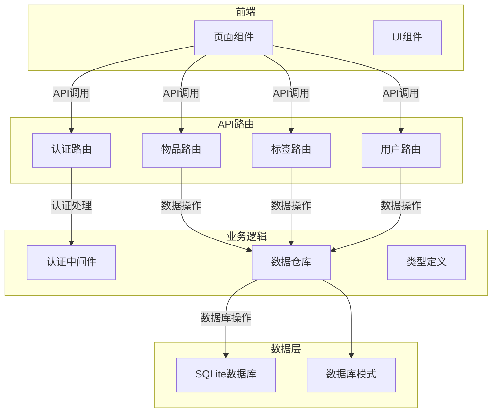
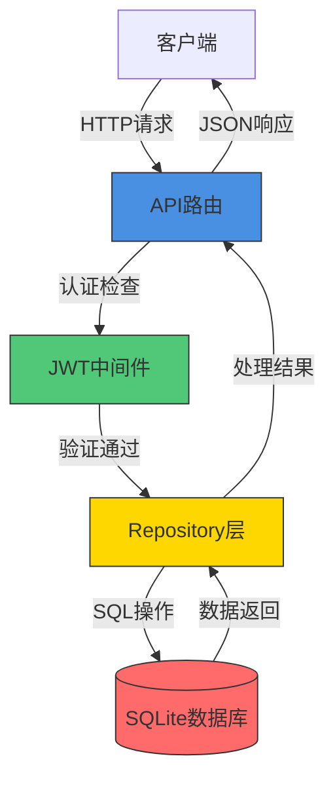
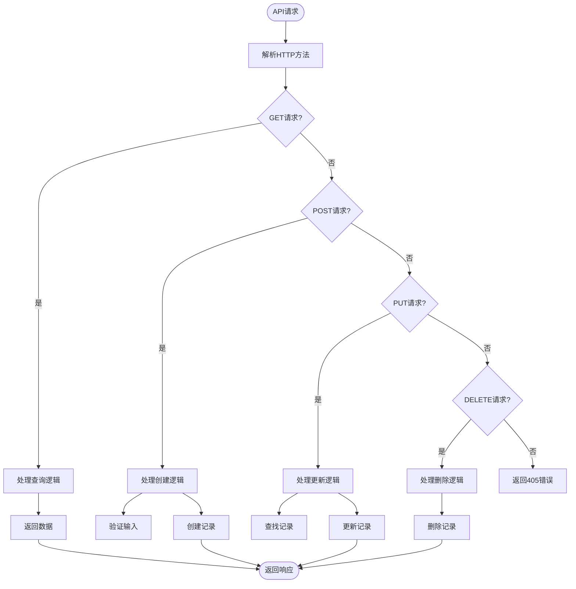
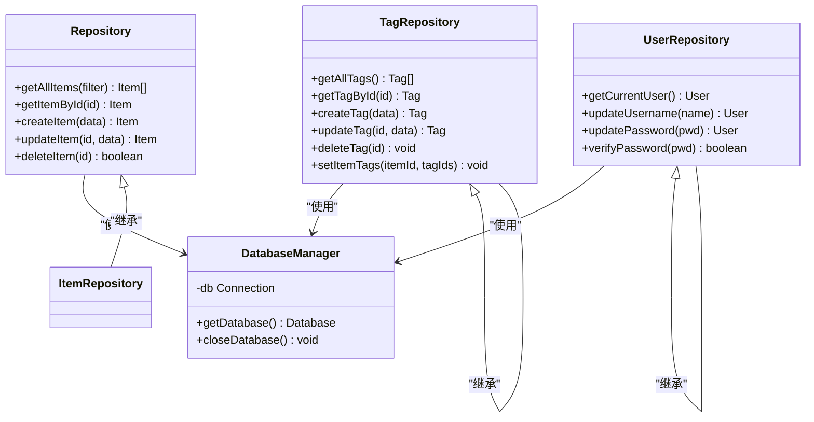
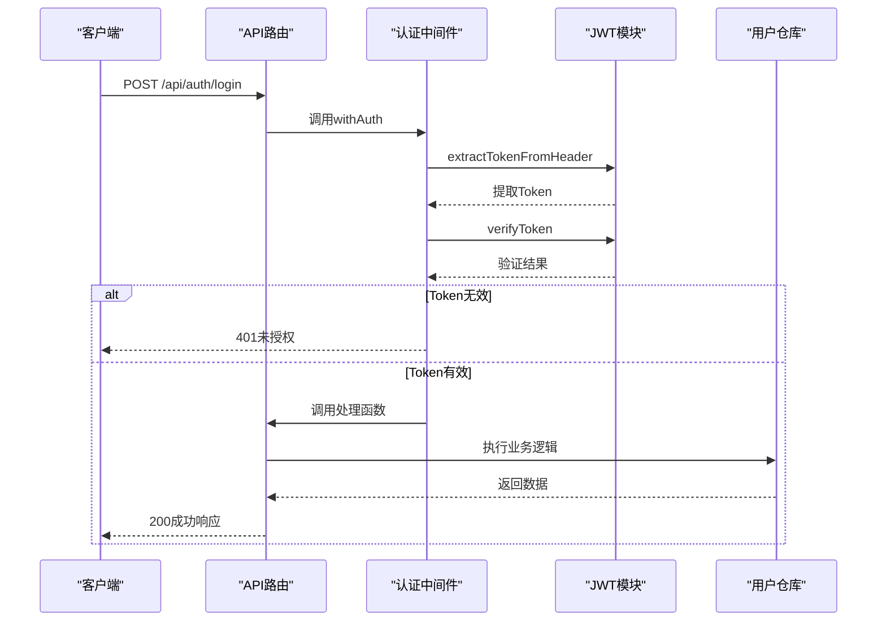
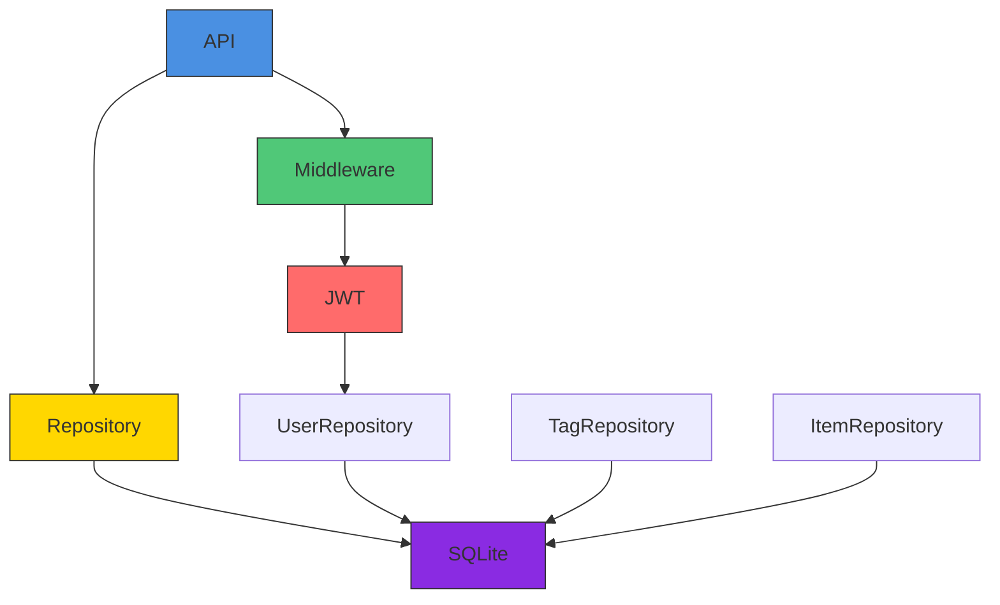

# 后端架构

<cite>
**本文档引用的文件**   
- [route.ts](file://app/api/auth/login/route.ts)
- [route.ts](file://app/api/items/route.ts)
- [route.ts](file://app/api/tags/route.ts)
- [route.ts](file://app/api/user/route.ts)
- [repository.ts](file://lib/db/repository.ts)
- [tag-repository.ts](file://lib/db/tag-repository.ts)
- [user-repository.ts](file://lib/db/user-repository.ts)
- [sqlite.ts](file://lib/db/sqlite.ts)
- [jwt.ts](file://lib/auth/jwt.ts)
- [middleware.ts](file://lib/auth/middleware.ts)
- [item.ts](file://lib/types/item.ts)
- [tag.ts](file://lib/types/tag.ts)
</cite>

## 目录
1. [简介](#简介)
2. [项目结构](#项目结构)
3. [核心组件](#核心组件)
4. [架构概览](#架构概览)
5. [详细组件分析](#详细组件分析)
6. [依赖分析](#依赖分析)
7. [性能考虑](#性能考虑)
8. [故障排除指南](#故障排除指南)
9. [结论](#结论)

## 简介
本后端架构文档详细说明了基于Next.js的应用程序如何实现RESTful API接口、数据模型与数据库操作以及用户身份验证机制。系统采用Repository模式封装数据库访问逻辑，使用JWT实现安全的用户认证流程，并通过中间件确保API的安全性。文档重点描述从HTTP请求到数据库操作再到响应返回的完整调用链路，帮助开发者理解服务端处理机制和安全控制策略。

## 项目结构
项目采用标准的Next.js App Router架构，将API路由、组件、业务逻辑和数据访问层清晰分离。API端点位于`app/api`目录下，每个资源都有独立的路由文件。业务逻辑和数据访问封装在`lib`目录中，包括认证、数据库操作和类型定义等核心功能模块。

**Diagram sources**
- [app/api](file://app/api)
- [lib](file://lib)

**Section sources**
- [app](file://app)
- [lib](file://lib)

## 核心组件
系统的核心组件包括API路由处理器、Repository数据访问层、JWT认证模块和SQLite数据库连接管理。API路由使用Next.js的App Router特性实现RESTful接口，Repository模式封装了所有数据库操作，JWT用于生成和验证用户令牌，而SQLite提供轻量级的本地数据存储。

**Section sources**
- [route.ts](file://app/api/items/route.ts)
- [repository.ts](file://lib/db/repository.ts)
- [jwt.ts](file://lib/auth/jwt.ts)
- [sqlite.ts](file://lib/db/sqlite.ts)

## 架构概览
系统采用分层架构设计，从前端页面到数据库形成清晰的数据流动路径。API路由作为入口点接收HTTP请求，经过认证中间件验证后，调用相应的Repository方法进行数据处理，最终将结果返回给客户端。

**Diagram sources**
- [middleware.ts](file://lib/auth/middleware.ts)
- [repository.ts](file://lib/db/repository.ts)
- [sqlite.ts](file://lib/db/sqlite.ts)

**Section sources**
- [app/api](file://app/api)
- [lib/auth/middleware.ts](file://lib/auth/middleware.ts)
- [lib/db](file://lib/db)

## 详细组件分析

### API接口设计
系统使用Next.js App Router实现RESTful API设计，每个资源对应独立的路由文件，支持标准的HTTP方法（GET、POST、PUT、DELETE）。

#### API路由实现

**Diagram sources**
- [route.ts](file://app/api/items/route.ts)
- [route.ts](file://app/api/tags/route.ts)

**Section sources**
- [app/api/items/route.ts](file://app/api/items/route.ts)
- [app/api/tags/route.ts](file://app/api/tags/route.ts)

### 数据模型与数据库操作
系统采用Repository模式封装数据库访问逻辑，将数据访问细节与业务逻辑分离，提高代码的可维护性和可测试性。

#### Repository模式实现

**Diagram sources**
- [repository.ts](file://lib/db/repository.ts)
- [tag-repository.ts](file://lib/db/tag-repository.ts)
- [user-repository.ts](file://lib/db/user-repository.ts)
- [sqlite.ts](file://lib/db/sqlite.ts)

**Section sources**
- [lib/db/repository.ts](file://lib/db/repository.ts)
- [lib/db/tag-repository.ts](file://lib/db/tag-repository.ts)
- [lib/db/user-repository.ts](file://lib/db/user-repository.ts)

### 认证流程
系统使用JWT实现用户身份验证，通过中间件模式确保API端点的安全访问。

#### JWT认证流程

**Diagram sources**
- [jwt.ts](file://lib/auth/jwt.ts)
- [middleware.ts](file://lib/auth/middleware.ts)
- [user-repository.ts](file://lib/db/user-repository.ts)

**Section sources**
- [lib/auth/jwt.ts](file://lib/auth/jwt.ts)
- [lib/auth/middleware.ts](file://lib/auth/middleware.ts)

## 依赖分析
系统各组件之间存在明确的依赖关系，形成了清晰的调用链路。

**Diagram sources**
- [package.json](file://package.json)
- [lib](file://lib)

**Section sources**
- [lib/auth](file://lib/auth)
- [lib/db](file://lib/db)

## 性能考虑
系统在性能方面进行了多项优化，包括数据库连接管理、索引创建和查询优化。

- **数据库连接池**：使用单例模式管理数据库连接，避免重复创建开销
- **WAL模式**：启用SQLite的WAL模式提高并发性能
- **索引优化**：为常用查询字段创建索引，如user_id、archived等
- **预编译语句**：使用预编译SQL语句提高执行效率
- **事务处理**：对批量操作使用事务确保原子性

**Section sources**
- [sqlite.ts](file://lib/db/sqlite.ts)
- [repository.ts](file://lib/db/repository.ts)

## 故障排除指南
常见问题及解决方案：

- **数据库连接失败**：检查data目录是否存在，确保有写入权限
- **认证失败**：验证Authorization头格式是否为"Bearer <token>"
- **唯一约束冲突**：检查用户名或标签名称是否已存在
- **参数验证错误**：确保必填字段完整且数据类型正确
- **记录未找到**：验证ID是否存在且属于当前用户

**Section sources**
- [middleware.ts](file://lib/auth/middleware.ts)
- [repository.ts](file://lib/db/repository.ts)
- [user-repository.ts](file://lib/db/user-repository.ts)

## 结论
本系统采用现代化的分层架构设计，通过Next.js App Router实现RESTful API，使用Repository模式封装数据访问逻辑，并基于JWT实现安全的用户认证。架构具有良好的可维护性、可扩展性和安全性，适合中小型应用开发。建议在生产环境中使用环境变量管理JWT密钥，并考虑增加更多的监控和日志功能。