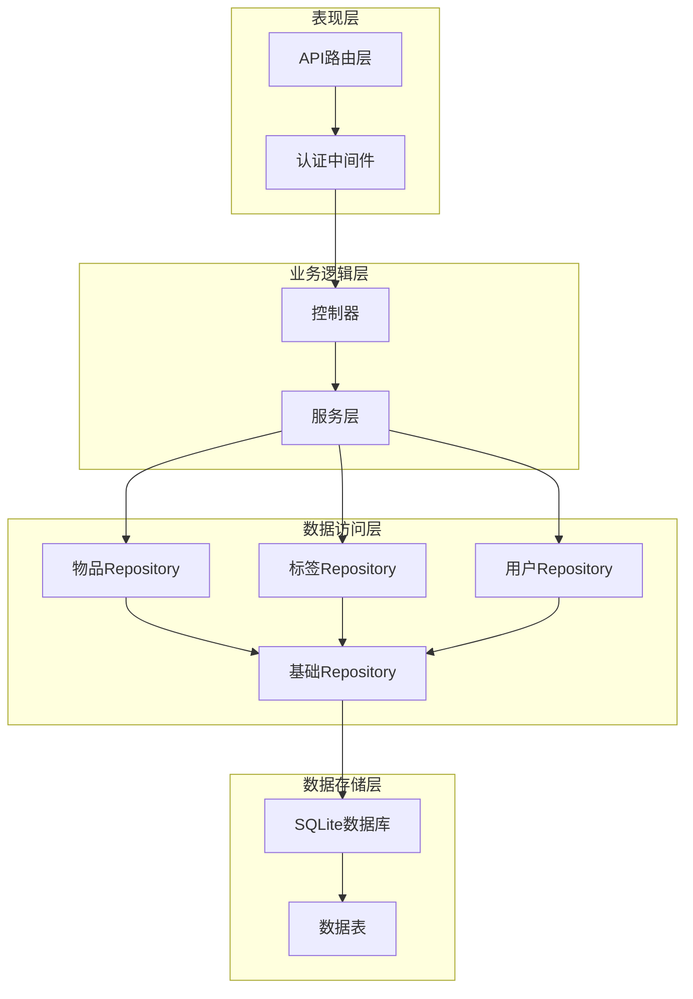
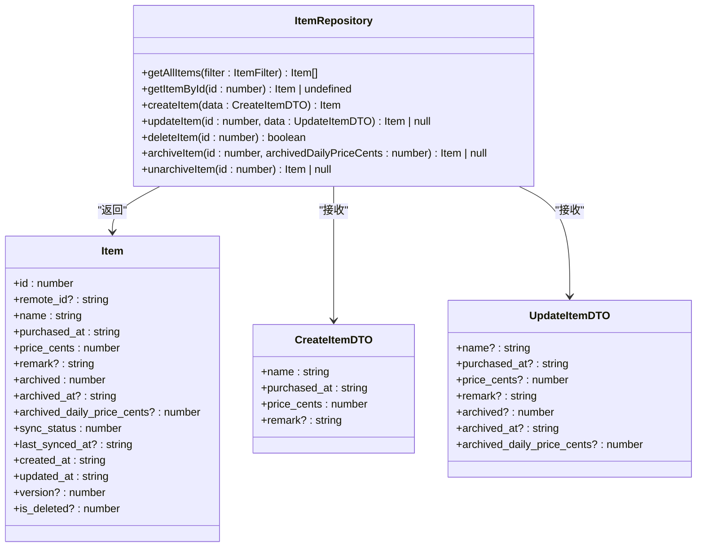
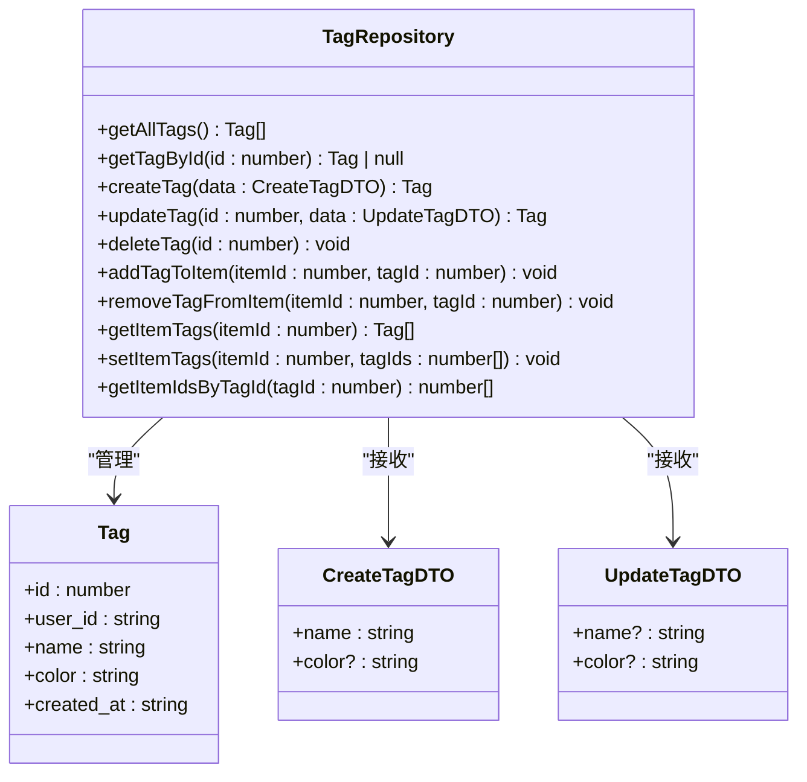
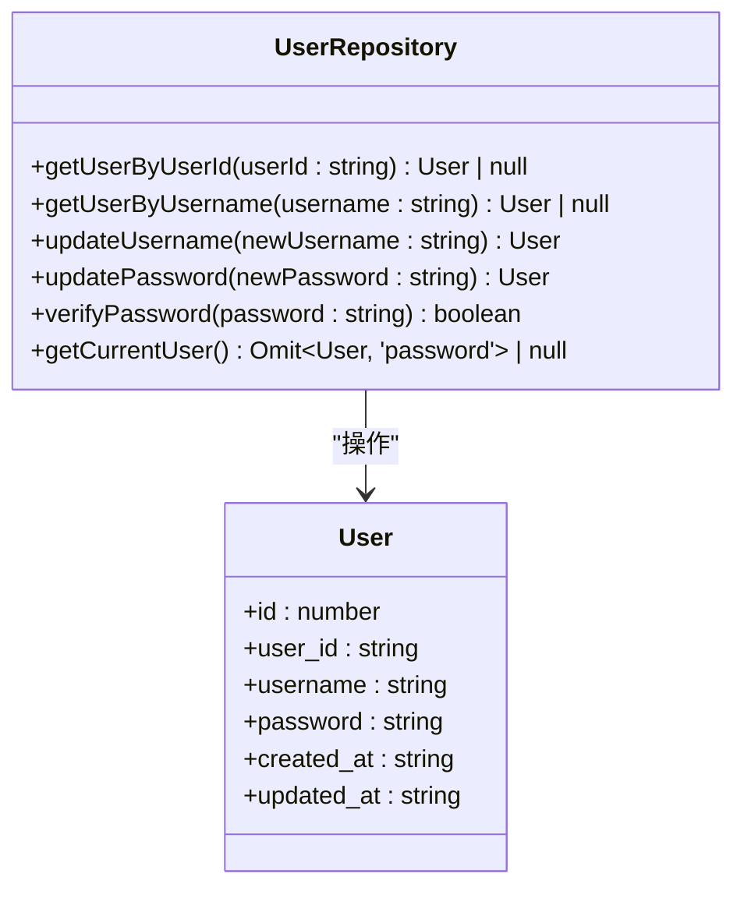
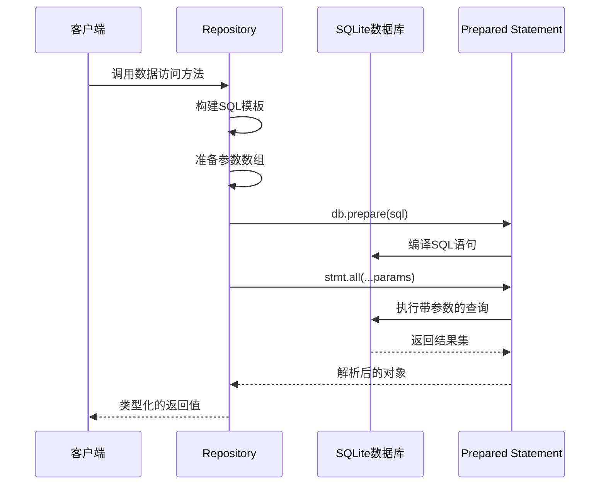
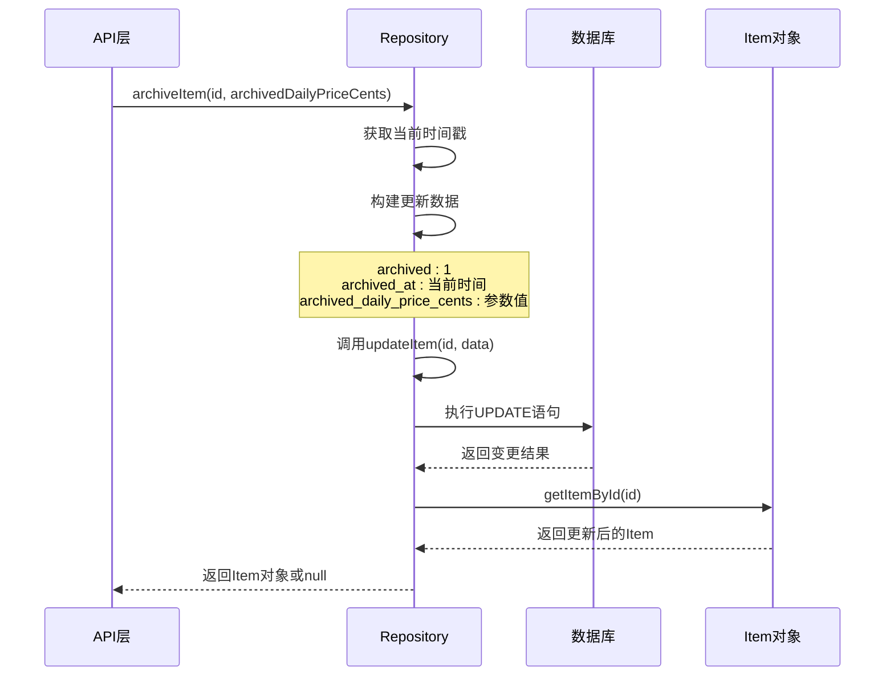
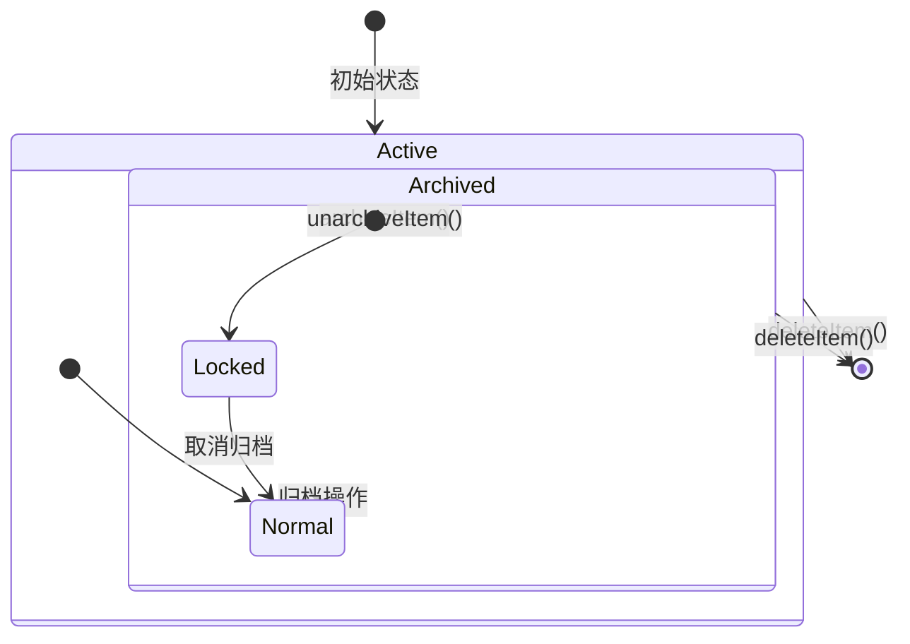
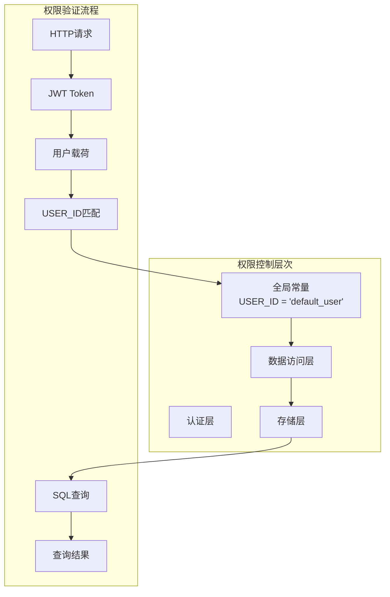
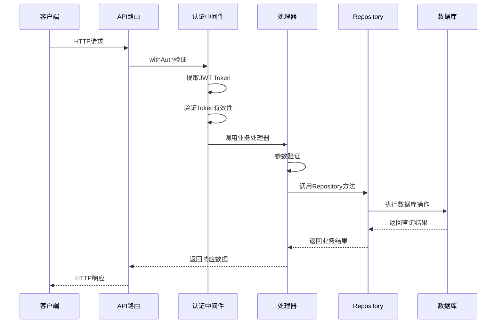
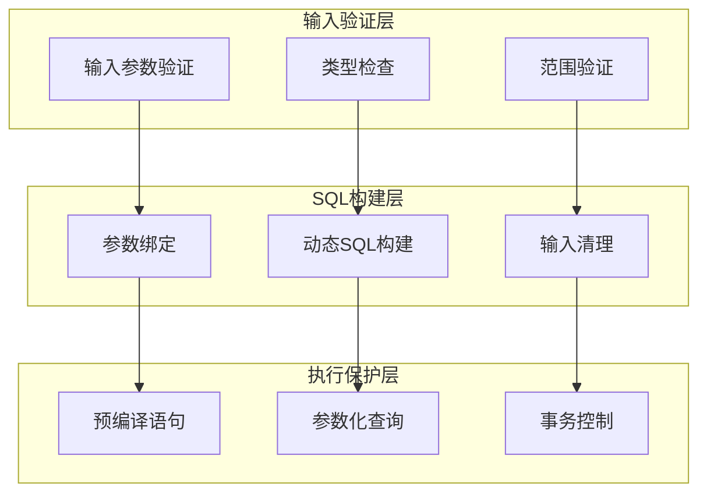

# Repository模式实现

<cite>
**本文档引用的文件**
- [repository.ts](file://lib/db/repository.ts)
- [sqlite.ts](file://lib/db/sqlite.ts)
- [item.ts](file://lib/types/item.ts)
- [tag.ts](file://lib/types/tag.ts)
- [tag-repository.ts](file://lib/db/tag-repository.ts)
- [user-repository.ts](file://lib/db/user-repository.ts)
- [route.ts](file://app/api/items/route.ts)
- [route.ts](file://app/api/items/[id]/route.ts)
- [middleware.ts](file://lib/auth/middleware.ts)
- [jwt.ts](file://lib/auth/jwt.ts)
</cite>

## 目录
1. [项目概述](#项目概述)
2. [Repository模式架构](#repository模式架构)
3. [核心数据访问组件](#核心数据访问组件)
4. [SQL构造与参数绑定机制](#sql构造与参数绑定机制)
5. [动态UPDATE语句拼接策略](#动态update语句拼接策略)
6. [归档状态处理流程](#归档状态处理流程)
7. [单用户模式权限控制](#单用户模式权限控制)
8. [方法返回值设计规范](#方法返回值设计规范)
9. [API接口层集成](#api接口层集成)
10. [安全性与防注入设计](#安全性与防注入设计)
11. [总结](#总结)

## 项目概述

本项目采用Repository模式实现数据访问层，为记账应用提供统一的数据操作接口。系统基于SQLite数据库，支持物品管理、标签管理和用户管理三大核心功能模块，采用单用户模式设计，通过全局常量USER_ID='default_user'实现权限隔离。

### 技术栈特点
- **数据库**: SQLite + better-sqlite3
- **架构模式**: Repository模式
- **认证机制**: JWT Token认证
- **数据类型**: TypeScript强类型定义
- **API设计**: RESTful风格

## Repository模式架构



**图表来源**
- [repository.ts](file://lib/db/repository.ts#L1-L156)
- [tag-repository.ts](file://lib/db/tag-repository.ts#L1-L191)
- [user-repository.ts](file://lib/db/user-repository.ts#L1-L107)

**章节来源**
- [repository.ts](file://lib/db/repository.ts#L1-L156)
- [sqlite.ts](file://lib/db/sqlite.ts#L1-L109)

## 核心数据访问组件

### 物品Repository组件

物品Repository是系统的核心数据访问组件，提供了完整的CRUD操作和业务特定方法。



**图表来源**
- [repository.ts](file://lib/db/repository.ts#L1-L156)
- [item.ts](file://lib/types/item.ts#L1-L94)

### 标签Repository组件

标签Repository负责标签的生命周期管理，包括标签创建、更新、删除以及与物品的关联管理。



**图表来源**
- [tag-repository.ts](file://lib/db/tag-repository.ts#L1-L191)
- [tag.ts](file://lib/types/tag.ts#L1-L59)

### 用户Repository组件

用户Repository提供用户信息管理功能，支持用户名修改、密码更新和认证验证。



**图表来源**
- [user-repository.ts](file://lib/db/user-repository.ts#L1-L107)

**章节来源**
- [repository.ts](file://lib/db/repository.ts#L1-L156)
- [tag-repository.ts](file://lib/db/tag-repository.ts#L1-L191)
- [user-repository.ts](file://lib/db/user-repository.ts#L1-L107)

## SQL构造与参数绑定机制

### 参数化查询设计

系统采用严格的参数化查询机制，通过数组形式传递参数，确保SQL注入防护。

#### 基础查询模式



**图表来源**
- [repository.ts](file://lib/db/repository.ts#L9-L22)
- [sqlite.ts](file://lib/db/sqlite.ts#L17-L24)

#### 动态参数构建策略

系统实现了智能的参数构建策略，根据传入的数据动态调整SQL语句结构：

| 方法 | 参数类型 | 绑定方式 | 安全级别 |
|------|----------|----------|----------|
| `getAllItems()` | `(string \| number)[]` | 数组展开 | 高 |
| `getItemById()` | `number, string` | 位置绑定 | 高 |
| `createItem()` | 固定参数 | 顺序绑定 | 高 |
| `updateItem()` | 动态数组 | 条件绑定 | 高 |

**章节来源**
- [repository.ts](file://lib/db/repository.ts#L9-L22)
- [repository.ts](file://lib/db/repository.ts#L37-L63)
- [repository.ts](file://lib/db/repository.ts#L69-L121)

## 动态UPDATE语句拼接策略

### UPDATE语句构建流程

系统实现了灵活的动态UPDATE语句构建机制，支持部分字段更新和条件拼接。

```mermaid
flowchart TD
Start([开始更新操作]) --> InitFields["初始化字段数组<br/>fields: []"]
InitFields --> InitValues["初始化值数组<br/>values: []"]
InitValues --> CheckName{"检查name字段<br/>data.name !== undefined"}
CheckName --> |是| AddName["添加name字段<br/>fields.push('name = ?')<br/>values.push(data.name)"]
CheckName --> |否| CheckPurchasedAt{"检查purchased_at字段"}
AddName --> CheckPurchasedAt
CheckPurchasedAt --> |是| AddPurchasedAt["添加purchased_at字段<br/>fields.push('purchased_at = ?')<br/>values.push(data.purchased_at)"]
CheckPurchasedAt --> |否| CheckPrice{"检查price_cents字段"}
AddPurchasedAt --> CheckPrice
CheckPrice --> |是| AddPrice["添加price_cents字段<br/>fields.push('price_cents = ?')<br/>values.push(data.price_cents)"]
CheckPrice --> |否| CheckRemark{"检查remark字段"}
AddPrice --> CheckRemark
CheckRemark --> |是| AddRemark["添加remark字段<br/>fields.push('remark = ?')<br/>values.push(data.remark)"]
CheckRemark --> |否| CheckArchived{"检查archived字段"}
AddRemark --> CheckArchived
CheckArchived --> |是| AddArchived["添加archived字段<br/>fields.push('archived = ?')<br/>values.push(data.archived)"]
CheckArchived --> |否| CheckArchivedAt{"检查archived_at字段"}
AddArchived --> CheckArchivedAt
CheckArchivedAt --> |是| AddArchivedAt["添加archived_at字段<br/>fields.push('archived_at = ?')<br/>values.push(data.archived_at)"]
CheckArchivedAt --> |否| CheckArchivedDaily{"检查archived_daily_price_cents字段"}
AddArchivedAt --> CheckArchivedDaily
CheckArchivedDaily --> |是| AddArchivedDaily["添加archived_daily_price_cents字段<br/>fields.push('archived_daily_price_cents = ?')<br/>values.push(data.archived_daily_price_cents)"]
CheckArchivedDaily --> |否| AddUpdatedAt["添加updated_at字段<br/>always update"]}
AddArchivedDaily --> AddUpdatedAt
AddUpdatedAt --> AddWhere["添加WHERE条件<br/>values.push(id, USER_ID)"]
AddWhere --> BuildSQL["构建最终SQL<br/>UPDATE items SET ${fields.join(', ')} WHERE id = ? AND user_id = ?"]
BuildSQL --> Execute["执行SQL语句<br/>stmt.run(...values)"]
Execute --> CheckChanges{"检查变更记录数<br/>result.changes > 0"}
CheckChanges --> |是| GetUpdatedItem["获取更新后的记录<br/>getItemById(id)"]
CheckChanges --> |否| ReturnNull["返回null<br/>表示未找到记录"]
GetUpdatedItem --> ReturnItem["返回Item对象"]
ReturnNull --> End([结束])
ReturnItem --> End
```

**图表来源**
- [repository.ts](file://lib/db/repository.ts#L69-L121)

### 字段更新策略

系统采用智能的字段更新策略，只更新被修改的字段：

| 字段类型 | 更新条件 | 默认值处理 | 级联更新 |
|----------|----------|------------|----------|
| 基础字段 | `data.field !== undefined` | 保持原值 | 否 |
| 时间戳字段 | 总是更新 | 当前时间 | 是 |
| 状态字段 | `data.archived !== undefined` | 保持原值 | 是 |
| 可选字段 | `data.remark !== undefined` | 空字符串 | 否 |

**章节来源**
- [repository.ts](file://lib/db/repository.ts#L74-L112)

## 归档状态处理流程

### 归档操作序列图



**图表来源**
- [repository.ts](file://lib/db/repository.ts#L137-L143)
- [repository.ts](file://lib/db/repository.ts#L149-L155)

### 归档状态转换

系统实现了完整的归档状态管理：



**图表来源**
- [repository.ts](file://lib/db/repository.ts#L137-L155)

**章节来源**
- [repository.ts](file://lib/db/repository.ts#L137-L155)

## 单用户模式权限控制

### USER_ID全局常量设计

系统采用单用户模式，通过全局常量USER_ID='default_user'实现权限隔离：



**图表来源**
- [repository.ts](file://lib/db/repository.ts#L4)
- [tag-repository.ts](file://lib/db/tag-repository.ts#L8)
- [user-repository.ts](file://lib/db/user-repository.ts#L16)

### 权限控制实现

| 组件 | 权限验证方式 | 数据隔离机制 | 访问控制 |
|------|--------------|--------------|----------|
| 物品Repository | `user_id = USER_ID` | WHERE子句过滤 | 自动添加 |
| 标签Repository | `user_id = USER_ID` | WHERE子句过滤 | 自动添加 |
| 用户Repository | `user_id = USER_ID` | WHERE子句过滤 | 自动添加 |
| API中间件 | JWT Token验证 | 用户身份确认 | 请求级控制 |

**章节来源**
- [repository.ts](file://lib/db/repository.ts#L4)
- [tag-repository.ts](file://lib/db/tag-repository.ts#L8)
- [user-repository.ts](file://lib/db/user-repository.ts#L16)
- [middleware.ts](file://lib/auth/middleware.ts#L1-L34)

## 方法返回值设计规范

### 返回值类型设计原则

系统采用明确的返回值设计，为调用方提供清晰的错误处理指导：

```mermaid
classDiagram
class GetAllItems {
+call(filter? : ItemFilter) Item[]
+return Item[] : "成功时返回所有匹配记录"
}
class GetItemById {
+call(id : number) Item | undefined
+return Item | undefined : "成功时返回Item，失败时返回undefined"
}
class CreateItem {
+call(data : CreateItemDTO) Item
+return Item : "总是返回新创建的Item对象"
+throws Error : "创建失败时抛出异常"
}
class UpdateItem {
+call(id : number, data : UpdateItemDTO) Item | null
+return Item | null : "成功时返回更新后的Item，失败时返回null"
}
class DeleteItem {
+call(id : number) boolean
+return boolean : "删除成功返回true，失败返回false"
}
class ArchiveItem {
+call(id : number, archivedDailyPriceCents : number) Item | null
+return Item | null : "成功时返回Item，失败时返回null"
}
GetAllItems --> Item[] : "返回"
GetItemById --> Item | undefined : "返回"
CreateItem --> Item : "返回"
UpdateItem --> Item | null : "返回"
DeleteItem --> boolean : "返回"
ArchiveItem --> Item | null : "返回"
```

**图表来源**
- [repository.ts](file://lib/db/repository.ts#L9-L22)
- [repository.ts](file://lib/db/repository.ts#L28-L31)
- [repository.ts](file://lib/db/repository.ts#L37-L63)
- [repository.ts](file://lib/db/repository.ts#L69-L121)
- [repository.ts](file://lib/db/repository.ts#L127-L131)
- [repository.ts](file://lib/db/repository.ts#L137-L143)

### 错误处理影响分析

不同返回值类型对调用方的影响：

| 方法 | 成功返回值 | 失败返回值 | 调用方处理建议 |
|------|------------|------------|----------------|
| `getAllItems()` | `Item[]` | 正常 | 直接使用数组方法 |
| `getItemById()` | `Item` | `undefined` | 检查是否为undefined |
| `createItem()` | `Item` | 抛出异常 | try-catch捕获 |
| `updateItem()` | `Item` | `null` | 检查是否为null |
| `deleteItem()` | `boolean` | `boolean` | 检查返回值 |
| `archiveItem()` | `Item` | `null` | 检查是否为null |

**章节来源**
- [repository.ts](file://lib/db/repository.ts#L9-L22)
- [repository.ts](file://lib/db/repository.ts#L28-L31)
- [repository.ts](file://lib/db/repository.ts#L37-L63)
- [repository.ts](file://lib/db/repository.ts#L69-L121)
- [repository.ts](file://lib/db/repository.ts#L127-L131)
- [repository.ts](file://lib/db/repository.ts#L137-L143)

## API接口层集成

### RESTful API设计

系统采用RESTful API设计，与Repository层紧密集成：



**图表来源**
- [route.ts](file://app/api/items/route.ts#L1-L75)
- [route.ts](file://app/api/items/[id]/route.ts#L1-L134)
- [middleware.ts](file://lib/auth/middleware.ts#L8-L32)

### API响应格式标准化

| HTTP方法 | 端点 | 成功响应 | 错误响应 | 状态码 |
|----------|------|----------|----------|--------|
| GET | `/api/items` | `{success: true, data: Item[]}` | `{error: string}` | 200/500 |
| POST | `/api/items` | `{success: true, data: Item}` | `{error: string}` | 201/400/500 |
| GET | `/api/items/:id` | `{success: true, data: Item}` | `{error: string}` | 200/404/500 |
| PUT | `/api/items/:id` | `{success: true, data: Item}` | `{error: string}` | 200/404/500 |
| DELETE | `/api/items/:id` | `{success: true, message: string}` | `{error: string}` | 200/404/500 |

**章节来源**
- [route.ts](file://app/api/items/route.ts#L1-L75)
- [route.ts](file://app/api/items/[id]/route.ts#L1-L134)

## 安全性与防注入设计

### SQL注入防护机制

系统采用多层安全防护机制：



**图表来源**
- [repository.ts](file://lib/db/repository.ts#L9-L22)
- [repository.ts](file://lib/db/repository.ts#L37-L63)
- [repository.ts](file://lib/db/repository.ts#L69-L121)

### 安全特性对比

| 安全层面 | 实现方式 | 防护效果 | 性能影响 |
|----------|----------|----------|----------|
| 输入验证 | TypeScript类型系统 | 编译时类型检查 | 无 |
| 参数绑定 | 数组参数传递 | 防止SQL注入 | 轻微 |
| 预编译语句 | better-sqlite3 | 语法级防护 | 中等 |
| 事务控制 | 自动事务管理 | 数据一致性 | 中等 |
| 权限隔离 | USER_ID过滤 | 数据访问控制 | 无 |

**章节来源**
- [repository.ts](file://lib/db/repository.ts#L9-L22)
- [repository.ts](file://lib/db/repository.ts#L37-L63)
- [repository.ts](file://lib/db/repository.ts#L69-L121)
- [sqlite.ts](file://lib/db/sqlite.ts#L17-L24)

## 总结

本项目通过Repository模式实现了完整的数据访问层解决方案，具有以下核心优势：

### 架构优势
- **清晰的分层设计**: Repository层与业务层分离，职责明确
- **统一的接口规范**: 所有数据操作遵循一致的方法签名
- **类型安全保障**: TypeScript强类型定义确保编译时错误检测

### 功能特性
- **灵活的CRUD操作**: 支持完整的数据生命周期管理
- **智能的动态SQL**: 根据业务需求动态构建查询语句
- **完善的归档机制**: 支持物品的归档和取消归档操作
- **单用户权限控制**: 通过全局常量实现简单而有效的权限隔离

### 安全保障
- **参数化查询**: 严格防止SQL注入攻击
- **类型安全**: 编译时类型检查减少运行时错误
- **权限验证**: JWT认证结合USER_ID过滤双重保护

### 性能优化
- **预编译语句**: 提高查询执行效率
- **索引优化**: 数据库层面的性能调优
- **事务管理**: 确保数据操作的一致性和完整性

该Repository模式实现为记账应用提供了稳定、安全、高效的数据访问能力，为后续的功能扩展奠定了坚实的基础。