# 标签管理Repository实现

<cite>
**本文档中引用的文件**
- [tag-repository.ts](file://lib/db/tag-repository.ts)
- [sqlite.ts](file://lib/db/sqlite.ts)
- [tag.ts](file://lib/types/tag.ts)
- [route.ts](file://app/api/tags/route.ts)
- [route.ts](file://app/api/tags/[id]/route.ts)
- [route.ts](file://app/api/items/[id]/tags/route.ts)
- [index.ts](file://lib/types/index.ts)
</cite>

## 目录
1. [项目概述](#项目概述)
2. [系统架构](#系统架构)
3. [核心组件分析](#核心组件分析)
4. [标签CRUD操作详解](#标签crud操作详解)
5. [多对多关系管理](#多对多关系管理)
6. [数据隔离机制](#数据隔离机制)
7. [事务处理与原子性](#事务处理与原子性)
8. [错误处理策略](#错误处理策略)
9. [业务场景应用](#业务场景应用)
10. [性能优化考虑](#性能优化考虑)

## 项目概述

标签管理系统是一个基于SQLite数据库的轻量级财务管理应用的核心功能模块，负责管理用户的标签数据及其与物品的多对多关联关系。该系统采用Repository模式，提供了完整的标签生命周期管理功能，包括创建、查询、更新、删除以及复杂的关联关系维护。

### 主要特性

- **数据隔离**：通过USER_ID实现多租户数据隔离
- **事务保证**：使用数据库事务确保操作的原子性
- **级联删除**：自动清理关联数据防止外键约束冲突
- **容错处理**：对唯一约束冲突进行优雅处理
- **类型安全**：完整的TypeScript类型定义

## 系统架构

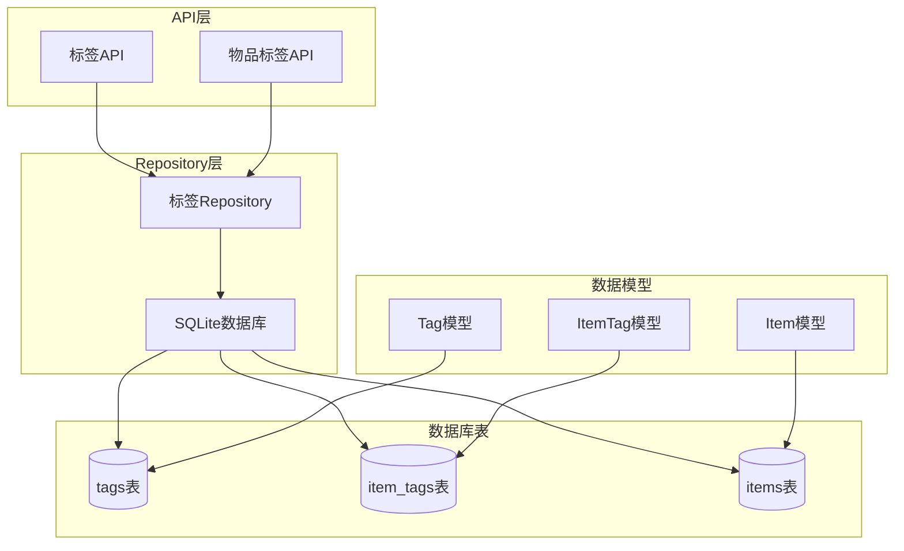

**图表来源**
- [tag-repository.ts](file://lib/db/tag-repository.ts#L1-L191)
- [sqlite.ts](file://lib/db/sqlite.ts#L26-L108)

## 核心组件分析

### 数据访问层结构

标签Repository采用了简洁而高效的设计模式，包含以下核心组件：

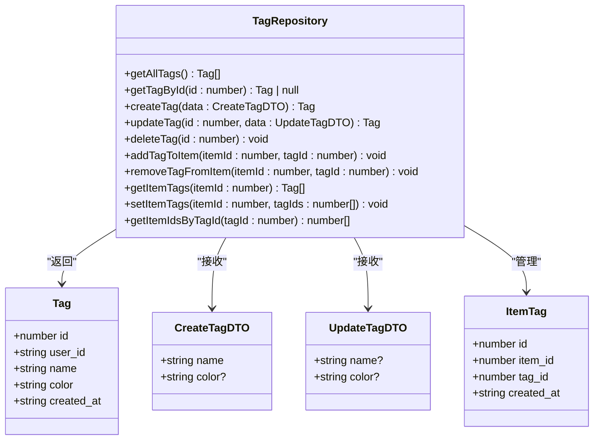

**图表来源**
- [tag-repository.ts](file://lib/db/tag-repository.ts#L10-L191)
- [tag.ts](file://lib/types/tag.ts#L8-L59)

**章节来源**
- [tag-repository.ts](file://lib/db/tag-repository.ts#L1-L191)
- [tag.ts](file://lib/types/tag.ts#L1-L59)

## 标签CRUD操作详解

### 查询操作

#### getAllTags - 获取所有标签

该方法实现了基于用户ID的数据隔离查询：

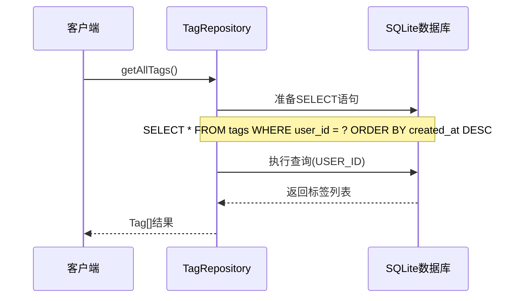

**图表来源**
- [tag-repository.ts](file://lib/db/tag-repository.ts#L13-L16)

查询特点：
- **数据隔离**：通过USER_ID确保每个用户只能访问自己的标签数据
- **排序规则**：按创建时间倒序排列，最新创建的标签优先显示
- **性能优化**：数据库层面的ORDER BY操作，利用索引提升查询效率

#### getTagById - 根据ID获取标签

支持精确查找并验证数据隔离：

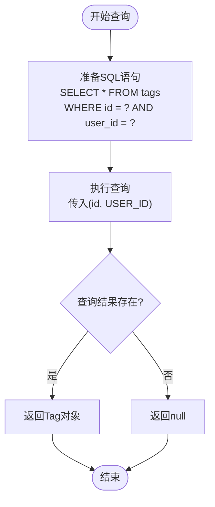

**图表来源**
- [tag-repository.ts](file://lib/db/tag-repository.ts#L22-L26)

### 创建操作

#### createTag - 创建新标签

实现了完整的标签创建流程，包含默认值处理和数据验证：

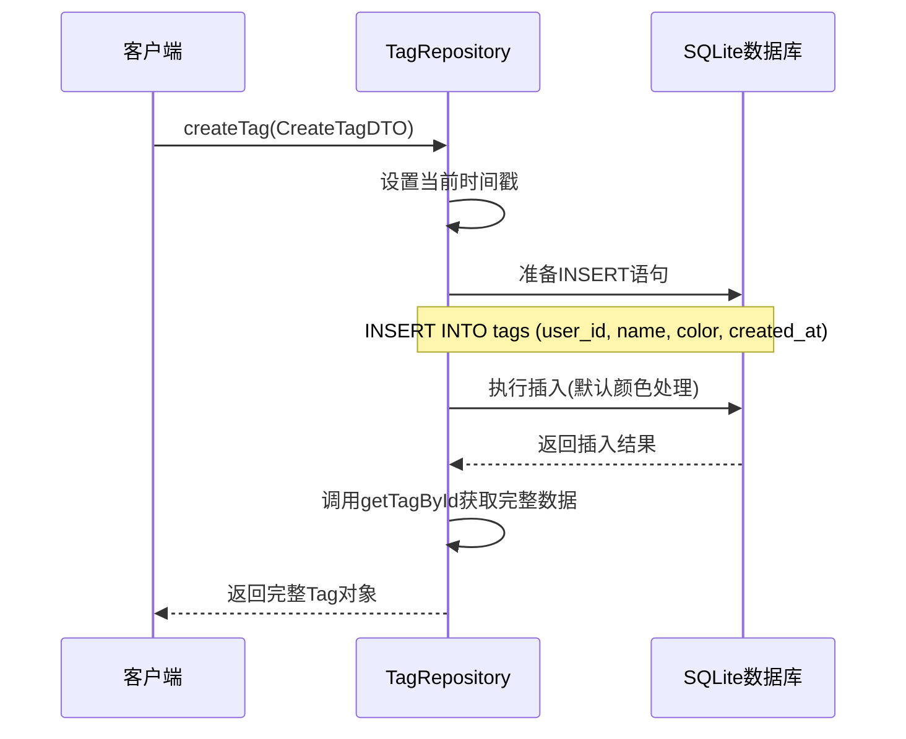

**图表来源**
- [tag-repository.ts](file://lib/db/tag-repository.ts#L32-L53)

默认颜色处理逻辑：
- **颜色参数为空时**：使用默认颜色`#3B82F6`（蓝色）
- **颜色参数有效时**：使用传入的颜色值
- **颜色格式验证**：前端API层会验证颜色格式，确保`#RRGGBB`格式

**章节来源**
- [tag-repository.ts](file://lib/db/tag-repository.ts#L13-L53)

### 更新操作

#### updateTag - 更新标签属性

支持部分字段更新，动态构建SQL语句：

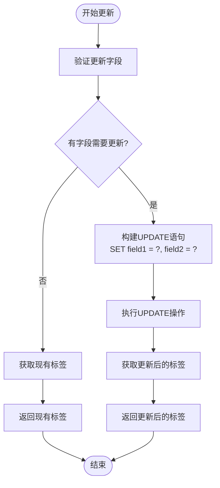

**图表来源**
- [tag-repository.ts](file://lib/db/tag-repository.ts#L59-L97)

更新特点：
- **动态SQL构建**：根据传入的字段动态生成UPDATE语句
- **条件更新**：只有当字段存在且不为undefined时才更新
- **数据一致性**：更新后重新查询确保返回最新的完整数据

**章节来源**
- [tag-repository.ts](file://lib/db/tag-repository.ts#L59-L97)

### 删除操作

#### deleteTag - 删除标签

实现了安全的级联删除机制：

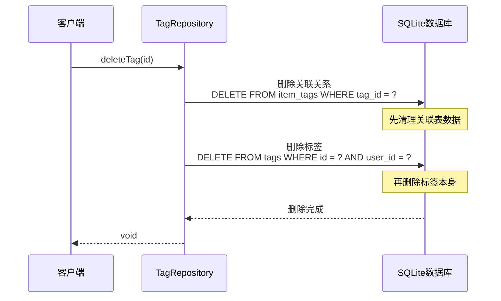

**图表来源**
- [tag-repository.ts](file://lib/db/tag-repository.ts#L103-L111)

级联删除策略：
- **顺序删除**：先删除item_tags关联表中的记录，再删除tags表中的标签
- **外键约束**：数据库层面的CASCADE约束确保数据完整性
- **数据隔离**：同时检查USER_ID确保只删除当前用户的数据

**章节来源**
- [tag-repository.ts](file://lib/db/tag-repository.ts#L103-L111)

## 多对多关系管理

### 关联表设计

系统使用item_tags作为中间表实现物品与标签的多对多关系：

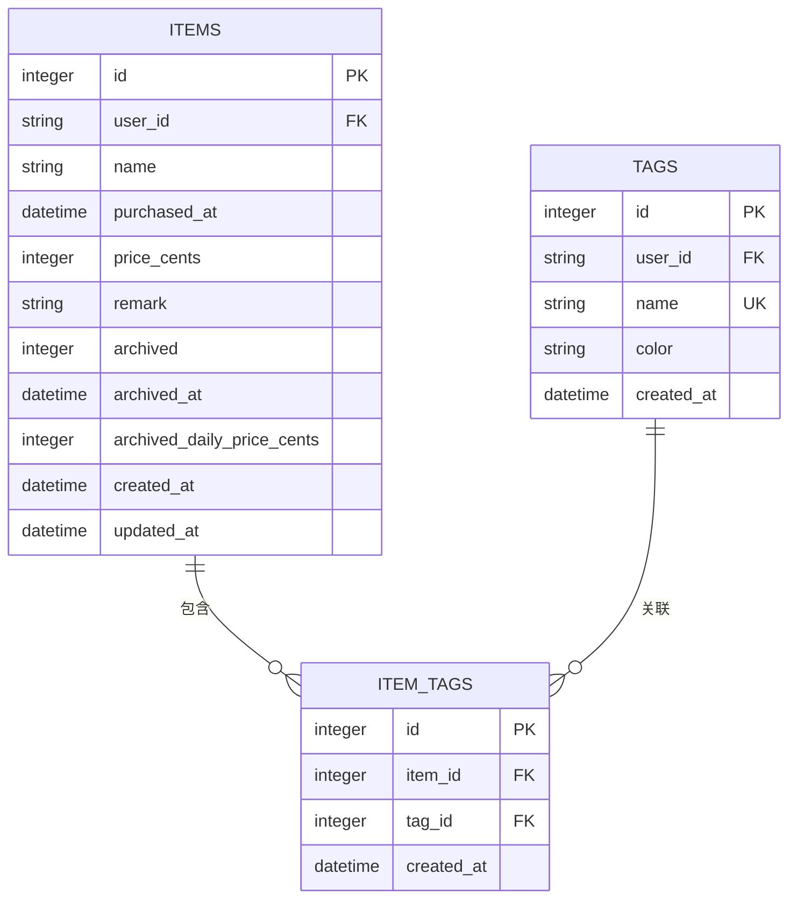

**图表来源**
- [sqlite.ts](file://lib/db/sqlite.ts#L45-L67)

### 标签添加与移除

#### addTagToItem - 添加标签到物品

实现了智能的标签关联添加，具有容错处理能力：

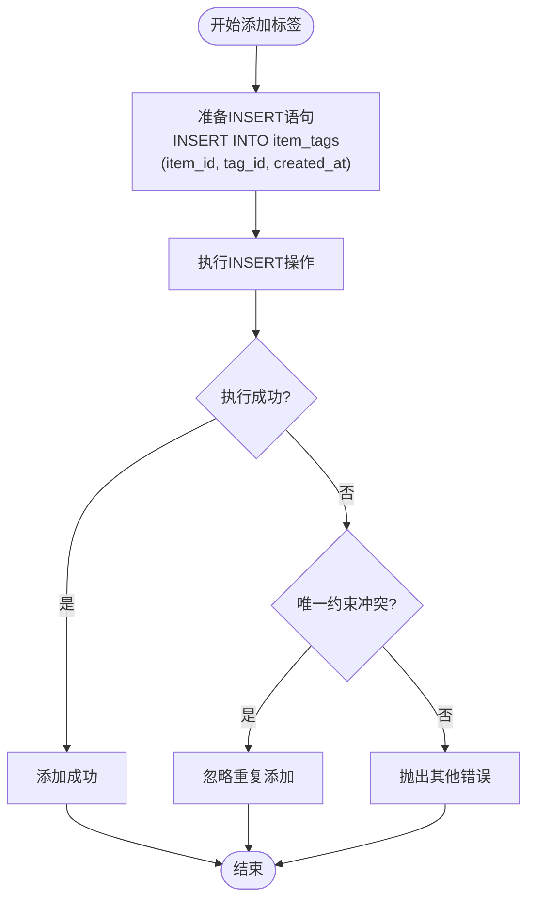

**图表来源**
- [tag-repository.ts](file://lib/db/tag-repository.ts#L117-L132)

容错处理策略：
- **唯一约束检测**：捕获SQLite的唯一约束冲突错误
- **优雅忽略**：对于重复添加的情况，选择忽略而不是抛出异常
- **错误分类**：只对非唯一约束错误进行重新抛出

#### removeTagFromItem - 移除物品标签

简单的直接删除操作：

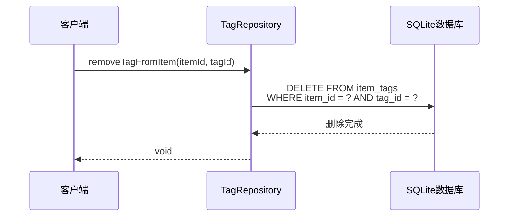

**图表来源**
- [tag-repository.ts](file://lib/db/tag-repository.ts#L138-L141)

**章节来源**
- [tag-repository.ts](file://lib/db/tag-repository.ts#L117-L141)

### 标签查询

#### getItemTags - 获取物品的所有标签

使用INNER JOIN实现高效的标签关联查询：

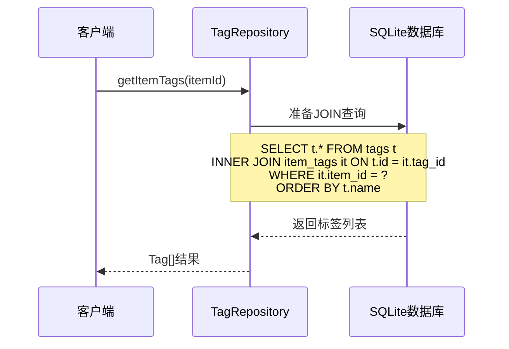

**图表来源**
- [tag-repository.ts](file://lib/db/tag-repository.ts#L147-L155)

查询特点：
- **INNER JOIN**：只返回有实际关联的标签
- **排序规则**：按标签名称升序排列
- **性能优化**：利用索引加速JOIN操作

**章节来源**
- [tag-repository.ts](file://lib/db/tag-repository.ts#L147-L155)

## 数据隔离机制

### 用户ID隔离策略

系统通过USER_ID实现多租户数据隔离：

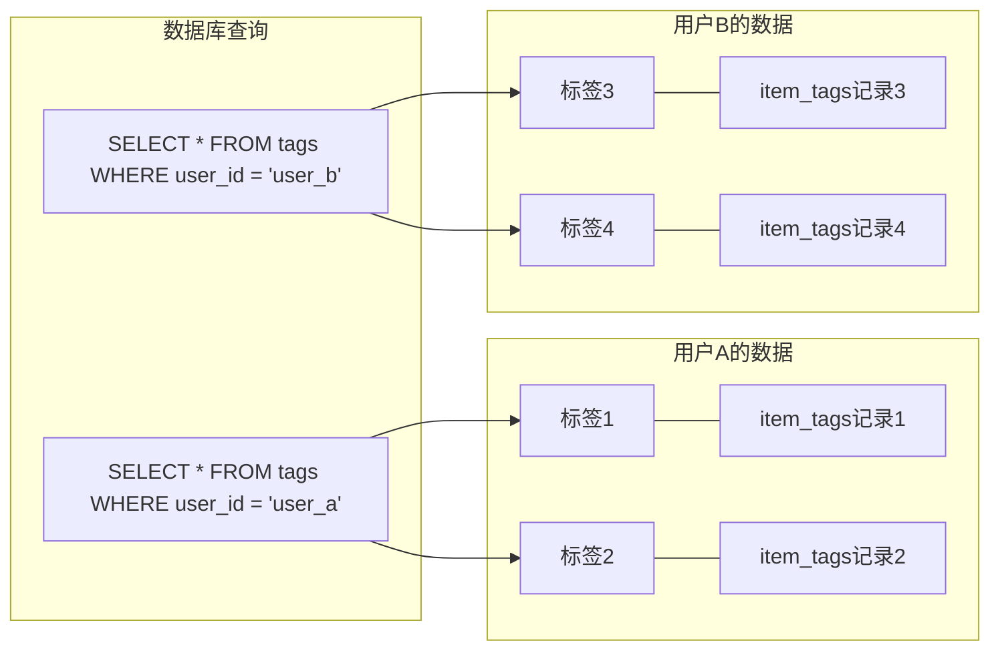

**图表来源**
- [sqlite.ts](file://lib/db/sqlite.ts#L32-L53)
- [tag-repository.ts](file://lib/db/tag-repository.ts#L14-L16)

隔离实现方式：
- **全局常量**：USER_ID常量统一管理
- **查询过滤**：所有查询都包含user_id条件
- **插入约束**：创建标签时自动设置user_id
- **更新验证**：更新操作同时验证id和user_id

**章节来源**
- [tag-repository.ts](file://lib/db/tag-repository.ts#L8-L16)
- [sqlite.ts](file://lib/db/sqlite.ts#L32-L53)

## 事务处理与原子性

### setItemTags - 批量标签设置

使用数据库事务确保操作的原子性：

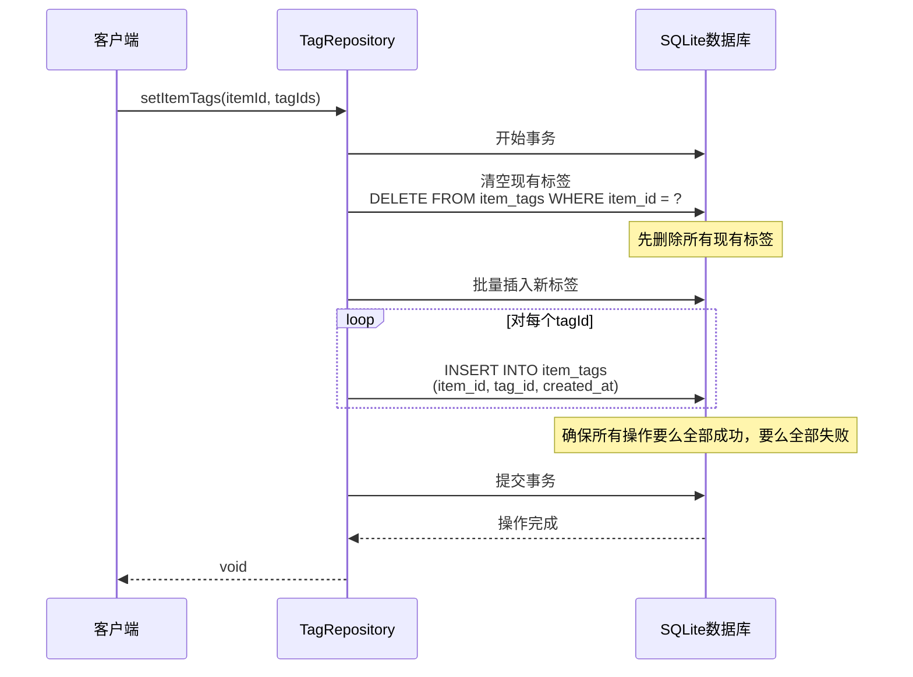

**图表来源**
- [tag-repository.ts](file://lib/db/tag-repository.ts#L161-L179)

事务处理特点：
- **原子性保证**：整个操作在单一事务中执行
- **中间状态保护**：在批量插入完成前不会暴露中间状态
- **回滚机制**：任何步骤失败都会自动回滚
- **性能优化**：批量插入减少数据库交互次数

**章节来源**
- [tag-repository.ts](file://lib/db/tag-repository.ts#L161-L179)

## 错误处理策略

### 唯一约束冲突处理

系统对不同类型的错误采用不同的处理策略：

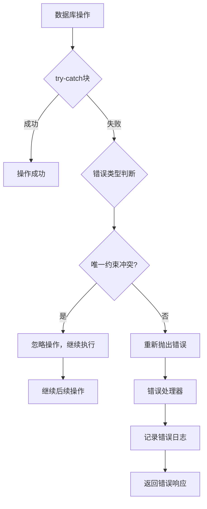

**图表来源**
- [tag-repository.ts](file://lib/db/tag-repository.ts#L127-L132)
- [route.ts](file://app/api/tags/route.ts#L59-L70)

错误处理层次：
- **Repository层**：捕获并分类错误
- **API层**：转换为HTTP响应码和错误消息
- **前端层**：提供用户友好的错误提示

**章节来源**
- [tag-repository.ts](file://lib/db/tag-repository.ts#L127-L132)
- [route.ts](file://app/api/tags/route.ts#L59-L70)

## 业务场景应用

### 实际调用序列示例

#### 场景1：创建新标签并分配给物品

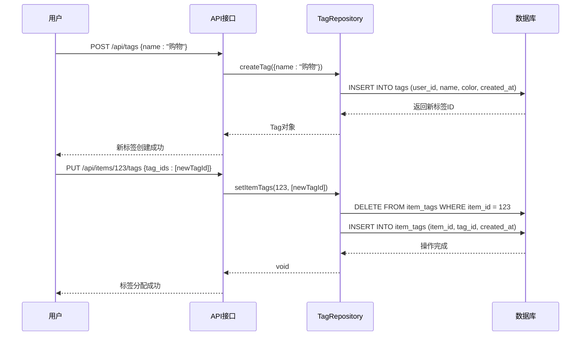

**图表来源**
- [route.ts](file://app/api/tags/route.ts#L25-L72)
- [route.ts](file://app/api/items/[id]/tags/route.ts#L45-L102)

#### 场景2：批量更新物品标签

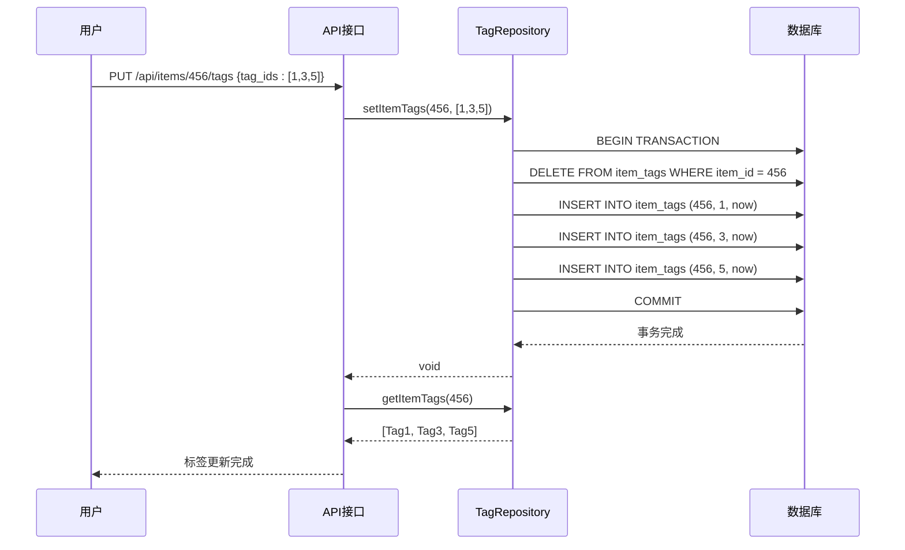

**图表来源**
- [route.ts](file://app/api/items/[id]/tags/route.ts#L45-L102)
- [tag-repository.ts](file://lib/db/tag-repository.ts#L161-L179)

#### 场景3：删除标签的安全流程

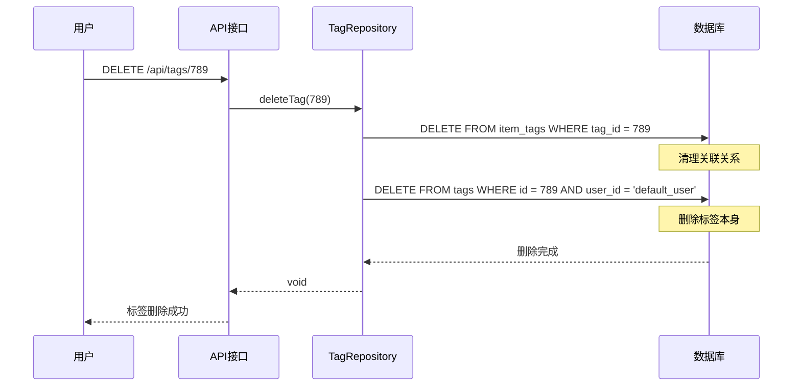

**图表来源**
- [route.ts](file://app/api/tags/[id]/route.ts#L127-L155)
- [tag-repository.ts](file://lib/db/tag-repository.ts#L103-L111)

## 性能优化考虑

### 索引策略

系统通过合理的索引设计提升查询性能：

| 索引名称 | 目标表 | 索引列 | 用途 |
|---------|--------|--------|------|
| idx_items_user_id | items | user_id | 用户数据隔离查询 |
| idx_items_archived | items | archived | 归档状态查询优化 |
| idx_tags_user_id | tags | user_id | 标签查询优化 |
| idx_item_tags_item_id | item_tags | item_id | 物品标签查询 |
| idx_item_tags_tag_id | item_tags | tag_id | 标签关联查询 |

### 查询优化技巧

1. **JOIN查询优化**：使用INNER JOIN而非LEFT JOIN，只返回有实际关联的数据
2. **批量操作**：setItemTags使用事务批量插入，减少数据库交互
3. **索引利用**：所有查询都利用预先创建的索引
4. **数据排序**：合理使用ORDER BY，配合索引提升排序性能

### 内存管理

- **连接池**：SQLite数据库连接采用单例模式，避免频繁创建销毁
- **WAL模式**：启用Write-Ahead Logging模式提高并发性能
- **资源清理**：提供数据库关闭函数用于资源释放

**章节来源**
- [sqlite.ts](file://lib/db/sqlite.ts#L93-L98)
- [sqlite.ts](file://lib/db/sqlite.ts#L18-L24)

## 总结

标签管理Repository实现展现了良好的软件工程实践：

### 设计优势

1. **清晰的职责分离**：Repository层专注于数据访问，API层处理业务逻辑
2. **强类型安全**：完整的TypeScript类型定义确保编译时类型检查
3. **数据完整性**：通过外键约束和级联删除保证数据一致性
4. **用户体验**：优雅的错误处理和容错机制提升系统稳定性

### 技术亮点

1. **事务原子性**：setItemTags使用数据库事务确保批量操作的原子性
2. **数据隔离**：USER_ID机制实现多租户数据隔离
3. **性能优化**：合理的索引设计和查询优化策略
4. **错误恢复**：智能的错误处理和容错机制

该实现为财务管理应用提供了稳定可靠的标签管理功能，支持复杂的业务场景需求，同时保持了良好的可维护性和扩展性。