# 核心CRUD操作实现

<cite>
**本文档引用的文件**
- [repository.ts](file://lib/db/repository.ts)
- [item.ts](file://lib/types/item.ts)
- [route.ts](file://app/api/items/route.ts)
- [route.ts](file://app/api/items/[id]/route.ts)
- [sqlite.ts](file://lib/db/sqlite.ts)
- [client.ts](file://lib/api/client.ts)
- [use-items.ts](file://lib/hooks/use-items.ts)
- [item-store.ts](file://lib/store/item-store.ts)
</cite>

## 目录
1. [简介](#简介)
2. [项目架构概览](#项目架构概览)
3. [核心CRUD方法深度分析](#核心crud方法深度分析)
4. [SQL构造逻辑与参数绑定机制](#sql构造逻辑与参数绑定机制)
5. [数据模型与类型定义](#数据模型与类型定义)
6. [API层实现](#api层实现)
7. [前端集成与调用示例](#前端集成与调用示例)
8. [异常处理与边界条件](#异常处理与边界条件)
9. [性能优化策略](#性能优化策略)
10. [总结](#总结)

## 简介

本文档深入解析了基于SQLite数据库的Repository模式中核心CRUD操作的实现细节。该系统采用单用户模式设计，通过USER_ID='default_user'实现数据隔离，提供了完整的物品管理功能，包括查询、创建、更新、删除等操作。系统采用分层架构设计，包含数据库层、API层和前端Hook层，确保了代码的可维护性和扩展性。

## 项目架构概览

系统采用三层架构设计，实现了清晰的职责分离：

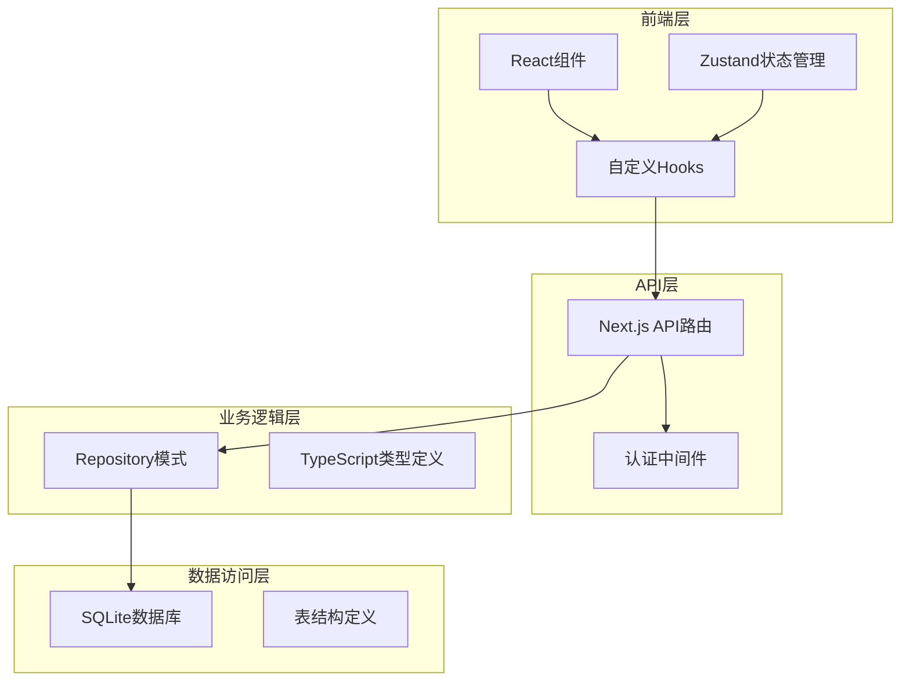

**图表来源**
- [repository.ts](file://lib/db/repository.ts#L1-L156)
- [route.ts](file://app/api/items/route.ts#L1-L75)
- [sqlite.ts](file://lib/db/sqlite.ts#L1-L109)

**章节来源**
- [repository.ts](file://lib/db/repository.ts#L1-L156)
- [sqlite.ts](file://lib/db/sqlite.ts#L1-L109)

## 核心CRUD方法深度分析

### getAllItems方法 - 动态查询构建

`getAllItems`方法是系统中最复杂的查询操作，支持动态WHERE条件构建和单用户数据隔离。

#### 查询逻辑架构

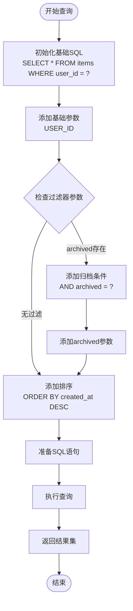

**图表来源**
- [repository.ts](file://lib/db/repository.ts#L9-L22)

#### 核心实现特点

1. **单用户数据隔离**：始终通过`user_id = 'default_user'`确保数据安全
2. **动态条件构建**：根据`ItemFilter`接口的可选参数动态添加WHERE条件
3. **默认排序**：按`created_at DESC`确保最新记录优先显示
4. **参数化查询**：使用占位符防止SQL注入攻击

### getItemById方法 - 精确查询

该方法提供精确的单条记录查询，确保数据完整性。

#### 查询流程

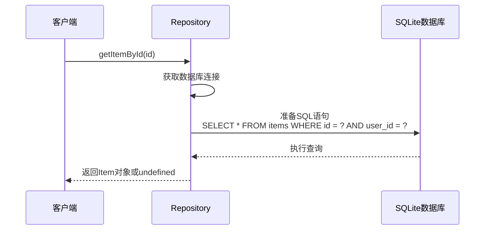

**图表来源**
- [repository.ts](file://lib/db/repository.ts#L28-L32)

### createItem方法 - 数据创建与默认值策略

`createItem`方法负责创建新的物品记录，实现了完整的字段验证和默认值设置机制。

#### 创建流程图

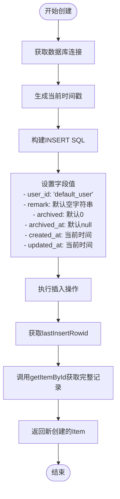

**图表来源**
- [repository.ts](file://lib/db/repository.ts#L37-L63)

#### 默认值设置策略

| 字段名 | 默认值 | 说明 |
|--------|--------|------|
| user_id | 'default_user' | 单用户模式标识 |
| remark | '' (空字符串) | 备注字段为空时不为null |
| archived | 0 | 新创建的物品默认未归档 |
| archived_at | null | 未归档时保持null |
| archived_daily_price_cents | null | 未归档时保持null |
| created_at | 当前时间戳 | ISO格式的时间字符串 |
| updated_at | 当前时间戳 | 创建时即为最新更新时间 |

### updateItem方法 - 动态字段更新

该方法实现了智能的字段选择性更新，只更新实际变更的字段。

#### 动态SQL构建流程

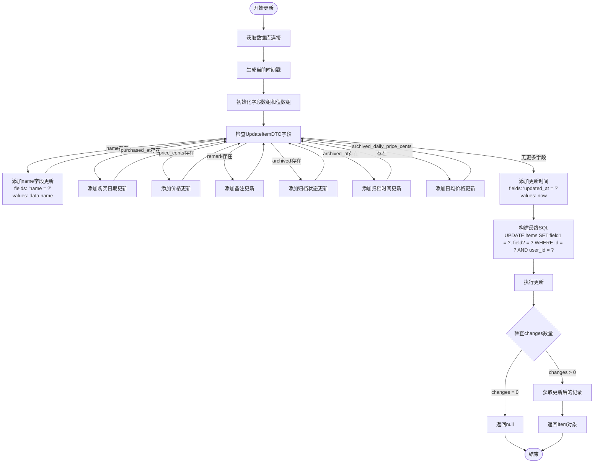

**图表来源**
- [repository.ts](file://lib/db/repository.ts#L69-L121)

#### 更新策略特点

1. **字段选择性更新**：只更新实际传递的字段，避免不必要的数据库操作
2. **自动时间戳更新**：无论其他字段是否变更，always更新`updated_at`
3. **权限验证**：通过`user_id = 'default_user'`确保只能更新当前用户的记录
4. **变更检测**：通过`stmt.run()`的返回值判断是否有实际变更

### deleteItem方法 - 原子性删除

该方法提供简洁的删除操作，返回布尔值表示操作结果。

#### 删除操作流程

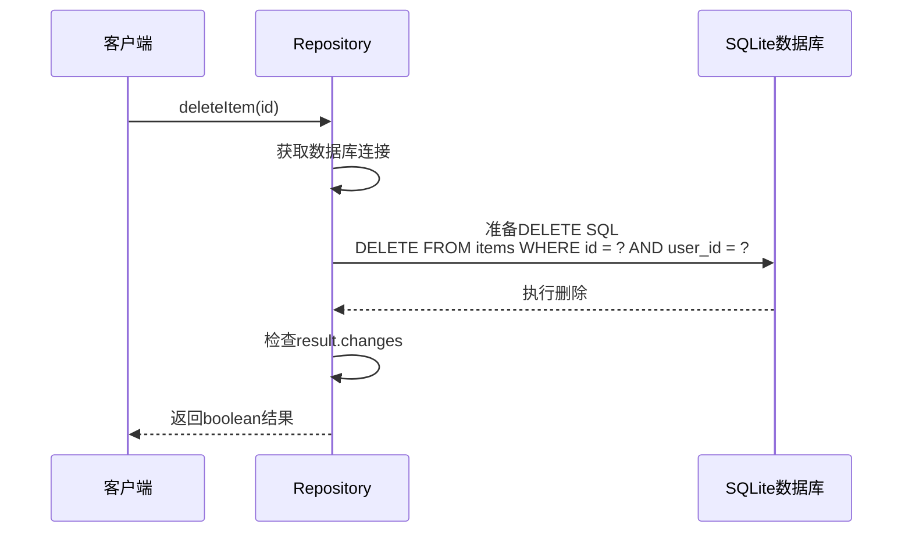

**图表来源**
- [repository.ts](file://lib/db/repository.ts#L127-L131)

**章节来源**
- [repository.ts](file://lib/db/repository.ts#L9-L156)

## SQL构造逻辑与参数绑定机制

### 参数化查询的安全性

系统全面采用参数化查询防止SQL注入攻击：

```typescript
// 示例：安全的参数化查询
const stmt = db.prepare('SELECT * FROM items WHERE id = ? AND user_id = ?');
return stmt.get(id, USER_ID) as Item | undefined;
```

### 动态WHERE条件构建

`getAllItems`方法展示了动态WHERE条件的最佳实践：

```typescript
// 基础查询
let sql = 'SELECT * FROM items WHERE user_id = ?';
const params: (string | number)[] = [USER_ID];

// 条件性添加
if (filter?.archived !== undefined) {
  sql += ' AND archived = ?';
  params.push(filter.archived);
}

sql += ' ORDER BY created_at DESC';
```

### 参数绑定策略

| 方法 | 参数绑定方式 | 安全级别 | 性能影响 |
|------|-------------|----------|----------|
| getAllItems | 数组形式批量绑定 | 高 | 低 |
| getItemById | 位置参数绑定 | 高 | 极低 |
| createItem | 顺序参数绑定 | 高 | 低 |
| updateItem | 动态数组构建 | 高 | 中等 |
| deleteItem | 位置参数绑定 | 高 | 极低 |

**章节来源**
- [repository.ts](file://lib/db/repository.ts#L9-L156)

## 数据模型与类型定义

### Item接口设计

系统采用强类型设计，确保数据一致性：

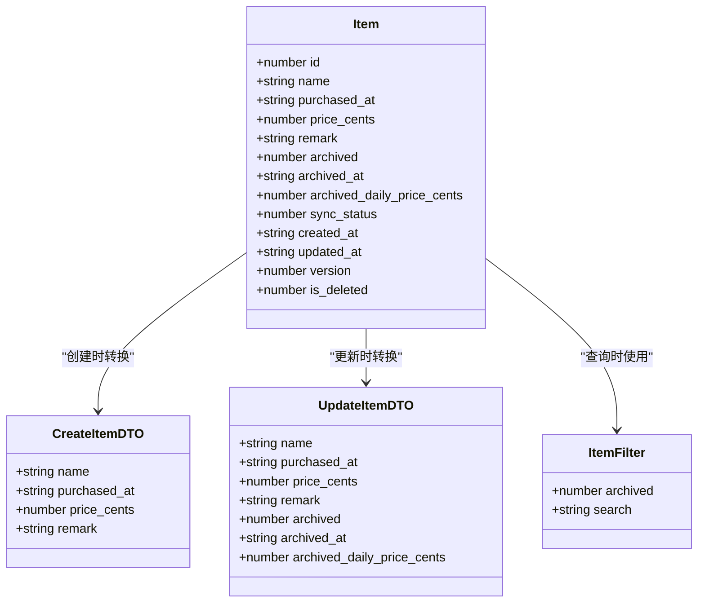

**图表来源**
- [item.ts](file://lib/types/item.ts#L9-L94)

### 类型安全性保障

1. **CreateItemDTO**：创建时必需字段验证
2. **UpdateItemDTO**：更新时可选字段处理
3. **ItemFilter**：查询时的筛选条件
4. **Item接口**：完整的数据模型定义

**章节来源**
- [item.ts](file://lib/types/item.ts#L1-L94)

## API层实现

### RESTful API设计

系统遵循RESTful原则设计API接口：

| HTTP方法 | 端点 | 功能 | 返回类型 |
|----------|------|------|----------|
| GET | /api/items | 获取物品列表 | Item[] |
| POST | /api/items | 创建新物品 | Item |
| GET | /api/items/:id | 获取单个物品 | Item |
| PUT | /api/items/:id | 更新物品 | Item |
| DELETE | /api/items/:id | 删除物品 | boolean |

### 错误处理机制

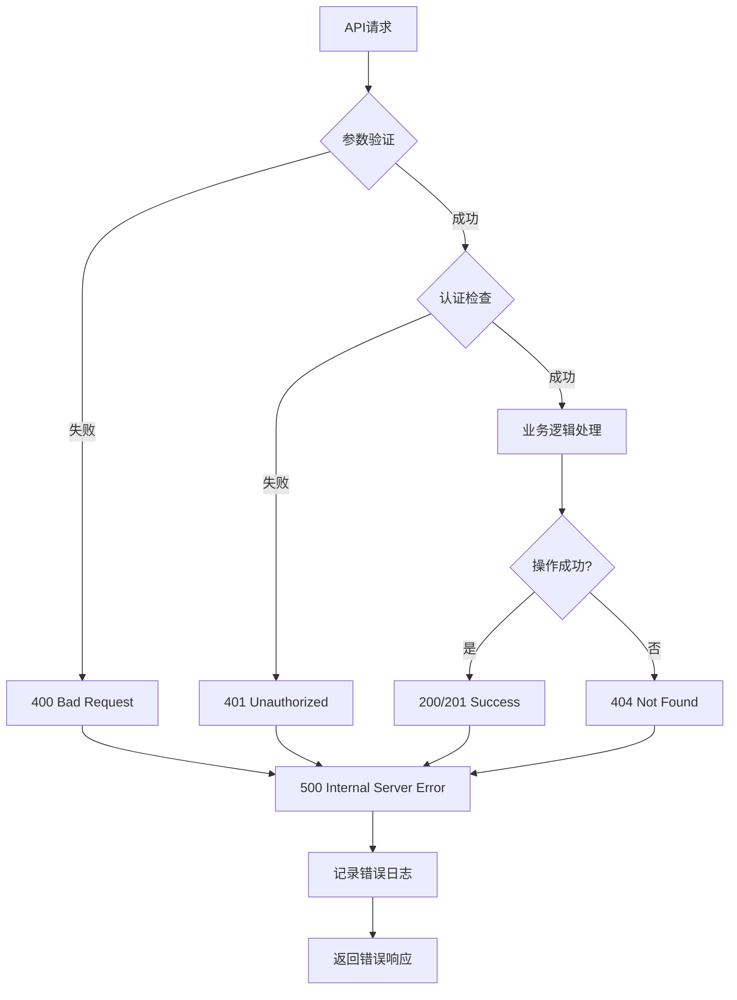

**图表来源**
- [route.ts](file://app/api/items/route.ts#L10-L75)
- [route.ts](file://app/api/items/[id]/route.ts#L13-L134)

**章节来源**
- [route.ts](file://app/api/items/route.ts#L1-L75)
- [route.ts](file://app/api/items/[id]/route.ts#L1-L134)

## 前端集成与调用示例

### React Hook集成

系统提供了完整的React Hook集成方案：

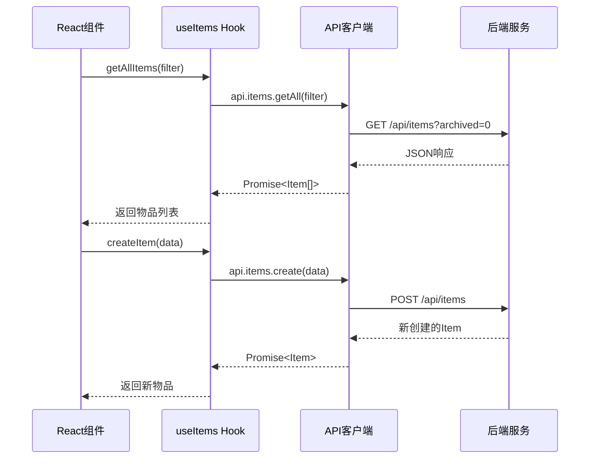

**图表来源**
- [use-items.ts](file://lib/hooks/use-items.ts#L13-L105)
- [client.ts](file://lib/api/client.ts#L96-L142)

### 状态管理集成

系统使用Zustand进行状态管理，实现响应式的UI更新：

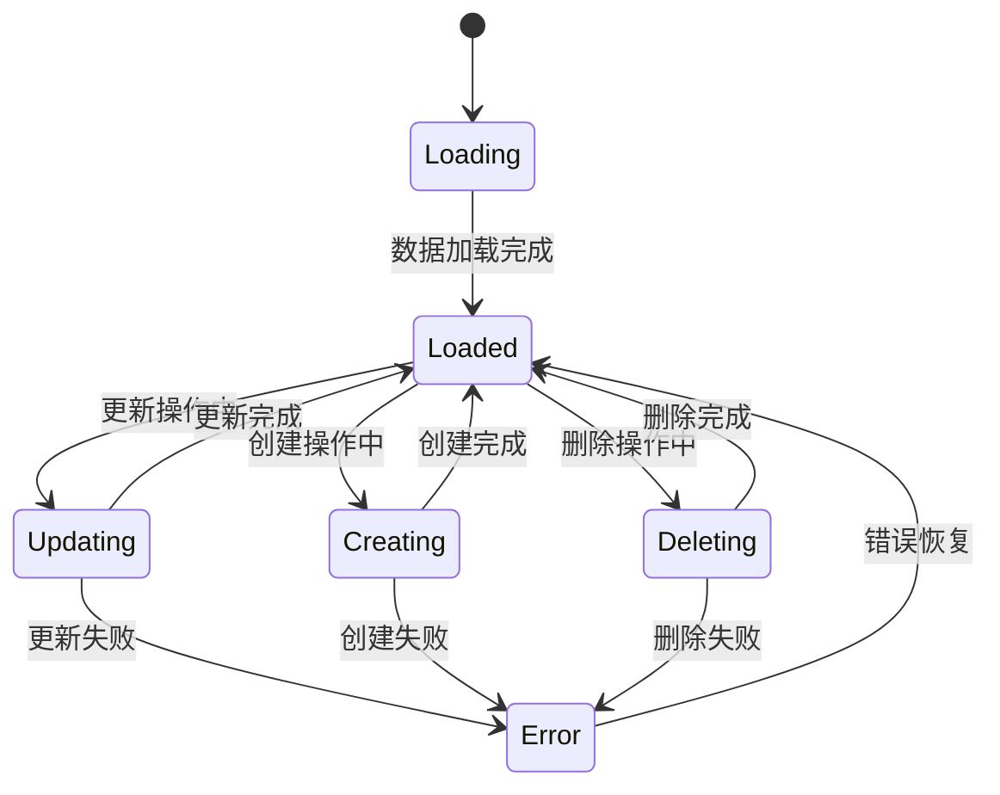

**图表来源**
- [item-store.ts](file://lib/store/item-store.ts#L47-L113)

### 实际调用示例

#### 获取物品列表（带筛选）

```typescript
// 前端调用示例
const { getAllItems } = useItems();
const [filter, setFilter] = useState({ archived: 0 });

const loadItems = async () => {
  try {
    const items = await getAllItems(filter);
    // 更新状态或store
  } catch (error) {
    console.error('加载物品失败:', error);
  }
};
```

#### 创建新物品

```typescript
// 创建物品的完整流程
const handleCreateItem = async (formData) => {
  try {
    const newItem = await createItem({
      name: formData.name,
      purchased_at: formData.purchased_at,
      price_cents: formData.price_cents,
      remark: formData.remark || ''
    });
    
    // 更新UI状态
    addItem(newItem);
    
  } catch (error) {
    console.error('创建物品失败:', error);
    // 显示错误提示
  }
};
```

**章节来源**
- [use-items.ts](file://lib/hooks/use-items.ts#L1-L105)
- [item-store.ts](file://lib/store/item-store.ts#L1-L113)

## 异常处理与边界条件

### 边界条件处理

系统针对各种边界情况进行了全面的处理：

#### 数据验证边界

| 场景 | 处理方式 | 返回值 | 用户体验 |
|------|----------|--------|----------|
| 无效ID参数 | 类型转换失败 | 400 Bad Request | 显示"无效的物品ID" |
| 物品不存在 | 查询无结果 | 404 Not Found | 显示"物品不存在" |
| 权限不足 | WHERE条件不匹配 | 404 Not Found | 显示相同错误 |
| 数据库连接失败 | try-catch包装 | 500 Internal Error | 显示"服务器错误" |
| 必填字段缺失 | 前端验证 | 400 Bad Request | 实时表单验证 |

#### 异常处理流程

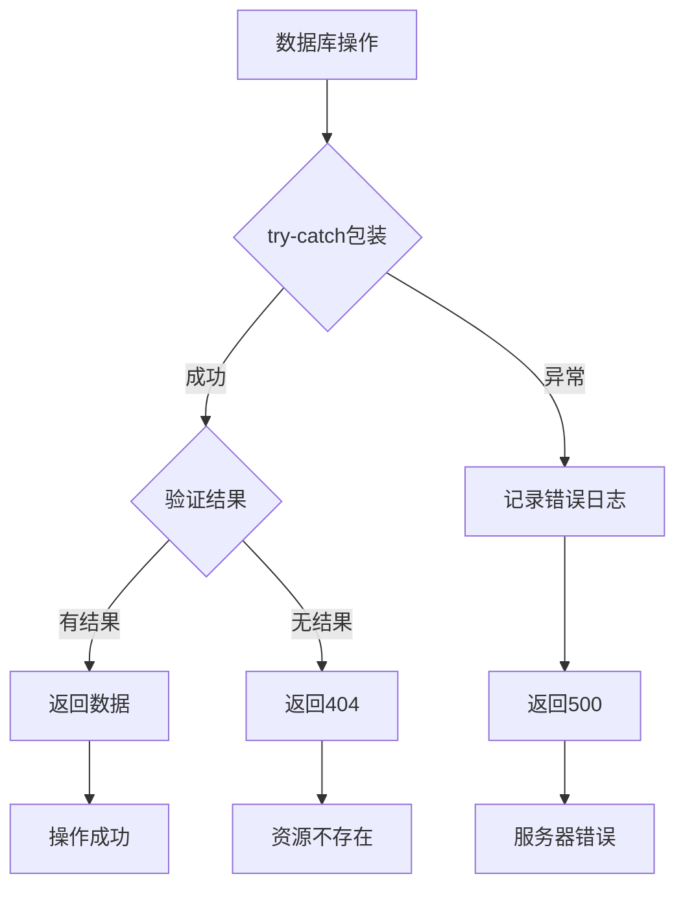

### 错误恢复机制

1. **自动重试**：对于临时性错误提供重试机制
2. **降级处理**：数据库不可用时提供缓存或离线模式
3. **用户反馈**：清晰的错误信息和恢复建议
4. **日志记录**：完整的错误追踪和调试信息

**章节来源**
- [route.ts](file://app/api/items/route.ts#L10-L75)
- [route.ts](file://app/api/items/[id]/route.ts#L13-L134)

## 性能优化策略

### 查询优化

1. **索引策略**：
   - `idx_items_user_id`：按用户ID快速筛选
   - `idx_items_archived`：按归档状态查询优化
   - `idx_item_tags_item_id`：物品标签关联查询

2. **WAL模式**：启用Write-Ahead Logging提高并发性能

3. **参数化查询**：减少SQL编译开销

### 缓存策略

1. **内存缓存**：频繁访问的物品数据缓存在内存中
2. **懒加载**：按需加载详细数据
3. **批量操作**：合并多个小操作减少网络往返

### 连接管理

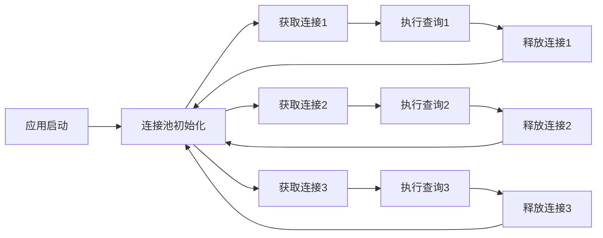

**图表来源**
- [sqlite.ts](file://lib/db/sqlite.ts#L17-L24)

## 总结

本文档深入分析了基于SQLite的Repository模式中核心CRUD操作的实现细节。系统通过以下关键特性确保了高质量的数据管理：

### 技术亮点

1. **单用户数据隔离**：通过USER_ID='default_user'实现安全的数据隔离
2. **动态SQL构建**：灵活的WHERE条件构建和参数绑定机制
3. **强类型设计**：完整的TypeScript类型定义确保数据一致性
4. **分层架构**：清晰的职责分离和模块化设计
5. **异常处理**：完善的错误处理和边界条件处理

### 设计优势

1. **安全性**：参数化查询防止SQL注入
2. **可维护性**：清晰的代码结构和注释
3. **可扩展性**：模块化设计便于功能扩展
4. **性能**：合理的索引策略和连接管理
5. **用户体验**：及时的错误反馈和状态管理

### 应用价值

该CRUD实现模式适用于各种单用户或小型团队的应用场景，特别适合需要数据隔离和简单权限控制的业务系统。通过本文档的详细分析，开发者可以深入理解Repository模式的最佳实践，并在此基础上进行定制化开发。