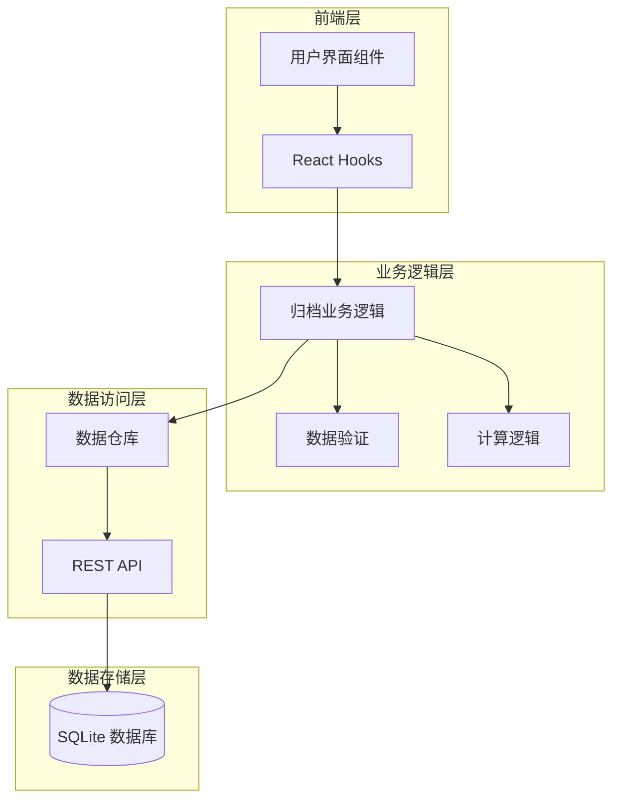
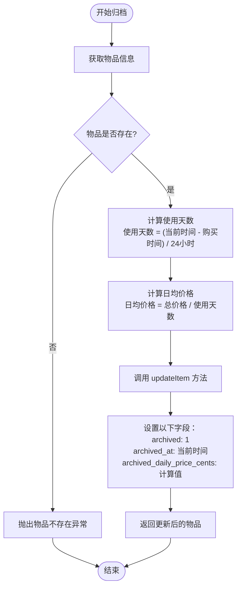
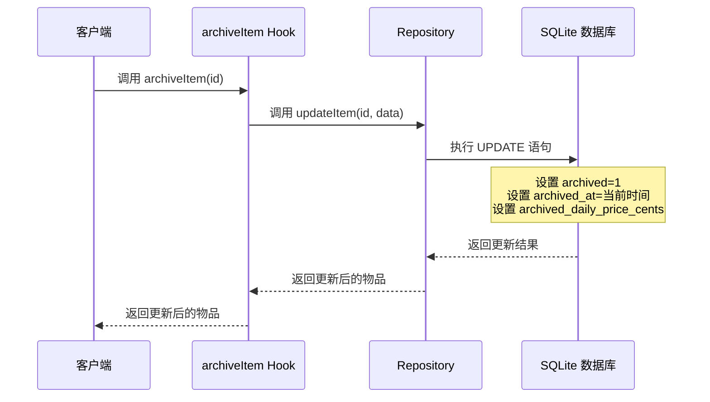
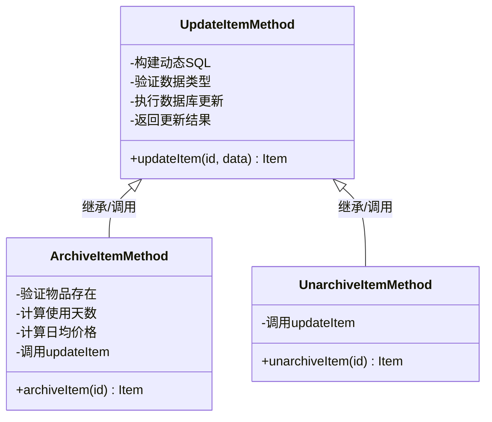
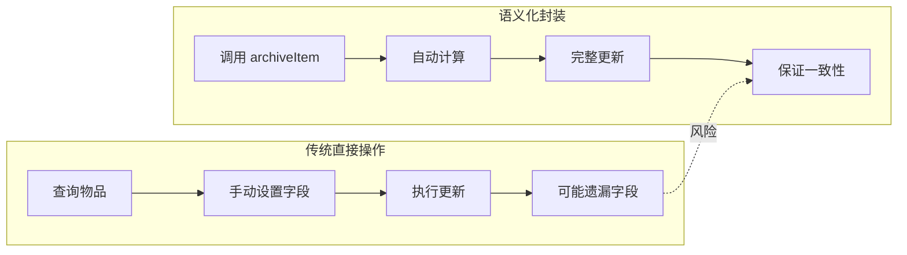
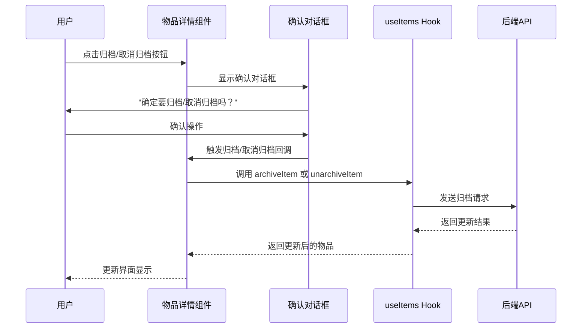
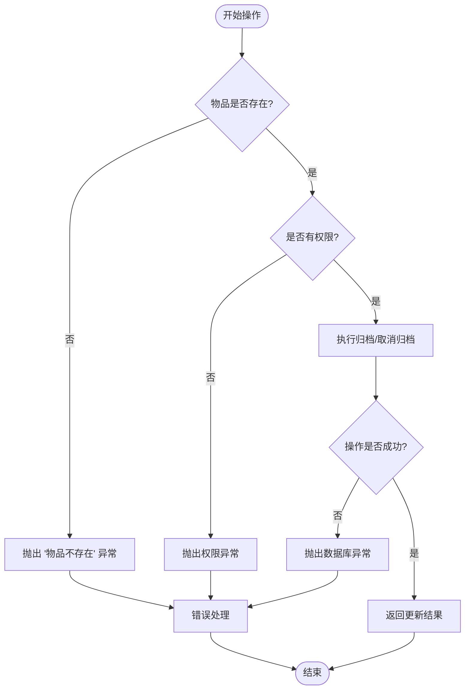
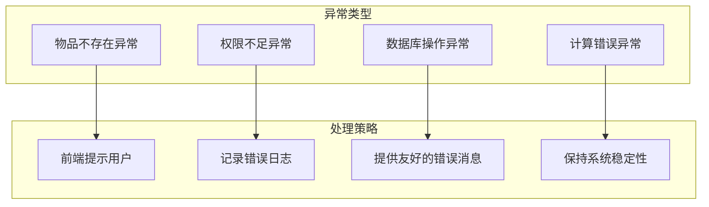

# 特殊业务操作实现

<cite>
**本文档引用的文件**
- [use-items.ts](file://lib/hooks/use-items.ts)
- [repository.ts](file://lib/db/repository.ts)
- [item.ts](file://lib/types/item.ts)
- [item-detail.tsx](file://components/item-detail.tsx)
- [item-utils.ts](file://lib/utils/item-utils.ts)
- [route.ts](file://app/api/items/[id]/route.ts)
- [需求说明.md](file://需求说明.md)
</cite>

## 目录
1. [概述](#概述)
2. [归档相关业务方法架构](#归档相关业务方法架构)
3. [archiveItem 方法实现机制](#archiveitem-方法实现机制)
4. [unarchiveItem 方法实现机制](#unarchiveitem-方法实现机制)
5. [业务语义化封装的重要性](#业务语义化封装的重要性)
6. [实际调用案例分析](#实际调用案例分析)
7. [错误处理与验证机制](#错误处理与验证机制)
8. [性能考虑与最佳实践](#性能考虑与最佳实践)
9. [总结](#总结)

## 概述

在物品成本管理系统中，归档功能是一个重要的业务特性，它允许用户将不再使用的物品标记为"已归档"状态，从而锁定其历史成本信息。系统提供了两个核心业务方法：`archiveItem` 和 `unarchiveItem`，它们作为业务语义化的封装层，确保归档操作的完整性和一致性。

归档功能的核心价值在于：
- **成本计算的历史一致性**：通过锁定日均价格，确保历史成本不会因时间推移而变化
- **数据完整性保护**：防止直接操作数据库字段导致的逻辑遗漏
- **业务语义清晰**：提供明确的操作意图表达
- **自动化计算**：自动计算使用天数和日均价格

## 归档相关业务方法架构

系统采用分层架构设计，将业务逻辑与数据访问分离：



**图表来源**
- [use-items.ts](file://lib/hooks/use-items.ts#L68-L94)
- [repository.ts](file://lib/db/repository.ts#L136-L155)

**章节来源**
- [use-items.ts](file://lib/hooks/use-items.ts#L1-L106)
- [repository.ts](file://lib/db/repository.ts#L1-L156)

## archiveItem 方法实现机制

### 方法签名与职责

`archiveItem` 方法负责将活动物品标记为归档状态，并执行必要的计算和数据填充：

```typescript
const archiveItem = useCallback(async (id: number): Promise<Item> => { ... })
```

该方法的核心职责包括：
- 验证物品存在性
- 计算使用天数
- 计算归档时的日均价格
- 封装调用 `updateItem` 方法
- 设置归档状态和时间戳

### 计算逻辑实现

归档过程中的关键计算步骤：



**图表来源**
- [use-items.ts](file://lib/hooks/use-items.ts#L69-L85)
- [item-utils.ts](file://lib/utils/item-utils.ts#L12-L32)

### 关键计算算法

系统使用精确的日期计算算法来确保归档时的成本准确性：

1. **使用天数计算**：基于购买日期到当前时间的实际天数
2. **日均价格计算**：采用向下取整的整数除法，确保成本不会被高估
3. **最小天数保证**：至少计算1天，避免除零错误

### 数据库层面的实现

在数据访问层，`archiveItem` 方法通过调用 `updateItem` 实现：



**图表来源**
- [repository.ts](file://lib/db/repository.ts#L136-L144)
- [repository.ts](file://lib/db/repository.ts#L68-L122)

**章节来源**
- [use-items.ts](file://lib/hooks/use-items.ts#L68-L85)
- [repository.ts](file://lib/db/repository.ts#L136-L144)

## unarchiveItem 方法实现机制

### 方法设计原则

`unarchiveItem` 方法采用简洁的设计原则，专注于清除归档状态相关的字段：

```typescript
const unarchiveItem = useCallback(async (id: number): Promise<Item> => {
    return updateItem(id, {
        archived: 0,
        archived_at: null,
        archived_daily_price_cents: null,
    });
}, [updateItem]);
```

### 字段清理策略

取消归档时的字段处理策略：

| 字段名 | 归档状态值 | 取消归档时的处理 |
|--------|------------|------------------|
| `archived` | 1 | 设置为 0（表示未归档） |
| `archived_at` | ISO 时间字符串 | 设置为 null |
| `archived_daily_price_cents` | 价格（分） | 设置为 null |

### 安全性保障

取消归档操作的安全性体现在：
- **原子性操作**：通过单次 `updateItem` 调用完成所有字段更新
- **数据一致性**：确保归档相关的所有字段同步清除
- **回滚能力**：利用数据库事务保证操作的可逆性

### 与 updateItem 的协同工作

`unarchiveItem` 方法完全依赖于 `updateItem` 的通用更新机制，体现了良好的代码复用原则：



**图表来源**
- [use-items.ts](file://lib/hooks/use-items.ts#L46-L57)
- [use-items.ts](file://lib/hooks/use-items.ts#L68-L85)
- [use-items.ts](file://lib/hooks/use-items.ts#L87-L94)

**章节来源**
- [use-items.ts](file://lib/hooks/use-items.ts#L87-L94)
- [repository.ts](file://lib/db/repository.ts#L148-L155)

## 业务语义化封装的重要性

### 避免直接操作的风险

直接操作数据库字段可能导致以下问题：

1. **逻辑遗漏**：忘记设置某些必要字段
2. **数据不一致**：部分字段更新成功，部分失败
3. **业务规则破坏**：违反预设的业务约束
4. **维护困难**：业务逻辑分散在各处，难以统一维护

### 封装的优势

业务语义化封装提供了以下优势：



### 业务规则的集中管理

通过封装方法，可以集中管理复杂的业务规则：

- **计算逻辑**：使用天数和日均价格的计算公式
- **验证规则**：物品存在性检查、参数有效性验证
- **时间戳管理**：自动设置当前时间
- **数据完整性**：确保相关字段的一致性

**章节来源**
- [use-items.ts](file://lib/hooks/use-items.ts#L68-L94)
- [item-utils.ts](file://lib/utils/item-utils.ts#L12-L32)

## 实际调用案例分析

### 用户界面交互场景

在物品详情页面中，归档和取消归档操作通过确认对话框实现：



**图表来源**
- [item-detail.tsx](file://components/item-detail.tsx#L59-L75)
- [use-items.ts](file://lib/hooks/use-items.ts#L68-L94)

### 典型使用场景

#### 场景1：物品使用寿命结束

当用户决定不再使用某物品时，可以将其归档：

1. 用户点击"归档"按钮
2. 系统计算当前使用天数和日均价格
3. 自动设置归档状态和时间戳
4. 锁定历史成本信息

#### 场景2：误操作后的恢复

如果用户误将物品归档，可以通过取消归档恢复：

1. 用户点击"取消归档"按钮
2. 系统清除归档相关字段
3. 重新启用动态成本计算

### 错误处理场景

系统提供了完善的错误处理机制：



**图表来源**
- [use-items.ts](file://lib/hooks/use-items.ts#L69-L72)
- [repository.ts](file://lib/db/repository.ts#L116-L119)

**章节来源**
- [item-detail.tsx](file://components/item-detail.tsx#L59-L75)
- [use-items.ts](file://lib/hooks/use-items.ts#L68-L94)

## 错误处理与验证机制

### 输入验证

系统在多个层次实现了输入验证：

1. **前端验证**：在用户界面层面进行基本的输入校验
2. **Hook 层验证**：在业务逻辑层验证物品存在性和权限
3. **Repository 层验证**：在数据访问层验证数据库操作结果

### 异常处理策略



### 数据完整性保障

系统通过以下机制确保数据完整性：

- **原子性操作**：每个归档操作都是原子性的
- **事务支持**：数据库事务保证相关字段的一致性
- **约束检查**：数据库层面的约束检查
- **业务规则验证**：业务逻辑层面的规则验证

**章节来源**
- [use-items.ts](file://lib/hooks/use-items.ts#L69-L72)
- [repository.ts](file://lib/db/repository.ts#L116-L119)

## 性能考虑与最佳实践

### 性能优化策略

1. **批量操作**：对于大量物品的归档操作，考虑批量处理
2. **缓存机制**：对频繁访问的物品信息进行缓存
3. **异步处理**：归档操作采用异步处理，避免阻塞用户界面
4. **索引优化**：数据库索引优化查询性能

### 最佳实践建议

1. **及时归档**：建议在物品使用寿命结束后及时归档
2. **定期清理**：定期清理长期未使用的物品
3. **备份策略**：重要物品归档前做好数据备份
4. **监控告警**：建立归档操作的监控和告警机制

### 扩展性考虑

系统设计考虑了未来的扩展需求：

- **多用户支持**：单用户模式为基础，便于扩展为多用户
- **标签关联**：支持物品与标签的关联，便于分类管理
- **统计分析**：为未来的统计报表功能预留接口

**章节来源**
- [use-items.ts](file://lib/hooks/use-items.ts#L1-L106)
- [repository.ts](file://lib/db/repository.ts#L1-L156)

## 总结

归档相关业务方法 `archiveItem` 和 `unarchiveItem` 作为系统的核心功能，体现了良好的软件设计原则：

### 设计亮点

1. **业务语义化**：方法命名直观，操作意图明确
2. **封装完整性**：隐藏复杂计算逻辑，提供简洁的API
3. **数据一致性**：确保相关字段的同步更新
4. **错误处理**：完善的异常处理和验证机制

### 技术优势

1. **分层架构**：清晰的职责分离，便于维护和扩展
2. **类型安全**：完整的TypeScript类型定义
3. **性能优化**：合理的数据库操作和缓存策略
4. **用户体验**：友好的确认机制和错误提示

### 应用价值

归档功能为用户提供了：
- **历史成本保护**：锁定重要物品的历史成本信息
- **数据管理便利**：有效管理物品的生命周期
- **决策支持**：为成本分析和预算规划提供准确数据
- **系统稳定性**：通过封装降低操作风险

这套归档业务方法的设计和实现，不仅满足了当前的功能需求，也为系统的未来发展奠定了坚实的基础。通过语义化的封装和完善的错误处理，系统能够为用户提供可靠、易用的物品成本管理体验。