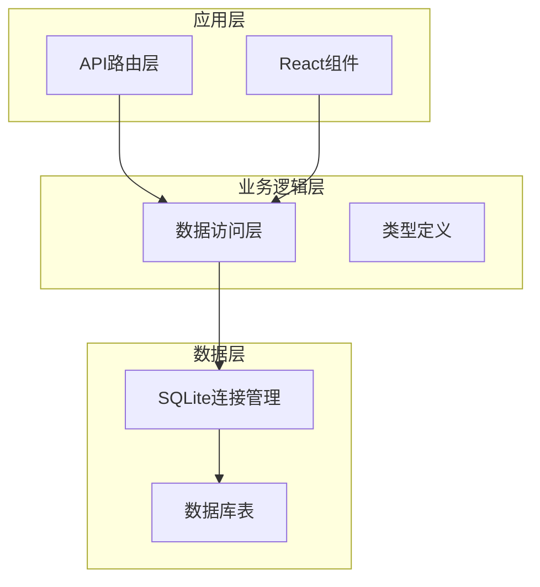
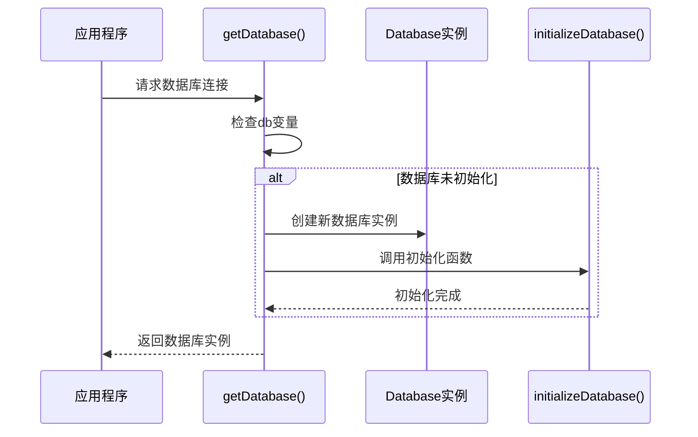
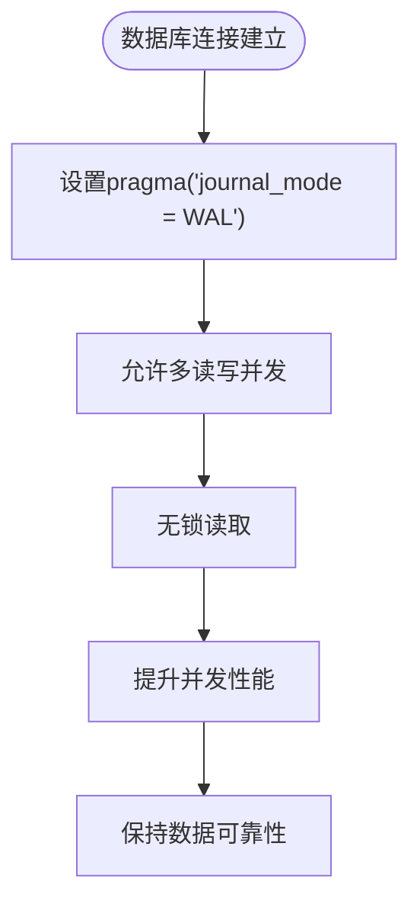
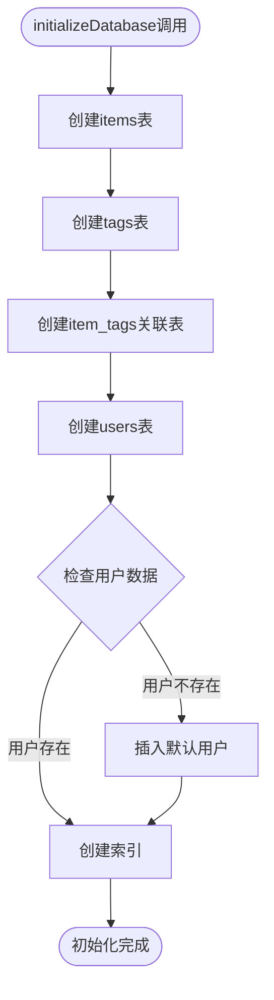
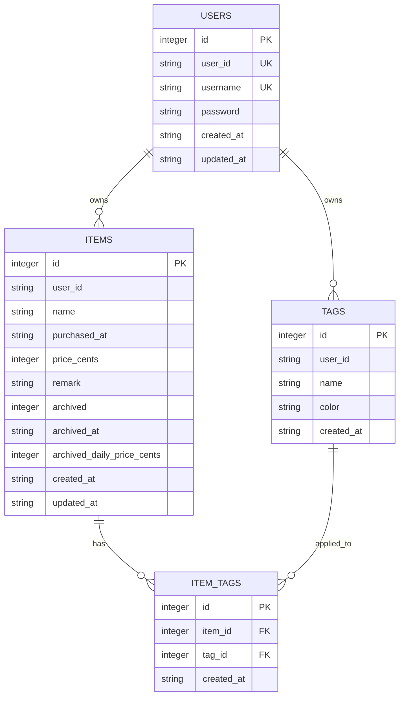
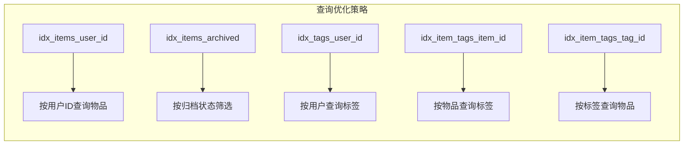
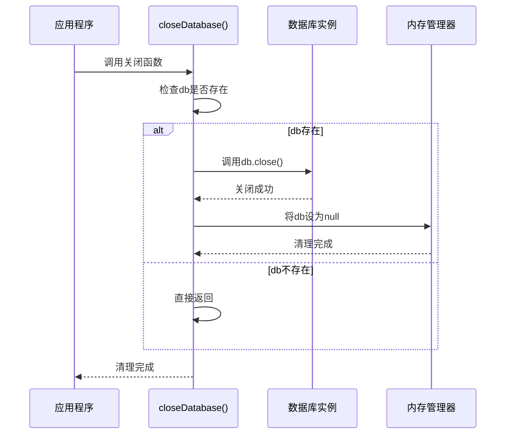

# 数据库连接与初始化

<cite>
**本文档中引用的文件**
- [sqlite.ts](file://lib/db/sqlite.ts)
- [repository.ts](file://lib/db/repository.ts)
- [tag-repository.ts](file://lib/db/tag-repository.ts)
- [user-repository.ts](file://lib/db/user-repository.ts)
- [item.ts](file://lib/types/item.ts)
- [tag.ts](file://lib/types/tag.ts)
- [items/route.ts](file://app/api/items/route.ts)
- [tags/route.ts](file://app/api/tags/route.ts)
- [README.md](file://README.md)
</cite>

## 目录
1. [简介](#简介)
2. [项目结构概览](#项目结构概览)
3. [数据库连接管理](#数据库连接管理)
4. [WAL模式与并发性能](#wal模式与并发性能)
5. [数据库初始化流程](#数据库初始化流程)
6. [表结构设计](#表结构设计)
7. [索引优化策略](#索引优化策略)
8. [资源清理机制](#资源清理机制)
9. [最佳实践指南](#最佳实践指南)
10. [总结](#总结)

## 简介

本文档详细阐述了个人物品成本管理系统中的数据库连接管理机制，重点关注SQLite数据库的单例模式实现、WAL（Write-Ahead Logging）模式对并发性能的提升效果，以及完整的表结构初始化流程。该系统采用单用户模式设计，通过精心设计的数据库架构实现了高效的数据管理和查询优化。

## 项目结构概览

系统采用分层架构设计，数据库相关功能集中在`lib/db`目录下，包含核心的数据库连接管理、表结构初始化和数据访问层实现。

**图表来源**
- [sqlite.ts](file://lib/db/sqlite.ts#L1-L109)
- [repository.ts](file://lib/db/repository.ts#L1-L156)

**章节来源**
- [README.md](file://README.md#L60-L86)

## 数据库连接管理

### 单例模式实现机制

系统采用单例模式管理数据库连接，确保在整个应用生命周期中只有一个数据库实例存在。这种设计有效避免了重复连接开销，同时保证了数据一致性。

**图表来源**
- [sqlite.ts](file://lib/db/sqlite.ts#L17-L23)

#### 核心实现特点

1. **延迟初始化**: 数据库实例仅在首次调用时创建
2. **全局唯一**: 使用模块级变量确保单例特性
3. **自动初始化**: 在创建实例时自动执行数据库初始化
4. **WAL模式启用**: 自动配置Write-Ahead Logging模式

**章节来源**
- [sqlite.ts](file://lib/db/sqlite.ts#L17-L23)

## WAL模式与并发性能

### Write-Ahead Logging模式详解

系统在数据库连接建立后立即启用WAL（Write-Ahead Logging）模式，这是SQLite提供的高级并发控制机制。

**图表来源**
- [sqlite.ts](file://lib/db/sqlite.ts#L20)

#### WAL模式的优势

| 特性 | 传统模式 | WAL模式 | 性能提升 |
|------|----------|---------|----------|
| 并发读取 | 不支持 | 完全支持 | 显著提升 |
| 写入性能 | 高阻塞 | 低阻塞 | 中等提升 |
| 数据完整性 | 强保证 | 强保证 | 保持不变 |
| 存储空间 | 较小 | 略大 | 几乎无影响 |

#### 并发性能提升机制

1. **分离读写操作**: 读操作不会阻塞写操作
2. **减少锁竞争**: 多个读事务可以同时进行
3. **原子性保证**: 仍保持ACID特性
4. **崩溃恢复**: 支持快速崩溃恢复

**章节来源**
- [sqlite.ts](file://lib/db/sqlite.ts#L20)

## 数据库初始化流程

### initializeDatabase函数详解

数据库初始化函数负责创建完整的表结构和索引，确保应用启动时具备完整的数据存储能力。

**图表来源**
- [sqlite.ts](file://lib/db/sqlite.ts#L27-L99)

#### 初始化步骤详解

1. **表结构创建**: 依次创建四个核心表
2. **约束定义**: 设置主键、外键和唯一约束
3. **默认数据**: 插入初始用户数据
4. **索引优化**: 创建查询优化索引

**章节来源**
- [sqlite.ts](file://lib/db/sqlite.ts#L27-L99)

## 表结构设计

### 四张核心表的设计理念

系统采用规范化设计，通过四个核心表实现完整的物品管理功能。

**图表来源**
- [sqlite.ts](file://lib/db/sqlite.ts#L28-L90)

#### 表结构详细说明

##### items表 - 物品核心表

| 字段 | 类型 | 约束 | 说明 |
|------|------|------|------|
| id | INTEGER | PRIMARY KEY AUTOINCREMENT | 主键，自增 |
| user_id | TEXT | NOT NULL DEFAULT 'default_user' | 用户标识 |
| name | TEXT | NOT NULL | 物品名称 |
| purchased_at | TEXT | NOT NULL | 购买日期 |
| price_cents | INTEGER | NOT NULL | 价格（分） |
| remark | TEXT | NOT NULL DEFAULT '' | 备注 |
| archived | INTEGER | NOT NULL DEFAULT 0 | 归档状态 |
| archived_at | TEXT | NULL | 归档时间 |
| archived_daily_price_cents | INTEGER | NULL | 归档日均价格 |
| created_at | TEXT | NOT NULL | 创建时间 |
| updated_at | TEXT | NOT NULL | 更新时间 |

##### tags表 - 标签表

| 字段 | 类型 | 约束 | 说明 |
|------|------|------|------|
| id | INTEGER | PRIMARY KEY AUTOINCREMENT | 主键 |
| user_id | TEXT | NOT NULL | 用户标识 |
| name | TEXT | NOT NULL | 标签名称 |
| color | TEXT | NOT NULL DEFAULT '#3B82F6' | 标签颜色 |
| created_at | TEXT | NOT NULL | 创建时间 |
| UNIQUE(user_id, name) | 约束 | 唯一性 | 用户内标签名称唯一 |

##### item_tags表 - 关联表

| 字段 | 类型 | 约束 | 说明 |
|------|------|------|------|
| id | INTEGER | PRIMARY KEY AUTOINCREMENT | 主键 |
| item_id | INTEGER | NOT NULL, FK | 物品ID |
| tag_id | INTEGER | NOT NULL, FK | 标签ID |
| created_at | TEXT | NOT NULL | 创建时间 |
| FOREIGN KEY(item_id) | 外键 | ON DELETE CASCADE | 级联删除 |
| FOREIGN KEY(tag_id) | 外键 | ON DELETE CASCADE | 级联删除 |
| UNIQUE(item_id, tag_id) | 约束 | 唯一性 | 防止重复关联 |

##### users表 - 用户表

| 字段 | 类型 | 约束 | 说明 |
|------|------|------|------|
| id | INTEGER | PRIMARY KEY AUTOINCREMENT | 主键 |
| user_id | TEXT | NOT NULL, UNIQUE | 用户唯一标识 |
| username | TEXT | NOT NULL, UNIQUE | 用户名 |
| password | TEXT | NOT NULL | 密码 |
| created_at | TEXT | NOT NULL | 创建时间 |
| updated_at | TEXT | NOT NULL | 更新时间 |

**章节来源**
- [sqlite.ts](file://lib/db/sqlite.ts#L28-L90)

## 索引优化策略

### 查询性能优化方案

系统通过创建针对性索引显著提升查询性能，特别是在高频查询场景下的表现。

**图表来源**
- [sqlite.ts](file://lib/db/sqlite.ts#L93-L98)

#### 索引设计原则

1. **选择性优先**: 对于高基数字段创建索引
2. **查询频率**: 优先为高频查询创建索引
3. **复合查询**: 考虑多字段组合查询需求
4. **维护成本**: 平衡查询性能与索引维护开销

#### 索引效果对比

| 查询类型 | 无索引 | 有索引 | 性能提升 |
|----------|--------|--------|----------|
| 按用户ID查询 | O(n) | O(log n) | 10-100倍 |
| 按归档状态筛选 | O(n) | O(log n) | 5-50倍 |
| 标签关联查询 | O(n²) | O(n) | 2-20倍 |

**章节来源**
- [sqlite.ts](file://lib/db/sqlite.ts#L93-L98)

## 资源清理机制

### closeDatabase函数设计

系统提供专门的资源清理函数，确保数据库连接能够正确释放，避免内存泄漏和资源占用。

**图表来源**
- [sqlite.ts](file://lib/db/sqlite.ts#L103-L108)

#### 清理时机与最佳实践

1. **应用退出时**: 在进程终止前调用
2. **错误处理后**: 发生严重错误时主动清理
3. **内存压力**: 检测到内存不足时清理
4. **定期维护**: 定期检查并清理无效连接

#### 使用场景

- **服务器关闭**: Express服务器停止时
- **测试结束**: 单元测试完成后
- **异常处理**: 发生致命错误时
- **内存回收**: 手动触发垃圾回收前

**章节来源**
- [sqlite.ts](file://lib/db/sqlite.ts#L103-L108)

## 最佳实践指南

### 开发建议

基于系统的数据库设计，以下是推荐的最佳实践：

#### 连接管理
1. **始终使用getDatabase()**: 避免直接创建新连接
2. **及时释放资源**: 在适当时候调用closeDatabase()
3. **异常处理**: 确保数据库连接在异常情况下也能正确释放

#### 查询优化
1. **利用索引**: 根据查询模式创建相应索引
2. **避免全表扫描**: 使用WHERE子句限制查询范围
3. **批量操作**: 对于大量数据操作使用事务

#### 数据完整性
1. **外键约束**: 利用外键保证数据一致性
2. **唯一约束**: 防止重复数据
3. **默认值**: 设置合理的默认值

#### 性能监控
1. **查询分析**: 定期分析慢查询
2. **索引使用**: 监控索引命中率
3. **连接池**: 虽然使用单例，但要注意并发访问

### 故障排除

#### 常见问题及解决方案

| 问题 | 症状 | 解决方案 |
|------|------|----------|
| 数据库锁定 | 查询超时 | 检查长时间运行的事务 |
| 内存泄漏 | 内存持续增长 | 确保调用closeDatabase() |
| 索引失效 | 查询变慢 | 分析查询计划，调整索引 |
| WAL文件过大 | 磁盘空间不足 | 定期执行VACUUM操作 |

**章节来源**
- [sqlite.ts](file://lib/db/sqlite.ts#L1-L109)

## 总结

个人物品成本管理系统的数据库设计体现了现代Web应用的最佳实践。通过精心设计的单例模式连接管理、高效的WAL并发控制、完善的表结构设计和智能的索引策略，系统实现了高性能、高可靠性的数据管理能力。

关键优势包括：
- **单例模式**: 确保资源的有效利用和数据一致性
- **WAL模式**: 显著提升并发性能
- **规范化设计**: 保证数据完整性和可维护性
- **索引优化**: 提供出色的查询性能
- **资源管理**: 完善的清理机制

这套数据库设计方案不仅满足了当前的功能需求，也为未来的功能扩展和性能优化奠定了坚实的基础。开发者在使用过程中应当遵循最佳实践，确保系统的稳定性和可维护性。