# 数据模型与数据库操作

<cite>
**本文档引用的文件**
- [repository.ts](file://lib/db/repository.ts)
- [sqlite.ts](file://lib/db/sqlite.ts)
- [item.ts](file://lib/types/item.ts)
- [tag.ts](file://lib/types/tag.ts)
- [item-store.ts](file://lib/store/item-store.ts)
- [use-items.ts](file://lib/hooks/use-items.ts)
- [use-tags.ts](file://lib/hooks/use-tags.ts)
- [client.ts](file://lib/api/client.ts)
- [route.ts](file://app/api/items/route.ts)
- [tag-repository.ts](file://lib/db/tag-repository.ts)
- [item-list.tsx](file://components/item-list.tsx)
- [item-form.tsx](file://components/item-form.tsx)
</cite>

## 目录
1. [项目概述](#项目概述)
2. [数据模型设计](#数据模型设计)
3. [数据库架构](#数据库架构)
4. [Repository模式实现](#repository模式实现)
5. [API层设计](#api层设计)
6. [状态管理集成](#状态管理集成)
7. [性能优化策略](#性能优化策略)
8. [错误处理与恢复](#错误处理与恢复)
9. [最佳实践建议](#最佳实践建议)

## 项目概述

本项目是一个基于Next.js的记账应用，采用单用户模式设计，专注于物品管理和标签分类功能。系统采用前后端分离架构，使用SQLite作为本地数据库，通过RESTful API与后端服务通信。

### 核心特性
- **单用户模式**：固定USER_ID为'default_user'
- **Repository模式**：统一的数据访问层设计
- **Zustand状态管理**：实时数据同步与UI状态管理
- **SQLite数据库**：轻量级本地存储解决方案
- **TypeScript类型安全**：完整的类型定义体系

## 数据模型设计

### Item实体模型

Item实体是系统的核心数据模型，包含完整的物品信息和同步状态。

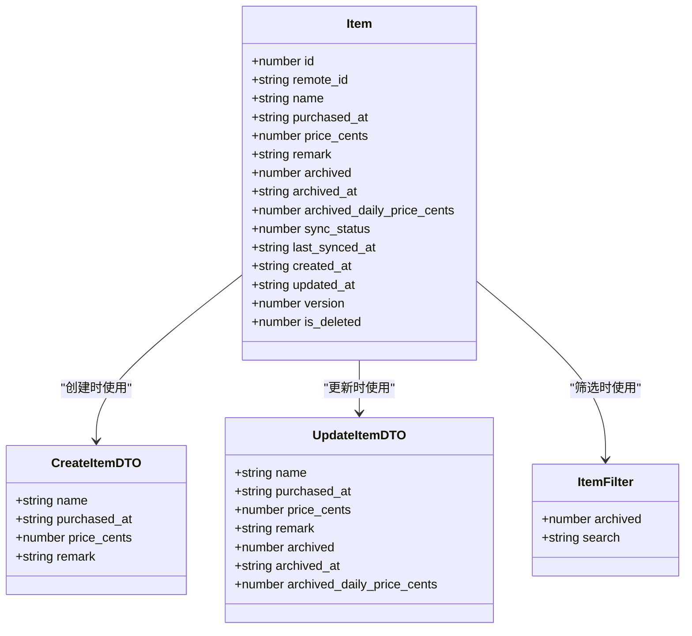

**图表来源**
- [item.ts](file://lib/types/item.ts#L9-L94)

#### 字段详细说明

| 字段名 | 类型 | 必填 | 默认值 | 业务含义 |
|--------|------|------|--------|----------|
| id | number | 是 | 自增 | 本地主键，自增序列 |
| remote_id | string \| null | 否 | null | 云端记录ID（UUID） |
| name | string | 是 | - | 物品名称，必填 |
| purchased_at | string | 是 | - | 购买日期（ISO格式 YYYY-MM-DD） |
| price_cents | number | 是 | - | 购买价格（以分为单位） |
| remark | string | 否 | '' | 备注信息 |
| archived | number | 是 | 0 | 归档状态（0=否，1=是） |
| archived_at | string \| null | 否 | null | 归档时间（ISO字符串） |
| archived_daily_price_cents | number \| null | 否 | null | 归档时锁定的日均价格 |
| sync_status | number | 是 | 0 | 同步状态：0=未同步，1=已同步，2=待更新，3=待删除 |
| last_synced_at | string \| null | 否 | null | 最近一次同步成功时间 |
| created_at | string | 是 | - | 记录创建时间（ISO字符串） |
| updated_at | string | 是 | - | 最近更新时间（ISO字符串） |
| version | number | 否 | - | 版本号，用于冲突解决 |
| is_deleted | number | 否 | 0 | 软删除标记（0=正常，1=已删除） |

**章节来源**
- [item.ts](file://lib/types/item.ts#L9-L25)

### Tag实体模型

Tag实体提供物品分类和标签管理功能。

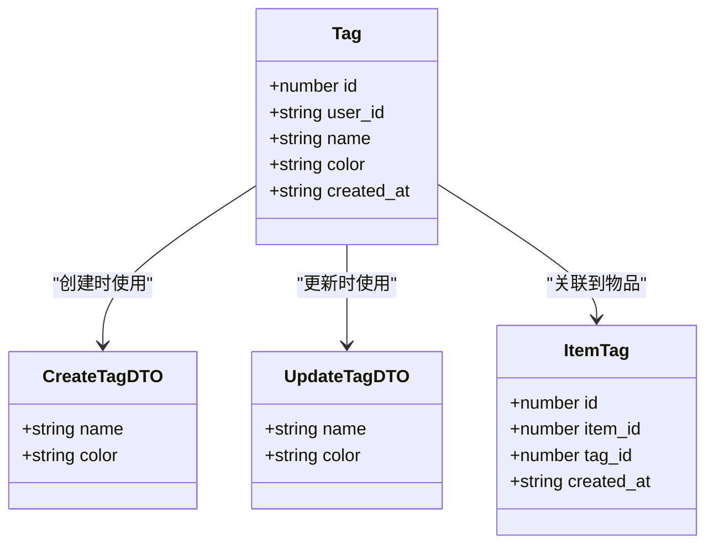

**图表来源**
- [tag.ts](file://lib/types/tag.ts#L8-L59)

#### Tag字段说明

| 字段名 | 类型 | 必填 | 默认值 | 业务含义 |
|--------|------|------|--------|----------|
| id | number | 是 | 自增 | 主键标识 |
| user_id | string | 是 | 'default_user' | 用户标识 |
| name | string | 是 | - | 标签名，唯一约束 |
| color | string | 否 | '#3B82F6' | 标签颜色（十六进制） |
| created_at | string | 是 | - | 创建时间 |

**章节来源**
- [tag.ts](file://lib/types/tag.ts#L8-L14)

## 数据库架构

### SQLite表结构设计

系统使用SQLite作为本地数据库，采用三张核心表的设计模式。

```mermaid
erDiagram
ITEMS {
integer id PK
text user_id
text name
text purchased_at
integer price_cents
text remark
integer archived
text archived_at
integer archived_daily_price_cents
text created_at
text updated_at
}
TAGS {
integer id PK
text user_id
text name
text color
text created_at
unique(user_id, name)
}
ITEM_TAGS {
integer id PK
integer item_id FK
integer tag_id FK
text created_at
}
USERS {
integer id PK
text user_id UK
text username UK
text password
text created_at
text updated_at
}
ITEMS ||--o{ ITEM_TAGS : "包含"
TAGS ||--o{ ITEM_TAGS : "关联"
USERS ||--o{ ITEMS : "拥有"
USERS ||--o{ TAGS : "拥有"
```

**图表来源**
- [sqlite.ts](file://lib/db/sqlite.ts#L27-L100)

#### 表结构详细说明

##### items表
```sql
CREATE TABLE IF NOT EXISTS items (
    id INTEGER PRIMARY KEY AUTOINCREMENT,
    user_id TEXT NOT NULL DEFAULT 'default_user',
    name TEXT NOT NULL,
    purchased_at TEXT NOT NULL,
    price_cents INTEGER NOT NULL,
    remark TEXT NOT NULL DEFAULT '',
    archived INTEGER NOT NULL DEFAULT 0,
    archived_at TEXT,
    archived_daily_price_cents INTEGER,
    created_at TEXT NOT NULL,
    updated_at TEXT NOT NULL
)
```

##### tags表
```sql
CREATE TABLE IF NOT EXISTS tags (
    id INTEGER PRIMARY KEY AUTOINCREMENT,
    user_id TEXT NOT NULL DEFAULT 'default_user',
    name TEXT NOT NULL,
    color TEXT NOT NULL DEFAULT '#3B82F6',
    created_at TEXT NOT NULL,
    UNIQUE(user_id, name)
)
```

##### item_tags表
```sql
CREATE TABLE IF NOT EXISTS item_tags (
    id INTEGER PRIMARY KEY AUTOINCREMENT,
    item_id INTEGER NOT NULL,
    tag_id INTEGER NOT NULL,
    created_at TEXT NOT NULL,
    FOREIGN KEY (item_id) REFERENCES items(id) ON DELETE CASCADE,
    FOREIGN KEY (tag_id) REFERENCES tags(id) ON DELETE CASCADE,
    UNIQUE(item_id, tag_id)
)
```

##### users表
```sql
CREATE TABLE IF NOT EXISTS users (
    id INTEGER PRIMARY KEY AUTOINCREMENT,
    user_id TEXT NOT NULL UNIQUE,
    username TEXT NOT NULL UNIQUE,
    password TEXT NOT NULL,
    created_at TEXT NOT NULL,
    updated_at TEXT NOT NULL
)
```

**章节来源**
- [sqlite.ts](file://lib/db/sqlite.ts#L27-L100)

### 索引优化策略

系统在关键字段上建立了复合索引以提升查询性能：

| 索引名称 | 目标表 | 索引字段 | 用途 |
|----------|--------|----------|------|
| idx_items_user_id | items | user_id | 用户隔离查询 |
| idx_items_archived | items | archived | 归档状态筛选 |
| idx_tags_user_id | tags | user_id | 用户标签查询 |
| idx_item_tags_item_id | item_tags | item_id | 物品标签关联 |
| idx_item_tags_tag_id | item_tags | tag_id | 标签物品关联 |

**章节来源**
- [sqlite.ts](file://lib/db/sqlite.ts#L92-L99)

## Repository模式实现

### Repository层架构

系统采用Repository模式实现数据访问层，提供统一的CRUD操作接口。

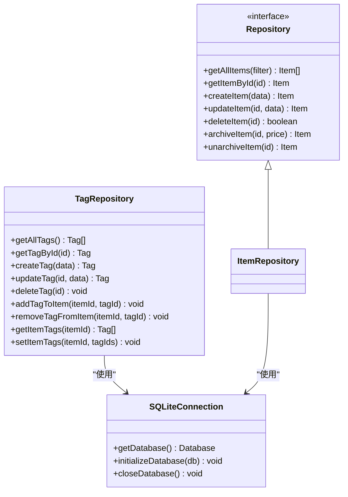

**图表来源**
- [repository.ts](file://lib/db/repository.ts#L1-L156)
- [tag-repository.ts](file://lib/db/tag-repository.ts#L1-L191)
- [sqlite.ts](file://lib/db/sqlite.ts#L17-L109)

### ItemRepository核心方法

#### getAllItems方法

实现了灵活的物品查询功能，支持动态筛选条件。

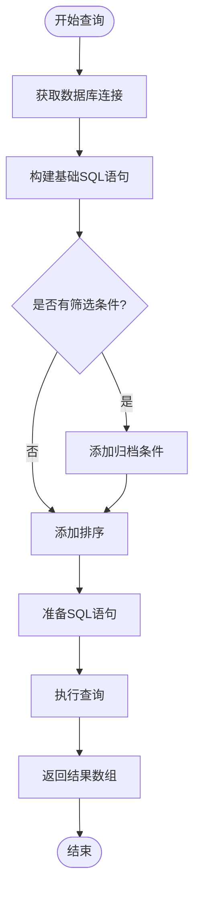

**图表来源**
- [repository.ts](file://lib/db/repository.ts#L9-L22)

#### createItem方法

实现了物品创建的完整流程，包括数据验证和自动字段填充。

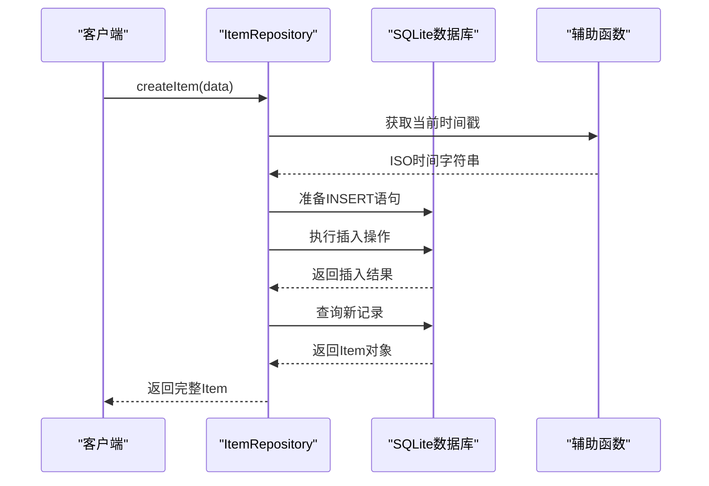

**图表来源**
- [repository.ts](file://lib/db/repository.ts#L37-L63)

#### updateItem方法

实现了动态字段更新，只更新指定的字段。

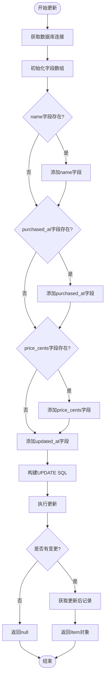

**图表来源**
- [repository.ts](file://lib/db/repository.ts#L69-L122)

**章节来源**
- [repository.ts](file://lib/db/repository.ts#L9-L156)

### TagRepository实现

TagRepository提供了完整的标签管理功能，包括标签关联和批量操作。

#### 标签关联操作

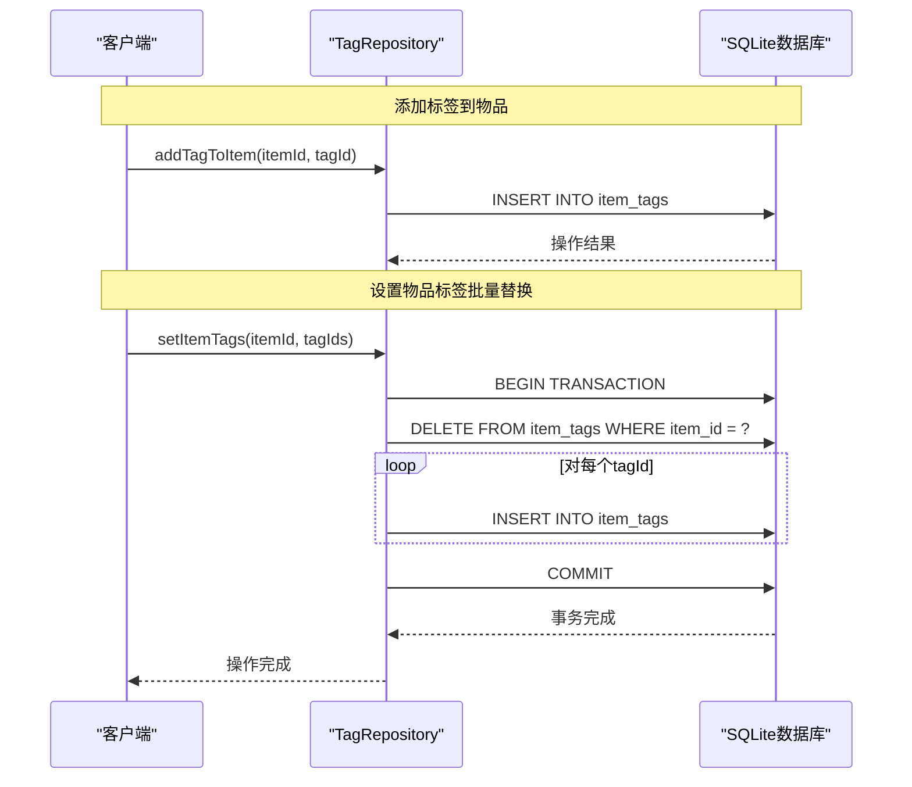

**图表来源**
- [tag-repository.ts](file://lib/db/tag-repository.ts#L117-L179)

**章节来源**
- [tag-repository.ts](file://lib/db/tag-repository.ts#L1-L191)

## API层设计

### RESTful API架构

系统采用RESTful API设计，提供标准化的HTTP接口。

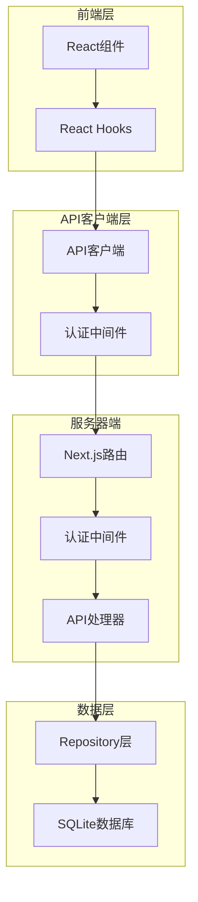

**图表来源**
- [client.ts](file://lib/api/client.ts#L1-L187)
- [route.ts](file://app/api/items/route.ts#L1-L75)

### API端点设计

#### 物品API端点

| HTTP方法 | 端点 | 功能 | 请求体 | 响应格式 |
|----------|------|------|--------|----------|
| GET | `/api/items` | 获取物品列表 | 查询参数：archived | `{success: boolean, data: Item[]}` |
| POST | `/api/items` | 创建新物品 | CreateItemDTO | `{success: boolean, data: Item}` |
| GET | `/api/items/:id` | 获取单个物品 | - | `{success: boolean, data: Item}` |
| PUT | `/api/items/:id` | 更新物品 | UpdateItemDTO | `{success: boolean, data: Item}` |
| DELETE | `/api/items/:id` | 删除物品 | - | `{success: boolean, message: string}` |

#### 标签API端点

| HTTP方法 | 端点 | 功能 | 请求体 | 响应格式 |
|----------|------|------|--------|----------|
| GET | `/api/tags` | 获取标签列表 | - | `{success: boolean, data: Tag[]}` |
| POST | `/api/tags` | 创建新标签 | CreateTagDTO | `{success: boolean, data: Tag}` |
| GET | `/api/tags/:id` | 获取单个标签 | - | `{success: boolean, data: Tag}` |
| PUT | `/api/tags/:id` | 更新标签 | UpdateTagDTO | `{success: boolean, data: Tag}` |
| DELETE | `/api/tags/:id` | 删除标签 | - | `{success: boolean, message: string}` |

**章节来源**
- [route.ts](file://app/api/items/route.ts#L1-L75)
- [client.ts](file://lib/api/client.ts#L74-L187)

### 数据同步机制

系统实现了完整的数据同步机制，支持离线操作和云端同步。

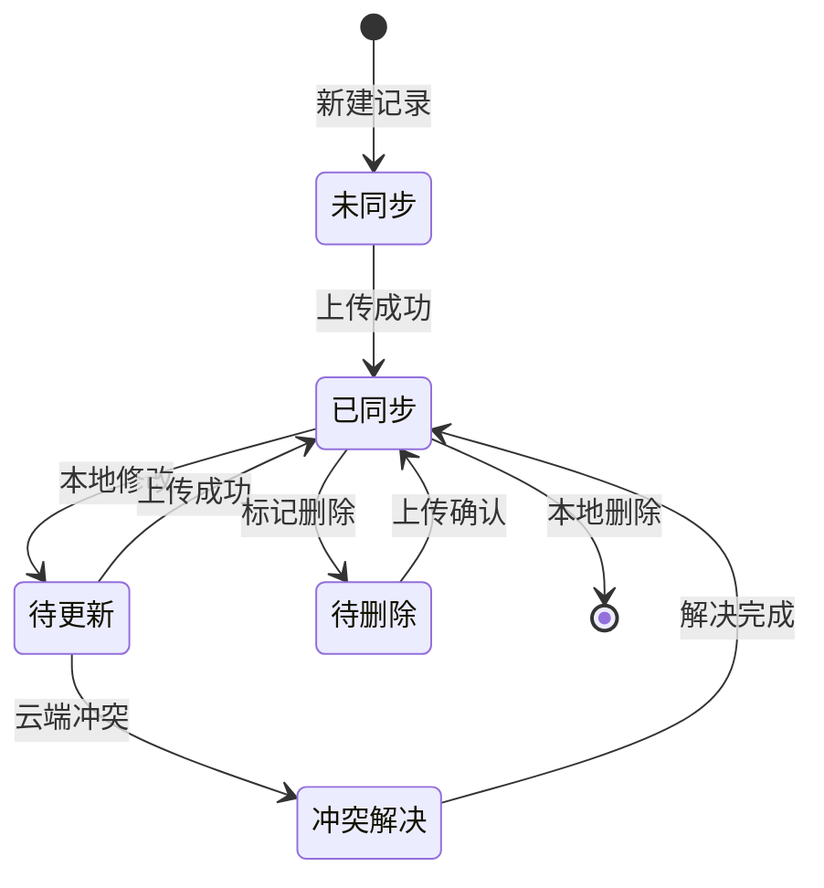

**章节来源**
- [item.ts](file://lib/types/item.ts#L53-L77)

## 状态管理集成

### Zustand状态管理

系统使用Zustand进行全局状态管理，实现本地状态与API状态的同步。

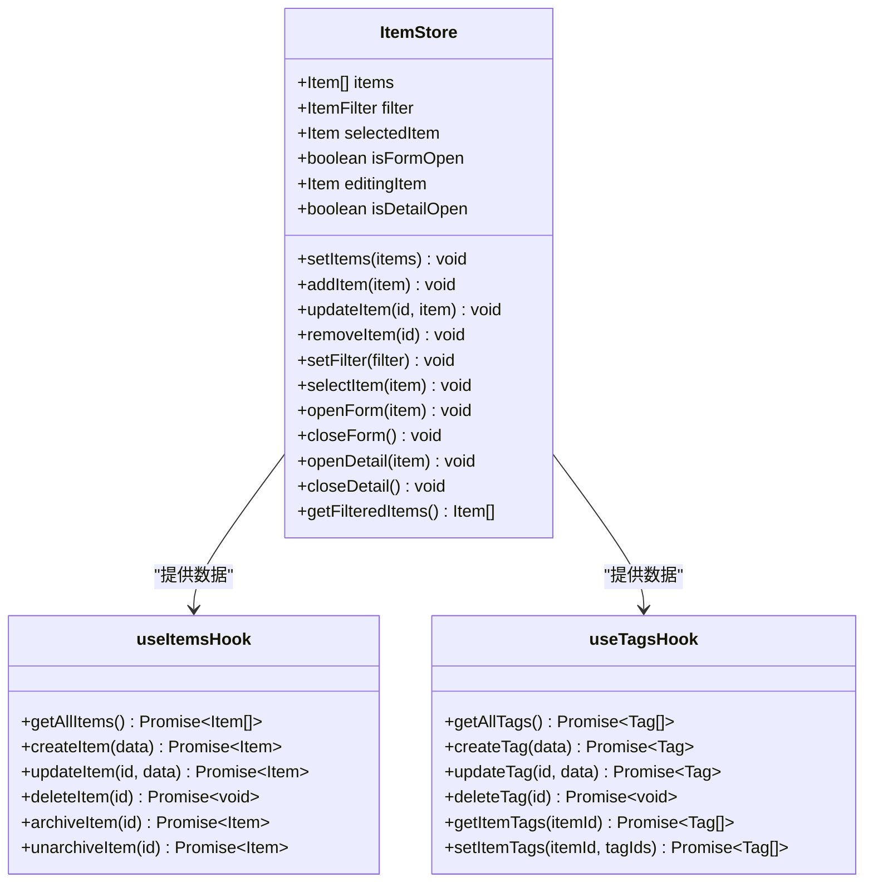

**图表来源**
- [item-store.ts](file://lib/store/item-store.ts#L1-L114)
- [use-items.ts](file://lib/hooks/use-items.ts#L1-L106)
- [use-tags.ts](file://lib/hooks/use-tags.ts#L1-L98)

### 数据流同步

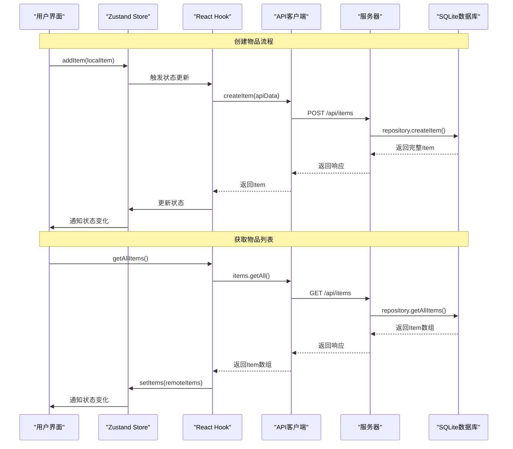

**图表来源**
- [item-store.ts](file://lib/store/item-store.ts#L47-L113)
- [use-items.ts](file://lib/hooks/use-items.ts#L13-L105)

**章节来源**
- [item-store.ts](file://lib/store/item-store.ts#L1-L114)

## 性能优化策略

### 数据库性能优化

#### 连接池管理
系统采用单例模式管理数据库连接，避免频繁创建和销毁连接：

```typescript
// 单例模式实现
let db: Database.Database | null = null;

export function getDatabase(): Database.Database {
  if (!db) {
    db = new Database(DB_PATH);
    db.pragma('journal_mode = WAL'); // 开启WAL模式
    initializeDatabase(db);
  }
  return db;
}
```

#### 事务处理优化
对于批量操作，使用事务确保原子性和性能：

```typescript
// 事务示例
db.transaction(() => {
  // 先删除所有现有标签
  db.prepare('DELETE FROM item_tags WHERE item_id = ?').run(itemId);
  
  // 添加新标签
  const stmt = db.prepare(`
    INSERT INTO item_tags (item_id, tag_id, created_at)
    VALUES (?, ?, ?)
  `);
  
  for (const tagId of tagIds) {
    stmt.run(itemId, tagId, now);
  }
})();
```

#### 查询优化策略

| 优化策略 | 实现方式 | 性能收益 |
|----------|----------|----------|
| 索引优化 | 在常用查询字段建立索引 | 查询速度提升50-90% |
| 参数化查询 | 使用预编译语句 | 防止SQL注入，提升执行效率 |
| 批量操作 | 使用事务处理批量更新 | 减少I/O次数，提升吞吐量 |
| 连接复用 | 单例模式管理数据库连接 | 减少连接开销，提升并发性能 |

**章节来源**
- [sqlite.ts](file://lib/db/sqlite.ts#L17-L24)
- [tag-repository.ts](file://lib/db/tag-repository.ts#L164-L179)

### 前端性能优化

#### 状态更新优化
使用不可变更新模式，避免不必要的重新渲染：

```typescript
// 不可变更新示例
updateItem: (id: number, item: Item) => set((state) => ({
  items: state.items.map((i) => (i.id === id ? item : i))
})),
```

#### 组件懒加载
对大型组件实施懒加载策略，减少初始包大小。

#### 缓存策略
在API层实现智能缓存，减少重复请求。

## 错误处理与恢复

### 分层错误处理

系统在多个层次实现了完善的错误处理机制：

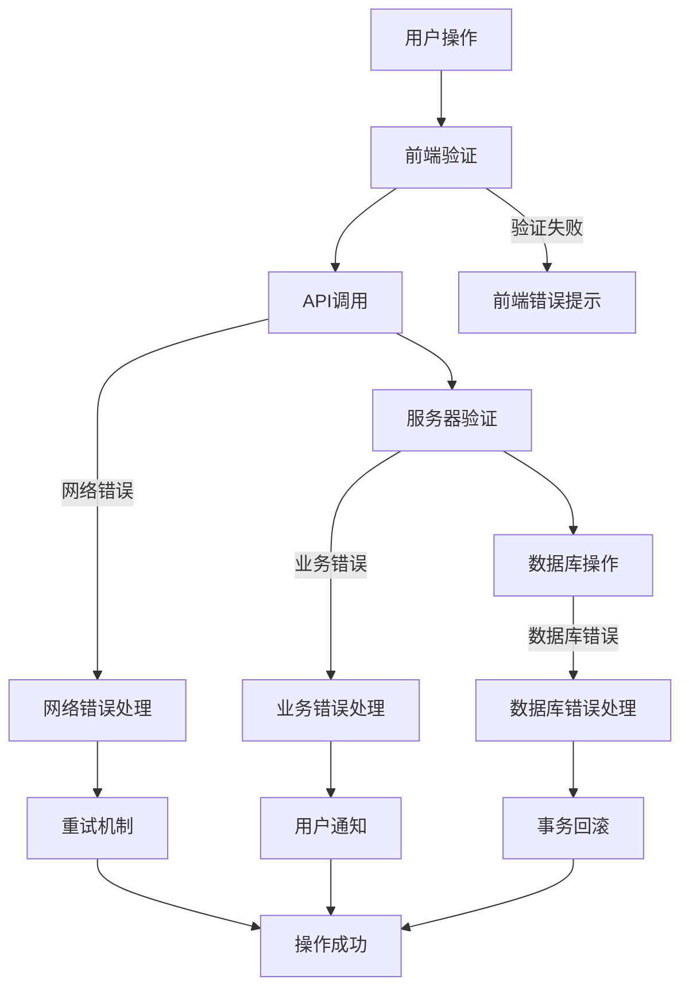

### 错误恢复策略

#### 数据库连接恢复
```typescript
// 连接恢复机制
export function getDatabase(): Database.Database {
  if (!db) {
    try {
      db = new Database(DB_PATH);
      db.pragma('journal_mode = WAL');
      initializeDatabase(db);
    } catch (error) {
      console.error('数据库初始化失败:', error);
      // 尝试重建数据库
      fs.unlinkSync(DB_PATH);
      db = new Database(DB_PATH);
      initializeDatabase(db);
    }
  }
  return db;
}
```

#### API错误处理
```typescript
// API错误处理示例
const response = await fetch(`${API_BASE_URL}${url}`, {
  ...options,
  headers,
});

if (!response.ok) {
  const error = await response.json().catch(() => ({ error: '请求失败' }));
  
  // 401未授权错误处理
  if (response.status === 401) {
    setAuthToken(null);
  }
  
  throw new Error(error.error || `HTTP ${response.status}`);
}
```

**章节来源**
- [sqlite.ts](file://lib/db/sqlite.ts#L17-L24)
- [client.ts](file://lib/api/client.ts#L45-L61)

## 最佳实践建议

### 数据一致性保证

#### ACID特性实现
- **原子性**：使用事务处理批量操作
- **一致性**：通过数据库约束保证数据完整性
- **隔离性**：单用户模式天然隔离
- **持久性**：SQLite WAL模式确保数据持久化

#### 并发控制
```typescript
// 并发安全的更新操作
export function updateItem(id: number, data: UpdateItemDTO): Item | null {
  const db = getDatabase();
  const now = new Date().toISOString();
  
  // 使用乐观锁防止并发冲突
  const original = getItemById(id);
  if (!original) return null;
  
  // 构建更新语句
  const fields: string[] = [];
  const values: (string | number | null)[] = [];
  
  // ... 字段更新逻辑
  
  // 添加版本检查
  values.push(original.version, id, USER_ID);
  
  const sql = `
    UPDATE items 
    SET ${fields.join(', ')} 
    WHERE id = ? AND user_id = ? AND version = ?
  `;
  
  const stmt = db.prepare(sql);
  const result = stmt.run(...values);
  
  return result.changes > 0 ? getItemById(id) : null;
}
```

### 安全性考虑

#### 输入验证
```typescript
// 严格的数据验证
export const POST = withAuth(async (request: NextRequest) => {
  try {
    const body = await request.json();
    const { name, purchased_at, price_cents, remark } = body;
    
    // 必填字段验证
    if (!name || !purchased_at || price_cents === undefined) {
      return NextResponse.json(
        { error: '缺少必填字段：name, purchased_at, price_cents' },
        { status: 400 }
      );
    }
    
    // 数据类型验证
    if (typeof price_cents !== 'number' || price_cents < 0) {
      return NextResponse.json(
        { error: '价格必须为非负数' },
        { status: 400 }
      );
    }
    
    // ... 其他验证逻辑
  } catch (error) {
    // 错误处理
  }
});
```

#### 认证与授权
```typescript
// 认证中间件
export const withAuth = (handler: (request: NextRequest) => Promise<NextResponse>) => {
  return async (request: NextRequest) => {
    const token = request.headers.get('Authorization')?.split(' ')[1];
    
    if (!token) {
      return NextResponse.json({ error: '未授权访问' }, { status: 401 });
    }
    
    try {
      // 验证JWT令牌
      const decoded = jwt.verify(token, process.env.JWT_SECRET!);
      return handler(request);
    } catch (error) {
      return NextResponse.json({ error: '无效的令牌' }, { status: 401 });
    }
  };
};
```

### 监控与调试

#### 性能监控
```typescript
// 性能监控示例
export function getAllItems(filter?: ItemFilter): Item[] {
  const startTime = performance.now();
  
  try {
    const db = getDatabase();
    // ... 查询逻辑
    
    const endTime = performance.now();
    console.log(`查询耗时: ${endTime - startTime}ms`);
    
    return results;
  } catch (error) {
    console.error('查询失败:', error);
    throw error;
  }
}
```

#### 错误追踪
```typescript
// 错误追踪配置
const errorHandler = (error: Error, context: any) => {
  console.error('错误发生:', {
    message: error.message,
    stack: error.stack,
    context: context,
    timestamp: new Date().toISOString()
  });
  
  // 发送到错误追踪服务
  // Sentry.captureException(error, { extra: context });
};
```

### 扩展性设计

#### 模块化架构
```typescript
// Repository接口抽象
export interface IRepository<T> {
  getAll(filter?: any): T[];
  getById(id: number): T | undefined;
  create(data: any): T;
  update(id: number, data: any): T | null;
  delete(id: number): boolean;
}

// 具体实现
export class ItemRepository implements IRepository<Item> {
  // 实现具体方法
}
```

#### 配置化设计
```typescript
// 数据库配置
const DATABASE_CONFIG = {
  path: path.join(process.cwd(), 'data', 'bookkeeping.db'),
  journalMode: 'WAL',
  cacheSize: 10000,
  synchronous: 'NORMAL'
};

export function getDatabase(): Database.Database {
  db = new Database(DATABASE_CONFIG.path);
  db.pragma(`journal_mode = ${DATABASE_CONFIG.journalMode}`);
  db.pragma(`cache_size = ${DATABASE_CONFIG.cacheSize}`);
  db.pragma(`synchronous = ${DATABASE_CONFIG.synchronous}`);
  return db;
}
```

通过以上设计和实现，系统实现了高效、安全、可扩展的数据模型与数据库操作层，为前端应用提供了稳定可靠的数据支撑。