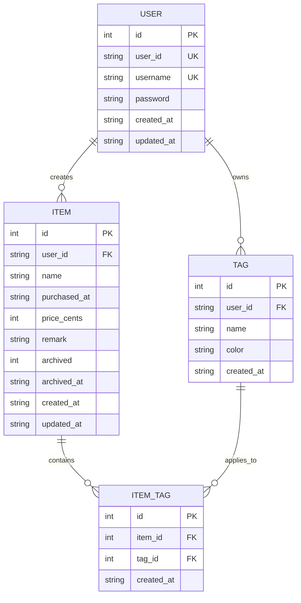
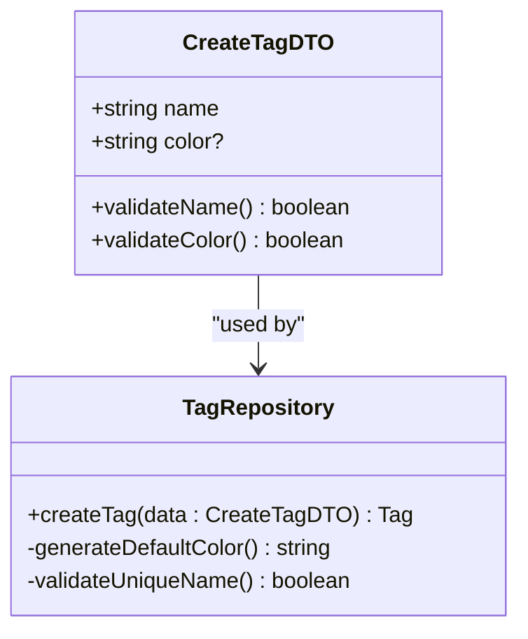
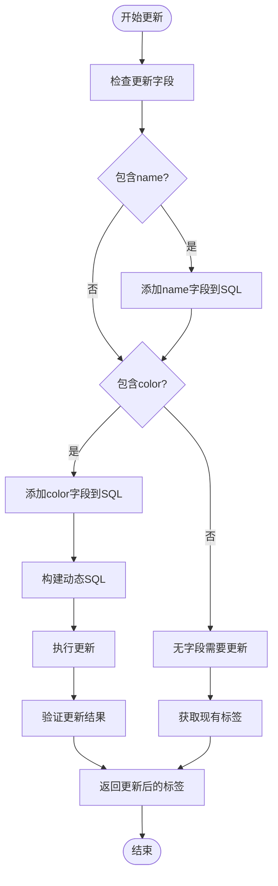
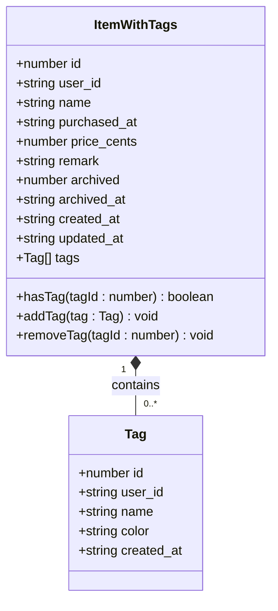
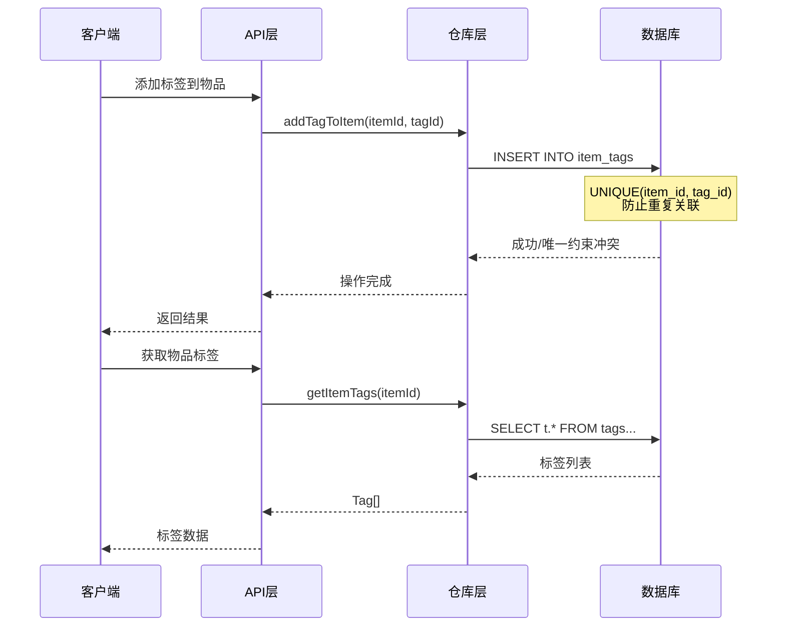
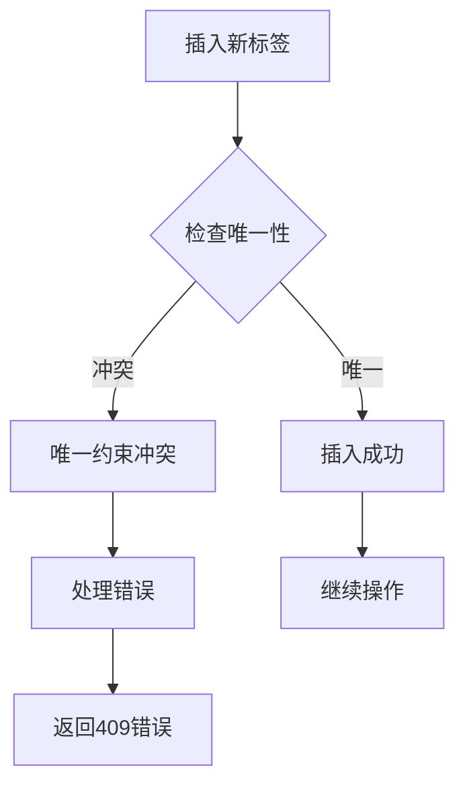
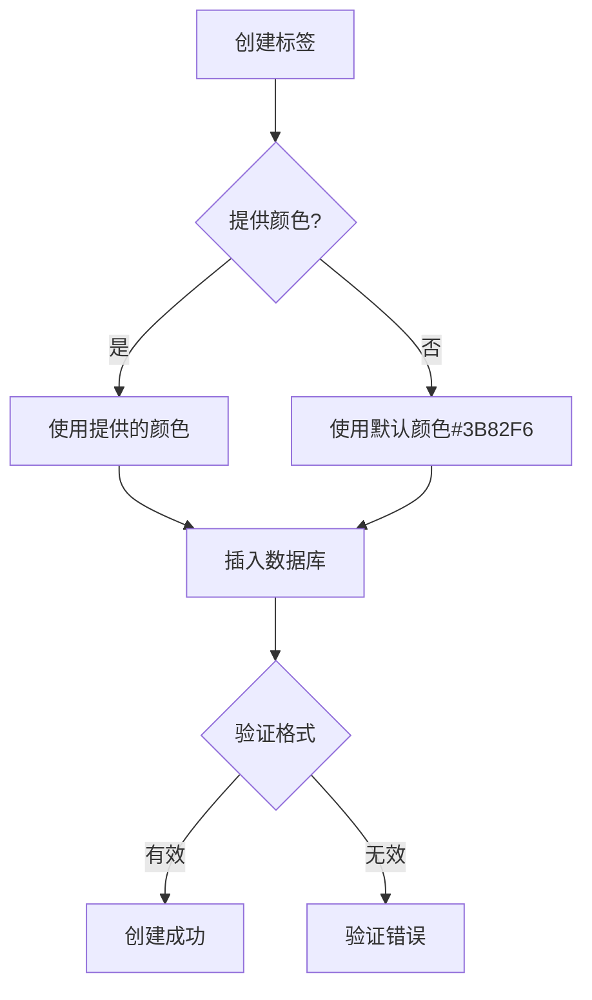
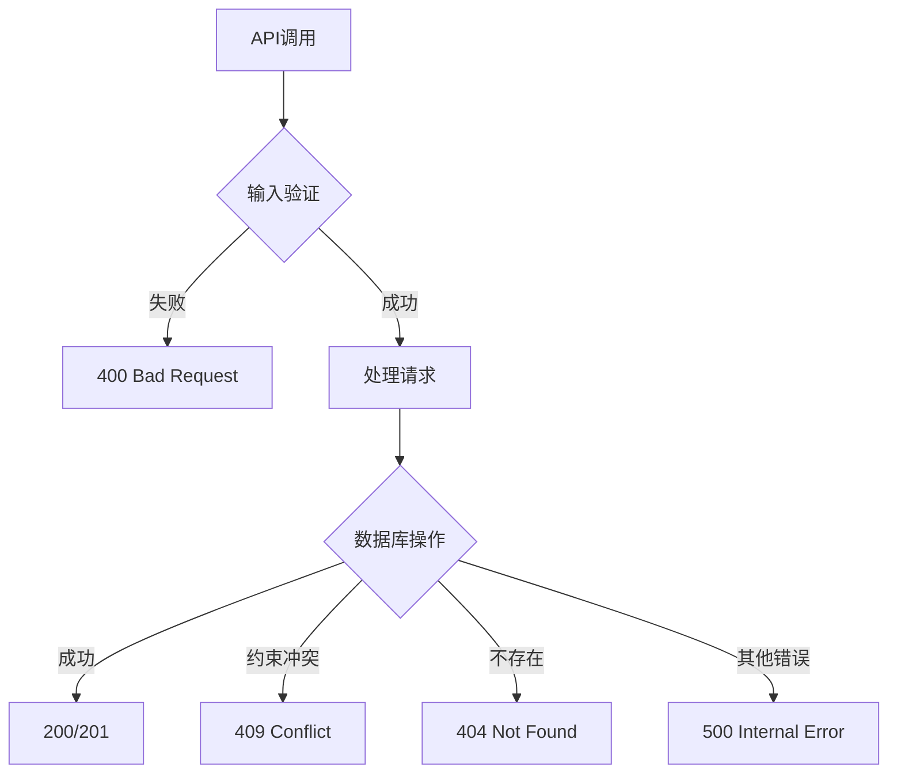
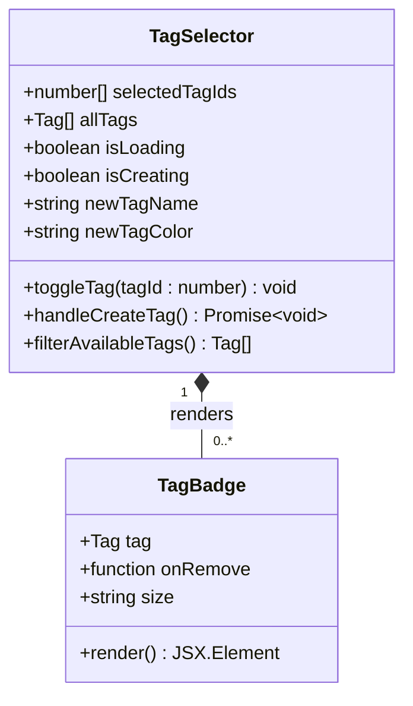
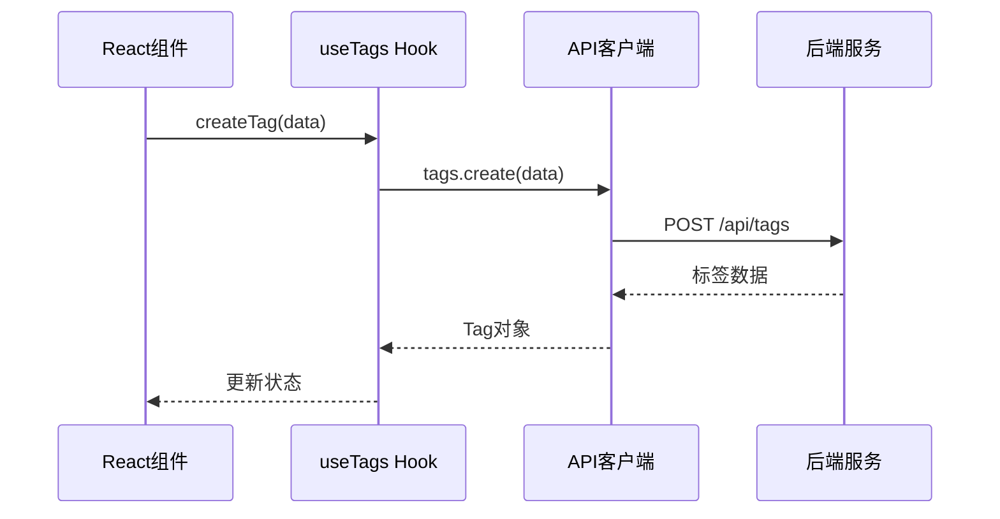

# 标签数据模型

<cite>
**本文档引用的文件**
- [tag.ts](file://lib/types/tag.ts)
- [tag-repository.ts](file://lib/db/tag-repository.ts)
- [sqlite.ts](file://lib/db/sqlite.ts)
- [route.ts](file://app/api/tags/route.ts)
- [route.ts](file://app/api/items/[id]/tags/route.ts)
- [tag-selector.tsx](file://components/tag-selector.tsx)
- [tag-badge.tsx](file://components/tag-badge.tsx)
- [use-tags.ts](file://lib/hooks/use-tags.ts)
</cite>

## 目录
1. [简介](#简介)
2. [核心数据模型](#核心数据模型)
3. [标签接口详解](#标签接口详解)
4. [DTO设计模式](#dto设计模式)
5. [复合数据结构](#复合数据结构)
6. [数据库架构](#数据库架构)
7. [多对多关系实现](#多对多关系实现)
8. [约束与验证](#约束与验证)
9. [API接口设计](#api接口设计)
10. [前端组件集成](#前端组件集成)
11. [最佳实践](#最佳实践)
12. [总结](#总结)

## 简介

标签系统是记账应用中的核心功能模块，它通过灵活的分类机制帮助用户更好地组织和管理物品记录。该系统采用TypeScript类型安全设计，基于SQLite数据库实现，支持多对多关系的物品-标签关联，并提供了完整的CRUD操作接口。

## 核心数据模型

标签系统的核心数据模型围绕三个主要实体构建：标签(Tag)、物品(Item)和关联表(item_tags)，形成了一个完整的标签管理体系。



**图表来源**
- [sqlite.ts](file://lib/db/sqlite.ts#L45-L67)
- [tag.ts](file://lib/types/tag.ts#L8-L58)

**章节来源**
- [sqlite.ts](file://lib/db/sqlite.ts#L45-L67)
- [tag.ts](file://lib/types/tag.ts#L8-L58)

## 标签接口详解

### Tag接口字段构成

Tag接口定义了标签实体的核心属性，每个字段都有明确的用途和约束：

| 字段名 | 类型 | 约束 | 描述 |
|--------|------|------|------|
| id | number | 主键，自增 | 标签唯一标识符 |
| user_id | string | 外键，非空 | 用户标识，支持多租户 |
| name | string | 非空，唯一 | 标签名称，用于分类标识 |
| color | string | 非空，默认值#3B82F6 | 标签颜色，支持视觉区分 |
| created_at | string | 非空，ISO格式 | 创建时间戳 |

### 字段用途说明

- **id**: 数据库主键，自动递增，确保每条记录的唯一性
- **user_id**: 实现多租户隔离，不同用户的标签相互独立
- **name**: 标签的核心标识，必须唯一（在同一用户下）
- **color**: 提供视觉化区分，支持十六进制颜色码
- **created_at**: 记录创建时间，便于排序和审计

**章节来源**
- [tag.ts](file://lib/types/tag.ts#L8-L14)
- [sqlite.ts](file://lib/db/sqlite.ts#L47-L53)

## DTO设计模式

### CreateTagDTO设计原则

CreateTagDTO采用了可选字段设计，提供了灵活的创建机制：



**图表来源**
- [tag.ts](file://lib/types/tag.ts#L19-L22)
- [tag-repository.ts](file://lib/db/tag-repository.ts#L32-L53)

#### 设计特点：
- **name字段必填**: 确保标签具有有意义的标识
- **color字段可选**: 提供默认值机制，简化创建流程
- **类型安全**: 编译时检查，避免运行时错误

### UpdateTagDTO可选字段处理

UpdateTagDTO实现了智能更新机制，只更新指定的字段：



**图表来源**
- [tag-repository.ts](file://lib/db/tag-repository.ts#L59-L97)

#### 处理策略：
- **字段级更新**: 只更新被修改的字段
- **条件SQL构建**: 动态生成UPDATE语句
- **完整性检查**: 确保至少有一个字段被更新

**章节来源**
- [tag.ts](file://lib/types/tag.ts#L19-L30)
- [tag-repository.ts](file://lib/db/tag-repository.ts#L59-L97)

## 复合数据结构

### ItemWithTags接口

ItemWithTags接口展示了标签系统如何将多个数据实体组合成复合结构：



**图表来源**
- [tag.ts](file://lib/types/tag.ts#L45-L58)

### 数据结构组织方式

ItemWithTags接口采用了以下组织原则：

1. **嵌套关联**: 将相关标签直接嵌入物品对象
2. **类型安全**: 使用泛型确保类型一致性
3. **方法扩展**: 提供便捷的操作方法
4. **序列化友好**: 支持JSON序列化传输

**章节来源**
- [tag.ts](file://lib/types/tag.ts#L45-L58)

## 数据库架构

### tags表设计

tags表是标签系统的核心表，包含了所有标签的基本信息：

```mermaid
erDiagram
TAGS_TABLE {
INTEGER id PK "主键，自动递增"
TEXT user_id "用户标识，外键约束"
TEXT name "标签名称，非空"
TEXT color "颜色值，默认#3B82F6"
TEXT created_at "创建时间戳"
UNIQUE(user_id, name) "用户+名称唯一约束"
}
```

**图表来源**
- [sqlite.ts](file://lib/db/sqlite.ts#L47-L53)

### item_tags关联表

item_tags表实现了物品与标签之间的多对多关系：

```mermaid
erDiagram
ITEM_TAGS_TABLE {
INTEGER id PK "主键，自动递增"
INTEGER item_id FK "物品ID，外键"
INTEGER tag_id FK "标签ID，外键"
TEXT created_at "关联创建时间"
UNIQUE(item_id, tag_id) "唯一约束，防止重复关联"
FOREIGN_KEY(item_id) REFERENCES items(id) "级联删除"
FOREIGN_KEY(tag_id) REFERENCES tags(id) "级联删除"
}
```

**图表来源**
- [sqlite.ts](file://lib/db/sqlite.ts#L58-L66)

**章节来源**
- [sqlite.ts](file://lib/db/sqlite.ts#L47-L66)

## 多对多关系实现

### 关联表设计原理

item_tags表通过以下机制实现多对多关系：



**图表来源**
- [tag-repository.ts](file://lib/db/tag-repository.ts#L117-L155)

### 关联操作策略

1. **添加标签**: 使用INSERT操作，唯一约束防止重复
2. **移除标签**: 使用DELETE操作，支持部分移除
3. **批量设置**: 使用事务确保原子性
4. **查询优化**: 通过JOIN操作高效获取关联数据

**章节来源**
- [tag-repository.ts](file://lib/db/tag-repository.ts#L117-L190)

## 约束与验证

### UNIQUE约束机制

#### tags表的UNIQUE(user_id, name)约束

该约束在数据库层面确保了标签的唯一性：



**图表来源**
- [sqlite.ts](file://lib/db/sqlite.ts#L53)
- [tag-repository.ts](file://lib/db/tag-repository.ts#L41-L46)

#### item_tags表的UNIQUE约束

item_tags表的UNIQUE(item_id, tag_id)约束防止重复关联：

- **业务意义**: 一个物品只能有一个特定标签
- **技术实现**: 数据库强制约束
- **错误处理**: 自动忽略重复插入请求

### 颜色字段默认值

color字段的默认值设定逻辑：



**图表来源**
- [tag-repository.ts](file://lib/db/tag-repository.ts#L44)
- [route.ts](file://app/api/tags/route.ts#L39-L43)

**章节来源**
- [sqlite.ts](file://lib/db/sqlite.ts#L53)
- [tag-repository.ts](file://lib/db/tag-repository.ts#L44)
- [route.ts](file://app/api/tags/route.ts#L39-L43)

## API接口设计

### 标签管理API

标签系统的RESTful API提供了完整的CRUD操作：

| 方法 | 路径 | 功能 | 状态码 |
|------|------|------|--------|
| GET | /api/tags | 获取所有标签 | 200 |
| POST | /api/tags | 创建新标签 | 201/400/409 |
| GET | /api/tags/[id] | 获取单个标签 | 200/404 |
| PUT | /api/tags/[id] | 更新标签 | 200/400/404/409 |
| DELETE | /api/tags/[id] | 删除标签 | 200/404 |

### 物品标签API

物品标签相关的API接口：

| 方法 | 路径 | 功能 | 状态码 |
|------|------|------|--------|
| GET | /api/items/[id]/tags | 获取物品标签 | 200 |
| PUT | /api/items/[id]/tags | 设置物品标签 | 200/400 |

### 错误处理机制

API层实现了完善的错误处理：



**图表来源**
- [route.ts](file://app/api/tags/route.ts#L31-L43)
- [route.ts](file://app/api/items/[id]/tags/route.ts#L24-L28)

**章节来源**
- [route.ts](file://app/api/tags/route.ts#L1-L72)
- [route.ts](file://app/api/items/[id]/tags/route.ts#L1-L102)

## 前端组件集成

### TagSelector组件

TagSelector组件提供了标签选择的用户界面：



**图表来源**
- [tag-selector.tsx](file://components/tag-selector.tsx#L18-L176)
- [tag-badge.tsx](file://components/tag-badge.tsx#L16-L59)

### TagBadge组件

TagBadge组件负责单个标签的视觉展示：

- **动态样式**: 基于标签颜色生成样式
- **交互功能**: 支持移除操作
- **尺寸适配**: 支持不同大小的标签

### Hook集成

useTags Hook提供了标签操作的React集成：



**图表来源**
- [use-tags.ts](file://lib/hooks/use-tags.ts#L33-L43)
- [use-tags.ts](file://lib/hooks/use-tags.ts#L88-L96)

**章节来源**
- [tag-selector.tsx](file://components/tag-selector.tsx#L1-L176)
- [tag-badge.tsx](file://components/tag-badge.tsx#L1-L59)
- [use-tags.ts](file://lib/hooks/use-tags.ts#L1-L98)

## 最佳实践

### 性能优化建议

1. **索引策略**: 数据库已建立必要的索引
2. **事务处理**: 批量操作使用事务保证一致性
3. **缓存机制**: 前端组件实现状态缓存
4. **懒加载**: 大型标签列表支持分页加载

### 安全考虑

1. **身份验证**: 所有API都需要认证
2. **数据隔离**: 通过user_id确保数据隔离
3. **输入验证**: 前后端双重验证
4. **错误处理**: 敏感信息不暴露给客户端

### 扩展性设计

1. **模块化**: 清晰的分层架构
2. **类型安全**: TypeScript提供编译时检查
3. **接口抽象**: 支持不同的存储后端
4. **事件驱动**: 支持标签变更通知

## 总结

标签数据模型通过精心设计的接口、数据库约束和API实现，构建了一个功能完整、性能优良的标签管理系统。其核心优势包括：

- **类型安全**: TypeScript确保编译时类型检查
- **数据完整性**: 数据库约束防止数据不一致
- **用户体验**: 直观的前端组件提升交互体验
- **扩展能力**: 模块化设计支持功能扩展
- **性能优化**: 合理的索引和查询策略

该系统为记账应用提供了强大的分类功能，支持用户高效地管理和组织物品记录，是整个应用架构中的重要组成部分。