# 物品数据模型

<cite>
**本文档引用的文件**
- [lib/types/item.ts](file://lib/types/item.ts)
- [lib/db/repository.ts](file://lib/db/repository.ts)
- [lib/db/sqlite.ts](file://lib/db/sqlite.ts)
- [app/api/items/route.ts](file://app/api/items/route.ts)
- [lib/utils/item-utils.ts](file://lib/utils/item-utils.ts)
- [lib/store/item-store.ts](file://lib/store/item-store.ts)
- [components/item-card.tsx](file://components/item-card.tsx)
- [components/item-list.tsx](file://components/item-list.tsx)
</cite>

## 目录
1. [简介](#简介)
2. [Item接口核心字段详解](#item接口核心字段详解)
3. [归档状态管理机制](#归档状态管理机制)
4. [TypeScript接口与数据库映射](#typescript接口与数据库映射)
5. [DTO设计模式](#dto设计模式)
6. [枚举类型定义](#枚举类型定义)
7. [ItemWithStats扩展接口](#itemwithstats扩展接口)
8. [数据流架构](#数据流架构)
9. [业务逻辑实现](#业务逻辑实现)
10. [总结](#总结)

## 简介

物品数据模型是个人物品成本管理系统的核心数据结构，负责记录和管理用户的物品信息、使用成本计算以及归档状态管理。该模型采用TypeScript接口定义，在SQLite数据库中持久化存储，并通过RESTful API提供数据访问服务。

## Item接口核心字段详解

### 基础信息字段

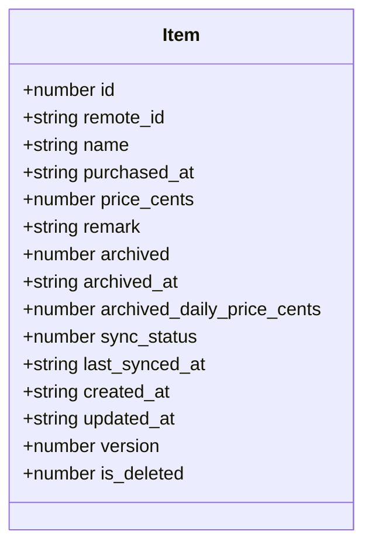

**图表来源**
- [lib/types/item.ts](file://lib/types/item.ts#L9-L24)

#### id字段（本地主键）
- **数据类型**: `number`
- **业务含义**: 物品的唯一标识符，由SQLite自动递增生成
- **约束条件**: 主键，不允许重复，自动生成
- **设计逻辑**: 作为数据库表的主键，确保每条记录的唯一性，便于快速查找和关联操作

#### name字段（物品名称）
- **数据类型**: `string`
- **业务含义**: 物品的名称或标题
- **约束条件**: 必填字段，不能为空字符串
- **设计逻辑**: 用户输入的物品标识，支持中文字符，用于界面展示和搜索

#### purchased_at字段（购买日期）
- **数据类型**: `string` (ISO日期格式)
- **业务含义**: 物品的购买日期，采用ISO 8601日期格式（YYYY-MM-DD）
- **约束条件**: 必填字段，格式严格遵循ISO标准
- **设计逻辑**: 用于计算使用天数的基础时间点，支持日期范围查询和排序

#### price_cents字段（购买价格）
- **数据类型**: `number`
- **业务含义**: 物品的购买价格，以"分"为单位的整数值
- **约束条件**: 必填字段，必须为非负整数
- **设计逻辑**: 避免浮点数精度问题，统一使用整数表示货币金额，便于精确计算

#### remark字段（备注信息）
- **数据类型**: `string` (可选)
- **业务含义**: 物品的附加说明信息
- **约束条件**: 可为空，支持任意长度文本
- **设计逻辑**: 提供灵活的信息补充，支持中文和特殊字符

**章节来源**
- [lib/types/item.ts](file://lib/types/item.ts#L9-L24)

### 时间戳字段

#### created_at和updated_at字段
- **数据类型**: `string` (ISO时间戳)
- **业务含义**: 记录的创建时间和最近更新时间
- **约束条件**: 自动生成，格式严格遵循ISO 8601标准
- **设计逻辑**: 支持数据版本控制和变更追踪，便于审计和同步管理

#### last_synced_at字段
- **数据类型**: `string` (ISO时间戳，可选)
- **业务含义**: 最近一次成功同步到云端的时间
- **约束条件**: 可为空，仅在启用同步功能时使用
- **设计逻辑**: 支持离线操作和云端数据同步，确保数据一致性

**章节来源**
- [lib/types/item.ts](file://lib/types/item.ts#L19-L22)

## 归档状态管理机制

### archived字段设计

归档状态管理是物品成本计算系统的核心功能之一，通过`archived`字段实现物品生命周期的管理。

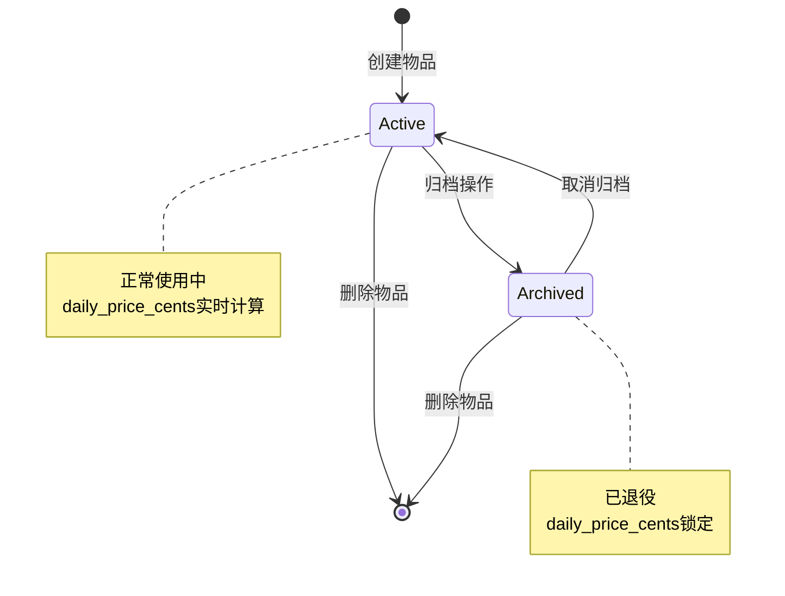

**图表来源**
- [lib/db/repository.ts](file://lib/db/repository.ts#L137-L155)
- [lib/types/item.ts](file://lib/types/item.ts#L60-L66)

#### archived字段值定义
- **0**: 表示物品处于活跃状态（进行中）
- **1**: 表示物品已被归档（已退役）

#### archived_at字段
- **数据类型**: `string | null`
- **业务含义**: 归档操作发生的具体时间
- **约束条件**: 未归档时为null，归档时自动填充当前时间
- **设计逻辑**: 记录物品状态变更的时间点，用于计算准确的使用天数

#### archived_daily_price_cents字段
- **数据类型**: `number | null`
- **业务含义**: 归档时锁定的日均价格（分）
- **约束条件**: 未归档时为null，归档时自动计算并存储
- **设计逻辑**: 锁定归档时的价格计算结果，确保历史数据的准确性

### 归档操作流程

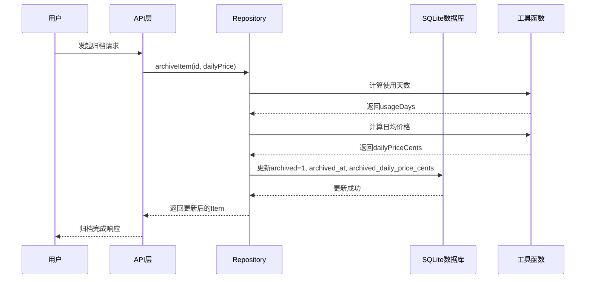

**图表来源**
- [lib/db/repository.ts](file://lib/db/repository.ts#L137-L143)
- [lib/utils/item-utils.ts](file://lib/utils/item-utils.ts#L64-L66)

**章节来源**
- [lib/db/repository.ts](file://lib/db/repository.ts#L137-L155)
- [lib/utils/item-utils.ts](file://lib/utils/item-utils.ts#L64-L66)

## TypeScript接口与数据库映射

### 字段命名转换规则

TypeScript接口采用驼峰命名法，而SQLite数据库字段采用下划线命名法，两者之间存在映射关系：

| TypeScript字段名 | SQLite字段名 | 数据类型 | 说明 |
|------------------|--------------|----------|------|
| id | id | INTEGER | 主键，自动递增 |
| name | name | TEXT | 物品名称 |
| purchased_at | purchased_at | TEXT | 购买日期 |
| price_cents | price_cents | INTEGER | 购买价格（分） |
| remark | remark | TEXT | 备注信息 |
| archived | archived | INTEGER | 归档状态 |
| archived_at | archived_at | TEXT | 归档时间 |
| archived_daily_price_cents | archived_daily_price_cents | INTEGER | 归档日均价格 |
| created_at | created_at | TEXT | 创建时间 |
| updated_at | updated_at | TEXT | 更新时间 |

### 数据库表结构定义

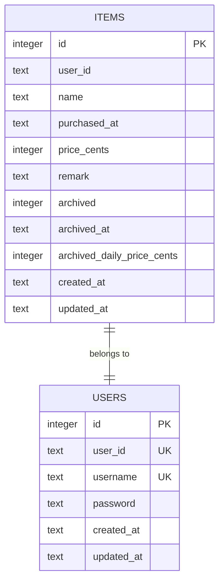

**图表来源**
- [lib/db/sqlite.ts](file://lib/db/sqlite.ts#L29-L42)

### 类型转换处理

在数据持久化过程中，需要进行TypeScript类型与数据库类型的转换：

1. **布尔值转换**: `archived`字段在TypeScript中表示为`number`，但在数据库中存储为`INTEGER`（0/1）
2. **时间戳处理**: `created_at`、`updated_at`等时间字段在TypeScript中为`string`，在数据库中存储为`TEXT`格式的ISO时间戳
3. **可选字段处理**: `remote_id`、`archived_at`、`archived_daily_price_cents`等可选字段在数据库中对应`NULL`值

**章节来源**
- [lib/db/sqlite.ts](file://lib/db/sqlite.ts#L29-L42)
- [lib/db/repository.ts](file://lib/db/repository.ts#L37-L63)

## DTO设计模式

### CreateItemDTO设计目的

CreateItemDTO专门用于创建新物品的请求数据传输对象，具有严格的字段验证和简化的设计：

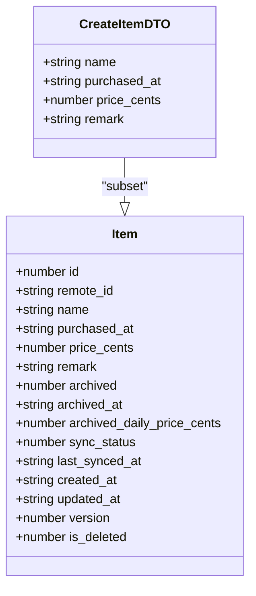

**图表来源**
- [lib/types/item.ts](file://lib/types/item.ts#L30-L35)
- [lib/types/item.ts](file://lib/types/item.ts#L9-L24)

#### 设计特点
- **字段精简**: 只包含创建必需的字段，不包含系统生成的字段
- **必填验证**: 所有核心字段都是必填项，确保数据完整性
- **类型安全**: 严格的数据类型定义，防止类型错误

### UpdateItemDTO设计目的

UpdateItemDTO用于更新物品信息的请求数据传输对象，支持部分字段更新：

#### 支持更新的字段
- `name`: 物品名称
- `purchased_at`: 购买日期
- `price_cents`: 购买价格
- `remark`: 备注信息
- `archived`: 归档状态
- `archived_at`: 归档时间
- `archived_daily_price_cents`: 归档日均价格

#### 动态SQL构建机制

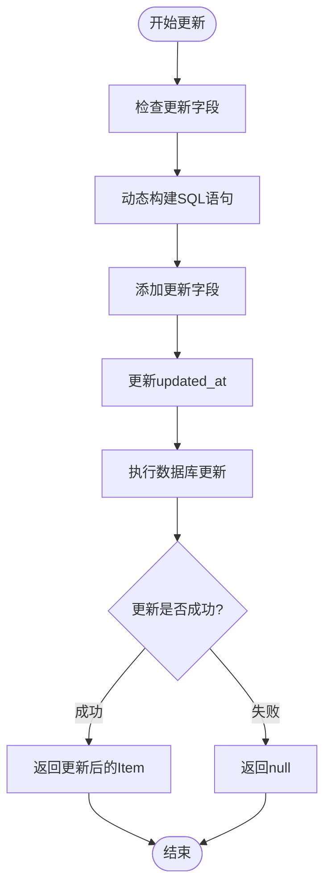

**图表来源**
- [lib/db/repository.ts](file://lib/db/repository.ts#L73-L121)

**章节来源**
- [lib/types/item.ts](file://lib/types/item.ts#L30-L48)
- [lib/db/repository.ts](file://lib/db/repository.ts#L73-L121)

## 枚举类型定义

### SyncStatus枚举

同步状态枚举定义了物品与云端同步的不同状态：

| 枚举值 | 数值 | 含义 | 使用场景 |
|--------|------|------|----------|
| NOT_SYNCED | 0 | 未同步 | 新创建的物品，尚未上传到云端 |
| SYNCED | 1 | 已同步 | 已成功同步到云端，数据一致 |
| PENDING_UPDATE | 2 | 待更新 | 本地有修改，等待同步到云端 |
| PENDING_DELETE | 3 | 待删除 | 标记为删除，等待从云端移除 |

### ArchivedStatus枚举

归档状态枚举提供了更直观的状态表达：

| 枚举值 | 数值 | 含义 | 使用场景 |
|--------|------|------|----------|
| ACTIVE | 0 | 进行中 | 物品正在使用中，日均价格实时计算 |
| ARCHIVED | 1 | 已归档 | 物品已退役，日均价格已锁定 |

### 枚举的实际应用

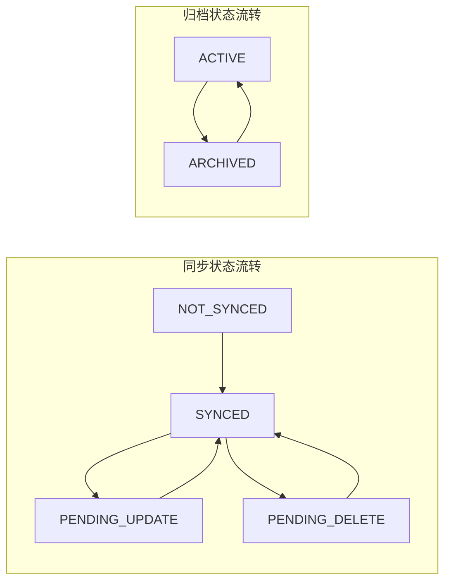

**图表来源**
- [lib/types/item.ts](file://lib/types/item.ts#L53-L66)

**章节来源**
- [lib/types/item.ts](file://lib/types/item.ts#L53-L66)

## ItemWithStats扩展接口

### 扩展字段定义

ItemWithStats接口在基础Item接口的基础上增加了统计计算字段，用于前端展示：

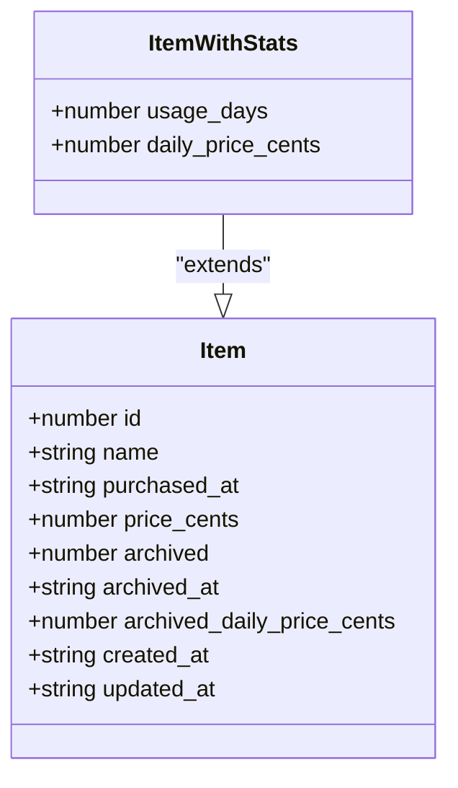

**图表来源**
- [lib/types/item.ts](file://lib/types/item.ts#L90-L93)

#### usage_days字段
- **数据类型**: `number`
- **业务含义**: 物品的使用天数
- **计算逻辑**: 基于`purchased_at`和`archived_at`计算，至少为1天
- **用途**: 在前端展示物品的使用时长

#### daily_price_cents字段
- **数据类型**: `number`
- **业务含义**: 物品的日均价格（分）
- **计算逻辑**: `price_cents / usage_days`，向下取整
- **用途**: 显示物品的成本效益指标

### 前端展示计算逻辑

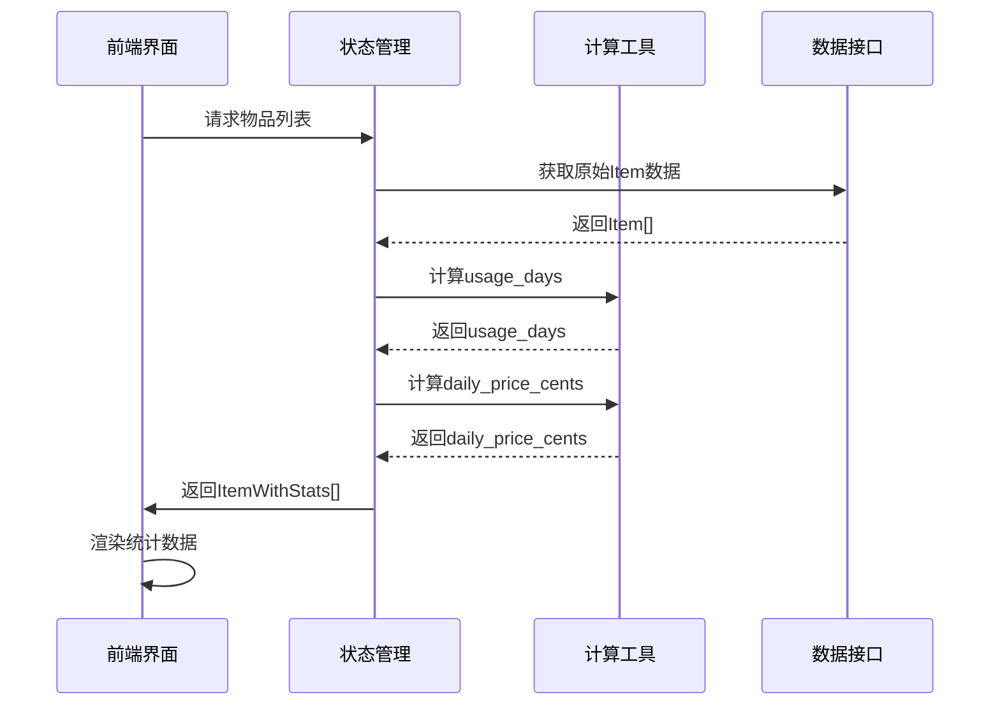

**图表来源**
- [lib/utils/item-utils.ts](file://lib/utils/item-utils.ts#L64-L73)
- [components/item-card.tsx](file://components/item-card.tsx#L24-L25)

### 计算逻辑实现

#### 使用天数计算
- **活跃物品**: `usage_days = max(differenceInDays(currentDate, purchasedAt), 1)`
- **归档物品**: `usage_days = max(differenceInDays(archivedAt, purchasedAt), 1)`

#### 日均价格计算
- **归档物品**: 直接使用`archived_daily_price_cents`
- **活跃物品**: `daily_price_cents = floor(price_cents / usage_days)`

**章节来源**
- [lib/types/item.ts](file://lib/types/item.ts#L90-L93)
- [lib/utils/item-utils.ts](file://lib/utils/item-utils.ts#L12-L73)
- [components/item-card.tsx](file://components/item-card.tsx#L24-L25)

## 数据流架构

### 整体架构图

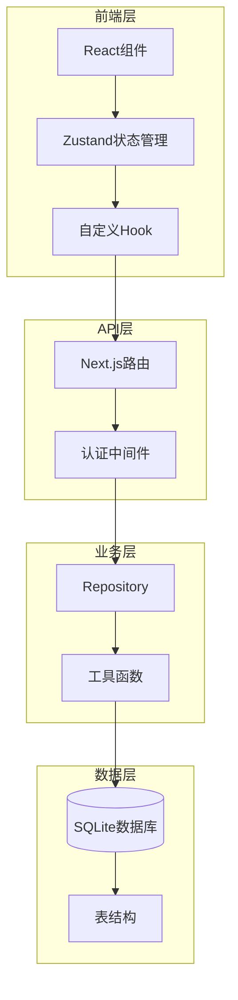

**图表来源**
- [lib/store/item-store.ts](file://lib/store/item-store.ts#L47-L113)
- [app/api/items/route.ts](file://app/api/items/route.ts#L1-L75)
- [lib/db/repository.ts](file://lib/db/repository.ts#L1-L156)

### 数据流向说明

1. **创建流程**: UI → Store → API → Repository → SQLite
2. **查询流程**: SQLite → Repository → API → Store → UI
3. **更新流程**: UI → Store → API → Repository → SQLite
4. **归档流程**: UI → Store → API → Repository → Utils → SQLite

### 状态管理模式

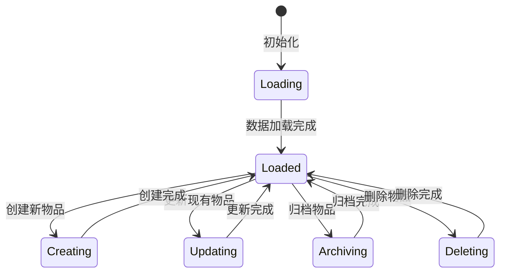

**图表来源**
- [lib/store/item-store.ts](file://lib/store/item-store.ts#L47-L113)

**章节来源**
- [lib/store/item-store.ts](file://lib/store/item-store.ts#L47-L113)
- [app/api/items/route.ts](file://app/api/items/route.ts#L1-L75)
- [lib/db/repository.ts](file://lib/db/repository.ts#L1-L156)

## 业务逻辑实现

### 成本计算算法

系统的核心价值在于准确计算物品的使用成本，基于以下算法：

#### 使用天数计算公式
```
usage_days = max(differenceInDays(endDate, purchasedAt), 1)
```

其中：
- `purchasedAt`: 购买日期（ISO格式）
- `endDate`: 终止日期（当前日期或归档日期）
- `max(..., 1)`: 确保至少为1天

#### 日均价格计算公式
```
daily_price_cents = floor(price_cents / usage_days)
```

#### 归档时的价格锁定
当物品被归档时，系统会：
1. 计算当前的使用天数
2. 计算当前的日均价格
3. 将价格锁定到`archived_daily_price_cents`字段
4. 设置`archived_at`时间为当前时间

### 数据验证规则

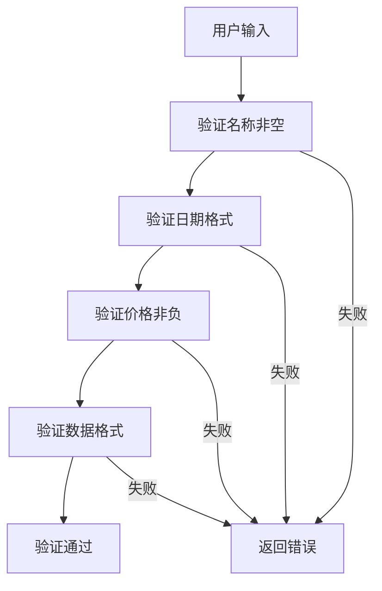

**图表来源**
- [app/api/items/route.ts](file://app/api/items/route.ts#L39-L53)

### 错误处理机制

系统实现了多层次的错误处理：

1. **前端验证**: React Hook Form验证
2. **API验证**: 请求参数验证和数据类型检查
3. **数据库验证**: SQLite约束和触发器
4. **业务逻辑验证**: 业务规则检查和数据一致性验证

**章节来源**
- [lib/utils/item-utils.ts](file://lib/utils/item-utils.ts#L12-L73)
- [app/api/items/route.ts](file://app/api/items/route.ts#L39-L53)

## 总结

物品数据模型是个人物品成本管理系统的核心基础，通过精心设计的TypeScript接口、数据库映射和业务逻辑，实现了以下关键功能：

### 核心特性

1. **完整的生命周期管理**: 从创建到归档的全生命周期跟踪
2. **精确的成本计算**: 基于使用天数和购买价格的准确成本分析
3. **灵活的状态管理**: 支持物品的激活、归档和恢复操作
4. **类型安全的设计**: 通过TypeScript确保数据的一致性和可靠性
5. **高效的性能优化**: 通过索引和缓存机制提升查询性能

### 技术亮点

- **双层状态管理**: TypeScript接口保证编译时类型安全，数据库约束保证运行时数据完整性
- **智能归档机制**: 自动锁定历史数据，确保成本计算的准确性
- **动态计算能力**: 前端实时计算使用天数和日均价格，提供即时反馈
- **扩展性强**: 支持未来功能扩展和业务规则变化

### 应用价值

该数据模型不仅满足了基本的物品管理需求，更重要的是为用户提供了一个实用的成本分析工具，帮助用户更好地理解物品的使用价值和投资回报，从而做出更明智的消费决策。