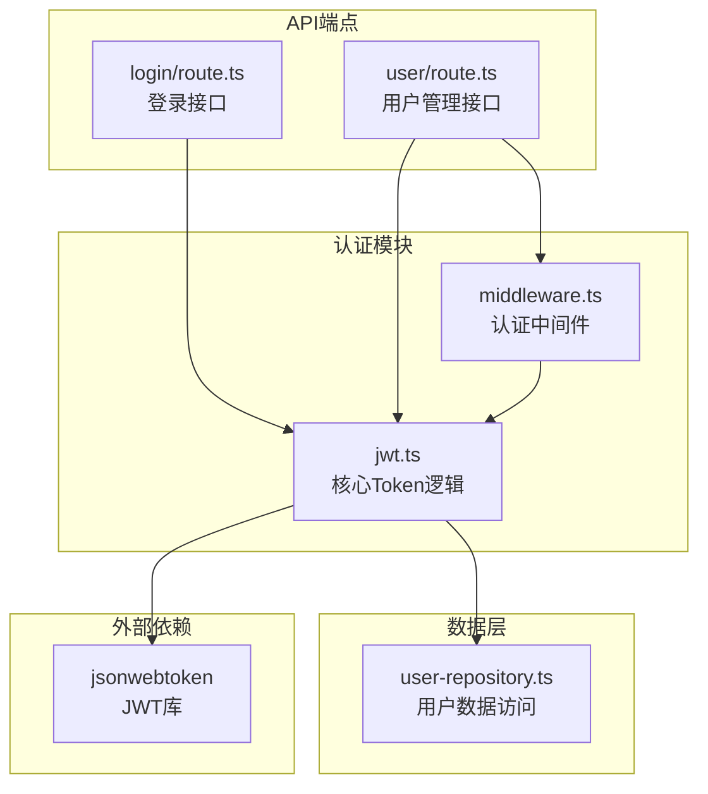
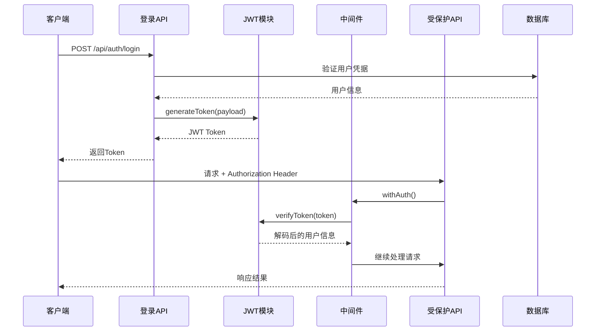
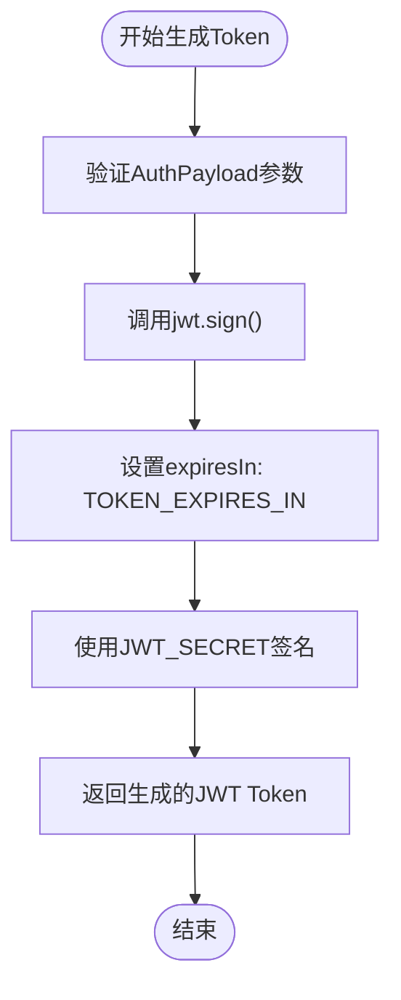
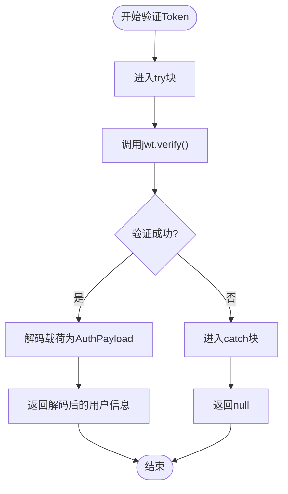
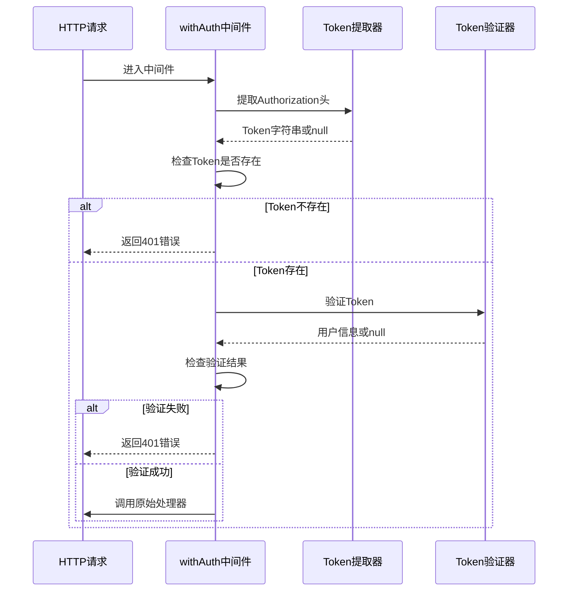
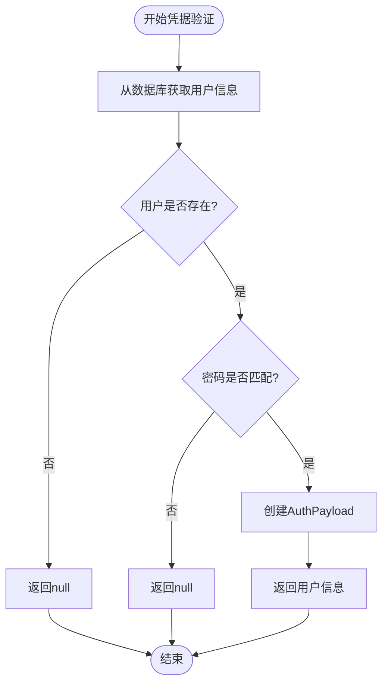
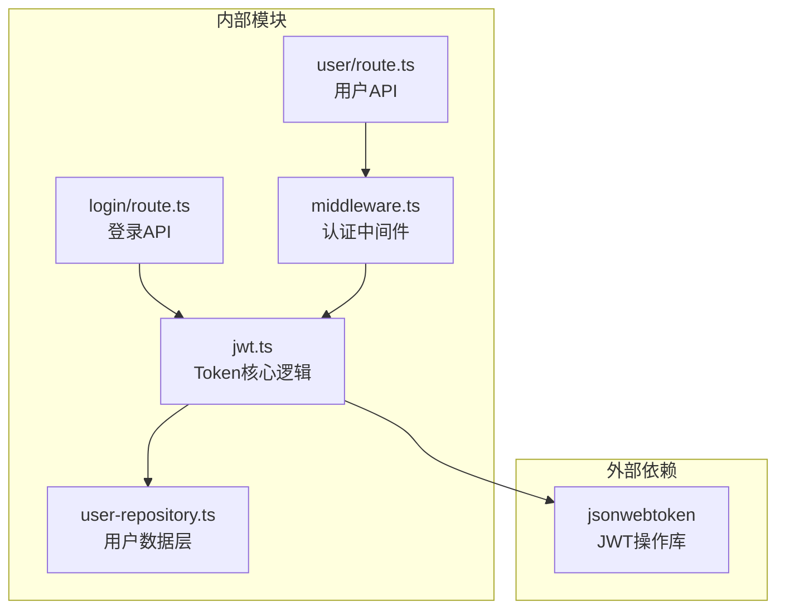
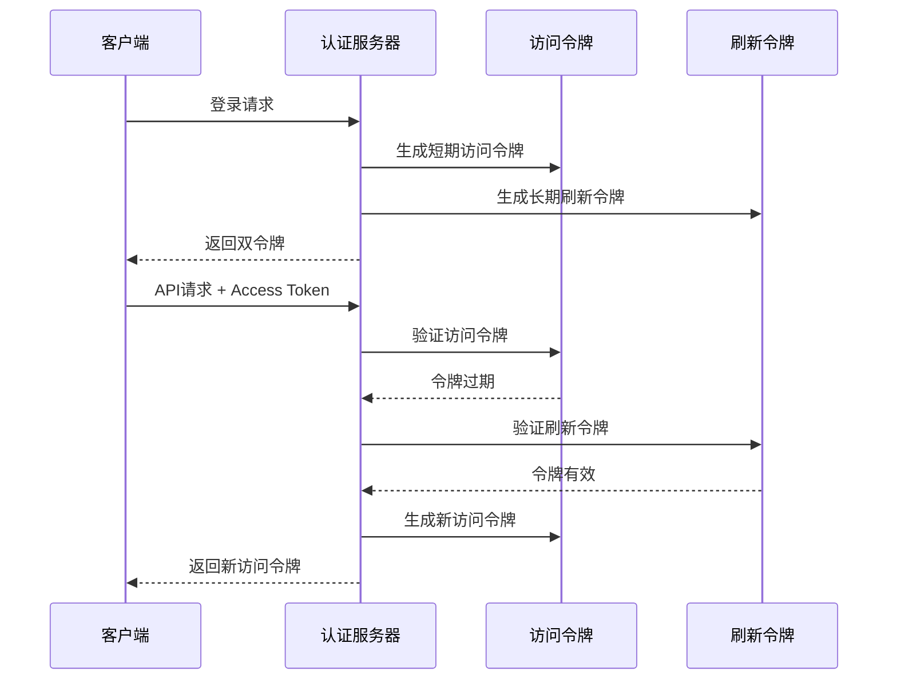

# Token管理

<cite>
**本文档引用的文件**
- [jwt.ts](file://lib/auth/jwt.ts)
- [middleware.ts](file://lib/auth/middleware.ts)
- [login/route.ts](file://app/api/auth/login/route.ts)
- [user/route.ts](file://app/api/user/route.ts)
- [user-repository.ts](file://lib/db/user-repository.ts)
- [package.json](file://package.json)
</cite>

## 目录
1. [简介](#简介)
2. [项目结构](#项目结构)
3. [核心组件](#核心组件)
4. [架构概览](#架构概览)
5. [详细组件分析](#详细组件分析)
6. [依赖关系分析](#依赖关系分析)
7. [性能考虑](#性能考虑)
8. [故障排除指南](#故障排除指南)
9. [结论](#结论)

## 简介

本文档深入解析了Bookkeeping应用中的Token管理系统，重点分析了generateToken和verifyToken两个核心函数的工作机制。该系统采用JSON Web Token (JWT)技术实现用户身份认证，通过jsonwebtoken库提供安全的令牌生成和验证功能。

Token管理系统是整个应用安全架构的核心组件，负责：
- 用户身份验证和授权
- 会话状态管理
- API访问控制
- 安全的用户凭证传递

## 项目结构

Token管理系统的文件组织结构清晰明确，主要分布在以下目录中：



**图表来源**
- [jwt.ts](file://lib/auth/jwt.ts#L1-L57)
- [middleware.ts](file://lib/auth/middleware.ts#L1-L34)
- [login/route.ts](file://app/api/auth/login/route.ts#L1-L47)

**章节来源**
- [jwt.ts](file://lib/auth/jwt.ts#L1-L57)
- [middleware.ts](file://lib/auth/middleware.ts#L1-L34)

## 核心组件

### JWT配置常量

系统定义了两个关键的配置常量：

| 配置项 | 值 | 说明 |
|--------|-----|------|
| JWT_SECRET | process.env.JWT_SECRET \| 'your-secret-key-change-in-production' | JWT签名密钥，生产环境必须使用环境变量 |
| TOKEN_EXPIRES_IN | '7d' | Token有效期，设置为7天 |

### 数据结构定义

系统使用`AuthPayload`接口定义认证载荷结构：

| 字段名 | 类型 | 说明 |
|--------|------|------|
| userId | string | 用户唯一标识符 |
| username | string | 用户名 |

**章节来源**
- [jwt.ts](file://lib/auth/jwt.ts#L4-L11)

## 架构概览

Token管理系统采用分层架构设计，确保职责分离和安全性：



**图表来源**
- [login/route.ts](file://app/api/auth/login/route.ts#L1-L47)
- [middleware.ts](file://lib/auth/middleware.ts#L1-L34)

## 详细组件分析

### generateToken函数分析

generateToken函数是Token生成的核心逻辑，负责创建包含用户身份信息的安全令牌。

#### 函数签名与参数
```typescript
export function generateToken(payload: AuthPayload): string
```

#### 实现机制



**图表来源**
- [jwt.ts](file://lib/auth/jwt.ts#L16-L17)

#### 关键特性

1. **签名算法**: 使用JWT_SECRET进行HMAC SHA256签名
2. **有效期设置**: 自动添加7天过期时间
3. **类型安全**: 强类型AuthPayload确保数据完整性
4. **异常处理**: 内部处理jsonwebtoken库的异常

**章节来源**
- [jwt.ts](file://lib/auth/jwt.ts#L16-L17)

### verifyToken函数分析

verifyToken函数实现了安全的Token验证机制，采用try-catch模式处理各种异常情况。

#### 函数签名与返回值
```typescript
export function verifyToken(token: string): AuthPayload | null
```

#### 异常捕获策略



**图表来源**
- [jwt.ts](file://lib/auth/jwt.ts#L23-L29)

#### 异常处理机制

系统采用统一的异常捕获策略，涵盖以下场景：

| 异常类型 | 处理方式 | 返回值 |
|----------|----------|--------|
| 签名无效 | 捕获异常 | null |
| Token格式错误 | 捕获异常 | null |
| Token过期 | 捕获异常 | null |
| 其他验证错误 | 捕获异常 | null |

**章节来源**
- [jwt.ts](file://lib/auth/jwt.ts#L23-L29)

### 认证中间件分析

认证中间件`withAuth`提供了统一的API保护机制。

#### 中间件工作流程



**图表来源**
- [middleware.ts](file://lib/auth/middleware.ts#L11-L31)

**章节来源**
- [middleware.ts](file://lib/auth/middleware.ts#L1-L34)

### 用户凭据验证

validateCredentials函数负责验证用户提供的登录凭据。

#### 验证流程



**图表来源**
- [jwt.ts](file://lib/auth/jwt.ts#L35-L45)

**章节来源**
- [jwt.ts](file://lib/auth/jwt.ts#L35-L45)

## 依赖关系分析

Token管理系统的依赖关系清晰，遵循单一职责原则：



**图表来源**
- [jwt.ts](file://lib/auth/jwt.ts#L1-L2)
- [middleware.ts](file://lib/auth/middleware.ts#L1-L2)

### 关键依赖说明

1. **jsonwebtoken**: 提供JWT标准实现
2. **user-repository**: 数据访问层，负责用户信息查询
3. **Next.js**: 框架支持，提供请求响应处理能力

**章节来源**
- [jwt.ts](file://lib/auth/jwt.ts#L1-L2)
- [middleware.ts](file://lib/auth/middleware.ts#L1-L2)

## 性能考虑

### Token生成性能

- **内存使用**: JWT生成仅涉及内存计算，无数据库查询
- **CPU开销**: HMAC SHA256签名算法相对轻量
- **并发处理**: 支持高并发的Token生成请求

### Token验证性能

- **本地验证**: JWT验证无需网络调用，完全本地处理
- **缓存友好**: 验证结果可被应用层缓存
- **快速失败**: 异常情况下立即返回，避免不必要的处理

### 安全最佳实践

1. **密钥管理**: JWT_SECRET应存储在环境变量中
2. **传输安全**: 所有Token传输必须使用HTTPS
3. **定期轮换**: 生产环境中应定期更换密钥
4. **审计日志**: 记录Token验证相关操作

## 故障排除指南

### 常见问题及解决方案

#### Token生成失败

**症状**: generateToken抛出异常
**可能原因**:
- JWT_SECRET未正确设置
- AuthPayload格式不正确
- jsonwebtoken库版本不兼容

**解决方案**:
1. 检查环境变量JWT_SECRET是否设置
2. 验证AuthPayload接口定义
3. 确认jsonwebtoken版本兼容性

#### Token验证失败

**症状**: verifyToken始终返回null
**可能原因**:
- Token被篡改或伪造
- Token已过期
- JWT_SECRET不匹配

**解决方案**:
1. 检查Token格式是否正确（Bearer前缀）
2. 验证Token的有效期
3. 确认JWT_SECRET一致性

#### 中间件认证失败

**症状**: withAuth返回401错误
**可能原因**:
- 请求头缺少Authorization字段
- Token格式错误
- Token验证失败

**解决方案**:
1. 确保请求头包含正确的Authorization格式
2. 检查Token是否正确生成
3. 验证JWT_SECRET配置

**章节来源**
- [jwt.ts](file://lib/auth/jwt.ts#L23-L29)
- [middleware.ts](file://lib/auth/middleware.ts#L15-L27)

## 结论

Bookkeeping应用的Token管理系统展现了现代Web应用安全架构的最佳实践。通过jsonwebtoken库的标准化实现，系统提供了：

### 主要优势

1. **安全性**: 基于标准JWT规范，支持多种签名算法
2. **可维护性**: 清晰的模块化设计，职责分离明确
3. **可扩展性**: 支持中间件模式，易于添加新的认证规则
4. **可靠性**: 完善的异常处理机制，保证系统稳定性

### 改进建议

1. **Refresh Token机制**: 实现双令牌体系，支持Token自动刷新
2. **黑名单管理**: 添加失效Token的黑名单机制
3. **多因素认证**: 集成额外的身份验证因素
4. **监控告警**: 添加Token使用情况的监控和告警

### 扩展设计思路

#### Refresh Token双令牌体系



这种设计提供了更好的用户体验和安全性平衡，当访问令牌过期时，客户端可以使用刷新令牌获取新的访问令牌，而无需重新登录。

Token管理系统作为应用安全的基础，其设计充分体现了安全性、可维护性和可扩展性的平衡，为构建可靠的企业级应用奠定了坚实基础。