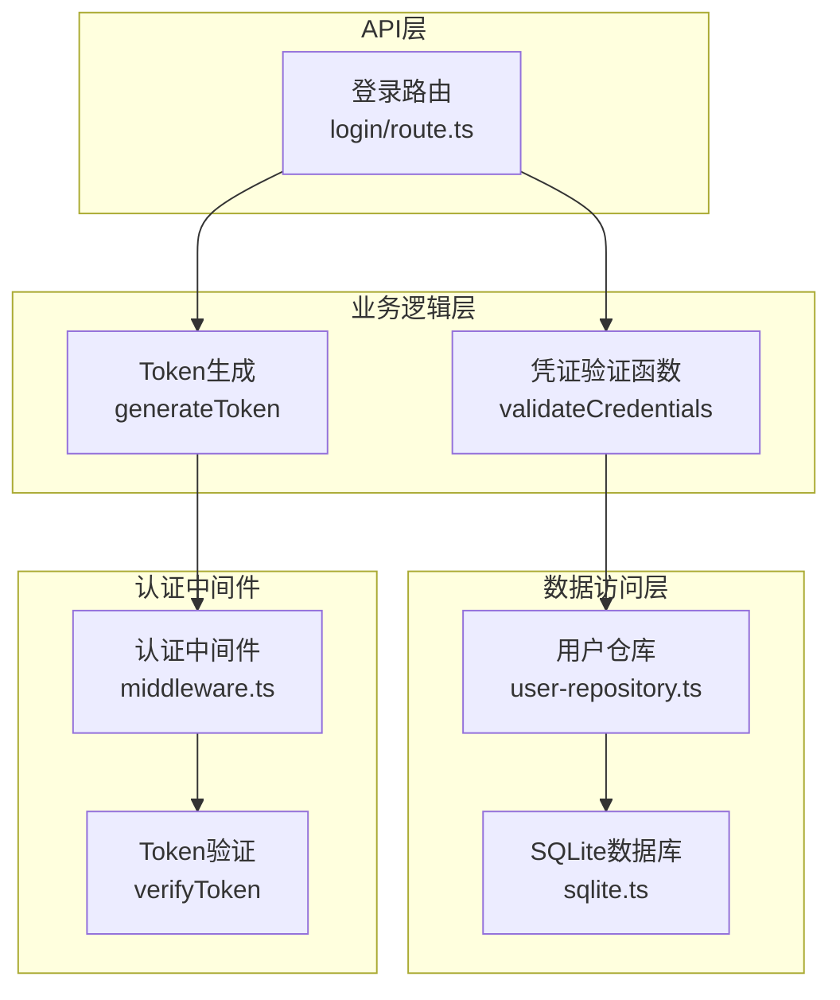
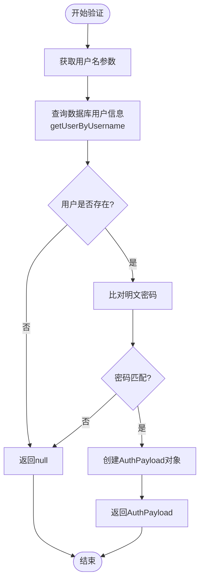
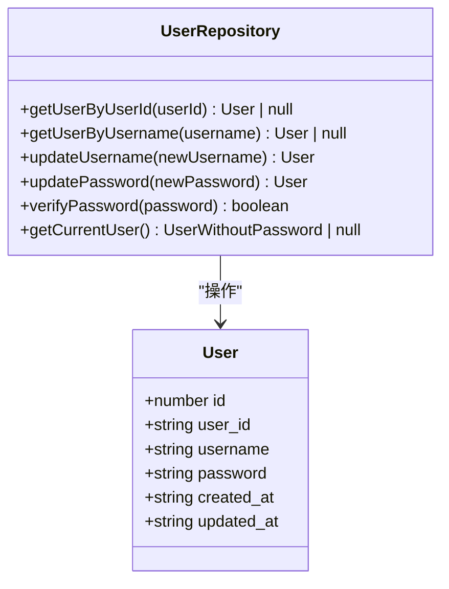
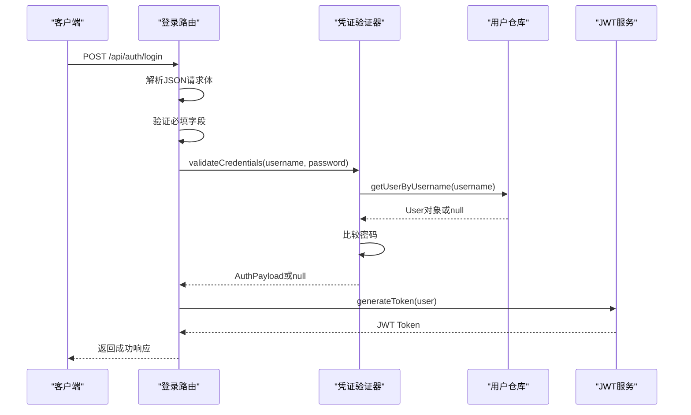
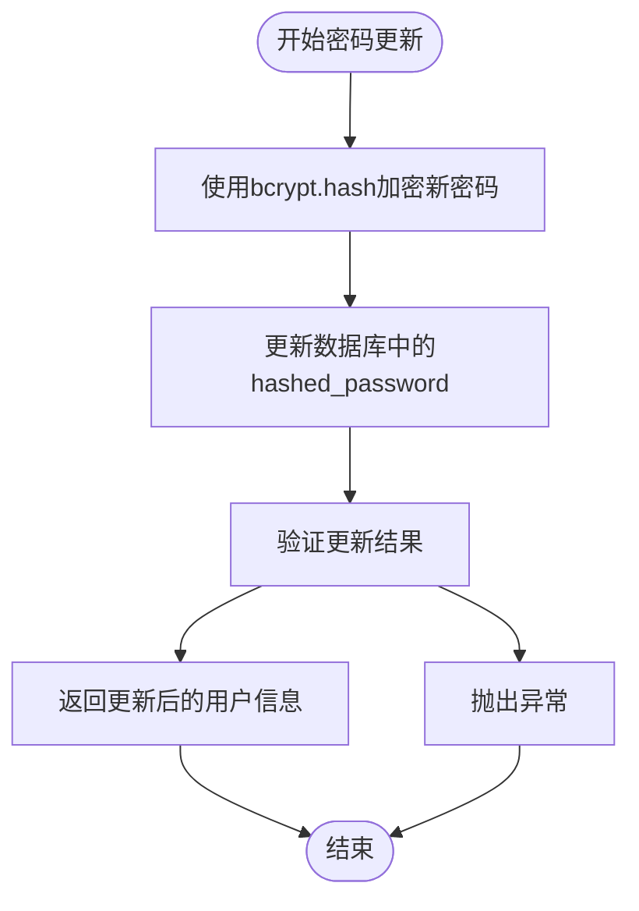
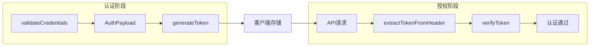
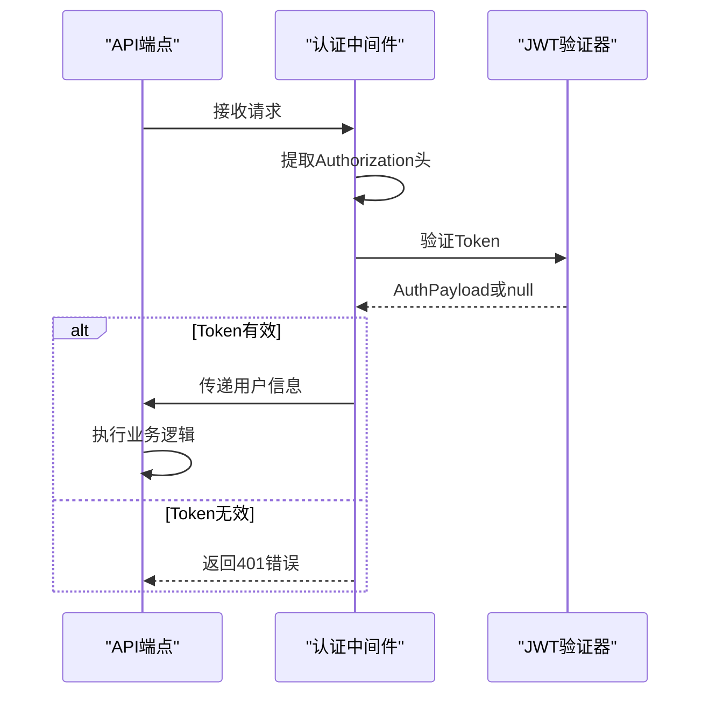

# 凭证验证

<cite>
**本文档中引用的文件**
- [app/api/auth/login/route.ts](file://app/api/auth/login/route.ts)
- [lib/db/user-repository.ts](file://lib/db/user-repository.ts)
- [lib/auth/jwt.ts](file://lib/auth/jwt.ts)
- [lib/auth/middleware.ts](file://lib/auth/middleware.ts)
- [lib/db/sqlite.ts](file://lib/db/sqlite.ts)
</cite>

## 目录
1. [简介](#简介)
2. [系统架构概览](#系统架构概览)
3. [核心组件分析](#核心组件分析)
4. [凭证验证流程详解](#凭证验证流程详解)
5. [安全风险与改进建议](#安全风险与改进建议)
6. [JWT Token集成机制](#jwt-token集成机制)
7. [故障排除指南](#故障排除指南)
8. [总结](#总结)

## 简介

本文档详细阐述了Bookkeeping应用中的凭证验证系统，重点分析`validateCredentials`函数如何实现基于用户名和密码的身份认证。该系统采用明文密码存储的方式，在实际部署中存在严重的安全风险，需要通过密码哈希算法进行安全升级。

## 系统架构概览

凭证验证系统采用分层架构设计，包含以下核心层次：



**图表来源**
- [app/api/auth/login/route.ts](file://app/api/auth/login/route.ts#L1-L47)
- [lib/auth/jwt.ts](file://lib/auth/jwt.ts#L1-L57)
- [lib/db/user-repository.ts](file://lib/db/user-repository.ts#L1-L107)

## 核心组件分析

### validateCredentials函数

`validateCredentials`函数是整个认证系统的核心，位于JWT认证模块中：



**图表来源**
- [lib/auth/jwt.ts](file://lib/auth/jwt.ts#L35-L46)

该函数的设计特点：
- **返回类型**：`AuthPayload | null`，明确区分认证成功和失败的情况
- **数据库查询**：通过`userRepository.getUserByUsername`获取用户信息
- **密码比对**：直接比较明文密码，缺乏安全性
- **错误处理**：认证失败时返回null，便于上层统一处理

**章节来源**
- [lib/auth/jwt.ts](file://lib/auth/jwt.ts#L35-L46)

### 用户仓库层

用户仓库提供了完整的用户数据访问功能：



**图表来源**
- [lib/db/user-repository.ts](file://lib/db/user-repository.ts#L7-L14)

**章节来源**
- [lib/db/user-repository.ts](file://lib/db/user-repository.ts#L1-L107)

## 凭证验证流程详解

### 登录API接口调用流程

登录API接口展示了完整的凭证验证流程：



**图表来源**
- [app/api/auth/login/route.ts](file://app/api/auth/login/route.ts#L4-L38)
- [lib/auth/jwt.ts](file://lib/auth/jwt.ts#L35-L46)

### 实际调用示例

登录API的实际调用流程如下：

1. **请求验证**：检查用户名和密码是否为空
2. **凭证验证**：调用`validateCredentials`进行身份校验
3. **认证结果处理**：根据返回值决定响应状态
4. **Token生成**：成功认证后生成JWT Token
5. **响应构建**：返回包含Token和用户信息的成功响应

**章节来源**
- [app/api/auth/login/route.ts](file://app/api/auth/login/route.ts#L1-L47)

## 安全风险与改进建议

### 当前安全问题

当前实现存在以下严重安全风险：

| 风险类型 | 具体问题 | 影响程度 | 风险等级 |
|---------|---------|---------|---------|
| 明文存储 | 密码以明文形式存储在数据库中 | 高 | 严重 |
| 缓存攻击 | 内存中也保存明文密码 | 中 | 高 |
| 网络传输 | 密码在网络传输中暴露 | 中 | 中 |
| 数据泄露 | 数据库被攻破时密码直接暴露 | 高 | 严重 |

### 推荐改进方案

#### 使用bcrypt进行密码哈希

建议采用bcrypt算法对密码进行安全哈希：

```typescript
// 改进后的密码验证流程
async function validateCredentials(username: string, password: string): Promise<AuthPayload | null> {
  const user = userRepository.getUserByUsername(username);
  if (!user) return null;
  
  // 使用bcrypt.compare验证密码
  const isValid = await bcrypt.compare(password, user.hashed_password);
  if (!isValid) return null;
  
  return {
    userId: user.user_id,
    username: user.username,
  };
}
```

#### 数据库表结构调整

```sql
-- 修改users表结构
ALTER TABLE users ADD COLUMN hashed_password TEXT NOT NULL;

-- 移除明文密码列
ALTER TABLE users DROP COLUMN password;
```

#### 密码更新流程



### 安全最佳实践

1. **密码强度要求**：实施最小长度、复杂度要求
2. **盐值随机化**：每次哈希使用不同盐值
3. **迭代次数优化**：根据硬件性能调整哈希迭代次数
4. **定期轮换**：强制用户定期更换密码
5. **多因素认证**：增加额外的安全验证层

## JWT Token集成机制

### Token生成与验证流程

凭证验证系统与JWT Token生成紧密集成：



**图表来源**
- [lib/auth/jwt.ts](file://lib/auth/jwt.ts#L16-L29)
- [lib/auth/middleware.ts](file://lib/auth/middleware.ts#L8-L33)

### 中间件认证机制

认证中间件确保API请求的安全性：



**图表来源**
- [lib/auth/middleware.ts](file://lib/auth/middleware.ts#L8-L33)

**章节来源**
- [lib/auth/jwt.ts](file://lib/auth/jwt.ts#L1-L57)
- [lib/auth/middleware.ts](file://lib/auth/middleware.ts#L1-L34)

## 故障排除指南

### 常见认证问题

| 问题症状 | 可能原因 | 解决方案 |
|---------|---------|---------|
| "用户名或密码错误" | 用户名不存在或密码不匹配 | 检查输入参数和数据库记录 |
| "认证令牌无效或已过期" | Token格式错误或已过期 | 重新登录获取新Token |
| "未提供认证令牌" | 请求缺少Authorization头 | 确保请求包含有效的Bearer Token |
| "登录失败，请稍后重试" | 系统内部错误 | 检查服务器日志和数据库连接 |

### 调试技巧

1. **日志记录**：在关键节点添加调试日志
2. **参数验证**：严格验证输入参数的有效性
3. **错误分类**：区分业务错误和系统错误
4. **测试覆盖**：编写全面的单元测试和集成测试

**章节来源**
- [app/api/auth/login/route.ts](file://app/api/auth/login/route.ts#L18-L23)
- [lib/auth/middleware.ts](file://lib/auth/middleware.ts#L15-L27)

## 总结

Bookkeeping应用的凭证验证系统虽然实现了基本的身份认证功能，但在安全性方面存在明显不足。主要问题包括：

1. **明文密码存储**：这是最严重的安全漏洞，容易导致数据泄露
2. **缺乏密码哈希**：没有使用任何密码保护机制
3. **安全配置缺失**：JWT密钥硬编码，缺乏环境变量支持

### 改进建议总结

1. **立即行动**：尽快迁移到bcrypt密码哈希系统
2. **渐进式迁移**：保留现有用户的同时逐步完成密码迁移
3. **安全配置**：使用环境变量管理敏感配置
4. **监控告警**：建立安全事件监控和告警机制
5. **定期审计**：定期进行安全审计和渗透测试

通过实施这些改进措施，可以显著提升系统的整体安全性，为用户提供更加可靠的服务保障。