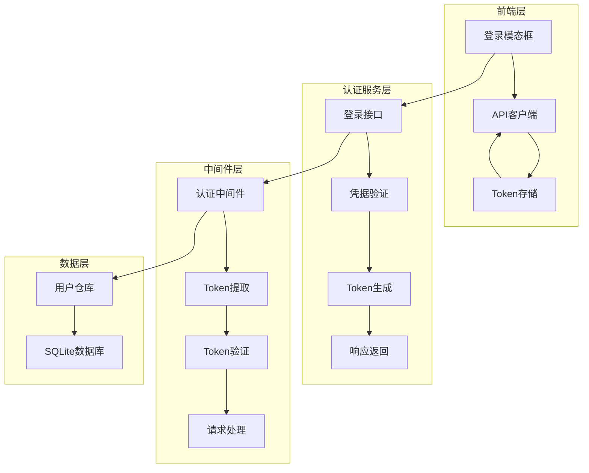
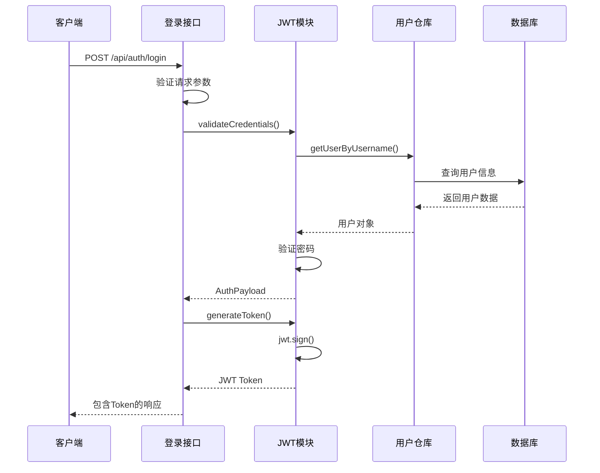
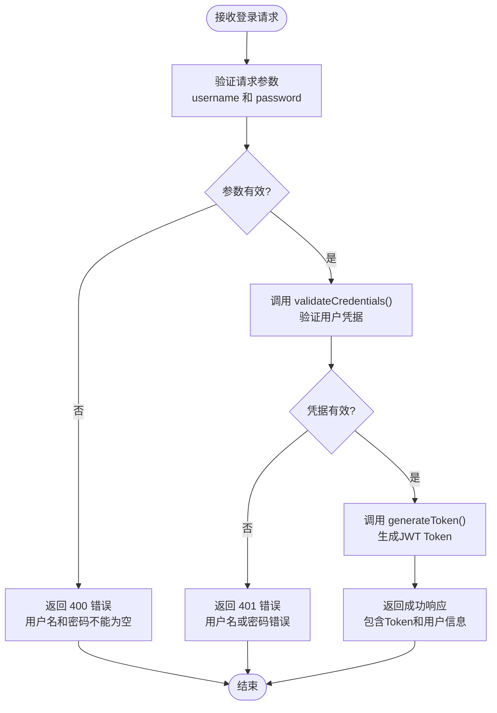
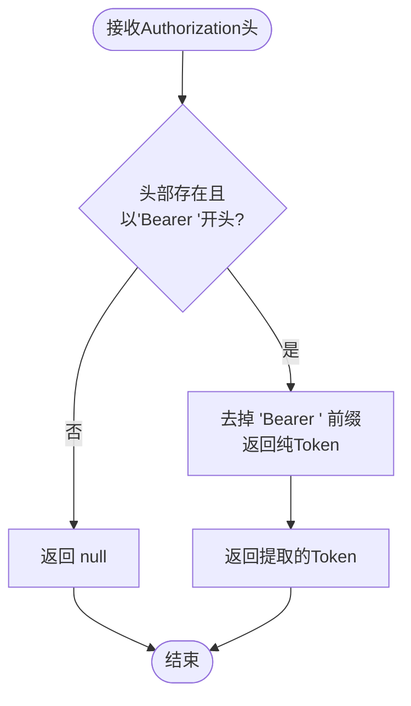
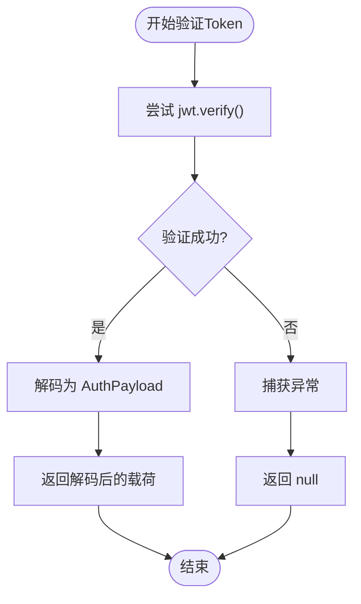
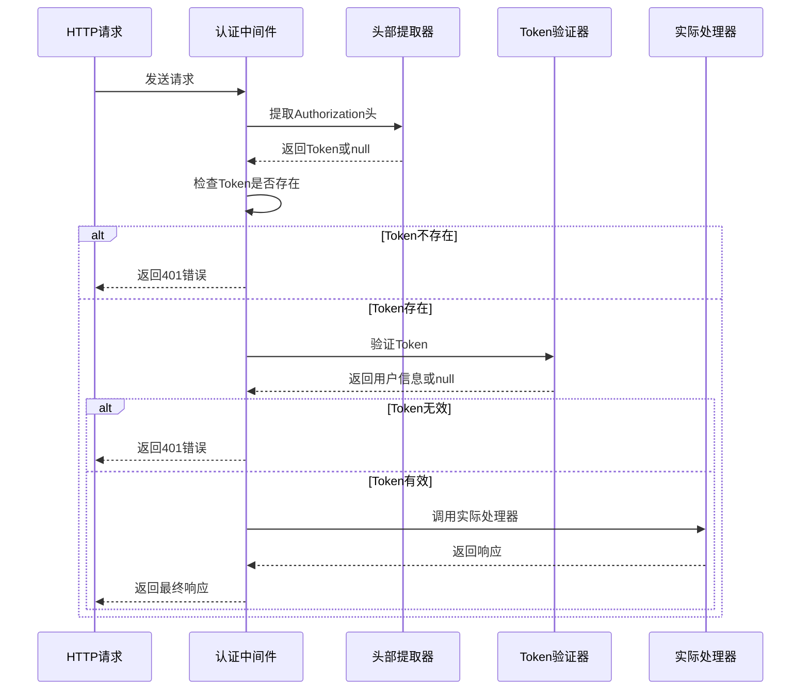
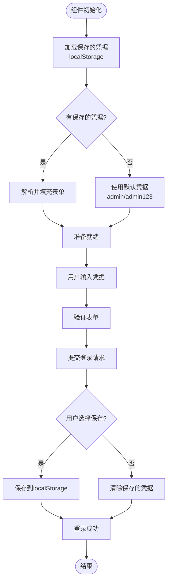
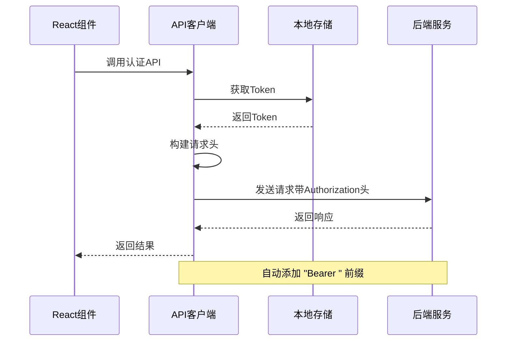

# 认证流程

<cite>
**本文档引用的文件**
- [app/api/auth/login/route.ts](file://app/api/auth/login/route.ts)
- [lib/auth/jwt.ts](file://lib/auth/jwt.ts)
- [lib/auth/middleware.ts](file://lib/auth/middleware.ts)
- [components/login-modal.tsx](file://components/login-modal.tsx)
- [lib/api/client.ts](file://lib/api/client.ts)
- [lib/db/user-repository.ts](file://lib/db/user-repository.ts)
- [app/api/items/route.ts](file://app/api/items/route.ts)
- [app/api/user/route.ts](file://app/api/user/route.ts)
</cite>

## 目录
1. [简介](#简介)
2. [系统架构概览](#系统架构概览)
3. [JWT认证核心组件](#jwt认证核心组件)
4. [登录流程详解](#登录流程详解)
5. [Token管理机制](#token管理机制)
6. [中间件认证流程](#中间件认证流程)
7. [前端认证实现](#前端认证实现)
8. [安全最佳实践](#安全最佳实践)
9. [故障排除指南](#故障排除指南)
10. [总结](#总结)

## 简介

本系统采用基于JSON Web Token (JWT) 的无状态身份验证机制，为用户提供安全可靠的认证服务。系统通过严格的凭据验证、安全的Token生成与验证机制，确保用户身份的安全性和会话的连续性。

## 系统架构概览

系统认证架构采用分层设计，包含以下核心层次：

**图表来源**
- [components/login-modal.tsx](file://components/login-modal.tsx#L1-L183)
- [app/api/auth/login/route.ts](file://app/api/auth/login/route.ts#L1-L47)
- [lib/auth/middleware.ts](file://lib/auth/middleware.ts.html#L1-L34)

## JWT认证核心组件

### Token签发与验证流程

系统的核心认证逻辑集中在JWT模块中，提供了完整的Token生命周期管理：

**图表来源**
- [app/api/auth/login/route.ts](file://app/api/auth/login/route.ts#L18-L27)
- [lib/auth/jwt.ts](file://lib/auth/jwt.ts#L35-L46)

### 密钥管理与配置

系统采用环境变量管理JWT密钥，确保生产环境的安全性：

| 配置项 | 默认值 | 生产环境要求 | 说明 |
|--------|--------|-------------|------|
| JWT_SECRET | 'your-secret-key-change-in-production' | 必须设置 | JWT签名密钥，生产环境必须使用强随机密钥 |
| TOKEN_EXPIRES_IN | '7d' | 可配置 | Token有效期，默认7天 |

**节来源**
- [lib/auth/jwt.ts](file://lib/auth/jwt.ts#L4-L6)

### Payload结构设计

认证载荷包含必要的用户标识信息：

| 字段名 | 类型 | 必需 | 说明 |
|--------|------|------|------|
| userId | string | 是 | 用户唯一标识符 |
| username | string | 是 | 用户名 |

**节来源**
- [lib/auth/jwt.ts](file://lib/auth/jwt.ts#L8-L11)

## 登录流程详解

### 接口实现细节

登录接口实现了完整的认证流程，包括输入验证、凭据检查和Token生成：

**图表来源**
- [app/api/auth/login/route.ts](file://app/api/auth/login/route.ts#L4-L46)

### 凭据验证机制

系统通过多层验证确保凭据安全性：

1. **输入验证**：检查必需字段的存在性
2. **数据库查询**：从SQLite数据库获取用户信息
3. **密码验证**：比较提供的密码与存储的密码
4. **Payload构建**：构造认证载荷对象

**节来源**
- [app/api/auth/login/route.ts](file://app/api/auth/login/route.ts#L9-L24)
- [lib/auth/jwt.ts](file://lib/auth/jwt.ts#L35-L46)

### Token生成过程

Token生成采用标准的JWT规范，包含以下步骤：

1. **载荷准备**：使用用户信息构造JWT载荷
2. **签名算法**：使用HS256算法和密钥签名
3. **过期时间**：设置7天的有效期
4. **Token格式**：返回标准的JWT字符串格式

**节来源**
- [lib/auth/jwt.ts](file://lib/auth/jwt.ts#L16-L18)

## Token管理机制

### Token提取与解析

系统提供了专门的工具函数处理Token的提取和验证：

**图表来源**
- [lib/auth/jwt.ts](file://lib/auth/jwt.ts#L51-L56)

### Token验证策略

验证过程采用异常捕获机制，确保系统的健壮性：

**图表来源**
- [lib/auth/jwt.ts](file://lib/auth/jwt.ts#L23-L30)

### 异常处理机制

系统采用优雅的错误处理策略：

| 场景 | 处理方式 | 返回值 | HTTP状态码 |
|------|----------|--------|------------|
| Token格式错误 | 捕获异常 | null | 401 |
| Token过期 | 捕获异常 | null | 401 |
| 签名验证失败 | 捕获异常 | null | 401 |
| 正常验证 | 成功解码 | AuthPayload | 200 |

**节来源**
- [lib/auth/jwt.ts](file://lib/auth/jwt.ts#L23-L30)

## 中间件认证流程

### 认证中间件架构

认证中间件为受保护的API路由提供统一的身份验证：

**图表来源**
- [lib/auth/middleware.ts](file://lib/auth/middleware.ts#L8-L33)

### 中间件使用模式

系统通过高阶函数模式实现中间件功能：

1. **包装处理器**：将原始处理器包装为带认证的版本
2. **自动验证**：每次请求自动执行身份验证
3. **错误拦截**：统一处理认证失败的情况
4. **上下文传递**：将用户信息传递给下游处理器

**节来源**
- [lib/auth/middleware.ts](file://lib/auth/middleware.ts#L8-L33)

### 受保护API示例

多个API路由都使用了认证中间件：

| API路径 | 方法 | 认证要求 | 功能描述 |
|---------|------|----------|----------|
| /api/items | GET/POST | 是 | 物品管理操作 |
| /api/user | GET/PUT | 是 | 用户信息管理 |
| /api/tags | GET/PUT/DELETE | 是 | 标签管理操作 |

**节来源**
- [app/api/items/route.ts](file://app/api/items/route.ts#L10-L75)
- [app/api/user/route.ts](file://app/api/user/route.ts#L8-L103)

## 前端认证实现

### 登录模态框组件

前端登录界面提供了完整的用户交互体验：

**图表来源**
- [components/login-modal.tsx](file://components/login-modal.tsx#L22-L65)

### Token存储策略

前端采用多层次的Token存储机制：

1. **内存缓存**：在JavaScript变量中保持Token
2. **本地存储**：持久化存储Token到localStorage
3. **自动清理**：处理认证失败时的Token清理

**节来源**
- [components/login-modal.tsx](file://components/login-modal.tsx#L48-L65)
- [lib/api/client.ts](file://lib/api/client.ts#L10-L26)

### API客户端集成

API客户端自动处理认证Token的携带：

**图表来源**
- [lib/api/client.ts](file://lib/api/client.ts#L32-L62)

### 认证状态管理

系统提供了完整的认证状态管理Hook：

| 状态 | 类型 | 说明 |
|------|------|------|
| isAuthenticated | boolean | 是否已认证 |
| isChecking | boolean | 是否正在检查认证状态 |
| logout | function | 注销函数 |
| setIsAuthenticated | function | 设置认证状态 |

**节来源**
- [components/login-modal.tsx](file://components/login-modal.tsx#L159-L182)

## 安全最佳实践

### 密钥安全管理

1. **环境变量配置**：生产环境中必须设置`JWT_SECRET`环境变量
2. **密钥强度**：使用足够长的随机密钥（建议至少32字节）
3. **定期轮换**：建立密钥轮换机制
4. **权限控制**：限制密钥文件的访问权限

### Token安全措施

1. **有效期控制**：合理设置Token过期时间（当前7天）
2. **传输安全**：使用HTTPS确保Token传输安全
3. **存储安全**：前端使用localStorage时注意CSRF防护
4. **刷新机制**：考虑实现Token刷新机制

### 错误处理策略

1. **异常捕获**：所有Token验证操作都包含异常处理
2. **统一错误响应**：提供一致的错误格式和状态码
3. **日志记录**：记录认证相关的错误信息用于审计
4. **安全日志**：记录可疑的认证尝试

### 性能优化建议

1. **缓存策略**：考虑在内存中缓存有效的Token
2. **并发控制**：限制同一用户的并发登录数量
3. **超时处理**：实现合理的连接超时机制
4. **监控告警**：建立认证系统的监控和告警机制

## 故障排除指南

### 常见问题诊断

| 问题症状 | 可能原因 | 解决方案 |
|----------|----------|----------|
| 登录失败，返回401 | 用户名或密码错误 | 检查凭据是否正确 |
| Token验证失败 | Token格式错误或已过期 | 检查Token格式和有效期 |
| 401未授权错误 | 缺少Authorization头 | 确保请求包含正确的Token |
| 密钥配置错误 | JWT_SECRET未设置 | 设置环境变量或使用默认密钥 |

### 调试技巧

1. **浏览器开发者工具**：检查网络请求和响应
2. **控制台日志**：查看前端和后端的日志输出
3. **数据库查询**：验证用户数据的正确性
4. **Token解码**：使用在线工具解码JWT查看内容

### 性能监控

1. **认证成功率**：监控登录和Token验证的成功率
2. **响应时间**：跟踪认证相关API的响应时间
3. **错误分布**：分析不同类型错误的发生频率
4. **并发用户**：监控同时认证的用户数量

## 总结

本系统采用成熟的JWT认证机制，提供了完整的身份验证解决方案。通过分层架构设计、严格的安全措施和完善的错误处理，确保了系统的安全性和可靠性。

### 主要特性

1. **无状态设计**：基于JWT的无状态认证，易于扩展
2. **安全可靠**：多重验证机制和异常处理
3. **用户体验**：完整的前端认证界面和状态管理
4. **可维护性**：清晰的代码结构和文档

### 扩展建议

1. **Token刷新**：实现Refresh Token机制
2. **多因素认证**：支持额外的安全验证
3. **审计日志**：记录详细的认证操作日志
4. **速率限制**：防止暴力破解攻击

通过遵循本文档中的指导原则和最佳实践，可以确保系统的认证功能既安全又高效地运行。