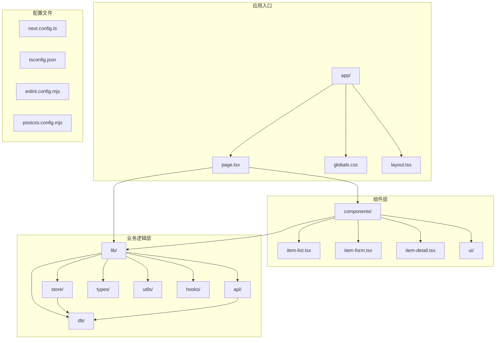
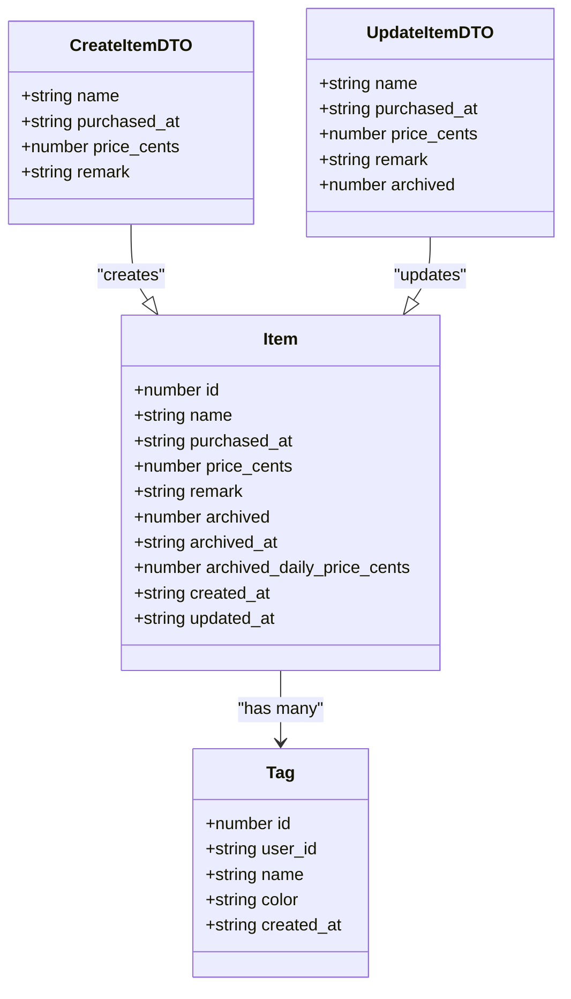
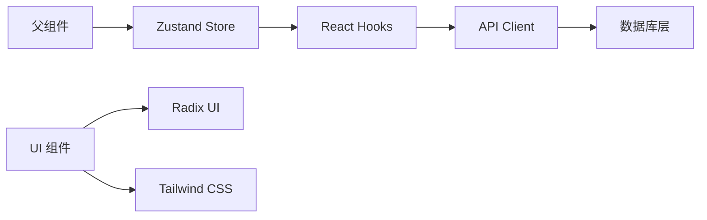
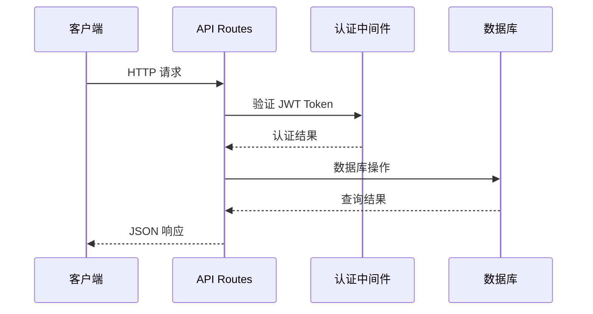
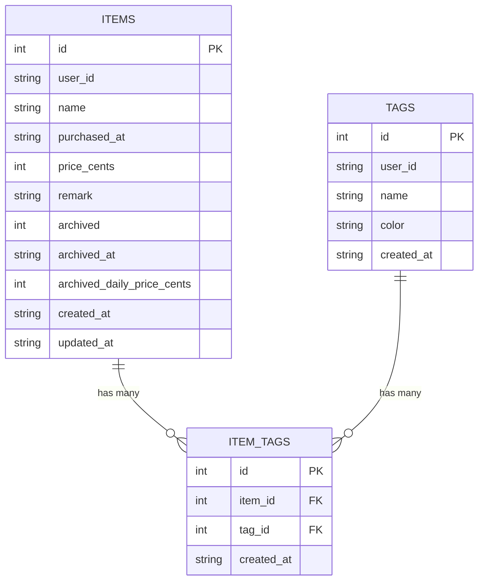
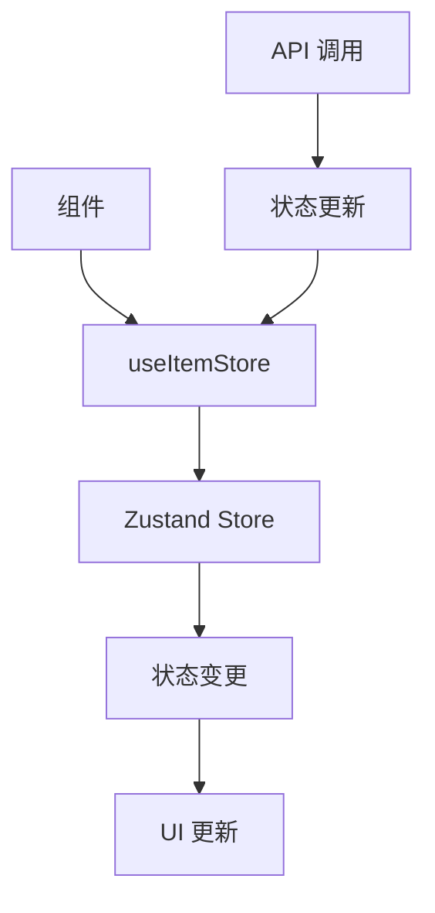
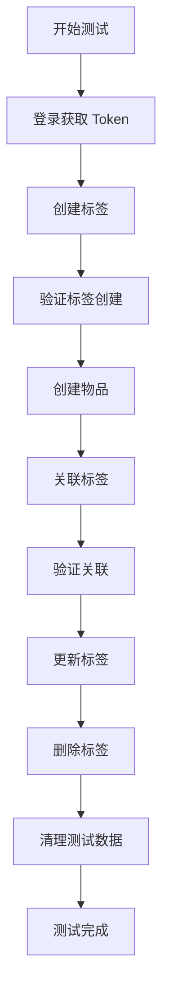
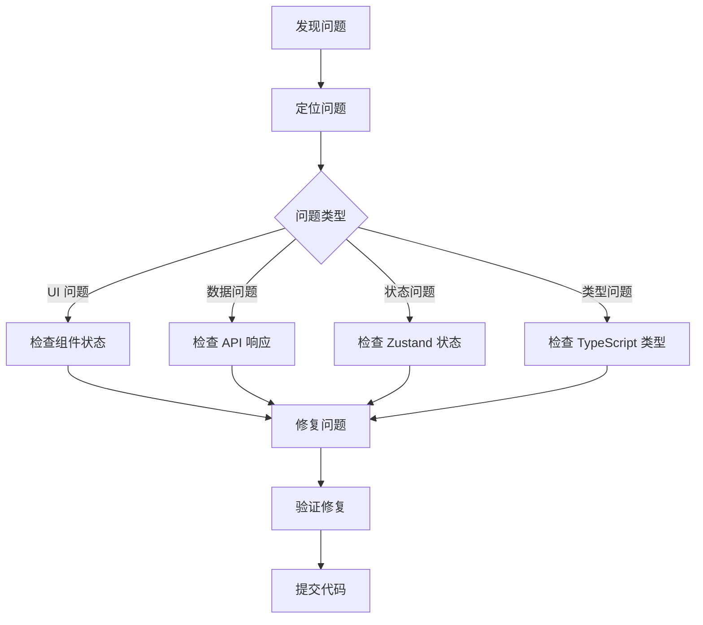

# 开发指南

<cite>
**本文档引用的文件**
- [package.json](file://package.json)
- [tsconfig.json](file://tsconfig.json)
- [next.config.ts](file://next.config.ts)
- [eslint.config.mjs](file://eslint.config.mjs)
- [postcss.config.mjs](file://postcss.config.mjs)
- [README.md](file://README.md)
- [app/page.tsx](file://app/page.tsx)
- [components/item-list.tsx](file://components/item-list.tsx)
- [components/item-form.tsx](file://components/item-form.tsx)
- [lib/store/item-store.ts](file://lib/store/item-store.ts)
- [lib/db/repository.ts](file://lib/db/repository.ts)
- [lib/api/client.ts](file://lib/api/client.ts)
- [lib/types/item.ts](file://lib/types/item.ts)
- [lib/types/tag.ts](file://lib/types/tag.ts)
- [test-tags-api.sh](file://test-tags-api.sh)
</cite>

## 目录
1. [项目概述](#项目概述)
2. [开发环境搭建](#开发环境搭建)
3. [项目架构](#项目架构)
4. [配置文件详解](#配置文件详解)
5. [代码风格规范](#代码风格规范)
6. [TypeScript 类型检查](#typescript-类型检查)
7. [核心组件开发](#核心组件开发)
8. [API 开发指南](#api-开发指南)
9. [数据库操作](#数据库操作)
10. [状态管理](#状态管理)
11. [测试方法](#测试方法)
12. [调试技巧](#调试技巧)
13. [常见问题解决方案](#常见问题解决方案)

## 项目概述

个人物品成本管理系统是一个基于 Next.js 16 和 React 19 的现代化 Web 应用，用于记录和管理个人物品的使用成本。项目采用全栈 TypeScript 开发，使用 SQLite 数据库进行数据存储，实现了完整的 CRUD 功能和用户认证。

### 技术栈概览

- **前端框架**: Next.js 16 + React 19
- **状态管理**: Zustand
- **样式系统**: Tailwind CSS 4
- **类型检查**: TypeScript
- **数据库**: SQLite (better-sqlite3)
- **认证**: JWT Token
- **构建工具**: Vite (Next.js 内置)

**章节来源**
- [README.md](file://README.md#L1-L137)
- [package.json](file://package.json#L1-L41)

## 开发环境搭建

### 系统要求

- Node.js v20 或更高版本
- npm v10 或更高版本
- Git

### 安装步骤

1. **克隆项目**
```bash
git clone <repository-url>
cd bookkeeping
```

2. **安装依赖**
```bash
npm install
```

3. **启动开发服务器**
```bash
npm run dev
```

4. **访问应用**
打开浏览器访问 `http://localhost:3000`

### 开发脚本

项目提供了以下开发脚本：

| 脚本命令 | 功能描述 |
|---------|----------|
| `npm run dev` | 启动开发服务器 |
| `npm run build` | 构建生产版本 |
| `npm run start` | 启动生产服务器 |
| `npm run lint` | 运行 ESLint 代码检查 |

**章节来源**
- [package.json](file://package.json#L5-L10)
- [README.md](file://README.md#L32-L57)

## 项目架构

### 目录结构



**图表来源**
- [app/page.tsx](file://app/page.tsx#L1-L275)
- [components/item-list.tsx](file://components/item-list.tsx#L1-L99)
- [lib/store/item-store.ts](file://lib/store/item-store.ts)

### 核心模块说明

1. **app/**: Next.js 应用根目录，包含页面路由和全局资源
2. **components/**: 可复用的 React 组件
3. **lib/**: 业务逻辑库，包含状态管理、数据库操作、API 客户端等
4. **public/**: 静态资源文件

**章节来源**
- [README.md](file://README.md#L59-L86)

## 配置文件详解

### TypeScript 配置 (tsconfig.json)

TypeScript 配置文件定义了项目的类型检查规则和编译选项：

| 配置项 | 值 | 说明 |
|-------|-----|------|
| `target` | ES2017 | 编译目标 ECMAScript 版本 |
| `strict` | true | 启用严格类型检查 |
| `noEmit` | true | 不生成输出文件 |
| `jsx` | react-jsx | JSX 编译模式 |
| `moduleResolution` | bundler | 模块解析策略 |

### Next.js 配置 (next.config.ts)

Next.js 配置文件支持框架级别的定制：

```typescript
const nextConfig: NextConfig = {
  // 当前为空配置，可根据需要扩展
};
```

### ESLint 配置 (eslint.config.mjs)

项目使用 ESLint 进行代码质量控制：

- 基于 Next.js 官方配置
- 集成了 TypeScript 支持
- 包含 Core Web Vitals 检查
- 自定义忽略规则

### PostCSS 配置 (postcss.config.mjs)

PostCSS 配置用于处理 CSS：

```javascript
const config = {
  plugins: {
    "@tailwindcss/postcss": {},  // Tailwind CSS 插件
  },
};
```

**章节来源**
- [tsconfig.json](file://tsconfig.json#L1-L35)
- [next.config.ts](file://next.config.ts#L1-L8)
- [eslint.config.mjs](file://eslint.config.mjs#L1-L19)
- [postcss.config.mjs](file://postcss.config.mjs#L1-L8)

## 代码风格规范

### ESLint 规则

项目遵循 Next.js 官方推荐的 ESLint 配置：

1. **基础规则**: 包含 React、TypeScript 和现代 JavaScript 最佳实践
2. **性能检查**: 集成 Core Web Vitals 性能指标检查
3. **自定义忽略**: 排除构建目录和临时文件

### 代码格式化

- 使用 ESLint 自动修复代码格式问题
- 遵循 React 组件命名约定
- 保持一致的导入顺序

### 提交前检查

运行以下命令确保代码质量：

```bash
npm run lint
```

**章节来源**
- [eslint.config.mjs](file://eslint.config.mjs#L1-L19)

## TypeScript 类型检查

### 类型定义结构

项目使用严格的 TypeScript 类型系统：



**图表来源**
- [lib/types/item.ts](file://lib/types/item.ts#L1-L94)
- [lib/types/tag.ts](file://lib/types/tag.ts#L1-L59)

### 类型安全实践

1. **接口定义**: 为每个数据模型定义明确的接口
2. **DTO 模式**: 使用专门的 DTO 对象处理 API 数据传输
3. **枚举类型**: 使用枚举定义状态和常量
4. **类型守卫**: 在运行时验证数据类型

**章节来源**
- [lib/types/item.ts](file://lib/types/item.ts#L1-L94)
- [lib/types/tag.ts](file://lib/types/tag.ts#L1-L59)

## 核心组件开发

### 组件架构模式

项目采用函数式组件和 Hook 的开发模式：



**图表来源**
- [app/page.tsx](file://app/page.tsx#L1-L275)
- [components/item-list.tsx](file://components/item-list.tsx#L1-L99)

### 主要组件说明

#### 1. 主页面组件 (page.tsx)

负责应用的主要布局和状态管理：

- 用户认证状态管理
- 数据加载和错误处理
- 物品列表展示
- 表单和详情弹窗控制

#### 2. 物品列表组件 (item-list.tsx)

实现物品的筛选和搜索功能：

- 支持按归档状态筛选
- 实时搜索功能
- 响应式网格布局

#### 3. 物品表单组件 (item-form.tsx)

处理物品的创建和编辑：

- 表单验证
- 标签选择器集成
- 错误处理和用户反馈

**章节来源**
- [app/page.tsx](file://app/page.tsx#L1-L275)
- [components/item-list.tsx](file://components/item-list.tsx#L1-L99)
- [components/item-form.tsx](file://components/item-form.tsx#L1-L216)

## API 开发指南

### API 架构设计

项目使用 Next.js API Routes 实现 RESTful API：



**图表来源**
- [lib/api/client.ts](file://lib/api/client.ts#L1-L187)

### API 客户端设计

API 客户端提供了统一的请求处理机制：

1. **自动认证**: 自动添加 JWT Token 到请求头
2. **错误处理**: 统一的错误响应格式
3. **状态管理**: 自动处理认证状态
4. **类型安全**: 完整的 TypeScript 类型定义

### 认证流程

1. **登录**: 发送用户名密码获取 JWT Token
2. **存储**: 将 Token 存储在 localStorage
3. **验证**: 每次请求自动添加 Authorization 头
4. **失效**: 401 错误时自动清除 Token

**章节来源**
- [lib/api/client.ts](file://lib/api/client.ts#L1-L187)

## 数据库操作

### 数据库架构

项目使用 SQLite 数据库进行数据存储：



**图表来源**
- [lib/db/repository.ts](file://lib/db/repository.ts#L1-L156)

### 数据访问模式

数据库操作采用 Repository 模式：

1. **单一职责**: 每个 Repository 负责特定实体的操作
2. **事务支持**: 支持复杂的数据操作
3. **类型安全**: 完整的 TypeScript 类型定义
4. **错误处理**: 统一的异常处理机制

### 核心操作方法

| 方法名 | 功能 | 参数 | 返回值 |
|-------|------|------|--------|
| `getAllItems()` | 获取所有物品 | filter?: ItemFilter | Item[] |
| `getItemById()` | 根据 ID 获取物品 | id: number | Item \| undefined |
| `createItem()` | 创建新物品 | data: CreateItemDTO | Item |
| `updateItem()` | 更新物品 | id: number, data: UpdateItemDTO | Item \| null |
| `deleteItem()` | 删除物品 | id: number | boolean |

**章节来源**
- [lib/db/repository.ts](file://lib/db/repository.ts#L1-L156)

## 状态管理

### Zustand 状态管理

项目使用 Zustand 进行状态管理：



**图表来源**
- [lib/store/item-store.ts](file://lib/store/item-store.ts#L1-L114)

### 状态结构设计

```typescript
interface ItemStore {
  items: Item[];
  filter: ItemFilter;
  selectedItem: Item | null;
  isFormOpen: boolean;
  editingItem: Item | null;
  isDetailOpen: boolean;
}
```

### 状态操作方法

| 方法名 | 功能 | 参数 | 说明 |
|-------|------|------|------|
| `setItems()` | 设置物品列表 | items: Item[] | 批量更新物品 |
| `addItem()` | 添加物品 | item: Item | 追加到列表开头 |
| `updateItem()` | 更新物品 | id: number, item: Item | 根据 ID 更新 |
| `removeItem()` | 删除物品 | id: number | 从列表中移除 |
| `setFilter()` | 设置筛选条件 | filter: ItemFilter | 更新筛选状态 |

**章节来源**
- [lib/store/item-store.ts](file://lib/store/item-store.ts#L1-L114)

## 测试方法

### API 测试脚本

项目提供了完整的 API 测试脚本：

```bash
# 标签 API 测试
bash test-tags-api.sh
```

测试脚本涵盖了：
1. 用户认证流程
2. 标签的 CRUD 操作
3. 物品与标签的关联
4. 错误场景处理

### 测试用例设计



**图表来源**
- [test-tags-api.sh](file://test-tags-api.sh#L1-L155)

### 测试最佳实践

1. **自动化测试**: 使用脚本自动化测试流程
2. **数据隔离**: 测试数据独立，避免相互影响
3. **错误处理**: 验证错误场景和边界情况
4. **状态验证**: 确保数据状态的一致性

**章节来源**
- [test-tags-api.sh](file://test-tags-api.sh#L1-L155)

## 调试技巧

### 开发工具使用

1. **浏览器开发者工具**
   - 使用 React DevTools 调试组件状态
   - Network 面板监控 API 请求
   - Console 面板查看错误信息

2. **VS Code 扩展**
   - TypeScript Hero: 类型推断可视化
   - ESLint: 实时代码检查
   - Tailwind CSS IntelliSense: 样式智能提示

### 调试策略



### 常用调试方法

1. **日志记录**: 在关键位置添加 console.log
2. **断点调试**: 使用浏览器断点调试
3. **状态快照**: 使用 React DevTools 查看组件状态
4. **网络监控**: 检查 API 请求和响应

## 常见问题解决方案

### 开发环境问题

#### 1. 依赖安装失败
**问题**: npm install 失败
**解决方案**:
```bash
# 清理缓存
npm cache clean --force

# 删除 node_modules 和 package-lock.json
rm -rf node_modules package-lock.json

# 重新安装
npm install
```

#### 2. 端口占用
**问题**: 端口 3000 被占用
**解决方案**:
```bash
# 查找占用进程
lsof -ti:3000

# 终止进程
kill -9 $(lsof -ti:3000)

# 或使用不同端口
npm run dev -- -p 3001
```

### 运行时问题

#### 1. TypeScript 类型错误
**问题**: 编译时出现类型错误
**解决方案**:
- 检查类型定义是否正确
- 确保所有必需字段都已提供
- 使用 TypeScript 类型断言

#### 2. API 请求失败
**问题**: API 调用返回错误
**解决方案**:
- 检查网络连接
- 验证 JWT Token 是否有效
- 查看浏览器控制台错误信息

#### 3. 数据库连接问题
**问题**: SQLite 数据库无法连接
**解决方案**:
- 检查数据库文件权限
- 确认数据库文件路径
- 验证数据库文件完整性

### 性能优化

#### 1. 页面加载缓慢
**解决方案**:
- 使用 React.memo 优化组件渲染
- 实现数据懒加载
- 减少不必要的状态更新

#### 2. 内存泄漏
**解决方案**:
- 正确清理事件监听器
- 使用 useEffect 清理函数
- 避免循环引用

### 部署问题

#### 1. 构建失败
**问题**: npm run build 失败
**解决方案**:
- 检查 TypeScript 类型错误
- 验证所有导入路径正确
- 确保环境变量配置正确

#### 2. 生产环境错误
**解决方案**:
- 启用生产模式日志
- 检查服务端渲染配置
- 验证静态资源路径

**章节来源**
- [README.md](file://README.md#L32-L57)
- [package.json](file://package.json#L5-L10)

## 总结

本开发指南涵盖了个人物品成本管理系统的完整开发流程，从环境搭建到部署维护。通过遵循本指南的最佳实践，开发者可以高效地参与项目开发，确保代码质量和项目稳定性。

### 关键要点

1. **技术栈掌握**: 熟练掌握 Next.js、React、TypeScript 和 Zustand
2. **代码规范**: 严格遵循 ESLint 规则和 TypeScript 类型检查
3. **测试驱动**: 编写单元测试和集成测试
4. **调试技巧**: 掌握各种调试工具和方法
5. **问题解决**: 建立系统的问题排查和解决流程

### 下一步建议

1. 阅读完整的代码库源码
2. 运行现有的测试套件
3. 尝试添加新的功能特性
4. 参与代码审查和讨论
5. 贡献文档和测试改进

通过持续的学习和实践，开发者将能够深入理解项目架构，并为项目的长期发展做出贡献。