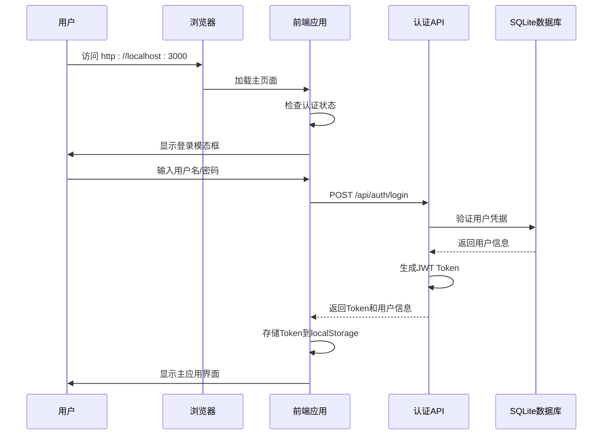
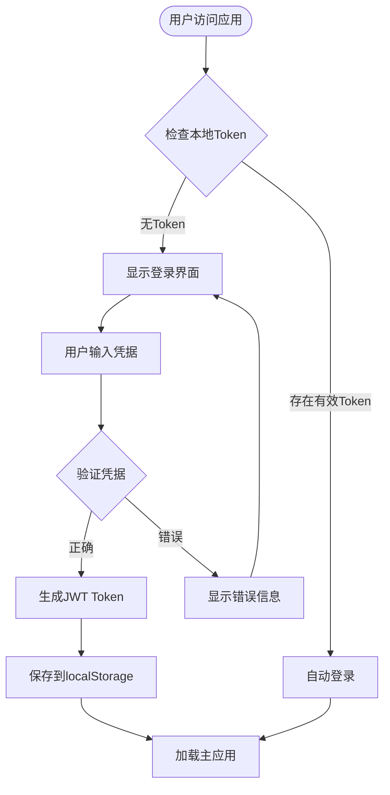
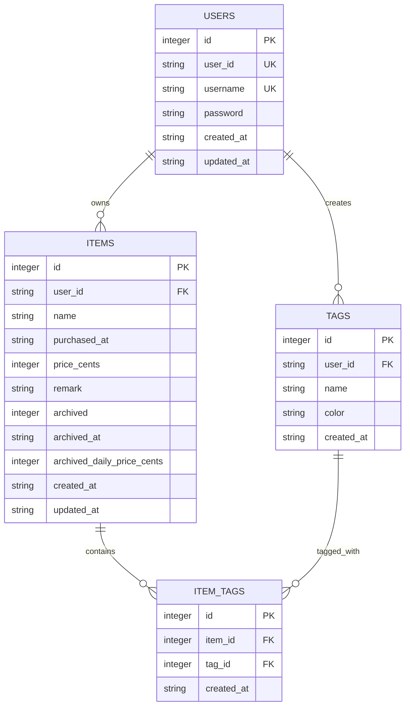

# 快速开始

<cite>
**本文档中引用的文件**
- [package.json](file://package.json)
- [README.md](file://README.md)
- [app/page.tsx](file://app/page.tsx)
- [next.config.ts](file://next.config.ts)
- [lib/auth/middleware.ts](file://lib/auth/middleware.ts)
- [app/api/auth/login/route.ts](file://app/api/auth/login/route.ts)
- [components/login-modal.tsx](file://components/login-modal.tsx)
- [lib/db/sqlite.ts](file://lib/db/sqlite.ts)
- [lib/auth/jwt.ts](file://lib/auth/jwt.ts)
- [lib/api/client.ts](file://lib/api/client.ts)
- [lib/db/user-repository.ts](file://lib/db/user-repository.ts)
- [tsconfig.json](file://tsconfig.json)
- [postcss.config.mjs](file://postcss.config.mjs)
</cite>

## 目录
1. [项目简介](#项目简介)
2. [系统要求](#系统要求)
3. [项目安装](#项目安装)
4. [开发环境配置](#开发环境配置)
5. [核心功能演示](#核心功能演示)
6. [生产环境部署](#生产环境部署)
7. [常见问题解决](#常见问题解决)
8. [总结](#总结)

## 项目简介

这是一个基于 Next.js 16 和 React 19 构建的个人物品成本管理系统，用于记录和管理个人物品的使用成本。项目采用现代化的技术栈，包括 TypeScript、Tailwind CSS 4、Zustand 状态管理和 JWT 认证等技术。

### 主要功能特性
- ✅ 物品信息管理（名称、购买日期、价格、备注）
- ✅ 自动计算使用天数和日均成本
- ✅ 物品归档/退役功能（锁定最终成本）
- ✅ 筛选和搜索功能
- ✅ 云端 SQLite 数据库存储
- ✅ 用户认证（单用户模式）
- ✅ 数据持久化（刷新不丢失）

**章节来源**
- [README.md](file://README.md#L1-L137)

## 系统要求

在开始之前，请确保您的开发环境满足以下要求：

### 必需软件
- **Node.js**: 版本 18 或更高版本
- **npm**: 版本 8 或更高版本（随 Node.js 一起安装）
- **Git**: 用于克隆项目（可选）

### 推荐工具
- **现代浏览器**: Chrome、Firefox、Edge 等
- **代码编辑器**: VS Code、WebStorm 等
- **终端/命令行工具**: Windows 用户推荐使用 PowerShell 或 WSL

## 项目安装

### 第一步：克隆项目（可选）

如果您是从 GitHub 克隆项目，可以使用以下命令：

```bash
git clone https://github.com/your-username/bookkeeping.git
cd bookkeeping
```

### 第二步：安装依赖包

项目使用 npm 作为包管理器。在项目根目录下运行以下命令：

```bash
npm install
```

**预期输出：**
```
added 1,234 packages from 678 contributors and audited 1,234 packages in 30.5s
found 0 vulnerabilities
```

**安装过程说明：**
- 下载并安装所有必要的依赖包
- 包括前端框架（Next.js、React）、UI 组件库（Radix UI）、数据库驱动（better-sqlite3）等
- 安装开发工具（TypeScript、ESLint、Tailwind CSS）

**章节来源**
- [package.json](file://package.json#L5-L10)

## 开发环境配置

### 启动开发服务器

安装完成后，使用以下命令启动开发服务器：

```bash
npm run dev
```

**预期输出：**
```
ready - started server on 0.0.0.0:3000, url: http://localhost:3000
info  - loaded env from /home/user/bookkeeping/.env
info  - Using webpack build system
info  - Building project
info  - Compiled successfully
```

### 访问应用程序

打开浏览器并访问以下地址：
```
http://localhost:3000
```

您应该会看到登录界面。

### 默认登录凭证

系统预设了单用户模式的默认登录信息：

- **用户名**: `admin`
- **密码**: `admin123`

**登录流程说明：**



**图表来源**
- [components/login-modal.tsx](file://components/login-modal.tsx#L43-L65)
- [app/api/auth/login/route.ts](file://app/api/auth/login/route.ts#L4-L46)

**章节来源**
- [README.md](file://README.md#L48-L50)
- [lib/db/sqlite.ts](file://lib/db/sqlite.ts#L82-L89)

## 核心功能演示

### 1. 登录验证机制

系统采用 JWT（JSON Web Token）进行用户认证，支持记住密码功能：



**图表来源**
- [components/login-modal.tsx](file://components/login-modal.tsx#L159-L182)
- [lib/auth/jwt.ts](file://lib/auth/jwt.ts#L35-L46)

### 2. 数据持久化机制

系统使用 SQLite 数据库存储所有数据，确保刷新页面后数据不会丢失：



**图表来源**
- [lib/db/sqlite.ts](file://lib/db/sqlite.ts#L28-L99)

### 3. 单用户模式特点

该项目采用单用户模式设计，具有以下特点：

- **简化架构**: 不需要复杂的多用户管理
- **易于部署**: 无需额外的用户管理系统
- **数据隔离**: 所有数据都属于同一个用户
- **默认凭据**: 预设 admin/admin123 作为初始登录凭据

**章节来源**
- [lib/db/sqlite.ts](file://lib/db/sqlite.ts#L82-L89)
- [lib/auth/jwt.ts](file://lib/auth/jwt.ts#L35-L46)

## 生产环境部署

### 构建生产版本

当开发完成并准备部署时，需要先构建生产版本：

```bash
npm run build
```

**构建过程说明：**
- 优化前端资源（代码分割、压缩等）
- 预渲染静态页面（如适用）
- 生成生产环境所需的文件

**预期输出：**
```
info  - Creating an optimized production build...
info  - Collecting page data...
info  - Generating static pages (0/0)
info  - Finalizing page optimization...
info  - Collecting build traces...
info  - Build completed in 45.2s
```

### 启动生产服务器

构建完成后，使用以下命令启动生产服务器：

```bash
npm run start
```

**预期输出：**
```
ready - started server on 0.0.0.0:3000, url: http://localhost:3000
info  - Using bundled mode for Next.js
```

### 生产环境注意事项

1. **环境变量**: 生产环境中建议设置 `JWT_SECRET` 环境变量
2. **HTTPS**: 在生产环境中启用 HTTPS 以保护用户数据
3. **反向代理**: 推荐使用 Nginx 或 Apache 作为反向代理
4. **监控**: 设置应用监控和日志记录

**章节来源**
- [package.json](file://package.json#L6-L9)

## 常见问题解决

### 1. 安装依赖失败

**问题**: `npm install` 执行过程中出现错误

**解决方案**:
```bash
# 清除 npm 缓存
npm cache clean --force

# 删除 node_modules 和 package-lock.json
rm -rf node_modules package-lock.json

# 重新安装依赖
npm install
```

### 2. 开发服务器无法启动

**问题**: `npm run dev` 启动失败

**解决方案**:
```bash
# 检查 Node.js 版本
node --version  # 确保版本 >= 18

# 检查端口是否被占用
lsof -i :3000  # Linux/Mac
netstat -ano | findstr :3000  # Windows

# 尝试使用不同端口
npm run dev -- -p 3001
```

### 3. 登录失败

**问题**: 使用默认凭据无法登录

**解决方案**:
1. 检查浏览器控制台是否有错误信息
2. 清除浏览器缓存和 localStorage
3. 确认数据库文件是否存在（`data/bookkeeping.db`）
4. 重新安装项目依赖

### 4. 数据丢失

**问题**: 刷新页面后数据消失

**解决方案**:
1. 检查 `data/` 目录是否存在
2. 确认 SQLite 数据库文件权限
3. 查看浏览器控制台是否有数据库相关错误

**章节来源**
- [lib/db/sqlite.ts](file://lib/db/sqlite.ts#L5-L12)

## 总结

通过本指南，您已经完成了以下步骤：

1. ✅ 安装了项目依赖
2. ✅ 启动了开发服务器
3. ✅ 成功登录系统
4. ✅ 了解了基本功能
5. ✅ 准备了生产环境部署

### 下一步建议

- **探索功能**: 尝试添加新的物品，体验完整的功能流程
- **自定义设置**: 修改默认凭据为更安全的组合
- **学习架构**: 深入了解项目的代码结构和技术实现
- **贡献代码**: 如有兴趣，可以参与项目的开发和完善

### 技术亮点回顾

- **现代化技术栈**: Next.js 16 + React 19 + TypeScript
- **状态管理**: Zustand 简洁高效的状态管理
- **UI 设计**: Tailwind CSS 4 + Radix UI 组件库
- **数据存储**: SQLite 云端数据库
- **安全认证**: JWT Token 认证机制

祝您使用愉快！如有任何问题，欢迎参考项目的源代码或查阅相关文档。