# 多用户系统演进

<cite>
**本文档引用的文件**
- [app/api/auth/login/route.ts](file://app/api/auth/login/route.ts)
- [app/api/user/route.ts](file://app/api/user/route.ts)
- [lib/db/user-repository.ts](file://lib/db/user-repository.ts)
- [lib/auth/jwt.ts](file://lib/auth/jwt.ts)
- [lib/db/repository.ts](file://lib/db/repository.ts)
- [lib/db/tag-repository.ts](file://lib/db/tag-repository.ts)
- [lib/auth/middleware.ts](file://lib/auth/middleware.ts)
- [lib/db/sqlite.ts](file://lib/db/sqlite.ts)
- [lib/types/item.ts](file://lib/types/item.ts)
- [lib/api/client.ts](file://lib/api/client.ts)
- [components/login-modal.tsx](file://components/login-modal.tsx)
- [package.json](file://package.json)
</cite>

## 目录
1. [项目现状分析](#项目现状分析)
2. [多用户架构设计](#多用户架构设计)
3. [用户管理功能实现](#用户管理功能实现)
4. [数据隔离机制](#数据隔离机制)
5. [JWT认证系统升级](#jwt认证系统升级)
6. [数据库迁移方案](#数据库迁移方案)
7. [API接口重构](#api接口重构)
8. [前端适配改造](#前端适配改造)
9. [兼容性处理策略](#兼容性处理策略)
10. [部署和测试指南](#部署和测试指南)

## 项目现状分析

当前系统采用单用户模式，所有数据都通过固定的`user_id: 'default_user'`进行管理。这种设计虽然简化了开发，但在多用户场景下存在以下问题：

### 当前架构特点
- **用户标识固定**：所有操作都使用`default_user`作为用户标识
- **数据无隔离**：所有用户的物品和标签数据存储在同一张表中
- **认证机制简单**：仅验证用户名和密码，未区分用户权限
- **扩展性受限**：无法支持多用户同时使用同一应用

### 技术栈现状
- **后端框架**：Next.js 16.0.7 + TypeScript
- **数据库**：SQLite (better-sqlite3)
- **认证方式**：JWT Token + 中间件验证
- **前端状态管理**：React + Zustand

**章节来源**
- [lib/db/sqlite.ts](file://lib/db/sqlite.ts#L28-L108)
- [lib/db/repository.ts](file://lib/db/repository.ts#L4-L5)

## 多用户架构设计

### 整体架构图

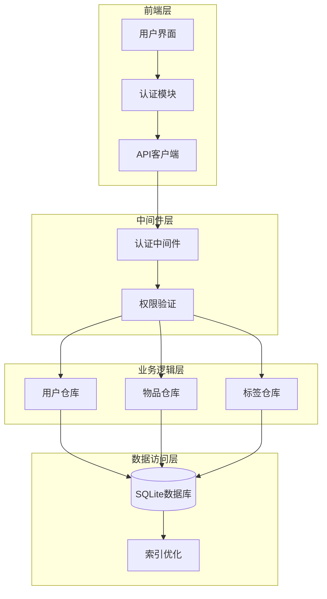

**图表来源**
- [lib/auth/middleware.ts](file://lib/auth/middleware.ts#L8-L33)
- [lib/db/user-repository.ts](file://lib/db/user-repository.ts#L1-L107)

### 核心设计原则

1. **数据隔离**：每个用户的数据完全独立，互不干扰
2. **透明迁移**：从单用户到多用户的平滑过渡
3. **性能优化**：通过索引和查询优化保证系统性能
4. **安全性**：严格的权限控制和数据保护

## 用户管理功能实现

### 用户注册流程

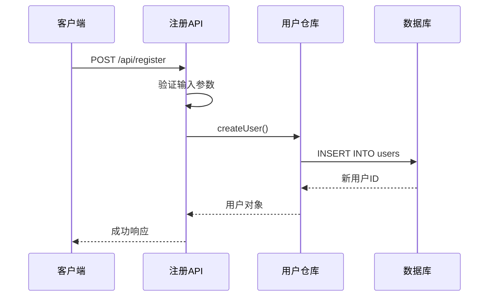

**图表来源**
- [app/api/user/route.ts](file://app/api/user/route.ts#L8-L103)

### 用户登录流程

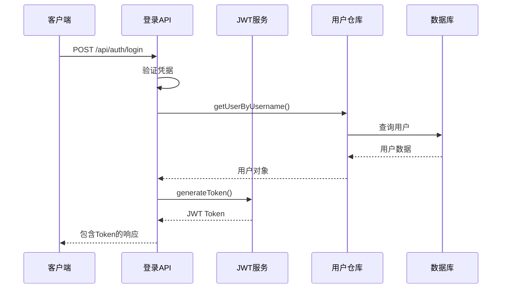

**图表来源**
- [app/api/auth/login/route.ts](file://app/api/auth/login/route.ts#L4-L47)
- [lib/auth/jwt.ts](file://lib/auth/jwt.ts#L35-L46)

### 用户信息管理

系统提供完整的用户信息管理功能：

| 功能模块 | 接口路径 | 主要操作 | 权限要求 |
|---------|---------|---------|---------|
| 获取用户信息 | GET /api/user | 查询当前用户详情 | 已认证用户 |
| 更新用户名 | PUT /api/user | 修改用户名 | 已认证用户 |
| 修改密码 | PUT /api/user | 更新密码 | 已认证用户 |
| 用户设置 | PUT /api/user | 综合更新用户信息 | 已认证用户 |

**章节来源**
- [app/api/user/route.ts](file://app/api/user/route.ts#L8-L103)

## 数据隔离机制

### 数据模型设计

在多用户架构中，所有核心表都需要添加`user_id`字段作为外键约束：

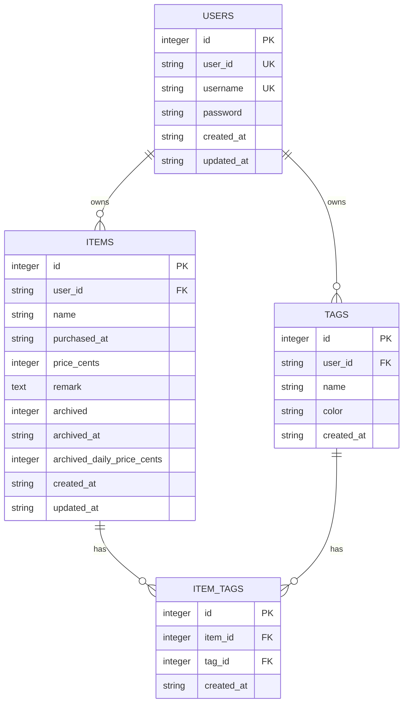

**图表来源**
- [lib/db/sqlite.ts](file://lib/db/sqlite.ts#L29-L80)

### 查询过滤机制

所有数据查询都需要自动添加`user_id`过滤条件：

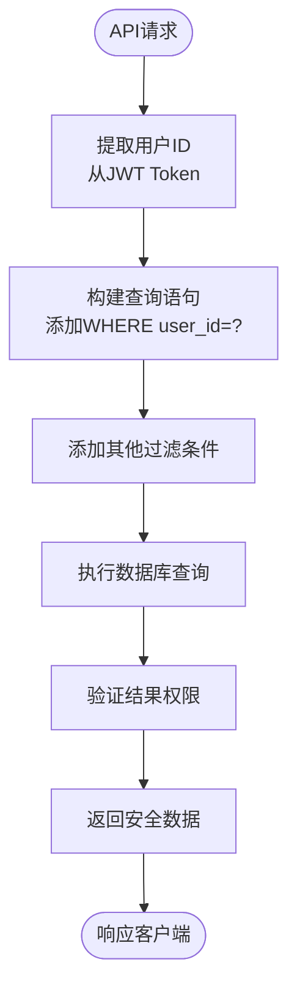

**图表来源**
- [lib/db/repository.ts](file://lib/db/repository.ts#L9-L22)
- [lib/db/tag-repository.ts](file://lib/db/tag-repository.ts#L14-L16)

**章节来源**
- [lib/db/repository.ts](file://lib/db/repository.ts#L9-L156)
- [lib/db/tag-repository.ts](file://lib/db/tag-repository.ts#L8-L191)

## JWT认证系统升级

### Token结构优化

升级后的JWT Token包含完整的用户身份信息：

```typescript
interface AuthPayload {
  userId: string;        // 用户唯一标识
  username: string;      // 用户名
  email?: string;        // 用户邮箱（可选）
  roles?: string[];      // 用户角色
  permissions?: string[];// 用户权限
}
```

### 认证流程改进

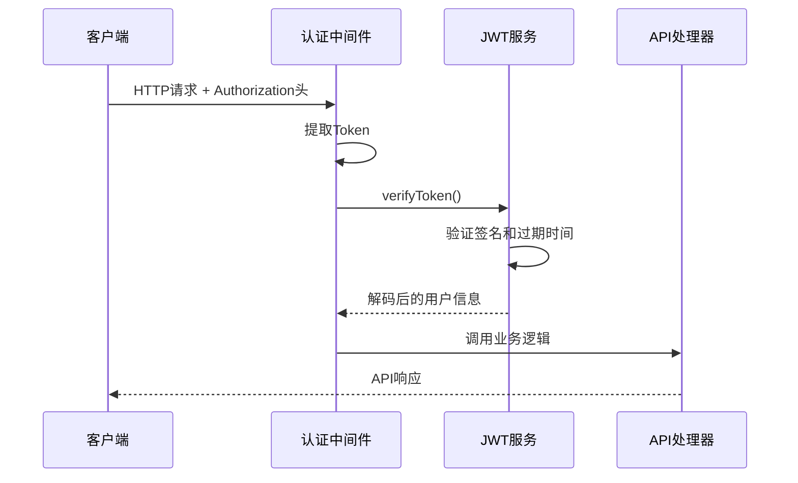

**图表来源**
- [lib/auth/middleware.ts](file://lib/auth/middleware.ts#L8-L33)
- [lib/auth/jwt.ts](file://lib/auth/jwt.ts#L23-L29)

### 中间件增强

认证中间件现在支持更灵活的权限验证：

| 功能特性 | 实现方式 | 应用场景 |
|---------|---------|---------|
| Token验证 | JWT签名验证 | 所有受保护的API |
| 用户信息注入 | 自动解析Token | API处理器参数 |
| 权限检查 | 角色和权限验证 | 特定功能API |
| 错误处理 | 统一错误响应 | 认证失败处理 |

**章节来源**
- [lib/auth/middleware.ts](file://lib/auth/middleware.ts#L8-L33)
- [lib/auth/jwt.ts](file://lib/auth/jwt.ts#L8-L57)

## 数据库迁移方案

### 迁移脚本设计

以下是关键表的迁移SQL语句：

```sql
-- 1. 创建新的users表（保留原有数据）
CREATE TABLE users_new (
    id INTEGER PRIMARY KEY AUTOINCREMENT,
    user_id TEXT NOT NULL UNIQUE,
    username TEXT NOT NULL UNIQUE,
    password TEXT NOT NULL,
    email TEXT,
    role TEXT DEFAULT 'user',
    created_at TEXT NOT NULL,
    updated_at TEXT NOT NULL
);

-- 2. 迁移现有用户数据
INSERT INTO users_new (user_id, username, password, created_at, updated_at)
SELECT 
    'user_' || id AS user_id,
    username,
    password,
    created_at,
    updated_at
FROM users;

-- 3. 更新items表结构
ALTER TABLE items ADD COLUMN user_id TEXT NOT NULL DEFAULT '';
UPDATE items SET user_id = 'user_' || (SELECT id FROM users LIMIT 1);

-- 4. 添加外键约束
ALTER TABLE items ADD CONSTRAINT fk_items_user 
FOREIGN KEY (user_id) REFERENCES users(user_id);

-- 5. 创建必要的索引
CREATE INDEX idx_items_user_id ON items(user_id);
CREATE INDEX idx_tags_user_id ON tags(user_id);
CREATE INDEX idx_item_tags_user_id ON item_tags(user_id);
```

### 迁移步骤详解

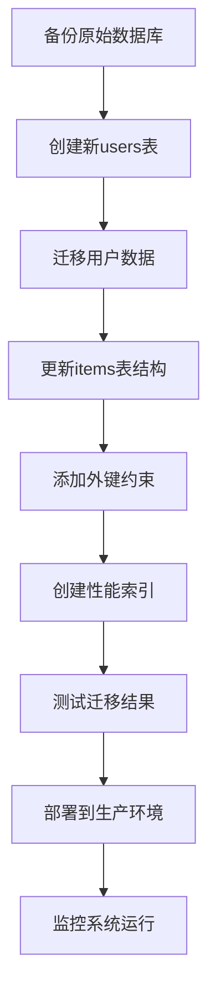

**图表来源**
- [lib/db/sqlite.ts](file://lib/db/sqlite.ts#L29-L80)

**章节来源**
- [lib/db/sqlite.ts](file://lib/db/sqlite.ts#L29-L108)

## API接口重构

### 核心API变更

#### 1. 物品管理API

原有的物品API需要添加用户过滤：

```typescript
// 重构前：固定使用default_user
export function getAllItems(): Item[] {
  const stmt = db.prepare('SELECT * FROM items WHERE user_id = ?');
  return stmt.all('default_user') as Item[];
}

// 重构后：动态获取当前用户ID
export function getAllItems(user: AuthPayload): Item[] {
  const stmt = db.prepare('SELECT * FROM items WHERE user_id = ?');
  return stmt.all(user.userId) as Item[];
}
```

#### 2. 标签管理API

标签API也需要相应的用户隔离：

```typescript
// 重构前：固定使用default_user
export function getAllTags(): Tag[] {
  const stmt = db.prepare('SELECT * FROM tags WHERE user_id = ?');
  return stmt.all('default_user') as Tag[];
}

// 重构后：使用当前用户
export function getAllTags(user: AuthPayload): Tag[] {
  const stmt = db.prepare('SELECT * FROM tags WHERE user_id = ?');
  return stmt.all(user.userId) as Tag[];
}
```

### API版本兼容性

为了确保平滑升级，可以采用渐进式重构策略：

| 阶段 | 实现内容 | 影响范围 | 兼容性 |
|------|---------|---------|--------|
| 第1阶段 | 添加user_id字段 | 数据库结构 | 向后兼容 |
| 第2阶段 | 修改查询逻辑 | 业务逻辑 | 向后兼容 |
| 第3阶段 | 强制用户认证 | API接口 | 需要客户端更新 |
| 第4阶段 | 完全启用多用户 | 全面功能 | 需要全面更新 |

**章节来源**
- [lib/db/repository.ts](file://lib/db/repository.ts#L9-L156)
- [lib/db/tag-repository.ts](file://lib/db/tag-repository.ts#L14-L191)

## 前端适配改造

### 认证状态管理

前端需要更新认证状态管理逻辑：

```typescript
// 重构前：简单的token检查
export function useAuth() {
  const token = getAuthToken();
  return { isAuthenticated: !!token, isChecking: false };
}

// 重构后：完整的用户状态管理
export function useAuth() {
  const [isAuthenticated, setIsAuthenticated] = useState(false);
  const [currentUser, setCurrentUser] = useState<AuthPayload | null>(null);
  const [isLoading, setIsLoading] = useState(true);
  
  useEffect(() => {
    const token = getAuthToken();
    if (token) {
      const payload = verifyToken(token);
      setCurrentUser(payload);
      setIsAuthenticated(true);
    }
    setIsLoading(false);
  }, []);
  
  return { isAuthenticated, currentUser, isLoading };
}
```

### API客户端适配

API客户端需要自动添加用户认证信息：

```typescript
// 重构前：简单的token传递
async function request<T>(url: string, options: RequestInit = {}) {
  const token = getAuthToken();
  const headers = { 'Content-Type': 'application/json' };
  
  if (token) {
    headers['Authorization'] = `Bearer ${token}`;
  }
  
  // ... 发送请求
}

// 重构后：完整的用户上下文
async function request<T>(url: string, options: RequestInit = {}) {
  const token = getAuthToken();
  const user = getCurrentUser(); // 获取当前用户信息
  
  const headers = {
    'Content-Type': 'application/json',
    'X-User-ID': user?.userId || ''
  };
  
  if (token) {
    headers['Authorization'] = `Bearer ${token}`;
  }
  
  // ... 发送请求
}
```

### 用户界面更新

登录模态框需要支持多用户场景：

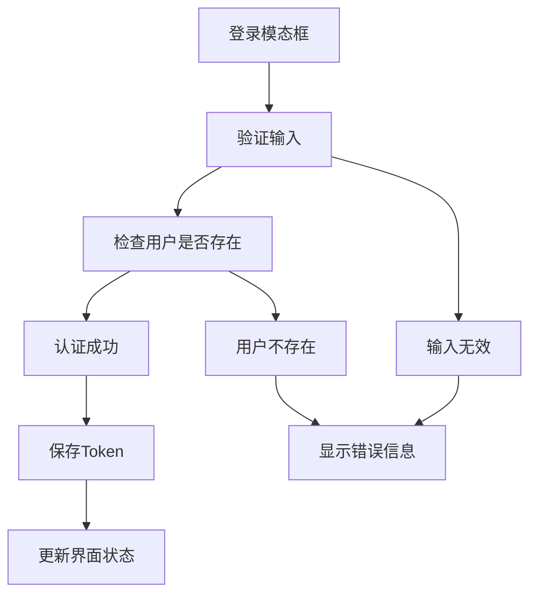

**图表来源**
- [components/login-modal.tsx](file://components/login-modal.tsx#L43-L65)

**章节来源**
- [lib/api/client.ts](file://lib/api/client.ts#L32-L62)
- [components/login-modal.tsx](file://components/login-modal.tsx#L15-L183)

## 兼容性处理策略

### 渐进式迁移方案

为了避免影响现有用户，采用渐进式迁移策略：

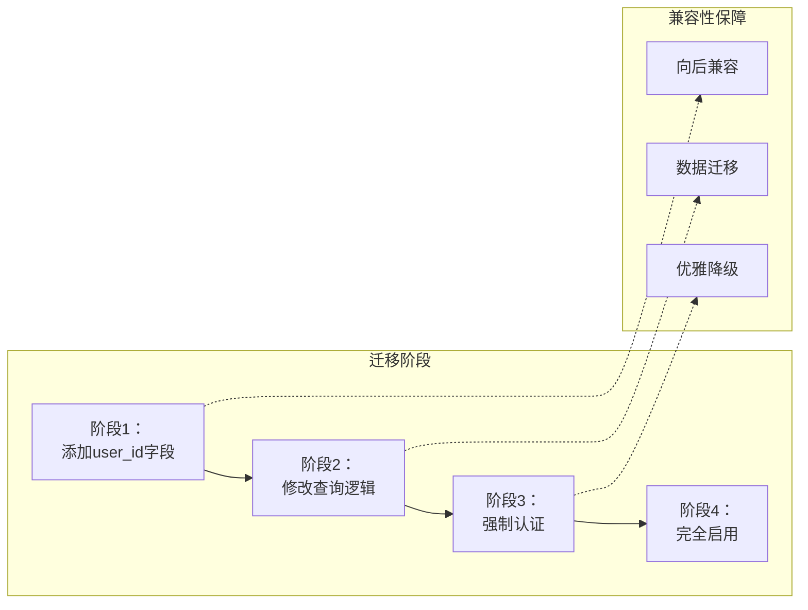

### 数据迁移策略

1. **零停机迁移**：在不影响现有服务的情况下进行数据迁移
2. **数据一致性**：确保迁移过程中的数据完整性
3. **回滚机制**：提供快速回滚方案

### 客户端兼容性

| 兼容性策略 | 实现方式 | 适用场景 |
|-----------|---------|---------|
| 版本检测 | API版本号识别 | 新旧客户端共存 |
| 功能降级 | 可选功能禁用 | 不支持多用户的老版本 |
| 渐进增强 | 新功能逐步启用 | 支持多用户的新版本 |
| 错误处理 | 优雅的错误提示 | 兼容性问题处理 |

## 部署和测试指南

### 测试策略

#### 1. 单元测试覆盖

```typescript
describe('多用户功能', () => {
  let user1: AuthPayload;
  let user2: AuthPayload;
  
  beforeEach(async () => {
    // 准备测试数据
    user1 = await createUser('user1', 'pass1');
    user2 = await createUser('user2', 'pass2');
  });
  
  test('用户数据隔离', async () => {
    // 用户1创建物品
    const item1 = await createItem(user1, { name: '测试物品1' });
    
    // 用户2创建物品
    const item2 = await createItem(user2, { name: '测试物品2' });
    
    // 验证数据隔离
    const items1 = await getAllItems(user1);
    expect(items1).toContain(item1);
    expect(items1).not.toContain(item2);
  });
});
```

#### 2. 集成测试场景

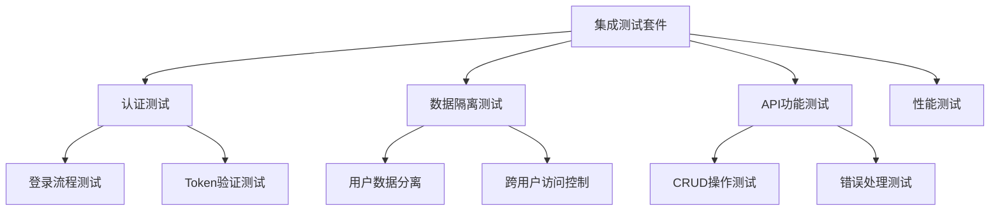

### 部署检查清单

| 检查项目 | 验证方法 | 重要性 |
|---------|---------|--------|
| 数据库迁移 | 检查表结构和数据完整性 | 关键 |
| API接口测试 | 验证所有API的功能 | 关键 |
| 认证流程 | 测试登录、注销、Token刷新 | 关键 |
| 性能监控 | 监控查询性能和响应时间 | 重要 |
| 兼容性测试 | 验证向后兼容性 | 重要 |
| 安全审计 | 检查权限控制和数据保护 | 关键 |

### 生产环境部署

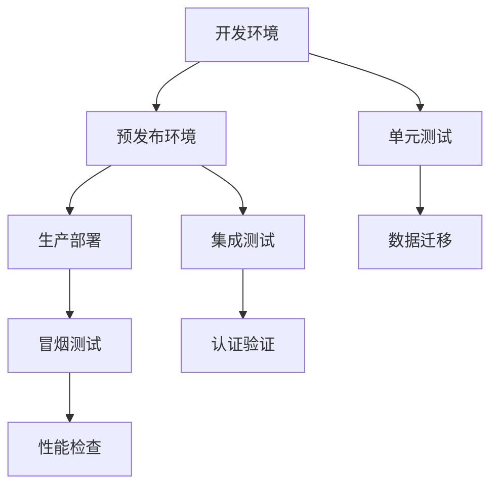

通过以上详细的演进方案，系统可以从单用户模式平滑过渡到多用户模式，确保数据安全、功能完整性和用户体验的连续性。整个迁移过程采用渐进式策略，最大限度地降低风险和对现有用户的影响。