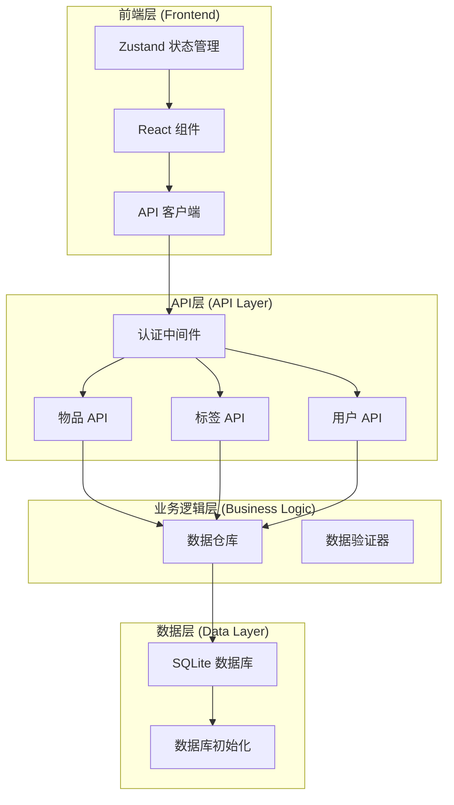
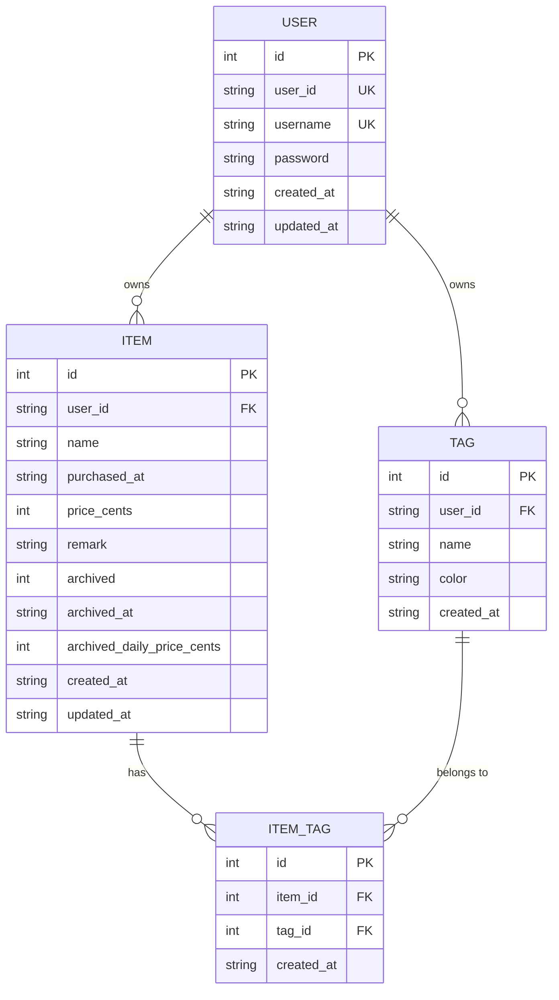
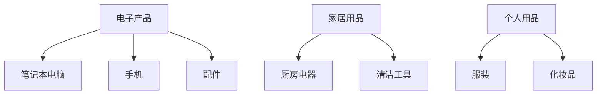
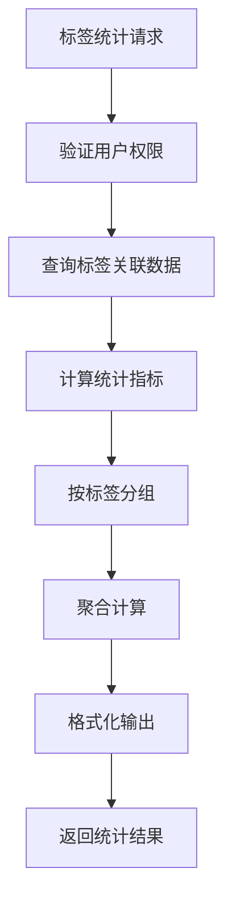
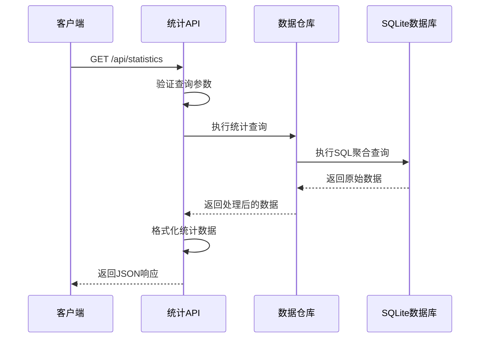
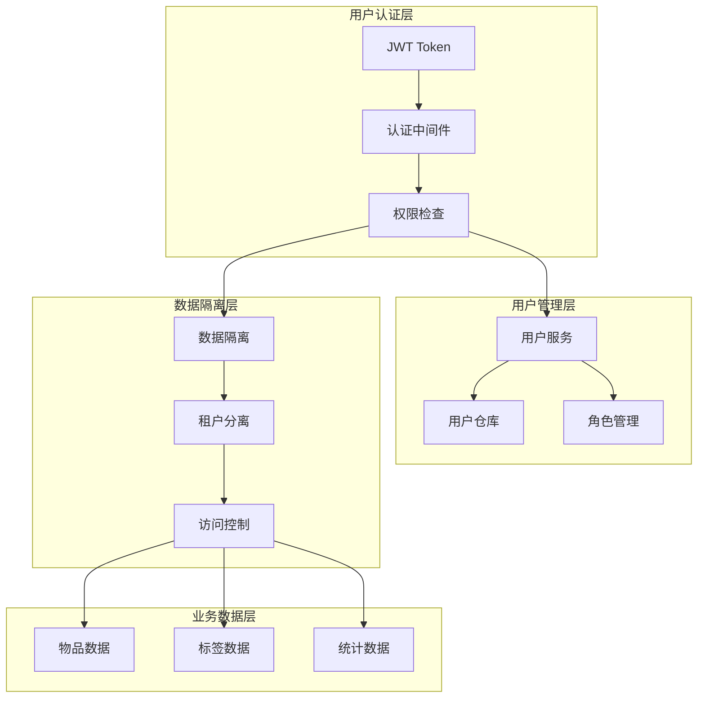
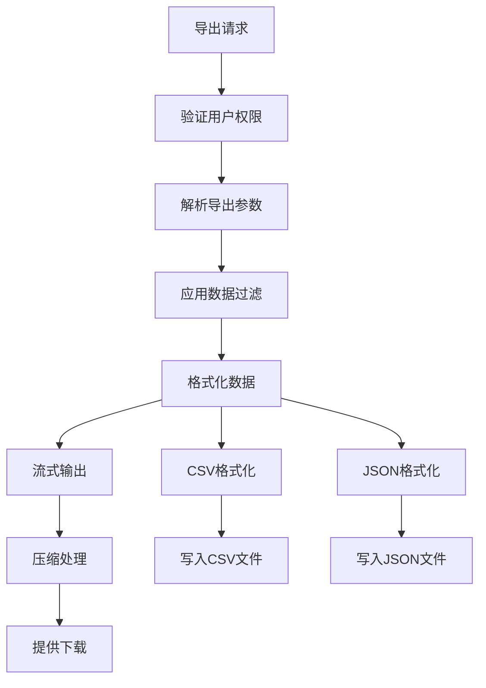
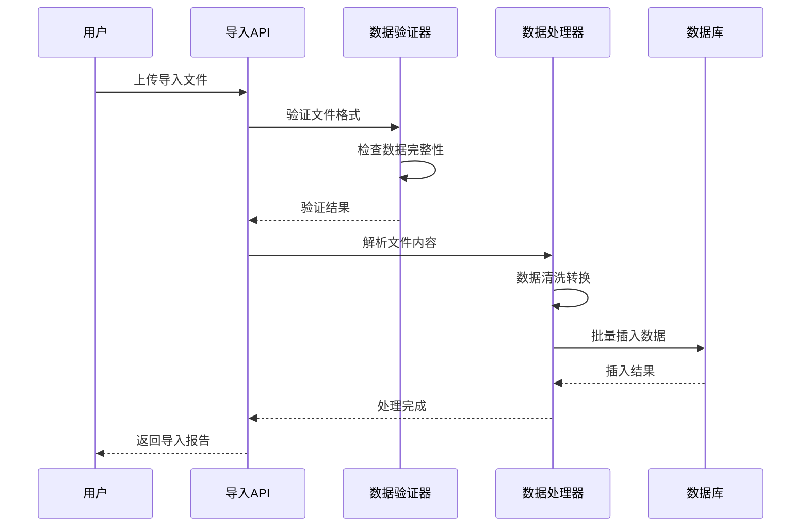
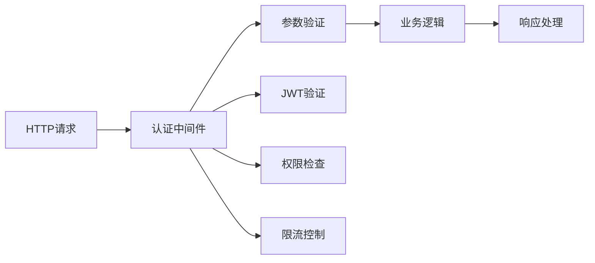
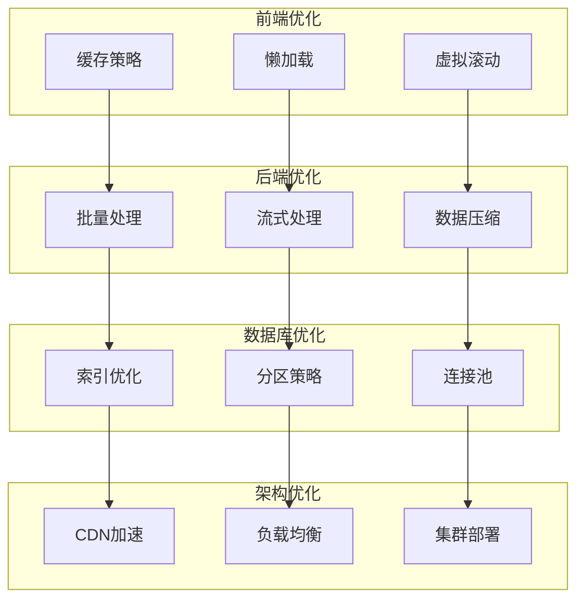

# 扩展与集成

<cite>
**本文档引用的文件**
- [README.md](file://README.md)
- [需求说明.md](file://需求说明.md)
- [app/api/items/route.ts](file://app/api/items/route.ts)
- [app/api/tags/route.ts](file://app/api/tags/route.ts)
- [app/api/items/[id]/route.ts](file://app/api/items/[id]/route.ts)
- [app/api/tags/[id]/route.ts](file://app/api/tags/[id]/route.ts)
- [app/api/items/[id]/tags/route.ts](file://app/api/items/[id]/tags/route.ts)
- [lib/db/repository.ts](file://lib/db/repository.ts)
- [lib/db/tag-repository.ts](file://lib/db/tag-repository.ts)
- [lib/db/sqlite.ts](file://lib/db/sqlite.ts)
- [lib/types/item.ts](file://lib/types/item.ts)
- [lib/types/tag.ts](file://lib/types/tag.ts)
- [package.json](file://package.json)
</cite>

## 目录
1. [系统概述](#系统概述)
2. [现有架构分析](#现有架构分析)
3. [分类/标签功能扩展](#分类标签功能扩展)
4. [数据统计报表实现](#数据统计报表实现)
5. [多用户系统演进](#多用户系统演进)
6. [数据导入导出功能](#数据导入导出功能)
7. [API层扩展点](#api层扩展点)
8. [数据库层扩展点](#数据库层扩展点)
9. [性能优化与扩展](#性能优化与扩展)
10. [部署与集成策略](#部署与集成策略)

## 系统概述

该个人物品成本管理系统基于Next.js 16 + React 19构建，采用现代化的全栈架构设计。系统目前实现了单用户模式下的物品管理功能，包括物品的CRUD操作、自动成本计算、归档机制等核心功能。

### 技术栈特点
- **前端**：Next.js App Router + React 19 + TypeScript + Tailwind CSS 4
- **后端**：Next.js API Routes + JWT认证
- **数据库**：SQLite (better-sqlite3) + WAL模式优化
- **状态管理**：Zustand
- **工具库**：date-fns (日期处理) + zod (数据验证)

**章节来源**
- [README.md](file://README.md#L17-L31)
- [package.json](file://package.json#L11-L26)

## 现有架构分析

### 系统架构图



**图表来源**
- [lib/db/repository.ts](file://lib/db/repository.ts#L1-L156)
- [lib/db/sqlite.ts](file://lib/db/sqlite.ts#L1-L109)

### 核心组件分析

#### 1. 数据模型设计
系统采用三层数据模型设计：



**图表来源**
- [lib/db/sqlite.ts](file://lib/db/sqlite.ts#L28-L98)
- [lib/types/item.ts](file://lib/types/item.ts#L8-L25)
- [lib/types/tag.ts](file://lib/types/tag.ts#L8-L14)

#### 2. API路由结构
系统采用Next.js API Routes的模块化设计：

```mermaid
graph LR
subgraph "API 路由结构"
ROOT[api/]
AUTH[auth/]
ITEMS[items/]
TAGS[tags/]
USER[user/]
ROOT --> AUTH
ROOT --> ITEMS
ROOT --> TAGS
ROOT --> USER
ITEMS --> ITEMS_ID[items/[id]/]
ITEMS_ID --> TAGS_ROUTE[tags/]
ITEMS_ID --> ITEMS_ID_ROUTE["GET/PUT/DELETE"]
TAGS --> TAGS_ID[tags/[id]/]
TAGS_ID --> TAGS_ID_ROUTE["GET/PUT/DELETE"]
end
```

**图表来源**
- [app/api/items/route.ts](file://app/api/items/route.ts#L1-L75)
- [app/api/tags/route.ts](file://app/api/tags/route.ts#L1-L73)

**章节来源**
- [lib/db/sqlite.ts](file://lib/db/sqlite.ts#L28-L98)
- [app/api/items/route.ts](file://app/api/items/route.ts#L1-L75)

## 分类/标签功能扩展

### 现有标签功能分析

系统已经实现了基础的标签功能，包括标签的CRUD操作和物品标签关联。现有功能满足基本的分类需求，但仍有扩展空间。

#### 标签功能现状
- **标签管理**：创建、更新、删除标签
- **物品标签关联**：支持多对多关系
- **批量操作**：支持设置物品的多个标签
- **唯一约束**：防止重复标签名称

### 扩展方案设计

#### 1. 标签层级结构
为支持更复杂的分类需求，可以引入标签层级结构：



**实现路径**：
- 在`tags`表中添加`parent_id`字段
- 实现递归查询算法
- 前端支持树形结构展示

#### 2. 标签颜色系统优化
当前标签使用固定颜色，可以扩展为：
- **主题色系**：预设颜色模板
- **自定义配色**：支持RGB/HSL格式
- **智能配色**：基于标签名称的自动配色

#### 3. 标签统计功能
扩展标签的统计分析能力：



**图表来源**
- [app/api/items/[id]/tags/route.ts](file://app/api/items/[id]/tags/route.ts#L1-L103)

### 新增标签管理接口

#### 接口设计规范
基于现有API模式，新增以下接口：

| 方法 | 路径 | 功能 | 参数 |
|------|------|------|------|
| GET | `/api/tags/tree` | 获取标签树结构 | `depth: number` |
| POST | `/api/tags/bulk` | 批量创建标签 | `tags: TagDTO[]` |
| PUT | `/api/tags/reorder` | 重新排序标签 | `order: number[]` |
| GET | `/api/tags/stats` | 获取标签统计 | `time_range: string` |

**章节来源**
- [app/api/tags/route.ts](file://app/api/tags/route.ts#L1-L73)
- [lib/db/tag-repository.ts](file://lib/db/tag-repository.ts#L1-L191)

## 数据统计报表实现

### 统计需求分析

根据需求文档，系统需要实现以下统计功能：

#### 1. 基础统计指标
- **总投入金额**：所有物品的购买价格总和
- **归档物品数量**：已归档物品的数量统计
- **平均日均成本**：所有物品的日均价格平均值
- **使用天数分布**：物品使用天数的统计分布

#### 2. 时间维度统计
- **月度统计**：按月份统计购买金额和物品数量
- **年度统计**：按年份统计整体成本趋势
- **季度分析**：季度性的成本对比分析

#### 3. 分类统计
- **按标签统计**：各标签下的物品成本统计
- **按购买时间统计**：不同时间段的购买行为分析
- **成本效益分析**：物品成本与使用价值的对比

### 统计查询架构



**图表来源**
- [lib/db/repository.ts](file://lib/db/repository.ts#L9-L22)

### 统计API设计

#### 核心统计接口
```typescript
// 统计查询参数类型
interface StatisticsQuery {
  timeRange: 'day' | 'week' | 'month' | 'year';
  filters?: {
    archived?: boolean;
    tags?: number[];
    startDate?: string;
    endDate?: string;
  };
}

// 统计结果类型
interface StatisticsResult {
  totalSpending: number;           // 总支出
  itemCount: number;               // 物品总数
  averageDailyCost: number;        // 平均日均成本
  costDistribution: CostBucket[];  // 成本分布
  timeSeries: TimePoint[];         // 时间序列数据
}

// 成本桶统计
interface CostBucket {
  minCost: number;
  maxCost: number;
  count: number;
  totalCost: number;
}

// 时间点数据
interface TimePoint {
  timestamp: string;
  spending: number;
  itemCount: number;
}
```

#### 统计查询实现要点
1. **索引优化**：为常用查询字段建立索引
2. **缓存策略**：实现统计结果缓存机制
3. **异步处理**：大数据量统计采用后台任务
4. **分页支持**：支持大量数据的分页查询

**章节来源**
- [需求说明.md](file://需求说明.md#L267-L268)

## 多用户系统演进

### 单用户到多用户的架构演进

#### 当前单用户架构限制
- 固定的`user_id`：所有数据都属于`default_user`
- 缺乏用户隔离：数据安全性不足
- 无权限控制：无法区分不同用户的操作权限

#### 多用户架构设计



**图表来源**
- [lib/db/sqlite.ts](file://lib/db/sqlite.ts#L70-L90)

### 用户系统扩展步骤

#### 第一阶段：用户实体化
1. **用户表设计**：添加`users`表存储用户信息
2. **认证机制**：实现用户名密码认证
3. **Token管理**：JWT Token的生成和验证

#### 第二阶段：数据隔离
1. **用户ID绑定**：将现有数据迁移到用户体系
2. **查询过滤**：所有数据库查询都添加`user_id`过滤
3. **权限验证**：确保用户只能访问自己的数据

#### 第三阶段：角色权限
1. **角色模型**：管理员、普通用户等角色定义
2. **权限矩阵**：定义不同角色的操作权限
3. **审计日志**：记录用户操作行为

### 多用户API扩展

#### 用户相关API接口
```typescript
// 用户注册
POST /api/users/register
{
  username: string,
  password: string,
  email?: string
}

// 用户登录
POST /api/users/login
{
  username: string,
  password: string
}

// 获取用户信息
GET /api/users/me

// 更新用户信息
PUT /api/users/me
{
  username?: string,
  email?: string,
  profile?: UserProfile
}
```

#### 数据迁移策略
1. **渐进式迁移**：先添加`user_id`字段，再填充数据
2. **数据备份**：迁移前完整备份现有数据
3. **回滚机制**：提供数据回滚的能力

**章节来源**
- [lib/db/sqlite.ts](file://lib/db/sqlite.ts#L70-L90)
- [需求说明.md](file://需求说明.md#L107-L114)

## 数据导入导出功能

### 导入导出需求分析

#### 导出功能需求
- **格式支持**：CSV、JSON两种格式
- **数据范围**：全部数据、指定时间范围、指定标签
- **字段选择**：可选择导出的字段
- **压缩打包**：大容量数据的压缩处理

#### 导入功能需求
- **格式验证**：CSV/JSON格式的严格验证
- **数据清洗**：重复数据处理和格式标准化
- **错误处理**：导入失败的详细错误报告
- **增量导入**：支持增量数据的合并

### 技术实现路径

#### 1. 导出功能实现



**图表来源**
- [app/api/items/route.ts](file://app/api/items/route.ts#L10-L29)

#### 2. 导入功能实现



**图表来源**
- [app/api/items/[id]/tags/route.ts](file://app/api/items/[id]/tags/route.ts#L45-L102)

### 导入导出API设计

#### 导出API接口
```typescript
// 导出请求参数
interface ExportRequest {
  format: 'csv' | 'json';
  dataRange: 'all' | 'custom';
  filters?: {
    startDate?: string;
    endDate?: string;
    tags?: number[];
    archived?: boolean;
  };
  fields?: string[];
}

// 导出响应
interface ExportResponse {
  jobId: string;           // 导出任务ID
  status: 'pending' | 'processing' | 'completed' | 'failed';
  progress: number;        // 进度百分比
  downloadUrl?: string;    // 下载链接
  error?: string;         // 错误信息
}
```

#### 导入API接口
```typescript
// 导入请求
interface ImportRequest {
  format: 'csv' | 'json';
  data: File;              // 上传的文件
  options?: {
    mergeStrategy: 'replace' | 'merge' | 'skip';
    skipErrors: boolean;
  };
}

// 导入响应
interface ImportResponse {
  totalRecords: number;    // 总记录数
  importedRecords: number; // 成功导入记录数
  skippedRecords: number;  // 跳过记录数
  errors: ImportError[];   // 导入错误列表
}

// 导入错误
interface ImportError {
  row: number;
  field: string;
  message: string;
  suggestedFix?: string;
}
```

### 数据格式规范

#### CSV导出格式
```
id,name,purchased_at,price_cents,remark,archived,archived_at,created_at,updated_at
1,MacBook Pro,2024-01-01,120000,工作用电脑,0,,2024-01-01T10:00:00Z,2024-01-01T10:00:00Z
2,iPhone 15,2024-02-15,80000,个人使用,1,2024-12-01,2024-02-15T14:30:00Z,2024-12-01T09:15:00Z
```

#### JSON导出格式
```json
{
  "metadata": {
    "exportedAt": "2024-01-15T10:30:00Z",
    "recordCount": 2,
    "formatVersion": "1.0"
  },
  "data": [
    {
      "id": 1,
      "name": "MacBook Pro",
      "purchased_at": "2024-01-01",
      "price_cents": 120000,
      "remark": "工作用电脑",
      "archived": 0,
      "created_at": "2024-01-01T10:00:00Z"
    }
  ]
}
```

**章节来源**
- [app/api/items/route.ts](file://app/api/items/route.ts#L10-L29)

## API层扩展点

### 现有API架构分析

#### 中间件体系
系统采用统一的认证中间件模式：



**图表来源**
- [app/api/items/route.ts](file://app/api/items/route.ts#L2-L3)

### 扩展点识别

#### 1. 认证扩展
- **多因素认证**：支持TOTP、生物识别等
- **OAuth集成**：Google、GitHub等第三方登录
- **会话管理**：长连接、自动续期机制

#### 2. 授权扩展
- **细粒度权限**：基于资源的操作权限控制
- **角色继承**：支持角色的层次结构
- **动态权限**：基于上下文的权限决策

#### 3. 性能扩展
- **缓存中间件**：Redis缓存集成
- **压缩中间件**：Gzip/Brotli压缩
- **限流中间件**：令牌桶算法限流

### 新增API接口设计

#### 统计API
```typescript
// 统计API路由
export const GET = withAuth(async (request: NextRequest) => {
  try {
    const { searchParams } = new URL(request.url);
    const query: StatisticsQuery = {
      timeRange: searchParams.get('range') as any,
      filters: parseFilters(searchParams)
    };
    
    const stats = await statisticsService.generate(query);
    return NextResponse.json({ success: true, data: stats });
  } catch (error) {
    return NextResponse.json({ error: '统计生成失败' }, { status: 500 });
  }
});
```

#### 导入导出API
```typescript
// 导出API路由
export const POST = withAuth(async (request: NextRequest) => {
  try {
    const body = await request.json();
    const exportJob = await exportService.createExport(body);
    return NextResponse.json({ success: true, data: exportJob });
  } catch (error) {
    return NextResponse.json({ error: '导出任务创建失败' }, { status: 500 });
  }
});

// 导入API路由
export const PUT = withAuth(async (request: NextRequest) => {
  try {
    const formData = await request.formData();
    const file = formData.get('file') as File;
    const options = JSON.parse(formData.get('options') as string);
    
    const importResult = await importService.processImport(file, options);
    return NextResponse.json({ success: true, data: importResult });
  } catch (error) {
    return NextResponse.json({ error: '导入处理失败' }, { status: 500 });
  }
});
```

**章节来源**
- [app/api/items/route.ts](file://app/api/items/route.ts#L10-L75)
- [app/api/tags/route.ts](file://app/api/tags/route.ts#L25-L73)

## 数据库层扩展点

### 现有数据库设计

#### 表结构分析
系统采用关系型数据库设计，具有良好的扩展性：

```mermaid
erDiagram
ITEMS {
id PK
user_id FK
name
purchased_at
price_cents
remark
archived
archived_at
archived_daily_price_cents
created_at
updated_at
}
TAGS {
id PK
user_id FK
name UK
color
created_at
}
ITEM_TAGS {
id PK
item_id FK
tag_id FK
created_at
}
USERS {
id PK
user_id UK
username UK
password
created_at
updated_at
}
ITEMS ||--o{ ITEM_TAGS : contains
TAGS ||--o{ ITEM_TAGS : tagged_by
USERS ||--o{ ITEMS : owns
USERS ||--o{ TAGS : manages
```

**图表来源**
- [lib/db/sqlite.ts](file://lib/db/sqlite.ts#L28-L98)

### 扩展点设计

#### 1. 数据模型扩展
- **物品属性扩展**：支持自定义字段
- **标签分类扩展**：支持标签分组
- **用户资料扩展**：支持用户个性化设置

#### 2. 查询性能优化
- **索引优化**：为常用查询字段添加复合索引
- **分区表**：按时间范围分区存储
- **物化视图**：预计算常用的统计结果

#### 3. 数据一致性保证
- **事务边界**：明确事务的边界和范围
- **乐观锁**：版本号控制并发更新
- **审计追踪**：记录所有数据变更历史

### 数据库迁移策略

#### 版本化迁移
```typescript
// 迁移脚本示例
interface Migration {
  version: number;
  up: () => Promise<void>;
  down: () => Promise<void>;
}

const migrations: Migration[] = [
  {
    version: 1,
    up: async () => {
      // 添加用户表
      db.exec(`CREATE TABLE users (...)`);
    },
    down: async () => {
      db.exec(`DROP TABLE users`);
    }
  },
  {
    version: 2,
    up: async () => {
      // 添加标签层级
      db.exec(`ALTER TABLE tags ADD COLUMN parent_id INTEGER`);
    },
    down: async () => {
      db.exec(`ALTER TABLE tags DROP COLUMN parent_id`);
    }
  }
];
```

#### 渐进式升级
1. **向后兼容**：新版本能够读取旧版本数据
2. **零停机升级**：支持在线升级
3. **数据验证**：升级前后的数据完整性检查

**章节来源**
- [lib/db/sqlite.ts](file://lib/db/sqlite.ts#L28-L98)
- [lib/db/repository.ts](file://lib/db/repository.ts#L1-L156)

## 性能优化与扩展

### 性能瓶颈分析

#### 当前性能特征
- **数据库性能**：SQLite单机性能限制
- **并发处理**：WAL模式提升并发能力
- **内存使用**：轻量级数据库占用较少内存
- **网络延迟**：单机部署网络开销小

#### 性能优化策略



### 扩展性考虑

#### 水平扩展
- **读写分离**：主从复制架构
- **分库分表**：按用户ID哈希分片
- **微服务拆分**：功能模块独立部署

#### 垂直扩展
- **硬件升级**：CPU、内存、存储优化
- **软件优化**：数据库引擎选择
- **架构优化**：缓存层、消息队列引入

## 部署与集成策略

### 当前部署特点
- **单机部署**：SQLite本地存储
- **容器化友好**：Docker支持
- **云平台兼容**：Vercel、VPS均可部署

### 企业级部署方案

#### 1. 云原生部署
```yaml
# Kubernetes部署配置
apiVersion: apps/v1
kind: Deployment
metadata:
  name: bookkeeping-app
spec:
  replicas: 3
  selector:
    matchLabels:
      app: bookkeeping
  template:
    spec:
      containers:
      - name: app
        image: bookkeeping:latest
        env:
        - name: DATABASE_URL
          valueFrom:
            secretKeyRef:
              name: db-secret
              key: url
        resources:
          requests:
            memory: "256Mi"
            cpu: "100m"
          limits:
            memory: "512Mi"
            cpu: "500m"
```

#### 2. 监控告警体系
- **应用监控**：APM工具集成
- **数据库监控**：慢查询分析
- **性能监控**：响应时间、吞吐量监控
- **业务监控**：用户活跃度、功能使用率

#### 3. 备份恢复策略
- **定期备份**：自动化备份任务
- **增量备份**：基于WAL的日志备份
- **异地备份**：多地容灾部署
- **快速恢复**：自动化故障恢复

### 第三方集成

#### 1. 数据分析平台
- **BI工具集成**：Tableau、Power BI
- **埋点分析**：用户行为追踪
- **报表系统**：自动生成财务报表

#### 2. 企业系统集成
- **ERP系统**：成本核算对接
- **CRM系统**：客户资产跟踪
- **财务系统**：预算管理集成

#### 3. 移动端集成
- **iOS/Android SDK**：原生应用开发
- **Web应用**：PWA支持
- **桌面应用**：跨平台客户端

## 总结与建议

### 扩展蓝图总结

基于现有系统架构，我们提出了以下扩展方向：

1. **功能扩展**：标签系统增强、统计报表完善、多用户支持
2. **技术扩展**：API层中间件增强、数据库性能优化、导入导出功能
3. **架构扩展**：水平扩展能力、微服务架构、云原生部署

### 实施建议

#### 分阶段实施计划
- **短期（1-3个月）**：标签功能增强、统计API开发
- **中期（3-6个月）**：多用户系统、导入导出功能
- **长期（6-12个月）**：微服务架构、企业级部署

#### 技术选型建议
- **数据库**：从SQLite迁移到PostgreSQL/MySQL
- **缓存**：Redis集群部署
- **监控**：Prometheus + Grafana
- **部署**：Kubernetes + Helm

#### 风险控制
- **数据迁移**：制定详细的迁移计划和回滚方案
- **性能测试**：压力测试和性能基准测试
- **安全加固**：OWASP安全最佳实践
- **文档完善**：API文档和运维手册

通过以上扩展方案的实施，系统将从单用户工具演变为功能完善的个人财务管理平台，为用户提供更加丰富和专业的成本管理体验。