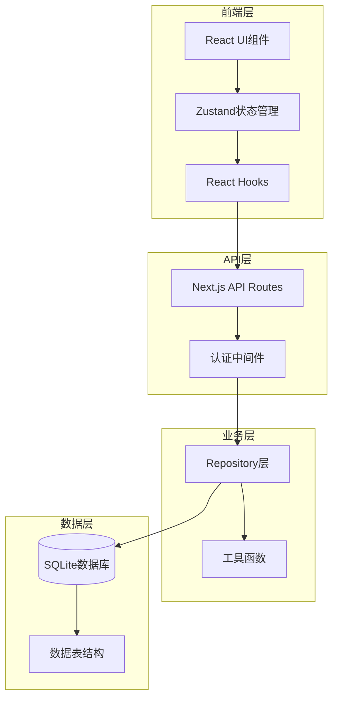
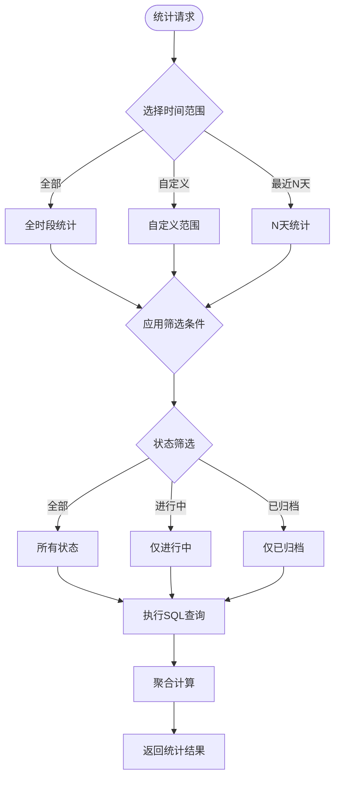
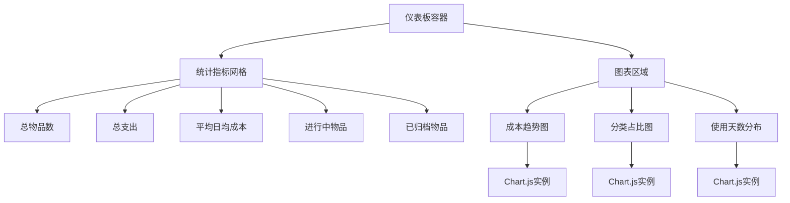

# 数据统计报表

<cite>
**本文档引用的文件**
- [repository.ts](file://lib/db/repository.ts)
- [sqlite.ts](file://lib/db/sqlite.ts)
- [item.ts](file://lib/types/item.ts)
- [item-utils.ts](file://lib/utils/item-utils.ts)
- [route.ts](file://app/api/items/route.ts)
- [sqlite.ts](file://lib/db/sqlite.ts)
- [package.json](file://package.json)
- [需求说明.md](file://需求说明.md)
- [README.md](file://README.md)
</cite>

## 目录
1. [概述](#概述)
2. [项目现状分析](#项目现状分析)
3. [统计报表需求分析](#统计报表需求分析)
4. [数据库设计扩展](#数据库设计扩展)
5. [后端API设计](#后端api设计)
6. [前端可视化方案](#前端可视化方案)
7. [性能优化策略](#性能优化策略)
8. [实施计划](#实施计划)
9. [总结](#总结)

## 概述

本项目是一个个人物品成本管理系统，目前具备基本的物品管理功能，包括物品信息记录、使用天数计算、日均成本计算和归档功能。根据需求文档第8节提出的统计报表扩展方向，本方案旨在为系统添加全面的数据统计功能，帮助用户更好地了解物品使用成本和消费趋势。

## 项目现状分析

### 现有功能架构

项目采用Next.js 16 + TypeScript + SQLite的技术栈，具有以下核心组件：



**图表来源**
- [repository.ts](file://lib/db/repository.ts#L1-L156)
- [sqlite.ts](file://lib/db/sqlite.ts#L1-L109)
- [route.ts](file://app/api/items/route.ts#L1-L75)

### 数据模型现状

当前数据库表结构包含以下字段：

| 字段名 | 类型 | 说明 |
|--------|------|------|
| id | INTEGER | 主键，自增 |
| user_id | TEXT | 所属用户ID |
| name | TEXT | 物品名称 |
| purchased_at | TEXT | 购买日期 |
| price_cents | INTEGER | 购买价格（分） |
| remark | TEXT | 备注 |
| archived | INTEGER | 是否归档（0=否，1=是） |
| archived_at | TEXT | 归档时间 |
| archived_daily_price_cents | INTEGER | 归档日均价格 |
| created_at | TEXT | 记录创建时间 |
| updated_at | TEXT | 最近更新时间 |

**章节来源**
- [sqlite.ts](file://lib/db/sqlite.ts#L29-L42)
- [item.ts](file://lib/types/item.ts#L9-L24)

## 统计报表需求分析

### 核心统计指标

基于需求文档和现有功能，统计报表应涵盖以下核心指标：

1. **基础统计指标**
   - 总物品数量
   - 总支出金额
   - 平均日均成本
   - 使用天数分布

2. **时间维度统计**
   - 按时间段统计（日/周/月/年）
   - 支出趋势分析
   - 归档物品统计

3. **状态维度统计**
   - 进行中物品 vs 已归档物品
   - 不同状态下的成本分布

4. **高级分析指标**
   - 成本效益分析
   - 物品生命周期统计
   - 购买频率分析

### 统计查询场景



## 数据库设计扩展

### 新增统计表结构

为了支持高效的统计查询，建议新增统计相关的表结构：

```sql
-- 统计快照表
CREATE TABLE IF NOT EXISTS statistics_snapshots (
    id INTEGER PRIMARY KEY AUTOINCREMENT,
    user_id TEXT NOT NULL,
    snapshot_time DATETIME NOT NULL,
    total_items INTEGER NOT NULL,
    total_spent_cents INTEGER NOT NULL,
    avg_daily_cost_cents INTEGER NOT NULL,
    active_items INTEGER NOT NULL,
    archived_items INTEGER NOT NULL,
    created_at DATETIME NOT NULL
);

-- 时间段统计表
CREATE TABLE IF NOT EXISTS time_period_stats (
    id INTEGER PRIMARY KEY AUTOINCREMENT,
    user_id TEXT NOT NULL,
    period_type TEXT NOT NULL, -- day/week/month/year
    period_start DATE NOT NULL,
    period_end DATE NOT NULL,
    total_spent_cents INTEGER NOT NULL,
    item_count INTEGER NOT NULL,
    avg_daily_cost_cents INTEGER NOT NULL,
    created_at DATETIME NOT NULL,
    UNIQUE(user_id, period_type, period_start)
);

-- 成本分布统计表
CREATE TABLE IF NOT EXISTS cost_distribution_stats (
    id INTEGER PRIMARY KEY AUTOINCREMENT,
    user_id TEXT NOT NULL,
    cost_range TEXT NOT NULL, -- e.g., "0-100", "100-500", "500+"
    item_count INTEGER NOT NULL,
    total_spent_cents INTEGER NOT NULL,
    percentage DECIMAL(5,2) NOT NULL,
    created_at DATETIME NOT NULL
);
```

### 索引优化

为提升统计查询性能，在相关字段上添加索引：

```sql
-- 统计快照表索引
CREATE INDEX IF NOT EXISTS idx_snapshots_user_time ON statistics_snapshots(user_id, snapshot_time);

-- 时间段统计表索引
CREATE INDEX IF NOT EXISTS idx_time_stats_user_period ON time_period_stats(user_id, period_type, period_start);
CREATE INDEX IF NOT EXISTS idx_time_stats_dates ON time_period_stats(period_start, period_end);

-- 成本分布统计表索引
CREATE INDEX IF NOT EXISTS idx_cost_dist_user_range ON cost_distribution_stats(user_id, cost_range);
```

**章节来源**
- [sqlite.ts](file://lib/db/sqlite.ts#L93-L99)

## 后端API设计

### 新增API端点

根据需求，新增以下API端点：

| 端点 | 方法 | 功能 | 参数 |
|------|------|------|------|
| `/api/analytics/dashboard` | GET | 获取仪表板统计数据 | `timeRange`, `statusFilter` |
| `/api/analytics/trends` | GET | 获取成本趋势数据 | `periodType`, `startDate`, `endDate` |
| `/api/analytics/category` | GET | 获取分类统计 | `groupBy`, `timeRange` |
| `/api/analytics/export` | GET | 导出统计数据 | `format`, `timeRange` |

### API响应结构设计

#### 仪表板统计数据响应

```typescript
interface DashboardStats {
  totalItems: number;
  totalSpent: number;
  averageDailyCost: number;
  activeItems: number;
  archivedItems: number;
  recentActivity: {
    date: string;
    spent: number;
    itemCount: number;
  }[];
}

interface AnalyticsResponse {
  success: boolean;
  data: DashboardStats;
  metadata: {
    timestamp: string;
    timeRange: string;
    calculationMethod: string;
  };
}
```

#### 趋势数据响应

```typescript
interface TrendDataPoint {
  date: string;
  spent: number;
  itemCount: number;
  averageCost: number;
}

interface TrendsResponse {
  success: boolean;
  data: TrendDataPoint[];
  metadata: {
    periodType: string;
    startDate: string;
    endDate: string;
    totalSpent: number;
    averageDailyCost: number;
  };
}
```

### 统计查询方法实现

在`repository.ts`中添加新的统计查询方法：

```typescript
// 获取仪表板统计数据
export function getDashboardStats(filter?: {
  timeRange?: string;
  statusFilter?: number;
}): DashboardStats {
  const db = getDatabase();
  const now = new Date();
  const params: any[] = [USER_ID];
  
  // 构建基础查询
  let sql = `
    SELECT 
      COUNT(*) as total_items,
      SUM(price_cents) as total_spent,
      AVG(CASE 
        WHEN archived = 1 THEN archived_daily_price_cents 
        ELSE price_cents / GREATEST(DATEDIFF(CURRENT_DATE, purchased_at), 1)
      END) as avg_daily_cost,
      SUM(CASE WHEN archived = 0 THEN 1 ELSE 0 END) as active_items,
      SUM(CASE WHEN archived = 1 THEN 1 ELSE 0 END) as archived_items
    FROM items 
    WHERE user_id = ?
  `;
  
  // 添加时间范围过滤
  if (filter?.timeRange) {
    const [start, end] = getTimeRange(filter.timeRange);
    sql += ` AND purchased_at BETWEEN ? AND ?`;
    params.push(start, end);
  }
  
  // 添加状态过滤
  if (filter?.statusFilter !== undefined) {
    sql += ` AND archived = ?`;
    params.push(filter.statusFilter);
  }
  
  const result = db.prepare(sql).get(...params) as any;
  return {
    totalItems: result.total_items,
    totalSpent: result.total_spent,
    averageDailyCost: Math.round(result.avg_daily_cost),
    activeItems: result.active_items,
    archivedItems: result.archived_items,
    recentActivity: getRecentActivity(filter)
  };
}

// 获取成本趋势数据
export function getCostTrends(params: {
  periodType: string;
  startDate?: string;
  endDate?: string;
}): TrendDataPoint[] {
  const db = getDatabase();
  const { periodType, startDate, endDate } = params;
  
  // 根据周期类型构建查询
  let groupByClause = '';
  switch (periodType) {
    case 'day':
      groupByClause = "strftime('%Y-%m-%d', purchased_at)";
      break;
    case 'week':
      groupByClause = "strftime('%Y-%W', purchased_at)";
      break;
    case 'month':
      groupByClause = "strftime('%Y-%m', purchased_at)";
      break;
    case 'year':
      groupByClause = "strftime('%Y', purchased_at)";
      break;
  }
  
  const sql = `
    SELECT 
      ${groupByClause} as period,
      COUNT(*) as item_count,
      SUM(price_cents) as total_spent,
      AVG(price_cents / GREATEST(DATEDIFF(CURRENT_DATE, purchased_at), 1)) as avg_cost
    FROM items
    WHERE user_id = ? AND purchased_at BETWEEN ? AND ?
    GROUP BY ${groupByClause}
    ORDER BY period ASC
  `;
  
  const stmt = db.prepare(sql);
  return stmt.all(USER_ID, startDate, endDate) as TrendDataPoint[];
}
```

**章节来源**
- [repository.ts](file://lib/db/repository.ts#L6-L23)
- [item.ts](file://lib/types/item.ts#L80-L85)

## 前端可视化方案

### 图表库选择

推荐使用Chart.js作为轻量级图表库，原因如下：

1. **轻量级**：压缩后约40KB，加载速度快
2. **易用性**：API简单，学习成本低
3. **灵活性**：支持多种图表类型
4. **社区支持**：文档完善，插件丰富

### 可视化组件设计

#### 仪表板组件结构



#### 推荐图表类型

| 图表类型 | 适用场景 | 数据格式 | 交互功能 |
|----------|----------|----------|----------|
| 折线图 | 成本趋势分析 | 时间序列数据 | 鼠标悬停显示详细信息 |
| 饼图 | 分类占比分析 | 分类统计数据 | 点击切换显示/隐藏 |
| 柱状图 | 数量对比分析 | 分类计数数据 | 点击跳转到详情页 |
| 散点图 | 成本效益分析 | 成本vs使用天数 | 点击查看具体物品 |

### 响应式设计

确保图表组件具有良好的响应式表现：

```typescript
// 响应式图表配置示例
const responsiveConfig = {
  maintainAspectRatio: false,
  responsive: true,
  plugins: {
    legend: {
      position: 'bottom',
      labels: {
        padding: 20,
        boxWidth: 12
      }
    },
    tooltip: {
      mode: 'index',
      intersect: false,
      backgroundColor: 'rgba(0,0,0,0.8)',
      titleColor: '#fff',
      bodyColor: '#fff'
    }
  },
  scales: {
    x: {
      ticks: {
        maxRotation: 45,
        minRotation: 45
      }
    }
  }
};
```

**章节来源**
- [package.json](file://package.json#L12-L26)

## 性能优化策略

### 查询优化

#### 1. 索引策略

为统计查询的关键字段建立复合索引：

```sql
-- 统计查询常用索引
CREATE INDEX IF NOT EXISTS idx_items_user_purchased ON items(user_id, purchased_at);
CREATE INDEX IF NOT EXISTS idx_items_user_archived ON items(user_id, archived);
CREATE INDEX IF NOT EXISTS idx_items_user_price ON items(user_id, price_cents);
```

#### 2. 查询缓存

实现查询结果缓存机制：

```typescript
// 缓存管理器
class AnalyticsCache {
  private cache = new Map<string, {
    data: any;
    timestamp: number;
    ttl: number;
  }>();
  
  private readonly CACHE_TTL = 15 * 60 * 1000; // 15分钟
  
  get(key: string): any {
    const cached = this.cache.get(key);
    if (!cached) return null;
    
    if (Date.now() - cached.timestamp > cached.ttl) {
      this.cache.delete(key);
      return null;
    }
    
    return cached.data;
  }
  
  set(key: string, data: any): void {
    this.cache.set(key, {
      data,
      timestamp: Date.now(),
      ttl: this.CACHE_TTL
    });
  }
}

const analyticsCache = new AnalyticsCache();
```

#### 3. 节流处理

对频繁的统计请求进行节流处理：

```typescript
// 请求节流装饰器
function throttleAnalytics(target: any, propertyKey: string, descriptor: PropertyDescriptor) {
  const originalMethod = descriptor.value;
  const requestMap = new Map();
  
  descriptor.value = async function(...args: any[]) {
    const key = JSON.stringify(args);
    const now = Date.now();
    
    if (requestMap.has(key)) {
      const lastCall = requestMap.get(key);
      if (now - lastCall < 5000) { // 5秒内只允许一次请求
        return Promise.resolve(null);
      }
    }
    
    requestMap.set(key, now);
    return originalMethod.apply(this, args);
  };
}
```

### 数据预计算

定期预计算统计结果，减少实时查询压力：

```typescript
// 定时任务：每日凌晨更新统计快照
async function updateStatisticsSnapshot() {
  const db = getDatabase();
  
  const sql = `
    INSERT INTO statistics_snapshots 
    (user_id, snapshot_time, total_items, total_spent, avg_daily_cost, 
     active_items, archived_items, created_at)
    SELECT 
      user_id,
      CURRENT_TIMESTAMP,
      COUNT(*),
      SUM(price_cents),
      AVG(CASE WHEN archived = 1 THEN archived_daily_price_cents 
               ELSE price_cents / GREATEST(DATEDIFF(CURRENT_DATE, purchased_at), 1) END),
      SUM(CASE WHEN archived = 0 THEN 1 ELSE 0 END),
      SUM(CASE WHEN archived = 1 THEN 1 ELSE 0 END),
      CURRENT_TIMESTAMP
    FROM items
    GROUP BY user_id
  `;
  
  db.prepare(sql).run();
}
```

**章节来源**
- [sqlite.ts](file://lib/db/sqlite.ts#L93-L99)

## 实施计划

### 第一阶段：基础设施建设（1-2天）

1. **数据库结构升级**
   - 创建统计相关表
   - 添加必要的索引
   - 初始化默认数据

2. **后端API基础框架**
   - 实现基础统计查询方法
   - 添加认证中间件
   - 建立错误处理机制

### 第二阶段：核心功能开发（2-3天）

1. **统计查询实现**
   - 完成仪表板统计数据查询
   - 实现成本趋势分析
   - 添加分类统计功能

2. **API端点开发**
   - 实现`/api/analytics/dashboard`
   - 实现`/api/analytics/trends`
   - 实现`/api/analytics/category`

### 第三阶段：前端集成（2-3天）

1. **可视化组件开发**
   - 集成Chart.js图表库
   - 开发响应式图表组件
   - 实现数据绑定逻辑

2. **用户界面设计**
   - 创建统计报表页面
   - 实现筛选和排序功能
   - 添加导出功能

### 第四阶段：优化和测试（2-3天）

1. **性能优化**
   - 实现查询缓存
   - 添加请求节流
   - 优化数据库索引

2. **功能测试**
   - 单元测试覆盖
   - 集成测试验证
   - 性能基准测试

## 总结

本方案为个人物品成本管理系统设计了一套完整的数据统计报表功能，涵盖了从数据库设计到前端可视化的全流程。通过合理的架构设计和技术选型，确保了系统的可扩展性和高性能。

### 主要优势

1. **渐进式增强**：从基础统计到高级分析，循序渐进
2. **性能优先**：通过索引优化、缓存机制和查询优化保证性能
3. **用户体验**：提供直观的可视化界面和灵活的筛选功能
4. **技术兼容**：基于现有技术栈，降低迁移成本

### 后续发展方向

1. **机器学习集成**：基于历史数据预测未来成本趋势
2. **移动端适配**：开发专门的移动应用版本
3. **多用户支持**：扩展为真正的多用户系统
4. **数据导出**：支持多种格式的数据导出功能

这套统计报表系统将显著提升用户的使用体验，帮助他们更好地理解和管理个人物品成本，实现更有价值的消费决策。