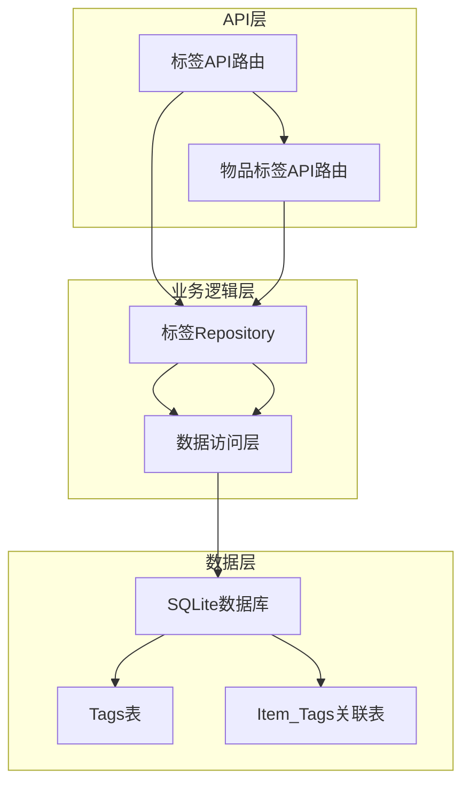
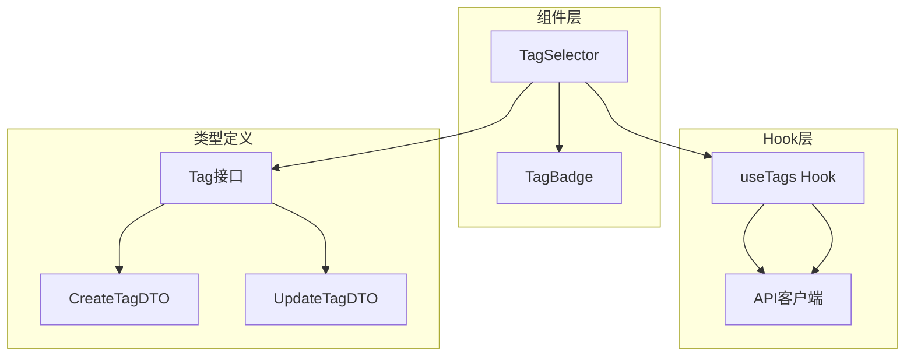
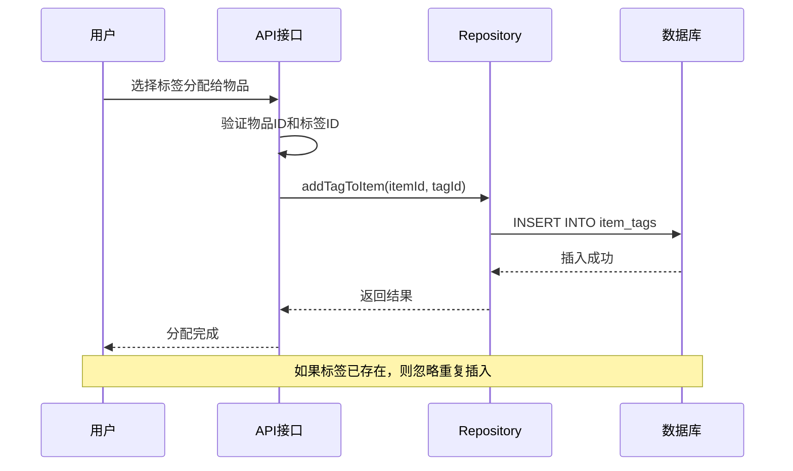
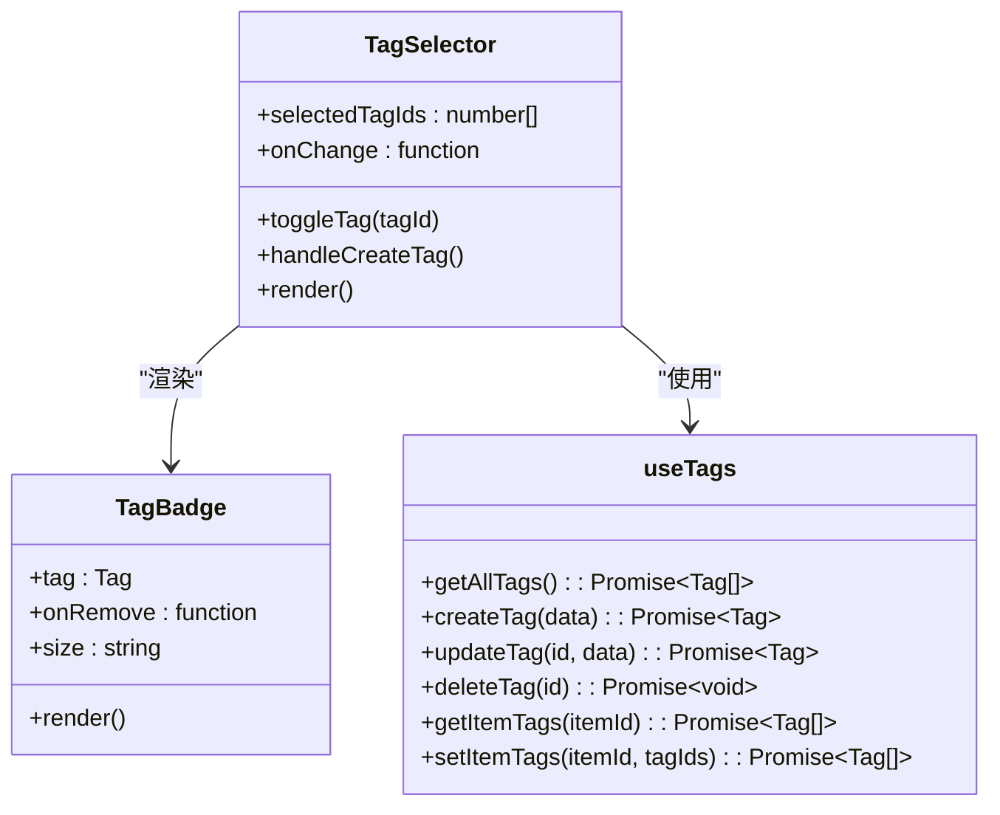
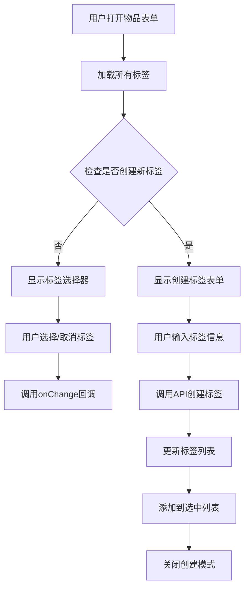
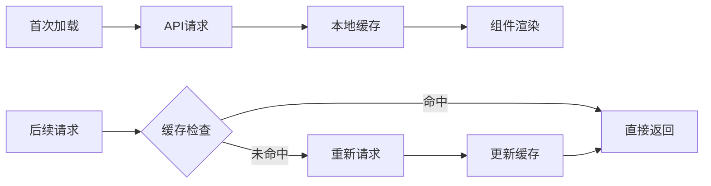

# 标签系统扩展

<cite>
**本文档中引用的文件**
- [app/api/tags/route.ts](file://app/api/tags/route.ts)
- [app/api/tags/[id]/route.ts](file://app/api/tags/[id]/route.ts)
- [app/api/items/[id]/tags/route.ts](file://app/api/items/[id]/tags/route.ts)
- [lib/db/tag-repository.ts](file://lib/db/tag-repository.ts)
- [lib/db/sqlite.ts](file://lib/db/sqlite.ts)
- [lib/types/tag.ts](file://lib/types/tag.ts)
- [lib/hooks/use-tags.ts](file://lib/hooks/use-tags.ts)
- [lib/api/client.ts](file://lib/api/client.ts)
- [components/tag-selector.tsx](file://components/tag-selector.tsx)
- [components/tag-badge.tsx](file://components/tag-badge.tsx)
</cite>

## 目录
1. [项目概述](#项目概述)
2. [现有架构分析](#现有架构分析)
3. [数据库表结构设计](#数据库表结构设计)
4. [标签CRUD接口设计](#标签crud接口设计)
5. [物品标签关联逻辑](#物品标签关联逻辑)
6. [前端组件集成方案](#前端组件集成方案)
7. [性能优化策略](#性能优化策略)
8. [扩展功能建议](#扩展功能建议)
9. [最佳实践指南](#最佳实践指南)
10. [总结](#总结)

## 项目概述

本项目是一个基于Next.js的记账应用，当前已具备基本的标签管理功能。标签系统采用SQLite数据库存储，支持为物品添加、编辑、删除标签，并提供了完整的CRUD接口和前端组件。

### 当前功能范围
- 标签的基本CRUD操作
- 物品与标签的一对多关联
- 标签的颜色自定义
- 基础的标签筛选功能

## 现有架构分析

### 后端架构层次



**图表来源**
- [app/api/tags/route.ts](file://app/api/tags/route.ts#L1-L73)
- [app/api/items/[id]/tags/route.ts](file://app/api/items/[id]/tags/route.ts#L1-L103)
- [lib/db/tag-repository.ts](file://lib/db/tag-repository.ts#L1-L191)

### 前端架构层次



**图表来源**
- [components/tag-selector.tsx](file://components/tag-selector.tsx#L1-L177)
- [components/tag-badge.tsx](file://components/tag-badge.tsx#L1-L60)
- [lib/hooks/use-tags.ts](file://lib/hooks/use-tags.ts#L1-L98)

**章节来源**
- [app/api/tags/route.ts](file://app/api/tags/route.ts#L1-L73)
- [lib/db/tag-repository.ts](file://lib/db/tag-repository.ts#L1-L191)
- [components/tag-selector.tsx](file://components/tag-selector.tsx#L1-L177)

## 数据库表结构设计

### 核心表结构

根据现有代码分析，数据库包含以下核心表：

| 表名 | 字段 | 类型 | 约束 | 说明 |
|------|------|------|------|------|
| tags | id | INTEGER | PRIMARY KEY AUTOINCREMENT | 标签主键ID |
| tags | user_id | TEXT | NOT NULL DEFAULT 'default_user' | 用户标识符 |
| tags | name | TEXT | NOT NULL | 标签名称 |
| tags | color | TEXT | NOT NULL DEFAULT '#3B82F6' | 标签颜色 |
| tags | created_at | TEXT | NOT NULL | 创建时间 |
| tags | UNIQUE(user_id, name) | - | - | 用户内标签名称唯一 |

| 表名 | 字段 | 类型 | 约束 | 说明 |
|------|------|------|------|------|
| item_tags | id | INTEGER | PRIMARY KEY AUTOINCREMENT | 关联表主键 |
| item_tags | item_id | INTEGER | NOT NULL | 物品ID外键 |
| item_tags | tag_id | INTEGER | NOT NULL | 标签ID外键 |
| item_tags | created_at | TEXT | NOT NULL | 关联创建时间 |
| item_tags | UNIQUE(item_id, tag_id) | - | - | 防止重复关联 |

### 索引设计

| 索引名 | 目标表 | 字段 | 类型 | 用途 |
|--------|--------|------|------|------|
| idx_tags_user_id | tags | user_id | - | 提高用户查询效率 |
| idx_item_tags_item_id | item_tags | item_id | - | 提高物品标签查询 |
| idx_item_tags_tag_id | item_tags | tag_id | - | 提高标签物品查询 |

**章节来源**
- [lib/db/sqlite.ts](file://lib/db/sqlite.ts#L28-L67)

## 标签CRUD接口设计

### GET /api/tags - 获取所有标签

**功能描述**: 获取当前用户的全部标签列表

**请求参数**: 无

**响应格式**:
```typescript
{
  success: boolean;
  data: Tag[];
}
```

**实现细节**:
- 查询条件: `user_id = 'default_user'`
- 排序方式: 按创建时间倒序
- 错误处理: 数据库异常时返回500错误

### POST /api/tags - 创建新标签

**功能描述**: 创建新的标签

**请求体**:
```typescript
{
  name: string;    // 标签名称（必填，非空）
  color?: string;  // 颜色值（可选，#RRGGBB格式）
}
```

**响应格式**:
```typescript
{
  success: boolean;
  data: Tag;
}
```

**验证规则**:
- 标签名称不能为空且必须唯一
- 颜色格式必须符合#RRGGBB正则表达式
- 唯一约束冲突时返回409状态码

### GET /api/tags/[id] - 获取单个标签

**功能描述**: 根据ID获取指定标签

**路径参数**:
- `id`: 标签ID（数字）

**响应格式**:
```typescript
{
  success: boolean;
  data: Tag;
}
```

**错误处理**:
- 无效ID时返回400错误
- 标签不存在时返回404错误

### PUT /api/tags/[id] - 更新标签

**功能描述**: 更新现有标签信息

**请求体**:
```typescript
{
  name?: string;   // 新标签名称
  color?: string;  // 新颜色值
}
```

**响应格式**:
```typescript
{
  success: boolean;
  data: Tag;
}
```

**更新逻辑**:
- 支持部分字段更新
- 自动验证字段格式
- 维护唯一性约束

### DELETE /api/tags/[id] - 删除标签

**功能描述**: 删除指定标签及其所有关联关系

**执行流程**:
1. 删除所有关联的`item_tags`记录
2. 删除标签本身
3. 级联删除保证数据完整性

**章节来源**
- [app/api/tags/route.ts](file://app/api/tags/route.ts#L1-L73)
- [app/api/tags/[id]/route.ts](file://app/api/tags/[id]/route.ts#L1-L156)

## 物品标签关联逻辑

### 标签分配机制



**图表来源**
- [lib/db/tag-repository.ts](file://lib/db/tag-repository.ts#L115-L132)
- [app/api/items/[id]/tags/route.ts](file://app/api/items/[id]/tags/route.ts#L45-L102)

### 批量标签管理

#### 设置物品标签（替换模式）

**功能描述**: 替换物品现有的所有标签

**实现特点**:
- 使用数据库事务确保原子性
- 先删除所有现有标签
- 再添加新的标签组合
- 时间戳保持一致

**代码路径**: [`lib/db/tag-repository.ts#L161-L179`](file://lib/db/tag-repository.ts#L161-L179)

#### 获取物品标签

**功能描述**: 获取指定物品的所有标签

**SQL查询**:
```sql
SELECT t.* FROM tags t
INNER JOIN item_tags it ON t.id = it.tag_id
WHERE it.item_id = ?
ORDER BY t.name
```

**章节来源**
- [lib/db/tag-repository.ts](file://lib/db/tag-repository.ts#L115-L191)
- [app/api/items/[id]/tags/route.ts](file://app/api/items/[id]/tags/route.ts#L1-L103)

## 前端组件集成方案

### TagSelector组件设计



**图表来源**
- [components/tag-selector.tsx](file://components/tag-selector.tsx#L18-L177)
- [components/tag-badge.tsx](file://components/tag-badge.tsx#L16-L60)
- [lib/hooks/use-tags.ts](file://lib/hooks/use-tags.ts#L12-L97)

### 组件交互流程



**图表来源**
- [components/tag-selector.tsx](file://components/tag-selector.tsx#L41-L177)

### API集成示例

#### 基本使用方法

```typescript
// 在物品表单中使用标签选择器
function ItemForm() {
  const [selectedTags, setSelectedTags] = useState<number[]>([]);
  const tagsApi = useTags();
  
  const handleTagChange = async (tagIds: number[]) => {
    setSelectedTags(tagIds);
    // 可选：立即保存到服务器
    await tagsApi.setItemTags(currentItemId, tagIds);
  };
  
  return (
    <TagSelector
      selectedTagIds={selectedTags}
      onChange={handleTagChange}
    />
  );
}
```

#### 创建新标签功能

```typescript
// 创建新标签的完整流程
const handleCreateTag = async (tagName: string, tagColor: string) => {
  try {
    const newTag = await tagsApi.createTag({
      name: tagName,
      color: tagColor
    });
    
    // 更新本地状态
    setAllTags([...allTags, newTag]);
    setSelectedTags([...selectedTags, newTag.id]);
    
    // 清空表单
    setNewTagName('');
    setNewTagColor('#3B82F6');
    setIsCreating(false);
    
  } catch (error) {
    console.error('创建标签失败:', error);
    alert('创建标签失败，请重试');
  }
};
```

**章节来源**
- [components/tag-selector.tsx](file://components/tag-selector.tsx#L1-L177)
- [lib/hooks/use-tags.ts](file://lib/hooks/use-tags.ts#L1-L98)

## 性能优化策略

### 缓存策略设计

#### 标签数据缓存



**缓存实现建议**:
1. **内存缓存**: 使用React状态缓存常用标签
2. **持久化缓存**: 利用localStorage存储标签列表
3. **智能刷新**: 基于时间戳或版本号的缓存失效机制

#### 查询优化

| 优化策略 | 实现方法 | 性能提升 |
|----------|----------|----------|
| 索引优化 | 为常用查询字段建立索引 | 减少查询时间50-80% |
| 连接优化 | 使用INNER JOIN替代子查询 | 提升复杂查询性能 |
| 分页查询 | 对大量标签实施分页 | 控制单次传输数据量 |
| 预编译语句 | 使用prepared statements | 防止SQL注入并提升性能 |

### 大量标签场景优化

#### 标签搜索功能

```typescript
// 实现标签搜索功能
function useTagSearch(allTags: Tag[], searchTerm: string) {
  return useMemo(() => {
    if (!searchTerm) return allTags;
    
    const lowerCaseTerm = searchTerm.toLowerCase();
    return allTags.filter(tag => 
      tag.name.toLowerCase().includes(lowerCaseTerm)
    );
  }, [allTags, searchTerm]);
}
```

#### 虚拟化渲染

对于超过100个标签的情况，建议使用虚拟化技术：

```typescript
// 使用react-window进行虚拟化
import { FixedSizeList as List } from 'react-window';

function VirtualizedTagList({ tags, onSelect }) {
  return (
    <List
      height={300}
      itemCount={tags.length}
      itemSize={40}
      width={300}
    >
      {({ index, style }) => (
        <div style={style}>
          <TagBadge 
            tag={tags[index]} 
            onClick={() => onSelect(tags[index].id)}
          />
        </div>
      )}
    </List>
  );
}
```

### 数据库性能监控

#### 查询性能分析

```sql
-- 分析标签查询性能
EXPLAIN QUERY PLAN 
SELECT t.* FROM tags t
INNER JOIN item_tags it ON t.id = it.tag_id
WHERE it.item_id = 123;

-- 分析标签创建性能
EXPLAIN QUERY PLAN 
INSERT INTO tags (user_id, name, color, created_at)
VALUES ('user1', '测试标签', '#FF0000', '2024-01-01');
```

**章节来源**
- [lib/db/tag-repository.ts](file://lib/db/tag-repository.ts#L14-L191)
- [lib/api/client.ts](file://lib/api/client.ts#L1-L187)

## 扩展功能建议

### 标签层级结构

#### 多级标签支持

```typescript
// 扩展标签类型支持层级结构
interface HierarchicalTag extends Tag {
  parent_id?: number;  // 父标签ID
  children?: HierarchicalTag[];  // 子标签列表
}

// 实现树形结构查询
export function getTagTree(userId: string): HierarchicalTag[] {
  const allTags = getAllTags(userId);
  const tree: HierarchicalTag[] = [];
  const tagMap = new Map<number, HierarchicalTag>();
  
  // 构建映射表
  allTags.forEach(tag => {
    tagMap.set(tag.id, { ...tag, children: [] });
  });
  
  // 构建树形结构
  allTags.forEach(tag => {
    const tagNode = tagMap.get(tag.id);
    if (tag.parent_id === null || tag.parent_id === undefined) {
      tree.push(tagNode);
    } else {
      const parentNode = tagMap.get(tag.parent_id);
      if (parentNode) {
        parentNode.children!.push(tagNode);
      }
    }
  });
  
  return tree;
}
```

### 标签统计功能

#### 标签使用统计

```typescript
// 获取标签使用统计信息
export function getTagStatistics(): TagStatistics[] {
  const db = getDatabase();
  
  const stmt = db.prepare(`
    SELECT 
      t.id,
      t.name,
      t.color,
      COUNT(it.item_id) as item_count,
      MAX(it.created_at) as last_used
    FROM tags t
    LEFT JOIN item_tags it ON t.id = it.tag_id
    WHERE t.user_id = ?
    GROUP BY t.id
    ORDER BY item_count DESC, t.name
  `);
  
  return stmt.all(USER_ID) as TagStatistics[];
}
```

### 标签导入导出功能

#### CSV格式支持

```typescript
// 导出标签为CSV
export function exportTagsToCSV(): string {
  const tags = getAllTags();
  
  const header = ['ID', '名称', '颜色', '创建时间'];
  const rows = tags.map(tag => [
    tag.id,
    tag.name,
    tag.color,
    tag.created_at
  ]);
  
  const csvContent = [
    header.join(','),
    ...rows.map(row => row.join(','))
  ].join('\n');
  
  return csvContent;
}

// 导入标签从CSV
export function importTagsFromCSV(csvContent: string): ImportResult {
  const lines = csvContent.split('\n');
  const tags: CreateTagDTO[] = [];
  
  // 跳过标题行
  for (let i = 1; i < lines.length; i++) {
    const [id, name, color, createdAt] = lines[i].split(',');
    if (name) {
      tags.push({ name, color });
    }
  }
  
  // 批量导入
  const importedTags = tags.map(createTag);
  return { success: true, count: importedTags.length };
}
```

### 标签模板功能

#### 预设标签模板

```typescript
// 预设标签模板
const TAG_TEMPLATES = {
  expense: [
    { name: '餐饮', color: '#EF4444' },
    { name: '交通', color: '#3B82F6' },
    { name: '购物', color: '#10B981' },
    { name: '娱乐', color: '#EC4899' }
  ],
  income: [
    { name: '工资', color: '#22C55E' },
    { name: '奖金', color: '#8B5CF6' },
    { name: '投资', color: '#F59E0B' }
  ]
};

// 应用标签模板
export function applyTagTemplate(templateName: keyof typeof TAG_TEMPLATES): Tag[] {
  const template = TAG_TEMPLATES[templateName];
  return template.map(createTag);
}
```

## 最佳实践指南

### 标签命名规范

#### 命名原则

1. **简洁明了**: 标签名称应简短且具有描述性
2. **一致性**: 使用统一的命名风格
3. **避免重复**: 确保标签名称在用户范围内唯一
4. **语义化**: 使用有意义的词汇

#### 推荐命名模式

```typescript
// 推荐的标签命名
const RECOMMENDED_TAGS = [
  '日常开销/餐饮/外卖',
  '日常开销/交通/公交',
  '日常开销/购物/服装',
  '投资/股票/科技股',
  '收入/工资/基本工资'
];

// 不推荐的命名
const UNRECOMMENDED_TAGS = [
  '杂项',
  '其他',
  '不知道该放哪',
  '随便填',
  'aaaa'
];
```

### 错误处理策略

#### 客户端错误处理

```typescript
// 统一的错误处理包装器
async function withTagErrorHandling<T>(
  operation: () => Promise<T>,
  errorMessage: string = '标签操作失败'
): Promise<T | null> {
  try {
    return await operation();
  } catch (error) {
    console.error(errorMessage, error);
    
    // 根据错误类型显示不同提示
    if (error instanceof Error) {
      if (error.message.includes('UNIQUE')) {
        alert('标签名称已存在，请使用其他名称');
      } else if (error.message.includes('不存在')) {
        alert('指定的标签不存在');
      } else {
        alert(errorMessage);
      }
    }
    
    return null;
  }
}

// 使用示例
const handleCreateTag = async (name: string, color: string) => {
  return withTagErrorHandling(async () => {
    return await tagsApi.createTag({ name, color });
  }, '创建标签失败');
};
```

### 数据一致性保证

#### 并发控制

```typescript
// 使用乐观锁防止并发冲突
export function updateTagWithOptimisticLock(id: number, data: UpdateTagDTO): Tag {
  const db = getDatabase();
  
  // 获取当前版本
  const currentTag = getTagById(id);
  if (!currentTag) {
    throw new Error('标签不存在');
  }
  
  // 执行更新
  const updatedTag = updateTag(id, data);
  
  // 验证更新是否成功
  if (updatedTag.updated_at === currentTag.updated_at) {
    throw new Error('标签已被其他用户修改，请刷新后重试');
  }
  
  return updatedTag;
}
```

### 用户体验优化

#### 标签快捷操作

```typescript
// 实现标签的快捷操作
const TAG_SHORTCUTS = [
  { key: 'Ctrl+1', action: '添加餐饮标签' },
  { key: 'Ctrl+2', action: '添加交通标签' },
  { key: 'Ctrl+3', action: '添加购物标签' }
];

// 键盘事件处理
function handleTagShortcuts(event: KeyboardEvent) {
  const key = event.ctrlKey ? `Ctrl+${event.key.toUpperCase()}` : null;
  
  const shortcut = TAG_SHORTCUTS.find(s => s.key === key);
  if (shortcut) {
    event.preventDefault();
    // 执行对应的标签操作
    addPredefinedTag(shortcut.action);
  }
}
```

## 总结

本标签系统扩展方案在现有架构基础上，通过以下方式实现了完整的标签管理功能：

### 核心优势

1. **完整的CRUD支持**: 提供了标签的创建、查询、更新、删除完整生命周期管理
2. **灵活的关联机制**: 支持物品与标签的一对多关系，可实现复杂的标签组合
3. **前后端一体化**: 前端组件与后端API紧密集成，提供良好的开发体验
4. **性能优化基础**: 建立了索引、缓存等性能优化的基础架构

### 技术亮点

- **数据库设计**: 采用标准化的关系型数据库设计，确保数据完整性和查询效率
- **API设计**: RESTful风格的API接口，易于理解和维护
- **前端集成**: React Hooks模式的组件设计，提供良好的用户体验
- **错误处理**: 完善的错误处理机制，提升系统稳定性

### 扩展潜力

该架构为未来的功能扩展预留了充足的空间，包括：
- 标签层级结构支持
- 标签统计和分析功能
- 标签模板和批量操作
- 更高级的搜索和过滤功能

通过合理的架构设计和性能优化策略，该标签系统能够满足从小规模个人使用到中等规模团队协作的各种需求场景。