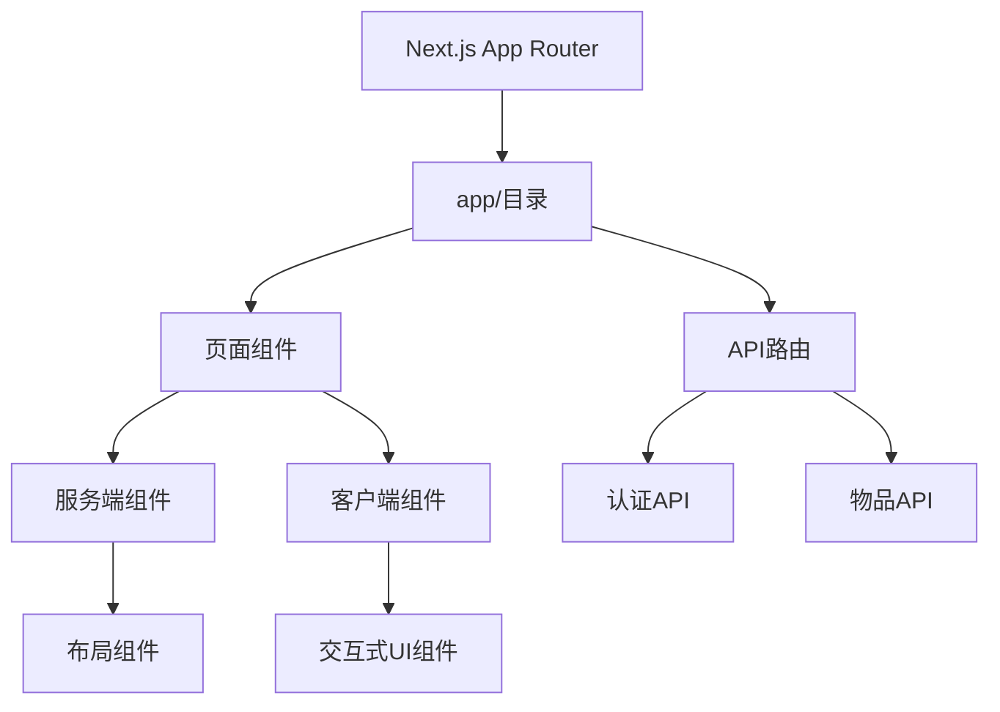
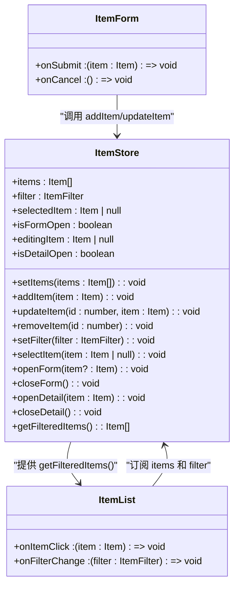
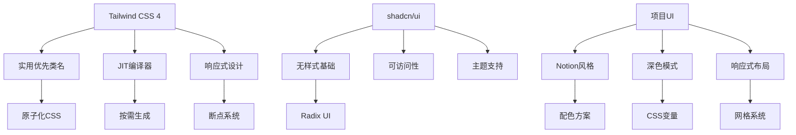
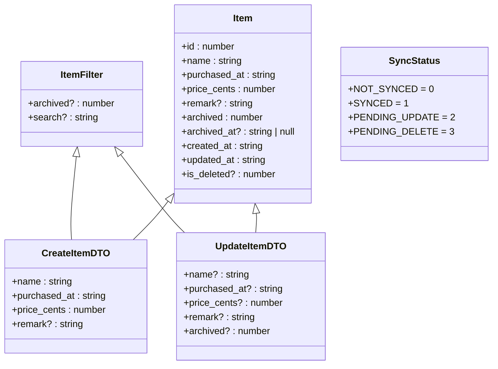
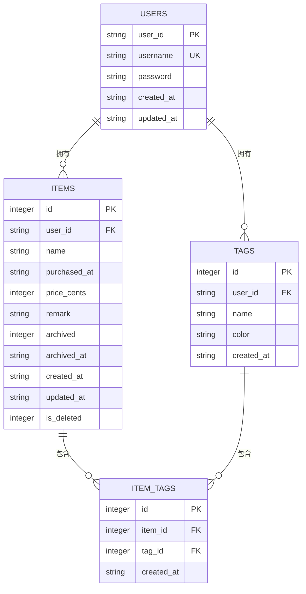
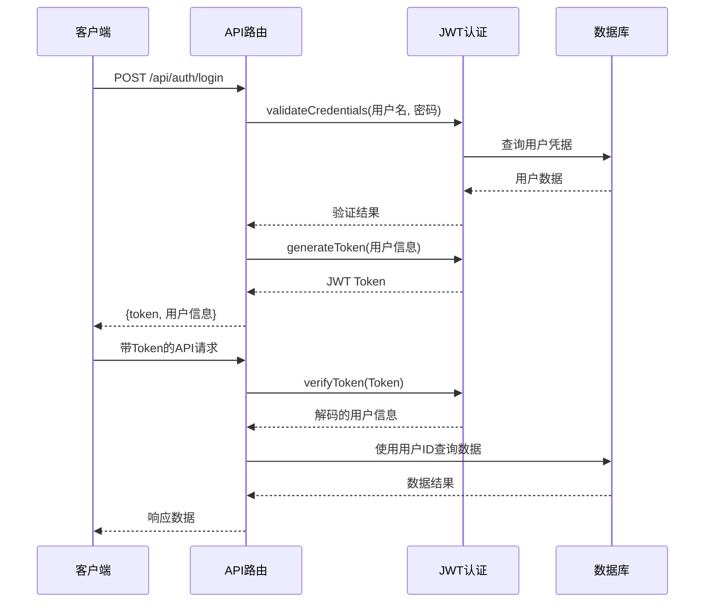
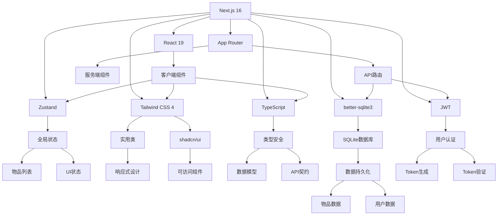

# 技术栈

<cite>
**本文档引用的文件**  
- [package.json](file://package.json)
- [next.config.ts](file://next.config.ts)
- [tsconfig.json](file://tsconfig.json)
- [postcss.config.mjs](file://postcss.config.mjs)
- [app/globals.css](file://app/globals.css)
- [lib/store/item-store.ts](file://lib/store/item-store.ts)
- [lib/db/sqlite.ts](file://lib/db/sqlite.ts)
- [lib/auth/jwt.ts](file://lib/auth/jwt.ts)
- [lib/types/item.ts](file://lib/types/item.ts)
- [components/ui/index.ts](file://components/ui/index.ts)
- [app/api/auth/login/route.ts](file://app/api/auth/login/route.ts)
- [lib/utils/cn.ts](file://lib/utils/cn.ts)
- [README.md](file://README.md)
</cite>

## 目录
1. [介绍](#介绍)
2. [前端框架：Next.js 16 + React 19](#前端框架nextjs-16--react-19)
3. [状态管理：Zustand](#状态管理zustand)
4. [样式系统：Tailwind CSS 4](#样式系统tailwind-css-4)
5. [类型系统：TypeScript](#类型系统typescript)
6. [数据库：better-sqlite3](#数据库bettersqlite3)
7. [认证机制：JWT](#认证机制jwt)
8. [技术栈整合架构](#技术栈整合架构)
9. [开发环境配置](#开发环境配置)

## 介绍
本项目是一个个人物品成本管理系统，采用现代化的全栈技术栈构建。系统旨在帮助用户记录和管理个人物品的使用成本，包括购买价格、使用天数和日均成本等关键指标。项目采用前后端一体化的架构设计，通过Next.js App Router统一开发体验，实现了高效的数据流管理和轻量级持久化存储。本文档详细说明项目所采用的各项技术选型，包括前端框架、状态管理、样式系统、类型系统、数据库和认证机制，并解释每项技术在项目中的具体作用和配置方式。

**Section sources**
- [README.md](file://README.md#L1-L137)

## 前端框架：Next.js 16 + React 19

项目采用Next.js 16与React 19作为核心前端框架，充分利用了Next.js App Router的现代化架构优势。Next.js App Router提供了一种统一的前后端开发模式，通过文件系统路由机制，将页面和API端点组织在`app/`目录下，实现了前后端代码的紧密集成。这种架构不仅简化了项目结构，还提供了服务器端渲染（SSR）、静态生成（SSG）和客户端导航的无缝切换能力。

React 19引入了新的编译器优化和响应式hooks机制，提升了组件渲染性能和开发体验。在项目中，所有UI组件均采用函数式组件和Hooks模式开发，通过`'use client'`指令明确标识客户端组件，实现了服务端组件与客户端组件的合理分离。例如，`ItemList`组件作为客户端组件，负责处理用户交互和状态更新，而布局组件则充分利用服务端渲染的优势，提高首屏加载性能。

Next.js的API Routes功能在`app/api/`目录下实现了RESTful风格的后端接口，如`auth/login/route.ts`处理用户认证请求，`items/route.ts`处理物品数据的CRUD操作。这种一体化架构消除了传统前后端分离的复杂性，使开发者能够在同一代码库中管理完整的应用逻辑。

**Diagram sources**
- [app/layout.tsx](file://app/layout.tsx#L1-L35)
- [app/api/auth/login/route.ts](file://app/api/auth/login/route.ts#L1-L47)

**Section sources**
- [package.json](file://package.json#L20-L23)
- [next.config.ts](file://next.config.ts#L1-L8)
- [app/layout.tsx](file://app/layout.tsx#L1-L35)

## 状态管理：Zustand

项目采用Zustand作为状态管理解决方案，替代了传统的Redux或Context API。Zustand以其极简的API和高性能的订阅机制，为应用提供了轻量级但功能强大的状态管理能力。在`lib/store/item-store.ts`中，定义了`useItemStore`全局状态，集中管理物品列表、筛选条件、表单状态和详情视图等UI状态。

Zustand的核心优势在于其简单的创建语法和自动的状态更新机制。通过`create`函数，可以定义包含状态和操作方法的store，如`setItems`、`addItem`、`updateItem`等方法直接修改状态，组件通过`useItemStore` Hook订阅相关状态，实现高效的重新渲染。相比Redux，Zustand无需编写大量的样板代码，减少了开发复杂度。

在项目中，Zustand状态被用于管理物品的增删改查操作，以及UI的打开/关闭状态。例如，`openForm`和`closeForm`方法控制物品表单的显示状态，`selectItem`方法管理当前选中的物品。这种集中式状态管理确保了应用状态的一致性，避免了组件间状态传递的复杂性。

**Diagram sources**
- [lib/store/item-store.ts](file://lib/store/item-store.ts#L1-L114)
- [components/item-list.tsx](file://components/item-list.tsx#L1-L99)

**Section sources**
- [lib/store/item-store.ts](file://lib/store/item-store.ts#L1-L114)
- [package.json](file://package.json#L26)

## 样式系统：Tailwind CSS 4

项目采用Tailwind CSS 4作为样式系统，结合shadcn/ui组件库，实现了高效、一致的UI开发体验。Tailwind CSS的实用优先（utility-first）方法论允许开发者直接在JSX中使用原子化CSS类名，避免了传统CSS文件的维护负担。在`app/globals.css`中，项目定义了Notion风格的配色方案，通过CSS变量实现了深色模式的支持。

Tailwind CSS 4的最新特性，如JIT编译器和配置文件现代化，显著提升了开发效率和构建性能。项目通过`postcss.config.mjs`配置PostCSS插件，将Tailwind CSS集成到构建流程中。`cn`工具函数（位于`lib/utils/cn.ts`）结合`clsx`和`tailwind-merge`，提供了安全的类名合并能力，解决了类名覆盖问题。

shadcn/ui组件库在`components/ui/`目录下提供了高质量的可复用组件，如Button、Card、Dialog等，这些组件通过Radix UI的无样式基础构建，确保了可访问性和灵活性。项目通过`components/ui/index.ts`统一导出这些组件，实现了模块化的组件管理。

**Diagram sources**
- [app/globals.css](file://app/globals.css#L1-L38)
- [lib/utils/cn.ts](file://lib/utils/cn.ts#L1-L12)
- [components/ui/index.ts](file://components/ui/index.ts#L1-L23)

**Section sources**
- [app/globals.css](file://app/globals.css#L1-L38)
- [postcss.config.mjs](file://postcss.config.mjs#L1-L8)
- [lib/utils/cn.ts](file://lib/utils/cn.ts#L1-L12)
- [package.json](file://package.json#L17-L18)

## 类型系统：TypeScript

项目采用TypeScript作为类型系统，提供了强大的静态类型检查和开发时错误检测能力。在`tsconfig.json`中，项目配置了严格的编译选项，包括`strict: true`和`esModuleInterop: true`，确保了代码质量和模块互操作性。TypeScript的类型系统贯穿整个应用，从数据模型到API接口，提供了端到端的类型安全。

在`lib/types/`目录下，项目定义了核心数据模型，如`Item`接口和`ItemFilter`接口。这些类型定义不仅为组件提供了明确的props类型，还确保了前后端数据交互的一致性。例如，`Item`接口精确描述了物品的所有属性，包括`id`、`name`、`purchased_at`等字段，以及可选的`remark`和`archived_at`字段。

TypeScript的枚举类型（如`SyncStatus`和`ArchivedStatus`）为应用状态提供了语义化的常量定义，避免了魔法数字的使用。泛型在`CreateItemDTO`和`UpdateItemDTO`等数据传输对象中发挥了重要作用，确保了API调用的类型安全。

**Diagram sources**
- [lib/types/item.ts](file://lib/types/item.ts#L1-L94)
- [tsconfig.json](file://tsconfig.json#L1-L35)

**Section sources**
- [lib/types/item.ts](file://lib/types/item.ts#L1-L94)
- [tsconfig.json](file://tsconfig.json#L1-L35)
- [package.json](file://package.json#L38)

## 数据库：better-sqlite3

项目采用better-sqlite3作为数据库解决方案，实现了轻量级、高性能的数据持久化。better-sqlite3是Node.js环境中最快的SQLite3库，提供了同步API和预编译语句支持，避免了异步回调的复杂性。在`lib/db/sqlite.ts`中，项目实现了数据库的初始化、连接管理和表结构创建。

数据库设计遵循关系型模型，包含`items`、`tags`、`item_tags`和`users`四张核心表。`items`表存储物品基本信息，`users`表管理用户凭据，通过外键关联实现数据完整性。项目在初始化时自动创建数据库文件和表结构，并插入默认用户，确保应用开箱即用。

better-sqlite3的WAL（Write-Ahead Logging）模式在`initializeDatabase`函数中被启用，提高了并发读写性能。项目还创建了多个索引（如`idx_items_user_id`）以优化查询效率。数据库文件存储在`data/`目录下的`bookkeeping.db`中，通过`.gitignore`排除在版本控制之外，保护用户数据隐私。

**Diagram sources**
- [lib/db/sqlite.ts](file://lib/db/sqlite.ts#L1-L109)
- [package.json](file://package.json#L16)

**Section sources**
- [lib/db/sqlite.ts](file://lib/db/sqlite.ts#L1-L109)
- [package.json](file://package.json#L16)

## 认证机制：JWT

项目采用JWT（JSON Web Token）作为认证机制，实现了安全的用户身份验证。在`lib/auth/jwt.ts`中，项目定义了JWT的生成、验证和凭据校验逻辑。JWT_SECRET密钥用于签名Token，TOKEN_EXPIRES_IN设置Token的7天有效期，确保了认证的安全性。

认证流程在`app/api/auth/login/route.ts`中实现：用户提交用户名和密码后，系统调用`validateCredentials`验证凭据，成功后生成JWT Token并返回给客户端。后续请求通过`Authorization: Bearer <token>`头携带Token，服务端使用`verifyToken`函数验证Token的有效性。

JWT的无状态特性使认证过程轻量高效，无需在服务端存储会话信息。项目采用单用户模式，用户数据存储在SQLite数据库的`users`表中，通过`getUserByUsername`函数查询。这种设计既保证了基本的安全性，又避免了复杂的身份管理系统。

**Diagram sources**
- [lib/auth/jwt.ts](file://lib/auth/jwt.ts#L1-L57)
- [app/api/auth/login/route.ts](file://app/api/auth/login/route.ts#L1-L47)

**Section sources**
- [lib/auth/jwt.ts](file://lib/auth/jwt.ts#L1-L57)
- [app/api/auth/login/route.ts](file://app/api/auth/login/route.ts#L1-L47)
- [package.json](file://package.json#L20)

## 技术栈整合架构

项目的技术栈通过Next.js App Router实现了无缝整合，形成了一个高效、一致的开发环境。前端框架、状态管理、样式系统、类型系统、数据库和认证机制各司其职，共同构建了一个现代化的全栈应用。

**Diagram sources**
- [package.json](file://package.json#L12-L27)
- [README.md](file://README.md#L17-L31)

## 开发环境配置

项目的开发环境通过`package.json`中的脚本命令进行管理。`npm run dev`启动开发服务器，`npm run build`执行生产构建，`npm run start`启动生产服务器。TypeScript配置在`tsconfig.json`中定义了严格的编译选项和路径别名`@/*`，提高了开发体验。

PostCSS配置在`postcss.config.mjs`中集成了Tailwind CSS插件，Next.js配置在`next.config.ts`中保持默认设置，充分利用了框架的零配置优势。项目依赖通过`npm install`安装，所有版本信息在`package.json`中明确指定，确保了开发环境的一致性。

**Section sources**
- [package.json](file://package.json#L5-L10)
- [next.config.ts](file://next.config.ts#L1-L8)
- [tsconfig.json](file://tsconfig.json#L1-L35)
- [postcss.config.mjs](file://postcss.config.mjs#L1-L8)