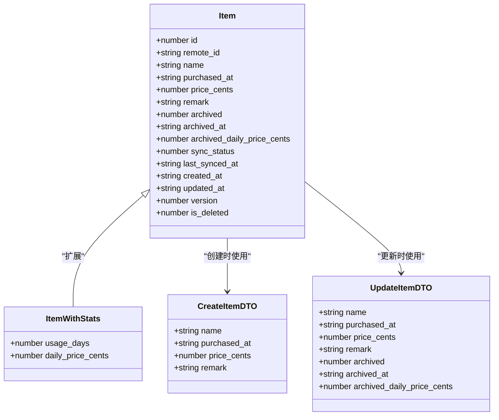
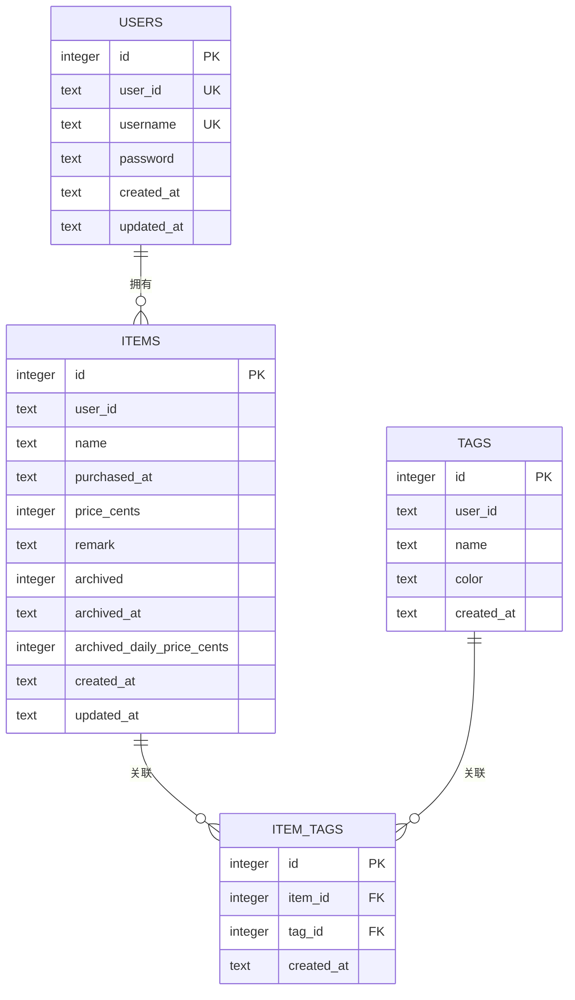
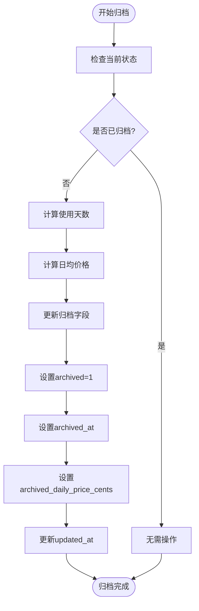
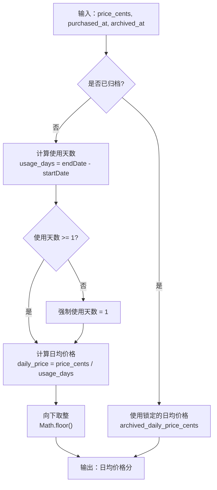
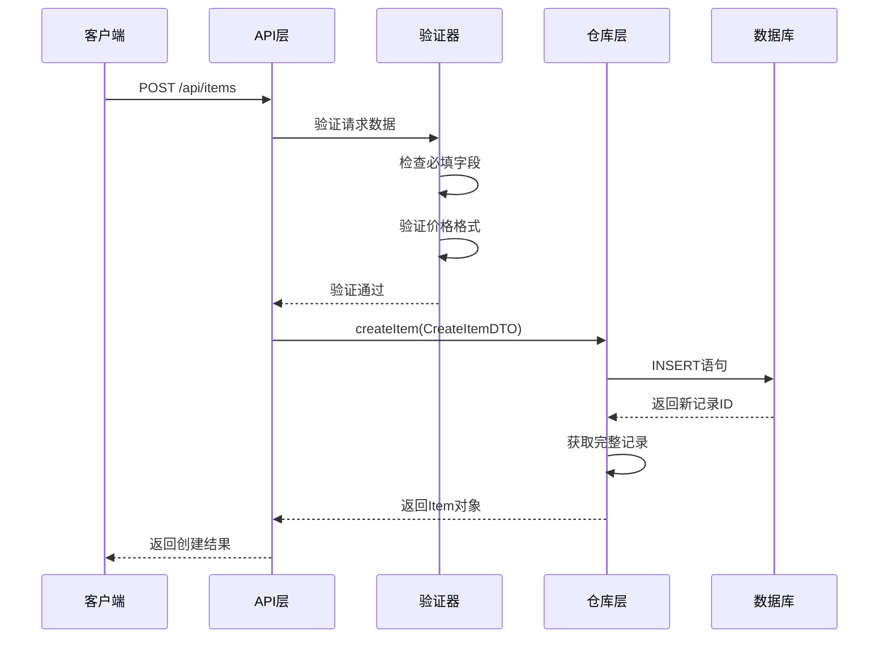
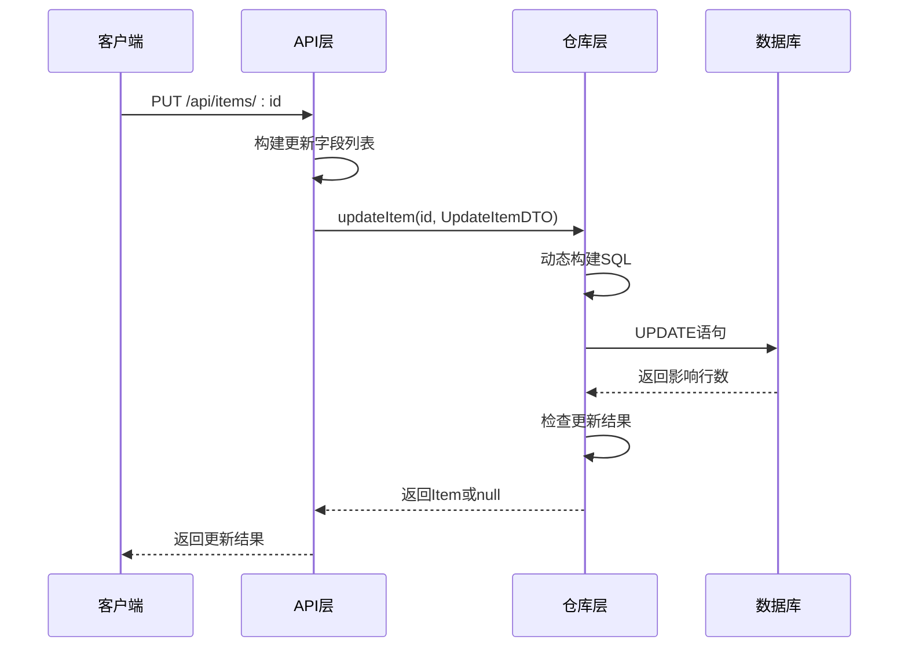
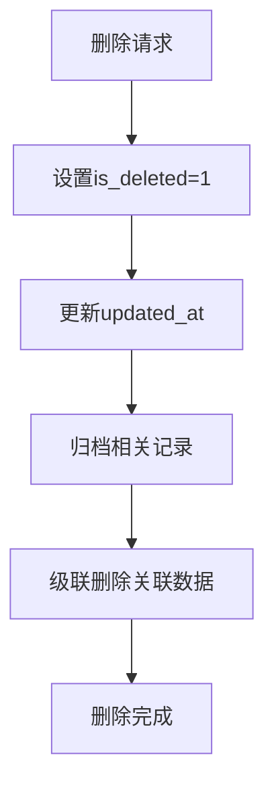
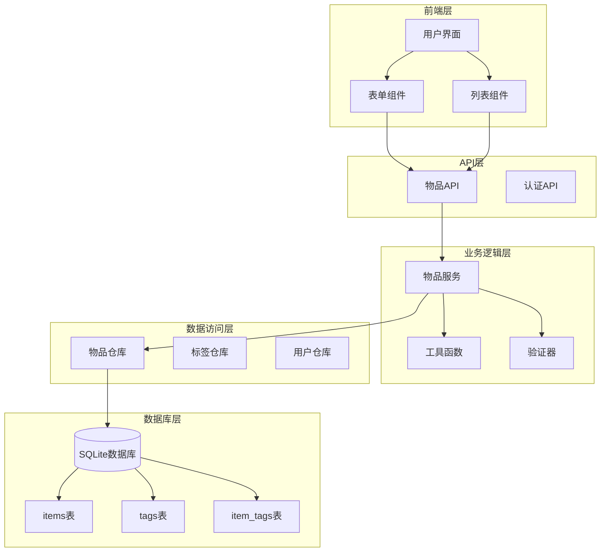
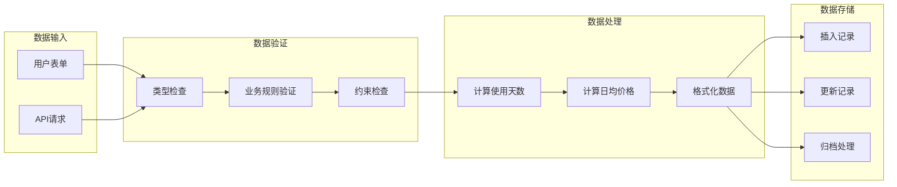

# 数据模型

<cite>
**本文档引用的文件**
- [lib/types/item.ts](file://lib/types/item.ts)
- [lib/db/repository.ts](file://lib/db/repository.ts)
- [lib/db/sqlite.ts](file://lib/db/sqlite.ts)
- [lib/utils/item-utils.ts](file://lib/utils/item-utils.ts)
- [app/api/items/route.ts](file://app/api/items/route.ts)
- [需求说明.md](file://需求说明.md)
</cite>

## 目录
1. [简介](#简介)
2. [Item实体核心结构](#item实体核心结构)
3. [数据库表结构设计](#数据库表结构设计)
4. [字段详细说明](#字段详细说明)
5. [归档机制与日均价格计算](#归档机制与日均价格计算)
6. [数据生命周期管理](#数据生命周期管理)
7. [示例数据](#示例数据)
8. [架构图](#架构图)
9. [总结](#总结)

## 简介

本文档详细描述了记账应用中的Item实体数据模型设计。Item实体是整个应用的核心数据结构，用于记录个人物品的基本信息、使用成本计算和归档状态管理。该模型采用SQLite数据库存储，支持单用户模式下的物品成本管理功能。

## Item实体核心结构

Item实体定义了物品的完整信息结构，包含基础属性、业务状态和同步信息等多个维度的数据。

**图表来源**
- [lib/types/item.ts](file://lib/types/item.ts#L9-L25)
- [lib/types/item.ts](file://lib/types/item.ts#L30-L48)
- [lib/types/item.ts](file://lib/types/item.ts#L90-L93)

**章节来源**
- [lib/types/item.ts](file://lib/types/item.ts#L1-L94)

## 数据库表结构设计

Item实体在SQLite数据库中对应`items`表，采用关系型数据库设计，支持完整的CRUD操作和数据完整性约束。

**图表来源**
- [lib/db/sqlite.ts](file://lib/db/sqlite.ts#L29-L42)
- [lib/db/sqlite.ts](file://lib/db/sqlite.ts#L47-L54)
- [lib/db/sqlite.ts](file://lib/db/sqlite.ts#L59-L67)

**章节来源**
- [lib/db/sqlite.ts](file://lib/db/sqlite.ts#L27-L109)

## 字段详细说明

### 基础属性字段

| 字段名 | 类型 | 约束 | 说明 |
|--------|------|------|------|
| `id` | INTEGER | PRIMARY KEY, AUTOINCREMENT | 本地主键，自增生成的唯一标识符 |
| `remote_id` | TEXT | NULLABLE | 云端记录ID（UUID格式），支持多设备同步 |
| `name` | TEXT | NOT NULL | 物品名称，必填字段，最大长度限制由前端控制 |
| `purchased_at` | TEXT | NOT NULL | 购买日期，ISO 8601日期字符串（YYYY-MM-DD） |
| `price_cents` | INTEGER | NOT NULL | 购买价格，以"分"为单位的整数值，最小值为0 |

### 状态管理字段

| 字段名 | 类型 | 默认值 | 说明 |
|--------|------|--------|------|
| `archived` | INTEGER | 0 | 归档状态：0=进行中，1=已归档 |
| `archived_at` | TEXT | NULL | 归档时间，ISO 8601时间字符串，未归档时为NULL |
| `archived_daily_price_cents` | INTEGER | NULL | 归档时锁定的日均价格（分），未归档时为NULL |

### 同步与版本控制字段

| 字段名 | 类型 | 说明 |
|--------|------|------|
| `sync_status` | INTEGER | 同步状态：0=未同步，1=已同步，2=待更新，3=待删除 |
| `last_synced_at` | TEXT | 最近一次同步成功时间，ISO 8601时间字符串 |
| `version` | INTEGER | 版本号，用于冲突解决和乐观锁控制 |

### 时间戳字段

| 字段名 | 类型 | 说明 |
|--------|------|------|
| `created_at` | TEXT | 记录创建时间，ISO 8601时间字符串 |
| `updated_at` | TEXT | 最近更新时间，ISO 8601时间字符串 |

### 软删除字段

| 字段名 | 类型 | 默认值 | 说明 |
|--------|------|--------|------|
| `is_deleted` | INTEGER | 0 | 软删除标记：0=正常，1=已删除 |

**章节来源**
- [lib/types/item.ts](file://lib/types/item.ts#L9-L25)
- [lib/db/sqlite.ts](file://lib/db/sqlite.ts#L30-L42)

## 归档机制与日均价格计算

### 归档状态逻辑

归档机制是Item实体的核心业务特性，用于锁定物品的最终使用成本。当物品被归档时，系统会自动计算并锁定日均价格，确保历史数据的准确性。

**图表来源**
- [lib/db/repository.ts](file://lib/db/repository.ts#L137-L143)
- [lib/utils/item-utils.ts](file://lib/utils/item-utils.ts#L60-L66)

### 日均价格计算算法

日均价格计算遵循严格的业务规则，确保成本计算的准确性和一致性。

**图表来源**
- [lib/utils/item-utils.ts](file://lib/utils/item-utils.ts#L12-L32)
- [lib/utils/item-utils.ts](file://lib/utils/item-utils.ts#L59-L66)

### 使用天数计算规则

使用天数计算采用自然日粒度，确保业务逻辑的一致性：

1. **未归档物品**：使用天数 = 当前日期 - 购买日期
2. **已归档物品**：使用天数 = 归档日期 - 购买日期
3. **最小值保护**：无论哪种情况，使用天数至少为1天
4. **日期处理**：忽略具体时间点，仅比较日期部分

**章节来源**
- [lib/utils/item-utils.ts](file://lib/utils/item-utils.ts#L12-L32)
- [lib/utils/item-utils.ts](file://lib/utils/item-utils.ts#L59-L73)

## 数据生命周期管理

### 创建流程

物品创建遵循严格的验证和初始化流程，确保数据完整性。

**图表来源**
- [app/api/items/route.ts](file://app/api/items/route.ts#L34-L66)
- [lib/db/repository.ts](file://lib/db/repository.ts#L37-L63)

### 更新流程

物品更新支持部分字段更新，采用动态SQL构建确保灵活性。

**图表来源**
- [lib/db/repository.ts](file://lib/db/repository.ts#L69-L121)
- [app/api/items/route.ts](file://app/api/items/route.ts#L1-L75)

### 归档与取消归档

归档操作涉及多个字段的状态变更，需要确保数据一致性。

| 操作 | archived | archived_at | archived_daily_price_cents |
|------|----------|-------------|----------------------------|
| 归档 | 1 | 当前时间 | 计算的每日价格 |
| 取消归档 | 0 | null | null |

### 删除流程

系统采用软删除策略，保留数据历史记录。

**图表来源**
- [lib/db/repository.ts](file://lib/db/repository.ts#L127-L132)
- [lib/db/sqlite.ts](file://lib/db/sqlite.ts#L64-L66)

**章节来源**
- [lib/db/repository.ts](file://lib/db/repository.ts#L37-L156)
- [lib/utils/item-utils.ts](file://lib/utils/item-utils.ts#L1-L74)

## 示例数据

以下是符合Item实体规范的示例数据记录：

### 活跃物品示例

| 字段 | 值 |
|------|-----|
| id | 1 |
| name | "MacBook Pro" |
| purchased_at | "2024-01-01" |
| price_cents | 120000 |
| archived | 0 |
| archived_at | null |
| archived_daily_price_cents | null |
| created_at | "2024-01-01T10:00:00Z" |
| updated_at | "2024-01-01T10:00:00Z" |

### 已归档物品示例

| 字段 | 值 |
|------|-----|
| id | 2 |
| name | "旧手机" |
| purchased_at | "2023-06-15" |
| price_cents | 25000 |
| archived | 1 |
| archived_at | "2024-01-01T15:30:00Z" |
| archived_daily_price_cents | 150 |
| created_at | "2023-06-15T09:00:00Z" |
| updated_at | "2024-01-01T15:30:00Z" |

### 计算示例

对于活跃物品"MacBook Pro"：
- 购买日期：2024-01-01
- 当前日期：2024-03-15（假设）
- 使用天数：73天
- 日均价格：120000 ÷ 73 ≈ 1644分

对于已归档物品"旧手机"：
- 购买日期：2023-06-15
- 归档日期：2024-01-01
- 使用天数：169天
- 日均价格：25000 ÷ 169 ≈ 148分（已锁定）

**章节来源**
- [需求说明.md](file://需求说明.md#L182-L212)

## 架构图

### 整体数据模型架构

**图表来源**
- [lib/db/repository.ts](file://lib/db/repository.ts#L1-L156)
- [lib/db/sqlite.ts](file://lib/db/sqlite.ts#L1-L109)
- [app/api/items/route.ts](file://app/api/items/route.ts#L1-L75)

### 数据流图

**图表来源**
- [app/api/items/route.ts](file://app/api/items/route.ts#L39-L66)
- [lib/utils/item-utils.ts](file://lib/utils/item-utils.ts#L12-L32)

## 总结

Item实体数据模型设计体现了以下核心设计理念：

1. **业务导向**：围绕物品成本管理的核心业务需求设计字段结构
2. **数据完整性**：通过约束和验证确保数据质量
3. **性能优化**：合理设计索引和查询策略
4. **扩展性**：预留字段支持未来功能扩展
5. **一致性**：归档机制确保历史数据的准确性

该数据模型为个人物品成本管理提供了坚实的基础，支持完整的生命周期管理和复杂的业务计算逻辑。通过清晰的字段定义、严格的约束条件和完善的归档机制，确保了系统的可靠性和用户体验的连续性。