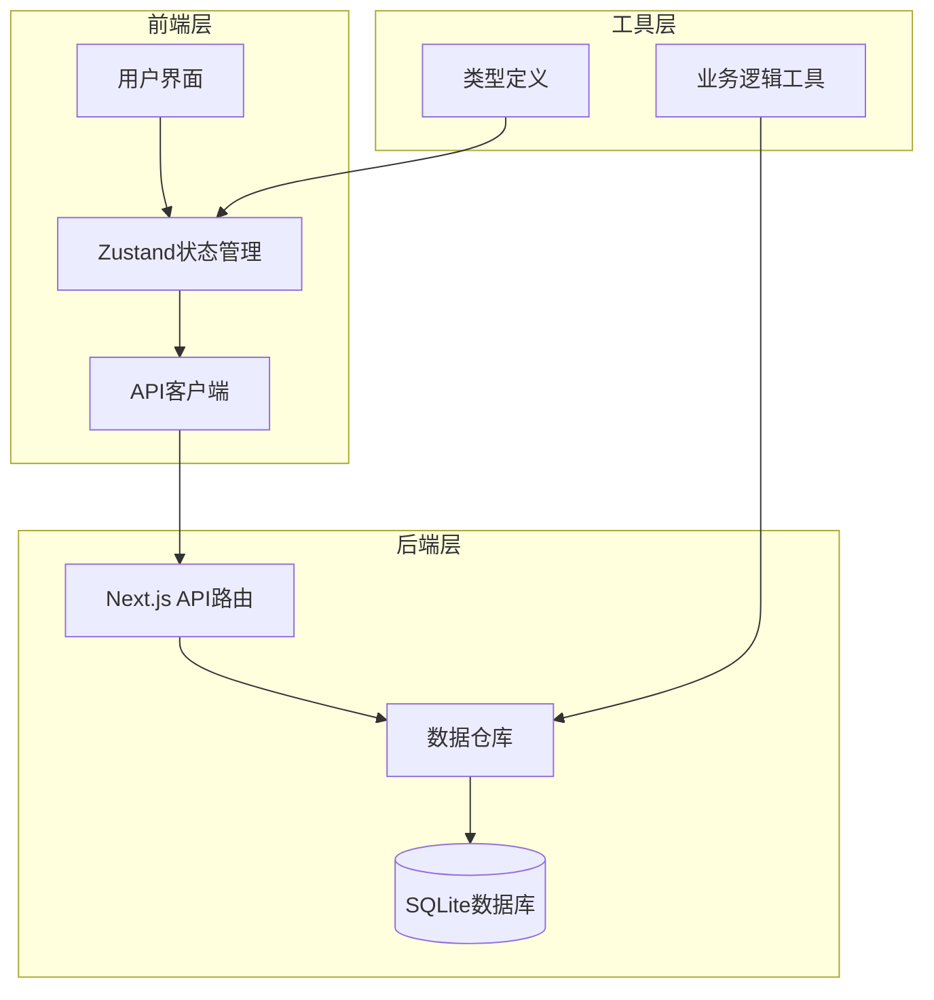
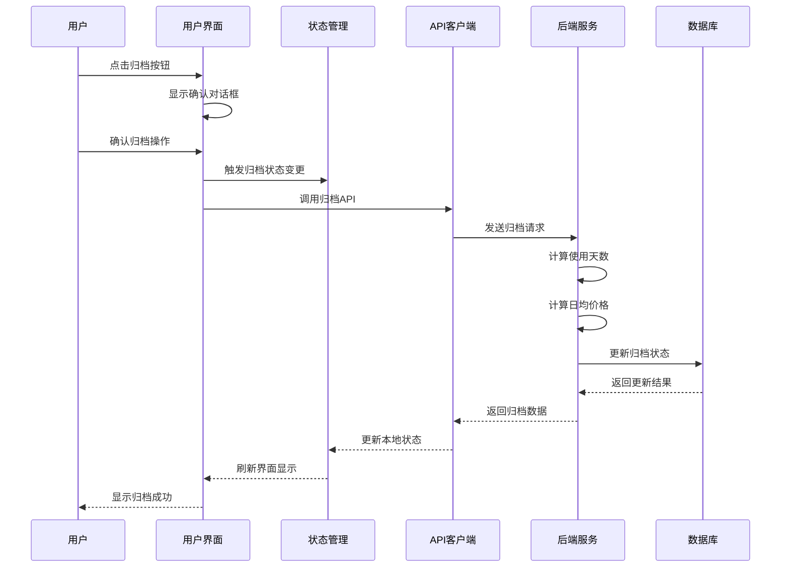
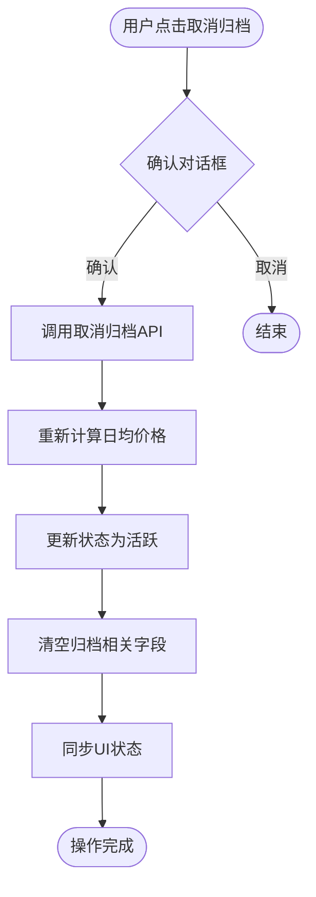
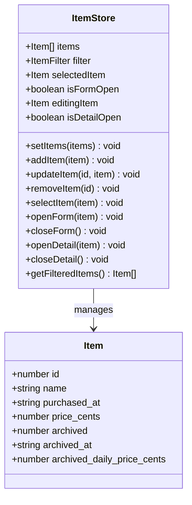
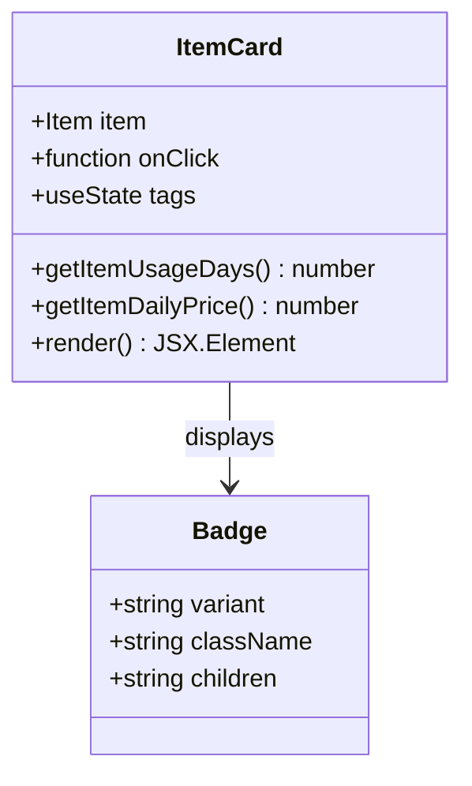

# 归档与退役机制

<cite>
**本文档中引用的文件**
- [需求说明.md](file://需求说明.md)
- [app/api/items/[id]/route.ts](file://app/api/items/[id]/route.ts)
- [lib/store/item-store.ts](file://lib/store/item-store.ts)
- [lib/types/item.ts](file://lib/types/item.ts)
- [lib/db/repository.ts](file://lib/db/repository.ts)
- [lib/utils/item-utils.ts](file://lib/utils/item-utils.ts)
- [components/item-card.tsx](file://components/item-card.tsx)
- [components/item-detail.tsx](file://components/item-detail.tsx)
- [components/item-list.tsx](file://components/item-list.tsx)
- [app/page.tsx](file://app/page.tsx)
- [lib/api/client.ts](file://lib/api/client.ts)
</cite>

## 目录
1. [概述](#概述)
2. [系统架构](#系统架构)
3. [数据模型设计](#数据模型设计)
4. [归档操作流程](#归档操作流程)
5. [取消归档机制](#取消归档机制)
6. [状态同步机制](#状态同步机制)
7. [UI交互设计](#ui交互设计)
8. [数据一致性保障](#数据一致性保障)
9. [性能考虑](#性能考虑)
10. [故障排除指南](#故障排除指南)

## 概述

物品归档/退役机制是个人物品成本管理系统的核心功能之一，旨在帮助用户管理物品的生命周期状态。该机制允许用户将不再使用的物品标记为"已归档"状态，从而锁定其最终使用成本（日均价格），并将其从活跃物品列表中分离出来。

### 核心特性

- **自动化成本锁定**：归档时自动计算并锁定最终日均价格
- **状态不可变性**：归档后的数据保持永久不变
- **实时状态同步**：UI界面实时反映归档状态变化
- **可逆操作**：支持取消归档，恢复物品的活跃状态
- **智能筛选**：支持按归档状态筛选物品列表

## 系统架构

系统采用前后端分离架构，通过RESTful API进行数据交互，使用Zustand进行状态管理。

**图表来源**
- [app/api/items/[id]/route.ts](file://app/api/items/[id]/route.ts#L1-L134)
- [lib/store/item-store.ts](file://lib/store/item-store.ts#L1-L114)
- [lib/api/client.ts](file://lib/api/client.ts#L1-L187)

## 数据模型设计

系统通过四个关键字段实现归档机制的数据模型：

| 字段名 | 类型 | 说明 | 默认值 |
|--------|------|------|--------|
| `archived` | INTEGER | 是否归档（0=否，1=是） | 0 |
| `archived_at` | TEXT | 归档时间（ISO字符串，未归档则为null） | null |
| `archived_daily_price_cents` | INTEGER | 归档时锁定的日均价格（分，未归档则为null） | null |
| `price_cents` | INTEGER | 购买价格（以"分"为单位） | 必填 |

### 字段定义详解

**archived字段**：控制物品的活跃状态，0表示进行中，1表示已归档。

**archived_at字段**：记录归档发生的确切时间戳，用于计算使用天数和作为状态标识。

**archived_daily_price_cents字段**：在归档时计算并锁定的最终日均价格，确保历史数据的准确性。

**section sources**
- [lib/types/item.ts](file://lib/types/item.ts#L9-L25)
- [需求说明.md](file://需求说明.md#L150-L164)

## 归档操作流程

归档操作遵循严格的业务逻辑，确保数据的准确性和一致性。

**图表来源**
- [app/page.tsx](file://app/page.tsx#L100-L111)
- [lib/api/client.ts](file://lib/api/client.ts#L123-L136)
- [lib/db/repository.ts](file://lib/db/repository.ts#L135-L144)

### 归档步骤详解

1. **状态检测**：系统首先检查物品是否已经是归档状态
2. **确认提示**：显示包含详细说明的确认对话框
3. **时间计算**：使用当前日期作为归档时间
4. **使用天数计算**：基于购买日期和归档日期计算最终使用天数
5. **日均价格计算**：根据购买价格和使用天数计算锁定价格
6. **状态更新**：原子性更新所有相关字段
7. **状态同步**：通知UI更新显示状态

**section sources**
- [app/page.tsx](file://app/page.tsx#L100-L111)
- [lib/db/repository.ts](file://lib/db/repository.ts#L135-L144)
- [lib/utils/item-utils.ts](file://lib/utils/item-utils.ts#L12-L32)

## 取消归档机制

系统支持取消归档操作，允许用户将已归档的物品恢复为活跃状态。

**图表来源**
- [app/page.tsx](file://app/page.tsx#L113-L124)
- [lib/db/repository.ts](file://lib/db/repository.ts#L146-L155)

### 取消归档逻辑

取消归档时，系统执行以下操作：

1. **状态重置**：将`archived`字段设置为0
2. **字段清理**：清空`archived_at`和`archived_daily_price_cents`字段
3. **动态计算**：恢复使用天数和日均价格的动态计算
4. **状态同步**：更新UI界面显示

**section sources**
- [app/page.tsx](file://app/page.tsx#L113-L124)
- [lib/db/repository.ts](file://lib/db/repository.ts#L146-L155)

## 状态同步机制

系统使用Zustand状态管理库实现前端状态的实时同步。

**图表来源**
- [lib/store/item-store.ts](file://lib/store/item-store.ts#L9-L114)

### 状态同步策略

1. **乐观更新**：UI立即响应用户操作，提升用户体验
2. **原子性更新**：确保状态变更的完整性
3. **错误回滚**：API调用失败时自动回滚状态
4. **实时刷新**：通过过滤器机制实时更新显示列表

**section sources**
- [lib/store/item-store.ts](file://lib/store/item-store.ts#L47-L114)
- [app/page.tsx](file://app/page.tsx#L104-L106)

## UI交互设计

系统提供了直观的用户界面来支持归档操作。

### 物品卡片显示

**图表来源**
- [components/item-card.tsx](file://components/item-card.tsx#L16-L102)

### 详情页面操作

详情页面提供完整的归档控制功能：

- **归档按钮**：显示当前状态，提供切换功能
- **确认对话框**：包含详细的操作说明
- **状态标识**：清晰显示归档状态
- **时间信息**：显示归档时间和使用天数

**section sources**
- [components/item-detail.tsx](file://components/item-detail.tsx#L59-L75)
- [components/item-card.tsx](file://components/item-card.tsx#L41-L78)

## 数据一致性保障

系统通过多层次的机制确保数据的一致性和可靠性。

### 数据验证机制

1. **前端验证**：防止无效的归档操作
2. **后端验证**：确保数据完整性
3. **事务保证**：归档操作的原子性
4. **状态检查**：防止重复操作

### 错误处理策略

- **网络错误**：提供重试机制和用户反馈
- **数据冲突**：通过版本控制解决并发问题
- **状态异常**：自动检测和修复不一致状态

**section sources**
- [app/api/items/[id]/route.ts](file://app/api/items/[id]/route.ts#L50-L95)
- [lib/db/repository.ts](file://lib/db/repository.ts#L115-L122)

## 性能考虑

系统在设计时充分考虑了性能优化：

### 查询优化

- **索引策略**：在`archived`字段上建立索引
- **批量操作**：支持批量归档和筛选
- **缓存机制**：缓存频繁访问的物品数据

### 前端优化

- **虚拟滚动**：处理大量物品列表
- **懒加载**：按需加载标签和详情信息
- **防抖处理**：减少不必要的API调用

## 故障排除指南

### 常见问题及解决方案

**问题1：归档操作失败**
- 检查网络连接状态
- 验证物品是否存在且可访问
- 查看浏览器控制台错误信息

**问题2：UI状态不同步**
- 刷新页面强制重新加载数据
- 检查Zustand状态是否正确更新
- 验证API响应是否成功

**问题3：归档状态显示异常**
- 确认数据库字段值是否正确
- 检查前端状态管理逻辑
- 验证筛选条件设置

**section sources**
- [app/page.tsx](file://app/page.tsx#L108-L110)
- [app/page.tsx](file://app/page.tsx#L121-L123)

## 总结

物品归档/退役机制是个人物品成本管理系统的重要组成部分，通过精心设计的架构和严格的业务逻辑，实现了数据的可靠管理和用户体验的优化。系统不仅支持物品的生命周期管理，还提供了灵活的状态切换和实时的状态同步能力，为用户提供了完整的物品成本管理解决方案。