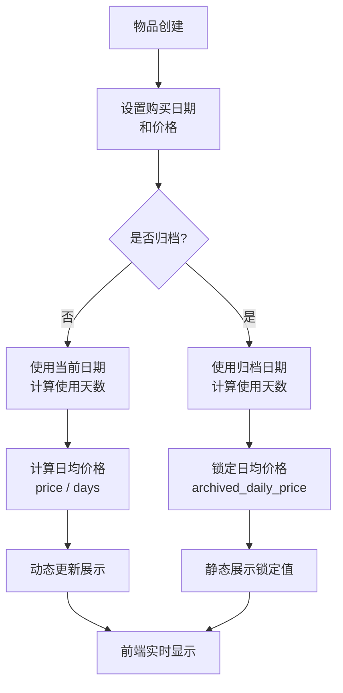
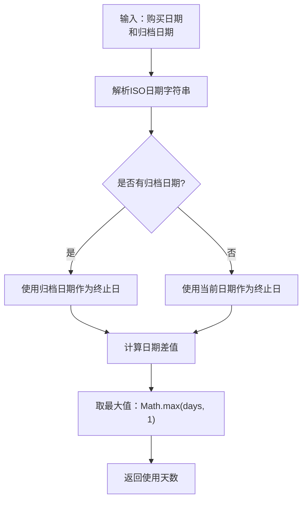
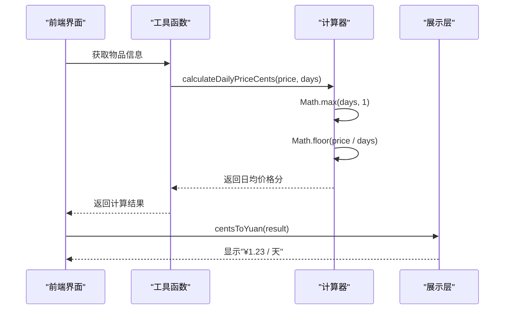
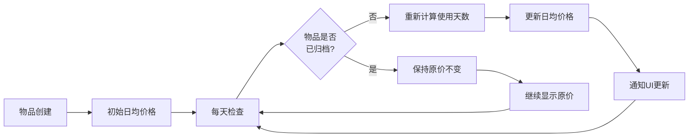
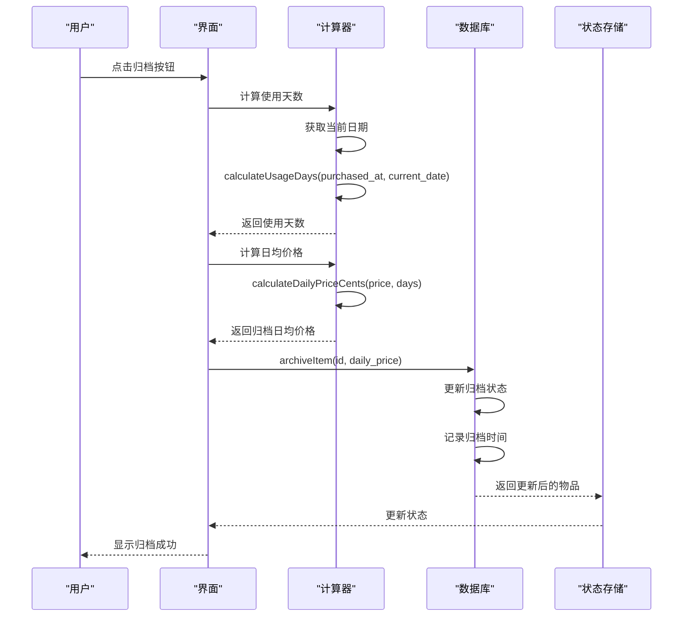
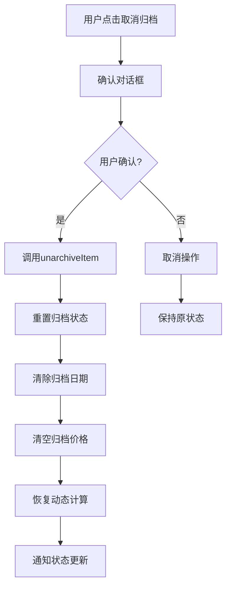
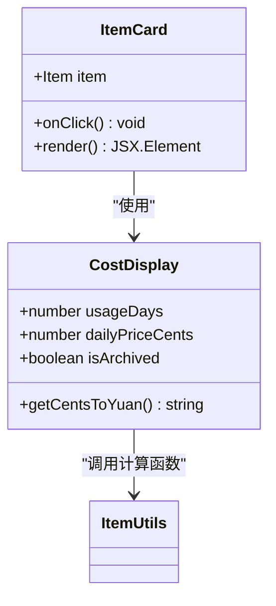
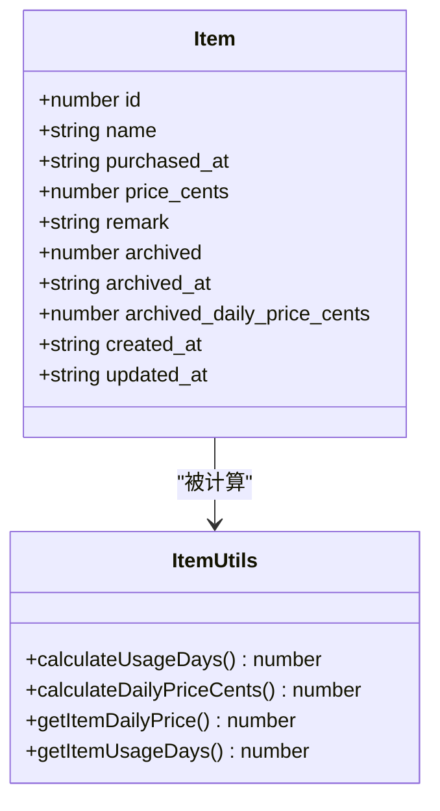
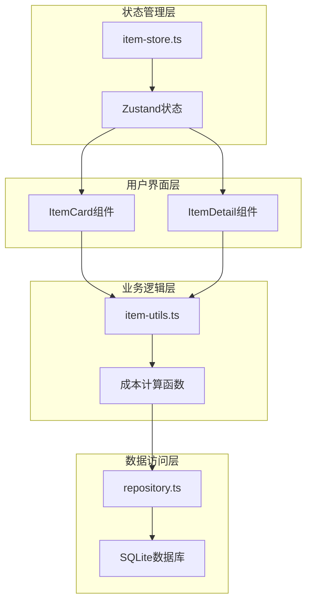

# 成本自动计算

<cite>
**本文档引用的文件**
- [需求说明.md](file://需求说明.md)
- [lib/utils/item-utils.ts](file://lib/utils/item-utils.ts)
- [components/item-card.tsx](file://components/item-card.tsx)
- [components/item-detail.tsx](file://components/item-detail.tsx)
- [lib/types/item.ts](file://lib/types/item.ts)
- [lib/db/repository.ts](file://lib/db/repository.ts)
- [app/api/items/route.ts](file://app/api/items/route.ts)
- [lib/store/item-store.ts](file://lib/store/item-store.ts)
</cite>

## 目录
1. [概述](#概述)
2. [核心计算机制](#核心计算机制)
3. [使用天数计算](#使用天数计算)
4. [日均价格计算](#日均价格计算)
5. [归档机制](#归档机制)
6. [前端展示](#前端展示)
7. [TypeScript类型系统](#typescript类型系统)
8. [数据流架构](#数据流架构)
9. [性能考虑](#性能考虑)
10. [总结](#总结)

## 概述

本系统实现了智能的物品成本自动计算机制，能够实时跟踪物品的使用成本，并提供准确的日均价格计算。该机制的核心特点包括：

- **自动化计算**：基于购买日期和当前日期自动计算使用天数
- **动态更新**：未归档物品的日均价格随时间动态变化
- **成本锁定**：已归档物品锁定最终成本，便于历史成本分析
- **高精度计算**：以分为单位存储，确保数值精度
- **实时展示**：前端实时显示计算结果

## 核心计算机制

系统的核心计算逻辑围绕两个关键指标：使用天数和日均价格。这两个指标共同构成了物品成本管理的基础。



**图表来源**
- [lib/utils/item-utils.ts](file://lib/utils/item-utils.ts#L12-L73)
- [lib/types/item.ts](file://lib/types/item.ts#L9-L25)

## 使用天数计算

使用天数是成本计算的基础，它定义了物品从购买到某个终止日期的时间跨度。

### 计算规则

使用天数的计算遵循以下规则：

1. **终止日期规则**：
   - 未归档物品：终止日期 = 当前日期
   - 已归档物品：终止日期 = 归档日期

2. **时间粒度**：以自然日为单位，忽略具体时间点

3. **最小值保证**：即使购买当天和终止日期相同，也至少计为1天

### 实现逻辑



**图表来源**
- [lib/utils/item-utils.ts](file://lib/utils/item-utils.ts#L12-L21)

### 关键实现细节

系统使用 `date-fns` 库提供的 `differenceInDays` 函数进行日期差计算，确保跨月份、跨年份的准确性。同时通过 `Math.max()` 函数保证最小值为1天，避免除零错误。

**章节来源**
- [lib/utils/item-utils.ts](file://lib/utils/item-utils.ts#L12-L21)
- [需求说明.md](file://需求说明.md#L31-L43)

## 日均价格计算

日均价格是衡量物品使用成本的核心指标，它将总购买成本均匀分配到每一天的使用时间上。

### 计算公式

```
日均价格 = 购买价格 ÷ 使用天数
```

### 计算规则

1. **内部精度**：以"分"为单位进行整数运算
2. **前端展示**：转换为"元"显示，保留2位小数
3. **最小天数**：使用天数为0时按1天计算
4. **向下取整**：使用 `Math.floor()` 确保价格不会虚高

### 实现机制



**图表来源**
- [lib/utils/item-utils.ts](file://lib/utils/item-utils.ts#L26-L32)
- [lib/utils/item-utils.ts](file://lib/utils/item-utils.ts#L37-L39)

### 动态更新逻辑

对于未归档物品，系统会定期重新计算日均价格：



**图表来源**
- [lib/utils/item-utils.ts](file://lib/utils/item-utils.ts#L59-L66)

**章节来源**
- [lib/utils/item-utils.ts](file://lib/utils/item-utils.ts#L26-L39)
- [需求说明.md](file://需求说明.md#L44-L56)

## 归档机制

归档功能是成本管理的重要组成部分，它允许用户将已完成使用的物品标记为历史状态，并锁定其最终成本。

### 归档流程



**图表来源**
- [lib/db/repository.ts](file://lib/db/repository.ts#L137-L143)
- [components/item-detail.tsx](file://components/item-detail.tsx#L65-L74)

### 归档后行为

归档后的物品具有以下特征：

1. **日均价格锁定**：不再随时间变化
2. **使用天数固定**：显示归档时的最终使用天数
3. **状态标识**：在列表中显示"已归档"标签
4. **筛选支持**：可在列表中单独筛选已归档物品

### 取消归档机制

系统支持取消归档操作，恢复物品的动态计算能力：



**图表来源**
- [lib/db/repository.ts](file://lib/db/repository.ts#L149-L154)

**章节来源**
- [需求说明.md](file://需求说明.md#L57-L93)
- [lib/db/repository.ts](file://lib/db/repository.ts#L137-L154)

## 前端展示

系统提供了两种主要的展示界面：物品卡片（ItemCard）和物品详情（ItemDetail），它们都集成了成本计算的展示功能。

### 物品卡片展示

物品卡片是最常用的展示形式，提供简洁的成本概览：



**图表来源**
- [components/item-card.tsx](file://components/item-card.tsx#L21-L102)

### 展示格式规范

系统采用统一的展示格式：

1. **使用天数**：`{days} 天`
2. **日均价格**：`¥{amount} / 天`
3. **归档状态**：显示"已归档"标签
4. **货币单位**：人民币符号（¥），两位小数

### 交互响应

前端组件能够响应用户的操作：

- **点击事件**：打开物品详情页面
- **状态变化**：自动重新计算并更新显示
- **归档切换**：即时反映成本锁定效果

**章节来源**
- [components/item-card.tsx](file://components/item-card.tsx#L41-L102)
- [components/item-detail.tsx](file://components/item-detail.tsx#L132-L156)

## TypeScript类型系统

系统利用TypeScript的强大类型系统确保数值精度和数据完整性。

### 核心类型定义



**图表来源**
- [lib/types/item.ts](file://lib/types/item.ts#L9-L25)
- [lib/utils/item-utils.ts](file://lib/utils/item-utils.ts#L6-L7)

### 数值精度保障

1. **整数存储**：所有价格以"分"为单位存储为整数
2. **类型约束**：使用 `number` 类型确保数值运算
3. **边界检查**：通过 `Math.max()` 防止无效值
4. **转换函数**：提供 `yuanToCents` 和 `centsToYuan` 进行单位转换

### 类型安全措施

```typescript
// 价格类型定义
export interface Item {
  price_cents: number;           // 以分为单位的整数
  archived_daily_price_cents?: number | null;  // 可选的归档价格
}

// 计算函数类型
export function calculateDailyPriceCents(
  priceCents: number,           // 输入必须是数字
  usageDays: number            // 输入必须是数字
): number {                    // 返回值必须是数字
  const days = Math.max(usageDays, 1);
  return Math.floor(priceCents / days);  // 整数运算
}
```

**章节来源**
- [lib/types/item.ts](file://lib/types/item.ts#L9-L25)
- [lib/utils/item-utils.ts](file://lib/utils/item-utils.ts#L26-L32)

## 数据流架构

系统的数据流遵循清晰的层次结构，确保计算结果的一致性和可靠性。



**图表来源**
- [lib/store/item-store.ts](file://lib/store/item-store.ts#L47-L113)
- [lib/db/repository.ts](file://lib/db/repository.ts#L1-L155)

### 数据流向

1. **读取阶段**：从数据库获取原始数据
2. **计算阶段**：使用工具函数进行成本计算
3. **缓存阶段**：将计算结果存储在状态管理中
4. **展示阶段**：组件从状态中读取并渲染

### 状态同步

系统维护了多层状态同步机制：

- **数据库状态**：持久化存储最终状态
- **内存状态**：Zustand管理的前端状态
- **计算缓存**：工具函数的计算结果缓存

**章节来源**
- [lib/store/item-store.ts](file://lib/store/item-store.ts#L47-L113)
- [lib/db/repository.ts](file://lib/db/repository.ts#L1-L155)

## 性能考虑

系统在设计时充分考虑了性能优化，确保大规模数据下的良好表现。

### 计算优化

1. **懒加载计算**：只在需要时才进行成本计算
2. **缓存机制**：重复计算的结果会被缓存
3. **批量更新**：多个物品的状态更新会批量处理

### 内存管理

1. **及时清理**：不再需要的计算结果会被及时释放
2. **弱引用**：避免循环引用导致的内存泄漏
3. **分页加载**：大量物品时采用分页策略

### 数据库优化

1. **索引策略**：对常用查询字段建立索引
2. **事务处理**：批量操作使用事务确保一致性
3. **连接池**：复用数据库连接减少开销

## 总结

本系统的成本自动计算机制体现了现代Web应用的最佳实践：

### 核心优势

1. **自动化程度高**：减少了用户的手动计算负担
2. **实时性强**：成本数据随时可用，无需手动刷新
3. **准确性高**：基于严格的计算规则和类型系统保障
4. **用户体验好**：直观的界面和及时的反馈

### 技术特色

1. **类型安全**：完整的TypeScript类型定义
2. **模块化设计**：清晰的职责分离
3. **可扩展性**：易于添加新的计算维度
4. **数据一致性**：多层状态同步机制

### 应用价值

该机制不仅帮助用户更好地理解物品的实际使用成本，还为长期的成本分析和预算规划提供了可靠的数据基础。通过自动化的成本跟踪，用户可以更明智地做出消费决策，优化资源使用效率。