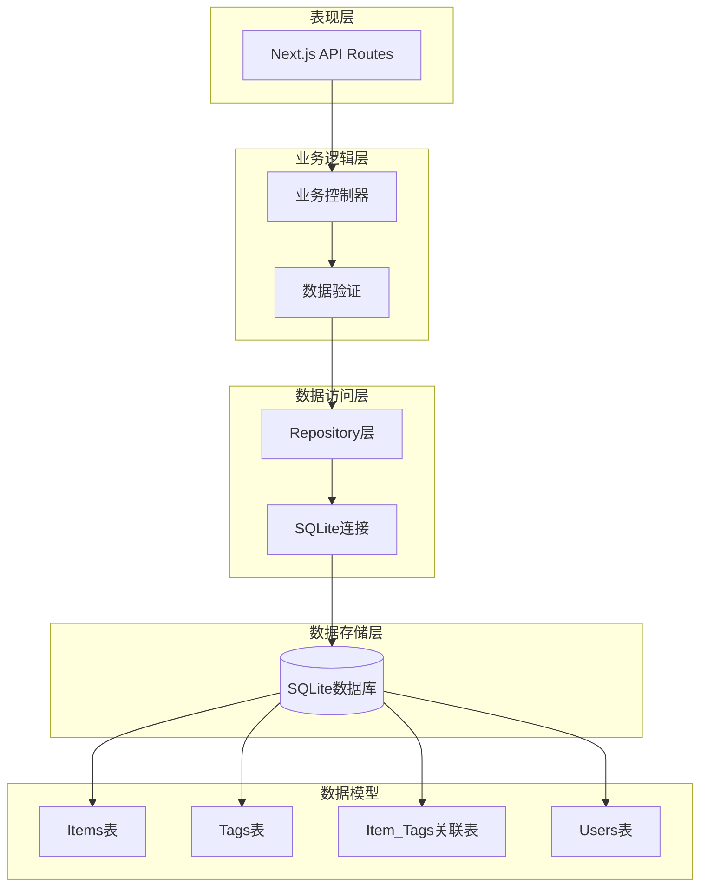
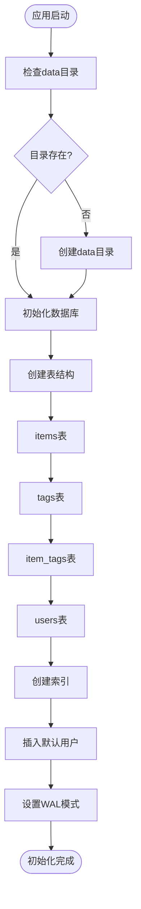
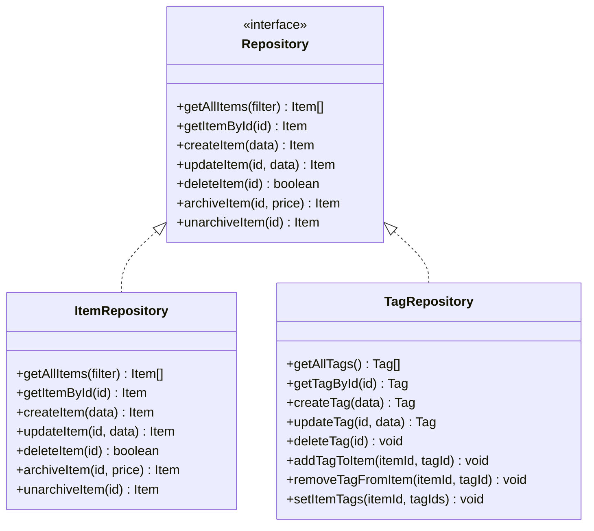
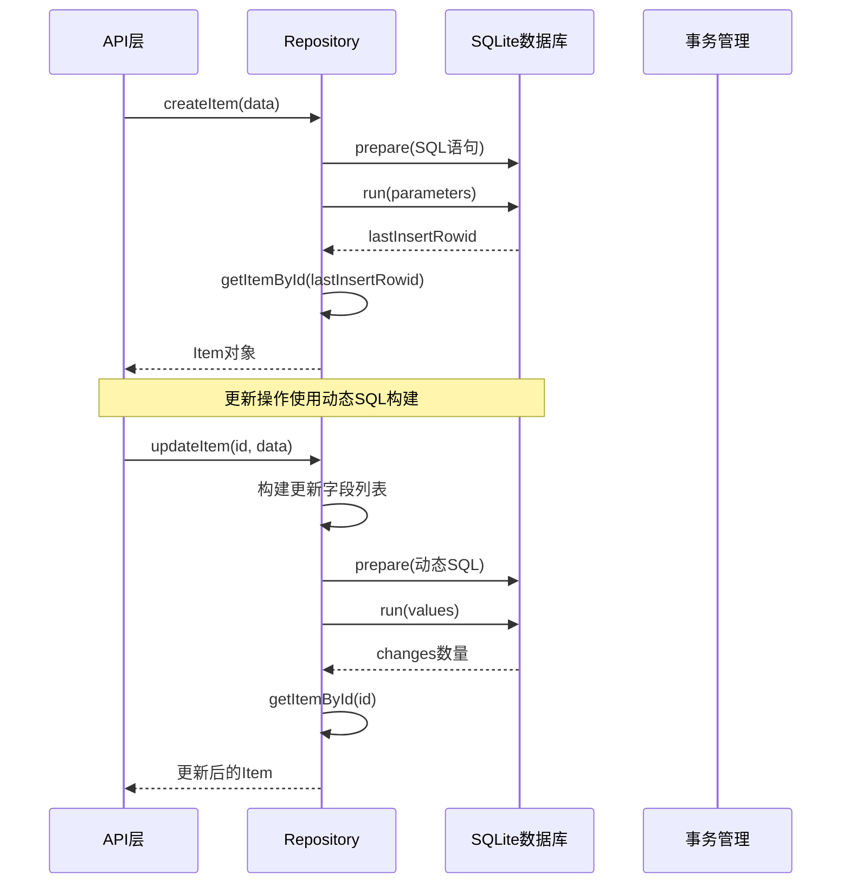
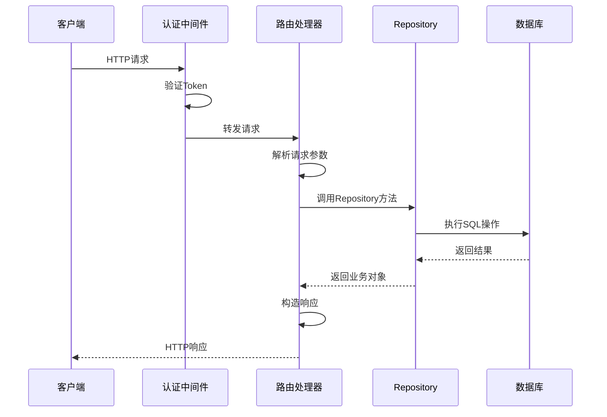

# 数据持久化

<cite>
**本文档引用的文件**
- [sqlite.ts](file://lib/db/sqlite.ts)
- [repository.ts](file://lib/db/repository.ts)
- [tag-repository.ts](file://lib/db/tag-repository.ts)
- [item.ts](file://lib/types/item.ts)
- [tag.ts](file://lib/types/tag.ts)
- [route.ts](file://app/api/items/route.ts)
- [route.ts](file://app/api/items/[id]/route.ts)
- [需求说明.md](file://需求说明.md)
- [package.json](file://package.json)
</cite>

## 目录
1. [简介](#简介)
2. [项目结构](#项目结构)
3. [核心组件](#核心组件)
4. [架构概览](#架构概览)
5. [详细组件分析](#详细组件分析)
6. [依赖关系分析](#依赖关系分析)
7. [性能考虑](#性能考虑)
8. [故障排除指南](#故障排除指南)
9. [结论](#结论)

## 简介

本文档深入介绍了基于SQLite的数据持久化架构，该架构为个人物品成本管理Web应用提供了可靠的数据存储解决方案。系统采用轻量级的SQLite数据库，配合Repository模式实现数据访问层的抽象，确保了数据的一致性和可维护性。

## 项目结构

数据持久化模块位于`lib/db/`目录下，包含以下核心文件：

```mermaid
graph TB
subgraph "数据持久化层"
A[sqlite.ts<br/>数据库连接管理]
B[repository.ts<br/>物品数据访问]
C[tag-repository.ts<br/>标签数据访问]
D[user-repository.ts<br/>用户数据访问]
end
subgraph "类型定义"
E[item.ts<br/>物品类型]
F[tag.ts<br/>标签类型]
end
subgraph "API层"
G[items/route.ts<br/>物品API]
H[items/[id]/route.ts<br/>单个物品API]
end
A --> B
A --> C
A --> D
B --> E
C --> F
G --> B
H --> B
```

**图表来源**
- [sqlite.ts](file://lib/db/sqlite.ts#L1-L109)
- [repository.ts](file://lib/db/repository.ts#L1-L156)
- [tag-repository.ts](file://lib/db/tag-repository.ts#L1-L191)

**章节来源**
- [sqlite.ts](file://lib/db/sqlite.ts#L1-L109)
- [repository.ts](file://lib/db/repository.ts#L1-L156)
- [tag-repository.ts](file://lib/db/tag-repository.ts#L1-L191)

## 核心组件

### 数据库连接管理器

SQLite连接管理器负责数据库实例的创建、初始化和生命周期管理：

- **数据库文件位置**：`data/bookkeeping.db`
- **WAL模式**：启用Write-Ahead Logging提高并发性能
- **自动初始化**：首次访问时自动创建表结构
- **索引优化**：为常用查询字段创建索引

### Repository模式实现

Repository模式封装了CRUD操作，提供统一的数据访问接口：

- **单一用户模式**：使用固定`user_id`简化权限控制
- **动态SQL构建**：支持灵活的查询条件
- **事务支持**：确保复杂操作的原子性
- **错误处理**：完善的异常捕获和返回机制

**章节来源**
- [sqlite.ts](file://lib/db/sqlite.ts#L17-L109)
- [repository.ts](file://lib/db/repository.ts#L1-L156)

## 架构概览

系统采用分层架构设计，清晰分离关注点：



**图表来源**
- [route.ts](file://app/api/items/route.ts#L1-L75)
- [repository.ts](file://lib/db/repository.ts#L1-L156)
- [sqlite.ts](file://lib/db/sqlite.ts#L27-L100)

## 详细组件分析

### SQLite数据库初始化

数据库初始化过程包括表结构创建、索引建立和默认数据插入：



**图表来源**
- [sqlite.ts](file://lib/db/sqlite.ts#L9-L109)

#### 表结构设计

系统包含四个核心表，每个表都有明确的职责分工：

| 表名 | 字段 | 类型 | 说明 |
|------|------|------|------|
| items | id | INTEGER PRIMARY KEY AUTOINCREMENT | 主键，自增 |
| items | user_id | TEXT NOT NULL DEFAULT 'default_user' | 所属用户ID |
| items | name | TEXT NOT NULL | 物品名称 |
| items | purchased_at | TEXT NOT NULL | 购买日期（ISO格式） |
| items | price_cents | INTEGER NOT NULL | 购买价格（分） |
| items | remark | TEXT NOT NULL DEFAULT '' | 备注 |
| items | archived | INTEGER NOT NULL DEFAULT 0 | 归档状态（0=否，1=是） |
| items | archived_at | TEXT | 归档时间 |
| items | archived_daily_price_cents | INTEGER | 归档时的日均价格 |
| items | created_at | TEXT NOT NULL | 创建时间 |
| items | updated_at | TEXT NOT NULL | 更新时间 |

**章节来源**
- [sqlite.ts](file://lib/db/sqlite.ts#L27-L100)
- [需求说明.md](file://需求说明.md#L149-L168)

### Repository模式实现

Repository模式提供了统一的数据访问接口，封装了具体的数据库操作：



**图表来源**
- [repository.ts](file://lib/db/repository.ts#L1-L156)
- [tag-repository.ts](file://lib/db/tag-repository.ts#L1-L191)

#### CRUD操作实现

每个Repository都实现了标准的CRUD操作，支持复杂的查询条件和批量操作：



**图表来源**
- [repository.ts](file://lib/db/repository.ts#L37-L122)
- [tag-repository.ts](file://lib/db/tag-repository.ts#L32-L98)

**章节来源**
- [repository.ts](file://lib/db/repository.ts#L1-L156)
- [tag-repository.ts](file://lib/db/tag-repository.ts#L1-L191)

### API路由集成

API路由层负责HTTP请求的处理和Repository层的调用：



**图表来源**
- [route.ts](file://app/api/items/route.ts#L1-L75)
- [route.ts](file://app/api/items/[id]/route.ts#L1-L134)

**章节来源**
- [route.ts](file://app/api/items/route.ts#L1-L75)
- [route.ts](file://app/api/items/[id]/route.ts#L1-L134)

### 数据库文件管理

数据库文件采用集中式管理模式，确保数据的安全性和可维护性：

- **存储位置**：`data/bookkeeping.db`
- **目录结构**：自动创建`data`目录
- **文件权限**：确保适当的文件系统权限
- **备份策略**：定期备份数据库文件

**章节来源**
- [sqlite.ts](file://lib/db/sqlite.ts#L6-L12)

## 依赖关系分析

系统的依赖关系呈现清晰的层次结构：

```mermaid
graph TB
subgraph "外部依赖"
A[better-sqlite3]
B[Node.js运行时]
end
subgraph "核心模块"
C[sqlite.ts]
D[repository.ts]
E[tag-repository.ts]
end
subgraph "类型定义"
F[item.ts]
G[tag.ts]
end
subgraph "API层"
H[items/route.ts]
I[items/[id]/route.ts]
end
A --> C
B --> C
C --> D
C --> E
F --> D
F --> E
G --> E
D --> H
D --> I
E --> H
E --> I
```

**图表来源**
- [sqlite.ts](file://lib/db/sqlite.ts#L1-L5)
- [repository.ts](file://lib/db/repository.ts#L1-L3)
- [package.json](file://package.json#L11-L27)

**章节来源**
- [sqlite.ts](file://lib/db/sqlite.ts#L1-L109)
- [repository.ts](file://lib/db/repository.ts#L1-L156)
- [tag-repository.ts](file://lib/db/tag-repository.ts#L1-L191)

## 性能考虑

### 查询优化

系统采用了多种性能优化策略：

- **索引优化**：为`user_id`、`archived`等常用查询字段创建索引
- **WAL模式**：启用Write-Ahead Logging提高并发性能
- **预编译语句**：使用prepared statements减少解析开销
- **批量操作**：支持批量插入和更新操作

### 内存管理

- **连接池**：单例模式管理数据库连接
- **事务管理**：合理使用事务确保数据一致性
- **资源清理**：提供数据库连接关闭机制

## 故障排除指南

### 常见问题及解决方案

#### 数据库连接问题
- **症状**：无法创建数据库连接
- **原因**：data目录权限不足或磁盘空间不足
- **解决方案**：检查目录权限，确保有足够的磁盘空间

#### 数据一致性问题
- **症状**：数据更新不一致或丢失
- **原因**：事务处理不当或并发访问冲突
- **解决方案**：使用Repository层的事务管理功能

#### 性能问题
- **症状**：查询响应缓慢
- **原因**：缺少适当索引或查询条件不当
- **解决方案**：检查查询计划，添加必要的索引

**章节来源**
- [sqlite.ts](file://lib/db/sqlite.ts#L103-L109)

## 结论

基于SQLite的数据持久化架构为个人物品成本管理应用提供了可靠、高效的解决方案。通过Repository模式的封装，系统实现了良好的代码组织和可维护性。WAL模式的使用确保了良好的并发性能，而完善的错误处理机制保证了系统的稳定性。

该架构具有以下优势：
- **轻量级**：SQLite无需单独的数据库服务器
- **高性能**：WAL模式和索引优化
- **易维护**：清晰的分层架构和Repository模式
- **可扩展**：支持未来功能的平滑扩展