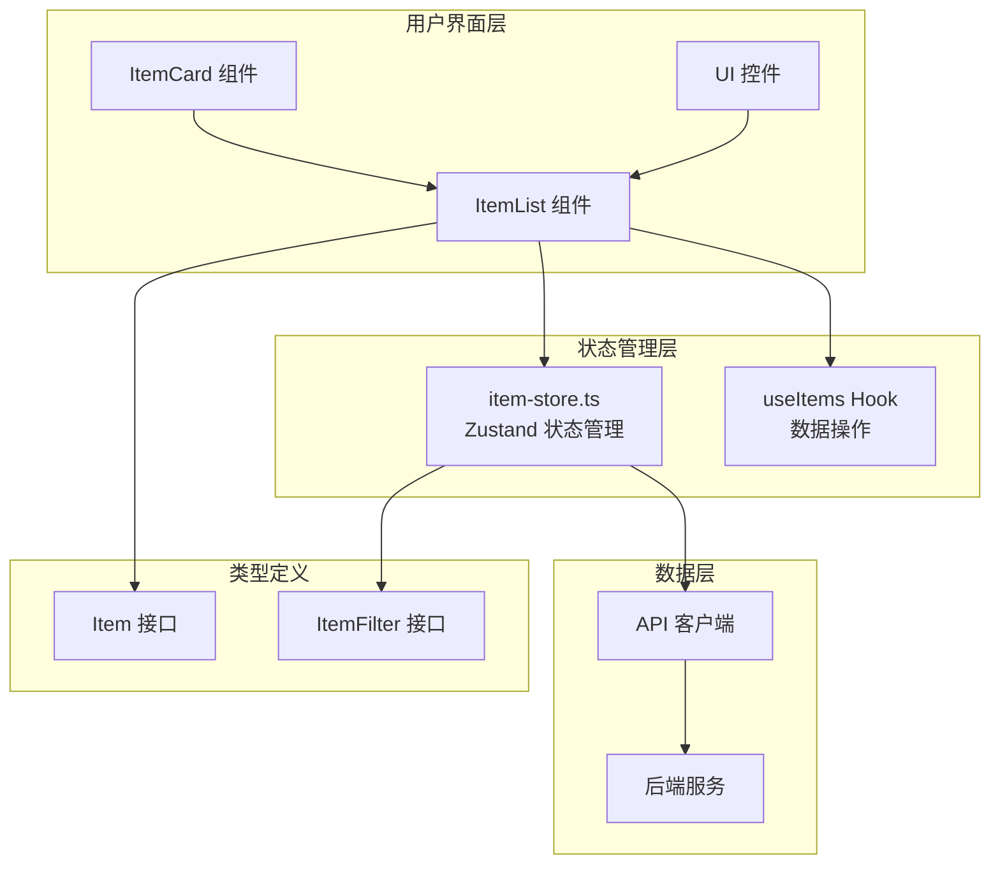
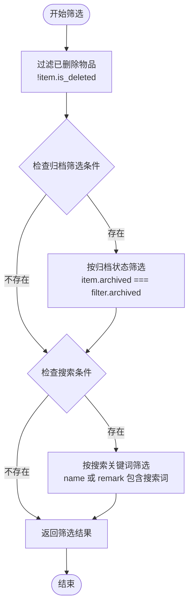
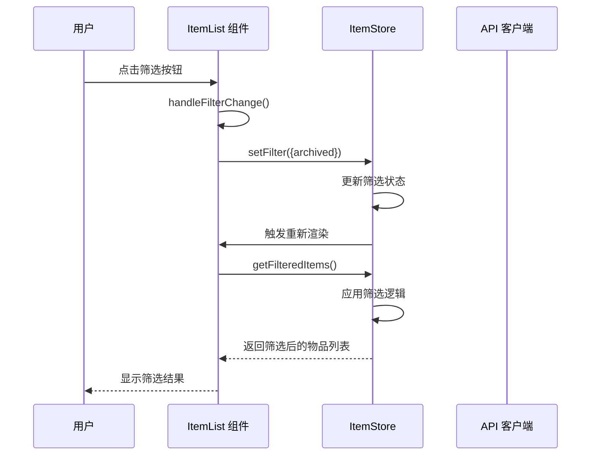
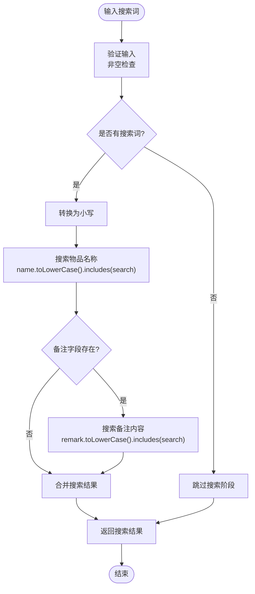
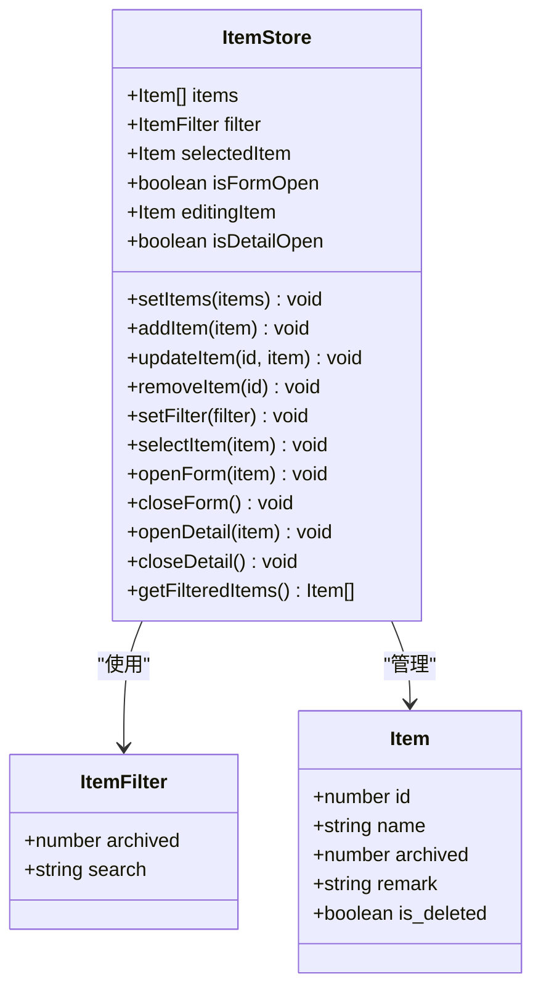
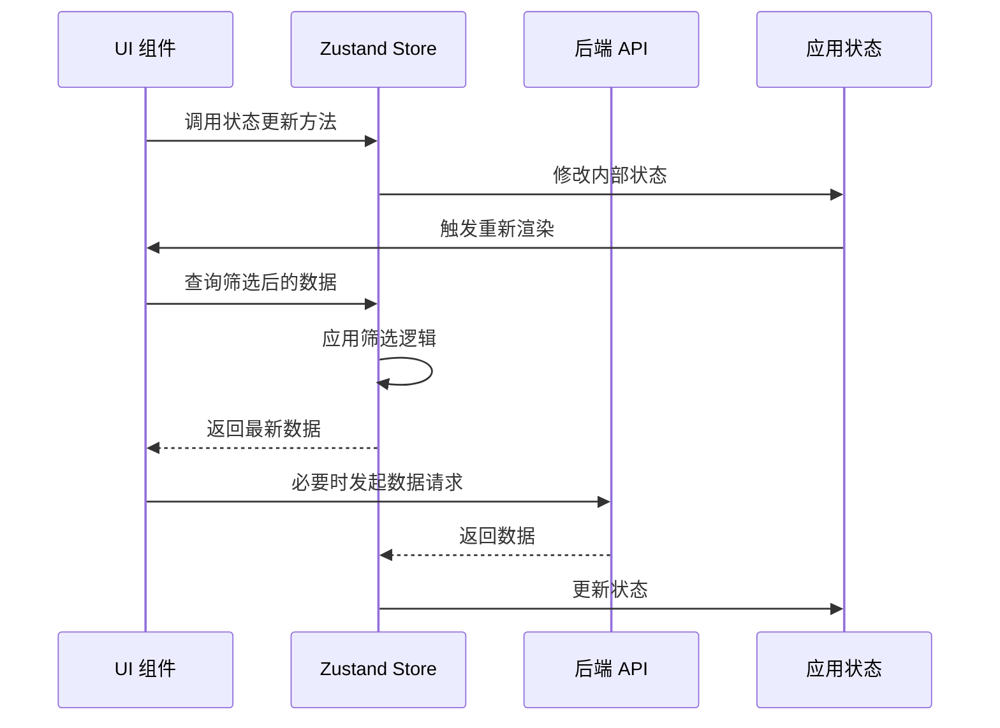
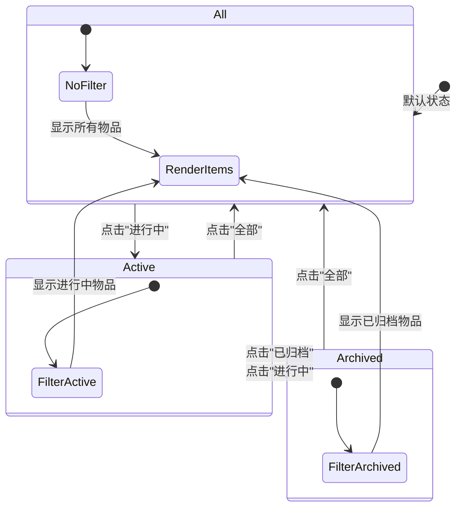
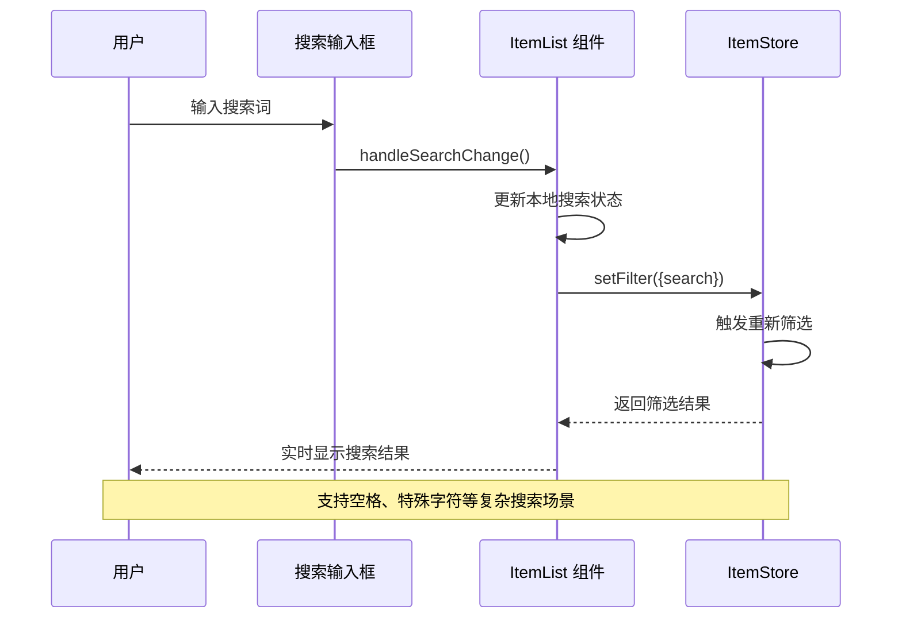
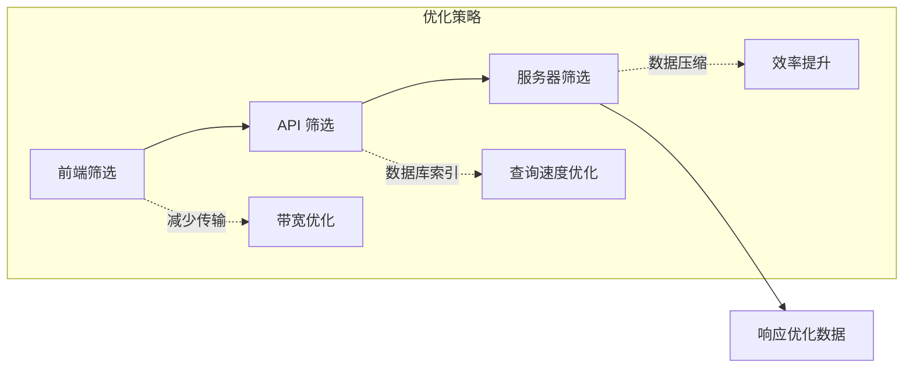
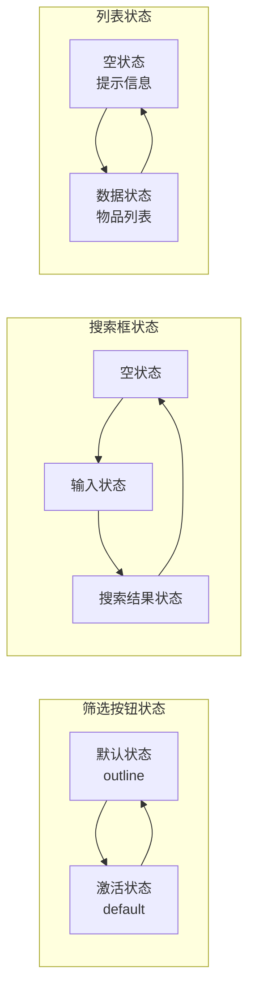

# 数据筛选与搜索

<cite>
**本文档中引用的文件**
- [components/item-list.tsx](file://components/item-list.tsx)
- [lib/store/item-store.ts](file://lib/store/item-store.ts)
- [lib/types/item.ts](file://lib/types/item.ts)
- [lib/hooks/use-items.ts](file://lib/hooks/use-items.ts)
- [app/page.tsx](file://app/page.tsx)
- [components/item-card.tsx](file://components/item-card.tsx)
- [lib/api/client.ts](file://lib/api/client.ts)
- [lib/utils/item-utils.ts](file://lib/utils/item-utils.ts)
</cite>

## 目录
1. [简介](#简介)
2. [项目架构概览](#项目架构概览)
3. [筛选功能实现](#筛选功能实现)
4. [搜索功能实现](#搜索功能实现)
5. [状态管理机制](#状态管理机制)
6. [UI交互流程](#ui交互流程)
7. [性能优化考虑](#性能优化考虑)
8. [用户体验设计](#用户体验设计)
9. [总结](#总结)

## 简介

本文档详细介绍了记账应用中数据筛选与搜索功能的实现方式。该系统提供了直观的界面选项让用户能够快速过滤物品列表，并支持关键词搜索功能。核心功能包括三种筛选状态（全部、进行中、已归档）和全文本搜索，这些功能通过React状态管理和Zustand状态库实现，确保了良好的用户体验和高效的性能表现。

## 项目架构概览

系统采用现代化的前端架构，主要包含以下核心模块：

**图表来源**
- [components/item-list.tsx](file://components/item-list.tsx#L1-L99)
- [lib/store/item-store.ts](file://lib/store/item-store.ts#L1-L114)
- [lib/hooks/use-items.ts](file://lib/hooks/use-items.ts#L1-L106)

**章节来源**
- [components/item-list.tsx](file://components/item-list.tsx#L1-L99)
- [lib/store/item-store.ts](file://lib/store/item-store.ts#L1-L114)
- [app/page.tsx](file://app/page.tsx#L1-L275)

## 筛选功能实现

### 筛选状态定义

系统提供三种基本筛选状态，通过`ItemFilter`接口定义：

| 筛选状态 | 值 | 描述 |
|---------|---|------|
| 全部 | `undefined` | 显示所有物品，包括已归档和进行中的物品 |
| 进行中 | `0` | 只显示未归档的物品 |
| 已归档 | `1` | 只显示已归档的物品 |

### 筛选逻辑实现

筛选功能的核心实现在`item-store.ts`中的`getFilteredItems`方法：

**图表来源**
- [lib/store/item-store.ts](file://lib/store/item-store.ts#L93-L112)

### 筛选状态管理

筛选状态通过React状态和Zustand状态管理相结合的方式实现：

**图表来源**
- [components/item-list.tsx](file://components/item-list.tsx#L24-L27)
- [lib/store/item-store.ts](file://lib/store/item-store.ts#L69-L70)

**章节来源**
- [components/item-list.tsx](file://components/item-list.tsx#L24-L27)
- [lib/store/item-store.ts](file://lib/store/item-store.ts#L93-L112)

## 搜索功能实现

### 搜索机制

系统实现了基于关键词的全文本搜索功能，支持对物品名称和备注字段进行模糊匹配：

#### 搜索字段范围
- **物品名称** (`item.name`)：主要搜索字段
- **备注内容** (`item.remark`)：次要搜索字段

#### 搜索算法特点
- **大小写不敏感**：搜索词和目标文本都转换为小写进行比较
- **模糊匹配**：使用`String.prototype.includes()`方法进行包含性匹配
- **多字段搜索**：同时在多个字段中查找匹配项

### 搜索实现流程

**图表来源**
- [lib/store/item-store.ts](file://lib/store/item-store.ts#L103-L108)

**章节来源**
- [lib/store/item-store.ts](file://lib/store/item-store.ts#L103-L108)
- [components/item-list.tsx](file://components/item-list.tsx#L29-L32)

## 状态管理机制

### Zustand状态架构

系统采用Zustand作为状态管理解决方案，提供了集中化的状态管理：

**图表来源**
- [lib/store/item-store.ts](file://lib/store/item-store.ts#L9-L46)
- [lib/types/item.ts](file://lib/types/item.ts#L80-L85)

### 状态更新流程

状态更新遵循单向数据流原则：

**图表来源**
- [lib/store/item-store.ts](file://lib/store/item-store.ts#L47-L113)
- [app/page.tsx](file://app/page.tsx#L37-L44)

**章节来源**
- [lib/store/item-store.ts](file://lib/store/item-store.ts#L47-L113)
- [app/page.tsx](file://app/page.tsx#L37-L44)

## UI交互流程

### 筛选按钮交互

用户可以通过三个按钮快速切换筛选状态：

**图表来源**
- [components/item-list.tsx](file://components/item-list.tsx#L56-L78)

### 搜索输入处理

搜索功能提供了实时反馈机制：

**图表来源**
- [components/item-list.tsx](file://components/item-list.tsx#L29-L32)

**章节来源**
- [components/item-list.tsx](file://components/item-list.tsx#L24-L32)

## 性能优化考虑

### 筛选性能优化

1. **内存缓存**：筛选逻辑直接在内存中处理，避免重复计算
2. **增量更新**：只在状态变化时重新计算筛选结果
3. **防抖处理**：搜索输入支持防抖机制，减少不必要的重新渲染

### 渲染优化策略

- **虚拟滚动**：对于大量数据，可以考虑实现虚拟滚动
- **组件记忆化**：使用React.memo防止不必要的重新渲染
- **懒加载**：大数据集支持分页或无限滚动加载

### API优化

系统通过API客户端实现了智能的筛选参数传递：

**图表来源**
- [lib/api/client.ts](file://lib/api/client.ts#L96-L104)

**章节来源**
- [lib/api/client.ts](file://lib/api/client.ts#L96-L104)
- [lib/store/item-store.ts](file://lib/store/item-store.ts#L93-L112)

## 用户体验设计

### 界面设计原则

1. **直观性**：筛选按钮使用明确的文字标识
2. **一致性**：统一的视觉反馈和交互模式
3. **响应性**：即时的搜索结果反馈
4. **可访问性**：支持键盘导航和屏幕阅读器

### 视觉反馈机制

**图表来源**
- [components/item-list.tsx](file://components/item-list.tsx#L56-L78)

### 错误处理与反馈

系统提供了完善的错误处理机制：
- **网络错误**：自动重试和用户友好的错误提示
- **数据异常**：优雅降级和状态恢复
- **加载状态**：清晰的加载指示器

**章节来源**
- [components/item-list.tsx](file://components/item-list.tsx#L84-L89)
- [app/page.tsx](file://app/page.tsx#L155-L179)

## 总结

该记账应用的数据筛选与搜索功能通过精心设计的架构实现了高效、直观的用户体验。系统的核心优势包括：

1. **模块化设计**：清晰的组件分离和职责划分
2. **状态管理**：Zustand提供的轻量级状态管理方案
3. **性能优化**：内存中的实时筛选和智能的API调用
4. **用户体验**：直观的界面设计和即时的反馈机制

通过这种实现方式，用户可以快速找到所需的物品信息，无论是通过简单的状态筛选还是精确的关键词搜索。系统的可扩展性也为未来添加更多筛选条件和搜索功能提供了良好的基础。