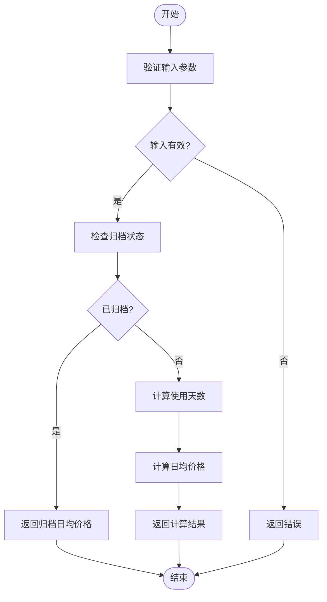
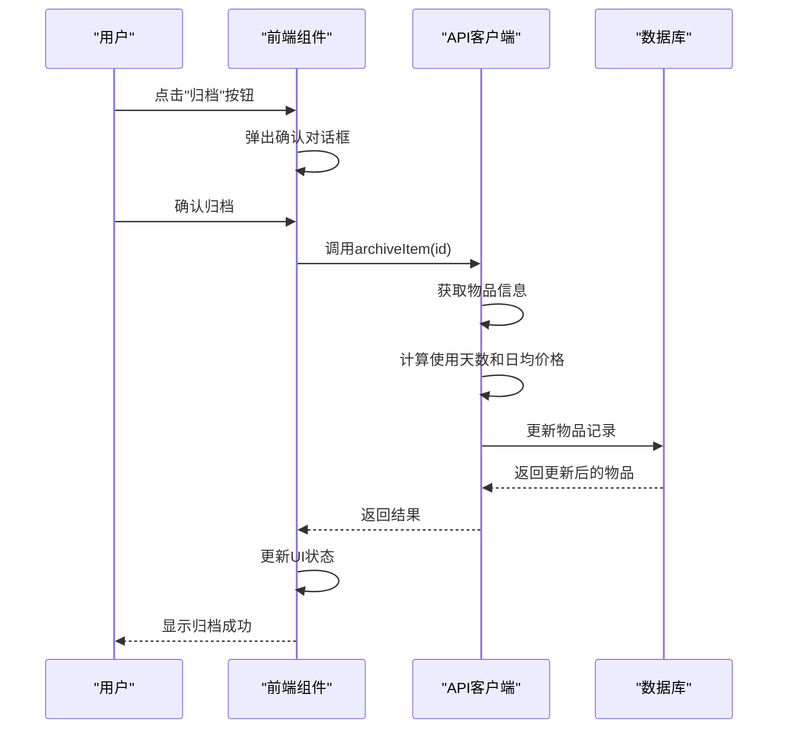
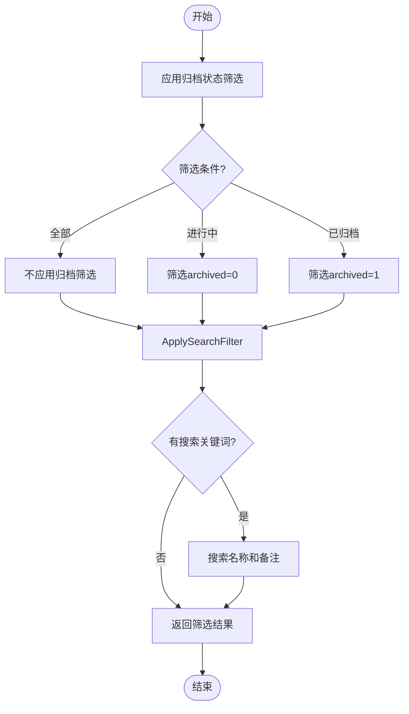
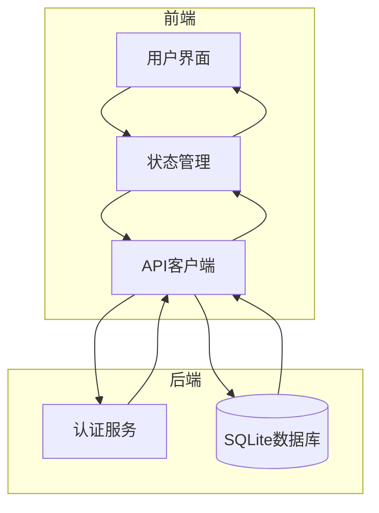

# 核心功能

<cite>
**本文档引用的文件**
- [README.md](file://README.md)
- [需求说明.md](file://需求说明.md)
- [page.tsx](file://app/page.tsx)
- [item-list.tsx](file://components/item-list.tsx)
- [item-card.tsx](file://components/item-card.tsx)
- [item-detail.tsx](file://components/item-detail.tsx)
- [item-form.tsx](file://components/item-form.tsx)
- [item-store.ts](file://lib/store/item-store.ts)
- [use-items.ts](file://lib/hooks/use-items.ts)
- [repository.ts](file://lib/db/repository.ts)
- [item-utils.ts](file://lib/utils/item-utils.ts)
- [item.ts](file://lib/types/item.ts)
- [route.ts](file://app/api/items/route.ts)
</cite>

## 目录
1. [物品信息管理](#物品信息管理)
2. [使用天数与日均价格自动计算](#使用天数与日均价格自动计算)
3. [归档/退役机制](#归档/退役机制)
4. [数据筛选与搜索](#数据筛选与搜索)
5. [用户认证与数据持久化](#用户认证与数据持久化)

## 物品信息管理

本系统提供完整的物品信息管理功能，允许用户创建、编辑、查看和删除物品记录。每个物品包含名称、购买日期、购买价格、备注等核心信息，所有数据均通过云端SQLite数据库进行持久化存储。

在用户界面中，通过`item-form.tsx`组件实现新建和编辑功能。该组件提供表单验证，确保必填字段（名称、购买日期、价格）不为空，并对价格进行非负数校验。前端使用Zustand状态管理库（`item-store.ts`）维护UI状态，包括表单打开/关闭、编辑模式切换等。当用户提交表单时，`page.tsx`中的`handleSubmit`函数会调用API客户端创建或更新物品。

物品的创建和更新操作通过`use-items.ts`中的`createItem`和`updateItem`函数实现，这些函数最终调用`repository.ts`中的数据库操作函数。在数据库层面，`createItem`函数会设置默认值，如`archived`字段初始化为0（未归档），并自动记录创建和更新时间戳。

**Section sources**
- [item-form.tsx](file://components/item-form.tsx#L1-L216)
- [item-store.ts](file://lib/store/item-store.ts#L1-L114)
- [use-items.ts](file://lib/hooks/use-items.ts#L1-L106)
- [repository.ts](file://lib/db/repository.ts#L1-L156)
- [item.ts](file://lib/types/item.ts#L1-L94)

## 使用天数与日均价格自动计算

系统实现了自动化的使用天数和日均价格计算功能。使用天数根据购买日期和终止日期计算，其中终止日期规则为：对于未归档物品，终止日期为当前日期；对于已归档物品，终止日期为归档日期。计算时以自然日为粒度，若使用天数为0，则按1天计算以避免除零错误。

日均价格计算公式为：购买价格 ÷ 使用天数。系统内部以"分"为单位存储价格，前端展示时转换为"元"并保留两位小数。关键的计算逻辑封装在`item-utils.ts`文件中，包括`calculateUsageDays`、`calculateDailyPriceCents`等函数。`getItemDailyPrice`函数根据物品状态决定计算方式：已归档物品直接返回`archived_daily_price_cents`字段值，未归档物品则动态计算。

这些计算结果在前端组件中实时展示。`item-card.tsx`和`item-detail.tsx`组件通过调用`getItemDailyPrice`和`getItemUsageDays`函数获取计算结果，并在UI上显示。例如，物品卡片会展示"日均成本：￥X.XX / 天"和"使用X天"等信息。

**Diagram sources**
- [item-utils.ts](file://lib/utils/item-utils.ts#L1-L74)
- [item-card.tsx](file://components/item-card.tsx#L1-L102)
- [item-detail.tsx](file://components/item-detail.tsx#L1-L200)

**Section sources**
- [item-utils.ts](file://lib/utils/item-utils.ts#L1-L74)
- [item-card.tsx](file://components/item-card.tsx#L1-L102)
- [item-detail.tsx](file://components/item-detail.tsx#L1-L200)

## 归档/退役机制

归档机制是本系统的核心功能之一，用于标记物品已结束使用状态。当用户对物品执行归档操作时，系统会锁定其最终使用成本，确保日均价格不再随时间变化。归档操作通过`item-detail.tsx`组件中的"归档"按钮触发，点击后会弹出确认对话框，防止误操作。

归档的业务逻辑在`use-items.ts`的`archiveItem`函数中实现。该函数首先获取物品当前信息，然后计算从购买日期到当前日期的使用天数，再根据购买价格和使用天数计算归档日均价格。最后，通过`updateItem`函数更新数据库，将`archived`字段设为1，记录`archived_at`时间，并存储计算出的`archived_daily_price_cents`。

系统同样支持取消归档功能，允许用户将已归档物品重新标记为"进行中"。取消归档时，`unarchiveItem`函数会将`archived`字段重置为0，并清空`archived_at`和`archived_daily_price_cents`字段，使日均价格恢复为动态计算模式。

在用户界面中，已归档物品会有明显的状态标识，如"已归档"标签。详情页会显示归档时间，并在使用天数后标注"(归档时)"以示区别。这些UI元素通过`item-card.tsx`和`item-detail.tsx`组件中的条件渲染实现。

**Diagram sources**
- [item-detail.tsx](file://components/item-detail.tsx#L1-L200)
- [use-items.ts](file://lib/hooks/use-items.ts#L1-L106)
- [repository.ts](file://lib/db/repository.ts#L1-L156)

**Section sources**
- [item-detail.tsx](file://components/item-detail.tsx#L1-L200)
- [use-items.ts](file://lib/hooks/use-items.ts#L1-L106)
- [repository.ts](file://lib/db/repository.ts#L1-L156)

## 数据筛选与搜索

系统提供灵活的数据筛选与搜索功能，帮助用户快速定位所需物品。筛选功能支持按归档状态过滤，包括"全部"、"进行中"和"已归档"三种选项。搜索功能允许用户通过物品名称或备注中的关键词进行全文搜索。

这些功能在`item-list.tsx`组件中实现。组件包含一个筛选栏，其中有三个按钮用于切换归档状态筛选，以及一个搜索输入框。当用户更改筛选条件或输入搜索关键词时，`handleFilterChange`函数会更新筛选器状态，并通过`onFilterChange`回调通知父组件。父组件（`page.tsx`）中的`getFilteredItems`函数会根据当前筛选条件过滤物品列表。

筛选逻辑在`item-store.ts`的`getFilteredItems`函数中实现。该函数首先应用归档状态筛选，然后对搜索关键词进行模糊匹配，检查物品名称和备注是否包含关键词（不区分大小写）。过滤后的列表通过`ItemList`组件的`items`属性传递给`ItemCard`组件进行渲染。

**Diagram sources**
- [item-list.tsx](file://components/item-list.tsx#L1-L99)
- [item-store.ts](file://lib/store/item-store.ts#L1-L114)

**Section sources**
- [item-list.tsx](file://components/item-list.tsx#L1-L99)
- [item-store.ts](file://lib/store/item-store.ts#L1-L114)

## 用户认证与数据持久化

系统采用JWT令牌进行用户认证，支持单用户模式。默认登录账号为`admin`/`admin123`。认证功能通过`app/api/auth/login/route.ts`实现，用户登录后获得JWT令牌，后续API请求需在`Authorization`头中携带该令牌。

数据持久化通过云端SQLite数据库实现。所有物品数据存储在`items`表中，确保刷新页面或更换设备后数据不丢失。API路由（如`app/api/items/route.ts`）通过`withAuth`中间件验证JWT令牌，确保只有认证用户才能访问数据。数据库操作由`repository.ts`文件封装，使用`better-sqlite3`库执行SQL查询。

前端通过`use-items.ts`中的Hook函数与API交互。例如，`getAllItems`函数调用`/api/items`端点获取物品列表，`createItem`函数调用`POST /api/items`创建新物品。这些API调用在`page.tsx`的`useEffect`钩子中执行，确保用户认证后自动加载数据。

**Diagram sources**
- [page.tsx](file://app/page.tsx#L1-L275)
- [use-items.ts](file://lib/hooks/use-items.ts#L1-L106)
- [route.ts](file://app/api/items/route.ts#L1-L75)
- [repository.ts](file://lib/db/repository.ts#L1-L156)

**Section sources**
- [page.tsx](file://app/page.tsx#L1-L275)
- [use-items.ts](file://lib/hooks/use-items.ts#L1-L106)
- [route.ts](file://app/api/items/route.ts#L1-L75)
- [repository.ts](file://lib/db/repository.ts#L1-L156)