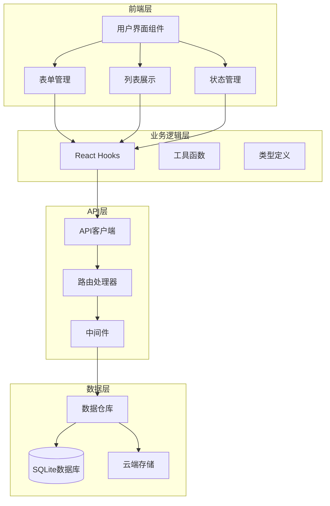
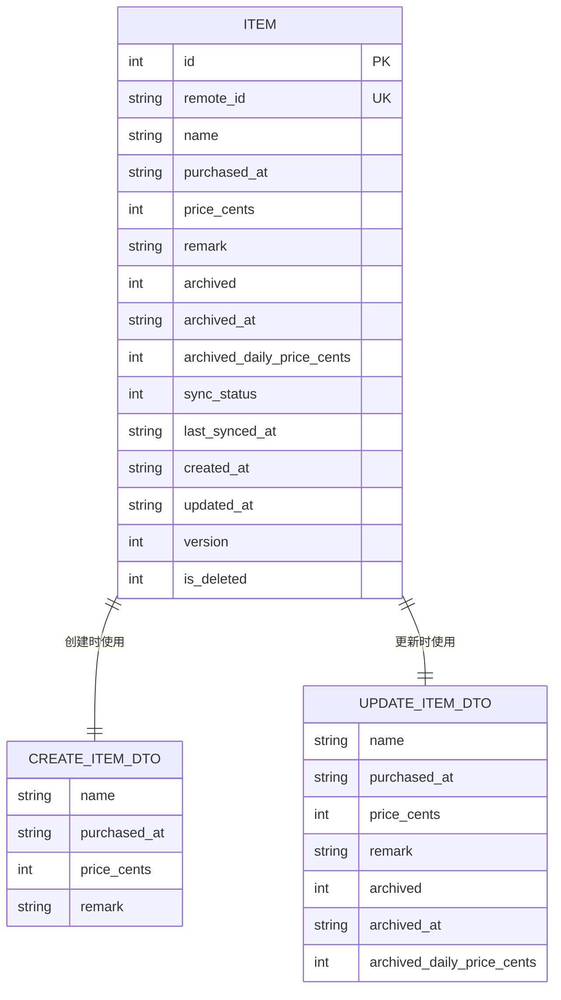
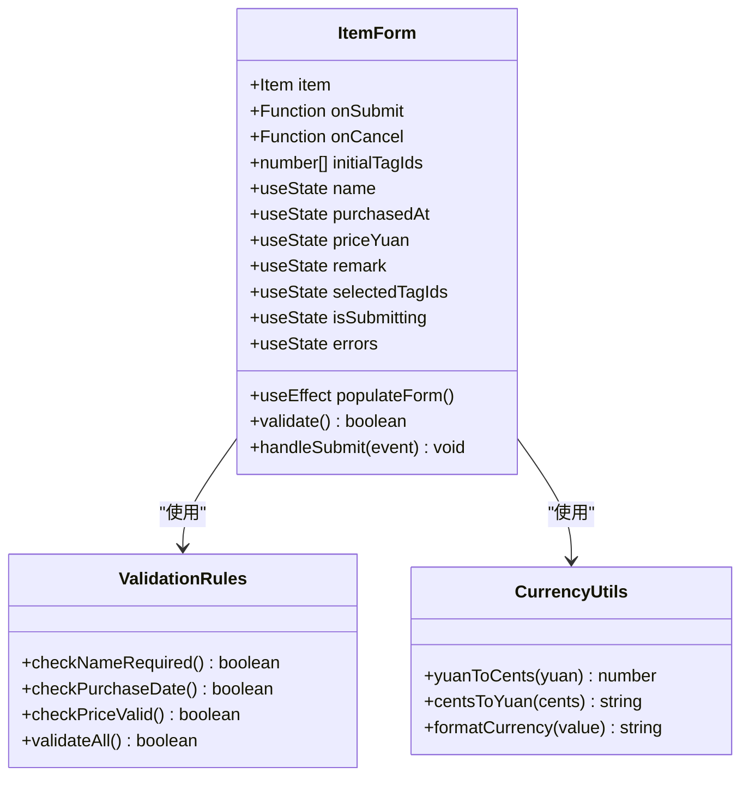
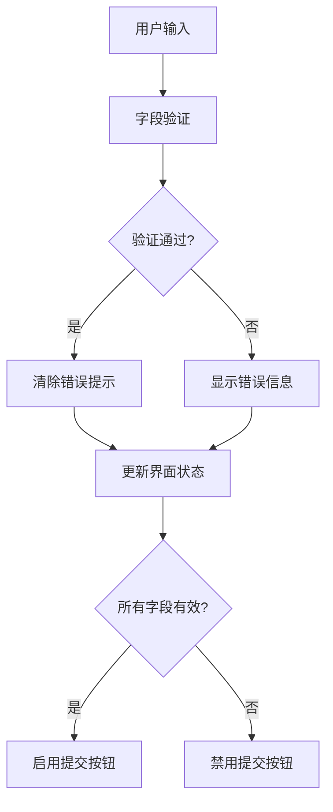
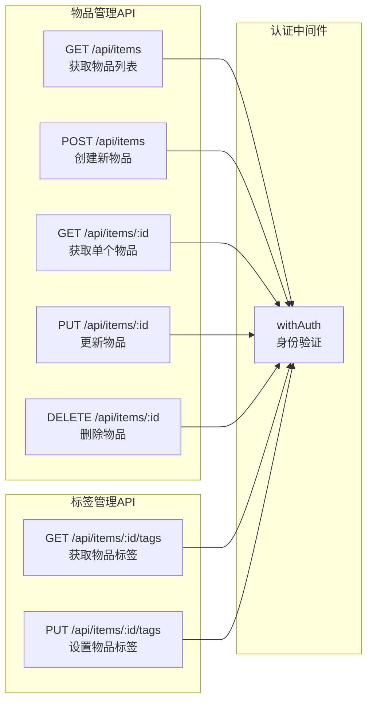
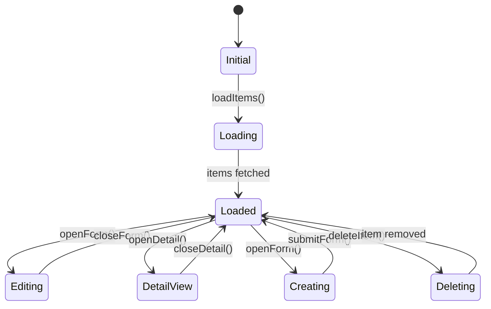
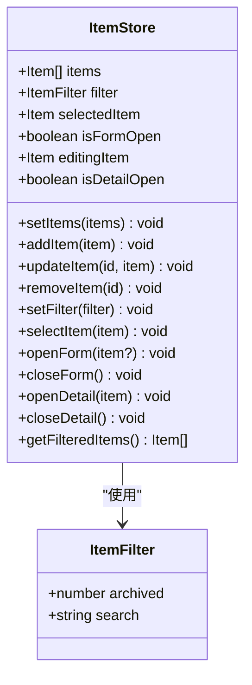
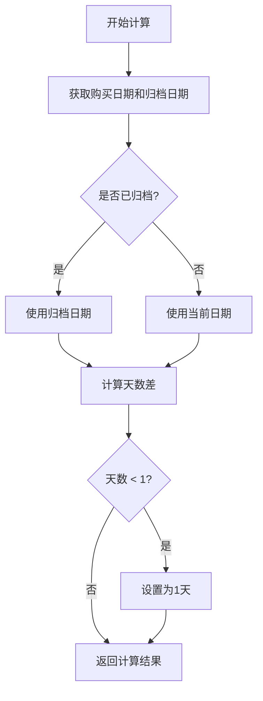
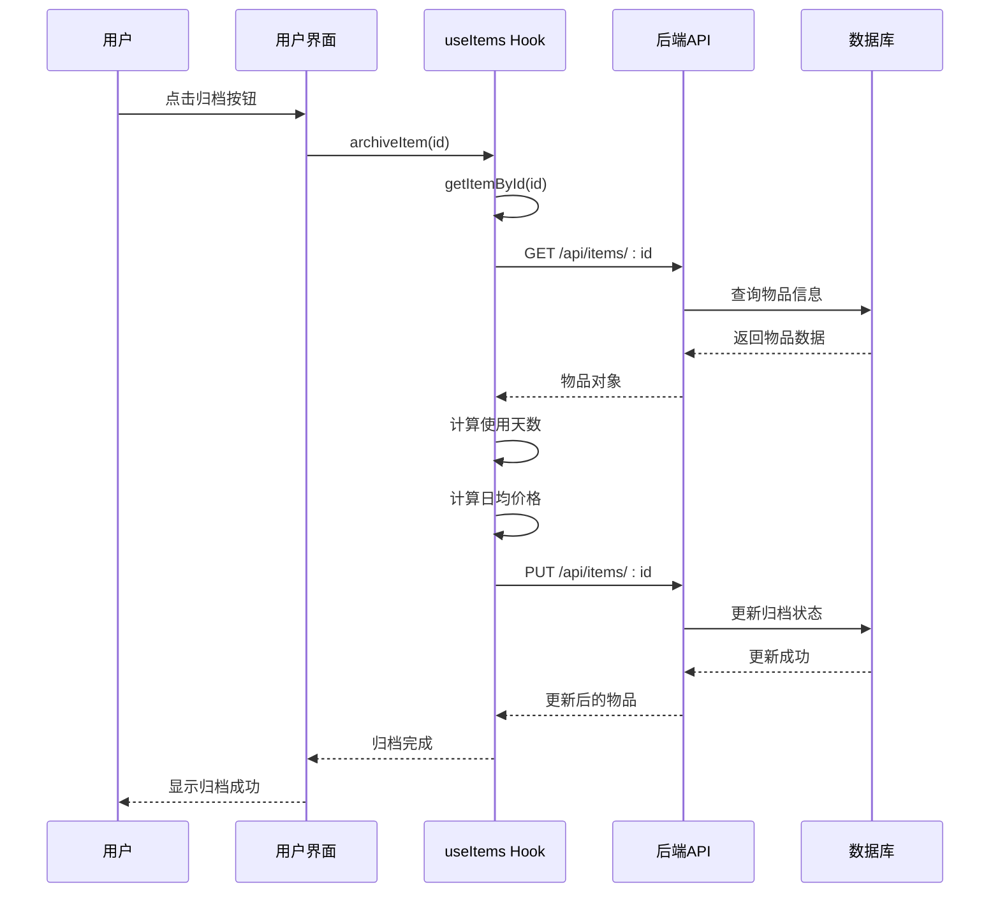
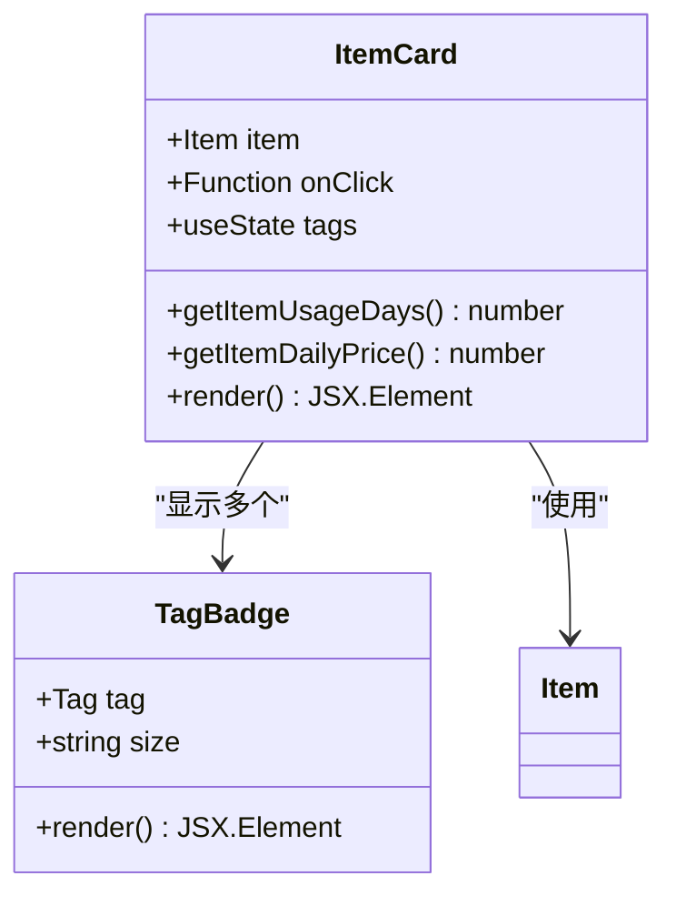

# 物品信息管理

<cite>
**本文档中引用的文件**
- [item-form.tsx](file://components/item-form.tsx)
- [use-items.ts](file://lib/hooks/use-items.ts)
- [item.ts](file://lib/types/item.ts)
- [route.ts](file://app/api/items/route.ts)
- [route.ts](file://app/api/items/[id]/route.ts)
- [item-utils.ts](file://lib/utils/item-utils.ts)
- [item-list.tsx](file://components/item-list.tsx)
- [client.ts](file://lib/api/client.ts)
- [item-card.tsx](file://components/item-card.tsx)
- [page.tsx](file://app/page.tsx)
- [item-store.ts](file://lib/store/item-store.ts)
- [需求说明.md](file://需求说明.md)
</cite>

## 目录
1. [概述](#概述)
2. [系统架构](#系统架构)
3. [数据模型设计](#数据模型设计)
4. [前端表单管理](#前端表单管理)
5. [API接口设计](#api接口设计)
6. [状态管理机制](#状态管理机制)
7. [业务逻辑实现](#业务逻辑实现)
8. [用户界面交互](#用户界面交互)
9. [错误处理与验证](#错误处理与验证)
10. [性能优化考虑](#性能优化考虑)

## 概述

物品信息管理功能是个人物品成本管理系统的核心模块，负责处理物品的全生命周期管理，包括创建、查看、编辑、删除等CRUD操作。该系统采用现代化的Next.js架构，结合TypeScript提供强类型支持，确保数据的一致性和可靠性。

### 核心功能特性

- **完整的CRUD操作**：支持物品的创建、读取、更新、删除操作
- **智能表单验证**：前端实时校验，确保数据完整性
- **归档机制**：支持物品归档，锁定最终使用成本
- **标签管理**：为物品添加分类标签，支持多维度管理
- **实时计算**：自动计算使用天数和日均价格
- **状态同步**：云端数据同步，确保多设备一致性

## 系统架构

系统采用分层架构设计，清晰分离关注点：



**架构图来源**
- [page.tsx](file://app/page.tsx#L1-L111)
- [use-items.ts](file://lib/hooks/use-items.ts#L1-L106)
- [client.ts](file://lib/api/client.ts#L1-L187)

## 数据模型设计

### 核心数据结构

系统定义了完整的物品数据模型，支持复杂的业务逻辑：



**实体图来源**
- [item.ts](file://lib/types/item.ts#L6-L94)

### 字段定义与约束

| 字段名 | 类型 | 约束 | 说明 |
|--------|------|------|------|
| `id` | INTEGER | 主键，自增 | 本地唯一标识符 |
| `remote_id` | TEXT | 可选，唯一 | 云端记录ID（UUID） |
| `name` | TEXT | 必填 | 物品名称，最大长度限制 |
| `purchased_at` | TEXT | 必填 | ISO日期字符串（YYYY-MM-DD） |
| `price_cents` | INTEGER | 必填，非负 | 购买价格，以分为单位存储 |
| `remark` | TEXT | 可选 | 备注信息，支持富文本 |
| `archived` | INTEGER | 默认0 | 归档状态（0=进行中，1=已归档） |
| `archived_at` | TEXT | 可选 | 归档时间，ISO字符串格式 |
| `archived_daily_price_cents` | INTEGER | 可选 | 归档时锁定的日均价格（分） |
| `sync_status` | INTEGER | 默认0 | 同步状态（0=未同步，1=已同步） |
| `created_at` | TEXT | 自动生成 | 记录创建时间 |
| `updated_at` | TEXT | 自动生成 | 最近更新时间 |

**字段来源**
- [需求说明.md](file://需求说明.md#L149-L168)

## 前端表单管理

### 表单组件设计

`ItemForm`组件提供了完整的物品表单管理功能，支持新建和编辑两种模式：



**类图来源**
- [item-form.tsx](file://components/item-form.tsx#L17-L216)

### 表单验证逻辑

系统实现了多层次的表单验证机制：

#### 必填字段验证
- **物品名称**：不能为空，trim后检查是否为空字符串
- **购买日期**：不能为空，且不能晚于当前日期
- **购买价格**：不能为空，必须是非负数的有效数值

#### 格式验证规则
- **日期格式**：使用HTML5 date输入框，确保ISO格式（YYYY-MM-DD）
- **价格格式**：支持小数点后两位，最小值为0
- **字符串长度**：合理限制防止数据库溢出

#### 实时反馈机制
表单提供即时的错误提示和视觉反馈：



**流程图来源**
- [item-form.tsx](file://components/item-form.tsx#L52-L78)

### 数据转换与处理

系统在前端实现了货币单位转换：

#### 价格转换逻辑
- **元转分**：`yuanToCents(yuan)` - 将元为单位的价格转换为分
- **分转元**：`centsToYuan(cents)` - 将分转换为元并格式化
- **精度控制**：使用`Math.round()`确保精度准确

#### 日期处理
- **格式标准化**：统一使用ISO 8601格式（YYYY-MM-DD）
- **默认值设置**：新建时自动设置当前日期
- **边界检查**：防止未来日期的输入

**转换来源**
- [item-utils.ts](file://lib/utils/item-utils.ts#L34-L46)

## API接口设计

### RESTful API架构

系统提供了完整的RESTful API接口，支持标准的CRUD操作：



**架构图来源**
- [route.ts](file://app/api/items/route.ts#L1-L75)
- [route.ts](file://app/api/items/[id]/route.ts#L1-L134)

### CRUD操作详解

#### 获取物品列表
- **端点**：`GET /api/items`
- **查询参数**：`archived`（0=进行中，1=已归档）
- **响应格式**：`{ success: boolean, data: Item[] }`
- **权限控制**：需要认证

#### 创建物品
- **端点**：`POST /api/items`
- **请求体**：`CreateItemDTO`对象
- **验证规则**：
  - 必填字段：`name`, `purchased_at`, `price_cents`
  - 价格必须为非负数
  - 返回201状态码

#### 更新物品
- **端点**：`PUT /api/items/:id`
- **请求体**：`UpdateItemDTO`对象（可选字段）
- **部分更新**：只更新提供的字段
- **响应格式**：更新后的完整物品对象

#### 删除物品
- **端点**：`DELETE /api/items/:id`
- **响应格式**：`{ success: boolean, message: string }`
- **软删除**：标记为已删除而非物理删除

**API来源**
- [route.ts](file://app/api/items/route.ts#L32-L74)
- [route.ts](file://app/api/items/[id]/route.ts#L48-L133)

### 错误处理机制

API层实现了完善的错误处理：

#### HTTP状态码规范
- **200/201**：成功响应
- **400**：客户端请求错误（参数验证失败）
- **401**：未授权访问
- **404**：资源不存在
- **500**：服务器内部错误

#### 错误响应格式
```typescript
{
  error: string,
  message?: string
}
```

**错误处理来源**
- [route.ts](file://app/api/items/route.ts#L40-L73)
- [route.ts](file://app/api/items/[id]/route.ts#L23-L133)

## 状态管理机制

### Zustand状态管理

系统使用Zustand作为全局状态管理解决方案：



**状态图来源**
- [item-store.ts](file://lib/store/item-store.ts#L47-L113)

### 状态结构设计



**类图来源**
- [item-store.ts](file://lib/store/item-store.ts#L9-L46)

### 数据流管理

#### 数据获取流程
1. **初始化加载**：组件挂载时调用`loadItems()`
2. **API调用**：通过`useItems` Hook调用后端API
3. **状态更新**：将获取的数据存储到Zustand状态中
4. **组件订阅**：组件自动响应状态变化

#### 数据更新流程
1. **用户操作**：用户在表单中进行修改
2. **API调用**：调用相应的CRUD API
3. **状态同步**：更新本地状态
4. **UI刷新**：组件重新渲染

**数据流来源**
- [page.tsx](file://app/page.tsx#L75-L97)
- [use-items.ts](file://lib/hooks/use-items.ts#L14-L105)

## 业务逻辑实现

### 使用天数计算

系统实现了精确的使用天数计算算法：



**流程图来源**
- [item-utils.ts](file://lib/utils/item-utils.ts#L12-L21)

### 日均价格计算

#### 动态计算逻辑
对于未归档物品，日均价格随时间动态变化：
- **公式**：`日均价格 = 购买价格 ÷ 使用天数`
- **更新频率**：每次访问时重新计算
- **精度处理**：向下取整，确保价格不会虚高

#### 归档锁定机制
对于已归档物品，日均价格永久锁定：
- **触发时机**：用户执行归档操作时
- **计算时机**：使用归档时的实际使用天数
- **存储方式**：保存到`archived_daily_price_cents`字段

**计算逻辑来源**
- [item-utils.ts](file://lib/utils/item-utils.ts#L24-L32)
- [use-items.ts](file://lib/hooks/use-items.ts#L69-L86)

### 归档操作流程



**序列图来源**
- [use-items.ts](file://lib/hooks/use-items.ts#L69-L86)

## 用户界面交互

### 物品列表展示

`ItemList`组件提供了丰富的物品列表功能：

#### 筛选功能
- **状态筛选**：全部、进行中、已归档
- **搜索功能**：按名称和备注搜索
- **实时过滤**：输入时即时更新显示结果

#### 布局设计
- **响应式布局**：支持移动端和桌面端
- **网格布局**：3列（大屏）、2列（中屏）、1列（小屏）
- **视觉层次**：清晰的状态标识和价格展示

**列表组件来源**
- [item-list.tsx](file://components/item-list.tsx#L20-L99)

### 物品卡片组件

`ItemCard`提供了物品的摘要信息展示：



**类图来源**
- [item-card.tsx](file://components/item-card.tsx#L16-L102)

### 交互反馈机制

#### 加载状态
- **全屏加载**：数据获取时显示加载动画
- **局部加载**：表单提交时按钮禁用
- **进度指示**：长时间操作显示进度条

#### 错误反馈
- **表单错误**：字段级错误提示
- **网络错误**：全局错误通知
- **操作反馈**：成功/失败状态提示

#### 视觉反馈
- **悬停效果**：卡片悬停时显示阴影
- **点击效果**：按钮点击时的视觉反馈
- **状态标识**：归档状态的明显标记

**交互来源**
- [item-form.tsx](file://components/item-form.tsx#L108-L215)
- [item-card.tsx](file://components/item-card.tsx#L42-L101)

## 错误处理与验证

### 前端验证策略

#### 实时验证
- **输入监听**：监听用户输入，实时验证
- **即时反馈**：验证失败时立即显示错误信息
- **状态管理**：维护验证状态，控制提交按钮可用性

#### 验证规则定义
```typescript
interface ValidationRules {
  name: {
    required: true,
    maxLength: 100
  },
  purchasedAt: {
    required: true,
    dateRange: 'past'
  },
  priceYuan: {
    required: true,
    numeric: true,
    min: 0
  }
}
```

### 后端验证机制

#### 数据完整性验证
- **字段验证**：确保必填字段不为空
- **类型验证**：验证数据类型和格式
- **业务规则验证**：价格必须为非负数

#### 异常处理
- **数据库异常**：捕获SQL异常并转换为友好错误
- **网络异常**：处理网络超时和连接失败
- **权限异常**：处理未授权访问

**验证来源**
- [item-form.tsx](file://components/item-form.tsx#L52-L78)
- [route.ts](file://app/api/items/route.ts#L39-L73)

### 错误恢复机制

#### 自动恢复
- **重试机制**：网络错误时自动重试
- **降级处理**：部分功能不可用时的备选方案
- **缓存回退**：网络不可用时使用本地缓存

#### 用户引导
- **错误提示**：清晰的错误描述和解决建议
- **操作指导**：提供具体的修复步骤
- **帮助链接**：提供相关文档和FAQ链接

## 性能优化考虑

### 数据加载优化

#### 分页加载
- **无限滚动**：长列表使用无限滚动加载
- **懒加载**：图片和复杂组件的懒加载
- **预加载**：预测用户行为的预加载

#### 缓存策略
- **内存缓存**：Zustand状态缓存
- **本地存储**：关键数据的本地持久化
- **CDN加速**：静态资源的CDN分发

### 渲染性能优化

#### 组件优化
- **React.memo**：避免不必要的重新渲染
- **useCallback**：稳定回调函数引用
- **useMemo**：缓存计算结果

#### 状态优化
- **状态分割**：按功能分割状态
- **批量更新**：合并多个状态更新
- **异步更新**：非关键状态的异步更新

### 网络优化

#### 请求优化
- **请求去重**：相同请求的去重处理
- **批量请求**：多个相关请求的批量处理
- **压缩传输**：数据压缩和传输优化

#### 缓存策略
- **HTTP缓存**：合理的缓存头设置
- **智能缓存**：基于数据变化的缓存策略
- **离线支持**：离线状态下的功能支持

**性能优化来源**
- [client.ts](file://lib/api/client.ts#L32-L62)
- [item-store.ts](file://lib/store/item-store.ts#L47-L113)

## 总结

物品信息管理功能通过精心设计的架构和实现，提供了完整的物品生命周期管理能力。系统具备以下优势：

### 技术优势
- **类型安全**：完整的TypeScript类型定义
- **架构清晰**：分层架构，职责分离明确
- **扩展性强**：模块化设计，易于功能扩展

### 用户体验
- **直观易用**：简洁明了的用户界面
- **实时反馈**：即时的操作反馈和验证
- **响应迅速**：优化的性能表现

### 数据可靠性
- **完整验证**：前后端双重验证机制
- **状态同步**：云端数据同步保证
- **错误处理**：完善的错误处理和恢复机制

该系统为个人物品成本管理提供了坚实的技术基础，能够满足用户对物品信息管理的各种需求，同时具备良好的扩展性和维护性。