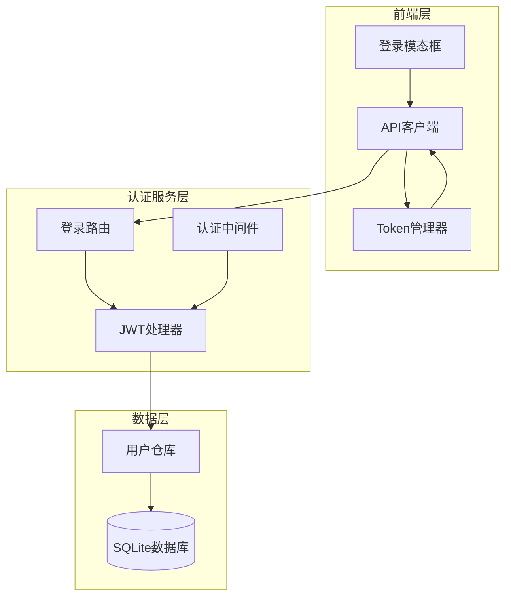
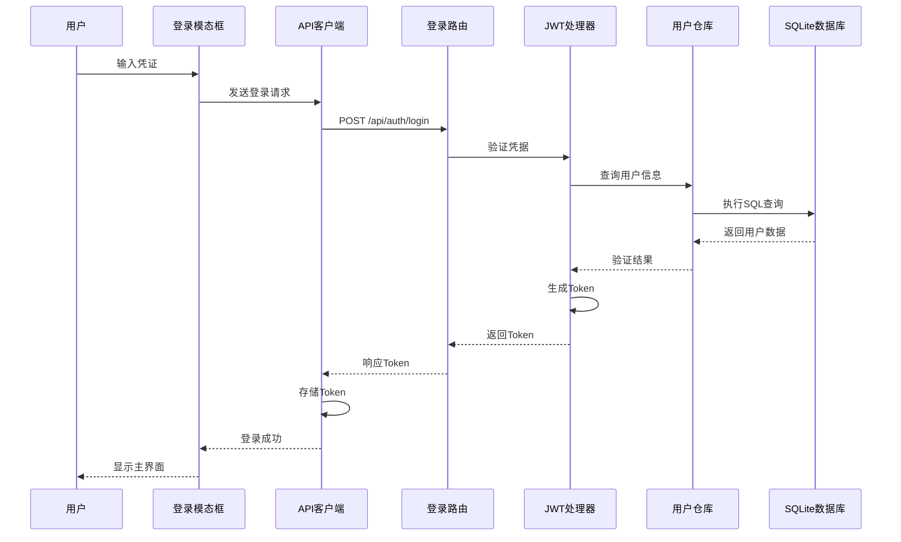
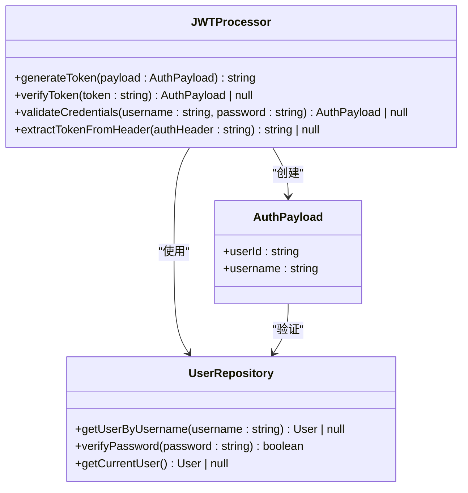
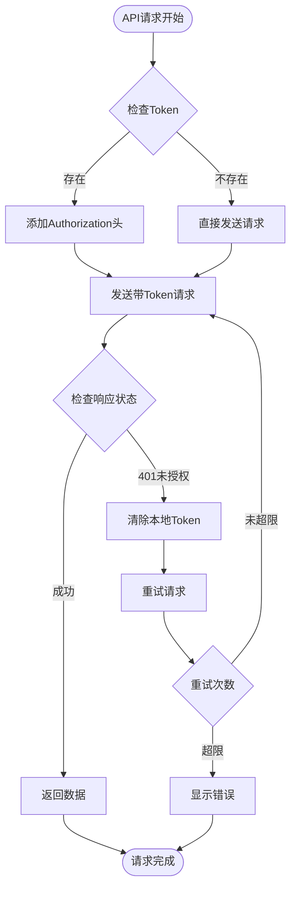
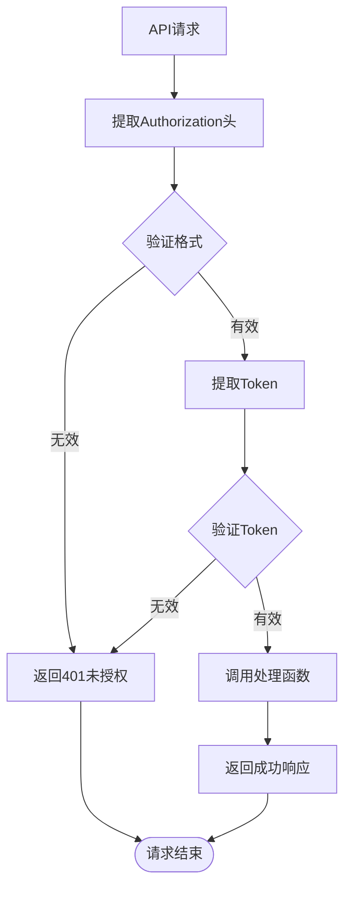

# 用户认证机制

<cite>
**本文档引用的文件**
- [app/api/auth/login/route.ts](file://app/api/auth/login/route.ts)
- [components/login-modal.tsx](file://components/login-modal.tsx)
- [lib/auth/jwt.ts](file://lib/auth/jwt.ts)
- [lib/auth/middleware.ts](file://lib/auth/middleware.ts)
- [lib/api/client.ts](file://lib/api/client.ts)
- [lib/db/user-repository.ts](file://lib/db/user-repository.ts)
- [app/api/user/route.ts](file://app/api/user/route.ts)
- [需求说明.md](file://需求说明.md)
</cite>

## 目录
1. [概述](#概述)
2. [系统架构](#系统架构)
3. [认证流程详解](#认证流程详解)
4. [JWT实现细节](#jwt实现细节)
5. [前端认证处理](#前端认证处理)
6. [后端中间件机制](#后端中间件机制)
7. [单用户模式设计](#单用户模式设计)
8. [安全性考虑](#安全性考虑)
9. [故障排除指南](#故障排除指南)
10. [总结](#总结)

## 概述

本系统采用基于JWT（JSON Web Token）的单用户认证机制，为个人物品成本管理应用提供安全可靠的用户认证服务。该认证系统专为个人使用场景设计，简化了传统多用户认证的复杂性，同时保持了现代Web应用的安全性和功能性。

### 核心特性

- **单用户模式**：针对个人用户的简化认证设计
- **JWT Token认证**：基于标准协议的安全认证机制
- **自动过期管理**：Token自动过期和刷新机制
- **前后端分离**：清晰的认证边界和职责划分
- **本地存储**：支持记住账号密码功能

## 系统架构



**架构图来源**
- [components/login-modal.tsx](file://components/login-modal.tsx#L1-L183)
- [lib/api/client.ts](file://lib/api/client.ts)
- [app/api/auth/login/route.ts](file://app/api/auth/login/route.ts#L1-L47)
- [lib/auth/middleware.ts](file://lib/auth/middleware.ts#L1-L34)

## 认证流程详解

### 完整认证流程



**序列图来源**
- [components/login-modal.tsx](file://components/login-modal.tsx#L43-L65)
- [lib/api/client.ts](file://lib/api/client.ts#L76-L88)
- [app/api/auth/login/route.ts](file://app/api/auth/login/route.ts#L4-L46)

### 登录过程详细步骤

1. **用户输入阶段**
   - 用户在登录模态框中输入用户名和密码
   - 系统验证输入格式和必填字段
   - 支持记住账号密码功能（本地存储）

2. **请求发送阶段**
   - 前端通过API客户端发送POST请求到`/api/auth/login`
   - 请求包含JSON格式的用户名和密码
   - 自动添加Authorization头（用于后续请求）

3. **后端验证阶段**
   - 后端接收并解析JSON请求体
   - 验证用户名和密码格式
   - 调用用户仓库验证凭据
   - 生成JWT Token

4. **Token返回阶段**
   - 后端返回包含Token的成功响应
   - 前端存储Token到本地存储
   - 触发登录成功回调

**节来源**
- [components/login-modal.tsx](file://components/login-modal.tsx#L43-L65)
- [lib/api/client.ts](file://lib/api/client.ts#L76-L88)
- [app/api/auth/login/route.ts](file://app/api/auth/login/route.ts#L4-L46)

## JWT实现细节

### Token生成与验证



**类图来源**
- [lib/auth/jwt.ts](file://lib/auth/jwt.ts#L1-L57)
- [lib/db/user-repository.ts](file://lib/db/user-repository.ts#L1-L107)

### 密钥管理

系统使用硬编码的JWT密钥进行演示，生产环境中应使用环境变量管理：

| 配置项 | 默认值 | 生产环境建议 |
|--------|--------|-------------|
| JWT_SECRET | 'your-secret-key-change-in-production' | 使用环境变量 |
| TOKEN_EXPIRES_IN | '7d' | 根据安全策略调整 |
| Token类型 | HS256 | 标准算法 |

### Token结构

生成的JWT Token包含以下部分：

1. **Header**: 算法信息（HS256）和Token类型
2. **Payload**: 用户身份信息和过期时间
3. **Signature**: 基于密钥和Header/Payload的签名

**节来源**
- [lib/auth/jwt.ts](file://lib/auth/jwt.ts#L1-L57)

## 前端认证处理

### API客户端认证管理



**流程图来源**
- [lib/api/client.ts](file://lib/api/client.ts#L30-L62)

### Token生命周期管理

前端Token管理包含以下关键功能：

1. **自动存储**: 登录成功后自动保存Token到localStorage
2. **自动注入**: 每次API请求自动添加Authorization头
3. **自动清理**: 遇到401错误时自动清除失效Token
4. **持久化**: 页面刷新后自动恢复Token状态

**节来源**
- [lib/api/client.ts](file://lib/api/client.ts#L10-L27)
- [components/login-modal.tsx](file://components/login-modal.tsx#L51-L57)

## 后端中间件机制

### 认证中间件架构



**流程图来源**
- [lib/auth/middleware.ts](file://lib/auth/middleware.ts#L8-L33)

### 中间件使用模式

所有需要认证的API路由都使用`withAuth`中间件包装：

```typescript
// 用户信息获取路由
export const GET = withAuth(async (request, user) => {
    // 只有通过认证的请求才能执行到这里
    const user = userRepository.getCurrentUser();
    return NextResponse.json({ success: true, data: user });
});

// 用户信息更新路由
export const PUT = withAuth(async (request, user) => {
    // 验证用户身份后执行业务逻辑
    const body = await request.json();
    // ... 更新逻辑
});
```

**节来源**
- [lib/auth/middleware.ts](file://lib/auth/middleware.ts#L8-L33)
- [app/api/user/route.ts](file://app/api/user/route.ts#L8-L25)

## 单用户模式设计

### 设计理念

单用户模式是专门为个人使用场景设计的认证简化方案：

1. **简化用户管理**: 不需要复杂的用户注册和管理功能
2. **固定凭据**: 系统预设固定的用户名和密码组合
3. **数据隔离**: 每个用户拥有独立的数据空间
4. **易于部署**: 无需用户系统基础设施

### 数据模型适配

在单用户模式下，系统使用固定用户ID进行数据隔离：

| 组件 | 实现方式 | 优势 |
|------|----------|------|
| 用户标识 | 固定USER_ID常量 | 简化查询逻辑 |
| 数据隔离 | 每个用户独立表空间 | 保证数据安全 |
| 凭据验证 | 硬编码用户名密码 | 降低维护成本 |
| 权限控制 | 基于Token的身份验证 | 保持安全性 |

**节来源**
- [lib/db/user-repository.ts](file://lib/db/user-repository.ts#L16-L17)
- [需求说明.md](file://需求说明.md#L108-L114)

## 安全性考虑

### 认证安全措施

1. **HTTPS传输**: 所有认证通信必须通过HTTPS加密传输
2. **Token过期**: 设置合理的Token过期时间（7天）
3. **密码验证**: 后端严格验证用户名密码匹配
4. **错误处理**: 敏感信息不在错误消息中泄露

### 生产环境建议

为了提高生产环境的安全性，建议实施以下改进：

1. **环境变量**: 使用环境变量管理JWT密钥
2. **密码哈希**: 对存储的密码进行哈希处理
3. **请求限制**: 实施登录尝试频率限制
4. **审计日志**: 记录认证相关的操作日志

**节来源**
- [lib/auth/jwt.ts](file://lib/auth/jwt.ts#L5-L6)
- [app/api/auth/login/route.ts](file://app/api/auth/login/route.ts#L18-L24)

## 故障排除指南

### 常见问题及解决方案

| 问题症状 | 可能原因 | 解决方案 |
|----------|----------|----------|
| 登录失败 | 用户名密码错误 | 检查默认凭据：admin/admin123 |
| Token无效 | Token过期或损坏 | 清除浏览器缓存重新登录 |
| API请求被拒绝 | 缺少Authorization头 | 检查Token是否正确存储 |
| 401错误频繁出现 | Token同步问题 | 检查网络连接和Token状态 |

### 调试技巧

1. **浏览器开发者工具**: 检查Network面板中的请求头
2. **控制台日志**: 查看JavaScript错误信息
3. **本地存储检查**: 验证localStorage中的token值
4. **后端日志**: 查看服务器端的认证日志

**节来源**
- [lib/api/client.ts](file://lib/api/client.ts#L53-L57)
- [components/login-modal.tsx](file://components/login-modal.tsx#L61-L63)

## 总结

本系统的JWT单用户认证机制为个人物品成本管理应用提供了安全、可靠且易于使用的认证解决方案。通过简化的设计和清晰的架构，系统实现了以下目标：

### 核心优势

1. **安全性**: 基于标准JWT协议的认证机制
2. **易用性**: 简化的单用户模式设计
3. **可维护性**: 清晰的代码结构和职责分离
4. **扩展性**: 支持未来向多用户模式扩展

### 技术亮点

- **前后端分离**: 明确的认证边界和职责划分
- **自动管理**: Token的自动存储、注入和清理
- **错误处理**: 完善的异常处理和用户反馈机制
- **性能优化**: 高效的Token验证和缓存策略

该认证机制不仅满足了当前的个人使用需求，也为未来的功能扩展奠定了坚实的基础。通过持续的安全改进和功能增强，系统能够为用户提供更加安全、便捷的物品成本管理体验。