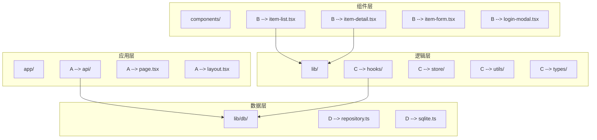
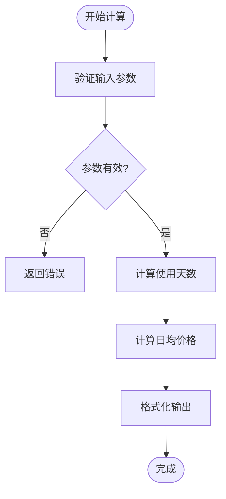
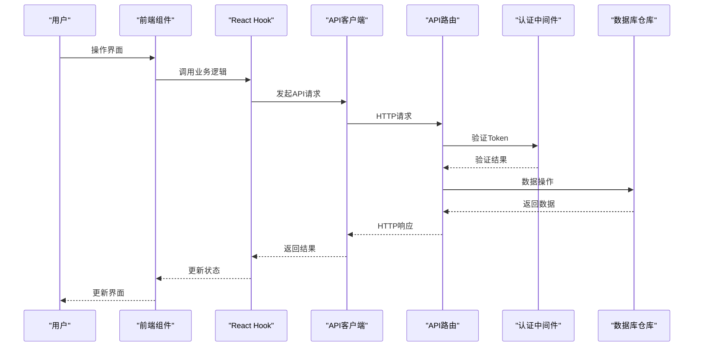
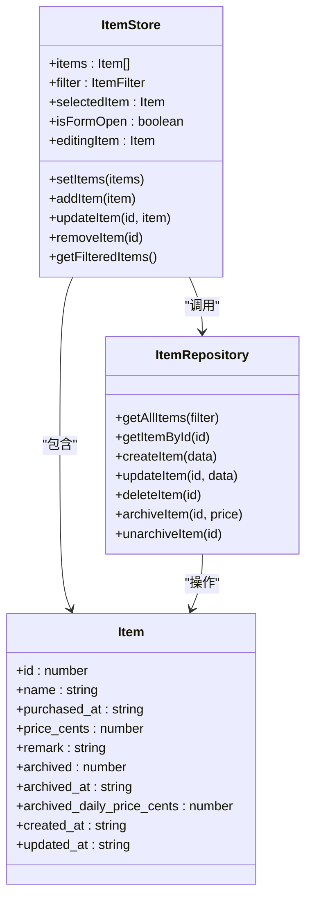
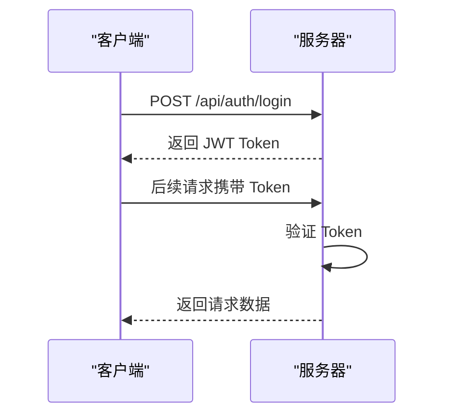
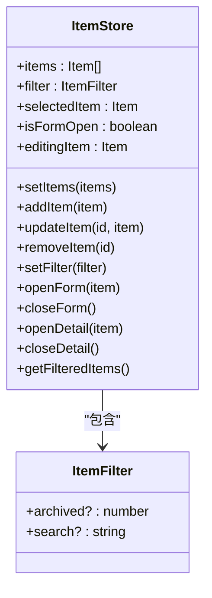
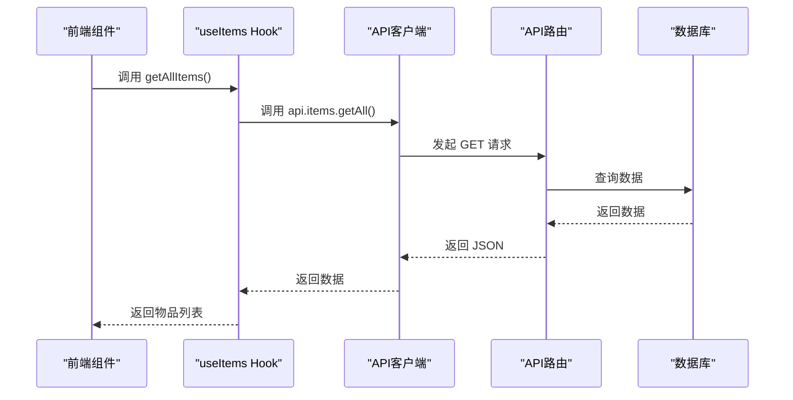

# 系统概述

<cite>
**本文档引用文件**  
- [README.md](file://README.md)
- [需求说明.md](file://需求说明.md)
- [package.json](file://package.json)
- [app/page.tsx](file://app/page.tsx)
- [app/layout.tsx](file://app/layout.tsx)
- [lib/db/repository.ts](file://lib/db/repository.ts)
- [lib/store/item-store.ts](file://lib/store/item-store.ts)
- [lib/types/item.ts](file://lib/types/item.ts)
- [lib/utils/item-utils.ts](file://lib/utils/item-utils.ts)
- [components/item-list.tsx](file://components/item-list.tsx)
- [components/item-detail.tsx](file://components/item-detail.tsx)
- [lib/hooks/use-items.ts](file://lib/hooks/use-items.ts)
- [lib/auth/middleware.ts](file://lib/auth/middleware.ts)
- [app/api/items/route.ts](file://app/api/items/route.ts)
- [app/api/auth/login/route.ts](file://app/api/auth/login/route.ts)
</cite>

## 目录
1. [简介](#简介)
2. [项目结构](#项目结构)
3. [核心功能与使用场景](#核心功能与使用场景)
4. [成本计算机制](#成本计算机制)
5. [归档功能设计](#归档功能设计)
6. [系统架构理念](#系统架构理念)
7. [技术栈与实现](#技术栈与实现)
8. [数据模型与持久化](#数据模型与持久化)
9. [用户认证设计](#用户认证设计)
10. [前端状态管理](#前端状态管理)
11. [API 接口设计](#api-接口设计)
12. [总结与展望](#总结与展望)

## 简介

个人物品成本管理系统是一个现代化的 Web 应用，旨在帮助用户记录和分析个人物品的使用成本。系统通过自动计算使用天数和日均价格，让用户清晰了解每件物品的实际使用价值。用户可以对已结束使用的物品进行归档操作，锁定其最终成本，从而区分"正在使用"和"历史物品"。系统采用全栈 Next.js 架构，结合 TypeScript、Zustand 和 SQLite 技术栈，提供高效、可靠的用户体验。

**Section sources**
- [README.md](file://README.md#L1-L137)
- [需求说明.md](file://需求说明.md#L1-L308)

## 项目结构

系统采用典型的 Next.js 应用结构，清晰地分离了前端组件、业务逻辑和数据访问层。

**Diagram sources**
- [app/page.tsx](file://app/page.tsx#L1-L275)
- [components/item-list.tsx](file://components/item-list.tsx#L1-L99)
- [components/item-detail.tsx](file://components/item-detail.tsx#L1-L200)
- [lib/db/repository.ts](file://lib/db/repository.ts#L1-L156)

**Section sources**
- [app/page.tsx](file://app/page.tsx#L1-L275)
- [app/layout.tsx](file://app/layout.tsx#L1-L35)

## 核心功能与使用场景

该系统主要面向个人用户，用于记录日常购买的物品（如电子产品、家居用品、工具等），分析其使用成本。核心功能包括物品信息管理、使用成本自动计算、归档功能、筛选搜索等。

系统支持云端数据存储，确保数据持久化和多设备访问。用户可以通过浏览器在不同设备上登录同一账户，查看和管理自己的物品数据。默认登录账号为 `admin` / `admin123`。

**Section sources**
- [README.md](file://README.md#L3-L16)
- [需求说明.md](file://需求说明.md#L3-L13)

## 成本计算机制

系统通过精确的算法自动计算物品的使用天数和日均价格，为用户提供直观的成本分析。

### 使用天数计算

使用天数的计算规则如下：
- 对于未归档物品：终止日期 = 当前日期
- 对于已归档物品：终止日期 = 归档日期
- 若终止日期与购买日期为同一天，使用天数至少按 1 天计算

### 日均价格计算

日均价格的计算规则如下：
- 内部以"分"为单位进行整数运算，前端展示时转换为"元"，保留 2 位小数
- 使用天数为 0 时，按 1 天计算
- 未归档物品：日均价格随当前日期动态更新
- 已归档物品：日均价格锁定，不再变化

**Diagram sources**
- [lib/utils/item-utils.ts](file://lib/utils/item-utils.ts#L1-L74)

**Section sources**
- [需求说明.md](file://需求说明.md#L31-L55)
- [lib/utils/item-utils.ts](file://lib/utils/item-utils.ts#L1-L74)

## 归档功能设计

归档（或退役）功能是系统的核心特性之一，用于标记物品已结束使用状态。

### 归档操作流程

当用户执行归档操作时，系统会：
1. 获取当前日期作为归档日期
2. 根据购买日期和归档日期计算最终使用天数
3. 计算归档日均价格
4. 将计算出的日均价格写入归档日均价格字段
5. 将物品状态设为"已归档"，记录归档时间

### 归档后行为

归档后，物品将：
- 日均价格锁定，展示时直接使用归档日均价格
- 使用天数展示为归档时的最终使用天数
- 在列表中显示明显的"已归档"状态标识
- 支持通过筛选功能单独查看已归档物品

**Section sources**
- [需求说明.md](file://需求说明.md#L57-L93)
- [lib/db/repository.ts](file://lib/db/repository.ts#L134-L155)

## 系统架构理念

系统采用全栈 Next.js 架构，实现了前后端一体化设计。这种架构简化了部署流程，提高了开发效率。

### 整体架构

系统架构分为四个主要层次：
1. **应用层**：Next.js 应用，包含页面和 API 路由
2. **组件层**：React 组件，实现用户界面
3. **逻辑层**：业务逻辑、状态管理和工具函数
4. **数据层**：数据库操作和持久化

### 数据流设计

系统采用清晰的数据流设计：
- 前端通过 React Hooks 调用 API 客户端
- API 客户端与 Next.js API Routes 通信
- API Routes 通过认证中间件验证用户身份
- 认证通过后，调用数据库仓库进行数据操作
- 数据库操作结果返回给前端，更新状态

**Diagram sources**
- [app/page.tsx](file://app/page.tsx#L1-L275)
- [lib/hooks/use-items.ts](file://lib/hooks/use-items.ts#L1-L106)
- [app/api/items/route.ts](file://app/api/items/route.ts#L1-L75)
- [lib/db/repository.ts](file://lib/db/repository.ts#L1-L156)

**Section sources**
- [需求说明.md](file://需求说明.md#L116-L146)
- [app/page.tsx](file://app/page.tsx#L1-L275)

## 技术栈与实现

系统采用现代化的技术栈，确保了开发效率和运行性能。

### 前端技术

- **框架**：Next.js 16 + React 19
- **状态管理**：Zustand
- **样式**：Tailwind CSS 4
- **类型检查**：TypeScript
- **日期处理**：date-fns

### 后端技术

- **运行环境**：Node.js
- **API 框架**：Next.js API Routes
- **数据库**：SQLite (better-sqlite3)
- **认证**：JWT Token

**Diagram sources**
- [lib/types/item.ts](file://lib/types/item.ts#L1-L94)
- [lib/store/item-store.ts](file://lib/store/item-store.ts#L1-L114)
- [lib/db/repository.ts](file://lib/db/repository.ts#L1-L156)

**Section sources**
- [README.md](file://README.md#L17-L31)
- [package.json](file://package.json#L1-L41)

## 数据模型与持久化

系统采用 SQLite 作为数据库，实现数据的持久化存储。

### 数据库表结构

| 字段名 | 类型 | 说明 |
|-------|------|------|
| id | INTEGER | 主键，自增 |
| user_id | TEXT | 所属用户 ID（单用户模式下为固定值） |
| name | TEXT | 物品名称 |
| purchased_at | TEXT | 购买日期（ISO 日期字符串） |
| price_cents | INTEGER | 购买价格（以"分"为单位） |
| remark | TEXT | 备注 |
| archived | INTEGER | 是否归档（0=否，1=是） |
| archived_at | TEXT | 归档时间（ISO 字符串） |
| archived_daily_price_cents | INTEGER | 归档时锁定的日均价格（分） |
| created_at | TEXT | 记录创建时间（ISO 字符串） |
| updated_at | TEXT | 最近更新时间（ISO 字符串） |

### 持久化机制

系统通过以下方式确保数据持久化：
- 所有数据操作通过数据库仓库进行
- 创建、更新、删除操作都会立即写入数据库
- 使用事务确保数据一致性
- 支持刷新页面后数据不丢失

**Section sources**
- [README.md](file://README.md#L88-L104)
- [需求说明.md](file://需求说明.md#L149-L163)
- [lib/db/repository.ts](file://lib/db/repository.ts#L1-L156)

## 用户认证设计

系统采用单用户模式设计，简化了认证流程。

### 认证机制

- 使用 JWT Token 进行用户认证
- 初版支持单用户登录
- 所有需要访问用户数据的接口通过 Authorization Header 传递 Token
- 认证中间件验证 Token 有效性

### 认证流程

**Diagram sources**
- [app/api/auth/login/route.ts](file://app/api/auth/login/route.ts#L1-L47)
- [lib/auth/middleware.ts](file://lib/auth/middleware.ts#L1-L34)

**Section sources**
- [README.md](file://README.md#L10-L11)
- [需求说明.md](file://需求说明.md#L106-L114)
- [app/api/auth/login/route.ts](file://app/api/auth/login/route.ts#L1-L47)

## 前端状态管理

系统采用 Zustand 进行状态管理，实现了高效的状态更新和组件通信。

### 状态管理设计

- 使用单一状态存储管理物品列表和 UI 状态
- 状态包括物品列表、筛选条件、选中物品、表单状态等
- 通过选择器获取特定状态，避免不必要的重新渲染
- 状态变更通过 action 方法进行，确保状态一致性

### 状态结构

**Diagram sources**
- [lib/store/item-store.ts](file://lib/store/item-store.ts#L1-L114)

**Section sources**
- [lib/store/item-store.ts](file://lib/store/item-store.ts#L1-L114)
- [app/page.tsx](file://app/page.tsx#L1-L275)

## API 接口设计

系统通过 Next.js API Routes 提供 RESTful API 接口。

### 鉴权设计

- 登录接口：POST /api/auth/login
- 后续接口通过 Header 传递 Token：Authorization: Bearer <token>

### Items 相关接口

- **获取物品列表**：GET /api/items
- **创建物品**：POST /api/items
- **更新物品**：PUT /api/items/:id
- **删除物品**：DELETE /api/items/:id
- **归档物品**：PATCH /api/items/:id/archive
- **取消归档**：PATCH /api/items/:id/unarchive

### API 调用流程

**Diagram sources**
- [app/api/items/route.ts](file://app/api/items/route.ts#L1-L75)
- [lib/hooks/use-items.ts](file://lib/hooks/use-items.ts#L1-L106)

**Section sources**
- [需求说明.md](file://需求说明.md#L170-L222)
- [app/api/items/route.ts](file://app/api/items/route.ts#L1-L75)

## 总结与展望

个人物品成本管理系统通过现代化的技术栈和清晰的架构设计，为用户提供了一个高效、可靠的物品成本管理工具。系统核心功能已完善，包括物品信息管理、成本自动计算、归档功能等。

未来扩展方向包括：
- 数据统计报表（待开发）
- 分类/标签功能（待开发）
- 数据导入/导出功能
- 性能优化和用户体验改进
- 部署到生产环境

系统采用单用户模式设计，专注于个人使用场景，技术栈简洁高效，易于开发和部署。

**Section sources**
- [README.md](file://README.md#L14-L15)
- [需求说明.md](file://需求说明.md#L264-L275)