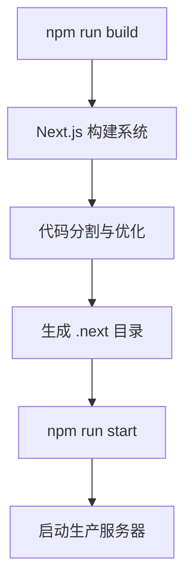
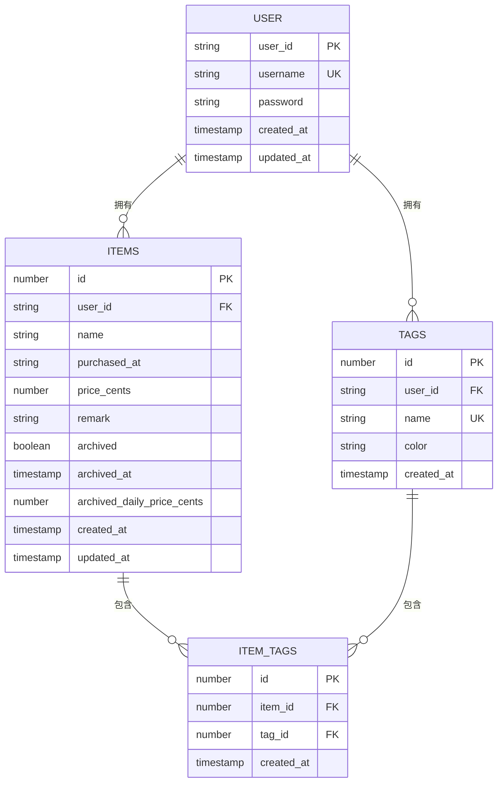
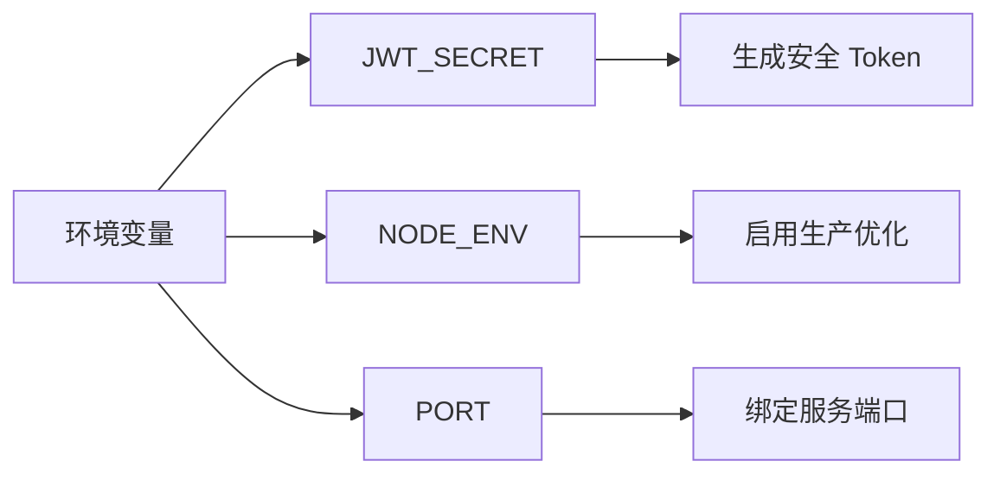
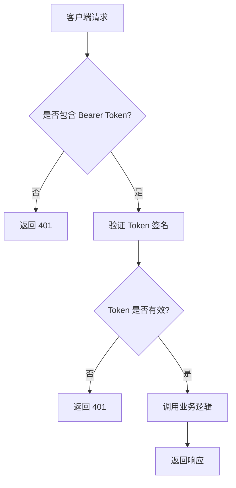

# 部署说明

<cite>
**本文档引用的文件**  
- [package.json](file://package.json)
- [next.config.ts](file://next.config.ts)
- [README.md](file://README.md)
- [lib/db/sqlite.ts](file://lib/db/sqlite.ts)
- [lib/auth/jwt.ts](file://lib/auth/jwt.ts)
- [app/api/auth/login/route.ts](file://app/api/auth/login/route.ts)
</cite>

## 目录

1. [简介](#简介)
2. [构建与优化](#构建与优化)
3. [静态资源服务](#静态资源服务)
4. [数据库持久化](#数据库持久化)
5. [部署平台选择](#部署平台选择)
6. [环境变量配置](#环境变量配置)
7. [安全性最佳实践](#安全性最佳实践)
8. [总结](#总结)

## 简介

本项目是一个基于 Next.js 16 的个人物品成本管理系统，采用单用户模式，使用 SQLite 作为本地数据库，并通过 JWT 实现认证机制。系统支持物品的增删改查、归档、成本计算等功能。本文档旨在指导如何将该项目部署到生产环境，涵盖构建、资源服务、数据库持久化、平台选择及安全配置等关键环节。

**Section sources**
- [README.md](file://README.md#L1-L137)

## 构建与优化

项目使用 `npm run build` 命令进行生产构建，该命令会调用 Next.js 的构建系统，生成优化后的静态资源和服务器端代码。构建过程包括代码分割、Tree Shaking、CSS 压缩、JavaScript 优化等，确保最终输出的资源体积最小化，加载性能最优。

构建完成后，所有静态资源将输出到 `.next` 目录中，可通过 `npm run start` 启动生产服务器。

**Diagram sources**
- [package.json](file://package.json#L7)
- [next.config.ts](file://next.config.ts#L3-L7)

**Section sources**
- [package.json](file://package.json#L5-L9)
- [README.md](file://README.md#L52-L57)

## 静态资源服务

Next.js 在生产模式下会自动处理静态资源的路由和服务。所有位于 `public` 目录下的文件（如图片、图标、字体等）将被直接映射到根路径下。例如，`public/vercel.svg` 可通过 `/vercel.svg` 访问。

构建后的静态资源（如 JS、CSS、图片等）由 Next.js 服务器自动缓存并提供高效服务，支持 HTTP/2 和 Gzip 压缩，提升加载速度。

**Section sources**
- [README.md](file://README.md#L63-L69)

## 数据库持久化

项目使用 SQLite 数据库存储数据，数据库文件位于 `data/bookkeeping.db`。`lib/db/sqlite.ts` 文件中定义了数据库路径和初始化逻辑，确保在首次运行时自动创建 `data` 目录和数据库文件。

**Diagram sources**
- [lib/db/sqlite.ts](file://lib/db/sqlite.ts#L6-L109)

**Section sources**
- [lib/db/sqlite.ts](file://lib/db/sqlite.ts#L6-L12)

## 部署平台选择

### VPS 部署（推荐）

对于需要持久化数据库的场景，推荐使用 VPS（如阿里云、腾讯云、DigitalOcean 等）。VPS 提供完整的操作系统环境，可确保 `data/bookkeeping.db` 文件在重启后依然存在。

部署步骤：
1. 上传代码到服务器
2. 安装 Node.js 和 npm
3. 运行 `npm install`
4. 执行 `npm run build`
5. 使用 `pm2` 或 `systemd` 启动 `npm run start`
6. 配置 Nginx 反向代理和 HTTPS

### Vercel 部署限制

Vercel 是一个无服务器（Serverless）平台，其文件系统为临时性，每次部署或函数调用后，写入的文件（如 `data/bookkeeping.db`）将被清除。因此，SQLite 数据库无法在 Vercel 上持久化，不适合本项目。

若需在 Vercel 部署，必须将数据库迁移到外部服务（如 Supabase、PlanetScale 或 Firebase）。

**Section sources**
- [README.md](file://README.md#L132)
- [lib/db/sqlite.ts](file://lib/db/sqlite.ts#L6-L7)

## 环境变量配置

项目依赖以下环境变量，应在生产环境中通过 `.env` 文件或平台环境变量配置：

| 环境变量 | 说明 | 示例 |
|--------|------|------|
| `JWT_SECRET` | JWT 签名密钥，必须为高强度随机字符串 | `your-very-secure-secret-key-here` |
| `NODE_ENV` | 环境模式 | `production` |
| `PORT` | 服务端口 | `3000` |

**注意**：`JWT_SECRET` 在 `lib/auth/jwt.ts` 中有默认值，但**生产环境必须覆盖**，否则存在安全风险。

**Diagram sources**
- [lib/auth/jwt.ts](file://lib/auth/jwt.ts#L5)

**Section sources**
- [lib/auth/jwt.ts](file://lib/auth/jwt.ts#L5)

## 安全性最佳实践

1. **JWT 密钥安全**：`JWT_SECRET` 必须使用高强度随机字符串，且不得提交到版本控制中。
2. **密码存储**：当前项目以明文存储密码（见 `users` 表），**仅适用于单用户个人项目**。若开放多用户注册，应使用哈希（如 bcrypt）加密密码。
3. **API 认证**：所有 API 路由均通过 `withAuth` 中间件保护，确保未授权访问被拒绝。
4. **输入验证**：所有 API 接口应增加输入验证（如使用 Zod），防止恶意数据注入。
5. **HTTPS 强制**：生产环境应通过 Nginx 或 CDN 强制启用 HTTPS。

**Diagram sources**
- [lib/auth/middleware.ts](file://lib/auth/middleware.ts#L8-L33)
- [app/api/auth/login/route.ts](file://app/api/auth/login/route.ts#L4-L47)

**Section sources**
- [lib/auth/jwt.ts](file://lib/auth/jwt.ts#L35-L46)
- [lib/auth/middleware.ts](file://lib/auth/middleware.ts#L8-L33)

## 总结

本项目适合部署在具有持久化文件系统的 VPS 环境中。构建过程简单，静态资源由 Next.js 自动优化。数据库使用 SQLite，需确保 `data` 目录可写且持久化。JWT 认证机制轻量高效，但需注意密钥和密码的安全配置。不推荐在 Vercel 等无服务器平台部署，除非迁移至外部数据库。