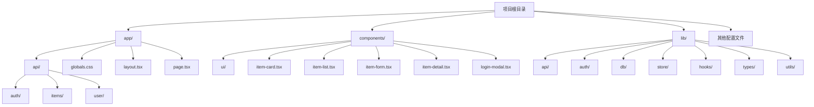
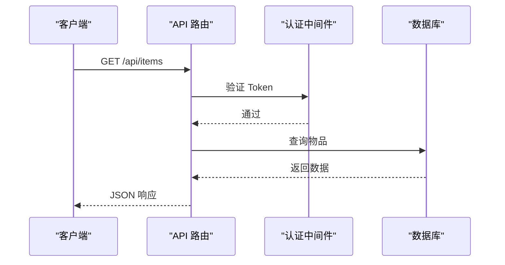
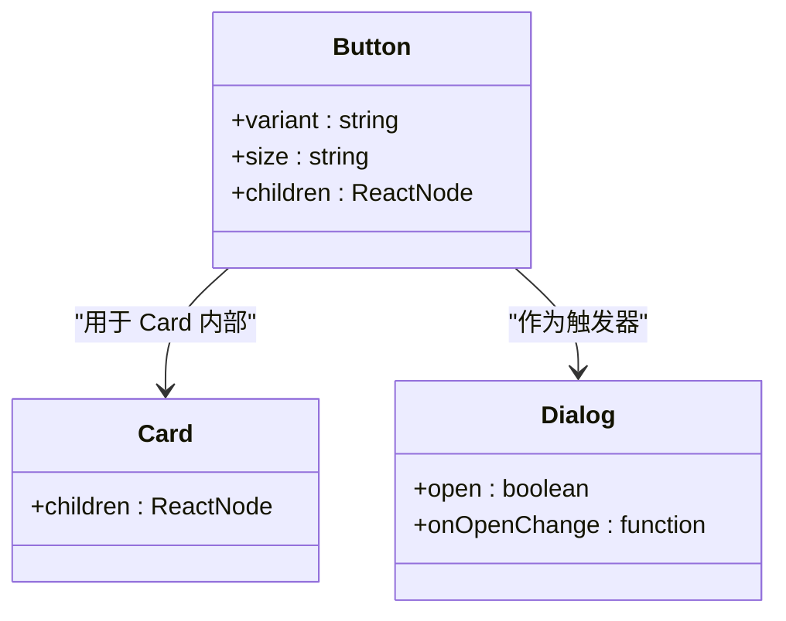
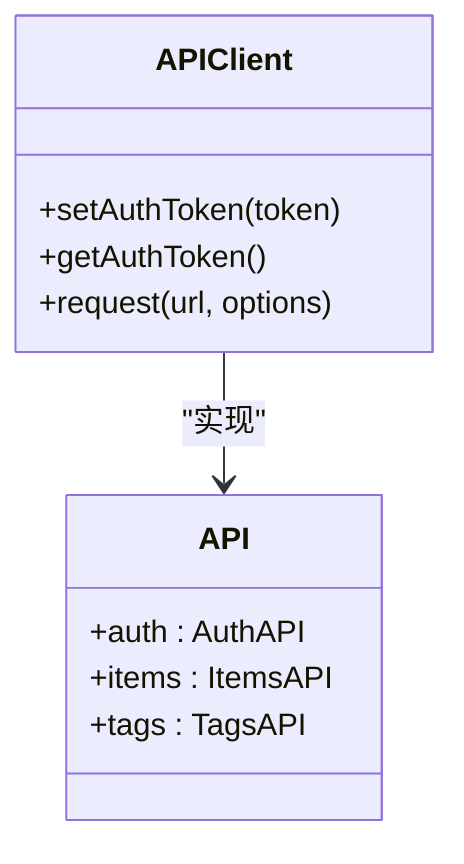
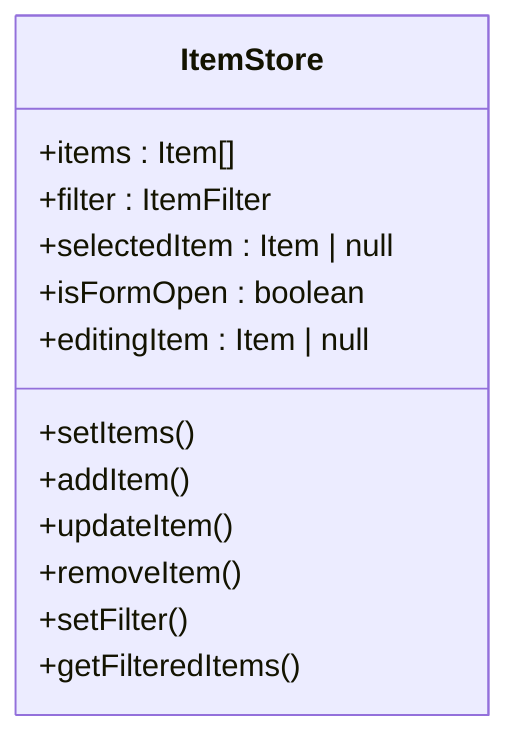
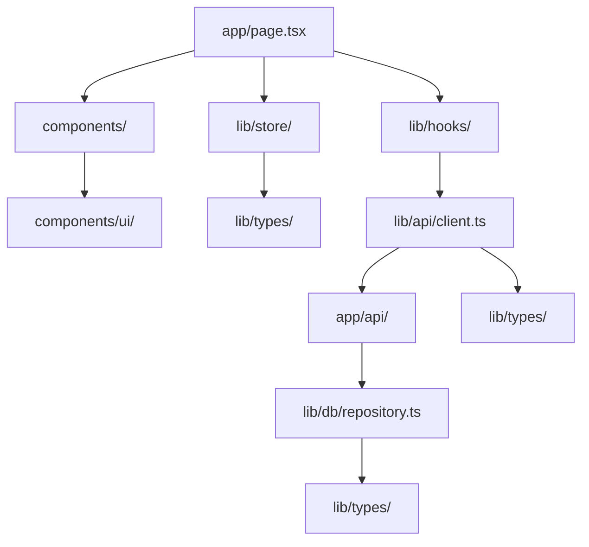

# 项目目录结构

<cite>
**本文档中引用的文件**  
- [app/page.tsx](file://app/page.tsx)
- [app/layout.tsx](file://app/layout.tsx)
- [app/globals.css](file://app/globals.css)
- [app/api/items/route.ts](file://app/api/items/route.ts)
- [app/api/auth/login/route.ts](file://app/api/auth/login/route.ts)
- [components/index.ts](file://components/index.ts)
- [components/ui/index.ts](file://components/ui/index.ts)
- [lib/api/client.ts](file://lib/api/client.ts)
- [lib/db/repository.ts](file://lib/db/repository.ts)
- [lib/store/item-store.ts](file://lib/store/item-store.ts)
- [lib/hooks/use-items.ts](file://lib/hooks/use-items.ts)
- [lib/types/index.ts](file://lib/types/index.ts)
- [package.json](file://package.json)
- [README.md](file://README.md)
</cite>

## 目录结构

本项目采用 Next.js 16 的 App Router 架构，结合 React 19 和 TypeScript，构建了一个前后端一体化的个人物品成本管理系统。项目结构清晰，职责分明，遵循现代前端工程化最佳实践。



**Diagram sources**
- [app/page.tsx](file://app/page.tsx#L1-L275)
- [components/index.ts](file://components/index.ts#L1-L11)
- [lib/types/index.ts](file://lib/types/index.ts#L1-L6)

**Section sources**
- [app/page.tsx](file://app/page.tsx#L1-L275)
- [components/index.ts](file://components/index.ts#L1-L11)
- [lib/types/index.ts](file://lib/types/index.ts#L1-L6)

## app/ 目录：Next.js 应用入口

`app/` 目录是 Next.js 应用的核心入口，采用 App Router 架构，负责页面路由、布局和 API 路由的定义。

### app/page.tsx：主页面组件

`page.tsx` 是应用的主页面组件，采用客户端组件（'use client'）实现交互逻辑。它通过 Zustand 状态管理器和自定义 Hook 协调 UI 状态与数据流，实现了物品的增删改查、归档、筛选等核心功能。

该组件通过导入 `useItemStore`、`useItems`、`useTags` 等状态和 Hook，实现了数据与视图的分离。页面根据用户认证状态（`useAuth`）决定渲染登录弹窗还是主界面，体现了清晰的控制流。

**Section sources**
- [app/page.tsx](file://app/page.tsx#L1-L275)

### app/layout.tsx：全局布局

`layout.tsx` 定义了应用的根布局，包含 HTML 文档结构、全局字体（Geist）和 CSS 变量。它通过 `children` prop 渲染所有页面内容，确保了应用的一致性外观。

```mermaid
graph TD
RootLayout[RootLayout] --> HTML[html lang="en"]
HTML --> Body[body]
Body --> Children[children]
```

**Diagram sources**
- [app/layout.tsx](file://app/layout.tsx#L1-L35)

**Section sources**
- [app/layout.tsx](file://app/layout.tsx#L1-L35)

### app/globals.css：全局样式

`globals.css` 文件定义了应用的全局样式和主题变量，采用 Notion 风格的配色方案。它通过 CSS 自定义属性（`--background`, `--foreground` 等）实现了深色/浅色模式的切换，并通过 `@media (prefers-color-scheme: dark)` 媒体查询适配系统偏好。

**Section sources**
- [app/globals.css](file://app/globals.css#L1-L38)

### app/api/ 目录：后端路由

`app/api/` 目录存放所有后端 API 路由，实现了前后端一体化架构。每个路由文件对应一个 API 端点，处理 HTTP 请求并返回 JSON 响应。

#### app/api/items/route.ts：物品管理 API

该文件实现了物品的 CRUD 操作。`GET` 方法获取物品列表（支持归档状态筛选），`POST` 方法创建新物品。所有路由都通过 `withAuth` 中间件进行认证保护，确保只有认证用户才能访问。



**Diagram sources**
- [app/api/items/route.ts](file://app/api/items/route.ts#L1-L75)

**Section sources**
- [app/api/items/route.ts](file://app/api/items/route.ts#L1-L75)

#### app/api/auth/login/route.ts：认证 API

该文件处理用户登录请求。它验证用户名和密码，生成 JWT Token 并返回给客户端。认证逻辑与数据库解耦，便于未来扩展。

**Section sources**
- [app/api/auth/login/route.ts](file://app/api/auth/login/route.ts#L1-L47)

## components/ 目录：可复用 UI 组件

`components/` 目录存放所有可复用的 React 组件，实现了 UI 与业务逻辑的分离。

### components/ui/：基础 UI 组件

该目录基于 shadcn/ui 构建，包含 `button.tsx`、`card.tsx`、`dialog.tsx` 等基础组件。这些组件通过 `index.ts` 文件统一导出，便于在项目中导入使用。



**Diagram sources**
- [components/ui/index.ts](file://components/ui/index.ts#L1-L23)

**Section sources**
- [components/ui/index.ts](file://components/ui/index.ts#L1-L23)

### 核心业务组件

- `item-card.tsx`：渲染单个物品的卡片视图
- `item-list.tsx`：展示物品列表，支持筛选
- `item-form.tsx`：物品创建/编辑表单
- `item-detail.tsx`：物品详情弹窗
- `login-modal.tsx`：登录弹窗，包含认证逻辑

这些组件通过 `components/index.ts` 文件统一导出，形成清晰的组件 API。

**Section sources**
- [components/index.ts](file://components/index.ts#L1-L11)

## lib/ 目录：业务逻辑与工具库

`lib/` 目录是应用的业务逻辑中心，包含 API 客户端、数据库操作、状态管理等核心模块。

### lib/api/client.ts：API 客户端

该模块封装了所有与后端的 HTTP 请求，提供了一个简洁的 `api` 对象，包含 `auth`、`items`、`tags` 等命名空间。它处理了 Token 管理、请求头设置、错误处理等通用逻辑。



**Diagram sources**
- [lib/api/client.ts](file://lib/api/client.ts#L1-L187)

**Section sources**
- [lib/api/client.ts](file://lib/api/client.ts#L1-L187)

### lib/db/repository.ts：数据库操作

该模块封装了对 SQLite 数据库的 CRUD 操作。它使用 `better-sqlite3` 驱动，通过预编译语句（prepared statements）提高性能和安全性。所有数据库操作都通过用户 ID 进行隔离，支持单用户模式。

**Section sources**
- [lib/db/repository.ts](file://lib/db/repository.ts#L1-L156)

### lib/store/item-store.ts：状态管理器

使用 Zustand 实现的全局状态管理器，集中管理物品列表、UI 状态（表单打开、详情打开等）和筛选条件。它提供了 `useItemStore` Hook 供组件订阅状态。



**Diagram sources**
- [lib/store/item-store.ts](file://lib/store/item-store.ts#L1-L114)

**Section sources**
- [lib/store/item-store.ts](file://lib/store/item-store.ts#L1-L114)

### lib/hooks/use-items.ts：自定义 Hook

封装了与物品数据交互的业务逻辑，通过调用 `api.client` 与后端通信。它提供了 `getAllItems`、`createItem`、`updateItem` 等函数，实现了数据获取与状态更新的分离。

**Section sources**
- [lib/hooks/use-items.ts](file://lib/hooks/use-items.ts#L1-L106)

### lib/types/：类型定义

集中管理 TypeScript 类型，通过 `index.ts` 文件统一导出 `Item`、`Tag` 等核心类型，确保类型在前后端之间的一致性。

**Section sources**
- [lib/types/index.ts](file://lib/types/index.ts#L1-L6)

## 层间依赖关系

项目各层之间存在清晰的依赖关系，体现了良好的分层架构：



**Diagram sources**
- [app/page.tsx](file://app/page.tsx#L1-L275)
- [lib/api/client.ts](file://lib/api/client.ts#L1-L187)
- [lib/db/repository.ts](file://lib/db/repository.ts#L1-L156)

**Section sources**
- [app/page.tsx](file://app/page.tsx#L1-L275)
- [lib/api/client.ts](file://lib/api/client.ts#L1-L187)
- [lib/db/repository.ts](file://lib/db/repository.ts#L1-L156)

## 总结

本项目采用 Next.js App Router 架构，实现了前后端一体化开发。`app/` 目录作为入口，`components/` 存放 UI 组件，`lib/` 封装业务逻辑，形成了清晰的三层架构。通过 Zustand 状态管理、自定义 Hook 和 API 路由，实现了高效的数据流和组件复用，为开发者提供了良好的代码组织和维护体验。